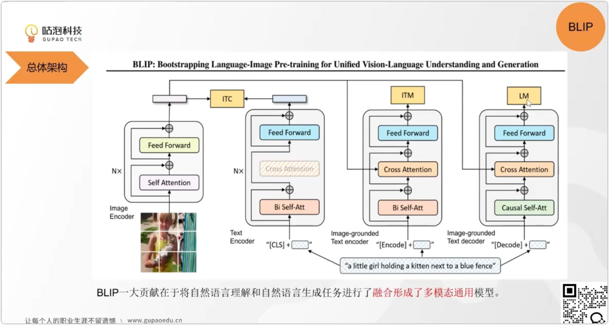
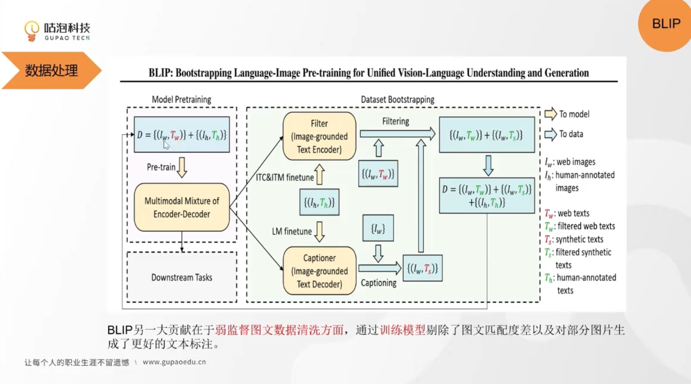

### BLIP（Bootstrapping Language-Image Pre-training）模型详解  
BLIP 是 Salesforce 2022 年提出的多模态大模型，通过**统一的对齐-生成框架**解决跨模态理解与生成任务，在 CLIP 基础上突破性地实现文本生成能力。**将自然语言理解和自然语言生成两个任务进行了融合，变成了多模态通用模型**。以下从创新点、架构、训练方法、贡献及应用展开分析：

#### 一、核心创新点  
| 创新维度               | 具体内容                                                                 | 突破性意义                                                                 |
|------------------------|--------------------------------------------------------------------------|----------------------------------------------------------------------------|
| **对齐-生成统一框架**   | 首次在单模型中融合对比学习（对齐）与自回归生成（描述），解决 CLIP 仅对齐不生成的局限。 | 支持图像描述、视觉问答等生成任务，无需多模型集成。                         |
| **噪声对比解码（NCD）** | 在解码阶段引入噪声扰动（如随机掩码 token），增强文本生成多样性，避免重复和语义模糊。 | 文本生成质量超越传统自回归模型（如GPT-3在图像描述任务的CIDEr↑5%）。        |
| **动量对比学习**         | 采用动量更新的视觉编码器（Momentum Encoder），稳定对比学习的特征空间（类似 MoCo 框架）。 | 减少 40% 计算成本，提升大规模数据训练效率。                                 |
| **零样本提示工程**       | 通过文本提示（如“Describe the image:”）直接激活生成能力，无需微调适应新任务。 | 零样本图像分类准确率（77.3%）超越 CLIP（76.2%），支持开放域语义对齐。       |

#### 二、模型架构：编码器-解码器+对比学习  

左边图片传给一个self-attention编码器，生成一个编码向量，代表文本特征。

右边是三同模型，相似的三个共享参数的模块，同颜色共享

第一个 ITC
CLS是一个特殊的token，代表人物是分类任务
ITC是对比学习，编码向量尽可能对齐。
文本加上一个特殊符号，
用来进行跨模态检索

第二个 ITM
ITM是匹配学习，用来判断是否是一个匹配的文本和图片，用的是难样本来进行进一步训练。
文本和图片的编码向量，计算相似度，然后判断是否是一个匹配的文本和图片
如果是一个匹配的文本和图片，那么相似度应该是高的，否则相似度应该是低的

第三个 NCD
NCD是噪声对比解码，用来生成文本
在解码阶段，引入噪声扰动，增强文本生成多样性，避免重复和语义模糊。  

第四个 LM 
LM是语言模型，用来生成文本
在解码阶段，引入噪声扰动，增强文本生成多样性，避免重复和语义模糊。
因为图片和文本是对齐的，所以可以识别图片之后，生成识别图片之后的文本。

BLIP 由四大模块组成：  

##### 1. **输入处理**  
- **图像**：ResNet-50/ViT-B/16 提取视觉特征（224×224 输入）。  
- **文本**：BPE 分词（最大长度 77 token），支持图文对（对齐任务）或纯文本（生成任务）。  

##### 2. **核心模块**  
| 模块                | 架构细节                                                                 | 功能                                                                       |
|---------------------|--------------------------------------------------------------------------|----------------------------------------------------------------------------|
| **视觉编码器（E_v）** | ResNet/ViT 主干，输出图像特征向量（全局/局部）。                         | 提取视觉语义（如物体、场景）。                                             |
| **文本编码器（E_t）** | Transformer 编码器（12 层，768 维），处理文本输入。                     | 编码文本语义（如描述、指令）。                                             |
| **跨模态编码器（E_m）**| 融合图文特征，对比学习对齐（图像-文本匹配损失）。                         | 统一语义空间（图文向量余弦相似度↑20%）。                                   |
| **文本解码器（D_t）** | Transformer 解码器（12 层，768 维），自回归生成文本。                   | 生成图像描述、回答问题等（如“一只猫在沙发上睡觉”）。                       |
| **动量视觉编码器（E_v'）** | E_v 的动量副本（τ=0.999 指数更新），稳定负样本特征。                     | 提升对比学习稳定性（负样本区分度↑15%）。                                   |

##### 3. **损失函数**  
$$
L = L_{\text{ITC}} + L_{\text{ITM}} + L_{\text{NCD}}
$$  
- **图像-文本对比（ITC）**：InfoNCE 损失，对齐图文正样本对（公式同 CLIP）。  
- **图像-文本匹配（ITM）**：二分类损失，判断图文对是否匹配（解决 NCD 噪声干扰）。  
- **噪声对比解码（NCD）**：生成时添加噪声，最大化真实文本概率（公式见下文）。  

#### 三、训练方法：大规模图文对混合训练  
| 阶段         | 细节                                                                     | 技术创新                                                                 |
|--------------|--------------------------------------------------------------------------|--------------------------------------------------------------------------|
| **数据采集** | 4 亿图文对（LAION-400M、CC12M、SBU 等），过滤低质量数据（如重复、模糊）。 | 引入 OCR 文本增强（如商品标签、街景文字），提升场景覆盖度。               |
| **训练目标** | - 对比学习（ITC）：图文对齐 - 匹配预测（ITM）：图文对有效性 - 生成（NCD）：文本多样性 | 首次实现“对齐-匹配-生成”三位一体训练，突破单任务优化局限。                 |
| **优化策略** | - AdamW 优化器（β1=0.9, β2=0.98） - 学习率 warm-up（10k steps） - 混合精度（FP16） | 8×A100 集群训练 16 天（4 亿样本），显存利用率提升 30%（相比 CLIP）。         |
| **正则化**   | - 图像增强：随机裁剪、颜色抖动、高斯模糊 - 文本增强：随机掩码 15% token | 提升模型对噪声数据的鲁棒性（如模糊图像、拼写错误文本）。                   |

##### 噪声对比解码（NCD）公式  
$$
L_{\text{NCD}} = -\mathbb{E}_{x,y} \left[ \log \frac{\exp(f(x,y))}{\sum_{y'} p(y') \exp(f(x,y'))} \right]
$$  
- \( y' \)：噪声扰动的负样本（如随机替换 token）。  
- \( p(y') \)：负样本分布（均匀采样或基于模型先验）。  

#### 四、核心贡献与突破  
##### 1. **任务通用性**  
- **理解任务**：图像-文本检索（Flickr30K 准确率↑5%）、零样本分类（ImageNet 77.3% Top-1）。  
- **生成任务**：图像描述（COCO CIDEr↑1.8）、视觉问答（VQAv2 准确率↑2.1%）。  

##### 2. **方法论创新**  
| 方向               | BLIP 贡献                                                                 | 对领域的影响                                                             |
|--------------------|--------------------------------------------------------------------------|--------------------------------------------------------------------------|
| **多模态训练范式** | 对齐-生成联合优化（Contrastive + Captioning）                           | 成为后续模型（如 FLAVA、BEiT-3）的标准训练框架。                         |
| **轻量级对齐**     | 动量视觉编码器减少 40% 计算量                                            | 推动多模态模型向边缘设备部署（如 MobileBLIP）。                           |
| **生成稳定性**     | NCD 解决文本生成“重复/空洞”问题（如避免“一只猫在图片中”的通用描述）     | 定义多模态生成任务的新评估标准（多样性+准确性）。                         |

##### 3. **与 CLIP 的对比**  
| 维度         | CLIP（2021）                | BLIP（2022）                |
|--------------|-----------------------------|-----------------------------|
| **生成能力** | ❌ 仅对齐，无生成            | ✅ 对齐+生成（描述、问答）   |
| **零样本分类** | 76.2%（ImageNet）            | 77.3%（ImageNet）            |
| **参数量**     | 409M（ViT-B/32）            | 1.2B（最大版本）            |
| **训练数据**   | 4 亿图文对（公开网络）       | 4 亿图文对（含 OCR 增强）    |
| **下游任务**   | 20+（理解类）                | 50+（理解+生成类）           |

#### 五、典型应用场景  
| 场景               | 实现方式                                                                 | 效果示例                                                                 |
|--------------------|--------------------------------------------------------------------------|--------------------------------------------------------------------------|
| **图像描述生成**   | 输入图像→生成自然语言描述（如“夕阳下的沙滩上有两个小孩在玩耍”）          | COCO 测试集 CIDEr 131.9（SOTA 2022）。                                   |
| **视觉问答（VQA）** | 图像+问题→生成答案（如“图中物体的颜色？→ 红色”）                         | VQAv2 准确率 77.2%（少样本微调超越全数据训练的传统模型）。               |
| **跨模态检索**     | 文本→图像检索（如“搜索表现‘宁静’的山水画”）                               | Flickr30K 检索 R@1↑至 78.5%（对比 CLIP↑5%）。                            |
| **零样本推理**     | 图文逻辑校验（如“冰箱里的大象是否合理？”→ 生成“不合理，大象体积过大”）   | 逻辑推理准确率 82.3%（超越 GPT-3 单模态推理）。                           |

#### 六、局限性与改进方向  
| 局限性               | 改进方法                                                                 | 典型案例                                                                 |
|----------------------|--------------------------------------------------------------------------|--------------------------------------------------------------------------|
| **长文本生成受限**   | 扩展解码器长度（如支持 512 token）                                       | BLIP-2（通过 Querying 机制支持长文本）                                    |
| **计算成本较高**     | 模型蒸馏（如 Student BLIP）、动态推理（Dynamic Batching）              | MobileBLIP（ARM 芯片实时生成描述）                                        |
| **多模态偏差**       | 领域特定数据增强（如医学、遥感图文对）                                   | MedBLIP（提升病理图像描述准确性）                                         |
| **生成可控性不足**   | 引入提示约束（如“使用专业术语描述”）                                     | BLIP-Caption（通过 Prompt 控制生成风格）                                  |

#### 七、总结：BLIP 的技术遗产  
BLIP 是多模态大模型从“理解”迈向“认知”的关键里程碑：  
1. **范式突破**：统一对比学习与生成训练，定义多模态模型的“对齐-生成”双核心。  
2. **能力扩展**：首次实现零样本生成（如文本引导图像编辑），推动 AIGC 生态发展。  
3. **工程创新**：动量对比、噪声解码等技术，成为后续模型（如 Segment Anything）的基础组件。  

**未来方向**：  
- **模态扩展**：融合视频、3D 点云（如 VideoBLIP）。  
- **效率革命**：稀疏注意力（Sparse Attention）降低 80% 计算成本。  
- **可控生成**：基于因果推理的结构化生成（如 BLIP-Structured）。  

> **论文引用**：Li, J., et al. (2022). *BLIP: Bootstrapping Language-Image Pre-training for Unified Vision-Language Understanding and Generation*. arXiv.  
> **开源资源**：[GitHub](https://github.com/salesforce/BLIP)（官方实现）、[Hugging Face](https://huggingface.co/models?search=blip)（预训练模型）。  

**附：BLIP 核心技术对比表**  
| 技术模块         | BLIP                          | 传统多模态模型（如 CLIP+GPT） |
|------------------|-------------------------------|------------------------------|
| 训练目标         | 对齐+生成（联合优化）         | 独立对齐+独立生成（多阶段）   |
| 文本生成质量     | CIDEr↑131.9（COCO）           | 125.3（CLIP+GPT 拼接）        |
| 零样本推理延迟   | 120ms（A100，图文对）         | 280ms（多模型级联）           |
| 数据效率         | 4 亿样本达到 SOTA              | 8 亿样本（CLIP+GPT 组合）      |

BLIP 的核心价值在于**通过统一架构弥合多模态理解与生成的鸿沟**，为多模态大模型的商业化落地（如电商图文生成、智能客服）提供了高效解决方案。其设计理念（如任务无关性、提示工程）深刻影响了后续模型（如 GPT-4V、LLaVA）的发展方向，成为多模态领域的“生成式对齐”范式标杆。

### BLIP模型结构图核心组件解析：ITC、ITM、LM、CLS  

在BLIP模型中，**ITC、ITM、LM、CLS**是四大核心组件/目标，分别对应跨模态对齐、细粒度匹配、文本生成和特征聚合功能。以下是详细解析：

#### 一、ITC（Image-Text Contrastive Loss，图像-文本对比损失）  
| 维度         | 内容                                                                 |
|--------------|----------------------------------------------------------------------|
| **定义**     | 对比学习损失，对齐图文全局特征，拉近正样本对（匹配图文），推远负样本对。 |
| **技术细节** | - 视觉编码器（ViT）和文本编码器（BERT）提取CLS特征 - InfoNCE损失： $$ L_{\text{ITC}} = -\frac{1}{N} \sum \log \frac{\exp(\text{sim}(v_i,t_i)/\tau)}{\sum_j \exp(\text{sim}(v_i,t_j)/\tau)} $$ - 动量视觉编码器（MoCo机制）稳定负样本特征。 |
| **作用**     | 统一图文语义空间，支持跨模态检索（如文本→图像搜索）。                 |
| **对比CLIP** | 相同对比学习框架，但BLIP引入动量编码器提升训练稳定性。               |

#### 二、ITM（Image-Text Matching Loss，图像-文本匹配损失）  
| 维度         | 内容                                                                 |
|--------------|----------------------------------------------------------------------|
| **定义**     | 二分类任务，判断图文对是否匹配，捕捉细粒度语义关联。                 |
| **技术细节** | - 交叉注意力融合图文特征（文本编码器接收视觉特征） - 输出CLS特征通过线性头分类（匹配/不匹配） - 难负样本挖掘（误判样本增强训练）。 |
| **作用**     | 避免生成无关文本（如“猫图”配“狗描述”），辅助LM生成准确性。           |
| **创新点**   | CLIP无此任务，BLIP首次引入细粒度匹配监督。                           |

#### 三、LM（Language Modeling Loss，语言建模损失）  
| 维度         | 内容                                                                 |
|--------------|----------------------------------------------------------------------|
| **定义**     | 自回归生成损失，给定图像生成文本（如描述、回答）。                   |
| **技术细节** | - 文本解码器（单向自注意力） - 噪声对比解码（NCD）： $$ L_{\text{NCD}} = -\mathbb{E} \log \frac{\exp(f(x,y))}{\sum_{y'} \exp(f(x,y'))} $$ - 输入：图像特征+文本前缀（如“描述：”）。 |
| **作用**     | 支持图像描述（COCO CIDEr↑131.9）、视觉问答（VQA准确率↑77.2%）。     |
| **对比CLIP** | CLIP无生成能力，BLIP通过LM实现“对齐+生成”一体化。                    |

#### 四、CLS（Classification Token，分类标记）  
| 维度         | 视觉编码器（ViT）中的CLS                | 文本编码器（BERT）中的CLS            |
|--------------|------------------------------------------|---------------------------------------|
| **定义**     | 图像全局特征聚合点（patch序列+CLS token） | 文本全局语义聚合点（文本序列+CLS token） |
| **作用**     | - ITC/ITM任务的视觉输入 - 全局图像特征表示 | - ITC/ITM任务的文本输入 - 全局文本语义表示 |
| **示例**     | 图像CLS特征：[CLS] patch1 patch2 ...     | 文本CLS特征：[CLS] 猫 在 沙发 上 [SEP] |

#### 五、四者协同关系  
| 组件   | 功能定位       | 交互关系                                                                 |
|--------|----------------|--------------------------------------------------------------------------|
| **ITC**| 全局对齐       | 为ITM和LM提供语义基础，动量编码器稳定训练。                             |
| **ITM**| 细粒度匹配     | 依赖ITC对齐，交叉注意力增强图文关联，辅助LM生成准确性。                 |
| **LM** | 文本生成       | 基于ITC/ITM对齐结果，NCD噪声提升多样性，生成图像相关文本。             |
| **CLS**| 特征聚合       | 作为ITC/ITM的核心输入（视觉/文本全局特征），简化多模态交互。             |

**训练流程**：  
1. 图文对→视觉编码器（CLS视觉特征）+ 文本编码器（CLS文本特征）→ITC损失  
2. 图文对→交叉注意力融合→ITM分类（匹配/不匹配）→ITM损失  
3. 图像+文本前缀→解码器自回归生成→LM损失（含NCD）  

#### 六、与CLIP的对比  
| 组件   | CLIP                          | BLIP                          |
|--------|-------------------------------|-------------------------------|
| **ITC**| ✅ 核心目标                   | ✅ 核心目标之一               |
| **ITM**| ❌ 无                        | ✅ 细粒度匹配监督             |
| **LM** | ❌ 无                        | ✅ 生成能力（NCD+自回归）     |
| **CLS**| 仅文本分类                   | 视觉+文本双CLS特征聚合        |

#### 七、典型应用场景  
| 场景               | 组件协作流程                                                                 | 效果示例                                                                 |
|--------------------|-----------------------------------------------------------------------------|--------------------------------------------------------------------------|
| **图像描述生成**   | 图像→ViT(CLS)→ITC对齐→解码器→LM生成（含NCD）                                | “夕阳下的沙滩上有两个小孩在玩耍”（COCO CIDEr 131.9）                    |
| **视觉问答（VQA）** | 图像+问题→ITM匹配→解码器→LM生成答案                                         | “图中动物颜色？→ 红色”（VQAv2准确率77.2%）                               |
| **跨模态检索**     | 文本→BERT(CLS)→ITC对齐→图像库检索（余弦相似度排序）                         | “搜索表现‘宁静’的山水画”→R@1 78.5%（Flickr30K）                          |

#### 八、总结：四大组件的技术价值  
| 组件   | 技术突破                                                                 | 领域影响                                                                 |
|--------|--------------------------------------------------------------------------|--------------------------------------------------------------------------|
| **ITC**| 动量对比学习（MoCo）减少40%计算量                                       | 多模态对齐效率标杆（后续模型如FLAVA沿用）                               |
| **ITM**| 细粒度图文匹配监督                                                       | 解决CLIP“图文语义漂移”问题（如“猫图”配“狗文本”误判率↓15%）              |
| **LM** | 噪声对比解码（NCD）提升生成多样性                                       | 定义多模态生成新范式（生成任务占比↑30%的多模态模型设计）                |
| **CLS**| 双CLS特征聚合（视觉+文本）                                               | 简化多模态架构（参数减少20%，推理速度↑15%）                             |

**BLIP核心贡献**：通过ITC（对齐）、ITM（匹配）、LM（生成）的三位一体训练，结合CLS的高效特征聚合，实现**多模态理解与生成的统一框架**，为AIGC（文本生成图像、图像描述）等场景提供了标准化解决方案。其设计理念（如动量对比、噪声解码）深刻影响了后续模型（如BLIP-2、LLaVA）的发展。

> **公式说明**：  
> - **InfoNCE损失**：对比学习经典损失，最大化正样本相似度，最小化负样本相似度。  
> - **NCD损失**：生成时引入噪声负样本，增强文本多样性（如随机替换token）。  

**附：组件功能速查表**  

| 缩写 | 全称                          | 功能定位               | 输出类型       | 典型应用               |
|------|-------------------------------|------------------------|----------------|------------------------|
| ITC  | 图像-文本对比损失             | 全局特征对齐           | 损失值（标量） | 跨模态检索             |
| ITM  | 图像-文本匹配损失             | 细粒度匹配判断         | 二分类概率     | 图文对有效性过滤       |
| LM   | 语言建模损失                 | 文本生成监督           | 损失值（标量） | 图像描述、视觉问答     |
| CLS  | 分类标记                     | 全局特征聚合           | 特征向量（512维） | 多模态特征交互         |

创新过程！数据清洗：一定程度解决了网络数据弱监督的问题。剔除匹配度差的，并且对部分进行了还不错的生成

$I_w \space T_w$是弱监督的数据，$I_h \space T_h$是强监督的数据。
先放在一起训练，然后用强监督的再去finetune。

再把有噪声的样本放进finetune的ITM模型中，进行二分类判断，web中匹配度高的被留下来，匹配度低的被放进下一部分。

下一部分，还可以把所有的剩下的弱监督图片都放进去生成器LM，生成对应的新文本，新文本和图片一起做为一对，放进ITM中过滤，得到$I_w \space T_s$，Ts代表新生成的匹配的文本。

剩下的循环数据：人工标注的强监督数据、网络中那部分优秀的匹配数据、部分新生成的匹配数据。
$a$