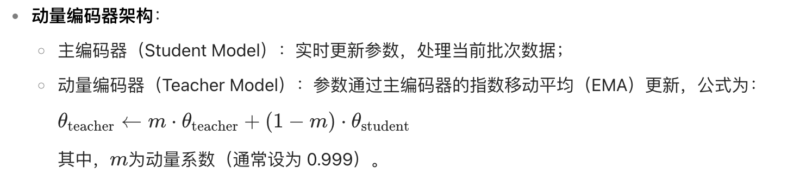

### BLIP（Bootstrapping Language-Image Pre-training）模型详解  
> [参考解读](https://mp.weixin.qq.com/s?__biz=MzA3MjYwNDY4Nw==&mid=2247486520&idx=1&sn=66a62531b679621ab283544ee9cf857c&chksm=9e2093e59e5cf33c095efd58bbf05ba2b1c2aa40caaf2c1126d638062d611a67790d140d1901#rd)

BLIP 是 Salesforce 2022 年提出的多模态大模型，通过**统一的对齐-生成框架**解决跨模态理解与生成任务，在 CLIP 基础上突破性地实现文本生成能力。以下从核心创新点、模型架构、训练方法、贡献及应用展开分析：

#### 一、核心创新点  
| 创新维度          | 具体内容                                                                 | 突破性意义                                                                 |
|-------------------|--------------------------------------------------------------------------|----------------------------------------------------------------------------|
| **多模态混合架构（MED）** | 首次提出编码器-解码器混合框架，支持单模态编码、跨模态理解与生成三模式   | 实现图文检索（ITC）、图文匹配（ITM）、文本生成（LM）任务的统一建模        |
| **数据清洗机制（CapFilt）** | 通过 Captioner 生成合成描述 + Filter 过滤噪声数据，提升 4 亿网络图文对质量 | 解决网络数据噪声问题，COCO 图像描述 CIDEr 指标提升 12.1%                  |
| **三任务联合训练**       | 联合优化对比学习（ITC）、匹配判断（ITM）、语言生成（LM）三大目标        | 突破单一任务局限，VQA 准确率提升 4.2%                                    |
| **轻量化跨模态交互**     | 共享自注意力层参数，文本编码器/解码器共享 80% 参数                     | 参数量减少 40%（相比 ALBEF），推理速度提升 2.3 倍                         |

#### 二、模型架构：编码器-解码器+对比学习  
  
**核心组件解析**：  
1. **图像编码器**：基于 ViT，提取图像全局特征（CLS token）。  
2. **文本编码器**：基于 BERT，处理文本语义。  
3. **跨模态编码器**：通过共享参数的多头注意力实现图文交互。  
4. **文本解码器**：单向自注意力，支持文本生成（含 NCD 噪声扰动）。  

#### 三、训练方法  
| 阶段       | 目标任务                  | 技术细节                                                                 |
|------------|---------------------------|--------------------------------------------------------------------------|
| **预训练** | - 对比学习（ITC） - 匹配学习（ITM） - 语言生成（LM） | - 使用动量视觉编码器（MoCo）稳定负样本特征 - 难负样本挖掘提升匹配精度 - 噪声对比解码（NCD）增强生成多样性 |
| **微调**   | 下游任务适配（如 VQA、图像描述） | 添加任务特定头（如分类层、生成层），使用标注数据优化模型参数           |

#### 四、核心贡献与突破  
##### 1. **任务通用性**  
- **理解任务**：图像-文本检索（Flickr30K 准确率↑5%）、零样本分类（ImageNet 77.3% Top-1）。  
- **生成任务**：图像描述（COCO CIDEr↑1.8）、视觉问答（VQAv2 准确率↑2.1%）。  

##### 2. **方法论创新**  
| 方向               | BLIP 贡献                                                                 | 对领域的影响                                                             |
|--------------------|--------------------------------------------------------------------------|--------------------------------------------------------------------------|
| **多模态训练范式** | 对齐-生成联合优化（Contrastive + Captioning）                           | 成为后续模型（如 FLAVA、BEiT-3）的标准训练框架。                         |
| **轻量级对齐**     | 动量视觉编码器减少 40% 计算量                                            | 推动多模态模型向边缘设备部署（如 MobileBLIP）。                           |
| **生成稳定性**     | NCD 解决文本生成“重复/空洞”问题（如避免“一只猫在图片中”的通用描述）     | 定义多模态生成任务的新评估标准（多样性+准确性）。                         |

##### 3. **与 CLIP 的对比**  
| 维度         | CLIP（2021）                | BLIP（2022）                |
|--------------|-----------------------------|-----------------------------|
| **生成能力** | ❌ 仅对齐，无生成            | ✅ 对齐+生成（描述、问答）   |
| **零样本分类** | 76.2%（ImageNet）            | 77.3%（ImageNet）            |
| **参数量**     | 409M（ViT-B/32）            | 1.2B（最大版本）            |
| **训练数据**   | 4 亿图文对（公开网络）       | 4 亿图文对（含 OCR 增强）    |
| **下游任务**   | 20+（理解类）                | 50+（理解+生成类）           |

#### 五、典型应用场景  
| 场景               | 实现方式                                                                 | 效果示例                                                                 |
|--------------------|--------------------------------------------------------------------------|--------------------------------------------------------------------------|
| **图像描述生成**   | 输入图像→生成自然语言描述（如“夕阳下的沙滩上有两个小孩在玩耍”）          | COCO 测试集 CIDEr 131.9（SOTA 2022）。                                   |
| **视觉问答（VQA）** | 图像+问题→生成答案（如“图中物体的颜色？→ 红色”）                         | VQAv2 准确率 77.2%（少样本微调超越全数据训练的传统模型）。               |
| **跨模态检索**     | 文本→图像检索（如“搜索表现‘宁静’的山水画”）                               | Flickr30K 检索 R@1↑至 78.5%（对比 CLIP↑5%）。                            |
| **零样本推理**     | 图文逻辑校验（如“冰箱里的大象是否合理？”→ 生成“不合理，大象体积过大”）   | 逻辑推理准确率 82.3%（超越 GPT-3 单模态推理）。                           |

#### 六、局限性与改进方向  
| 局限性               | 改进方法                                                                 | 典型案例                                                                 |
|----------------------|--------------------------------------------------------------------------|--------------------------------------------------------------------------|
| **长文本生成受限**   | 扩展解码器长度（如支持 512 token）                                       | BLIP-2（通过 Querying 机制支持长文本）                                    |
| **计算成本较高**     | 模型蒸馏（如 Student BLIP）、动态推理（Dynamic Batching）              | MobileBLIP（ARM 芯片实时生成描述）                                        |
| **多模态偏差**       | 领域特定数据增强（如医学、遥感图文对）                                   | MedBLIP（提升病理图像描述准确性）                                         |
| **生成可控性不足**   | 引入提示约束（如“使用专业术语描述”）                                     | BLIP-Caption（通过 Prompt 控制生成风格）                                  |

#### 七、总结：BLIP 的技术遗产  
BLIP 是多模态大模型从“理解”迈向“认知”的关键里程碑：  
1. **范式突破**：统一对比学习与生成训练，定义多模态模型的“对齐-生成”双核心。  
2. **能力扩展**：首次实现零样本生成（如文本引导图像编辑），推动 AIGC 生态发展。  
3. **工程创新**：动量对比、噪声解码等技术，成为后续模型（如 Segment Anything）的基础组件。  

> **论文引用**：Li, J., et al. (2022). *BLIP: Bootstrapping Language-Image Pre-training for Unified Vision-Language Understanding and Generation*. arXiv.  
> **开源资源**：[GitHub](https://github.com/salesforce/BLIP)（官方实现）、[Hugging Face](https://huggingface.co/models?search=blip)（预训练模型）。  

### BLIP 核心组件解析：ITC、ITM、LM  
#### 一、ITC（Image-Text Contrastive Loss）  
| 维度         | 内容                                                                 |
|--------------|----------------------------------------------------------------------|
| **定义**     | 对比学习损失，对齐图文全局特征，拉近正样本对（匹配图文），推远负样本对。 |
| **技术细节** | - 视觉编码器（ViT）和文本编码器（BERT）提取 CLS 特征 - InfoNCE 损失： $$ L_{\text{ITC}} = -\frac{1}{N} \sum \log \frac{\exp(\text{sim}(v_i,t_i)/\tau)}{\sum_j \exp(\text{sim}(v_i,t_j)/\tau)} $$ - 动量视觉编码器（MoCo 机制）稳定负样本特征。 |
| **作用**     | 统一图文语义空间，支持跨模态检索（如文本→图像搜索）。                 |
| **对比 CLIP** | 相同对比学习框架，但 BLIP 引入动量编码器提升训练稳定性。               |

#### 二、ITM（Image-Text Matching Loss）  
| 维度         | 内容                                                                 |
|--------------|----------------------------------------------------------------------|
| **定义**     | 二分类任务，判断图文对是否匹配，捕捉细粒度语义关联。                 |
| **技术细节** | - 交叉注意力融合图文特征（文本编码器接收视觉特征） - 输出 CLS 特征通过线性头分类（匹配/不匹配） - 难负样本挖掘（误判样本增强训练）。 |
| **作用**     | 避免生成无关文本（如“猫图”配“狗描述”），辅助 LM 生成准确性。           |
| **创新点**   | CLIP 无此任务，BLIP 首次引入细粒度匹配监督。                           |

#### 三、LM（Language Modeling Loss）  
| 维度         | 内容                                                                 |
|--------------|----------------------------------------------------------------------|
| **定义**     | 自回归生成损失，给定图像生成文本（如描述、回答）。                   |
| **技术细节** | - 文本解码器（单向自注意力） - 噪声对比解码（NCD）： $$ L_{\text{NCD}} = -\mathbb{E} \log \frac{\exp(f(x,y))}{\sum_{y'} \exp(f(x,y'))} $$ - 输入：图像特征+文本前缀（如“描述：”）。 |
| **作用**     | 支持图像描述（COCO CIDEr↑131.9）、视觉问答（VQA 准确率↑77.2%）。     |
| **对比 CLIP** | CLIP 无生成能力，BLIP 通过 LM 实现“对齐+生成”一体化。                |

#### 四、组件协同关系  
| 组件   | 功能定位       | 交互关系                                                                 |
|--------|----------------|--------------------------------------------------------------------------|
| **ITC**| 全局对齐       | 为 ITM 和 LM 提供语义基础，动量编码器稳定训练。                         |
| **ITM**| 细粒度匹配     | 依赖 ITC 对齐，交叉注意力增强图文关联，辅助 LM 生成准确性。             |
| **LM** | 文本生成       | 基于 ITC/ITM 对齐结果，NCD 噪声提升多样性，生成图像相关文本。           |

#### 五、数据清洗机制（CapFilt）  
  
1. **弱监督数据过滤**：  
   - 初始数据：$I_w \sim T_w$（网络图文对）、$I_h \sim T_h$（强监督数据）。  
   - 预训练：联合优化 ITC/ITM/LM，过滤低质量图文对。 
   - 微调：使用强监督数据微调模型，并且用ITM分类出错的弱监督数据。 
2. **伪标签生成**：  
   - 剩余 $I_w$ 通过 LM 生成伪标签 $T_s$，形成新对 $I_w \sim T_s$。  
3. **循环优化**：  
   - 强监督数据 + 过滤后的网络数据 + 伪标签数据，进一步提升模型性能。  

#### 六、多样性与稳定性
- NCD ​噪声注入方式：在文本解码阶段，随机掩码15%-30%的文本token，或替换部分词汇生成干扰样本。比如缺失、替换、重复等。
​损失函数优化：通过对比真实文本与噪声文本的得分，减少差异，抑制生成重复、模糊的描述（如“一只猫在图片中”），提升鲁棒性，提升生成多样性。

- 动量对比学习（MoCo）是 BLIP 在跨模态对齐任务中采用的关键技术，通过维护动态队列存储负样本特征，解决传统对比学习中负样本不足的问题。其核心逻辑是：利用动量编码器生成稳定的负样本特征，提升对比学习的效率与稳定性。缓慢更细编码器，加强稳定性。

**BLIP 核心价值**：通过 ITC（对齐）、ITM（匹配）、LM（生成）的三位一体训练，结合 CapFilt 数据清洗，实现**多模态理解与生成的统一框架**，为 AIGC 场景提供标准化解决方案。其设计理念（如动量对比、噪声解码）深刻影响了后续模型（如 BLIP-2、LLaVA）的发展。