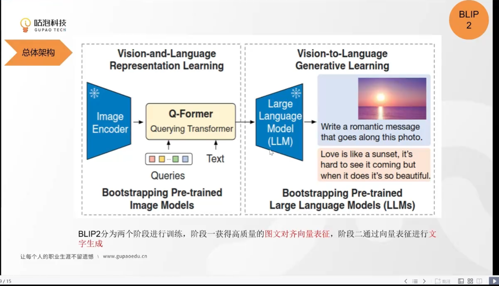
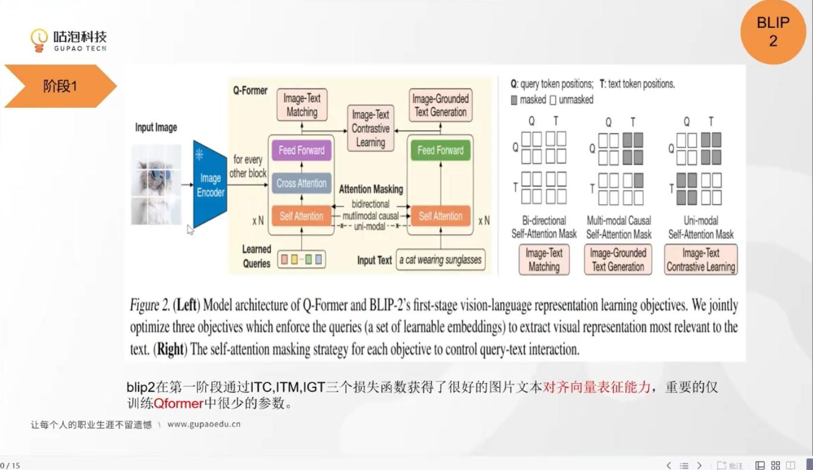
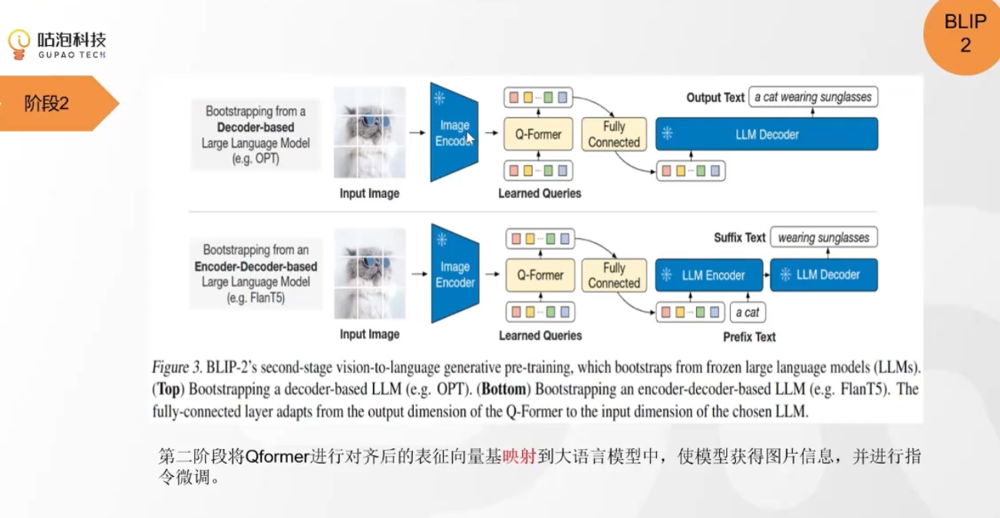

文本解码器和图片编码器都冻结，就把两个中间加一个Q-former，把图片投影到图片结果附近。
不是双向奔赴，而是图片向量单向奔赴到文本附近。
获得表征学习能力，保留图片特征的情况下，获得一个向量。
把图片的向量变到LLM的空间去，使得文本的模型可以理解，然后进行生成。
把图片变成了prompt，在这个图片基础上进行提问，然后回答问题。

颜色相同共享参数
learned Queries是以一个来自于上一个模块的输输出，还有就是图片。

### BLIP-2 模型结构与训练方法总结

#### **一、核心目标**
通过冻结预训练的图像编码器和大规模语言模型（LLM），实现高效的视觉-语言跨模态预训练，降低计算成本，同时保持SOTA性能。

#### **二、模型结构**
**Q-Former（Querying Transformer）**  
- **架构设计**：  
  - 分为图像Transformer和文本Transformer两个子模块，共享Self-Attention层。  
  - 引入可学习的`Query Embedding`作为图像特征与文本交互的桥梁。  
  - 通过不同的注意力掩码策略控制Query与文本的交互（见下图）。

  

- **关键组件**：  
  1. **图像编码器（冻结）**：基于CLIP ViT-L/14或EVA-CLIP ViT-G/14提取视觉特征。  
  2. **文本编码器/解码器**：与LLM（如OPT、FlanT5）连接，生成文本或匹配图文。  

#### **三、训练方法**
**两阶段预训练**：

1. **第一阶段：视觉-语言表征学习**  
   - **目标函数**：  
     - **图像文本对比学习（ITC）**：通过对比正负样本对齐图文特征（单模态掩码，禁止Query与文本交互）。  
     - **图像文本生成（ITG）**：基于图像生成文本（多模态因果掩码，允许文本逐步依赖Query和历史文本）。  
     - **图文匹配（ITM）**：判断图文对是否匹配（双向掩码，全交互）。  
   - **数据**：129M图像+文本对，通过CapFilt筛选高质量caption。  

2. **第二阶段：视觉到语言生成学习**  
   - **冻结LLM**（如OPT或FlanT5），通过Q-Former将视觉特征映射到LLM的文本空间。  
   - **训练目标**：  
     - 对解码器型LLM（如OPT）：语言建模损失。  
     - 对编码器-解码器型LLM（如FlanT5）：前缀语言建模损失。  

#### **四、技术创新**
1. **冻结预训练模型**：  
   - 减少显存占用，避免灾难性遗忘，加速训练（16×A100 GPU，第一阶段6天，第二阶段<3天）。  
2. **高效Query设计**：  
   - 通过可学习Query提取与文本相关的视觉特征，降低LLM对齐负担。  
3. **多任务掩码策略**：  
   - 不同目标函数使用差异化注意力掩码，灵活控制模态交互。  

#### **五、实验结果**
- **零样本VQA**：在VQAv2上超越Flamingo80B 8.7%（65.0 vs 56.3），参数仅为其1/400。  
- **图像描述**：NoCaps数据集SOTA（CIDEr 121.6）。  
- **图文检索**：COCO和Flickr30K零样本性能显著提升（R@1达97.6）。  
- **生成能力**：支持指令引导的零样本生成（如视觉对话、知识推理）。  

#### **六、局限性**
1. **多轮对话限制**：预训练数据仅含单图文对，无法处理序列上下文。  
2. **生成准确性**：LLM可能引入错误知识（如错误引用名言）或忽略关键信息（如服装保暖性）。  

#### **七、总结**
BLIP-2通过冻结预训练模型和轻量级Q-Former，实现了高效且通用的视觉-语言预训练，在多任务上达到SOTA，为低成本跨模态建模提供了新范式。
> **论文链接**：[BLIP-2: Bootstrapping Language-Image Pre-training](https://arxiv.org/abs/2301.12597)  
> **开源实现**：[Salesforce/LAVIS](https://github.com/salesforce/LAVIS)  
> **核心公式**：  
> - InfoNCE损失：  
  $$
   L_{\text{ITC}} = -\frac{1}{N} \sum_{i=1}^N \log \frac{\exp(\text{sim}(q_i, t_i) / \tau)}{\sum_{j=1}^N \exp(\text{sim}(q_i, t_j) / \tau)}
  $$
> - 噪声对比解码（NCD）：  
   \(L_{\text{NCD}} = -\mathbb{E}_{x,y} \left[ \log \frac{\exp(f(x,y))}{\sum_{y'} \exp(f(x,y'))} \right]\)

