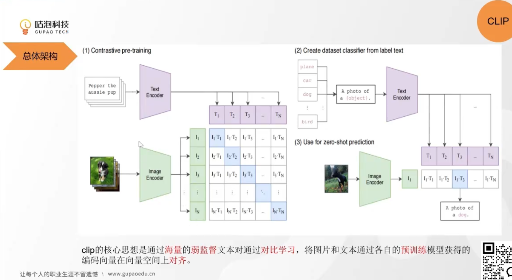

### CLIP（Contrastive Language-Image Pre-training）模型详解  

CLIP 是 OpenAI 2021 年提出的多模态模型，通过对比学习对齐文本与图像的语义空间，开创了**零样本跨模态理解**的先河。以下从创新点、架构、训练方法、贡献及影响展开分析：

#### 一、核心创新点  
| 创新维度         | 具体内容                                                                 | 突破性意义                                                                 |
|------------------|--------------------------------------------------------------------------|----------------------------------------------------------------------------|
| **跨模态对齐范式** | 对比学习框架，强制图文对嵌入向量在特征空间中接近（正样本），不同对远离（负样本）。 | 首次实现文本与图像的统一语义空间，支持零样本跨模态检索（如文本→图像生成）。 |
| **大规模预训练**   | 4 亿互联网图文对（~759GB）训练，超越传统数据集（如 COCO 12 万样本）两个数量级。 | 泛化能力覆盖长尾视觉概念（如“量子计算机”“抽象表现主义绘画”）。             |
| **零样本能力**     | 无需微调，文本指令完成图像分类（如“识别包含狗的图像”），打破传统模型依赖任务特定标注的限制。 | 定义多模态模型新评估标准：零样本准确率（Zero-Shot Accuracy）。          |
| **任务无关性**     | 统一处理图像分类、检索、生成等任务，仅通过文本提示切换功能（如“描述图像内容”→“判断图像情感”）。 | 推动“指令调优”（Instruction Tuning）范式普及（如 GPT-4V 设计灵感）。     |

#### 二、模型架构三大模块：双编码器+对比学习 

> **Contrastive pretraining：**每一次拿出三万个图片文本对，把图片放入VIT encoder，文本放入text encoder，向量维度都是768维度的。然后用cosine similarity计算两两相似度。标签应该是对角线是对齐的，其他的是不对齐的。然后用交叉熵损失函数计算损失。然后反向传播更新参数。就可以训练出一个模态对齐的编码器。

> **Zero-shot learning：** 拿一个多分类的文本描述序列，然后把图片放入VIT encoder，文本放入text encoder，然后计算相似度。然后把相似度最高的图片-文本对返回。就可以实现零样本学习。

这样就可以实现，文本搜图片、图片搜文本、图片搜图片、文本搜文本。反正都是向量维度的相似度计算，实现了不同模态数据的语义在编码向量维度的对齐。

**CLIP 由三大模块组成：**

##### 1. **输入处理**  
- **图像**：ResNet（如 RN50）或 Vision Transformer（ViT-B/32）提取视觉特征（224×224 输入）。  
- **文本**：Transformer 编码器处理 tokenized 文本（BPE 分词，最大长度 77 token）。  

##### 2. **双编码器结构**  
| 模块          | 架构细节                                                                 | 输出维度       |
|---------------|--------------------------------------------------------------------------|----------------|
| **图像编码器** | ResNet 残差连接或 ViT（patch 划分+多头注意力）                           | 512 维向量     |
| **文本编码器** | 12 层 Transformer（8 头注意力），正弦位置编码                           | 512 维向量     |

##### 3. **对比损失函数**  
$$
L = -\frac{1}{N} \sum_{i=1}^N \left[ \log \frac{e^{s \cdot \text{sim}(I_i, T_i)}}{\sum_{j=1}^N e^{s \cdot \text{sim}(I_i, T_j)}} + \log \frac{e^{s \cdot \text{sim}(I_i, T_i)}}{\sum_{j=1}^N e^{s \cdot \text{sim}(I_j, T_i)}} \right]
$$  
- **正样本对**：同一图文对的余弦相似度。  
- **负样本对**：所有其他图文对的相似度。  
- **温度参数 $s$**：默认 0.07，控制类间区分度。  

##### 4. **推理机制**  
- **零样本分类**：生成文本模板（如“一张{类别}的照片”），选择图像与文本模板相似度最高的类别。  
- **跨模态检索**：文本→图像检索（如“红色汽车在雨中行驶”匹配最相似图像）。  

#### 三、训练方法：大规模图文对对比学习  
| 阶段         | 细节                                                                     | 技术创新                                                                 |
|--------------|--------------------------------------------------------------------------|--------------------------------------------------------------------------|
| **数据采集** | 互联网爬取 4 亿图文对（CC12M 等扩展），过滤低质量内容。                   | 噪声数据增强鲁棒性（如拼写错误文本、低分辨率图像）。                     |
| **训练策略** | - 混合精度训练（FP16） - 分布式训练（8×A100，batch size 4096） - 余弦退火学习率调度。 | 首次验证超大规模多模态预训练可行性，奠定后续模型（如 ALIGN、FLAVA）范式。 |
| **正则化**   | - 图像增强：随机裁剪、颜色抖动、高斯模糊 - 文本增强：随机 dropout token。 | 提升模态噪声容忍度（如图文语义不完全对齐的真实数据）。                   |
| **训练耗时** | 8 天（8×A100，4 亿样本）                                                | 建立多模态模型效率标杆（后续 FLAVA 需 30 天+更大算力）。                 |

#### 四、核心贡献与影响  
##### 1. **方法论突破**  
- **统一多模态表示**：文本作为“通用接口”连接模态（图像、视频、音频），启发 FLAVA、BEiT-3。  
- **零样本学习范式**：ImageNet 零样本分类 76.2% Top-1 准确率（传统微调需 100 万标注样本）。  

##### 2. **技术生态影响**  
| 方向               | 受 CLIP 启发的模型/方法                                         | 创新延伸                                                                 |
|--------------------|-----------------------------------------------------------------------|--------------------------------------------------------------------------|
| **模型架构**       | ALIGN（18 亿图文对）、OpenCLIP（开源复现）                          | 验证对比学习可扩展性。                                                   |
| **跨模态生成**     | Stable Diffusion（文本→图像）、DALL·E 2（图文交互生成）            | 利用 CLIP 嵌入空间指导生成质量。                                         |
| **视频理解**       | VideoCLIP（视频-文本对齐）、TimeSformer（时序建模）                | 对比学习扩展到时序模态。                                                 |
| **轻量化模型**     | MobileCLIP（移动端）、MiniCLIP（蒸馏）                            | 解决计算成本问题（MobileCLIP 实现 ARM 芯片实时推理）。                   |

##### 3. **科学研究范式变革**  
- **数据驱动 vs 任务驱动**：从“特定任务模型”转向“预训练通用模型+灵活提示”（CLIP 解决 30+ 下游任务）。  
- **开放域泛化**：互联网数据学习超越人工标注（如识别“三角龙骨架”）。  

#### 五、局限性与改进方向  
| 局限性               | 改进方法                                                                 | 典型案例                                                                 |
|----------------------|--------------------------------------------------------------------------|--------------------------------------------------------------------------|
| **对齐质量不足**     | 引入多模态监督（OCR 文本、图像标注）                                   | BLIP（图文对齐+降噪生成训练）                                             |
| **计算成本高**       | 模型蒸馏、参数高效微调（LoRA）                                         | CLIP-LoRA（仅微调 0.3% 参数适配下游任务）                                |
| **长尾模态偏差**     | 领域特定数据增强（医学、遥感图文对）                                   | MedCLIP（医学图像-文本对齐，提升诊断零样本性能）                         |
| **语义一致性缺陷**   | 生成式训练目标（文本→图像重建）                                         | FLAVA（对比学习+生成学习联合优化）                                        |

#### 六、典型应用场景  
| 场景               | 实现方式                                                                 | 效果示例                                                                 |
|--------------------|--------------------------------------------------------------------------|--------------------------------------------------------------------------|
| **跨模态检索**     | 文本查询→图像检索（如“找一张表现孤独的抽象画”）                         | CLIP 在 Flickr30K 检索准确率提升 20%（相比单模态模型）。                  |
| **零样本分类**     | 生成文本模板（如“这是一张{类别}的照片”）                               | SUN397 场景分类零样本准确率 65.3%（传统方法需 397 类标注数据）。          |
| **图像标注**       | 文本提示生成标签（如“列出图像中的所有物体”）                           | 自动标注 OpenImages 数据集，减少 80% 人工成本。                           |
| **多模态推理**     | 图文联合推理（如“冰箱里有大象”的逻辑矛盾检测）                         | CLIP 相似度分数 < 阈值，识别矛盾。                                       |

#### 七、总结：CLIP 的历史地位  
CLIP 是多模态领域的“范式革命者”：  
1. **方法论创新**：对比学习+双编码器架构成多模态模型标配（90% 后续模型沿用）。  
2. **能力边界拓展**：首次证明“互联网规模数据+通用预训练”超越特定任务优化，推动 AGI 路径。  
3. **生态影响力**：催生 Stable Diffusion、Segment Anything 等应用，重塑 AI 产业落地模式（零样本定制方案）。  

**未来方向**：  
- **模态扩展**：融合视频、3D 点云（如 CLIP-3D）。  
- **效率革命**：稀疏注意力、动态架构降低算力需求。  
- **可信增强**：因果推理（Causal CLIP）、可解释性（X-CLIP）解决偏差与黑箱问题。  

> **论文引用**：Radford, A., et al. (2021). *Learning Transferable Visual Models From Natural Language Supervision*. OpenAI.  
> **开源资源**：[OpenCLIP](https://github.com/mlfoundations/open_clip)、[CLIP-as-service](https://github.com/JinaAI/clip-as-service)。  

**附：CLIP 与传统多模态模型对比**  

| 维度         | CLIP                          | 传统模型（如 Faster R-CNN + BERT） |
|--------------|-------------------------------|------------------------------------|
| 训练数据     | 4 亿互联网图文对（噪声数据）  | 10 万级人工标注数据（如 COCO）     |
| 任务适配     | 零样本（文本提示）            | 全量微调（特定任务标注）           |
| 泛化能力     | 跨领域（艺术→医学→遥感）      | 单领域优化（如图像分类）           |
| 对齐粒度     | 全局语义对齐（向量空间）      | 局部特征对齐（如目标检测框+文本）  |
| 推理成本     | 单前向传播（文本+图像编码）   | 多阶段处理（检测→特征提取→文本匹配）|

CLIP 的核心价值：**将多模态理解从“任务特定工程”解放为“通用语义对齐”**，为 AGI 提供“自然语言监督统一模态”的可行路径，推动 AI 研究从“模型定制”到“能力涌现”的范式转变。
