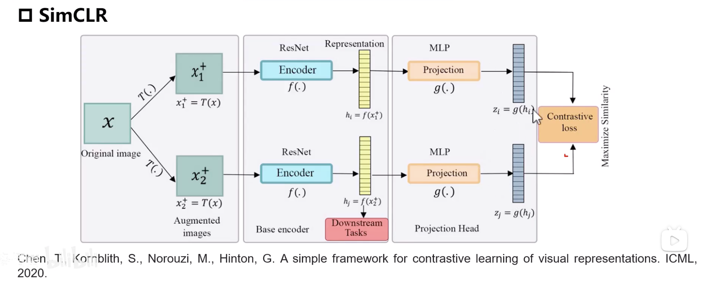
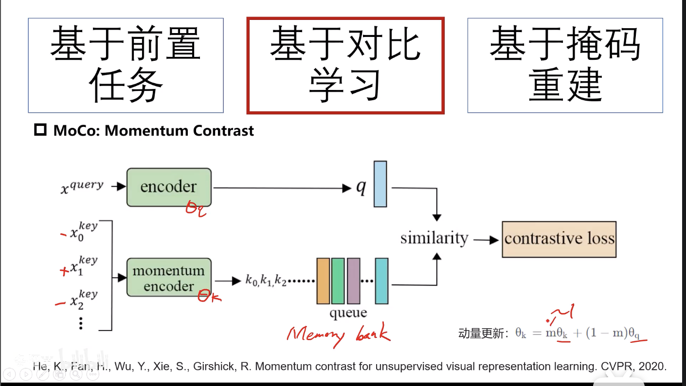
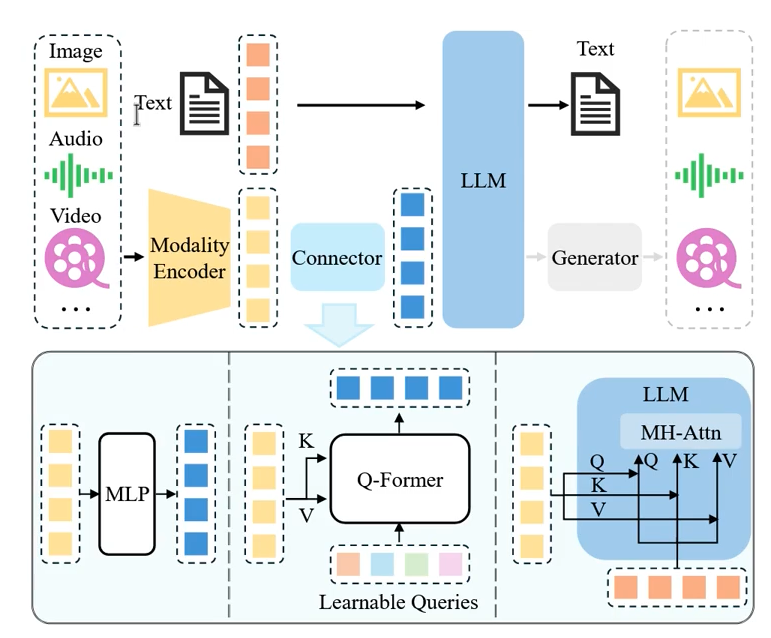

SimCLR:

使用数据增强之后的两张图片进行对比学习，要让两个结果尽可能的相似。但是最后要做的是取倒数第二层（黄色输出）作为embedding。最后的FC是用来学习的，MLP映射前的特征可能包含更多图像信息。随机裁剪、颜色抖动更好。一个batch_size里面负样本更多，训练效果更好。训练时间更长、模型更大，效果比监督数据效果更好。其实batch里面是有负样本的，只是没写。两边都有N个样本，得到2*N个embedding，然后可以做一个相关性的对角矩阵，对角线上的是正样本，其他的是负样本
MOCO:

动量的意思就是，更新的时候，会比原来的更加保守。更快的更新正样本那个，减少出现假正样本。
相当于是一个检索的形式，用query去memmory bank=queue里面检索

FID是什么：模型特征分布与原图片分布距离度量之一，越小越好
FID是Frechet Inception Distance的缩写，是一种用于评估生成模型性能的指标。它衡量生成的图像分布与真实图像分布之间的差异。越小越好
FID计算过程是：
计算生成图像的特征向量和原图像特征向量，使用的是一个与训练的分类模型去掉分类头，计算多张样本和生成图片的特征向量的均值和协方差矩阵。这里就是假设团体内特征向量都是高斯分布，然后假设高斯分布的距离是多少。费舍尔相似度计算，就是均值和协方差计算。
计算均值和协方差矩阵之间的距离。
FID的计算公式如下：
FID = ||μ1 - μ2||^2 + Tr(Σ1 + Σ2 - 2√(Σ1Σ2))
FID的计算方法是基于统计特性，它考虑了分布的形状和位置。因此，FID可以用于评估生成模型的质量，特别是在图像生成任务中。但是使用的时候，要采样很多张图片，才能算这个指标，因为要估算样本和生成的高斯分布。

CLIP score是什么：文字与图片特征的相似度。
CLIP score是一种用于评估生成模型性能的指标，它衡量生成的图像与语言描述之间的相关性。CLIP score的计算过程就是clip计算，越小越好。
