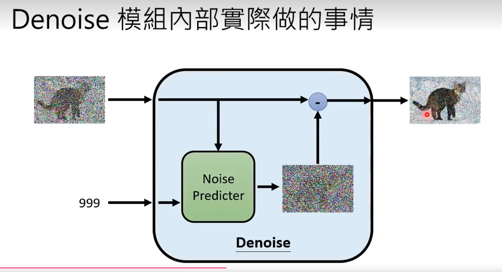
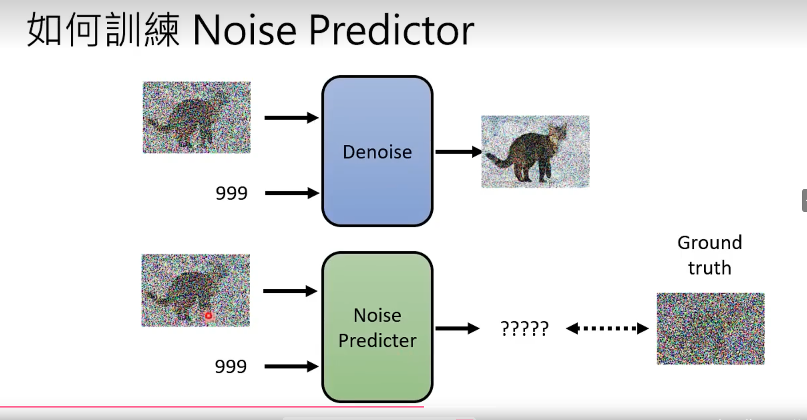
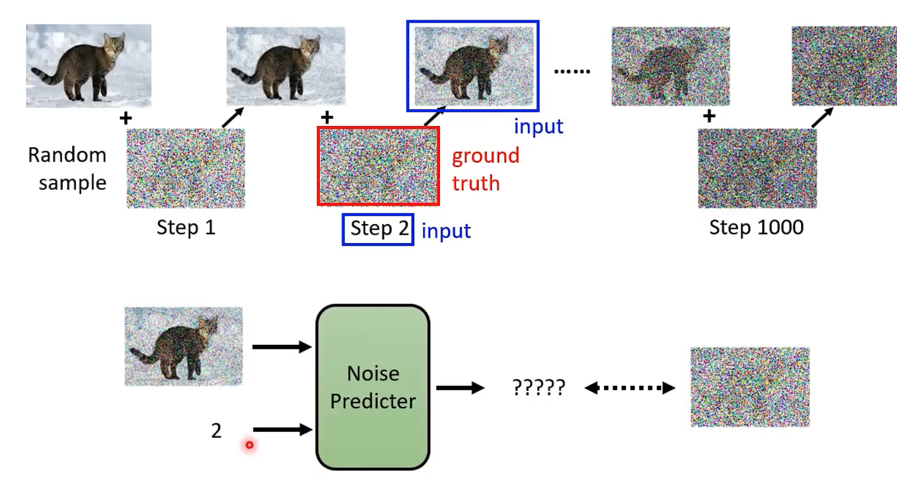
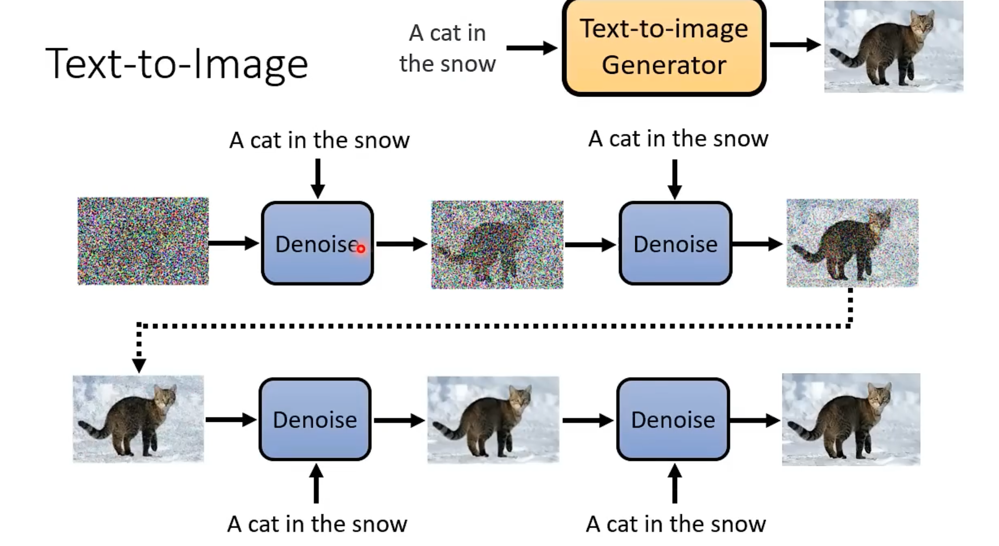
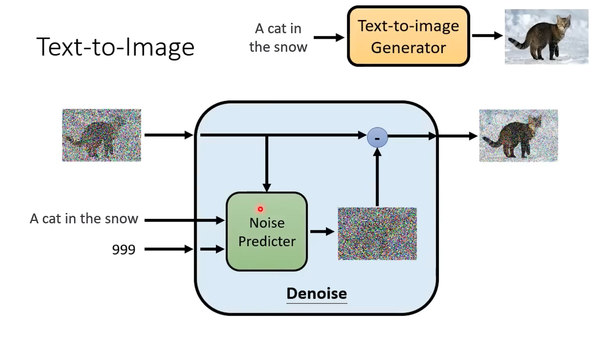
输入的图片+一个文字描述+一个stepid，去denoise，然后生成一个图片。

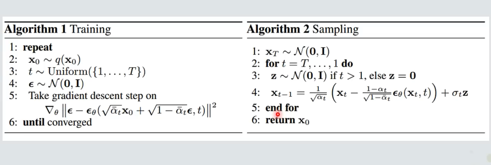

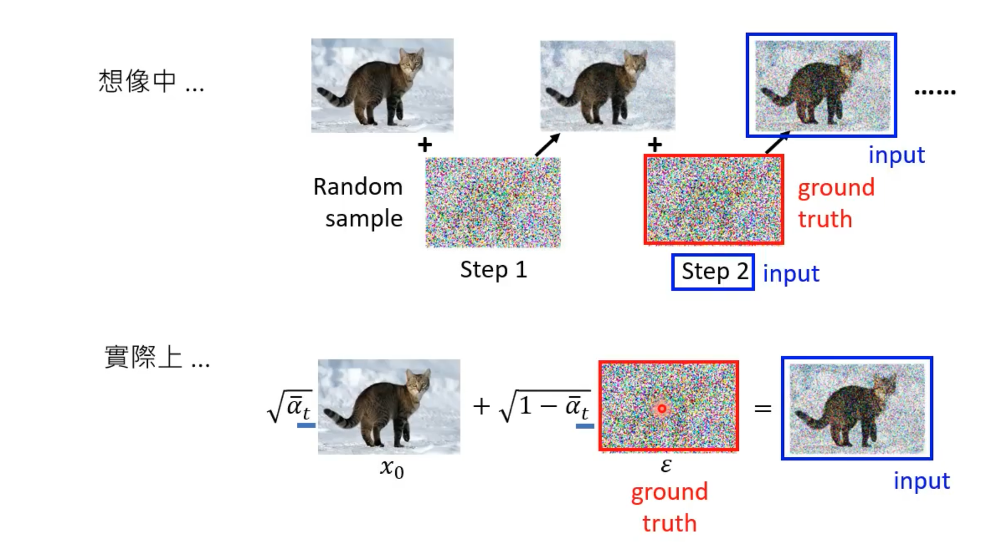
实际上操作的时候不是真正一步一步加入噪声，而是直接加入全部噪声，predictor直接预测加入的全部噪声是多少。

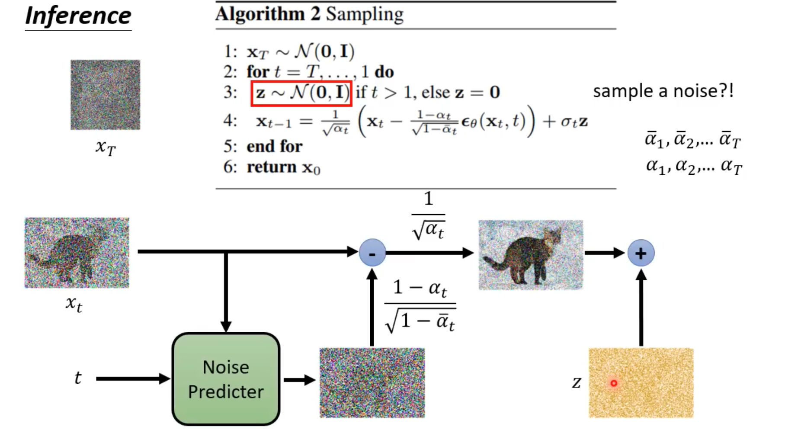
在最后还要加一个噪声是干嘛？

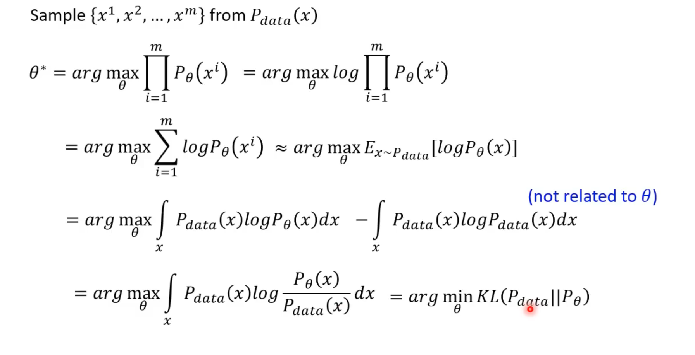
式子表示使用极大似然来近似一个分布的的时候，最终就是近似要最小化kl散度
就是最小化kl散度，让两个分布更加相似。 kl散度是一个衡量两个分布之间差异的指标。越小越好。
# 扩散模型（Diffusion Model）详解

## 一、核心原理  
### 1. 目标  
学习从纯噪声（简单分布）生成真实数据（如图像）的方法，通过两个关键过程实现：  

### 2. 前向扩散过程（Forward Diffusion）  
- **过程**：逐步向真实图片添加噪声，最终得到纯噪声。  
- **数学定义**：  
  - 初始状态 \( x_0 \) 为真实图片（从数据分布 \( q(x_0) \) 采样）。  
  - 每一步添加高斯噪声：\( q(x_t | x_{t-1}) = \mathcal{N}(x_t; \sqrt{1-\beta_t}x_{t-1}, \beta_t \mathbf{I}) \)，其中 \( \beta_t \) 是预定义的方差参数（随时间递增，如线性、余弦调度）。  
  - 递推公式：\( x_t = \sqrt{\alpha_t} x_{t-1} + \sqrt{1-\alpha_t} \epsilon \)，\( \alpha_t = 1 - \beta_t \)，\( \epsilon \sim \mathcal{N}(0, \mathbf{I}) \)。  
  - 最终状态 \( x_T \) 近似为纯噪声。  

### 3. 反向去噪过程（Reverse Denoising）  
- **目标**：训练神经网络 \( p_\theta \) 从纯噪声 \( x_T \) 恢复 \( x_0 \)。  
- **假设**：反向条件分布为高斯分布 \( p_\theta(x_{t-1} | x_t) = \mathcal{N}(x_{t-1}; \mu_\theta(x_t, t), \Sigma_\theta(x_t, t)) \)。  
- **简化**：DDPM中固定方差 \( \Sigma_\theta = \sigma_t^2 \mathbf{I} \)，仅学习均值 \( \mu_\theta \)，通过预测噪声 \( \epsilon_\theta(x_t, t) \) 间接实现。  

### 4. 训练逻辑  
- **输入**：加噪图片 \( x_t \) 和时间步 \( t \)。  
- **输出**：预测噪声 \( \epsilon_\theta(x_t, t) \)。  
- **损失函数**：均方误差（MSE）或L1损失，优化目标为 \( \mathbb{E}[\|\epsilon - \epsilon_\theta(x_t, t)\|^2] \)，其中 \( \epsilon \) 是前向过程中添加的真实噪声。  

## 二、核心组件  
### 1. 网络结构：U-Net  
- **输入**：噪声图片（形状为 `(batch_size, channels, h, w)`）和时间步编码。  
- **关键模块**：  
  - **位置编码**：将时间步 \( t \) 编码为正弦嵌入，融入每个残差块（类似Transformer的位置编码）。  
  - **残差块（ResNet/ConvNeXT）**：包含卷积、归一化和激活函数，支持时间步编码的输入。  
  - **注意力模块**：自注意力机制（普通或线性变种），捕捉全局像素依赖。  
  - **下采样/上采样**：通过卷积和反卷积调整特征图尺寸，结合跳跃连接保留底层信息。  

### 2. 噪声调度（Noise Schedule）  
- **预定义参数**：\( \beta_1 < \beta_2 < \dots < \beta_T \)，控制每一步噪声强度。  
- **常见调度**：  
  - 线性调度（DDPM默认）：\( \beta_t \) 线性递增。  
  - 余弦调度：更平滑的噪声变化，提升生成质量。  

## 三、训练与推理流程  
### 1. 训练流程  
1. **数据预处理**：  
   - 将图像归一化到 `[-1, 1]` 或 `[0, 1]` 范围。  
   - 构建 `DataLoader` 用于批量输入。  
2. **随机采样**：  
   - 每个批次随机选择时间步 \( t \in [0, T] \)。  
   - 对真实图像 \( x_0 \) 应用前向扩散过程，生成加噪图像 \( x_t \)。  
3. **模型优化**：  
   - 将加噪图像 \( x_t \) 和时间步 \( t \) 输入U-Net，预测噪声 \( \epsilon_\theta(x_t, t) \)。  
   - 计算预测噪声与真实噪声 \( \epsilon \) 的损失（MSE或L1），通过反向传播更新模型参数。  
4. **可视化监控**：  
   - 定期从反向过程生成样本图像，保存并对比真实数据分布，评估训练效果。  

### 2. 推理流程  
1. **初始化噪声**：  
   - 从标准正态分布 \( \mathcal{N}(0, \mathbf{I}) \) 采样初始噪声 \( x_T \)，形状为 `(batch_size, channels, h, w)`。  
2. **逐步去噪**：  
   - 从 \( t = T \) 到 \( t = 0 \) 逆序迭代：  
     - 利用训练好的模型预测当前噪声图像 \( x_t \) 的噪声 \( \epsilon_\theta(x_t, t) \)。  
     - 根据反向过程公式计算去噪后的图像 \( x_{t-1} \)，逐步去除噪声。  
3. **输出结果**：  
   - 迭代完成后，得到最终图像 \( x_0 \)，其分布接近真实数据（如图像生成、修复任务输出）。  

## 四、核心优势与应用  
### 1. 优势  
- **生成质量高**：能够捕捉复杂数据分布，生成细节丰富的样本（如高清图像）。  
- **训练稳定性强**：无需对抗训练（对比GAN），避免模式崩溃问题，梯度更新更平滑。  
- **灵活性高**：支持多种数据类型（图像、音频、视频），通过调整噪声调度和网络结构适配任务。  

### 2. 应用  
- **图像生成**：DALL-E（文本生成图像）、Stable Diffusion（高分辨率图像生成）、MidJourney等。  
- **图像修复**：去除图像噪声、填补缺失区域（如Inpainting任务）。  
- **视频生成**：从文本或图像生成连贯视频序列（如Phenaki、Make-A-Video）。  
- **其他领域**：语音合成、分子生成（药物研发）、数据增强等。  

# Stable Diffusion 技术解析  

## 一、核心架构与设计思想  
### 1. 核心定位  
基于**潜在扩散模型（Latent Diffusion Model, LDM）**的文本到图像生成模型，通过在低维潜在空间进行扩散过程，平衡生成质量与计算效率。  
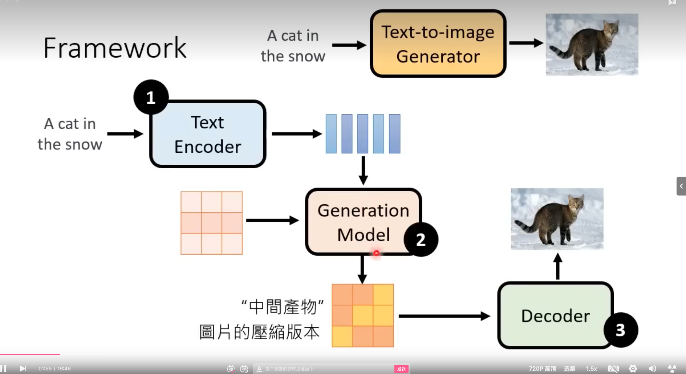
文本编码器、解码器、denoise网络。
### 2. 关键创新  
- **潜在空间扩散**：  
  不在原始像素空间（如512x512）直接操作，而是通过**VAE（变分自编码器）**将图像压缩到低维潜在空间（如64x64），噪声添加与去噪均在此空间进行，计算量降低约100倍。  
- **文本条件注入**：  
  使用**CLIP文本编码器**将文本转换为特征向量，通过**交叉注意力机制**融入UNet的去噪过程，实现“文本控制图像生成”。  
- **高效架构设计**：  
  采用优化的UNet结构（如对称注意力模块、通道数分层设计），支持快速推理与大规模训练。  

## 二、核心组件解析  
### 1. 三模块架构  
#### （1）VAE（变分自编码器）  
- **编码器（Encoder）**：  
  - 将高分辨率图像（如512x512x3）压缩为低维潜在编码 \( z_0 \)（如64x64x4），服从近似后验分布 \( q(z_0|x_0) \)。  
- **解码器（Decoder）**：  
  - 将潜在编码 \( z_0 \) 恢复为原始图像，用于训练阶段的重建损失计算与推理阶段的图像生成。  
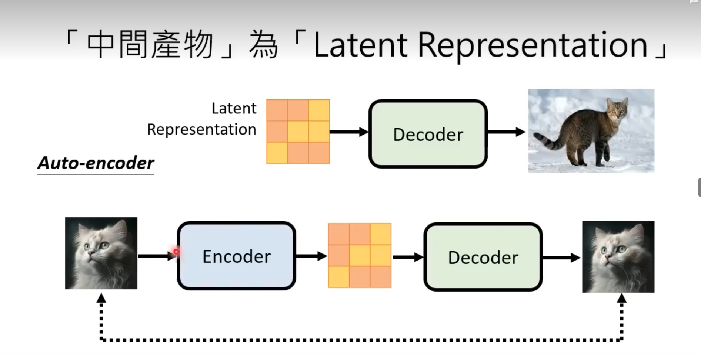

#### （2）文本编码器（Text Encoder）  
- **CLIP ViT-L/14**：  
  - 输入文本经分词（如BPE）后，通过Transformer编码为768维的文本嵌入 \( c_{text} \)，表征语义信息。  
- **条件整合**：  
  - 文本嵌入通过**交叉注意力层**注入UNet的中间层，指导去噪过程（如“生成一只穿靴子的猫”）。  

#### （3）UNet去噪网络  
- **输入**：  
  - 潜在噪声编码 \( z_t \)（形状为 `(B, 4, H, W)`，H=W=64）与时间步 \( t \) 的正弦编码。  
- **核心模块**：  
  - **交叉注意力层**：接收文本嵌入 \( c_{text} \)，在UNet的中高层（如分辨率16x16时）注入条件信息，建立文本与图像区域的关联。  
  - **对称U型结构**：下采样路径提取语义特征，上采样路径恢复空间细节，跳跃连接融合多尺度信息。  
  - **高效注意力**：采用**线性注意力**或**分块注意力**优化计算复杂度，支持更大批次训练。  

### 2. 噪声调度与扩散过程  
- **前向过程（潜在空间加噪）**：  
  \(z_t = \sqrt{\alpha_t} z_{t-1} + \sqrt{1-\alpha_t} \epsilon, \quad \epsilon \sim \mathcal{N}(0, \mathbf{I})\)  
  - \( \alpha_t = 1 - \beta_t \)，\( \beta_t \) 采用**余弦调度**（提升生成质量）或线性调度。  
- **反向过程（条件去噪）**：  
  \(p_\theta(z_{t-1}|z_t, c_{text}) = \mathcal{N}\left(z_{t-1}; \mu_\theta(z_t, t, c_{text}), \sigma_t^2 \mathbf{I}\right)\) 
  - 通过UNet预测噪声 \( \epsilon_\theta(z_t, t, c_{text}) \)，推导去噪均值 \( \mu_\theta \)，固定方差由调度预设。  

## 三、训练流程  
### 1. 数据与目标  
- **训练数据**：  
  - 图像-文本对（如LAION-5B），图像分辨率512x512，文本描述对应图像内容。  
- **优化目标**：  
  最小化潜在空间的噪声预测损失：  
  $$
  \mathcal{L} = \mathbb{E}_{t, z_0, \epsilon \sim \mathcal{N}(0,1)} \left[ \|\epsilon - \epsilon_\theta(z_t, t, c_{text}(y))\|^2 \right]
  $$  
  其中 \( y \) 是文本，\( z_t = q(z_t|z_0, t) \) 是前向加噪后的潜在编码。  

### 2. 关键步骤  
1. **图像编码**：  
   - 真实图像 \( x_0 \) 通过VAE编码器得到潜在编码 \( z_0 \)。  
2. **文本编码**：  
   - 文本 \( y \) 通过CLIP文本编码器得到条件嵌入 \( c_{text} \)。  
3. **加噪与预测**：  
   - 随机采样时间步 \( t \)，对 \( z_0 \) 加噪得到 \( z_t \)，UNet输入 \( z_t \)、\( t \) 和 \( c_{text} \)，输出预测噪声 \( \epsilon_\theta \)。  
4. **反向传播**：  
   - 计算预测噪声与真实噪声 \( \epsilon \) 的MSE损失，更新UNet参数（VAE和文本编码器通常固定或仅微调）。  

## 四、推理流程（文本生成图像）  
### 1. 文本到潜在编码生成  
1. **文本嵌入**：  
   - 输入文本 \( y \) 经CLIP编码为 \( c_{text} \)（形状 `(B, 768)`）。  
2. **初始噪声采样**：  
   - 从标准正态分布生成潜在空间噪声 \( z_T \)（形状 `(B, 4, 64, 64)`）。  

### 2. 反向去噪（核心循环）  
- 从 \( t=T \) 到 \( t=0 \) 逆序迭代：  
  1. UNet输入 \( z_t \)、时间步 \( t \) 和 \( c_{text} \)，输出预测噪声 \( \epsilon_\theta \)。  
  2. 根据反向过程公式计算去噪后的潜在编码 \( z_{t-1} \)：  
     $$
     z_{t-1} = \frac{1}{\sqrt{\alpha_t}} \left( z_t - \frac{1 - \alpha_t}{\sqrt{1 - \alpha_t^\text{cumprod}}} \epsilon_\theta \right) + \sigma_t \cdot \epsilon'
     $$  
     其中 \( \epsilon' \) 是当前步添加的随机噪声（最后一步 \( t=0 \) 时省略）。  

### 3. 潜在编码解码为图像  
- 通过VAE解码器将 \( z_0 \) 转换为像素空间图像 \( x_0 \)（分辨率512x512），输出最终生成结果。  

## 五、核心优势与优化  
### 1. 技术优势  
- **效率突破**：  
  潜在空间操作使计算量从像素级（如512²=26万）降至潜在级（64²=4千），GPU显存需求降低，支持消费级显卡运行（如RTX 3090）。  
- **条件灵活性**：  
  除文本外，可扩展支持图像提示（Image-to-Image）、掩码输入（Inpainting）等，通过不同条件嵌入实现多模态生成。  
- **开源生态**：  
  模型权重与代码开源（如Stable Diffusion 1.5/2.0），催生大量衍生工具（ControlNet、DreamBooth）和社区应用。  

### 2. 优化技巧  
- **注意力偏移（Attention Guidance）**：  
  通过调节文本注意力权重（如CFG Scale=7.5），增强文本条件的约束，减少生成结果的语义偏差。  
- **快速采样算法**：  
  支持DDIM、PLMS等非马尔可夫采样器，在保持质量的同时减少采样步数（如从200步降至20-50步）。  

## 六、典型应用场景  
### 1. 图像生成  
- **文本到图像**：根据自然语言描述生成创意图像（如“赛博朋克风格的城市夜景”）。  
- **图像到图像**：基于输入图像进行风格转换（如将照片转为油画）或细节增强。  

### 2. 图像编辑  
- **Inpainting**：修复图像缺失区域（如去除水印、填补破损部分）。  
- **Outpainting**：扩展图像边界，生成超出原始尺寸的内容（如延长风景图片的天空）。  

### 3. 垂直领域应用  
- **设计辅助**：生成海报、插画、3D模型纹理，加速创意工作流。  
- **AI艺术创作**：支持艺术家通过文本prompt探索新风格，降低技术门槛。  

### 4. 研究扩展  
- **多模态融合**：结合深度图（ControlNet）、姿势骨架（Pose Guidance）实现更精准的结构控制。  
- **轻量化部署**：通过模型蒸馏（如SDXL Refiner）或量化技术，适配移动端设备。  

Stable Diffusion通过“潜在空间扩散+文本条件注入”的设计，在生成质量、效率和可控性之间实现突破，成为当前AIGC领域的标杆模型之一。其开源特性推动了技术普惠，使复杂的图像生成能力进入普通用户手中。  