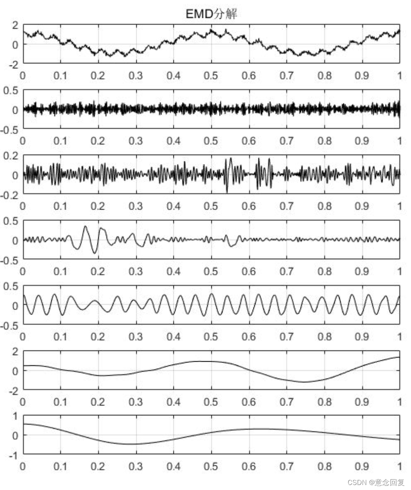

# 信号处理方法
> 近期主要是写毕业论文，然后把之前读过的论文又整理了一下。之前读过的论文每看一次都有新发现。
> 今天的汇报主要是最近在看论文的时候涉及到的一些处理时间序列的数据的方法

> [!TIP|label:问题背景]
> 实际工程测量中由于测量系统受外界环境影响经常在测量信号中产生趋势项。**趋势项可以看作信号中周期大于采样长度的频率成分**，通常表现为线性的或者慢变的趋势误差。提取和消除信号中存在的趋势项是信号预处理的一个重要环节，趋势项会**严重影响信号时域相关分析和频域功率谱估计精度**，严重的趋势项干扰会使低频谱严重失真。分别提取季节、趋势项非常重要。

一般来说，一个经济指标中往往包含有四个变动要素，**长期要素、循环要素、季节要素和不规则的要素**。我们数据处理主要是更精确的捕捉这些要素，以便分析。

> 于是大家提出了一些方法，此笔记用于记录笔者理解这些方法的思路。
> - 差分模型
> - 移动平均（简单移动平均、指数移动平均）
> - 经验模态分解
> - 季节性分解方法
> - 季节性ARIMA
> - 更新待续...

## 差分
差分法来分解趋势项很简单，就是 $df_i = X_i-X_{i-1}$ 之后得到df序列，相当于最简单的使得数据更加平稳。

如果存在季节性的趋势，则通常会把每个观察值与其上一个周期相应时刻的观察值相减，以消除季节项。$df_i = X_i-X_{i-s}$。

去除：季节差分通过计算当前观测值与去年（上个季节循环）同期的观测值之间的差异，去除了每年重复出现的季节性波动，这种差异确保了比较的是相同季节的数据点。

留下：留下的数据中，凸显了趋势信息。非季节性的周期或者循环可能会更加凸显。随机波动分量也更明显。

## 移动平均（简单移动平均、指数移动平均）
### 简单移动平均（Simple Moving Average, SMA）

**理论**  
简单移动平均通过计算连续某一段时间窗口内数据点的算术平均值，来估计时间序列的趋势。这种方法假设每个数据点的贡献是相等的，忽略了数据点间可能存在的权重差异。

**数学公式**  
对于一个给定的时间窗口长度 $ n $，简单移动平均 $ SMA $ 的计算公式如下：

$$ SMA_t = \frac{1}{n} \sum_{i=0}^{n-1} P_{t-i} $$

其中，  
- $ SMA_t $ 表示在时间 $ t $ 的简单移动平均值；  
- $ P_{t-i} $ 表示从当前时间 $ t $ 回溯 $ i $ 期的数据点，$ i $ 从 0 到 $ n-1 $；  
- $ n $ 是移动平均的期数，即窗口大小。

### 指数移动平均（Exponential Moving Average, EMA）

**理论**  
指数移动平均赋予了近期数据更高的权重，而较远期的数据权重逐渐降低，形成一种指数衰减的效果。这种加权平均方式使得EMA对最近的数据变化更为敏感，适合于跟踪快速变化的趋势。

**数学公式**  
EMA的计算引入了一个平滑常数 $ \alpha $，其值介于0和1之间，通常根据所选的窗口长度 $ n $ 计算得出，$ \alpha $ 与 $ n $ 的关系为 $ \alpha = 2 / (n + 1) $。初始的EMA值 $ EMA_0 $ 通常取第一个数据点 $ P_0 $ 或者前几期的简单移动平均值。EMA的递推公式如下：

$$ EMA_t = \alpha \cdot P_t + (1 - \alpha) \cdot EMA_{t-1} $$

其中，  
- $ EMA_t $ 表示在时间 $ t $ 的指数移动平均值；  
- $ P_t $ 是当前时间 $ t $ 的数据点；  
- $ EMA_{t-1} $ 是上一期的指数移动平均值；  
- $ \alpha $ 是平滑常数，决定了新数据对当前EMA值的影响程度。

注意事项
- **初始化问题**：首次计算EMA时需要选择一个初始值，可以是第一期的数据值，也可以是某一时期的SMA值作为起始。
- **灵敏度调整**：通过调整 $ \alpha $ 的值，可以控制EMA对最新数据的响应速度，$ \alpha $ 趋近于1时，EMA对新数据反应更快，反之则反应较慢。
- **平滑效果**：简单移动平均对所有数据点同等对待，适合于数据波动不大、趋势平缓的情况；而指数移动平均更适合于快速变化的数据，能更快地反映出最近的趋势变化。

## EMD-经验模态分解
经验模态分解（Empirical Mode Decomposition, EMD）是一种自适应的数据处理技术，用于非线性、非平稳信号的分析。EMD的核心思想是将复杂信号分解为一系列本征模态函数（Intrinsic Mode Functions, IMF）。（IMF这里看成分解的基函数，只是这个基函数会不断变化）这些概念之后都会描述。

EMD最显著的特点，**就是其克服了基函数无自适应性的问题**。回忆小波分析部分的内容，我们会知道小波分析是需要选定某一个小波基的，小波基的选择对整个小波分析的结果影响很大，一旦确定了小波基，在整个分析过程中将无法更换，即使该小波基在全局可能是最佳的，但在某些局部可能并不是，所以小波分析的基函数缺乏适应性。

> 其中第1张为原始信号，后边依次为EMD分解之后得到的6个分量，分别叫做IMF1~IMF5，最后一张图为残差.

具体的数学过程有点复杂，公式较多，之后再打进笔记。这里先只需要记住优缺点：
优点：
- 自适应性：EMD不依赖于预设的基础函数，而是根据数据自身的局部时间尺度特征来分解信号，因此能够适应各种类型的数据，特别是非线性、非平稳信号。
- 直观解释：分解得到的固有模态函数（Intrinsic Mode Functions, IMF）具有物理意义，每个IMF代表了原信号的一个频率带宽内的局部特征，有利于信号特征的直观理解和分析。
- 信噪比高：EMD能够有效提高信号的信噪比，尤其是在噪声较大的非线性信号处理中，有助于提取有用的信号成分。比如分离出长期趋势和周期波动。

缺点：
- 模态混叠（Mode Mixing）：当信号中存在间歇性或异常事件（如脉冲干扰、噪声等）时，分解得到的IMF可能出现频率成分交叉，即模态混叠，这会降低分解的准确性。这一点似乎之前学的所有变换都有（小波、傅里叶等）
- 端点效应：在信号的开始和结束部分，由于缺乏足够的数据进行局部均值计算，可能导致IMF的不准确。
- 迭代停止标准：EMD算法中，如何确定每次迭代的停止条件仍是一个主观判断过程。

适用于非线性、非平稳、具有多种频率成分的数据。
不适用于强烈噪声污染、高度规则的数据。
金融数据利用的话，还得再处理。

## X-11、X-12季节调整方法
这两种方法好像是比较复杂的多种处理方式的综合。
总而言之：将时间序列数据拆分为趋势、季节性、循环和不规则四个基本组成部分的原则。给定时间序列 \(Y_t\) 可表示为：
\[ Y_t = T_t + S_t + C_t + I_t \]
- \(T_t\)：趋势成分，反映长期增长或下降趋势。
- \(S_t\)：季节性成分，体现固定周期（如一年内）内重复出现的模式。
- \(C_t\)：循环成分，指较长周期（超过一年）的周期性波动。
- \(I_t\)：不规则成分，包括随机波动和突发事件影响。

然后一步一步的分解趋势项和季节项。看到的关于x-11，x-12的版本有点杂乱，还得整理一下。

