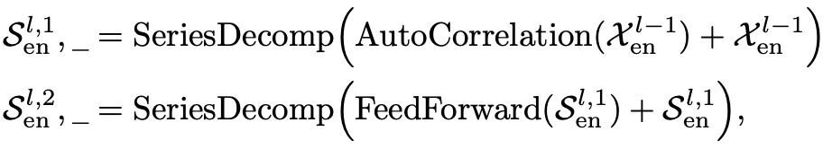

> 今天主要是重温autoformer以及fedformer，并且结合之前读论文的资料，把论文的整体思路整理进自己的学习资料库，以便之后要用的时候快速查看
# AutoFormer 基于序列周期性的自相关机制
> 'Autoformer: Decomposition Transformers with Auto-Correlation for Long-Term Series Forecasting' 2021 NeurIPS
该文章针对时序预测问题，尤其长期序列，提出一种时序分解模块并对注意力模块进行创新。用于长期序列预测的自相关分解Transformer。
## 摘要
指出先前基于Transformer的模型虽然利用各种自注意力机制捕获长距离依赖关系，但在处理长期未来**复杂的时序模式**时面临困难。同时，为**处理长序列而采用的稀疏点对点自注意力导致信息利用率瓶颈**。

Autoformer作为一种新型分解架构，Autoformer提出了 自相关机制(Auto-Correlation Mechanism) 代替自注意力机制，使得模型以序列的形式，选取过去重要的序列片段，做为值得注意的序列片段，而非以某个点的形式。同时，Autoformer提出了一种 深度分解架构(Decomposition) 的分解结构，与先前的长时间序列预测模型不同，以往的模型都是在数据处理部分就将数据分解成季节性数据和趋势性数据等，再分别进行数据处理预测。这样会使模型忽略了不同数据中的相关性，Autoformer将数据的分解嵌入在模型结构中，在模型内部再将数据分解，使模型具备更复杂的时间序列的逐渐分解能力

## 创新点
为突破上述问题，文章全面革新了Transformer，并提出了名为Autoformer的模型，主要包含以下两大独特的本文创新：
- 突破将序列分解作为预处理的传统方法，提出深度分解架构（Decomposition Architecture），能够从复杂时间模式中分解出可预测性更强的组分。（亮点1：序列分解）
- 基于随机过程理论，提出自相关机制（Auto-Correlation Mechanism），代替点向连接的注意力机制，实现序列级（series-wise）连接和 $O(Llog(L))$复杂度，打破信息利用瓶颈。（亮点二：自相关机制）

## 整体架构
模型如下，包括有encoder和decoder两部分，每个部分都有N个Encoder或者Decoder层构成。层的具体输入和结构，在后文给出。

任务整体就是，输入序列I，输出序列O。
> [!TIP|label:创新点]**分解趋势项和周期项**
>每一个序列 $X$ 其实都可以分为趋势项、季节周期项两部分。利用滑动平均将原序列分解为趋势$X_t$ 周期$X_s$两种特征序列

该操作记为：$X_s,X_t = SeriesDecomp(X)$

### Encoder

在encoder部分的每一层中，我们逐步消除趋势，得到季节周期项,也就是encoder中的序列分解只保留seasonal,而基于这种周期性，利用自相关机制进行聚合,这里先侧重结构，具体自相关机制后文讲,先简单的把它当作self-attention就行。

### Decoder
decoder主要是两条线，在decoder上面这条线（seasonal）的每一步中，得到的结果趋势项被传入到下面那条线（trend-cyclical）中。属于趋势的信息被累计到了下面这条趋势线里。
 
每个 Decoder 层包含 **inner Auto-Correlation**^1^ 和 **encoder-decoder Auto-Correlation**^2^，它们可以分别**细化预测**^1^和**利用过去的 seasonal 信息**^2^。 请注意，该模型在 Decoder 期间从中间隐藏变量中提取潜在 trend，从而允许 Autoformer 逐步细化trend预测并消除干扰信息，以便在Auto-Correlation 中发现基于周期的依赖关系。 假设有 M 个 decoder 层。 使用来自 encoder 的隐变量 $X_{en}^N$，第k个解码器层的方程可以概括为 $X_{de}^l=Encoder(X_{en}^N,X_{de}^{l-1})$。Decoder  可以如下公式化:

这里，S是周期特征，T是趋势特征。$S_{de}^{l,3}=X_{de}^l$，作为下一层的输入。$T_{de}^{l}$作为累加的趋势项被保存，每一步出来的T都要加进去。

最后的预测结果，由最后的一个季节输出 X 和最后一个的趋势输出 T 综合得出。$prediction = W * X_{de}^{M}+T_{de}^{M}$.

## 自相关机制

从上到下对Auto-Correlation Mechanism进行分析，如上图所示，Q，K，V和Transformer一样通过映射输入得到，首先注意到对Q和K分别执行快速傅里叶变换操作 (FFT)，K还执行了共轭操作，那么为什么要这样做呢？看下式：
$\mathcal{S}_{\mathcal{X}\mathcal{X}}(f) = \mathcal{F}(W^Q \mathbf{X}_t)\mathcal{F}^*(W^K \mathbf{X}_t)$ (5)

$\mathcal{R}_{\mathcal{X}\mathcal{X}}(\tau) = \mathcal{F}^{-1}(\mathcal{S}_{\mathcal{X}\mathcal{X}}(f))$ (6)

我们通过如上操作便可以得到 $\mathcal{R}_{\mathcal{X}\mathcal{X}}(\tau)$，而 $\mathcal{R}_{\mathcal{X}\mathcal{X}}(\tau)$ 正是我们需要的间隔为 $\tau$ 的序列相似度。对于输入 $\mathbf{X} \in \mathbb{R}^{L \times d}$，假设其有周期性，周期为 $\tau$，那么间隔为 $\tau$ 的子序列将极为相似，也即 $\mathbf{X}_{\tau:L-1}$ 与 $\mathbf{X}_{0:L-\tau-1}$。

$\mathcal{R}_{\mathcal{X}\mathcal{X}}(\tau) = \lim_{L \to \infty} \frac{1}{L} \sum_{t=\tau}^{L-1} \mathbf{X}_t \mathbf{X}_{t-\tau}$ (6)

当使用FFT高效求解出$\tau$从1到$L-1$的所有$\mathcal{R}_{\mathcal{X}\mathcal{X}}(\tau)$后，然后本文将只取出最大的$k$个$\mathcal{R}_{\mathcal{X}\mathcal{X}}(\tau)$，并且对取出的$k$个$\mathcal{R}_{\mathcal{X}\mathcal{X}}(\tau)$执行softmax操作转换为概率，最后将$k$个概率与对应的进行Roll操作之后的$V$相乘后相加得到最后的结果，如下所示：

$\tau_1, \ldots, \tau_k = argTopk(\mathcal{R}_{Q,K}(\tau))_{\tau \in \{1,...,L\}}$ (7)

$\hat{\mathcal{R}}_{Q,K}(\tau_1), \ldots, \hat{\mathcal{R}}_{Q,K}(\tau_k) = SoftMax(\mathcal{R}_{Q,K}(\tau_1), \ldots, \mathcal{R}_{Q,K}(\tau_k))$ (7)

文中提到的 $Roll$ 操作就是把 $\mathbf{x}_{0:L-\tau-1}$ 搬到序列的最前面，因为 $\mathbf{x}_{0:L-\tau-1}$ 保存了与 $\mathbf{x}_{\tau:L-1}$ 相似的趋势信息。然而，即使 $\mathbf{x}_{0:L-\tau-1}$ 与 $\mathbf{x}_{\tau:L-1}$ 相似，$\mathbf{x}_{L-\tau-1:L}$ 与 $\mathbf{x}_{0:\tau}$ 卻不一定相似。因此，$Roll$ 后每个序列的后半段信息可能各不相同甚至有相反的时间模式，如何保证結果的正确性呢？下图片展示了每个机制捕捉的不同信息：

## 参考资料
https://zhuanlan.zhihu.com/p/386955393
https://blog.csdn.net/hymn1993/article/details/124746406