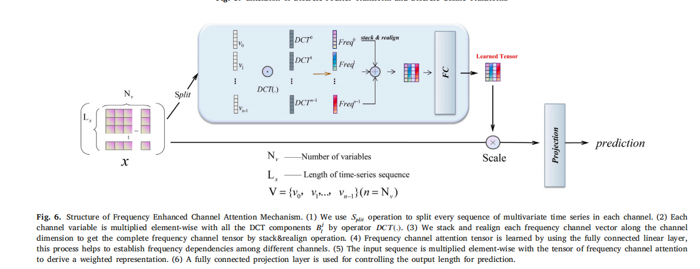

> 最近在毕业论文的查重和攥写，感觉之前说的那个SFM没有特别多可以做的（我试过的几个idea都效果一般），就算要做可能也就是在计算机领域内水一水论文，对于金融序列数据的建模提升潜力有限。
然后就是最近看勇哥看的那片新论文，讲频域分解的吉布斯效应的，我看了勇哥的报告，去了解了一下。
# FECAM：基于DCT的频率增强通道注意力机制
> 《FECAM: Frequency Enhanced Channel Attention Mechanism for Time Series Forecasting》发表在 Advanced Engineering Informatics 2023
文章其实是针对原本的SE架构的改进。将原本的“挤压”部分得到的权重 变成 使用分通道的DCT之后，再用MLP得到的权重。后面主要是讲讲这个DCT部分怎么运作的，以及为何要这么做。
## 1. 背景
> **SE模块:**
全称为Squeeze-and-Excitation（挤压与激励模块），是深度学习领域中一种用于提升模型表现的结构化设计，首次在论文"Squeeze-and-Excitation Networks"中被提出。这个模块的主要目的是通过显式地建模和调整网络中特征图各个通道的重要性，即通道间的相互依赖性，从而实现特征的自适应重新校准。下面是SE模块的工作流程：
**挤压（Squeeze）阶段：**
在这个阶段，SE模块首先对输入的特征图进行全局平均池化（Global Average Pooling）。这一步骤将每个通道的所有空间位置上的特征值压缩成一个单一的值，形成了一个1×1×C的向量，其中C是输入特征图的通道数。这个操作可以看作是对每个通道的特征进行“全局感受”，从而“挤压”了空间信息，但保留了通道间的信息。
**激励（Excitation）阶段：**
接下来，这个1×1×C的向量被输入到两个连续的全连接层中。第一个全连接层（有时会引入一个缩放参数SERatio来减少通道数，降低计算成本），其输出再经过ReLU激活函数。第二个全连接层通常伴随着一个Sigmoid或Tanh激活函数，以产生每个通道的权重，这些权重位于0到1之间，代表了每个通道对于最终分类任务或特征表达的相对重要性。
这个过程可以理解为模型学习到了如何“激励”或强调那些对于当前任务更为关键的通道，同时抑制不太重要的通道。
**Scale操作：**
最后，通过将得到的通道权重向量与原始特征图的每个通道对应相乘，实现了对原始特征图的重新校准。这意味着每个通道的特征都会乘以一个权重，强调有用的特征而削弱不重要的特征。
之所以被称为“挤压与激励”，是因为“挤压”步骤压缩了空间信息，而“激励”步骤通过学习到的权重激励了对于任务关键的通道。这种机制使得网络能够动态地调整其不同部分的贡献度，提高了模型的适应性和效率，特别是在处理具有显著通道相关性的任务时效果显著

## 2. 主要创新点

- 理论证明减轻吉布斯现象：研究者通过理论分析证明了所提方法能缓解傅立叶变换过程中产生的吉布斯现象，这是一种导致高频噪声的问题，从而影响预测结果的准确性。他们表明，一维全局平均池化（1D GAP）的结果与一维离散余弦变换（1D DCT）的最低频率分量线性相关，这为利用DCT替代传统的傅立叶变换提供了理论依据。（吉布斯现象在勇哥的报告中有写）

- 频率增强型通道注意力机制（FECAM）设计：基于上述理论，提出了一种基于DCT的频率增强型通道注意力机制。与使用傅立叶变换相比，DCT能自然地抑制由周期性问题引起的高频噪声，同时避免逆变换过程中的计算开销，增强了模型提取频率特征的能力。该机制能更好地捕捉不同通道间的频率相互依赖性，提高模型对时间序列中周期性模式的理解。

## 3. FECAM模块架构及数学描述

1. **数据切分**:
   给定输入特征矩阵 $X \in \mathbb{R}^{n \times L}$，其中 $n$ 是通道数，$L$ 是时间序列长度。首先，通过Split操作将 $X$ 沿着通道维度划分为 $n$ 个单独的通道变量集合 $\{v_0, v_1, ..., v_{n-1}\}$，每个 $v_i \in \mathbb{R}^{1 \times L}$。

2. **离散余弦变换**:
   对每个通道变量 $v_i$ 应用离散余弦变换（DCT）提取频率信息，具体为：
   $$Freq_i = DCT_j(v_i) = \sum_{j=0}^{L-1} v_i[l] \cdot B_{lj}$$
   其中 $B_{lj}$ 是DCT的基函数，$l$ 是时间步索引，这将每个通道的时间序列转换到频率域。

3. **频率通道堆叠**:
   将所有通道的频率向量 $\{Freq_0, Freq_1, ..., Freq_{n-1}\}$ 沿通道维度堆叠成频率通道张量 $Freq \in \mathbb{R}^{n \times L}$。

4. **频率通道注意力学习**:
   使用全连接层学习通道间频率的依赖关系，通过线性变换与非线性激活函数：
   $$Fatt = \sigma(W_2 \cdot \delta(W_1 \cdot Freq))$$
   其中，$\sigma$ 和 $\delta$ 分别代表如sigmoid和ReLU这样的激活函数，$W_1$ 和 $W_2$ 是权重矩阵。

5. **加权输入**:
   原始输入 $X$ 与频率通道注意力张量 $Fatt$ 进行逐元素乘法，实现加权：
   $$g(X_{t-L+1:t}) = Fatt$$
   强化或减弱特定频率成分的输入影响。

6. **输出控制**:
   通过投影层 $f(\cdot)$ 控制输出，以适应预测任务，得到最终预测输出：
   $$X_{t+1:t+o} = f(X_{t-L+1:t} \cdot g(X_{t-L+1:t}))$$
   其中，$o$ 是预测的未来时间步数。

