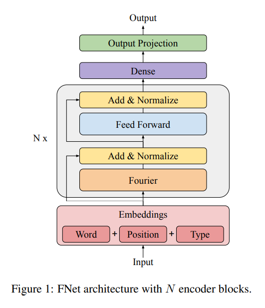
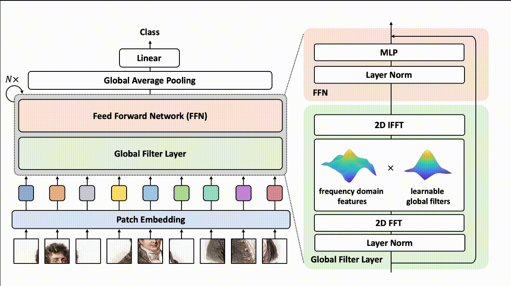
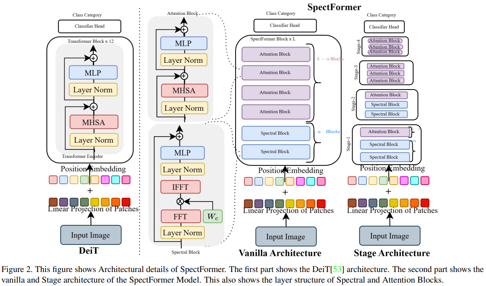

# 频率 + Transformer介绍 --视觉方向
> 主要是介绍频率层 + transformer的应用，本文中主要考虑的是视觉方向的研究，并在不断更新中。

傅里叶域在提取基于频率的图像信息分析中起着重要作用，在频率域中，图像的一些特征（如边缘、纹理等）可能更加明显或者更易于处理。下面分别在一条线上面，介绍三种模型：Fnet，GFNet，SpectFormer。

- **Fnet**的开创性研究支持了这一点，把transformer架构里attention层全部换成傅里叶层，即：将 嵌入维度x输入维度 的2-D矩阵进行二维傅里叶分解，取实部得到y。最后的结果证明，一个无attention的transformer结构，对于图像处理的结果依然很好，但是复杂度大大降低。发在NAACL 2021上

- **GFNet**证明**傅里叶变换层可以取代多头注意层**。实际上就是在上一个Fnet的基础上，把各频率那里加了一个逐元素乘法的权重，这个权重是学的。发在了NeurIPS 2021上和T-PAMI上
@import "GFNet.py" {.line-numbers}

- **SpectFormer**的贡献在上周汇报过了。实际上就是它发现，需要将频谱层和attention层合一起，先用频谱层再用self-attention层堆叠。[spectformer](Frequency_Transformer/SpectFormer_freq_att.md)

