# 一、大模型面试真题

## 1. 自注意力机制（Self-Attention）

### 核心公式

输入序列 $X \in \mathbb{R}^{n \times d}$，通过三个投影矩阵得到 Q、K、V：

$$Q = XW_Q, \quad K = XW_K, \quad V = XW_V$$

$$\text{Attention}(Q, K, V) = \text{softmax}\left(\frac{QK^T}{\sqrt{d_k}}\right)V$$

其中 $d_k$ 为 K 的维度，除以 $\sqrt{d_k}$ 防止点积过大导致 softmax 梯度消失。

### 工作流程

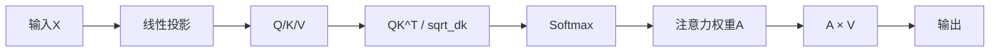

### 为什么比 RNN 更适合长序列

| 维度 | RNN | Transformer |
|------|-----|-------------|
| 序行依赖 | 逐步递推，$h_t = f(h_{t-1}, x_t)$ | 并行计算，无序列依赖 |
| 长距离依赖 | 梯度消失/爆炸，信息衰减 | 任意两位置距离为 $O(1)$ |
| 计算并行性 | 无法并行（t依赖t-1） | 完全并行 |
| 复杂度 | $O(n)$ 时间步 | $O(n^2 \cdot d)$ 自注意力 |

核心：自注意力让序列中任意两个 token 之间的信息交互路径长度为 1，而 RNN 需要 $O(n)$ 步。

---

## 2. 位置编码（Positional Encoding）

### 为什么必需

Transformer 的自注意力是**置换不变**的（permutation invariant），即打乱输入顺序输出不变。位置编码注入位置信息，使模型区分不同位置的相同 token。

### 方式一：正弦余弦编码（Sinusoidal）

$$PE_{(pos, 2i)} = \sin\left(\frac{pos}{10000^{2i/d}}\right)$$

$$PE_{(pos, 2i+1)} = \cos\left(\frac{pos}{10000^{2i/d}}\right)$$

特点：固定编码、可外推到更长序列、相对位置可线性表达。

### 方式二：可学习位置编码（Learned）

直接将位置编码作为参数学习：$PE \in \mathbb{R}^{max\_len \times d}$，随训练更新。

特点：更灵活、但受限于训练时见过的最大长度。

### 对比

| | Sinusoidal | Learned |
|---|---|---|
| 参数量 | 0 | $L_{max} \times d$ |
| 外推性 | 可外推 | 不可外推 |
| 灵活性 | 固定函数 | 数据驱动 |

---

## 3. ROPE（旋转位置编码）

### 核心思想

将位置信息通过**旋转矩阵**作用于 Q 和 K，使得内积 $q_m^T k_n$ 仅依赖相对位置 $m-n$。

### 公式

对于二维情况，位置 $m$ 的旋转操作：

$$q_m = \begin{pmatrix} \cos m\theta & -\sin m\theta \\ \sin m\theta & \cos m\theta \end{pmatrix} \begin{pmatrix} q_0 \\ q_1 \end{pmatrix}$$

推广到 $d$ 维，将 $d$ 维分为 $d/2$ 组，每组施加不同频率 $\theta_i$ 的旋转：

$$\theta_i = 10000^{-2i/d}, \quad i = 0, 1, ..., d/2-1$$

实际实现（复数形式）：

$$q_m = q \odot e^{im\Theta}$$

其中 $\Theta = (\theta_0, \theta_1, ..., \theta_{d/2-1})$。

### 关键性质

$$\langle q_m, k_n \rangle = \text{Re}[(q \odot e^{im\Theta})^* \cdot (k \odot e^{in\Theta})] = f(q, k, m-n)$$

内积仅依赖相对位置 $m-n$，天然具备相对位置编码特性。

### ROPE vs 绝对位置编码

| 维度 | 绝对位置编码 | ROPE |
|------|-------------|------|
| 编码方式 | 位置向量加到输入上 | 旋转矩阵作用于Q/K |
| 相对位置 | 不直接支持 | 天然支持 |
| 外推性 | 差（Learned）/ 有限（Sinusoidal） | 可通过NTK-aware等方法外推 |
| 远程衰减 | 无 | 有（高频分量随距离衰减） |
| 实现复杂度 | 简单（加法） | 中等（旋转操作） |
| 主流采用 | BERT, GPT-1/2 | LLaMA, Qwen, DeepSeek |

---

## 4. MHA / MQA / GQA

### 架构对比

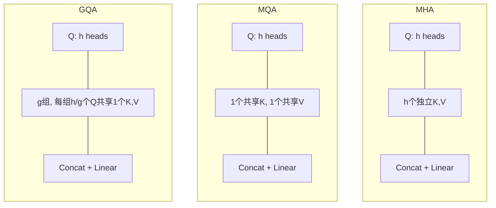

### 详细对比

| | MHA | MQA | GQA |
|---|---|---|---|
| Q头数 | $h$ | $h$ | $h$ |
| K/V头数 | $h$ | $1$ | $g$ ($g < h$) |
| KV Cache | $2 \times h \times d_k \times L$ | $2 \times d_k \times L$ | $2 \times g \times d_k \times L$ |
| 推理速度 | 基准 | 最快 | 折中 |
| 表达能力 | 最强 | 最弱 | 折中 |
| 代表模型 | GPT-3, BERT | PaLM, StarCoder | LLaMA-2, Qwen, DeepSeek |

GQA 是 MHA 和 MQA 的折中：当 $g=h$ 退化为 MHA，当 $g=1$ 退化为 MQA。

---

## 5. LLM 架构对比

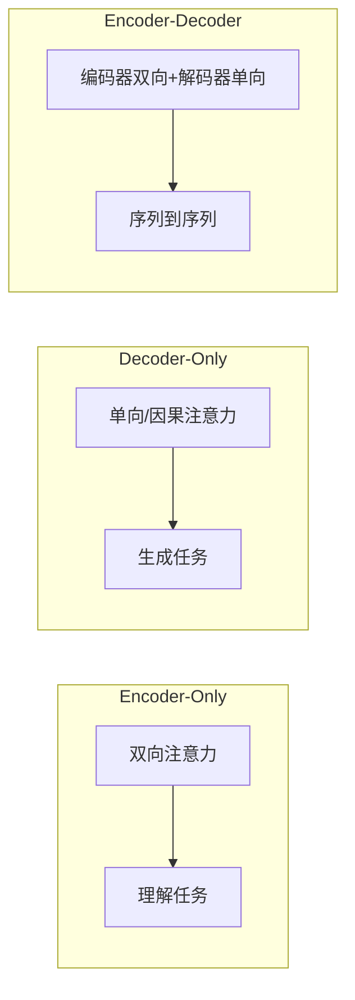

| 架构 | 注意力 | 代表模型 | 擅长任务 |
|------|--------|---------|---------|
| Encoder-Only | 双向（可见全文） | BERT, RoBERTa | 文本分类、NER、语义相似度 |
| Decoder-Only | 单向（因果mask） | GPT系列, LLaMA, Qwen | 文本生成、对话、推理 |
| Encoder-Decoder | 编码双向+解码单向 | T5, BART, Flan-T5 | 翻译、摘要、结构化生成 |

**趋势**：当前主流大模型几乎全部采用 Decoder-Only 架构，原因：
- 统一的 next-token prediction 目标，训练简单
- In-context learning 能力更强
- 推理时 KV Cache 利用效率更高

---

## 6. Scaling Laws

### Kaplan et al. (2020) 核心结论

模型损失与计算量 $C$、参数量 $N$、数据量 $D$ 的幂律关系：

$$L(C) = \left(\frac{C_c}{C}\right)^{\alpha_C}, \quad \alpha_C \approx 0.05$$

$$L(N) = \left(\frac{N_c}{N}\right)^{\alpha_N}, \quad \alpha_N \approx 0.076$$

$$L(D) = \left(\frac{D_c}{D}\right)^{\alpha_D}, \quad \alpha_D \approx 0.095$$

### Chinchilla 最优比例

Hoffmann et al. (2022) 提出：给定计算预算 $C$，最优参数量和数据量满足：

$$N_{opt} \propto C^{0.5}, \quad D_{opt} \propto C^{0.5}$$

即**模型参数和数据量应等比例增长**。Chinchilla (70B) 用更多数据超过了 Gopher (280B)。

### 指导意义

1. **计算预算分配**：先确定总算力，再按比例分配 $N$ 和 $D$
2. **数据瓶颈**：高质量数据是稀缺资源，数据量不足时放大模型意义有限
3. **过度参数化**：很多模型训练不充分（GPT-3 300B参数仅用300B tokens），Chinchilla建议更小模型+更多数据
4. **预测性能**：无需训练完整模型即可通过小实验外推预测大模型性能

---

## 7. 解码策略

### Greedy Search

每步选概率最大的 token：$y_t = \arg\max_{w} P(w | y_{<t})$

- 优点：速度快、确定性
- 缺点：容易陷入局部最优，输出重复、缺乏多样性

### Beam Search

维护 $k$ 个候选序列，每步扩展后保留 top-k：

$$\text{Score}(y_{1:t}) = \sum_{i=1}^{t} \log P(y_i | y_{<i})$$

- 优点：比贪心全局更优
- 缺点：仍倾向生成高频安全文本，缺乏创造性；$k$ 越大计算量越大

### Top-K Sampling

从概率最大的 K 个 token 中按概率采样：

$$\mathcal{V}_k = \text{top-k}(\{P(w|y_{<t})\})$$

$$P'(w) = \frac{P(w)}{\sum_{w' \in \mathcal{V}_k} P(w')}, \quad w \in \mathcal{V}_k$$

- 优点：引入随机性，输出多样
- 缺点：K 固定，不适应分布变化（尖锐分布时K太大引入噪声，平坦分布时K太小限制多样性）

### Nucleus Sampling (Top-P)

从概率累积和达到 P 的最小集合中采样：

$$\mathcal{V}_p = \min\{S : \sum_{w \in S} P(w|y_{<t}) \geq p\}$$

- 优点：自适应候选集大小，分布尖锐时候选少，平坦时候选多
- 缺点：P 值选择仍需调参

### 对比总结

| 策略 | 多样性 | 质量 | 速度 | 自适应 |
|------|--------|------|------|--------|
| Greedy | 低 | 中 | 快 | - |
| Beam | 低 | 高 | 中 | - |
| Top-K | 高 | 中 | 快 | 否 |
| Top-P | 高 | 中高 | 快 | 是 |

---

## 8. 词元化：BPE vs WordPiece

### BPE（Byte Pair Encoding）

**算法流程**：
1. 初始化：将语料中每个词拆为字符序列，词尾加 `</w>`
2. 统计所有相邻字符对频率
3. 合并频率最高的字符对为新符号
4. 重复 2-3 直到达到词表大小上限

**示例**：`low` → `l o w </w>` → 合并 `l o` → `lo w </w>` → 合并 `lo w` → `low </w>`

### WordPiece

**算法流程**：
1. 初始化为字符级词表
2. 对每对相邻子词，计算合并后的**语言模型似然增益**：

$$\text{Score}(A, B) = \frac{P(AB)}{P(A) \cdot P(B)}$$

3. 选择增益最大的对合并
4. 重复直到词表达到上限

### 核心区别

| | BPE | WordPiece |
|---|---|---|
| 合并标准 | 频率最高 | 似然增益最大 |
| 标记方式 | 词尾 `</w>` | 子词前加 `##`（如 `un##ing`） |
| 代表模型 | GPT系列, LLaMA | BERT, DistilBERT |
| 倾向 | 合并高频对 | 合并对语言模型最有价值的对 |

**补充**：SentencePiece 是 BPE/Unigram 的语言无关实现，直接从原始文本操作，不需要预分词。

---

## 9. NLP vs LLM

| 维度 | 传统NLP | LLM |
|------|---------|-----|
| 范式 | 任务特定模型（分类器、CRF等） | 统一生成式模型 |
| 特征 | 手工特征（TF-IDF, n-gram） | 自监督学习表示 |
| 迁移学习 | 浅层微调 | 预训练+指令微调+对齐 |
| 任务适配 | 每个任务训练一个模型 | 一个模型覆盖所有任务 |
| 数据需求 | 标注数据驱动 | 海量无标注数据+少量标注 |
| 推理能力 | 规则/模式匹配 | 涌现的推理能力 |

**共同点**：都处理自然语言，都依赖表示学习，都关注语义理解。

**核心区别**：LLM 通过规模和统一目标（next-token prediction）实现了能力的质变——从"窄任务专家"到"通用语言智能"。

---

## 10. L1 与 L2 正则化

### L1 正则化（Lasso）

$$\mathcal{L}_{L1} = \mathcal{L} + \lambda \sum_{i} |w_i|$$

- 产生**稀疏解**，部分权重精确为零
- 等价于拉普拉斯先验 $w \sim \text{Laplace}(0, b)$
- **适用场景**：特征选择、模型压缩、希望部分参数为零

### L2 正则化（Ridge / Weight Decay）

$$\mathcal{L}_{L2} = \mathcal{L} + \lambda \sum_{i} w_i^2$$

- 权重趋向小但非零，防止某个权重过大
- 等价于高斯先验 $w \sim \mathcal{N}(0, \sigma^2)$
- **适用场景**：防止过拟合、训练稳定性、LLM训练中常用（Weight Decay）

### 几何直觉

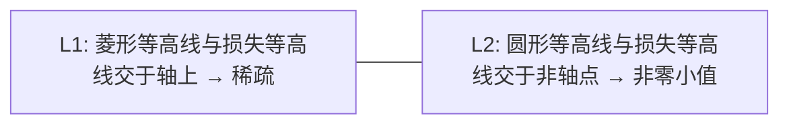

**LLM中的使用**：AdamW 将 weight decay 与梯度更新解耦，是 L2 的改进版，几乎全部 LLM 训练使用。

---

## 11. 涌现能力（Emergent Abilities）

### 定义

当模型规模（参数量/数据量/计算量）超过某个阈值后，模型突然获得在小规模时几乎不具备的能力，且该能力无法通过小模型的性能曲线外推预测。

### 典型涌现任务

- 少样本指令遵循（~10B 参数开始显现）
- 思维链推理（Chain-of-Thought，~60B 参数显著提升）
- 多语言翻译、数学推理等

### 争议

Wei et al. (2022) 提出涌现与评估指标有关：使用非线性指标（exact match）时出现"突变"，使用连续指标时可能是平滑提升。Schaeffer et al. (2023) 认为涌现可能是评估度量的假象。

---

## 12. LLM 常用激活函数

### GeLU（Gaussian Error Linear Unit）

$$\text{GeLU}(x) = x \cdot \Phi(x) = x \cdot \frac{1}{2}\left[1 + \text{erf}\left(\frac{x}{\sqrt{2}}\right)\right]$$

近似实现：$\text{GeLU}(x) \approx 0.5x(1 + \tanh[\sqrt{2/\pi}(x + 0.044715x^3)])$

- BERT, GPT-2 使用

### SwiGLU

$$\text{SwiGLU}(x, W, V, b, c) = (\text{Swish}(xW + b) \otimes (xV + c))$$

其中 $\text{Swish}(x) = x \cdot \sigma(x) = x \cdot \frac{1}{1+e^{-x}}$

- LLaMA, Qwen, DeepSeek 等现代 LLM 使用

### 为什么选 SwiGLU

| 特性 | ReLU | GeLU | SwiGLU |
|------|------|------|--------|
| 负区间 | 完全截断 | 平滑截断 | 平滑截断 |
| 梯度 | 零（负区间） | 非零 | 非零 |
| GLU门控 | 无 | 无 | 有（信息选择） |
| 实验表现 | 基准 | 优于ReLU | 优于GeLU |

Shazeer (2020) 实验表明 GLU 变体（SwiGLU > GeGLU > Swish > GeLU > ReLU）在语言建模上持续更优。

---

## 13. 混合专家模型（MoE）

### 工作原理

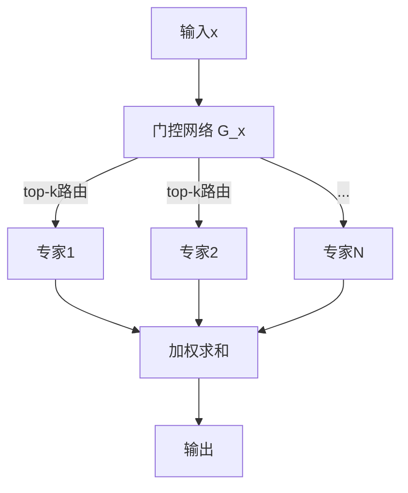

**门控函数**：

$$G(x) = \text{softmax}(\text{TopK}(x \cdot W_g))$$

$$\text{MoE}(x) = \sum_{i \in \text{TopK}} G(x)_i \cdot E_i(x)$$

通常 Top-K = 1 或 2，即每个 token 只激活 1-2 个专家。

### 为什么不显著增加推理成本

- 总参数量大（如 DeepSeek-V3 671B），但每个 token 只激活部分专家（如 37B）
- **推理 FLOPs ≈ 激活参数量的模型**，与总参数量无关
- 训练时同样：每个 token 的计算量由激活参数决定

### 关键挑战

1. **负载均衡**：防止所有 token 路由到少数专家。辅助损失：

$$\mathcal{L}_{aux} = \alpha \cdot N \sum_{i=1}^{N} f_i \cdot P_i$$

其中 $f_i$ 为分配给专家 $i$ 的 token 比例，$P_i$ 为门控概率均值。

2. **通信开销**：专家分布在不同 GPU 上，All-to-All 通信是瓶颈
3. **训练不稳定性**：路由决策的离散性导致梯度估计困难

---

## 14. 训练百/千亿参数 LLM 的挑战

### 显存挑战

| 组件 | 显存占用 |
|------|---------|
| 模型参数 | $2N$ bytes（FP16） |
| 梯度 | $2N$ bytes |
| 优化器状态 | Adam: $8N$ bytes（FP32的m和v） |
| 激活值 | 与序列长度和批大小成正比 |

总显存 $\approx 16N$（混合精度 Adam）。70B 模型需约 1.1TB 显存。

**解决方案**：ZeRO 1/2/3 分片优化器状态/梯度/参数；激活重计算；CPU Offloading。

### 通信挑战

- 数据并行：AllReduce 梯度同步
- 张量并行：每层内 AllReduce（2次/层）
- 流水线并行：层间点对点通信
- MoE：All-to-All 专家路由

**解决方案**：通信与计算重叠、环形通信、1F1B 调度。

### 训练不稳定性

- 损失尖峰（loss spike）
- 梯度爆炸/消失

**解决方案**：
- 预归一化（Pre-LN）或 RMSNorm
- 梯度裁剪（gradient clipping）
- 学习率预热（warmup）
- BF16 替代 FP16（动态范围更大）

---

## 15. 开源框架与论文创新点

### Qwen 系列创新

| 版本 | 创新点 |
|------|--------|
| Qwen-1 | RoPE + SwiGLU + RMSNorm + MHA |
| Qwen-1.5 | GQA、更优的分词器、更大规模数据 |
| Qwen-2 | GQA + 密集/稀疏混合架构、长上下文支持 |
| Qwen-2.5 | 更大MoE模型、多语言增强 |
| Qwen3 | 思考模式切换、GQA、DAPO训练 |

### DeepSeek 系列创新

| 版本 | 创新点 |
|------|--------|
| DeepSeek-V1 | MLA（Multi-head Latent Attention）：将KV压缩到低维潜在空间，大幅降低KV Cache |
| DeepSeek-V2 | MLA + DeepSeekMoE（细粒度专家+共享专家） |
| DeepSeek-V3 | MLA + MoE + 辅助无损负载均衡（无辅助损失的负载均衡策略） + FP8混合精度训练 |
| DeepSeek-R1 | GRPO强化学习、蒸馏小模型、推理链自发涌现 |

### MLA 核心公式

将 KV 压缩到低维潜在表示：

$$c^{KV} = W_{DKV} \cdot h_t$$

$$k_t = W_{UK} \cdot c^{KV}, \quad v_t = W_{UV} \cdot c^{KV}$$

KV Cache 从 $2 \times n_h \times d_k \times L$ 压缩到 $d_c \times L$（$d_c \ll n_h \times d_k$）。

---

## 16. Adam / AdamW 优化器

### Adam 算法

结合动量（Momentum）和自适应学习率（RMSprop）：

$$m_t = \beta_1 m_{t-1} + (1-\beta_1) g_t$$
$$v_t = \beta_2 v_{t-1} + (1-\beta_2) g_t^2$$

偏差修正：

$$\hat{m}_t = \frac{m_t}{1-\beta_1^t}, \quad \hat{v}_t = \frac{v_t}{1-\beta_2^t}$$

参数更新：

$$\theta_{t+1} = \theta_t - \frac{\eta}{\sqrt{\hat{v}_t} + \epsilon} \cdot \hat{m}_t$$

| 参数 | 典型值 | 含义 |
|------|--------|------|
| $\eta$ | $10^{-4}$ 或 $3\times10^{-5}$ | 学习率 |
| $\beta_1$ | 0.9 | 一阶矩衰减 |
| $\beta_2$ | 0.999 | 二阶矩衰减 |
| $\epsilon$ | $10^{-8}$ | 数值稳定性 |

### AdamW vs Adam

**核心区别**：Adam 将 weight decay 直接加到梯度上，导致 decay 与学习率耦合；AdamW 将 weight decay 从梯度更新中解耦，直接从参数中减去。

$$\text{Adam: } \theta_{t+1} = \theta_t - \eta(\nabla L + \lambda w) / (\sqrt{\hat{v}} + \epsilon) \cdot \hat{m}$$

$$\text{AdamW: } \theta_{t+1} = (1 - \lambda\eta)\theta_t - \eta \cdot \hat{m}/(\sqrt{\hat{v}_t} + \epsilon)$$

**为什么选 AdamW**：
1. Weight decay 与学习率独立，调参更直观
2. 理论上等价于 L2 正则化（Adam 不等价）
3. 几乎所有现代 LLM 训练使用 AdamW

### LLM 训练中的 AdamW 配置

| 配置项 | 值 | 说明 |
|--------|-----|------|
| 学习率 | $3\times10^{-4}$（预训练）→ $2\times10^{-5}$（微调） | 预训练较大，微调较小 |
| Warmup | 1000~2000步 | 防止初始梯度爆炸 |
| Cosine Decay | 余弦退火至最大步数的10% | 平滑降低学习率 |
| $\beta_1, \beta_2$ | 0.9, 0.95 | 标准 |
| Weight Decay | 0.1 | 微调时常用 0.01~0.05 |
| $\epsilon$ | $10^{-8}$ 或 $10^{-6}$ | FP16/BF16 时用 $10^{-6}$ 防止下溢 |

---

## 17. 损失函数详解

### 交叉熵损失（Cross-Entropy Loss）

LLM 预训练的核心损失。对于 token 序列 $y = (y_1, ..., y_T)$：

$$\mathcal{L}_{CE} = -\sum_{t=1}^{T} \log P_\theta(y_t | y_{<t}, x)$$

其中 $P_\theta(y_t | y_{<t}, x)$ 为模型对第 t 个 token 的预测概率。

**推导直觉**：最大化似然等价于最小化负对数似然。当模型预测正确 token 的概率为 1 时，损失为 0；概率越低，损失越大。

**与 softmax 的关系**：$P(y_t) = \text{softmax}(z)[y_t]$，即 logits 经过 softmax 后取正确类别的概率。

### MSE 损失（均方误差）

$$\mathcal{L}_{MSE} = \frac{1}{N}\sum_{i=1}^{N}(y_i - \hat{y}_i)^2$$

在 LLM 中主要用于：
- **奖励模型回归**：将 RM 输出拟合到目标奖励值
- **嵌入空间对齐**：如 CLIP 的对比损失中隐含 MSE 思想
- **一般不用于主训练**：MSE 对分类任务效果差于交叉熵

### GAE 损失（详见 RLHF 文档第 18 节）

---

## 18. Softmax 详解

### 定义

$$\text{softmax}(z_i) = \frac{e^{z_i}}{\sum_j e^{z_j}}$$

输出为概率分布：$\sum_i \text{softmax}(z_i) = 1$, $\text{softmax}(z_i) > 0$

### 为什么除以 $\sqrt{d_k}$

设 Q 和 K 的每个分量服从均值0方差1的独立分布，点积 $QK^T$ 的每个元素是 $d_k$ 个独立随机变量之和：

$$\text{Var}(QK^T) = d_k \cdot \text{Var}(q_i k_i) = d_k$$

标准差为 $\sqrt{d_k}$。当 $d_k$ 大时（如 128），点积值很大 → softmax 进入饱和区（接近 0 或 1）→ 梯度趋近于 0。

除以 $\sqrt{d_k}$ 使点积的方差归一化为 1，保持 softmax 处于非饱和区域。

### 多头注意力的作用

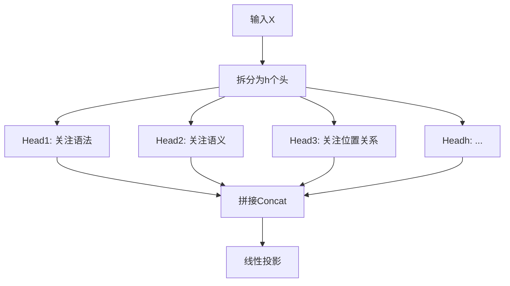

| 单头注意力 | 多头注意力 |
|-----------|-----------|
| 只能学一种关注模式 | 不同头可关注不同子空间 |
| 信息瓶颈大 | 并行提取多方面特征 |
| 类比单通道CNN | 类比多通道CNN |

**本质**：多头让模型同时关注"这个词和哪些词有语法关系"、"哪些词语义相近"、"哪些词位置相关"等不同维度。

---

## 19. LayerNorm 手撕

### 公式

给定输入 $x \in \mathbb{R}^d$：

$$\mu = \frac{1}{d}\sum_{i=1}^{d} x_i$$
$$\sigma^2 = \frac{1}{d}\sum_{i=1}^{d}(x_i - \mu)^2$$
$$\text{LN}(x) = \gamma \odot \frac{x - \mu}{\sqrt{\sigma^2 + \epsilon}} + \beta$$

其中 $\gamma, \beta \in \mathbb{R}^d$ 为可学习的仿射参数，$\epsilon \approx 10^{-5}$ 防止除零。

### 为什么用 LayerNorm 而非 BatchNorm

| 维度 | BatchNorm | LayerNorm |
|------|-----------|-----------|
| 归一化维度 | 同一batch的不同样本 | 同一样本的不同特征维度 |
| 依赖 batch size | 是（小batch不稳定） | 否 |
| 变长序列支持 | 差（需要 padding mask） | 天然支持 |
| 推理行为 | 与训练不一致（依赖统计量） | 一致 |
| 适用场景 | CNN | Transformer/NLP |

**LayerNorm 在 Transformer 中的位置**：
- Post-LN（原始Transformer）：Attention → LN → FFN → LN
- Pre-LN（现代LLM）：LN → Attention → LN → FFN（训练更稳定）

---

## 20. 归一化方法对比：BN vs LN vs RMSNorm

### BN（Batch Normalization）

$$\text{BN}(x) = \gamma \frac{x - \mu_B}{\sqrt{\sigma_B^2 + \epsilon}} + \beta$$

$\mu_B, \sigma_B^2$ 为 mini-batch 内的均值和方差。

### LN（Layer Normalization）

$$\text{LN}(x) = \gamma \frac{x - \mu_L}{\sqrt{\sigma_L^2 + \epsilon}} + \beta$$

$\mu_L, \sigma_L^2$ 为单个样本内各维度的均值和方差。

### RMSNorm（Root Mean Square Normalization）

$$\text{RMSNorm}(x) = \gamma \frac{x}{\sqrt{\frac{1}{d}\sum_{i=1}^{d}x_i^2 + \epsilon}}$$

**与 LN 的区别**：去掉中心化（减均值），只做缩放。计算更快，效果相当或更好。

### 三者对比

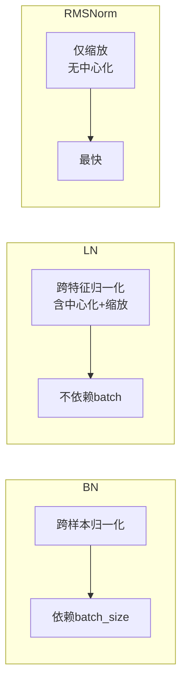

| | BN | LN | RMSNorm |
|---|---|---|---|
| 归一化方向 | 样本级 | 特征级 | 特征级 |
| 中心化（减均值） | 有 | 有 | 无 |
| 可学习参数 | $\gamma, \beta$ | $\gamma, \beta$ | 仅 $\gamma$ |
| 计算量 | 中 | 中 | 最少 |
| 代表模型 | ResNet, CNN | BERT, GPT-1/2 | LLaMA, Qwen, DeepSeek |

**趋势**：现代 LLM 全部使用 RMSNorm（或 Pre-RMSNorm），原因：速度更快、训练更稳定、无需维护均值偏移。

---

## 21. 位置编码全览：ViT / 二维 / 相对 / 多模态

### ViT 位置编码

Vision Transformer 使用**可学习的 1D 位置嵌入**，与 BERT 的 Learned PE 相同：

$$E_{pos} \in \mathbb{R}^{(H/P \times W/P + 1) \times d}$$

将图像切分为 $P\times P$ 的 patch，展平后加位置嵌入。`+1` 为 CLS token。

### 二维位置编码（2D Positional Encoding）

ViT 的 1D 编码忽略了图像的二维空间结构。改进方案：

**方法一：坐标嵌入**

$$PE_{(x,y)} = E_x(x) + E_y(y)$$

分别对 x 坐标和 y 坐标做 1D 位置编码后相加。

**方法二：频率编码（Fourier Features）**

$$\gamma(v) = [\cos(2\pi B v), \sin(2\pi B v)]$$

其中 $B$ 为随机高斯矩阵，$v = (x, y)$。NeRF 中广泛使用，可外推。

### 相对位置编码（Relative Position Encoding）

不编码绝对位置，而是编码 token 对之间的相对距离。代表工作：

| 方法 | 公式 | 特点 |
|------|------|------|
| T5 RPE | $e_{ij} = w_{clamp(i-j)}$ | 可学习偏置矩阵 |
| DeBERTa | $a_{ij} = W \cdot [q_i; k_j; q_i - k_j; i-j]$ | 内容+位置解耦 |
| ALiBi | $m_{ij} = -\alpha |i-j|$ | 线性衰减，无需训练 |

### 多模态位置编码（VLM 中的位置编码）

VLM 需要处理视觉和文本两种模态的位置信息：

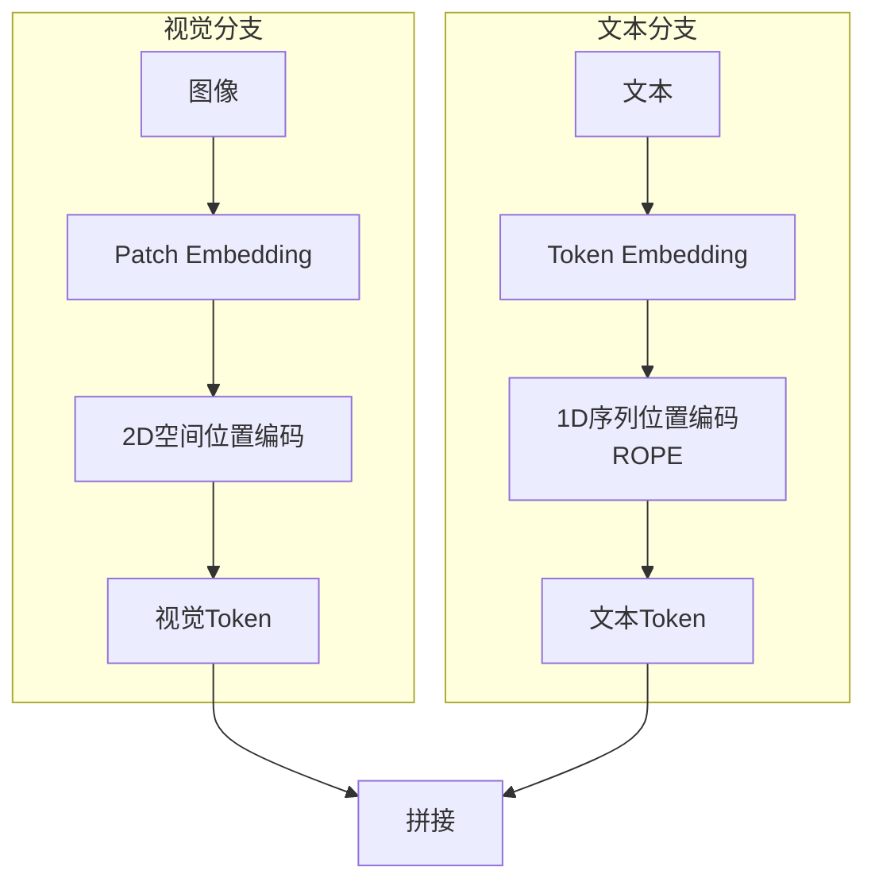

**关键设计**：
- 视觉 token 用 2D 位置编码（保留空间信息）
- 文本 token 用 ROPE（相对位置）
- 拼接后统一进入 Transformer
- 部分 VLM（如 Qwen-VL）在视觉和文本间加入 **modality-aware embedding** 区分来源

---

## 22. BBPE（Byte-Level BPE）

### 与 BPE 的区别

BPE 在 Unicode 字符级别操作；BBPE 在**字节级别**操作（0-255）。

| | BPE | BBPE |
|---|---|---|
| 操作单元 | Unicode 字符 | 字节 |
| 词表大小 | 通常 30K-50K | 通常 50K+ |
| 覆盖范围 | 取决于语料语言 | 所有语言（字节通用） |
| OOV问题 | 有（罕见字符/多语言） | 无（所有输入均可编码） |

### 为什么用 BBPE

1. **无 OOV**：任何语言的任何字符都能被编码为字节序列
2. **跨语言统一**：中英日韩等所有语言共享同一词表
3. **SentencePiece 默认**：LLaMA, Qwen 等均采用 SentencePiece + BBPE
4. **效率**：字节级操作简单，不需要复杂的分词器

### 示例

中文"你好"的 UTF-8 编码为 `E4 BD A0 E5 A5 BD`（6个字节），BBPE 可能将其合并为 2-3 个子词。

---

## 23. FlashAttention 原理

### 核心问题

标准自注意力的显存瓶颈：需要存储完整的 $n \times n$ 注意力矩阵 $S = QK^T/\sqrt{d_k}$，显存占用 $O(n^2)$。

### IO-Aware 设计思想

FlashAttention 不通过 HBM（GPU 高带宽内存）存储中间结果，而是在 **SRAM（片上缓存）** 内完成 softmax 和加权求和，大幅减少 HBM 读写次数。

### 算法流程（FlashAttention-2）

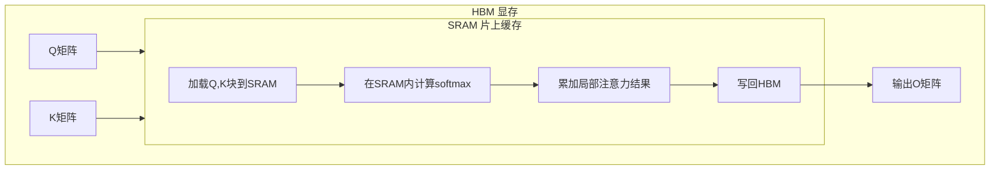

**关键技巧**：在线 softmax（Online Softmax），避免存储完整注意力矩阵：

$$\text{softmax}(x)_i = \frac{e^{x_i}}{\sum_j e^{x_j}} = \frac{e^{x_i - m}}{\sum_j e^{x_j - m}}$$

分块计算时维护 running max $m$ 和 running sum $\ell$，逐块更新：

$$m_{new} = \max(m_{old}, m_{block}), \quad \ell_{new} = \ell_{old} \cdot e^{m_{old} - m_{new}} + \ell_{block} \cdot e^{m_{block} - m_{new}}$$

### 性能对比

| | 标准Attention | FlashAttention-1 | FlashAttention-2 |
|---|---|---|---|
| HBM读写量 | $O(n^2 d)$ | $O(nd^2)$ | 更少 |
| 计算吞吐 | 基准 | ~3x | ~2x (vs FA-1) |
| 显存占用 | $O(n^2)$ | $O(1)$（额外） | 同左 |
| 支持反向传播 | 是 | 是 | 是 |

### FlashAttention 在 LLM 中的地位

几乎所有现代开源 LLM（LLaMA, Qwen, DeepSeek, Mistral 等）都基于 FlashAttention 实现，是训练和推理加速的基础组件。

---

## 24. KV Cache 原理

### 问题

自回归解码时，每生成一个新 token 都需要重新计算之前所有 token 的 KV：

$$t=1: \text{Attn}(q_1, [k_1], [v_1])$$
$$t=2: \text{Attn}(q_2, [k_1,k_2], [v_1,v_2])$$
$$t=T: \text{Attn}(q_T, [k_1,...,k_T], [v_1,...,v_T])$$

总计算量 $\sum_{t=1}^{T} O(t \cdot d) = O(T^2 d)$。

### KV Cache 方案

缓存已计算的 K 和 V，每步只需计算新 token 的 Q 及其与缓存的 KV 的注意力：

$$t=T: \text{Attn}(q_T, \underbrace{[k_1,...,k_{T-1}]}_{\text{Cache}}, \underbrace{[v_1,...,v_{T-1}]}_{\text{Cache}})$$

每步计算量从 $O(Td)$ 降为 $O(d)$。

### 显存开销

$$\text{KV Cache 大小} = 2 \times n_{layers} \times n_{heads} \times d_{head} \times seq\_len \times bytes$$

以 LLaMA-2-70B 为例（80层，64头，128维头，FP16，4K上下文）：

$$2 \times 80 \times 64 \times 128 \times 4096 \times 2 = 5.37 \text{ GB}$$

**优化方向**：
- GQA/MQA：减少 KV 头数 → 降低 cache 大小
- MLA（DeepSeek）：压缩 KV 到低维潜在空间
- PagedAttention（vLLM）：解决显存碎片化

---

## 25. vLLM 原理

### 核心创新：PagedAttention

借鉴操作系统虚拟内存的分页机制，管理 KV Cache。

### 传统方案的缺陷

连续分配 KV Cache 导致：
1. **内部碎片**：预分配的空间可能未完全使用
2. **外部碎片**：释放的不规则空闲块难以复用
3. **浪费严重**：为最坏情况预留空间

### PagedAttention 工作原理

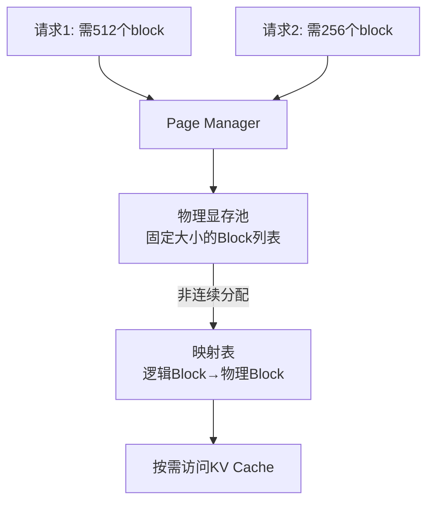

**关键设计**：
- 将 KV Cache 划分为固定大小的 Block（如每个 block 存 16 个 token）
- 逻辑上连续，物理上分散存储
- 通过块表（Block Table）映射逻辑地址到物理地址
- 类似 OS 的页表机制

### Continuous Batching

传统推理：等整个 batch 完成后才处理下一个请求。

vLLM：当一个请求完成后立即插入新请求，保持 GPU 利用率恒定。

```mermaid
gantt
    title 传统Batching vs Continuous Batching
    dateFormat X
    axisFormat %s
    
    section 传统
    ReqA :a1, 0, 5
    idle :crit, 5, 8
    ReqB :b1, 8, 12
    
    section vLLM Continuous
    ReqA :c1, 0, 5
    ReqB :c2, 5, 9
    ReqC :c3, 9, 11
```

### vLLM 性能优势

| 维度 | 传统框架（HuggingFace） | vLLM |
|------|------------------------|-------|
| GPU利用率 | 低（等待batch完成） | 高（continuous batching） |
| 内存利用率 | 浪费（预留+碎片） | 高效（PagedAttention） |
| 吞吐量 | 基准 | 2-24x 提升 |
| 适用场景 | 单请求/小批量 | 生产环境高并发服务 |

---

## 26. 熵、KL散度、温度系数

### 信息熵

离散分布 $p(x)$ 的熵：

$$H(p) = -\sum_{x} p(x) \log p(x)$$

含义：分布的不确定性程度。均匀分布熵最大，确定性分布（delta）熵为0。

### 交叉熵

$$H(p, q) = -\sum_{x} p(x) \log q(x) = H(p) + D_{KL}(p \| q)$$

当 $p$ 为真实分布（one-hot）、$q$ 为模型预测分布时，交叉熵 = 负对数似然损失。

### KL散度（Kullback-Leibler Divergence）

$$D_{KL}(p \| q) = \sum_{x} p(x) \log \frac{p(x)}{q(x)}$$

性质：
- $D_{KL} \geq 0$，当且仅当 $p=q$ 时等于0
- **不对称**：$D_{KL}(p \| q) \neq D_{KL}(q \| p)$
- 不是真正的度量（不满足三角不等式）

### 三者关系

$$H(p, q) = H(p) + D_{KL}(p \| q)$$

最小化交叉熵 = 最小化 KL 散度（因为 $H(p)$ 是常数）。

### 温度系数 Temperature

带温度的 softmax：

$$\text{softmax}_T(z_i) = \frac{e^{z_i/T}}{\sum_j e^{z_j/T}}$$

| 温度 | 效果 |
|------|------|
| $T \to 0$ | 分布趋近 one-hot（贪婪） |
| $T = 1$ | 原始分布 |
| $T > 1$ | 分布更平坦（更多样性） |
| $T \to \infty$ | 均匀分布（随机） |

**应用场景**：
- **采样时调温**：$T=0.7$ 左右平衡质量和多样性
- **知识蒸馏**：教师模型用高温软化标签，学生模型学习软目标
- **RLHF**：温度影响策略探索程度

---

## 27. LoRA 原理、初始化与变体

### 核心思想

冻结预训练权重 $W_0 \in \mathbb{R}^{d \times k}$，注入可训练的低秩分解矩阵：

$$W = W_0 + \Delta W = W_0 + BA, \quad B \in \mathbb{R}^{d \times r}, A \in \mathbb{R}^{r \times k}, r \ll \min(d, k)$$

前向传播时：

$$h = W_0 x + BAx = W_0 x + B(Ax)$$

```mermaid
flowchart LR
    X[输入x] --> F1[W0x<br/>冻结]
    X --> F2[Ax: 投影到r维]
    F2 --> F3[B·(Ax): 恢复到d维]
    F1 --> ADD[+]
    F3 --> ADD
    ADD --> H[输出h]
```

### 参数量分析

原始参数量：$d \times k$

LoRA 参数量：$d \times r + r \times k = r(d+k)$

压缩比：$\frac{r(d+k)}{dk}$。当 $r=8, d=k=4096$ 时，压缩比约 $\frac{8\times8192}{16.7M} \approx 0.39\%$。

### 初始化策略（关键面试点）

| 矩阵 | 初始化方式 | 原因 |
|------|-----------|------|
| $A$ | **高斯随机初始化 $\sim \mathcal{N}(0, \sigma^2)$** | 随机投影 |
| $B$ | **全零初始化 $B = 0$** | 保证初始状态 $\Delta W = 0$ |

**为什么 $B$ 要初始化为零？**

训练开始时 $BA = 0$，即 $W = W_0$，模型行为完全等同于冻结的预训练模型。这意味着：

1. 训练起点就是已验证的良好状态
2. 学习率可以设置较大（因为初始扰动为0）
3. 不会破坏预训练知识
4. 若 $B$ 不为零，初始扰动可能破坏已有能力

### 参数 α 的作用

LoRA 引入缩放因子 $\alpha$ 控制更新幅度：

$$\Delta W = \frac{\alpha}{r} BA$$

- $\alpha/r$ 为有效学习率缩放系数
- 通常设 $\alpha = r$，此时 $\alpha/r = 1$
- 调整 $\alpha$ 相当于调整 LoRA 的学习率，无需改全局 lr
- $\alpha > r$ → 更激进的适应；$\alpha < r$ → 更保守的微调

### LoRA 变体

| 变体 | 改进点 |
|------|--------|
| **AdaLoRA** | 自适应分配不同层的秩 $r_i$，重要层给更多参数 |
| **DoRA** (Weight-Decomposed) | 将权重分解为幅值和方向，分别做低秩适配 |
| **LoRA+** | 对 $A$ 和 $B$ 使用不同的学习率（$B$ 用更大lr）|
| **LoftQ** | 通过量化感知训练解决量化模型上 LoRA 性能下降问题 |
| **VeRA** | 共享 $A, B$ 矩阵，只学习每层的小尺度向量，进一步减少参数 |
| **QLoRA** | 将基座模型量化为4-bit（NF4），在此基础上应用 LoRA |

### QLoRA（最常用变体）

将预训练模型量化为 4-bit NormalFloat（NF4），再在其上训练 LoRA：

$$W_{quantized} = \text{Quantize}(W_0, 4\text{-bit NF4})$$
$$W = \text{Dequantize}(W_{quantized}) + \frac{\alpha}{r} BA$$

优势：70B 模型从 ~140GB 显存降至 ~48GB（单卡 A100 可跑）。
代表工具：bitsandbytes + HuggingFace PEFT / Axolotl / LLaMA-Factory。

---

## 28. 分布式训练详解：DeepSpeed / FSDP / 3D并行

### 并行策略总览

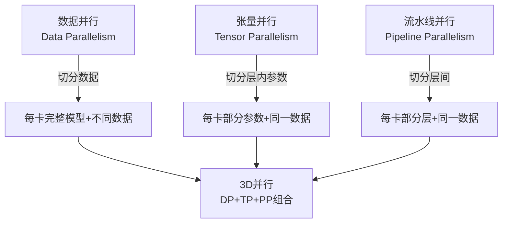

### 数据并行（Data Parallelism）

每张 GPU 持有完整模型副本，处理不同数据，梯度 AllReduce 同步。

**显存**：每卡需完整模型 + 优化器状态 + 梯度

### DeepSpeed ZeRO（Zero Redundancy Optimizer）

将数据并行中的冗余状态分片到各卡：

| 阶段 | 分片内容 | 每卡显存 | 通信量 |
|------|---------|---------|--------|
| ZeRO-0 | 无分片（标准DP） | $16N$ | $1\times$ |
| ZeRO-1 | 优化器状态分片 | $\sim 4N + \frac{12N}{G}$ | $1\times$ |
| ZeRO-2 | +梯度分片 | $\sim 4N + \frac{6N}{G}$ | $1\times$ |
| ZeRO-3 | +参数分片 | $\sim \frac{16N}{G}$ | $1.5\times$ |

$N$ = 参数量，$G$ = GPU数。ZeRO-3 实现近似 $1/G$ 的显存缩放。

**ZeRO-3 的代价**：前向/反向时需 All-Gather 收集参数，通信量增加 50%。

### FSDP（Fully Sharded Data Parallel）

PyTorch 原生实现的 ZeRO-3 等价方案：

| | DeepSpeed ZeRO-3 | FSDP |
|---|---|---|
| 实现 | 第三方库 | PyTorch 原生 |
| 易用性 | 配置复杂 | 更简洁 |
| 生态 | 更成熟（更多trick） | 快速追赶 |
| 混合精度 | 支持 | 支持 |
| Offload | 支持CPU/NVMe Offload | 支持CPU Offload |

### 张量并行（Tensor Parallelism）

将单个层的参数切分到多卡。以线性层 $Y = XW$ 为例：

**列切分**：$W = [W_1, W_2]$，各卡计算 $Y_i = XW_i$，All-Gather 拼接 $Y = [Y_1, Y_2]$

**行切分**：$W = \begin{bmatrix}W_1 \\ W_2\end{bmatrix}$，输入 $X = [X_1, X_2]$，各卡计算 $Y_i = X_iW_i$，All-Reduce 求和

每层需要 2 次 All-Reduce（前向1次+反向1次），通信量大，通常限制在同一节点内（NVLink互联）。

### 流水线并行（Pipeline Parallelism）

将模型按层切分到不同 GPU：

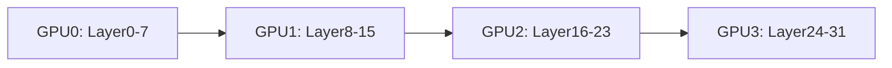

**问题**：朴素流水线有严重的气泡（bubble），GPU 空闲等待。

**1F1B 调度**（One Forward One Backward）：

| 时间步 | GPU0 | GPU1 | GPU2 | GPU3 |
|--------|------|------|------|------|
| 1 | F0 | - | - | - |
| 2 | F1 | F0 | - | - |
| 3 | F2 | F1 | F0 | - |
| 4 | F3 | F2 | F1 | F0 |
| 5 | B0 | F3 | F2 | F1 |
| 6 | B1 | B0 | F3 | F2 |
| ... | ... | ... | ... | ... |

气泡比例 $\approx \frac{P-1}{m+P-1}$，$P$ 为流水线阶段数，$m$ 为 micro-batch 数。

### 3D 并行组合策略

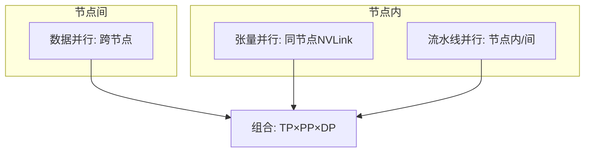

**典型配置**（70B 模型，64卡 A100）：
- TP=4（每节点4卡NVLink）
- PP=4（4个流水线阶段）
- DP=4（4路数据并行）

---

## 29. 长上下文处理技术

### 核心挑战

| 问题 | 描述 |
|------|------|
| 计算复杂度 | 自注意力 $O(n^2)$，序列翻倍计算量翻4倍 |
| KV Cache 显存 | 线性增长，128K上下文可能占数十GB |
| 位置编码外推 | 训练时未见过的位置，模型表现退化 |
| Lost in the Middle | 中间信息利用率低 |

### RoPE 扩展方法

#### NTK-aware Scaling

修改 ROPE 的基频，使高频分量周期不变、低频分量周期拉伸：

$$\theta_i' = (b \cdot 10000)^{-2i/d}$$

其中 $b$ 为缩放因子，$b > 1$ 时等效于拉伸位置编码的周期。

#### YaRN（Yet another RoPE extensioN）

结合 NTK-aware 缩放和注意力温度调整：

$$\text{Attention}(q, k) = \text{softmax}\left(\frac{q^T k}{\sqrt{d_k} \cdot t}\right)$$

其中温度因子 $t$ 随缩放比例动态调整，缓解长距离注意力退化。

#### 方法对比

| 方法 | 原理 | 外推能力 | 实现难度 |
|------|------|---------|---------|
| 直接缩放 | 位置 $pos \times \frac{L_{train}}{L_{target}}$ | 差 | 最简单 |
| NTK-aware | 修改基频 | 中 | 简单 |
| YaRN | NTK + 温度调整 | 好 | 中 |
| 动态NTK | 根据序列长度动态调整基频 | 好 | 中 |
| ALiBi | 线性注意力偏置（无位置编码） | 好 | 简单 |

### KV Cache 优化

| 方法 | 原理 | 压缩比 |
|------|------|--------|
| GQA | 减少KV头数 | $h/g$ |
| MLA | 压缩KV到低维潜在空间 | $d_c/(n_h \cdot d_k)$ |
| Token Eviction | 驱逐不重要的token的KV | 可变 |
| Sliding Window | 只保留最近W个token的KV | $W/L$ |
| Quantization | KV Cache 4-bit/8-bit量化 | 2-4x |

### 长上下文训练策略

1. **渐进式扩展**：先短上下文训练，再逐步增大（4K → 8K → 32K → 128K）
2. **RoPE 插值微调**：在目标长度上少量微调，让模型适应新位置编码
3. **稀疏注意力**：如 Longformer 的滑动窗口+全局注意力
4. **Ring Attention**：将序列分块环形分布在多卡上，支持无限长序列

---

## 30. Self-Attention vs Cross-Attention

### Self-Attention（自注意力）

Q、K、V 均来自**同一序列**：

$$Q = XW_Q, \quad K = XW_K, \quad V = XW_V$$

$$\text{SelfAttn}(X) = \text{softmax}\left(\frac{QK^T}{\sqrt{d_k}}\right)V$$

- 序列内部 token 之间相互关注
- 用于：Encoder（双向）、Decoder（因果 mask）

### Cross-Attention（交叉注意力）

Q 来自一个序列，K、V 来自**另一个序列**：

$$Q = X_{query}W_Q, \quad K = X_{context}W_K, \quad V = X_{context}W_V$$

$$\text{CrossAttn}(X_q, X_c) = \text{softmax}\left(\frac{QK^T}{\sqrt{d_k}}\right)V$$

- 一个序列关注另一个序列的信息
- 用于：Decoder 的交叉注意力层、Q-Former、多模态融合

### 对比

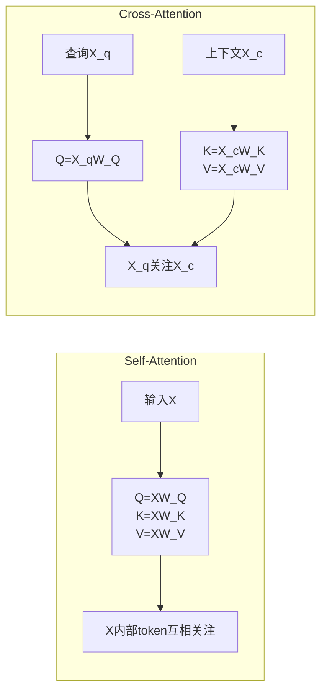

| 维度 | Self-Attention | Cross-Attention |
|------|---------------|-----------------|
| Q来源 | 同一序列 | 查询序列 |
| K/V来源 | 同一序列 | 上下文序列 |
| 信息流向 | 序列内部 | 跨序列 |
| 参数量 | $3d^2$ | $3d^2$（相同） |
| 典型应用 | Decoder-Only LLM | Encoder-Decoder, VLM, Q-Former |

### 在 LLM 架构中的位置

| 架构 | Self-Attention | Cross-Attention |
|------|---------------|-----------------|
| Decoder-Only (GPT/LLaMA) | ✅ 每层 | ❌ 无 |
| Encoder-Decoder (T5/BART) | ✅ Encoder每层 | ✅ Decoder每层 |
| VLM (LLaVA) | ✅ LLM部分 | ❌ 投影层替代 |
| VLM (Qwen-VL) | ✅ LLM部分 | ✅ 视觉交叉注意力层 |

---

## 31. 大模型 Encoding 方式全览

### Tokenization（分词/编码）

将原始文本转换为 token ID 序列的过程。

### 主流 Encoding 方式对比

| 方式 | 操作粒度 | 词表大小 | OOV | 代表模型 |
|------|---------|---------|-----|---------|
| BPE | 子词级 | 30K-50K | 有（罕见字符） | GPT-2/3, LLaMA |
| BBPE | 字节级子词 | 50K+ | 无 | LLaMA, Qwen |
| WordPiece | 子词级 | 30K | 有 | BERT |
| Unigram | 子词级 | 30K-50K | 无 | T5, ALBERT |
| SentencePiece | 语言无关封装 | 可配 | 无 | LLaMA, Qwen |

### BPE vs WordPiece vs Unigram

| | BPE | WordPiece | Unigram |
|---|---|---|---|
| 合并策略 | 频率最高对 | 似然增益最大对 | 无合并，从大词表逐步删减 |
| 方向 | 自底向上（字符→子词） | 自底向上 | 自顶向下（大词表→精简） |
| 概率模型 | 无 | 隐式语言模型 | 显式语言模型 |
| 多种分词 | 不支持 | 不支持 | 支持（概率采样多种分词） |

### Encoding vs Decoding

| | Encoding（编码） | Decoding（解码） |
|---|---|---|
| 方向 | 文本 → Token IDs | Token IDs → 文本 |
| 过程 | 分词 → 查词表 → ID序列 | ID序列 → 查词表 → 拼接子词 |
| 确定性 | BPE/WordPiece 确定 | 确定 |
| 特殊处理 | 添加特殊 token（BOS/EOS/PAD） | 去除特殊 token，合并子词 |

### 完整 Encoding 流程

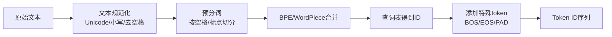

---

## 32. 词表的生成与使用

### 词表生成流程（以 BPE 为例）

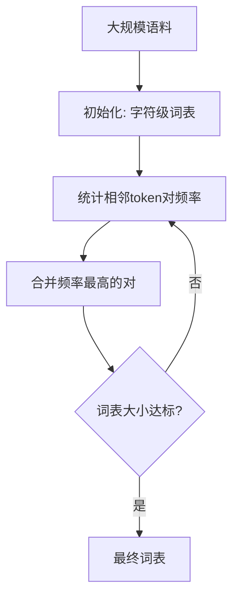

### 具体步骤

#### 1. 初始化

将语料中每个词拆为字符序列：

```
low → ['l', 'o', 'w', '</w>']
lower → ['l', 'o', 'w', 'e', 'r', '</w>']
newest → ['n', 'e', 'w', 'e', 's', 't', '</w>']
```

初始词表 = 所有出现过的字符 + 特殊 token。

#### 2. 迭代合并

每轮统计所有相邻 token 对的频率，合并最高频对：

```
轮次1: ('e', 's') 频率最高 → 合并为 'es'
轮次2: ('es', 't') 频率最高 → 合并为 'est'
轮次3: ('l', 'o') 频率最高 → 合并为 'lo'
...
```

#### 3. 终止条件

词表大小达到预设值（通常 32K-128K）。

### 词表使用

#### 编码（文本 → IDs）

```
"hello world" → 分词 → ['hel', 'lo', ' wor', 'ld'] → 查表 → [3847, 1205, 892, 2301]
```

#### 解码（IDs → 文本）

```
[3847, 1205, 892, 2301] → 查表 → ['hel', 'lo', ' wor', 'ld'] → 拼接 → "hello world"
```

### 词表设计的关键决策

| 决策 | 选项 | 影响 |
|------|------|------|
| 词表大小 | 32K / 64K / 128K / 256K | 太小→序列长，太大→嵌入矩阵大 |
| 操作粒度 | 字符级 / 子词级 / 字节级 | 粒度细→通用性强，粒度粗→效率高 |
| 多语言支持 | 共享词表 / 分语言词表 | 共享→跨语言迁移，分语言→单语言效率高 |
| 特殊 token | 数量和类型 | 影响对话格式、工具调用等能力 |

### 词表大小对模型的影响

$$\text{嵌入矩阵参数} = V \times d$$

| 词表大小 $V$ | 隐藏维度 $d$ | 嵌入参数量 | 占总参数比例 |
|-------------|-------------|-----------|------------|
| 32K | 4096 | 131M | ~1.9% (7B) |
| 64K | 4096 | 262M | ~3.7% (7B) |
| 128K | 4096 | 524M | ~7.5% (7B) |
| 151K (Qwen) | 4096 | 618M | ~8.8% (7B) |

词表越大，嵌入层参数占比越高，但序列越短，推理效率越高。

---

## 33. Token 向量化具体计算

### 从 Token ID 到向量

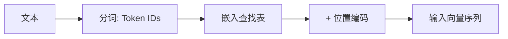

### 步骤1：Token Embedding

通过嵌入矩阵 $E \in \mathbb{R}^{V \times d}$ 将 token ID 映射为向量：

$$e_i = E[id_i] \in \mathbb{R}^d$$

其中 $V$ 为词表大小，$d$ 为隐藏维度。

本质：嵌入矩阵的每一行是一个 token 的向量表示，查找操作等价于 one-hot 乘以嵌入矩阵：

$$e_i = \text{one\_hot}(id_i)^T \cdot E$$

### 步骤2：位置编码

$$h_i = e_i + PE(pos_i)$$

位置编码 $PE$ 可以是：
- 可学习：$PE \in \mathbb{R}^{L_{max} \times d}$（BERT, GPT-2）
- 固定：Sinusoidal（原始 Transformer）
- 旋转：RoPE（LLaMA, Qwen）—— 作用于 Q/K 而非加到输入上

### 步骤3：多层 Transformer 处理

$$H^{(l+1)} = \text{TransformerBlock}(H^{(l)})$$

每一层包含：RMSNorm → Self-Attention → RMSNorm → FFN(SwiGLU) → 残差连接

### 最终向量表示

最后一层输出的向量 $H^{(L)} \in \mathbb{R}^{n \times d}$，每个 token 对应一个 $d$ 维向量，包含了上下文信息。

### 向量的用途

| 用途 | 操作 | 说明 |
|------|------|------|
| 下一个 token 预测 | $P(y_t) = \text{softmax}(H^{(L)}_t \cdot E^T)$ | 最后一个位置预测下一个 token |
| 句子表示 | 平均池化 / CLS token | 用于分类、检索 |
| 相似度计算 | 余弦相似度 / 点积 | 用于检索、聚类 |
| 生成 | 自回归解码 | 逐步生成 token |

### 关键细节：嵌入矩阵的复用

许多模型将输入嵌入矩阵 $E$ 与输出投影矩阵共享：

$$P(y_t) = \text{softmax}(h_t \cdot E^T / \sqrt{d})$$

优点：减少参数量，输入输出语义一致。
代表：LLaMA, Qwen, GPT-2 等多数 Decoder-Only 模型。

---

## 34. 多模态下 Transformer 架构设计

### 核心挑战

文本和图像的模态差异：

| 维度 | 文本 | 图像 |
|------|------|------|
| 基本单位 | Token（离散） | Patch/Pixel（连续） |
| 序列长度 | 数百~数千 | 数千~数万 |
| 位置结构 | 1D 序列 | 2D 空间 |
| 语义密度 | 高（每个token信息丰富） | 低（大量冗余像素） |

### 主流架构方案

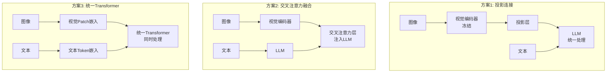

### 方案1：投影连接（LLaVA 系列）

$$v_i = W_{proj} \cdot \text{ViT}(image)_i + b_{proj}$$

视觉 token 与文本 token 拼接后输入 LLM。

- **优点**：简单，复用现有 LLM，训练成本低
- **缺点**：融合较浅，视觉信息可能损失
- **代表**：LLaVA, InternVL, Qwen-VL

### 方案2：交叉注意力融合（Qwen-VL / Flamingo）

在 LLM 的特定层插入交叉注意力，K/V 来自视觉编码器：

$$\text{CrossAttn}(h_t, v) = \text{softmax}\left(\frac{h_t W_Q (v W_K)^T}{\sqrt{d_k}}\right) v W_V$$

- **优点**：深度融合，视觉信息动态注入
- **缺点**：架构复杂，推理慢
- **代表**：Flamingo, Qwen-VL, BLIP-2

### 方案3：统一 Transformer（Emu / Chameleon）

视觉和文本共享同一个 Transformer，通过模态标记区分：

$$h_i = E_{mod}[m_i] + E_{token}[id_i] + PE(pos_i)$$

- **优点**：最深融合，统一架构
- **缺点**：训练成本高，视觉能力可能受限
- **代表**：Emu, Chameleon, Janus

### 设计决策对比

| 决策 | 方案1 | 方案2 | 方案3 |
|------|-------|-------|-------|
| 视觉编码器 | 冻结 ViT | 冻结/微调 ViT | 无独立编码器 |
| 融合深度 | 浅（输入层） | 中（中间层） | 深（全层） |
| 训练成本 | 低 | 中 | 高 |
| 推理速度 | 快 | 中 | 快 |
| 视觉理解 | 中 | 高 | 中高 |
| 代表模型 | LLaVA | Qwen-VL | Chameleon |

---

## 35. GLM 模型技术特点与架构

### GLM 系列概述

GLM（General Language Model）是智谱 AI 推出的大语言模型系列，核心创新在于**自回归空白填充**（Autoregressive Blank Filling）训练目标。

### GLM 原始架构

#### 训练目标

随机遮盖文本中的连续片段，模型自回归地预测被遮盖的内容：

$$\mathcal{L}_{GLM} = -\sum_{t \in \text{mask}} \log P(x_t | x_{<t}, c)$$

其中 $c$ 为上下文（未遮盖部分），遮盖片段内部按从左到右顺序预测。

```mermaid
flowchart LR
    A[原始文本<br/>A B C D E F G] --> B[随机遮盖<br/>A B _ _ E F _]
    B --> C[重排遮盖片段<br/>A B [C D] E F [G]]
    C --> D[自回归预测<br/>A B → C D<br/>A B C D E F → G]
```

#### 与 BERT/GPT 的区别

| | BERT | GPT | GLM |
|---|---|---|---|
| 训练目标 | 掩码语言模型 | 自回归语言模型 | 空白填充 |
| 注意力 | 双向 | 单向 | 混合（上下文双向，遮盖单向） |
| 任务适配 | NLU 强，NLG 弱 | NLG 强，NLU 弱 | NLU + NLG 统一 |

### ChatGLM 系列演进

| 版本 | 架构特点 | 训练方法 |
|------|---------|---------|
| ChatGLM-6B | GLM 架构 + 6B 参数 | SFT + RLHF |
| ChatGLM2-6B | FlashAttention + 多位置查询 | SFT + RLHF |
| ChatGLM3-6B | 工具调用 + 代码解释器 | SFT + RLHF |
| GLM-4 | 更大规模 + 多模态 | SFT + PPO |
| GLM-4V | 视觉-语言多模态 | SFT + RL |

### ChatGLM 架构特点

| 特点 | 说明 |
|------|------|
| 前缀注意力 | 对 prompt 部分使用双向注意力，对生成部分使用因果注意力 |
| 位置编码 | 旋转位置编码（RoPE） |
| 归一化 | Post-LN（早期）→ DeepNorm → RMSNorm（后期） |
| 激活函数 | GeLU（早期）→ SwiGLU（后期） |
| 词表 | 150K+ 大词表，中英双语优化 |

### 前缀注意力机制

```mermaid
flowchart TB
    subgraph 输入
        P[Prompt部分<br/>双向注意力] --> G[生成部分<br/>因果注意力]
    end
    subgraph 注意力掩码
        M1[Prompt内部: 全可见] 
        M2[生成部分: 只看左侧]
        M3[生成部分看Prompt: 全可见]
    end
```

Prompt 部分可以相互关注（双向），生成部分只能看左侧（因果）。这使模型在理解指令时能充分利用上下文，在生成时保持自回归特性。

### GLM-4 关键技术

1. **大词表**（150K+）：优化中文编码效率，单 token 覆盖更多中文字符
2. **多任务指令微调**：统一对话、工具调用、代码执行等多种任务格式
3. **长上下文**：支持 128K 上下文，使用 RoPE 插值扩展
4. **多模态扩展**：GLM-4V 通过视觉编码器 + 投影层接入

---

## 36. Prompt 工程与迭代优化

### Prompt 设计原则

| 原则 | 说明 | 示例 |
|------|------|------|
| 明确性 | 指令清晰无歧义 | "用3句话总结" > "总结一下" |
| 具体性 | 提供充分上下文和约束 | "以JSON格式输出" |
| 结构化 | 使用分隔符、编号、模板 | "### 输入\n### 要求\n### 输出" |
| 示例驱动 | Few-shot 提供输入输出样例 | 给2-3个示例 |
| 角色设定 | 赋予模型特定角色 | "你是一位资深Python工程师" |

### Prompt 设计模板

```mermaid
flowchart TB
    R[角色设定] --> C[上下文/背景]
    C --> I[具体指令]
    I --> F[格式要求]
    F --> E[示例 Few-shot]
    E --> O[输出]
```

### 针对不同模型的适配

| 模型特点 | Prompt 调整策略 |
|---------|----------------|
| 指令遵循型（ChatGLM/Qwen） | 直接下达指令，格式约束明确 |
| 基座模型（无SFT） | 用续写格式，避免指令格式 |
| 小模型（7B以下） | 更详细的步骤拆解，更多示例 |
| 大模型（70B+） | 简洁指令即可，减少冗余 |
| 长上下文模型 | 将关键信息放在开头和结尾 |
| 代码模型 | 用 Markdown 代码块格式 |

### 迭代优化流程

```mermaid
flowchart TB
    D[设计初始Prompt] --> T[测试评估]
    T --> A{分析输出}
    A -->|格式错误| F[加强格式约束]
    A -->|内容不完整| I[增加上下文/示例]
    A -->|偏离意图| C[明确指令/角色]
    A -->|幻觉| G[加入事实约束]
    A -->|满意| S[固化Prompt]
    F --> T
    I --> T
    C --> T
    G --> T
```

### 高级技巧

| 技巧 | 原理 | 适用场景 |
|------|------|---------|
| CoT | "请一步步思考" | 复杂推理 |
| Self-Consistency | 多次采样取多数 | 提高准确率 |
| Self-Reflection | "请检查你的回答" | 减少错误 |
| 分步执行 | 将复杂任务拆为子任务 | 多步骤任务 |
| 约束注入 | "不要编造信息" | 减少幻觉 |
| 输出模板 | 指定输出格式模板 | 结构化输出 |

### 意图识别中的 Prompt 设计

#### 模糊意图处理

| 策略 | 方法 |
|------|------|
| 澄清追问 | "您是想问A还是B？" |
| 多意图拆解 | 将复合查询拆为多个子意图 |
| 置信度阈值 | 低置信度时触发人工/澄清流程 |
| 意图层级 | 先粗分类再细分类 |

#### 意图分类 Prompt 模板

```
你是一个意图分类器。根据用户输入，从以下意图中选择最匹配的一个：

意图列表：
1. 查询信息
2. 执行操作
3. 投诉反馈
4. 闲聊

用户输入：{input}

请输出意图编号和置信度（0-1），格式：意图编号 | 置信度
```
