# 第一章 大语言模型基础

> 本章系统介绍大语言模型（Large Language Model, LLM）的核心技术原理。我们将从自然语言处理的基本范式出发，逐步深入到 Transformer 架构的关键组件、训练方法与优化策略，最终讨论工程实践中的推理加速与分布式训练技术。

---

## 目录

- [1.1 从传统 NLP 到大语言模型](#11-从传统-nlp-到大语言模型)
- [1.2 词元化：文本的数字表示](#12-词元化文本的数字表示)
- [1.3 Token 向量化与嵌入表示](#13-token-向量化与嵌入表示)
- [1.4 自注意力机制](#14-自注意力机制)
- [1.5 Softmax 函数与缩放因子](#15-softmax-函数与缩放因子)
- [1.6 多头注意力与变体](#16-多头注意力与变体)
- [1.7 位置编码](#17-位置编码)
- [1.8 归一化方法](#18-归一化方法)
- [1.9 激活函数](#19-激活函数)
- [1.10 Transformer 架构与 LLM 架构对比](#110-transformer-架构与-llm-架构对比)
- [1.11 自注意力与交叉注意力](#111-自注意力与交叉注意力)
- [1.12 损失函数与信息论基础](#112-损失函数与信息论基础)
- [1.13 正则化方法](#113-正则化方法)
- [1.14 优化器：Adam 与 AdamW](#114-优化器adam-与-adamw)
- [1.15 Scaling Laws 与模型规模](#115-scaling-laws-与模型规模)
- [1.16 涌现能力](#116-涌现能力)
- [1.17 解码策略](#117-解码策略)
- [1.18 混合专家模型（MoE）](#118-混合专家模型moe)
- [1.19 参数高效微调：LoRA 及其变体](#119-参数高效微调lora-及其变体)
- [1.20 训练大规模 LLM 的工程挑战](#120-训练大规模-llm-的工程挑战)
- [1.21 分布式训练](#121-分布式训练)
- [1.22 推理加速：FlashAttention 与 KV Cache](#122-推理加速flashattention-与-kv-cache)
- [1.23 推理服务：vLLM](#123-推理服务vllm)
- [1.24 长上下文处理技术](#124-长上下文处理技术)
- [1.25 多模态 Transformer 架构](#125-多模态-transformer-架构)
- [1.26 开源模型系列解析](#126-开源模型系列解析)
- [1.27 Prompt 工程](#127-prompt-工程)

---

## 1.1 从传统 NLP 到大语言模型

自然语言处理（Natural Language Processing, NLP）是人工智能的核心分支之一，旨在让计算机理解、生成和处理人类语言。在大语言模型出现之前，NLP 领域经历了从规则系统到统计方法、再到深度学习的演进。理解这一发展脉络，有助于我们把握 LLM 的技术定位与创新之处。

### 1.1.1 传统 NLP 与 LLM 的范式对比

| 维度 | 传统 NLP | 大语言模型（LLM） |
|------|---------|-----------------|
| 范式 | 任务特定模型（分类器、CRF 等） | 统一生成式模型 |
| 特征 | 手工特征（TF-IDF, n-gram） | 自监督学习表示 |
| 迁移学习 | 浅层微调 | 预训练 + 指令微调 + 对齐 |
| 任务适配 | 每个任务训练一个模型 | 一个模型覆盖所有任务 |
| 数据需求 | 标注数据驱动 | 海量无标注数据 + 少量标注 |
| 推理能力 | 规则 / 模式匹配 | 涌现的推理能力 |

两者的共同点在于：都处理自然语言，都依赖表示学习，都关注语义理解。核心区别在于，LLM 通过规模和统一目标（next-token prediction，即下一个词元预测）实现了能力的质变——从"窄任务专家"到"通用语言智能"。

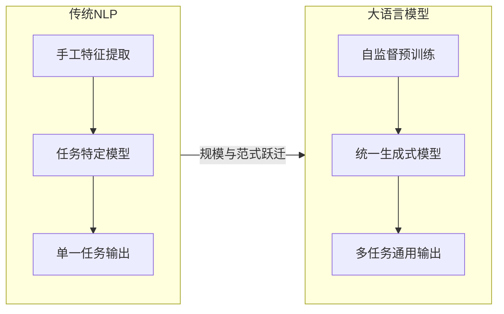

理解了这一宏观背景后，我们首先需要解决一个基础问题：计算机如何将人类语言转化为可计算的数字形式？这就是词元化（Tokenization）要解决的问题。

---

## 1.2 词元化：文本的数字表示

词元化（Tokenization）是将原始文本转换为词元（Token）序列的过程，是所有语言模型的第一步。词元可以是一个完整的词、一个子词（subword），甚至是一个字节。词元化的质量直接影响模型的表达能力和计算效率。

### 1.2.1 完整的编码流程

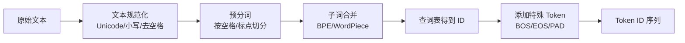

其中，BOS（Beginning of Sequence）表示序列起始标记，EOS（End of Sequence）表示序列结束标记，PAD 用于将不等长序列填充到统一长度。

### 1.2.2 BPE（Byte Pair Encoding，字节对编码）

BPE 是当前最主流的子词分词算法之一，被 GPT 系列和 LLaMA 等模型采用。

**算法流程：**

1. **初始化**：将语料中每个词拆为字符序列，词尾加 `</w>` 标记
2. **统计**：统计所有相邻字符对的出现频率
3. **合并**：将频率最高的字符对合并为新符号
4. **重复**：重复步骤 2-3，直到词表大小达到预设上限

**示例**：`low` → `l o w </w>` → 合并 `l o` → `lo w </w>` → 合并 `lo w` → `low </w>`

### 1.2.3 WordPiece

WordPiece 是 BERT 和 DistilBERT 使用的分词算法，与 BPE 的关键区别在于合并标准。

**算法流程：**

1. 初始化为字符级词表
2. 对每对相邻子词，计算合并后的**语言模型似然增益**：

$$\text{Score}(A, B) = \frac{P(AB)}{P(A) \cdot P(B)}$$

其中 $P(AB)$ 是子词对 $AB$ 在语料中的联合概率，$P(A)$ 和 $P(B)$ 分别是各自的边际概率。该分数衡量的是两个子词共现的程度是否超出独立假设的预期。

3. 选择增益最大的对进行合并
4. 重复直到词表达到上限

### 1.2.4 BPE 与 WordPiece 核心对比

| | BPE | WordPiece |
|---|---|---|
| 合并标准 | 频率最高 | 似然增益最大 |
| 标记方式 | 词尾 `</w>` | 子词前加 `##`（如 `un##ing`） |
| 代表模型 | GPT 系列, LLaMA | BERT, DistilBERT |
| 倾向 | 合并高频对 | 合并对语言模型最有价值的对 |

### 1.2.5 Unigram 模型

与 BPE 和 WordPiece 的自底向上（从字符逐步合并为子词）策略不同，Unigram 采用自顶向下的方式：从一个较大的初始词表出发，逐步删减对整体语言模型似然贡献最小的子词，直到词表缩减到目标大小。Unigram 的独特优势在于支持概率采样多种分词方式，代表模型包括 T5 和 ALBERT。

| | BPE | WordPiece | Unigram |
|---|---|---|---|
| 合并策略 | 频率最高对 | 似然增益最大对 | 无合并，从大词表逐步删减 |
| 方向 | 自底向上（字符 → 子词） | 自底向上 | 自顶向下（大词表 → 精简） |
| 概率模型 | 无 | 隐式语言模型 | 显式语言模型 |
| 多种分词 | 不支持 | 不支持 | 支持（概率采样多种分词） |

### 1.2.6 BBPE（Byte-Level BPE，字节级 BPE）

标准 BPE 在 Unicode 字符级别操作，而 BBPE 在**字节级别**（0-255）操作。这一看似微小的改变带来了重要优势：

| | BPE | BBPE |
|---|---|---|
| 操作单元 | Unicode 字符 | 字节 |
| 词表大小 | 通常 30K-50K | 通常 50K+ |
| 覆盖范围 | 取决于语料语言 | 所有语言（字节通用） |
| OOV 问题 | 有（罕见字符/多语言） | 无（所有输入均可编码） |

BBPE 的核心优势包括：(1) **无 OOV（Out-of-Vocabulary，词表外词）**：任何语言的任何字符都能被编码为字节序列；(2) **跨语言统一**：中英日韩等所有语言共享同一词表；(3) **实现简洁**：字节级操作不需要复杂的分词器。

**示例**：中文"你好"的 UTF-8 编码为 `E4 BD A0 E5 A5 BD`（6 个字节），BBPE 可能将其合并为 2-3 个子词。

**补充**：SentencePiece 是 BPE/Unigram 的语言无关实现，直接从原始文本操作，不需要预分词。LLaMA、Qwen 等模型均采用 SentencePiece + BBPE 方案。

### 1.2.7 词表设计的关键决策

词表的设计直接影响模型的参数量和推理效率。嵌入矩阵（Embedding Matrix）的参数量为：

$$\text{嵌入矩阵参数} = V \times d$$

其中 $V$ 为词表大小，$d$ 为隐藏维度（hidden dimension，即模型内部向量的维数）。

| 词表大小 $V$ | 隐藏维度 $d$ | 嵌入参数量 | 占 7B 模型总参数比例 |
|-------------|-------------|-----------|-------------------|
| 32K | 4096 | 131M | ~1.9% |
| 64K | 4096 | 262M | ~3.7% |
| 128K | 4096 | 524M | ~7.5% |
| 151K (Qwen) | 4096 | 618M | ~8.8% |

词表越大，嵌入层参数占比越高，但每个 Token 能覆盖更多文本内容，使得序列更短、推理效率更高。这是一个需要权衡的设计决策。

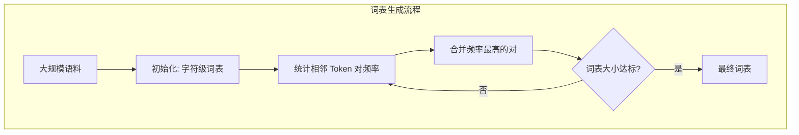

有了词表之后，文本就可以被转化为 Token ID 序列。接下来我们讨论如何将这些离散的 ID 转化为连续的向量表示。

---

## 1.3 Token 向量化与嵌入表示

语言模型无法直接处理离散的 Token ID，需要将其映射为连续的高维向量。这一过程称为嵌入（Embedding），是模型理解语义的基础。

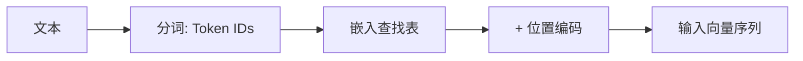

### 1.3.1 Token Embedding

通过嵌入矩阵 $E \in \mathbb{R}^{V \times d}$ 将 Token ID 映射为向量：

$$e_i = E[id_i] \in \mathbb{R}^d$$

其中 $V$ 为词表大小，$d$ 为隐藏维度。本质上，嵌入矩阵的每一行是一个 Token 的向量表示，查找操作等价于 one-hot 向量乘以嵌入矩阵：

$$e_i = \text{one\_hot}(id_i)^T \cdot E$$

### 1.3.2 位置编码叠加

$$h_i = e_i + PE(pos_i)$$

位置编码 $PE$ 的具体形式将在 1.7 节详细讨论。此处只需知道，它为每个位置的 Token 注入了位置信息。

### 1.3.3 多层 Transformer 处理

$$H^{(l+1)} = \text{TransformerBlock}(H^{(l)})$$

每一层包含：RMSNorm → Self-Attention → RMSNorm → FFN(SwiGLU) → 残差连接。经过 $L$ 层处理后，最后一层输出 $H^{(L)} \in \mathbb{R}^{n \times d}$，每个 Token 对应一个 $d$ 维向量，包含了丰富的上下文信息。

### 1.3.4 向量的用途

| 用途 | 操作 | 说明 |
|------|------|------|
| 下一个 Token 预测 | $P(y_t) = \text{softmax}(H^{(L)}_t \cdot E^T)$ | 最后一个位置预测下一个 Token |
| 句子表示 | 平均池化 / CLS Token | 用于分类、检索 |
| 相似度计算 | 余弦相似度 / 点积 | 用于检索、聚类 |
| 生成 | 自回归解码 | 逐步生成 Token |

### 1.3.5 嵌入矩阵的复用

许多模型将输入嵌入矩阵 $E$ 与输出投影矩阵共享（Weight Tying）：

$$P(y_t) = \text{softmax}(h_t \cdot E^T / \sqrt{d})$$

这样做的优点是减少参数量，同时保持输入输出语义空间的一致性。LLaMA、Qwen、GPT-2 等多数 Decoder-Only 模型采用此设计。

Token 向量化完成后，模型需要一种机制来捕捉序列中各 Token 之间的关系。这正是自注意力机制的核心功能。

---

## 1.4 自注意力机制

自注意力（Self-Attention）是 Transformer 架构的核心组件，它允许序列中的每个 Token 直接关注序列中的所有其他 Token，从而捕捉任意距离的依赖关系。

### 1.4.1 核心公式

给定输入序列 $X \in \mathbb{R}^{n \times d}$（$n$ 为序列长度，$d$ 为隐藏维度），通过三个可学习的投影矩阵（projection matrix）得到查询（Query）、键（Key）、值（Value）三个矩阵：

$$Q = XW_Q, \quad K = XW_K, \quad V = XW_V$$

其中 $W_Q, W_K \in \mathbb{R}^{d \times d_k}$，$W_V \in \mathbb{R}^{d \times d_v}$。$Q$（Query）代表"我在找什么"，$K$（Key）代表"我能提供什么"，$V$（Value）代表"我的实际内容"。

注意力的计算公式为：

$$\text{Attention}(Q, K, V) = \text{softmax}\left(\frac{QK^T}{\sqrt{d_k}}\right)V$$

其中 $d_k$ 为 Key 向量的维度，除以 $\sqrt{d_k}$ 是为了防止点积过大导致 softmax 函数进入梯度饱和区（详见 1.5 节）。

### 1.4.2 工作流程

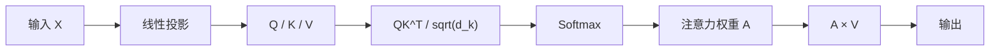

### 1.4.3 为什么自注意力优于 RNN

在自注意力出现之前，循环神经网络（Recurrent Neural Network, RNN）是处理序列数据的主流方法。RNN 通过隐状态递推 $h_t = f(h_{t-1}, x_t)$ 逐步处理序列，存在固有的局限性：

| 维度 | RNN | Transformer |
|------|-----|-------------|
| 序列依赖 | 逐步递推，$h_t = f(h_{t-1}, x_t)$ | 并行计算，无序列依赖 |
| 长距离依赖 | 梯度消失/爆炸，信息衰减 | 任意两位置距离为 $O(1)$ |
| 计算并行性 | 无法并行（$t$ 依赖 $t-1$） | 完全并行 |
| 复杂度 | $O(n)$ 时间步 | $O(n^2 \cdot d)$ 自注意力 |

**核心优势**：自注意力让序列中任意两个 Token 之间的信息交互路径长度为 1，而 RNN 需要 $O(n)$ 步。这意味着即使两个相关的词相隔很远，自注意力也能直接建立它们之间的联系。

理解了自注意力的基本原理后，我们需要深入了解其中一个关键组件——Softmax 函数及其缩放因子。

---

## 1.5 Softmax 函数与缩放因子

Softmax 是将任意实数向量转化为概率分布的标准函数，在注意力机制和输出层中都扮演核心角色。

### 1.5.1 定义

$$\text{softmax}(z_i) = \frac{e^{z_i}}{\sum_j e^{z_j}}$$

输出满足概率分布的两个基本性质：$\sum_i \text{softmax}(z_i) = 1$ 且 $\text{softmax}(z_i) > 0$。

### 1.5.2 为什么注意力公式中要除以 $\sqrt{d_k}$

这是一个重要的数值稳定性设计。假设 $Q$ 和 $K$ 的每个分量服从均值为 0、方差为 1 的独立分布，则点积 $QK^T$ 的每个元素是 $d_k$ 个独立随机变量之积的求和：

$$\text{Var}(QK^T) = d_k \cdot \text{Var}(q_i k_i) = d_k$$

标准差为 $\sqrt{d_k}$。当 $d_k$ 较大时（如 128），点积值会很大，导致 softmax 进入饱和区（输出接近 0 或 1），梯度趋近于 0，模型难以学习。

除以 $\sqrt{d_k}$ 使点积的方差归一化为 1，保持 softmax 处于非饱和区域，确保梯度的有效传播。

### 1.5.3 温度系数（Temperature）

带温度参数的 softmax 是一个更通用的形式：

$$\text{softmax}_T(z_i) = \frac{e^{z_i/T}}{\sum_j e^{z_j/T}}$$

其中 $T$ 为温度系数（Temperature），控制输出分布的"尖锐程度"：

| 温度 | 效果 |
|------|------|
| $T \to 0$ | 分布趋近 one-hot（贪婪选择） |
| $T = 1$ | 原始分布 |
| $T > 1$ | 分布更平坦（更多样性） |
| $T \to \infty$ | 均匀分布（完全随机） |

**应用场景**：
- **采样时调温**：$T=0.7$ 左右平衡质量和多样性
- **知识蒸馏**（Knowledge Distillation）：教师模型用高温软化标签，学生模型学习软目标
- **RLHF**（基于人类反馈的强化学习）：温度影响策略探索程度

Softmax 使注意力权重成为概率分布，但单一的注意力头只能学习一种关注模式。为了让模型同时捕捉多种语义关系，我们引入多头注意力机制。

---

## 1.6 多头注意力与变体

### 1.6.1 多头注意力（MHA, Multi-Head Attention）

多头注意力将输入拆分为 $h$ 个子空间，每个"头"（head）独立计算注意力，最后拼接结果：

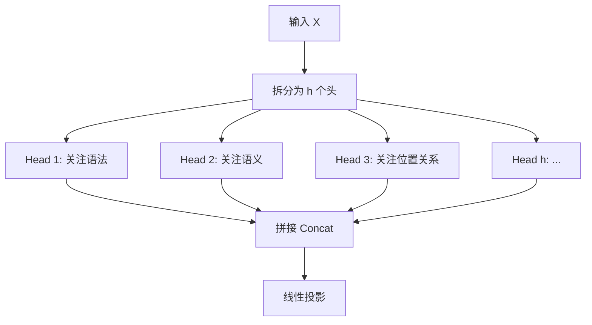

| 单头注意力 | 多头注意力 |
|-----------|-----------|
| 只能学一种关注模式 | 不同头可关注不同子空间 |
| 信息瓶颈大 | 并行提取多方面特征 |
| 类比单通道 CNN | 类比多通道 CNN |

**本质**：多头让模型同时关注"这个词和哪些词有语法关系"、"哪些词语义相近"、"哪些词位置相关"等不同维度的信息。

### 1.6.2 MHA / MQA / GQA 架构对比

随着模型规模增大，KV Cache（键值缓存，详见 1.22 节）的显存开销成为推理瓶颈。为此，研究者提出了 MQA 和 GQA 两种变体来减少 KV 头数：

- **MHA（Multi-Head Attention）**：每个 Query 头对应独立的 K 和 V 头
- **MQA（Multi-Query Attention）**：所有 Query 头共享 1 个 K 和 1 个 V
- **GQA（Grouped-Query Attention）**：将 Query 头分为 $g$ 组，每组共享 1 个 K 和 1 个 V

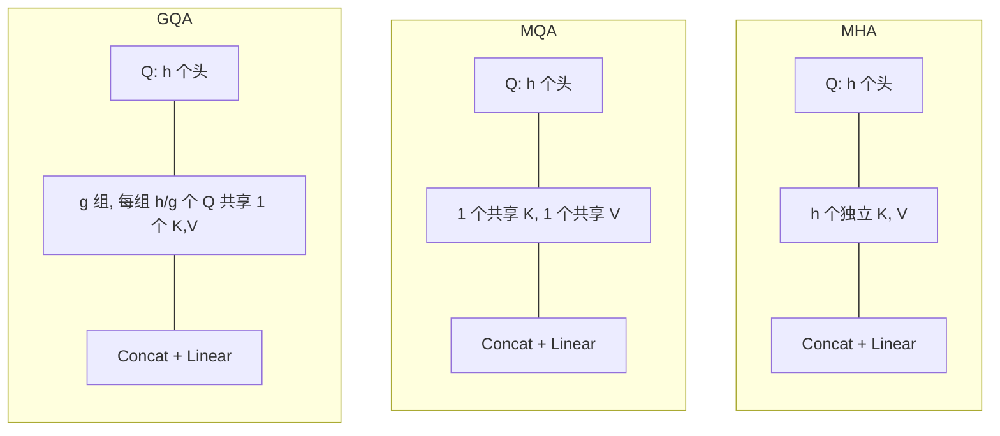

### 1.6.3 详细对比

| | MHA | MQA | GQA |
|---|---|---|---|
| Q 头数 | $h$ | $h$ | $h$ |
| K/V 头数 | $h$ | $1$ | $g$ ($g < h$) |
| KV Cache 大小 | $2 \times h \times d_k \times L$ | $2 \times d_k \times L$ | $2 \times g \times d_k \times L$ |
| 推理速度 | 基准 | 最快 | 折中 |
| 表达能力 | 最强 | 最弱 | 折中 |
| 代表模型 | GPT-3, BERT | PaLM, StarCoder | LLaMA-2, Qwen, DeepSeek |

其中 $h$ 为注意力头数，$d_k$ 为每个头的维度，$L$ 为序列长度，$g$ 为 GQA 的分组数。

GQA 是 MHA 和 MQA 的统一框架：当 $g=h$ 时退化为 MHA，当 $g=1$ 时退化为 MQA。这种灵活性使得 GQA 成为当前主流 LLM 的首选方案。

自注意力机制本身是**置换不变**的（permutation invariant），即打乱输入顺序不影响输出。为了让模型感知 Token 的位置信息，我们需要引入位置编码。

---

## 1.7 位置编码

### 1.7.1 为什么位置编码是必需的

Transformer 的自注意力计算中，$QK^T$ 的结果与输入 Token 的排列顺序无关。这意味着"猫追狗"和"狗追猫"在没有位置编码的情况下会产生相同的注意力权重。位置编码（Positional Encoding）的作用就是注入位置信息，使模型能够区分不同位置的相同 Token。

### 1.7.2 正弦余弦编码（Sinusoidal Positional Encoding）

这是原始 Transformer 论文提出的方案，使用固定的三角函数生成位置编码：

$$PE_{(pos, 2i)} = \sin\left(\frac{pos}{10000^{2i/d}}\right)$$

$$PE_{(pos, 2i+1)} = \cos\left(\frac{pos}{10000^{2i/d}}\right)$$

其中 $pos$ 为 Token 在序列中的位置，$i$ 为维度索引，$d$ 为隐藏维度。不同维度使用不同频率的三角函数，低维度对应高频（捕捉局部位置差异），高维度对应低频（捕捉全局位置关系）。

**特点**：固定编码、无需训练参数、可外推到训练时未见过的更长序列、相对位置可通过线性变换表达。

### 1.7.3 可学习位置编码（Learned Positional Encoding）

直接将位置编码作为可训练参数：$PE \in \mathbb{R}^{L_{max} \times d}$，其中 $L_{max}$ 为最大序列长度。每个位置对应一个可学习的向量，随训练过程更新。

**特点**：更灵活、数据驱动，但受限于训练时见过的最大长度，无法外推。

### 1.7.4 两种基础位置编码对比

| | Sinusoidal | Learned |
|---|---|---|
| 参数量 | 0 | $L_{max} \times d$ |
| 外推性 | 可外推 | 不可外推 |
| 灵活性 | 固定函数 | 数据驱动 |

### 1.7.5 RoPE（旋转位置编码，Rotary Position Embedding）

RoPE 是当前主流 LLM（LLaMA、Qwen、DeepSeek 等）采用的位置编码方案。其核心思想是将位置信息通过**旋转矩阵**作用于 Q 和 K 向量，使得内积 $q_m^T k_n$ 仅依赖相对位置 $m-n$。

**二维情况下的旋转操作**：对于位置 $m$ 的查询向量：

$$q_m = \begin{pmatrix} \cos m\theta & -\sin m\theta \\ \sin m\theta & \cos m\theta \end{pmatrix} \begin{pmatrix} q_0 \\ q_1 \end{pmatrix}$$

**推广到 $d$ 维**：将 $d$ 维向量分为 $d/2$ 组，每组施加不同频率 $\theta_i$ 的旋转：

$$\theta_i = 10000^{-2i/d}, \quad i = 0, 1, ..., d/2-1$$

**复数形式的简洁表达**：

$$q_m = q \odot e^{im\Theta}$$

其中 $\odot$ 表示逐元素乘法，$\Theta = (\theta_0, \theta_1, ..., \theta_{d/2-1})$ 为频率向量。

### 1.7.6 RoPE 的关键性质

$$\langle q_m, k_n \rangle = \text{Re}[(q \odot e^{im\Theta})^* \cdot (k \odot e^{in\Theta})] = f(q, k, m-n)$$

内积仅依赖相对位置 $m-n$，天然具备相对位置编码特性。这意味着模型不需要显式学习相对位置，旋转操作自动将其编码在注意力分数中。

### 1.7.7 RoPE 与绝对位置编码对比

| 维度 | 绝对位置编码 | RoPE |
|------|-------------|------|
| 编码方式 | 位置向量加到输入上 | 旋转矩阵作用于 Q/K |
| 相对位置 | 不直接支持 | 天然支持 |
| 外推性 | 差（Learned）/ 有限（Sinusoidal） | 可通过 NTK-aware 等方法外推 |
| 远程衰减 | 无 | 有（高频分量随距离衰减） |
| 实现复杂度 | 简单（加法） | 中等（旋转操作） |
| 主流采用 | BERT, GPT-1/2 | LLaMA, Qwen, DeepSeek |

### 1.7.8 相对位置编码的其他方案

除 RoPE 外，还有多种相对位置编码方案：

| 方法 | 公式 | 特点 |
|------|------|------|
| T5 RPE | $e_{ij} = w_{clamp(i-j)}$ | 可学习偏置矩阵 |
| DeBERTa | $a_{ij} = W \cdot [q_i; k_j; q_i - k_j; i-j]$ | 内容 + 位置解耦 |
| ALiBi | $m_{ij} = -\alpha \|i-j\|$ | 线性衰减，无需训练 |

### 1.7.9 视觉与多模态中的位置编码

在视觉 Transformer（ViT, Vision Transformer）中，图像被切分为 $P \times P$ 的 patch（图像块），展平后使用可学习的 1D 位置嵌入：

$$E_{pos} \in \mathbb{R}^{(H/P \times W/P + 1) \times d}$$

其中 $H, W$ 为图像高宽，`+1` 为 CLS Token（分类标记）。

由于 ViT 的 1D 编码忽略了图像的二维空间结构，改进方案包括：

**坐标嵌入**：分别对 x 和 y 坐标做 1D 位置编码后相加：$PE_{(x,y)} = E_x(x) + E_y(y)$

**频率编码（Fourier Features）**：$\gamma(v) = [\cos(2\pi B v), \sin(2\pi B v)]$，其中 $B$ 为随机高斯矩阵，$v = (x, y)$。在 NeRF（Neural Radiance Fields，神经辐射场）中广泛使用。

**多模态位置编码**：在视觉语言模型（VLM, Vision-Language Model）中，视觉 Token 使用 2D 空间位置编码，文本 Token 使用 RoPE，拼接后统一进入 Transformer。

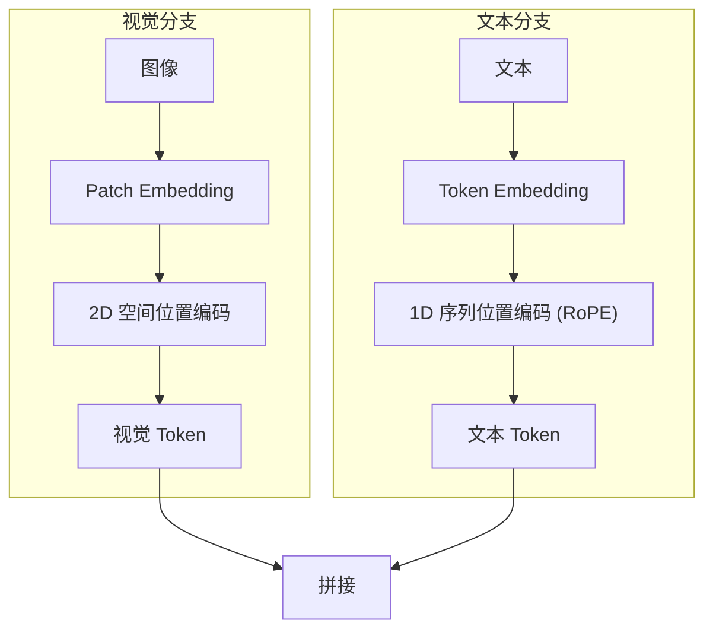

位置编码解决了"在哪里"的问题。接下来我们讨论 Transformer 中另一个关键组件——归一化方法，它解决的是"如何稳定训练"的问题。

---

## 1.8 归一化方法

归一化（Normalization）是深度神经网络训练中的关键技术，通过将中间激活值的分布标准化，加速收敛并提高训练稳定性。Transformer 架构中主要使用三种归一化方法。

### 1.8.1 BatchNorm（BN，批归一化）

$$\text{BN}(x) = \gamma \frac{x - \mu_B}{\sqrt{\sigma_B^2 + \epsilon}} + \beta$$

其中 $\mu_B, \sigma_B^2$ 为 mini-batch（小批量）内同一特征维度的均值和方差，$\gamma, \beta$ 为可学习的仿射参数（affine parameters），$\epsilon \approx 10^{-5}$ 防止除零。BN 在 CNN（卷积神经网络）中表现优异，但在 NLP 任务中存在局限。

### 1.8.2 LayerNorm（LN，层归一化）

给定输入 $x \in \mathbb{R}^d$：

$$\mu = \frac{1}{d}\sum_{i=1}^{d} x_i$$

$$\sigma^2 = \frac{1}{d}\sum_{i=1}^{d}(x_i - \mu)^2$$

$$\text{LN}(x) = \gamma \odot \frac{x - \mu}{\sqrt{\sigma^2 + \epsilon}} + \beta$$

其中 $\gamma, \beta \in \mathbb{R}^d$ 为可学习的仿射参数，$\odot$ 表示逐元素乘法。LN 对单个样本的所有特征维度进行归一化，不依赖 batch size。

### 1.8.3 RMSNorm（Root Mean Square Normalization，均方根归一化）

$$\text{RMSNorm}(x) = \gamma \frac{x}{\sqrt{\frac{1}{d}\sum_{i=1}^{d}x_i^2 + \epsilon}}$$

与 LN 的关键区别：去掉了中心化步骤（减均值），只做缩放。计算更快，效果相当或更好。

### 1.8.4 三者对比

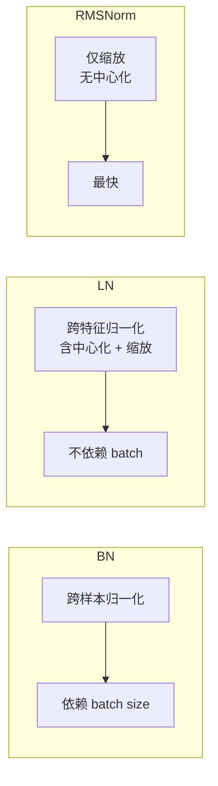

| | BN | LN | RMSNorm |
|---|---|---|---|
| 归一化方向 | 样本级（跨 batch） | 特征级（单样本内） | 特征级（单样本内） |
| 中心化（减均值） | 有 | 有 | 无 |
| 可学习参数 | $\gamma, \beta$ | $\gamma, \beta$ | 仅 $\gamma$ |
| 计算量 | 中 | 中 | 最少 |
| 代表模型 | ResNet, CNN | BERT, GPT-1/2 | LLaMA, Qwen, DeepSeek |

### 1.8.5 为什么 Transformer 使用 LayerNorm 而非 BatchNorm

| 维度 | BatchNorm | LayerNorm |
|------|-----------|-----------|
| 归一化维度 | 同一 batch 的不同样本 | 同一样本的不同特征维度 |
| 依赖 batch size | 是（小 batch 不稳定） | 否 |
| 变长序列支持 | 差（需要 padding mask） | 天然支持 |
| 推理行为 | 与训练不一致（依赖运行统计量） | 一致 |
| 适用场景 | CNN | Transformer / NLP |

### 1.8.6 LayerNorm 在 Transformer 中的位置

- **Post-LN**（原始 Transformer）：Attention → LN → FFN → LN
- **Pre-LN**（现代 LLM）：LN → Attention → LN → FFN（训练更稳定）

**趋势**：现代 LLM 全部使用 RMSNorm（或 Pre-RMSNorm），原因是速度更快、训练更稳定、无需维护均值偏移。

归一化保证了训练的稳定性，而激活函数则决定了模型的非线性表达能力。接下来我们讨论 LLM 中常用的激活函数。

---

## 1.9 激活函数

激活函数（Activation Function）为神经网络引入非线性，使其能够拟合复杂的函数关系。LLM 中的激活函数经历了从 ReLU 到 GeLU 再到 SwiGLU 的演进。

### 1.9.1 GeLU（Gaussian Error Linear Unit，高斯误差线性单元）

$$\text{GeLU}(x) = x \cdot \Phi(x) = x \cdot \frac{1}{2}\left[1 + \text{erf}\left(\frac{x}{\sqrt{2}}\right)\right]$$

其中 $\Phi(x)$ 为标准正态分布的累积分布函数，$\text{erf}$ 为误差函数。GeLU 可以理解为"以概率 $\Phi(x)$ 保留输入 $x$"，是一种随机正则化的确定性近似。

近似实现：$\text{GeLU}(x) \approx 0.5x(1 + \tanh[\sqrt{2/\pi}(x + 0.044715x^3)])$

BERT 和 GPT-2 使用 GeLU 作为激活函数。

### 1.9.2 SwiGLU

$$\text{SwiGLU}(x, W, V, b, c) = (\text{Swish}(xW + b) \otimes (xV + c))$$

其中 Swish 函数定义为：

$$\text{Swish}(x) = x \cdot \sigma(x) = x \cdot \frac{1}{1+e^{-x}}$$

$\sigma(x)$ 为 sigmoid 函数，$\otimes$ 表示逐元素乘法。SwiGLU 的关键创新在于引入了 GLU（Gated Linear Unit，门控线性单元）结构，通过门控机制选择性地传递信息。

LLaMA、Qwen、DeepSeek 等现代 LLM 均使用 SwiGLU。

### 1.9.3 激活函数对比

| 特性 | ReLU | GeLU | SwiGLU |
|------|------|------|--------|
| 负区间 | 完全截断 | 平滑截断 | 平滑截断 |
| 梯度（负区间） | 零 | 非零 | 非零 |
| GLU 门控 | 无 | 无 | 有（信息选择） |
| 实验表现 | 基准 | 优于 ReLU | 优于 GeLU |

Shazeer (2020) 的实验表明，GLU 变体在语言建模上的性能排序为：SwiGLU > GeGLU > Swish > GeLU > ReLU。SwiGLU 的门控机制让模型能够学习"哪些信息应该通过、哪些应该被抑制"，这种选择性传递对语言建模尤为重要。

有了注意力、位置编码、归一化和激活函数这些核心组件，我们可以完整地理解 Transformer 架构及其在 LLM 中的不同变体。

---

## 1.10 Transformer 架构与 LLM 架构对比

Transformer 架构有三种主要变体，分别适用于不同类型的任务。

### 1.10.1 三种架构

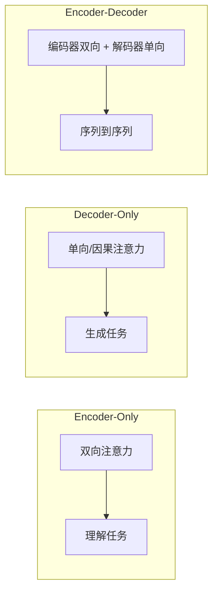

| 架构 | 注意力类型 | 代表模型 | 擅长任务 |
|------|-----------|---------|---------|
| Encoder-Only | 双向（可见全文） | BERT, RoBERTa | 文本分类、NER（命名实体识别）、语义相似度 |
| Decoder-Only | 单向（因果 mask） | GPT 系列, LLaMA, Qwen | 文本生成、对话、推理 |
| Encoder-Decoder | 编码双向 + 解码单向 | T5, BART, Flan-T5 | 翻译、摘要、结构化生成 |

### 1.10.2 Decoder-Only 为何成为主流

当前主流大模型几乎全部采用 Decoder-Only 架构，原因包括：

1. **统一的训练目标**：next-token prediction 目标简洁统一，训练流程简单
2. **In-context Learning 能力更强**：通过上下文示例即可适应新任务，无需微调
3. **KV Cache 利用效率更高**：自回归生成时可高效复用已计算的键值对

这种架构上的统一性是 LLM 从"任务特定"走向"通用智能"的关键技术选择。

在 Decoder-Only 架构中，只使用自注意力。而在 Encoder-Decoder 架构中，还需要交叉注意力来连接编码器和解码器。下面我们对比这两种注意力机制。

---

## 1.11 自注意力与交叉注意力

### 1.11.1 Self-Attention（自注意力）

Q、K、V 均来自**同一序列**：

$$Q = XW_Q, \quad K = XW_K, \quad V = XW_V$$

$$\text{SelfAttn}(X) = \text{softmax}\left(\frac{QK^T}{\sqrt{d_k}}\right)V$$

序列内部 Token 之间相互关注。用于 Encoder（双向）和 Decoder（因果 mask，即只能看到当前位置及之前的 Token）。

### 1.11.2 Cross-Attention（交叉注意力）

Q 来自一个序列，K 和 V 来自**另一个序列**：

$$Q = X_{query}W_Q, \quad K = X_{context}W_K, \quad V = X_{context}W_V$$

$$\text{CrossAttn}(X_q, X_c) = \text{softmax}\left(\frac{QK^T}{\sqrt{d_k}}\right)V$$

一个序列关注另一个序列的信息。用于 Encoder-Decoder 的交叉注意力层、Q-Former、多模态融合等场景。

### 1.11.3 对比

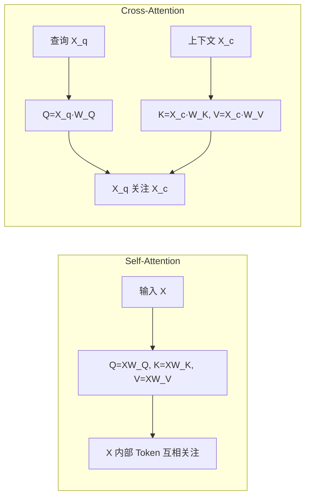

| 维度 | Self-Attention | Cross-Attention |
|------|---------------|-----------------|
| Q 来源 | 同一序列 | 查询序列 |
| K/V 来源 | 同一序列 | 上下文序列 |
| 信息流向 | 序列内部 | 跨序列 |
| 参数量 | $3d^2$ | $3d^2$（相同） |
| 典型应用 | Decoder-Only LLM | Encoder-Decoder, VLM, Q-Former |

### 1.11.4 在不同 LLM 架构中的使用

| 架构 | Self-Attention | Cross-Attention |
|------|---------------|-----------------|
| Decoder-Only (GPT/LLaMA) | 每层使用 | 不使用 |
| Encoder-Decoder (T5/BART) | Encoder 每层 | Decoder 每层 |
| VLM (LLaVA) | LLM 部分 | 不使用（投影层替代） |
| VLM (Qwen-VL) | LLM 部分 | 视觉交叉注意力层 |

了解了 Transformer 的核心组件后，我们转向模型训练的基础——损失函数和信息论概念。

---

## 1.12 损失函数与信息论基础

损失函数（Loss Function）衡量模型预测与真实值之间的差距，是训练优化的目标。LLM 的损失函数深植于信息论的基本概念之中。

### 1.12.1 信息熵（Entropy）

离散分布 $p(x)$ 的熵定义为：

$$H(p) = -\sum_{x} p(x) \log p(x)$$

**含义**：衡量分布的不确定性程度。均匀分布的熵最大（最不确定），确定性分布（delta 分布）的熵为 0（完全确定）。

### 1.12.2 交叉熵（Cross-Entropy）

$$H(p, q) = -\sum_{x} p(x) \log q(x) = H(p) + D_{KL}(p \| q)$$

当 $p$ 为真实分布（通常是 one-hot 向量）、$q$ 为模型预测分布时，交叉熵等价于负对数似然损失。

### 1.12.3 KL 散度（Kullback-Leibler Divergence）

$$D_{KL}(p \| q) = \sum_{x} p(x) \log \frac{p(x)}{q(x)}$$

KL 散度衡量两个概率分布之间的"距离"（严格来说不是距离，因为不满足对称性和三角不等式）。

**性质**：
- $D_{KL} \geq 0$，当且仅当 $p=q$ 时等于 0
- **不对称**：$D_{KL}(p \| q) \neq D_{KL}(q \| p)$

### 1.12.4 三者的关系

$$H(p, q) = H(p) + D_{KL}(p \| q)$$

由于真实分布 $H(p)$ 是常数，**最小化交叉熵等价于最小化 KL 散度**。这就是为什么 LLM 训练使用交叉熵损失——它本质上是在让模型的预测分布尽可能接近真实分布。

### 1.12.5 交叉熵损失在 LLM 中的应用

LLM 预训练的核心损失函数。对于 Token 序列 $y = (y_1, ..., y_T)$：

$$\mathcal{L}_{CE} = -\sum_{t=1}^{T} \log P_\theta(y_t | y_{<t}, x)$$

其中 $P_\theta(y_t | y_{<t}, x)$ 为模型对第 $t$ 个 Token 的预测概率，$y_{<t}$ 表示位置 $t$ 之前的所有 Token，$x$ 为输入上下文。

**直觉**：最大化似然等价于最小化负对数似然。当模型预测正确 Token 的概率为 1 时，损失为 0；概率越低，损失越大。

**与 Softmax 的关系**：$P(y_t) = \text{softmax}(z)[y_t]$，即 logits（模型输出的原始分数）经过 softmax 后取正确类别的概率。

### 1.12.6 MSE 损失（均方误差，Mean Squared Error）

$$\mathcal{L}_{MSE} = \frac{1}{N}\sum_{i=1}^{N}(y_i - \hat{y}_i)^2$$

在 LLM 中，MSE 主要用于：
- **奖励模型回归**：将 RM（Reward Model，奖励模型）输出拟合到目标奖励值
- **嵌入空间对齐**：如 CLIP 的对比损失中隐含 MSE 思想
- **一般不用于主训练**：MSE 对分类任务效果差于交叉熵

损失函数定义了优化目标，而正则化方法则防止模型在训练过程中过拟合。

---

## 1.13 正则化方法

正则化（Regularization）通过在损失函数中添加约束项，防止模型过拟合（overfitting，即模型在训练数据上表现好但在新数据上表现差）。

### 1.13.1 L1 正则化（Lasso）

$$\mathcal{L}_{L1} = \mathcal{L} + \lambda \sum_{i} |w_i|$$

其中 $\mathcal{L}$ 为原始损失，$\lambda$ 为正则化强度，$w_i$ 为模型权重。

- 产生**稀疏解**，部分权重精确为零
- 等价于拉普拉斯先验（Laplace prior）：$w \sim \text{Laplace}(0, b)$
- **适用场景**：特征选择、模型压缩、希望部分参数为零

### 1.13.2 L2 正则化（Ridge / Weight Decay）

$$\mathcal{L}_{L2} = \mathcal{L} + \lambda \sum_{i} w_i^2$$

- 权重趋向小但非零，防止某个权重过大
- 等价于高斯先验（Gaussian prior）：$w \sim \mathcal{N}(0, \sigma^2)$
- **适用场景**：防止过拟合、训练稳定性、LLM 训练中常用（Weight Decay）

### 1.13.3 几何直觉

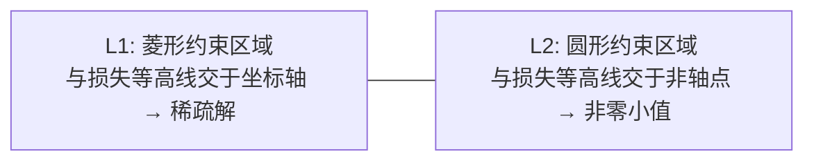

L1 的约束区域是菱形，其尖角位于坐标轴上，因此最优解更容易落在坐标轴上（即某些权重为零）。L2 的约束区域是圆形，最优解通常不在坐标轴上，所以权重趋向于小但非零。

**LLM 中的使用**：AdamW 将 weight decay 与梯度更新解耦，是 L2 正则化的改进版，几乎所有 LLM 训练都使用 AdamW。

正则化控制了模型的复杂度，而优化器决定了模型参数如何更新。接下来我们详细讨论 LLM 训练中最核心的优化器。

---

## 1.14 优化器：Adam 与 AdamW

### 1.14.1 Adam 算法

Adam（Adaptive Moment Estimation，自适应矩估计）结合了动量（Momentum）和自适应学习率（RMSprop）两种优化思想：

**一阶矩估计**（梯度的指数移动平均，类似动量）：

$$m_t = \beta_1 m_{t-1} + (1-\beta_1) g_t$$

**二阶矩估计**（梯度平方的指数移动平均，用于自适应学习率）：

$$v_t = \beta_2 v_{t-1} + (1-\beta_2) g_t^2$$

其中 $g_t$ 为第 $t$ 步的梯度，$\beta_1, \beta_2$ 为衰减系数。

**偏差修正**（消除初始化偏差）：

$$\hat{m}_t = \frac{m_t}{1-\beta_1^t}, \quad \hat{v}_t = \frac{v_t}{1-\beta_2^t}$$

**参数更新**：

$$\theta_{t+1} = \theta_t - \frac{\eta}{\sqrt{\hat{v}_t} + \epsilon} \cdot \hat{m}_t$$

| 参数 | 典型值 | 含义 |
|------|--------|------|
| $\eta$ | $10^{-4}$ 或 $3\times10^{-5}$ | 学习率（learning rate） |
| $\beta_1$ | 0.9 | 一阶矩衰减系数 |
| $\beta_2$ | 0.999 | 二阶矩衰减系数 |
| $\epsilon$ | $10^{-8}$ | 数值稳定性常数 |

### 1.14.2 AdamW 与 Adam 的核心区别

Adam 将 weight decay 直接加到梯度上，导致 decay 与学习率耦合；AdamW 将 weight decay 从梯度更新中**解耦**，直接从参数中减去：

$$\text{Adam: } \theta_{t+1} = \theta_t - \eta(\nabla L + \lambda w) / (\sqrt{\hat{v}} + \epsilon) \cdot \hat{m}$$

$$\text{AdamW: } \theta_{t+1} = (1 - \lambda\eta)\theta_t - \eta \cdot \hat{m}/(\sqrt{\hat{v}_t} + \epsilon)$$

其中 $\lambda$ 为 weight decay 系数。

**为什么选 AdamW**：
1. Weight decay 与学习率独立，调参更直观
2. 理论上等价于 L2 正则化（Adam 中不等价）
3. 几乎所有现代 LLM 训练使用 AdamW

### 1.14.3 LLM 训练中的 AdamW 典型配置

| 配置项 | 值 | 说明 |
|--------|-----|------|
| 学习率 | $3\times10^{-4}$（预训练）→ $2\times10^{-5}$（微调） | 预训练较大，微调较小 |
| Warmup | 1000~2000 步 | 防止初始梯度爆炸 |
| Cosine Decay | 余弦退火至最大步数的 10% | 平滑降低学习率 |
| $\beta_1, \beta_2$ | 0.9, 0.95 | LLM 训练标准值 |
| Weight Decay | 0.1 | 微调时常用 0.01~0.05 |
| $\epsilon$ | $10^{-8}$ 或 $10^{-6}$ | FP16/BF16 时用 $10^{-6}$ 防止下溢 |

掌握了训练的基本工具后，一个自然的问题是：模型应该做多大？数据应该用多少？这就是 Scaling Laws 要回答的问题。

---

## 1.15 Scaling Laws 与模型规模

Scaling Laws（缩放定律）揭示了模型性能与计算资源之间的定量关系，为大模型训练提供了理论指导。

### 1.15.1 Kaplan et al. (2020) 核心结论

模型损失与计算量 $C$、参数量 $N$、数据量 $D$ 之间存在幂律关系（power law）：

$$L(C) = \left(\frac{C_c}{C}\right)^{\alpha_C}, \quad \alpha_C \approx 0.05$$

$$L(N) = \left(\frac{N_c}{N}\right)^{\alpha_N}, \quad \alpha_N \approx 0.076$$

$$L(D) = \left(\frac{D_c}{D}\right)^{\alpha_D}, \quad \alpha_D \approx 0.095$$

其中 $C_c, N_c, D_c$ 为各自的缩放常数，$\alpha$ 为幂律指数。这些公式表明：增加计算量、参数量或数据量都能降低损失，但收益递减。

### 1.15.2 Chinchilla 最优比例

Hoffmann et al. (2022) 提出了更精确的资源分配策略：给定计算预算 $C$，最优参数量和数据量满足：

$$N_{opt} \propto C^{0.5}, \quad D_{opt} \propto C^{0.5}$$

即**模型参数和数据量应等比例增长**。这一发现具有重大实践意义：Chinchilla（70B 参数）通过使用更多数据，性能超过了参数量大 4 倍的 Gopher（280B 参数）。

### 1.15.3 指导意义

1. **计算预算分配**：先确定总算力，再按比例分配参数量 $N$ 和数据量 $D$
2. **数据瓶颈**：高质量数据是稀缺资源，数据量不足时盲目放大模型意义有限
3. **过度参数化**：很多模型训练不充分（如 GPT-3 用 300B 参数仅训练了 300B Token），Chinchilla 建议更小模型 + 更多数据
4. **预测性能**：无需训练完整模型，即可通过小规模实验外推预测大模型性能

当模型规模增大到一定程度，会出现一些令人惊讶的现象——涌现能力。

---

## 1.16 涌现能力

### 1.16.1 定义

涌现能力（Emergent Abilities）是指当模型规模（参数量/数据量/计算量）超过某个阈值后，模型突然获得在小规模时几乎不具备的能力，且该能力无法通过小模型的性能曲线外推预测。

### 1.16.2 典型涌现任务

- **少样本指令遵循**：约 10B 参数开始显现
- **思维链推理**（Chain-of-Thought, CoT）：约 60B 参数时显著提升
- **多语言翻译、数学推理**等复杂任务

### 1.16.3 争议

Wei et al. (2022) 首先提出涌现能力的概念。然而，Schaeffer et al. (2023) 指出涌现现象可能与评估指标的选择有关：使用非线性指标（如 exact match，精确匹配）时出现"突变"，使用连续指标时性能提升可能是平滑的。这一争议提醒我们，涌现能力可能部分是评估度量的假象，而非模型能力的真正不连续跃迁。

模型训练完成后，如何从模型中生成文本？这涉及到解码策略的选择。

---

## 1.17 解码策略

解码策略（Decoding Strategy）决定了模型在生成文本时如何从概率分布中选择下一个 Token。不同策略在生成质量和多样性之间做出不同的权衡。

### 1.17.1 Greedy Search（贪心搜索）

每步选择概率最大的 Token：

$$y_t = \arg\max_{w} P(w | y_{<t})$$

- **优点**：速度快、确定性输出
- **缺点**：容易陷入局部最优，输出重复、缺乏多样性

### 1.17.2 Beam Search（束搜索）

维护 $k$ 个候选序列（beam），每步扩展后保留得分最高的 top-k 序列：

$$\text{Score}(y_{1:t}) = \sum_{i=1}^{t} \log P(y_i | y_{<i})$$

- **优点**：比贪心搜索全局更优
- **缺点**：仍倾向生成高频安全文本，缺乏创造性；$k$ 越大计算量越大

### 1.17.3 Top-K Sampling（Top-K 采样）

从概率最大的 $K$ 个 Token 中按概率采样：

$$\mathcal{V}_k = \text{top-k}(\{P(w|y_{<t})\})$$

$$P'(w) = \frac{P(w)}{\sum_{w' \in \mathcal{V}_k} P(w')}, \quad w \in \mathcal{V}_k$$

- **优点**：引入随机性，输出多样
- **缺点**：$K$ 固定，不适应分布变化（尖锐分布时 $K$ 太大引入噪声，平坦分布时 $K$ 太小限制多样性）

### 1.17.4 Nucleus Sampling（Top-P 采样，核采样）

从概率累积和达到 $p$ 的最小集合中采样：

$$\mathcal{V}_p = \min\{S : \sum_{w \in S} P(w|y_{<t}) \geq p\}$$

- **优点**：自适应候选集大小——分布尖锐时候选少，平坦时候选多
- **缺点**：$p$ 值选择仍需调参

### 1.17.5 解码策略对比总结

| 策略 | 多样性 | 质量 | 速度 | 自适应 |
|------|--------|------|------|--------|
| Greedy | 低 | 中 | 快 | - |
| Beam | 低 | 高 | 中 | - |
| Top-K | 高 | 中 | 快 | 否 |
| Top-P | 高 | 中高 | 快 | 是 |

实际应用中，Top-P 采样配合温度系数是最常用的组合。例如，ChatGPT 默认使用 Top-P = 0.9、Temperature = 0.7 左右的配置。

到目前为止，我们讨论的都是密集模型（Dense Model），即每个 Token 都经过模型的全部参数。混合专家模型提供了一种更高效的架构选择。

---

## 1.18 混合专家模型（MoE）

混合专家模型（Mixture of Experts, MoE）是一种稀疏激活架构，通过门控机制让每个 Token 只经过部分"专家"网络，从而在不显著增加推理成本的前提下大幅扩展模型容量。

### 1.18.1 工作原理

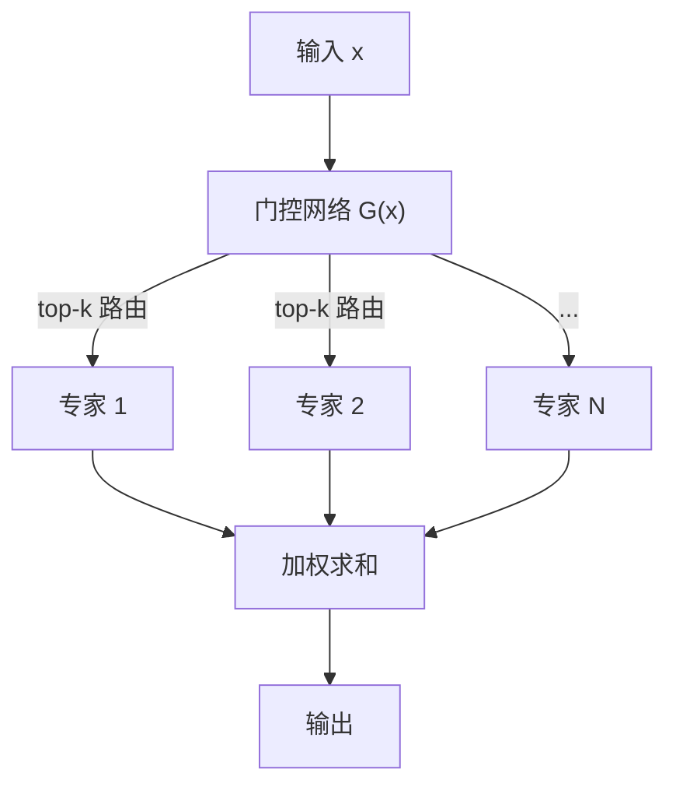

**门控函数**（Router，路由器）：

$$G(x) = \text{softmax}(\text{TopK}(x \cdot W_g))$$

$$\text{MoE}(x) = \sum_{i \in \text{TopK}} G(x)_i \cdot E_i(x)$$

其中 $W_g$ 为门控网络的权重矩阵，$E_i(x)$ 为第 $i$ 个专家网络的输出。通常 Top-K = 1 或 2，即每个 Token 只激活 1-2 个专家。

### 1.18.2 为什么不显著增加推理成本

- 总参数量大（如 DeepSeek-V3 有 671B 参数），但每个 Token 只激活部分专家（如 37B 激活参数）
- **推理 FLOPs 约等于激活参数量对应的密集模型**，与总参数量无关
- 训练时同样如此：每个 Token 的计算量由激活参数决定

### 1.18.3 关键挑战

**1. 负载均衡**：防止所有 Token 路由到少数"热门"专家。通过辅助损失实现：

$$\mathcal{L}_{aux} = \alpha \cdot N \sum_{i=1}^{N} f_i \cdot P_i$$

其中 $f_i$ 为分配给专家 $i$ 的 Token 比例，$P_i$ 为门控概率均值，$N$ 为专家总数，$\alpha$ 为辅助损失权重。该损失鼓励 Token 均匀分配到各专家。

**2. 通信开销**：专家分布在不同 GPU 上，All-to-All 通信（每个 GPU 向所有其他 GPU 发送数据）是性能瓶颈。

**3. 训练不稳定性**：路由决策的离散性导致梯度估计困难。

MoE 架构使得模型可以拥有巨大的参数量而保持合理的推理成本。但对于已有的密集模型，如何以低成本适配到新任务？这就是参数高效微调要解决的问题。

---

## 1.19 参数高效微调：LoRA 及其变体

LoRA（Low-Rank Adaptation，低秩适配）是当前最流行的参数高效微调方法，通过在冻结的预训练权重旁注入可训练的低秩矩阵来实现高效微调。

### 1.19.1 核心思想

冻结预训练权重 $W_0 \in \mathbb{R}^{d \times k}$，注入可训练的低秩分解矩阵：

$$W = W_0 + \Delta W = W_0 + BA, \quad B \in \mathbb{R}^{d \times r}, A \in \mathbb{R}^{r \times k}, r \ll \min(d, k)$$

其中 $r$ 为秩（rank），远小于原始维度。前向传播时：

$$h = W_0 x + BAx = W_0 x + B(Ax)$$

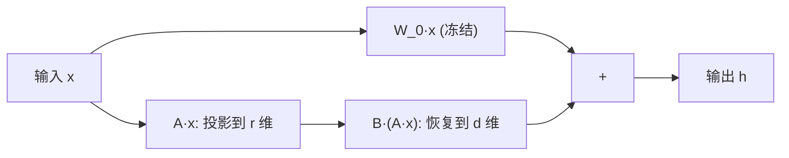

### 1.19.2 参数量分析

原始参数量：$d \times k$

LoRA 参数量：$d \times r + r \times k = r(d+k)$

压缩比：$\frac{r(d+k)}{dk}$。当 $r=8, d=k=4096$ 时，压缩比约 $\frac{8 \times 8192}{16.7M} \approx 0.39\%$。

### 1.19.3 初始化策略

| 矩阵 | 初始化方式 | 原因 |
|------|-----------|------|
| $A$ | 高斯随机初始化 $\sim \mathcal{N}(0, \sigma^2)$ | 随机投影，打破对称性 |
| $B$ | **全零初始化 $B = 0$** | 保证初始状态 $\Delta W = 0$ |

**为什么 $B$ 要初始化为零？** 训练开始时 $BA = 0$，即 $W = W_0$，模型行为完全等同于冻结的预训练模型。这意味着：

1. 训练起点就是已验证的良好状态
2. 学习率可以设置较大（因为初始扰动为 0）
3. 不会破坏预训练知识
4. 若 $B$ 不为零，初始扰动可能破坏已有能力

### 1.19.4 缩放因子 $\alpha$

LoRA 引入缩放因子 $\alpha$ 控制更新幅度：

$$\Delta W = \frac{\alpha}{r} BA$$

- $\alpha/r$ 为有效学习率缩放系数
- 通常设 $\alpha = r$，此时 $\alpha/r = 1$
- 调整 $\alpha$ 相当于调整 LoRA 的学习率，无需改全局学习率
- $\alpha > r$ → 更激进的适应；$\alpha < r$ → 更保守的微调

### 1.19.5 LoRA 变体

| 变体 | 改进点 |
|------|--------|
| **AdaLoRA** | 自适应分配不同层的秩 $r_i$，重要层给更多参数 |
| **DoRA** (Weight-Decomposed) | 将权重分解为幅值和方向，分别做低秩适配 |
| **LoRA+** | 对 $A$ 和 $B$ 使用不同的学习率（$B$ 用更大学习率） |
| **LoftQ** | 通过量化感知训练解决量化模型上 LoRA 性能下降问题 |
| **VeRA** | 共享 $A, B$ 矩阵，只学习每层的小尺度向量，进一步减少参数 |
| **QLoRA** | 将基座模型量化为 4-bit（NF4），在此基础上应用 LoRA |

### 1.19.6 QLoRA（最常用变体）

将预训练模型量化为 4-bit NormalFloat（NF4，一种针对正态分布权重优化的量化格式），再在其上训练 LoRA：

$$W_{quantized} = \text{Quantize}(W_0, 4\text{-bit NF4})$$

$$W = \text{Dequantize}(W_{quantized}) + \frac{\alpha}{r} BA$$

**优势**：70B 模型从约 140GB 显存降至约 48GB（单卡 A100 可运行）。代表工具包括 bitsandbytes + HuggingFace PEFT / Axolotl / LLaMA-Factory。

LoRA 解决了微调的效率问题，但预训练本身面临着更大的工程挑战。接下来我们讨论训练百亿乃至千亿参数模型时遇到的核心问题。

---

## 1.20 训练大规模 LLM 的工程挑战

### 1.20.1 显存挑战

| 组件 | 显存占用 |
|------|---------|
| 模型参数 | $2N$ bytes（FP16，即半精度浮点） |
| 梯度 | $2N$ bytes |
| 优化器状态 | Adam: $8N$ bytes（FP32 的一阶矩 $m$ 和二阶矩 $v$） |
| 激活值 | 与序列长度和批大小成正比 |

总显存约 $16N$（混合精度 Adam）。以 70B 模型为例，需约 1.1TB 显存。

**解决方案**：ZeRO 1/2/3 分片优化器状态/梯度/参数（详见 1.21 节）；激活重计算（Activation Checkpointing，用计算换显存）；CPU Offloading（将部分数据卸载到 CPU 内存）。

### 1.20.2 通信挑战

- **数据并行**：AllReduce 梯度同步（所有 GPU 交换并聚合梯度）
- **张量并行**：每层内 AllReduce（每层 2 次通信）
- **流水线并行**：层间点对点通信
- **MoE**：All-to-All 专家路由

**解决方案**：通信与计算重叠（overlap）、环形通信（Ring AllReduce）、1F1B 调度。

### 1.20.3 训练不稳定性

- **损失尖峰**（loss spike）：训练过程中损失突然飙升
- **梯度爆炸/消失**：梯度值过大或过小

**解决方案**：
- 预归一化（Pre-LN）或 RMSNorm
- 梯度裁剪（gradient clipping，限制梯度的最大范数）
- 学习率预热（warmup，训练初期逐步增大学习率）
- BF16 替代 FP16（BF16 的动态范围更大，减少溢出风险）

这些挑战催生了多种分布式训练技术。

---

## 1.21 分布式训练

### 1.21.1 并行策略总览

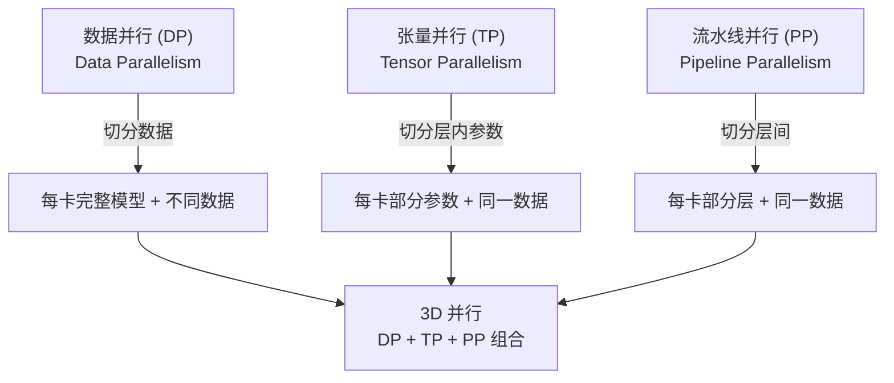

### 1.21.2 数据并行（Data Parallelism）

每张 GPU 持有完整模型副本，处理不同的数据子集，梯度通过 AllReduce 同步。

**显存瓶颈**：每卡需完整模型 + 优化器状态 + 梯度，冗余严重。

### 1.21.3 DeepSpeed ZeRO（Zero Redundancy Optimizer）

ZeRO 将数据并行中的冗余状态分片到各卡，消除冗余：

| 阶段 | 分片内容 | 每卡显存 | 通信量 |
|------|---------|---------|--------|
| ZeRO-0 | 无分片（标准 DP） | $16N$ | $1\times$ |
| ZeRO-1 | 优化器状态分片 | $\sim 4N + \frac{12N}{G}$ | $1\times$ |
| ZeRO-2 | + 梯度分片 | $\sim 4N + \frac{6N}{G}$ | $1\times$ |
| ZeRO-3 | + 参数分片 | $\sim \frac{16N}{G}$ | $1.5\times$ |

其中 $N$ 为参数量，$G$ 为 GPU 数。ZeRO-3 实现近似 $1/G$ 的显存缩放。

**ZeRO-3 的代价**：前向/反向时需 All-Gather 收集参数，通信量增加 50%。

### 1.21.4 FSDP（Fully Sharded Data Parallel）

FSDP 是 PyTorch 原生实现的 ZeRO-3 等价方案：

| | DeepSpeed ZeRO-3 | FSDP |
|---|---|---|
| 实现 | 第三方库 | PyTorch 原生 |
| 易用性 | 配置复杂 | 更简洁 |
| 生态 | 更成熟（更多优化技巧） | 快速追赶 |
| 混合精度 | 支持 | 支持 |
| Offload | 支持 CPU/NVMe Offload | 支持 CPU Offload |

### 1.21.5 张量并行（Tensor Parallelism）

将单个层的参数切分到多卡。以线性层 $Y = XW$ 为例：

**列切分**：$W = [W_1, W_2]$，各卡计算 $Y_i = XW_i$，All-Gather 拼接 $Y = [Y_1, Y_2]$

**行切分**：$W = \begin{bmatrix}W_1 \\ W_2\end{bmatrix}$，输入 $X = [X_1, X_2]$，各卡计算 $Y_i = X_iW_i$，All-Reduce 求和

每层需要 2 次 All-Reduce（前向 1 次 + 反向 1 次），通信量大，通常限制在同一节点内（NVLink 高速互联）。

### 1.21.6 流水线并行（Pipeline Parallelism）

将模型按层切分到不同 GPU：

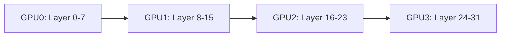

**问题**：朴素流水线有严重的气泡（bubble），GPU 空闲等待。

**1F1B 调度**（One Forward One Backward）通过交错前向和反向计算来减少气泡：

| 时间步 | GPU0 | GPU1 | GPU2 | GPU3 |
|--------|------|------|------|------|
| 1 | F0 | - | - | - |
| 2 | F1 | F0 | - | - |
| 3 | F2 | F1 | F0 | - |
| 4 | F3 | F2 | F1 | F0 |
| 5 | B0 | F3 | F2 | F1 |
| 6 | B1 | B0 | F3 | F2 |

其中 F 表示前向传播，B 表示反向传播。气泡比例约为 $\frac{P-1}{m+P-1}$，$P$ 为流水线阶段数，$m$ 为 micro-batch 数。

### 1.21.7 3D 并行组合策略

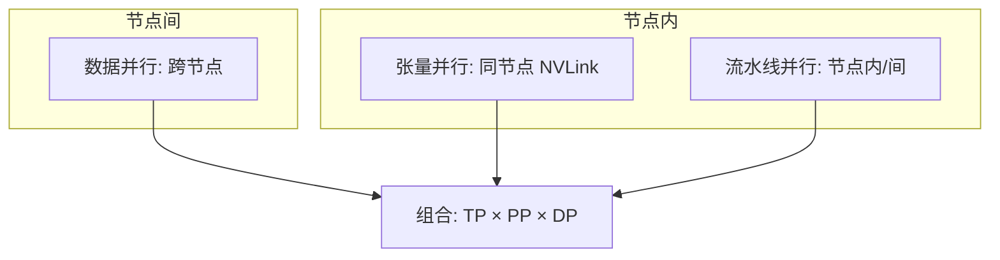

**典型配置**（70B 模型，64 卡 A100）：
- TP = 4（每节点 4 卡 NVLink 互联）
- PP = 4（4 个流水线阶段）
- DP = 4（4 路数据并行）

分布式训练解决了"如何训练"的问题，而推理加速技术解决的是"如何高效使用"的问题。

---

## 1.22 推理加速：FlashAttention 与 KV Cache

### 1.22.1 FlashAttention 原理

**核心问题**：标准自注意力需要存储完整的 $n \times n$ 注意力矩阵 $S = QK^T/\sqrt{d_k}$，显存占用 $O(n^2)$，这在长序列场景下成为瓶颈。

**IO-Aware 设计思想**：FlashAttention 不通过 HBM（High Bandwidth Memory，GPU 高带宽内存）存储中间结果，而是在 **SRAM（Static Random-Access Memory，片上缓存）** 内完成 softmax 和加权求和，大幅减少 HBM 读写次数。

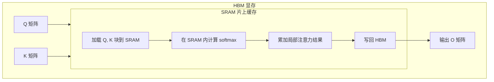

**关键技巧——在线 Softmax（Online Softmax）**：避免存储完整注意力矩阵。利用 softmax 的数值稳定性技巧：

$$\text{softmax}(x)_i = \frac{e^{x_i}}{\sum_j e^{x_j}} = \frac{e^{x_i - m}}{\sum_j e^{x_j - m}}$$

分块计算时维护 running max $m$ 和 running sum $\ell$，逐块更新：

$$m_{new} = \max(m_{old}, m_{block}), \quad \ell_{new} = \ell_{old} \cdot e^{m_{old} - m_{new}} + \ell_{block} \cdot e^{m_{block} - m_{new}}$$

### 1.22.2 FlashAttention 性能对比

| | 标准 Attention | FlashAttention-1 | FlashAttention-2 |
|---|---|---|---|
| HBM 读写量 | $O(n^2 d)$ | $O(nd^2)$ | 更少 |
| 计算吞吐 | 基准 | ~3x | ~2x (vs FA-1) |
| 额外显存占用 | $O(n^2)$ | $O(1)$ | $O(1)$ |
| 支持反向传播 | 是 | 是 | 是 |

几乎所有现代开源 LLM（LLaMA, Qwen, DeepSeek, Mistral 等）都基于 FlashAttention 实现，它是训练和推理加速的基础组件。

### 1.22.3 KV Cache 原理

**问题**：自回归解码时，每生成一个新 Token 都需要重新计算之前所有 Token 的 K 和 V：

$$t=1: \text{Attn}(q_1, [k_1], [v_1])$$
$$t=2: \text{Attn}(q_2, [k_1,k_2], [v_1,v_2])$$
$$t=T: \text{Attn}(q_T, [k_1,...,k_T], [v_1,...,v_T])$$

总计算量 $\sum_{t=1}^{T} O(t \cdot d) = O(T^2 d)$。

**KV Cache 方案**：缓存已计算的 K 和 V，每步只需计算新 Token 的 Q 及其与缓存 KV 的注意力：

$$t=T: \text{Attn}(q_T, \underbrace{[k_1,...,k_{T-1}]}_{\text{Cache}}, \underbrace{[v_1,...,v_{T-1}]}_{\text{Cache}})$$

每步计算量从 $O(Td)$ 降为 $O(d)$。

### 1.22.4 KV Cache 显存开销

$$\text{KV Cache 大小} = 2 \times n_{layers} \times n_{heads} \times d_{head} \times seq\_len \times bytes$$

以 LLaMA-2-70B 为例（80 层，64 头，128 维头，FP16，4K 上下文）：

$$2 \times 80 \times 64 \times 128 \times 4096 \times 2 = 5.37 \text{ GB}$$

**优化方向**：
- GQA/MQA：减少 KV 头数 → 降低 cache 大小
- MLA（DeepSeek 的 Multi-head Latent Attention）：压缩 KV 到低维潜在空间
- PagedAttention（vLLM）：解决显存碎片化

---

## 1.23 推理服务：vLLM

vLLM 是一个高性能的 LLM 推理服务框架，其核心创新是 PagedAttention——借鉴操作系统虚拟内存的分页机制来管理 KV Cache。

### 1.23.1 传统方案的缺陷

连续分配 KV Cache 导致：
1. **内部碎片**：预分配的空间可能未完全使用
2. **外部碎片**：释放的不规则空闲块难以复用
3. **浪费严重**：为最坏情况（最大序列长度）预留空间

### 1.23.2 PagedAttention 工作原理

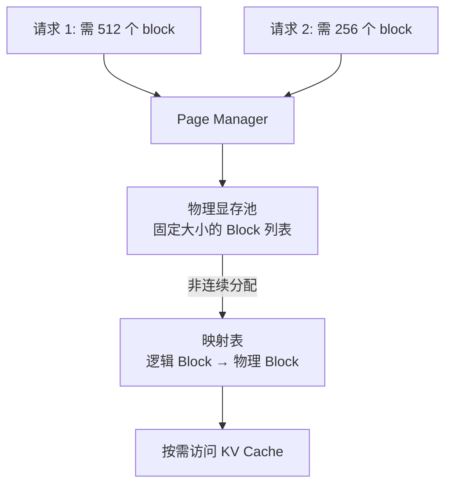

**关键设计**：
- 将 KV Cache 划分为固定大小的 Block（如每个 block 存 16 个 Token）
- 逻辑上连续，物理上分散存储
- 通过块表（Block Table）映射逻辑地址到物理地址
- 类似操作系统的页表（Page Table）机制

### 1.23.3 Continuous Batching（连续批处理）

传统推理：等整个 batch 完成后才处理下一个请求。

vLLM：当一个请求完成后立即插入新请求，保持 GPU 利用率恒定。

```mermaid
gantt
    title 传统 Batching vs Continuous Batching
    dateFormat X
    axisFormat %s
    
    section 传统
    ReqA :a1, 0, 5
    idle :crit, 5, 8
    ReqB :b1, 8, 12
    
    section vLLM
    ReqA :c1, 0, 5
    ReqB :c2, 5, 9
    ReqC :c3, 9, 11
```

### 1.23.4 vLLM 性能优势

| 维度 | 传统框架（HuggingFace） | vLLM |
|------|------------------------|-------|
| GPU 利用率 | 低（等待 batch 完成） | 高（continuous batching） |
| 内存利用率 | 浪费（预留 + 碎片） | 高效（PagedAttention） |
| 吞吐量 | 基准 | 2-24x 提升 |
| 适用场景 | 单请求/小批量 | 生产环境高并发服务 |

KV Cache 的显存开销随序列长度线性增长，这引出了长上下文处理的挑战。

---

## 1.24 长上下文处理技术

### 1.24.1 核心挑战

| 问题 | 描述 |
|------|------|
| 计算复杂度 | 自注意力 $O(n^2)$，序列翻倍计算量翻 4 倍 |
| KV Cache 显存 | 线性增长，128K 上下文可能占数十 GB |
| 位置编码外推 | 训练时未见过的位置，模型表现退化 |
| Lost in the Middle | 中间位置的信息利用率低于首尾 |

### 1.24.2 RoPE 扩展方法

#### NTK-aware Scaling

修改 RoPE 的基频，使高频分量周期不变、低频分量周期拉伸：

$$\theta_i' = (b \cdot 10000)^{-2i/d}$$

其中 $b$ 为缩放因子，$b > 1$ 时等效于拉伸位置编码的周期。

#### YaRN（Yet another RoPE extensioN）

结合 NTK-aware 缩放和注意力温度调整：

$$\text{Attention}(q, k) = \text{softmax}\left(\frac{q^T k}{\sqrt{d_k} \cdot t}\right)$$

其中温度因子 $t$ 随缩放比例动态调整，缓解长距离注意力退化。

#### 方法对比

| 方法 | 原理 | 外推能力 | 实现难度 |
|------|------|---------|---------|
| 直接缩放 | 位置 $pos \times \frac{L_{train}}{L_{target}}$ | 差 | 最简单 |
| NTK-aware | 修改基频 | 中 | 简单 |
| YaRN | NTK + 温度调整 | 好 | 中 |
| 动态 NTK | 根据序列长度动态调整基频 | 好 | 中 |
| ALiBi | 线性注意力偏置（无位置编码） | 好 | 简单 |

### 1.24.3 KV Cache 优化方法

| 方法 | 原理 | 压缩比 |
|------|------|--------|
| GQA | 减少 KV 头数 | $h/g$ |
| MLA | 压缩 KV 到低维潜在空间 | $d_c/(n_h \cdot d_k)$ |
| Token Eviction | 驱逐不重要 Token 的 KV | 可变 |
| Sliding Window | 只保留最近 $W$ 个 Token 的 KV | $W/L$ |
| Quantization | KV Cache 4-bit/8-bit 量化 | 2-4x |

### 1.24.4 长上下文训练策略

1. **渐进式扩展**：先短上下文训练，再逐步增大（4K → 8K → 32K → 128K）
2. **RoPE 插值微调**：在目标长度上少量微调，让模型适应新位置编码
3. **稀疏注意力**：如 Longformer 的滑动窗口 + 全局注意力
4. **Ring Attention**：将序列分块环形分布在多卡上，理论上支持无限长序列

长上下文技术使 LLM 能处理更长的文本。而要让模型同时理解图像和文本，则需要多模态架构设计。

---

## 1.25 多模态 Transformer 架构

### 1.25.1 核心挑战

文本和图像存在本质的模态差异：

| 维度 | 文本 | 图像 |
|------|------|------|
| 基本单位 | Token（离散） | Patch/Pixel（连续） |
| 序列长度 | 数百~数千 | 数千~数万 |
| 位置结构 | 1D 序列 | 2D 空间 |
| 语义密度 | 高（每个 Token 信息丰富） | 低（大量冗余像素） |

### 1.25.2 主流架构方案

```mermaid
flowchart TB
    subgraph 方案1["方案 1: 投影连接"]
        direction LR
        I1[图像] --> VE1["视觉编码器 (冻结)"]
        VE1 --> P1[投影层]
        P1 --> L1["LLM (统一处理)"]
        T1[文本] --> L1
    end
    subgraph 方案2["方案 2: 交叉注意力融合"]
        direction LR
        I2[图像] --> VE2[视觉编码器]
        VE2 --> CA["交叉注意力层 (注入 LLM)"]
        T2[文本] --> L2[LLM]
        L2 --> CA
    end
    subgraph 方案3["方案 3: 统一 Transformer"]
        direction LR
        I3[图像] --> VE3[视觉 Patch 嵌入]
        T3[文本] --> TE3[文本 Token 嵌入]
        VE3 --> UT["统一 Transformer (同时处理)"]
        TE3 --> UT
    end
```

### 1.25.3 方案对比

**方案 1：投影连接**（代表：LLaVA, InternVL, Qwen-VL）

$$v_i = W_{proj} \cdot \text{ViT}(image)_i + b_{proj}$$

视觉 Token 与文本 Token 拼接后输入 LLM。优点是简单、复用现有 LLM、训练成本低；缺点是融合较浅。

**方案 2：交叉注意力融合**（代表：Flamingo, Qwen-VL, BLIP-2）

在 LLM 的特定层插入交叉注意力，K/V 来自视觉编码器：

$$\text{CrossAttn}(h_t, v) = \text{softmax}\left(\frac{h_t W_Q (v W_K)^T}{\sqrt{d_k}}\right) v W_V$$

优点是深度融合、视觉信息动态注入；缺点是架构复杂、推理较慢。

**方案 3：统一 Transformer**（代表：Emu, Chameleon, Janus）

视觉和文本共享同一个 Transformer，通过模态标记区分：

$$h_i = E_{mod}[m_i] + E_{token}[id_i] + PE(pos_i)$$

其中 $E_{mod}$ 为模态嵌入矩阵，$m_i$ 为模态标识。优点是最深融合、统一架构；缺点是训练成本高。

### 1.25.4 设计决策对比

| 决策 | 方案 1 | 方案 2 | 方案 3 |
|------|-------|-------|-------|
| 视觉编码器 | 冻结 ViT | 冻结/微调 ViT | 无独立编码器 |
| 融合深度 | 浅（输入层） | 中（中间层） | 深（全层） |
| 训练成本 | 低 | 中 | 高 |
| 推理速度 | 快 | 中 | 快 |
| 视觉理解 | 中 | 高 | 中高 |

了解了通用架构后，我们来看具体的开源模型系列是如何将这些技术组合在一起的。

---

## 1.26 开源模型系列解析

### 1.26.1 Qwen 系列创新

| 版本 | 创新点 |
|------|--------|
| Qwen-1 | RoPE + SwiGLU + RMSNorm + MHA |
| Qwen-1.5 | GQA、更优的分词器、更大规模数据 |
| Qwen-2 | GQA + 密集/稀疏混合架构、长上下文支持 |
| Qwen-2.5 | 更大 MoE 模型、多语言增强 |
| Qwen3 | 思考模式切换、GQA、DAPO 训练 |

### 1.26.2 DeepSeek 系列创新

| 版本 | 创新点 |
|------|--------|
| DeepSeek-V1 | MLA（Multi-head Latent Attention）：将 KV 压缩到低维潜在空间，大幅降低 KV Cache |
| DeepSeek-V2 | MLA + DeepSeekMoE（细粒度专家 + 共享专家） |
| DeepSeek-V3 | MLA + MoE + 辅助无损负载均衡 + FP8 混合精度训练 |
| DeepSeek-R1 | GRPO 强化学习、蒸馏小模型、推理链自发涌现 |

### 1.26.3 MLA 核心公式

MLA 是 DeepSeek 的标志性创新，将 KV 压缩到低维潜在表示：

$$c^{KV} = W_{DKV} \cdot h_t$$

$$k_t = W_{UK} \cdot c^{KV}, \quad v_t = W_{UV} \cdot c^{KV}$$

其中 $W_{DKV}$ 为下投影矩阵（将高维 $h_t$ 压缩到低维 $c^{KV}$），$W_{UK}, W_{UV}$ 为上投影矩阵（从低维恢复 K 和 V）。

KV Cache 从 $2 \times n_h \times d_k \times L$ 压缩到 $d_c \times L$（$d_c \ll n_h \times d_k$），显著降低了推理时的显存开销。

### 1.26.4 GLM 系列

GLM（General Language Model）是智谱 AI 推出的大语言模型系列，核心创新在于**自回归空白填充**（Autoregressive Blank Filling）训练目标。

**训练目标**：随机遮盖文本中的连续片段，模型自回归地预测被遮盖的内容：

$$\mathcal{L}_{GLM} = -\sum_{t \in \text{mask}} \log P(x_t | x_{<t}, c)$$

其中 $c$ 为上下文（未遮盖部分），遮盖片段内部按从左到右顺序预测。

```mermaid
flowchart LR
    A["原始文本: A B C D E F G"] --> B["随机遮盖: A B _ _ E F _"]
    B --> C["重排遮盖片段"]
    C --> D["自回归预测"]
```

**与 BERT/GPT 的区别**：

| | BERT | GPT | GLM |
|---|---|---|---|
| 训练目标 | 掩码语言模型 | 自回归语言模型 | 空白填充 |
| 注意力 | 双向 | 单向 | 混合（上下文双向，遮盖单向） |
| 任务适配 | NLU 强，NLG 弱 | NLG 强，NLU 弱 | NLU + NLG 统一 |

**ChatGLM 系列演进**：

| 版本 | 架构特点 | 训练方法 |
|------|---------|---------|
| ChatGLM-6B | GLM 架构 + 6B 参数 | SFT + RLHF |
| ChatGLM2-6B | FlashAttention + 多位置查询 | SFT + RLHF |
| ChatGLM3-6B | 工具调用 + 代码解释器 | SFT + RLHF |
| GLM-4 | 更大规模 + 多模态 | SFT + PPO |
| GLM-4V | 视觉-语言多模态 | SFT + RL |

**前缀注意力机制**是 ChatGLM 的特色设计：Prompt 部分可以相互关注（双向），生成部分只能看左侧（因果）。这使模型在理解指令时能充分利用上下文，在生成时保持自回归特性。

```mermaid
flowchart TB
    subgraph 注意力掩码设计
        M1["Prompt 内部: 全可见 (双向)"]
        M2["生成部分: 只看左侧 (因果)"]
        M3["生成部分看 Prompt: 全可见"]
    end
```

**GLM-4 关键技术**：
1. **大词表**（150K+）：优化中文编码效率
2. **多任务指令微调**：统一对话、工具调用、代码执行等多种任务格式
3. **长上下文**：支持 128K 上下文，使用 RoPE 插值扩展
4. **多模态扩展**：GLM-4V 通过视觉编码器 + 投影层接入

最后，我们讨论如何通过 Prompt 工程来有效地使用这些模型。

---

## 1.27 Prompt 工程

Prompt 工程（Prompt Engineering）是通过设计输入提示来引导 LLM 产生期望输出的技术。它是使用 LLM 的核心技能之一。

### 1.27.1 Prompt 设计原则

| 原则 | 说明 | 示例 |
|------|------|------|
| 明确性 | 指令清晰无歧义 | "用 3 句话总结" > "总结一下" |
| 具体性 | 提供充分上下文和约束 | "以 JSON 格式输出" |
| 结构化 | 使用分隔符、编号、模板 | "### 输入\n### 要求\n### 输出" |
| 示例驱动 | Few-shot 提供输入输出样例 | 给 2-3 个示例 |
| 角色设定 | 赋予模型特定角色 | "你是一位资深 Python 工程师" |

### 1.27.2 Prompt 设计模板

```mermaid
flowchart TB
    R[角色设定] --> C["上下文/背景"]
    C --> I[具体指令]
    I --> F[格式要求]
    F --> E["示例 (Few-shot)"]
    E --> O[输出]
```

### 1.27.3 针对不同模型的适配

| 模型特点 | Prompt 调整策略 |
|---------|----------------|
| 指令遵循型（ChatGLM/Qwen） | 直接下达指令，格式约束明确 |
| 基座模型（无 SFT） | 用续写格式，避免指令格式 |
| 小模型（7B 以下） | 更详细的步骤拆解，更多示例 |
| 大模型（70B+） | 简洁指令即可，减少冗余 |
| 长上下文模型 | 将关键信息放在开头和结尾 |
| 代码模型 | 用 Markdown 代码块格式 |

### 1.27.4 迭代优化流程

```mermaid
flowchart TB
    D[设计初始 Prompt] --> T[测试评估]
    T --> A{分析输出}
    A -->|格式错误| F[加强格式约束]
    A -->|内容不完整| I["增加上下文/示例"]
    A -->|偏离意图| C["明确指令/角色"]
    A -->|幻觉| G[加入事实约束]
    A -->|满意| S[固化 Prompt]
    F --> T
    I --> T
    C --> T
    G --> T
```

### 1.27.5 高级技巧

| 技巧 | 原理 | 适用场景 |
|------|------|---------|
| CoT（Chain-of-Thought） | "请一步步思考" | 复杂推理 |
| Self-Consistency | 多次采样取多数投票 | 提高准确率 |
| Self-Reflection | "请检查你的回答" | 减少错误 |
| 分步执行 | 将复杂任务拆为子任务 | 多步骤任务 |
| 约束注入 | "不要编造信息" | 减少幻觉 |
| 输出模板 | 指定输出格式模板 | 结构化输出 |

### 1.27.6 意图识别中的 Prompt 设计

在实际应用中，用户输入往往是模糊的。处理模糊意图的策略包括：

| 策略 | 方法 |
|------|------|
| 澄清追问 | "您是想问 A 还是 B？" |
| 多意图拆解 | 将复合查询拆为多个子意图 |
| 置信度阈值 | 低置信度时触发人工/澄清流程 |
| 意图层级 | 先粗分类再细分类 |

---

## 本章小结

本章系统介绍了大语言模型的核心技术基础，从底层到上层的技术栈可以概括为：

```mermaid
flowchart TB
    T["词元化 (Tokenization)"] --> E["嵌入表示 (Embedding)"]
    E --> SA["自注意力 (Self-Attention)"]
    SA --> MHA["多头注意力 (MHA/GQA)"]
    MHA --> PE["位置编码 (RoPE)"]
    PE --> NORM["归一化 (RMSNorm)"]
    NORM --> ACT["激活函数 (SwiGLU)"]
    ACT --> ARCH["架构 (Decoder-Only)"]
    ARCH --> TRAIN["训练 (AdamW + 交叉熵)"]
    TRAIN --> SCALE["规模 (Scaling Laws)"]
    SCALE --> DIST["分布式 (3D 并行)"]
    DIST --> INFER["推理 (FlashAttention + KV Cache + vLLM)"]
    INFER --> TUNE["微调 (LoRA/QLoRA)"]
    TUNE --> USE["使用 (Prompt 工程 + 解码策略)"]
```

**关键技术选择总结**：

| 组件 | 早期方案 | 现代 LLM 主流方案 |
|------|---------|-----------------|
| 位置编码 | Sinusoidal / Learned | RoPE |
| 归一化 | Post-LN / LayerNorm | Pre-RMSNorm |
| 激活函数 | ReLU / GeLU | SwiGLU |
| 注意力 | MHA | GQA |
| 优化器 | Adam | AdamW |
| 推理加速 | 标准 Attention | FlashAttention + KV Cache |
| 微调 | 全参数微调 | LoRA / QLoRA |

这些技术共同构成了现代大语言模型的技术基石。后续章节将在此基础上，深入讨论对齐训练（RLHF/DPO）、检索增强生成（RAG）、Agent 系统等进阶主题。