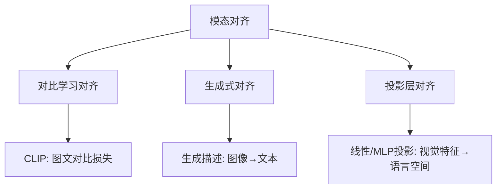
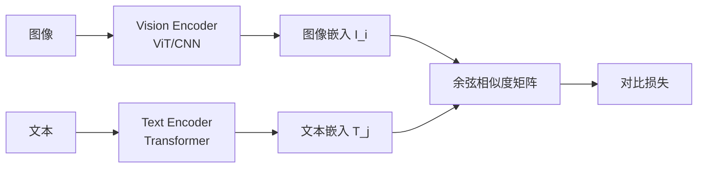
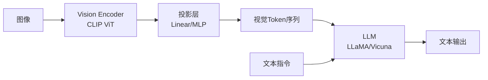
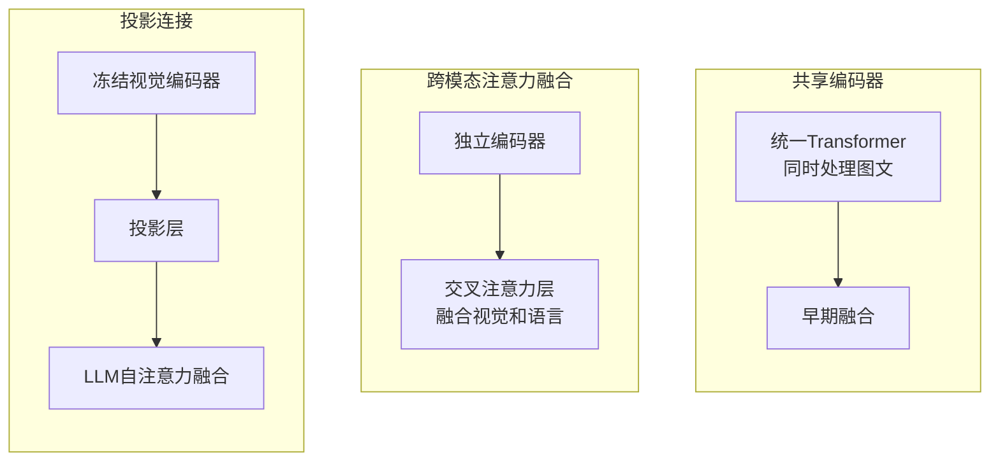
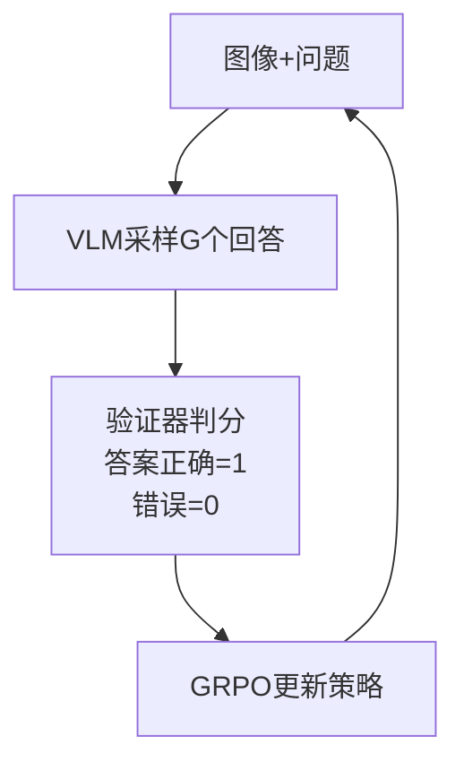
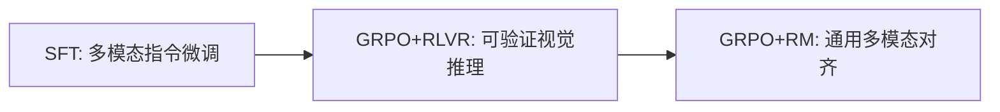

# 二、VLM 面试真题

## 1. 多模态大模型核心挑战：模态对齐与融合

### 核心问题

视觉信息（像素/特征）与语言信息（token/嵌入）处于不同的语义空间，需要：
1. **对齐**：建立两种模态间的语义对应关系
2. **融合**：在推理时有效整合两种模态的信息

### 对齐方法分类



### 融合方式分类

| 方式 | 描述 | 代表 |
|------|------|------|
| 早期融合 | 输入层拼接视觉和文本token | Flamingo |
| 中期融合 | 交叉注意力层注入视觉信息 | Qwen-VL, LLaVA-1.5 |
| 晚期融合 | 各模态独立编码后融合 | CLIP |

---

## 2. CLIP 模型

### 架构



### 对比学习目标

给定 $N$ 个图文对，计算相似度矩阵 $S_{ij} = \frac{I_i \cdot T_j}{\|I_i\|\|T_j\|}$，优化：

$$\mathcal{L} = -\frac{1}{2N}\sum_{i=1}^{N}\left(\log\frac{e^{S_{ii}/\tau}}{\sum_j e^{S_{ij}/\tau}} + \log\frac{e^{S_{ii}/\tau}}{\sum_j e^{S_{ji}/\tau}}\right)$$

其中 $\tau$ 为可学习的温度参数。

### 关键设计

- 对角线为正样本（匹配的图文对），非对角线为负样本
- InfoNCE 损失：同一图像的文本描述应与该图像相似度最高
- 训练规模：4亿图文对，使模型学到通用视觉-语言对齐

---

## 3. LLaVA / MiniGPT-4 架构设计

### LLaVA 架构



### 关键设计

| 组件 | LLaVA | MiniGPT-4 |
|------|-------|-----------|
| Vision Encoder | CLIP ViT-L/14 | EVA-CLIP ViT-G |
| 投影层 | 线性层 / MLP | Q-Former (来自BLIP-2) |
| LLM | Vicuna | Vicuna |
| 训练阶段 | 2阶段（预对齐+指令微调） | 2阶段（预训练+微调） |

### 投影层的作用

将视觉编码器输出的特征映射到 LLM 的嵌入空间：

$$v_i = W_{proj} \cdot z_i + b_{proj}$$

其中 $z_i$ 为视觉 patch 特征，$v_i$ 为投影后的视觉 token，与文本 token 拼接后输入 LLM。

### Q-Former（BLIP-2）

通过一组可学习的 query 向量从冻结的视觉编码器中提取与文本最相关的视觉特征：

$$Q_{out} = \text{CrossAttention}(Q_{learn}, K=V=Z_{vision})$$

优点：可控制视觉 token 数量，减少输入 LLM 的序列长度。

---

## 4. 视觉指令微调

### 定义

使用视觉-语言配对的指令数据对 VLM 进行微调，使其学会根据视觉输入执行语言指令。

### 为什么关键

1. 预训练阶段只学到了图文对齐，不具备指令遵循能力
2. 指令微调将模型从"描述图像"转向"按指令执行任务"
3. 对话格式训练使模型具备多轮交互能力

### 数据构造方法

LLaVA 的方法：用 GPT-4 根据图像描述生成指令-回答对：

| 指令类型 | 示例 |
|---------|------|
| 对话 | "这张图里有什么？" → "图中有一只猫在沙发上" |
| 详细描述 | "详细描述这张图" → 长描述 |
| 复杂推理 | "为什么这个人要打伞？" → 推理过程 |

---

## 5. 视频多模态的额外挑战

### 与静态图片的区别

| 维度 | 图片 | 视频 |
|------|------|------|
| 输入规模 | 单帧 | 多帧（数十~数千） |
| 时序信息 | 无 | 需要建模时间顺序 |
| 计算量 | 低 | 帧数 × 单帧计算量 |
| 冗余性 | 低 | 相邻帧高度冗余 |

### 时序信息表征方法

1. **均匀采样**：从视频中均匀取 $T$ 帧，各帧独立编码后拼接
2. **时序聚合**：对帧级特征加权平均/注意力池化
3. **时序位置编码**：在视觉 token 上加入时间维度的位置编码

$$PE_{frame}(t, p) = PE_{temporal}(t) + PE_{spatial}(p)$$

4. **时空注意力**：在 Transformer 中同时建模空间和时间注意力

### 代表模型

- Video-LLaVA：统一图像和视频编码
- LLaMA-VID：每帧压缩为1个token
- Qwen-VL：支持视频输入，动态分辨率

---

## 6. Grounding（视觉定位）

### 定义

将文本描述（如"左边的红车"）精确定位到图像中的对应区域（边界框坐标）。

### 实现方式

1. **检测头**：在 VLM 上附加目标检测头，输出 bbox 坐标
2. **坐标token化**：将坐标编码为特殊 token（如 `<box>x1,y1,x2,y2</box>`），统一到生成框架
3. **指代表达理解（REC）**：输入"图像+文本描述"，输出 bbox

### 评估指标

| 指标 | 公式 | 含义 |
|------|------|------|
| IoU | $\frac{|B_p \cap B_{gt}|}{|B_p \cup B_{gt}|}$ | 预测框与真值框的重叠度 |
| Precision@0.5 | IoU > 0.5 的比例 | 定位准确率 |
| Pointing Game | 预测点是否在目标区域内 | 粗粒度定位 |

### 代表模型

- Kosmos-2：将坐标作为文本 token 生成
- Qwen-VL：支持 Grounding 能力
- Shikra：对话式视觉定位

---

## 7. VLM 架构范式对比

### 三种主要范式



| 范式 | 代表 | 优点 | 缺点 |
|------|------|------|------|
| 共享编码器 | Flamingo, Emu | 深度融合，交互充分 | 训练成本高，视觉能力可能受限 |
| 跨模态注意力 | Qwen-VL, BLIP-2 | 灵活注入视觉信息 | 架构复杂，推理慢 |
| 投影连接 | LLaVA | 简单高效，复用LLM | 融合较浅，视觉信息可能损失 |

---

## 8. 高分辨率图像处理

### 挑战

1. **计算量**：ViT 复杂度 $O(n^2)$，分辨率翻4倍 → 计算量翻16倍
2. **序列长度**：高分辨率产生大量视觉 token，超出 LLM 上下文窗口
3. **信息冗余**：高分辨率图像大部分区域信息密度低

### 解决方案

| 方法 | 原理 | 代表 |
|------|------|------|
| 动态分辨率 | 按图像长宽比自适应切分 | Qwen-VL, InternVL |
| 切片策略 | 将大图切成多个子图分别编码 | LLaVA-UHD, UForm |
| Token压缩 | 降低视觉 token 数量 | Q-Former, Pixel-Shuffle |
| 多尺度编码 | 不同分辨率提取不同粒度特征 | Vitron |

### 动态分辨率示例（Qwen-VL）

1. 将图像缩放到合适大小
2. 按长宽比切分为多个 $224 \times 224$ 的块
3. 每块独立通过 ViT 编码
4. 所有块的 token 拼接后输入 LLM

### Token压缩

$$N_{token}^{out} = \frac{N_{token}^{in}}{r^2}$$

其中 $r$ 为压缩比，通过 Pixel-Shuffle 或重排实现。

---

## 9. VLM 幻觉问题

### 与纯文本 LLM 幻觉的区别

| 维度 | 纯文本LLM | VLM |
|------|-----------|-----|
| 来源 | 知识错误/编造 | 视觉理解错误+知识编造 |
| 典型表现 | 编造不存在的事实 | 描述图中不存在的物体/属性 |
| 检测难度 | 需外部知识验证 | 可通过图像直接验证 |

### VLM 特有幻觉类型

1. **物体幻觉**：描述图中不存在的物体（如"图中有一只猫"但实际没有）
2. **属性幻觉**：错误描述物体属性（如"红色的车"实际是蓝色）
3. **关系幻觉**：错误描述物体间关系（如"猫在桌子上"实际在桌子下）

### 缓解方法

1. **数据层面**：减少描述中的否定样本偏差（GAVIE）
2. **训练层面**：加入负样本对比训练
3. **解码层面**：视觉约束解码（VCD），根据视觉相关性调整 token 概率
4. **评估层面**：POPE（Polling-based Object Probing Evaluation）

---

## 10. VLM 前沿应用方向

| 方向 | 描述 | 代表工作 |
|------|------|---------|
| 视觉定位与交互 | 定位→操作 | SeeClick, ShowUI |
| 视频理解与生成 | 长视频理解/视频生成 | Video-LLaVA, Sora |
| 3D场景理解 | 点云/3D重建/导航 | LEO, 3D-LLM |
| 文档理解 | OCR+版面分析+语义理解 | Nougat, GOT-OCR |
| 医学影像分析 | X光/CT报告生成 | LLaVA-Med, RadFM |
| 自动驾驶 | 场景理解+决策 | DriveVLM, AD-MLLM |
| GUI Agent | 截图理解+界面操作 | CogAgent, SeeClick |
| 视觉创作 | 文生图/图生图/编辑 | DALL-E 3, SDXL |

---

## 11. VLA（视觉-语言-动作）模型

### 定义

VLA = Vision + Language + Action，在 VLM 基础上增加**动作输出**能力，实现"看图理解 → 语言推理 → 执行动作"的闭环。

### 架构

```mermaid
flowchart LR
    V[视觉输入<br/>摄像头/图像] --> VE[视觉编码器]
    L[语言指令<br/>"拿起红色杯子"] --> LE[语言编码器]
    VE --> F[融合层<br/>VLM核心]
    LE --> F
    F --> A[动作解码器<br/>输出动作参数]
    A --> R[机器人执行]
```

### 与 VLM 的区别

| 维度 | VLM | VLA |
|------|-----|-----|
| 输入 | 图像 + 文本 | 图像 + 文本 |
| 输出 | 文本 | 文本 + 动作参数 |
| 应用 | 理解/描述/问答 | 具身智能/机器人控制 |
| 训练数据 | 图文对 | 图文+动作轨迹 |
| 核心挑战 | 视觉理解 | 视觉理解 + 动作精确性 |

### 代表模型

| 模型 | 架构 | 动作空间 | 特点 |
|------|------|---------|------|
| RT-2 (Google) | VLM + 动作 token 化 | 机器人控制 | 将动作编码为 token，统一生成 |
| Octo | Transformer + 动作头 | 机器人控制 | 开源通用策略 |
| OpenVLA | LLaVA + 动作解码 | 机器人控制 | 开源 VLA |
| Pi0 (Physical Intelligence) | VLM + Flow Matching | 多种机器人 | 通用基础策略 |

### 动作表示方式

1. **Token 化**：将连续动作离散化为 token，与文本 token 统一生成

$$a = \text{Tokenize}(a_{continuous}) \rightarrow \text{LLM 自回归生成}$$

2. **回归头**：在 VLM 上加 MLP 回归头，直接输出连续动作

$$a = \text{MLP}(h_{last})$$

3. **Flow Matching**：用流匹配生成动作轨迹

$$a_t = a_0 + \int_0^t v_\theta(a_s, s) ds$$

### 训练数据

| 数据类型 | 来源 | 规模 |
|---------|------|------|
| 视觉-语言预训练 | 互联网图文对 | 十亿级 |
| 机器人轨迹数据 | 遥操作采集 | 百万级 |
| 任务指令数据 | 人工标注 | 万级 |

### 关键挑战

1. **动作精度**：机器人控制需要毫米级精度，VLM 的离散化输出有损
2. **泛化性**：新环境/新物体/新任务下的零样本泛化
3. **实时性**：机器人控制需要低延迟（<100ms），VLM 推理速度受限
4. **安全约束**：动作输出必须满足物理安全约束

---

## 12. 图像与文本 Embedding 相似度衡量

### 核心问题

多模态模型需要衡量图像 embedding $I \in \mathbb{R}^d$ 和文本 embedding $T \in \mathbb{R}^d$ 之间的相似度，以判断图文是否匹配。

### 相似度度量方法

#### 1. 余弦相似度（最常用）

$$\text{cos\_sim}(I, T) = \frac{I \cdot T}{\|I\| \cdot \|T\|} = \frac{\sum_i I_i T_i}{\sqrt{\sum_i I_i^2} \cdot \sqrt{\sum_i T_i^2}}$$

- 值域 $[-1, 1]$，1 表示完全相同方向
- 对向量幅度不敏感，只关注方向
- **CLIP 使用此方法**

#### 2. 点积（内积）

$$\text{dot}(I, T) = I \cdot T = \sum_i I_i T_i$$

- 值域 $(-\infty, +\infty)$
- 受向量幅度影响，幅度大的向量点积大
- 当向量已 L2 归一化时，点积 = 余弦相似度

#### 3. 欧氏距离

$$d(I, T) = \|I - T\|_2 = \sqrt{\sum_i (I_i - T_i)^2}$$

- 值域 $[0, +\infty)$，0 表示完全相同
- 同时考虑方向和幅度
- 在归一化空间中，欧氏距离与余弦相似度单调相关

#### 4. 对比损失（CLIP 使用）

$$\mathcal{L} = -\frac{1}{2N}\sum_{i=1}^{N}\left(\log\frac{e^{S_{ii}/\tau}}{\sum_j e^{S_{ij}/\tau}} + \log\frac{e^{S_{ii}/\tau}}{\sum_j e^{S_{ji}/\tau}}\right)$$

其中 $S_{ij} = \text{cos\_sim}(I_i, T_j)$，$\tau$ 为温度参数。

### 方法对比

| 方法 | 值域 | 对幅度敏感 | 计算复杂度 | 适用场景 |
|------|------|-----------|-----------|---------|
| 余弦相似度 | $[-1, 1]$ | 否 | $O(d)$ | 检索、匹配 |
| 点积 | $(-\infty, +\infty)$ | 是 | $O(d)$ | 排序、推荐 |
| 欧氏距离 | $[0, +\infty)$ | 是 | $O(d)$ | 聚类 |
| 对比损失 | - | 否 | $O(N^2 d)$ | 训练 |

### 为什么 CLIP 选余弦相似度

1. **归一化空间**：CLIP 训练时对 embedding 做 L2 归一化，余弦相似度 = 点积
2. **尺度不变**：不同模态的 embedding 幅度可能不同，余弦相似度消除幅度影响
3. **概率解释**：余弦相似度经 softmax 后可解释为匹配概率
4. **温度参数**：$\tau$ 控制分布的尖锐程度，影响训练信号强度

---

## 13. 多模态 + GRPO 结合思路

### 动机

GRPO 在纯文本推理任务上效果显著（DeepSeek-R1），自然延伸到多模态场景：让模型通过组内对比学习"看图推理"的能力。

### 核心挑战

| 挑战 | 描述 |
|------|------|
| 奖励设计 | 多模态回答的偏好比纯文本更难评估（视觉理解+语言质量） |
| 采样成本 | 每个图文对需生成 G 个回答，视觉编码增加推理开销 |
| 长度偏差 | 多模态回答天然更长（描述图像细节），加剧 GRPO 的长度偏差 |
| 评估标准 | 视觉准确性（是否正确描述图中内容）vs 语言质量（是否流畅有用） |

### 可能方案

#### 方案1：多模态 RLVR

对可验证的视觉任务（如 VQA、数学图表推理）使用规则验证器：



适用任务：VQA（答案可验证）、图表推理（数值可验证）、OCR（文本可验证）

#### 方案2：多模态 RM + GRPO

训练多模态奖励模型，同时评估视觉准确性和语言质量：

$$r(x_{img}, x_{txt}, y) = \alpha \cdot r_{visual}(x_{img}, y) + (1-\alpha) \cdot r_{language}(x_{txt}, y)$$

- $r_{visual}$：评估回答是否正确描述/利用了图像信息
- $r_{language}$：评估语言质量（流畅性、有用性、安全性）

#### 方案3：分阶段训练



1. 先用 SFT 建立基础多模态能力
2. 再用 RLVR 提升可验证任务的推理能力
3. 最后用 RM 做通用偏好对齐

### 关键设计决策

| 决策 | 选项 | 建议 |
|------|------|------|
| 视觉编码器是否更新 | 冻结/微调 | GRPO 阶段冻结，避免视觉能力退化 |
| 组大小 G | 4/8/16 | 视觉推理任务建议 G=16 |
| 奖励信号 | RLVR/RM/混合 | 可验证任务用 RLVR，开放任务用 RM |
| KL 参考模型 | SFT模型 | 多模态 SFT 模型作为参考 |
| 长度惩罚 | 有/无 | 必须加，多模态回答长度偏差更严重 |

### 前沿进展

| 工作 | 方法 | 效果 |
|------|------|------|
| R1-VL | 视觉推理 + GRPO | 数学图表推理提升显著 |
| Open-R1-Video | 视频 GRPO | 视频理解能力提升 |
| Visual-RFT | 视觉定位 + GRPO | Grounding 精度提升 |

### 总结

多模态 + GRPO 是当前前沿方向，核心思路与纯文本 GRPO 一致，但需要额外解决**视觉奖励设计**和**多模态长度偏差**两个关键问题。最可行的路径是先在可验证视觉任务上验证效果，再扩展到通用多模态对齐。
