# 第二章 视觉语言模型：多模态对齐与融合

> 本章系统讲解视觉语言模型（Vision-Language Model, VLM）的核心原理与前沿进展。我们将从"为什么需要多模态"出发，逐步深入对齐机制、经典架构、训练策略、应用拓展等关键主题，帮助读者建立完整的知识体系。

---

## 目录

- [2.1 引言：为什么需要视觉语言模型](#21-引言为什么需要视觉语言模型)
- [2.2 核心挑战：模态对齐与融合](#22-核心挑战模态对齐与融合)
- [2.3 相似度度量：连接视觉与语言的数学基础](#23-相似度度量连接视觉与语言的数学基础)
- [2.4 CLIP：对比学习的里程碑](#24-clip对比学习的里程碑)
- [2.5 从 CLIP 到生成式 VLM：LLaVA 与 MiniGPT-4](#25-从-clip-到生成式-vlmllava-与-minigpt-4)
- [2.6 视觉指令微调：让模型听懂指令](#26-视觉指令微调让模型听懂指令)
- [2.7 VLM 架构范式总览](#27-vlm-架构范式总览)
- [2.8 高分辨率图像处理](#28-高分辨率图像处理)
- [2.9 视觉定位（Grounding）](#29-视觉定位grounding)
- [2.10 从图像到视频：时序多模态建模](#210-从图像到视频时序多模态建模)
- [2.11 VLM 的幻觉问题与缓解](#211-vlm-的幻觉问题与缓解)
- [2.12 多模态强化学习：GRPO 与 VLM 的结合](#212-多模态强化学习grpo-与-vlm-的结合)
- [2.13 VLA：从理解到行动](#213-vla从理解到行动)
- [2.14 前沿应用全景](#214-前沿应用全景)
- [2.15 本章小结](#215-本章小结)

---

## 2.1 引言：为什么需要视觉语言模型

人类认知世界的方式天然是多模态的——我们同时通过视觉、听觉、语言等多种渠道获取和处理信息。然而，传统的深度学习模型往往只处理单一模态：计算机视觉模型处理图像，自然语言处理模型处理文本。这种割裂导致模型无法像人类一样"看图说话"或"读文识图"。

**视觉语言模型（Vision-Language Model, VLM）** 正是为了弥合这一鸿沟而诞生的。VLM 的目标是让模型同时理解视觉信息和语言信息，并在两者之间建立语义关联。

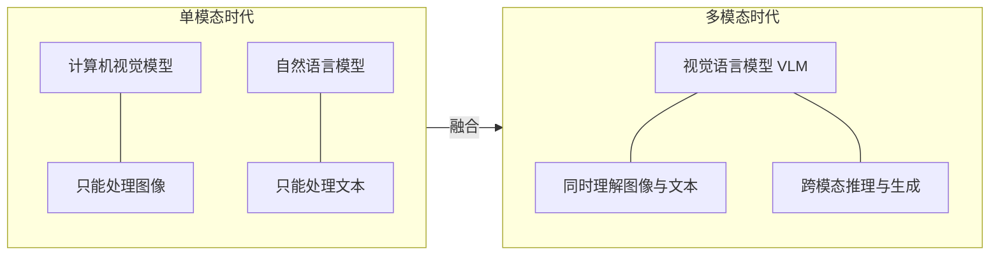

要构建一个有效的 VLM，我们首先需要回答一个根本性问题：视觉信息和语言信息处于完全不同的语义空间，如何让它们"对话"？这就引出了本章的第一个核心主题——模态对齐与融合。

---

## 2.2 核心挑战：模态对齐与融合

### 2.2.1 问题的本质

视觉信息以像素和特征图的形式存在，语言信息以 token（词元，文本的最小处理单元）和嵌入向量（embedding）的形式存在。它们天然处于不同的**语义空间**（semantic space），就像两个人分别说中文和英文——虽然都在表达意思，但彼此无法直接理解。

要让模型同时处理这两种信息，需要解决两个层面的问题：

1. **对齐（Alignment）**：建立两种模态之间的语义对应关系，让"一只猫的图像"和"猫"这个词在某个共享空间中彼此靠近
2. **融合（Fusion）**：在推理时有效整合两种模态的信息，让模型能够综合视觉和语言线索做出判断

### 2.2.2 对齐方法分类

根据对齐的实现方式，可以将现有方法分为三大类：

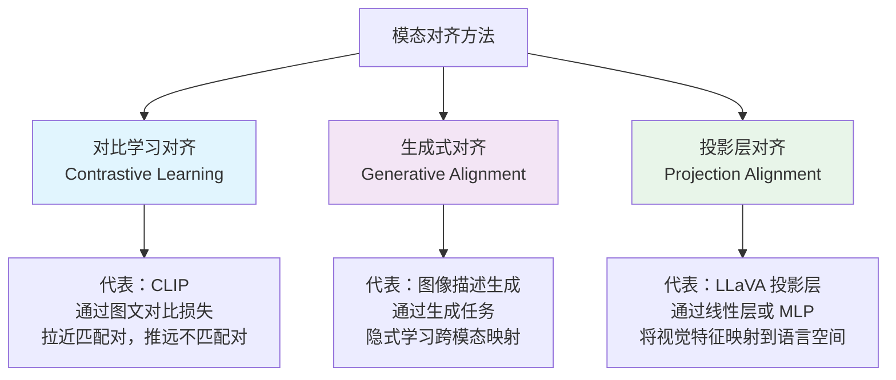

- **对比学习对齐**：通过构造正负样本对，让匹配的图文对在嵌入空间中距离更近，不匹配的更远。CLIP 是这一方向的代表。
- **生成式对齐**：通过让模型完成跨模态生成任务（如根据图像生成文本描述），隐式地学习两种模态之间的映射关系。
- **投影层对齐**：使用一个可训练的投影层（如线性层或多层感知机 MLP），将一种模态的特征直接映射到另一种模态的空间中。LLaVA 采用的就是这种方法。

### 2.2.3 融合方式分类

对齐解决了"两种模态如何对应"的问题，融合则解决"对应之后如何协同工作"的问题。根据融合发生的位置，可以分为三种方式：

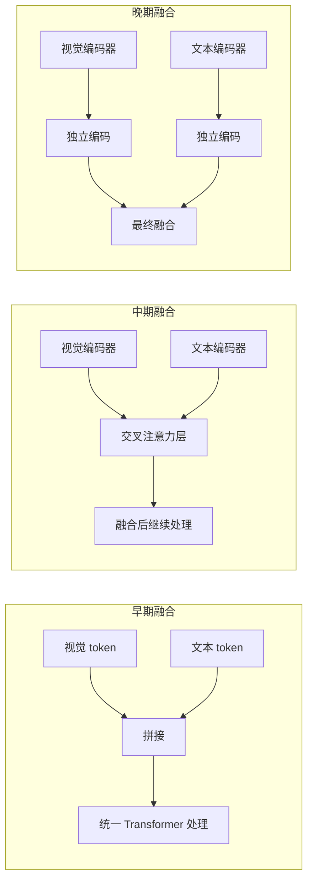

| 融合方式 | 描述 | 融合深度 | 代表模型 |
|---------|------|---------|---------|
| **早期融合** | 在输入层将视觉和文本 token 直接拼接，送入同一个模型处理 | 深 | Flamingo |
| **中期融合** | 各模态先独立编码，再通过交叉注意力层（Cross-Attention）注入视觉信息 | 中 | Qwen-VL, LLaVA-1.5 |
| **晚期融合** | 各模态完全独立编码，仅在最后阶段进行融合（如计算相似度） | 浅 | CLIP |

> **过渡说明**：理解了对齐与融合的基本概念后，一个自然的问题是——如何量化两种模态之间的"接近程度"？这就需要引入相似度度量的数学工具。

---

## 2.3 相似度度量：连接视觉与语言的数学基础

在多模态模型中，图像和文本分别被编码为嵌入向量（embedding vector）。设图像嵌入为 $I \in \mathbb{R}^d$，文本嵌入为 $T \in \mathbb{R}^d$，其中 $d$ 为嵌入维度，$\mathbb{R}^d$ 表示 $d$ 维实数向量空间。如何衡量这两个向量之间的"相似程度"，是多模态对齐的数学基础。

### 2.3.1 余弦相似度（Cosine Similarity）

余弦相似度是多模态领域最常用的度量方法，CLIP 模型正是基于此构建的：

$$\text{cos\_sim}(I, T) = \frac{I \cdot T}{\|I\| \cdot \|T\|} = \frac{\sum_{i=1}^{d} I_i T_i}{\sqrt{\sum_{i=1}^{d} I_i^2} \cdot \sqrt{\sum_{i=1}^{d} T_i^2}}$$

**符号解释**：
- $I \cdot T$：向量 $I$ 和 $T$ 的内积（点积）
- $\|I\|$：向量 $I$ 的 L2 范数（欧几里得长度），即 $\sqrt{\sum_i I_i^2}$
- $I_i, T_i$：向量的第 $i$ 个分量

**核心特性**：
- 值域为 $[-1, 1]$，其中 $1$ 表示方向完全相同，$-1$ 表示方向完全相反，$0$ 表示正交
- 对向量幅度不敏感，只关注方向——这意味着即使两种模态的嵌入幅度差异很大，也不会影响相似度计算

### 2.3.2 点积（Dot Product）

$$\text{dot}(I, T) = I \cdot T = \sum_{i=1}^{d} I_i T_i$$

**核心特性**：
- 值域为 $(-\infty, +\infty)$
- 受向量幅度影响：幅度大的向量点积也大
- 当向量已经过 L2 归一化（即 $\|I\| = \|T\| = 1$）时，点积等价于余弦相似度

### 2.3.3 欧氏距离（Euclidean Distance）

$$d(I, T) = \|I - T\|_2 = \sqrt{\sum_{i=1}^{d} (I_i - T_i)^2}$$

**核心特性**：
- 值域为 $[0, +\infty)$，$0$ 表示两个向量完全相同
- 同时考虑方向和幅度
- 在归一化空间中，欧氏距离与余弦相似度存在单调关系：余弦相似度越高，欧氏距离越小

### 2.3.4 方法对比

| 度量方法 | 值域 | 对幅度敏感 | 计算复杂度 | 典型应用场景 |
|---------|------|-----------|-----------|------------|
| 余弦相似度 | $[-1, 1]$ | 否 | $O(d)$ | 图文检索、语义匹配 |
| 点积 | $(-\infty, +\infty)$ | 是 | $O(d)$ | 排序、推荐系统 |
| 欧氏距离 | $[0, +\infty)$ | 是 | $O(d)$ | 聚类分析 |

### 2.3.5 为什么 CLIP 选择余弦相似度

CLIP 选择余弦相似度作为核心度量，背后有深刻的设计考量：

1. **归一化空间**：CLIP 在训练时对所有嵌入做 L2 归一化，此时余弦相似度等价于点积，计算高效
2. **尺度不变性**：视觉编码器和文本编码器输出的嵌入幅度可能差异很大，余弦相似度天然消除了这种差异
3. **概率解释**：余弦相似度经过 softmax 变换后，可以自然地解释为匹配概率
4. **温度参数**：配合可学习的温度参数 $\tau$，可以灵活控制相似度分布的尖锐程度

> **过渡说明**：有了相似度度量的数学工具，我们就可以深入理解 CLIP 是如何利用对比学习实现大规模视觉-语言对齐的。

---

## 2.4 CLIP：对比学习的里程碑

**CLIP（Contrastive Language-Image Pre-training）** 是 OpenAI 于 2021 年提出的视觉-语言预训练模型，它通过对比学习在 4 亿个图文对上训练，首次实现了大规模、通用的视觉-语言对齐。CLIP 的成功深刻影响了后续几乎所有 VLM 的设计。

### 2.4.1 架构设计

CLIP 采用**双塔架构**（dual-encoder architecture）：图像和文本分别由独立的编码器处理，最终在共享的嵌入空间中计算相似度。

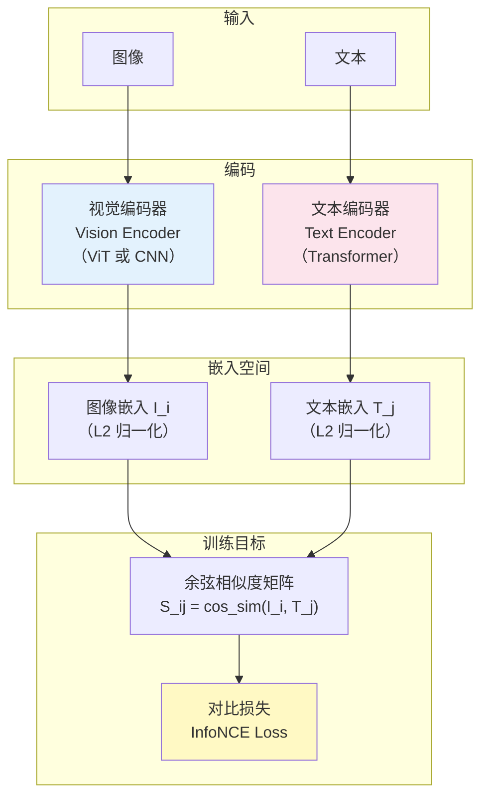

其中：
- **视觉编码器**可以是 ViT（Vision Transformer，视觉 Transformer）或 CNN（卷积神经网络），负责将图像编码为固定维度的嵌入向量
- **文本编码器**是一个 Transformer，负责将文本编码为同维度的嵌入向量
- 两个编码器的输出都经过 L2 归一化，映射到同一个共享嵌入空间

### 2.4.2 对比学习目标

CLIP 的训练目标基于 **InfoNCE 损失**（Information Noise-Contrastive Estimation，信息噪声对比估计损失）。给定一个 batch 中的 $N$ 个图文对，首先计算所有图文组合的余弦相似度矩阵：

$$S_{ij} = \frac{I_i \cdot T_j}{\|I_i\|\|T_j\|}$$

**符号解释**：
- $S_{ij}$：第 $i$ 张图像与第 $j$ 条文本之间的余弦相似度
- $I_i$：第 $i$ 张图像的嵌入向量
- $T_j$：第 $j$ 条文本的嵌入向量

然后优化以下对比损失：

$$\mathcal{L} = -\frac{1}{2N}\sum_{i=1}^{N}\left(\log\frac{e^{S_{ii}/\tau}}{\sum_{j=1}^{N} e^{S_{ij}/\tau}} + \log\frac{e^{S_{ii}/\tau}}{\sum_{j=1}^{N} e^{S_{ji}/\tau}}\right)$$

**符号解释**：
- $\mathcal{L}$：总损失函数
- $\tau$：可学习的温度参数（temperature），控制 softmax 分布的尖锐程度。$\tau$ 越小，分布越尖锐，模型对正负样本的区分越敏感
- $S_{ii}$：对角线元素，即第 $i$ 个匹配图文对的相似度（正样本）
- $S_{ij}$（$i \neq j$）：非对角线元素，即不匹配的图文对的相似度（负样本）
- 第一项：从图像视角看，让每张图像与其匹配文本的相似度最高（image-to-text）
- 第二项：从文本视角看，让每条文本与其匹配图像的相似度最高（text-to-image）

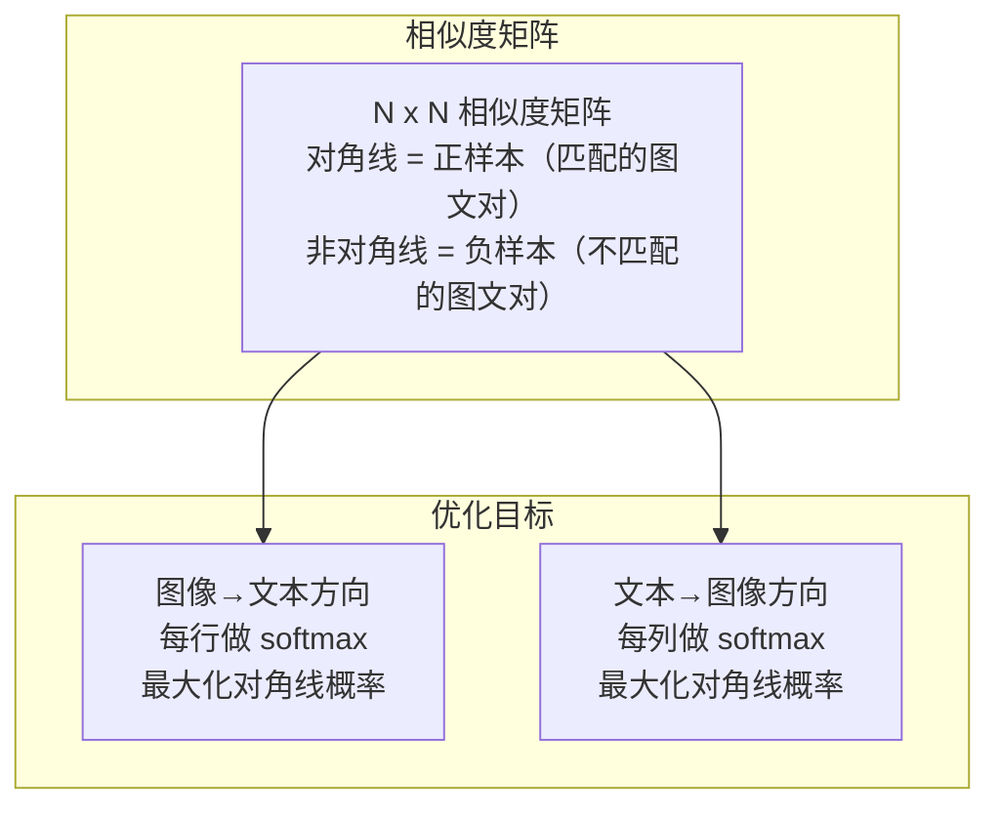

### 2.4.3 关键设计要点

1. **对角线为正样本**：在 $N \times N$ 的相似度矩阵中，对角线位置 $S_{ii}$ 对应真正匹配的图文对，其余 $N^2 - N$ 个位置都是负样本
2. **双向对比**：损失函数同时从图像到文本和从文本到图像两个方向进行对比，确保对齐的对称性
3. **大规模训练**：CLIP 在 4 亿个从互联网收集的图文对上训练，使模型学到了通用的视觉-语言对齐能力
4. **零样本迁移**：训练完成后，CLIP 可以通过计算图像与任意文本描述的相似度，实现零样本（zero-shot）图像分类，无需针对特定任务微调

> **过渡说明**：CLIP 实现了强大的视觉-语言对齐，但它本质上是一个"理解"模型——只能判断图文是否匹配，不能生成文本。如何在 CLIP 的对齐能力基础上，赋予模型"看图说话"的生成能力？这就催生了 LLaVA、MiniGPT-4 等生成式 VLM 架构。

---

## 2.5 从 CLIP 到生成式 VLM：LLaVA 与 MiniGPT-4

CLIP 证明了对比学习可以实现高质量的视觉-语言对齐，但它只能做匹配和检索，无法生成自然语言回答。研究者们自然想到：能否将 CLIP 的视觉理解能力与大语言模型（LLM, Large Language Model）的生成能力结合起来？

**LLaVA（Large Language and Vision Assistant）** 和 **MiniGPT-4** 正是这一思路的代表作。它们的核心设计理念是：**复用已有的强大组件（预训练视觉编码器 + 预训练 LLM），通过一个轻量级的连接模块将两者桥接起来**。

### 2.5.1 LLaVA 架构

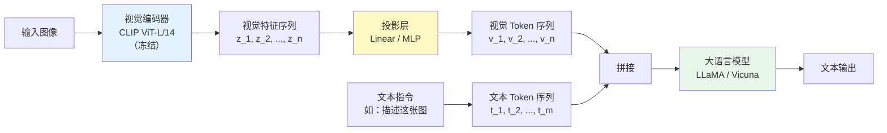

**架构解读**：
1. **视觉编码器**：使用 CLIP 预训练的 ViT-L/14（Vision Transformer，Large 版本，patch 大小 14x14），将图像编码为一系列视觉特征向量
2. **投影层**：将视觉特征从视觉编码器的特征空间映射到 LLM 的嵌入空间
3. **大语言模型**：接收拼接后的视觉 token 和文本 token，自回归地生成文本回答

### 2.5.2 投影层的数学原理

投影层是连接视觉编码器和 LLM 的关键桥梁。其作用是将视觉编码器输出的特征映射到 LLM 能够理解的嵌入空间：

$$v_i = W_{proj} \cdot z_i + b_{proj}$$

**符号解释**：
- $z_i \in \mathbb{R}^{d_v}$：视觉编码器输出的第 $i$ 个 patch 特征，$d_v$ 为视觉特征维度
- $W_{proj} \in \mathbb{R}^{d_l \times d_v}$：投影权重矩阵，$d_l$ 为 LLM 的嵌入维度
- $b_{proj} \in \mathbb{R}^{d_l}$：偏置向量
- $v_i \in \mathbb{R}^{d_l}$：投影后的视觉 token，与文本 token 处于同一空间

投影后的视觉 token $v_1, v_2, \ldots, v_n$ 与文本 token $t_1, t_2, \ldots, t_m$ 拼接后，一起输入 LLM 进行处理。从 LLM 的视角看，视觉 token 和文本 token 没有本质区别——它们都是同一嵌入空间中的向量序列。

### 2.5.3 Q-Former：BLIP-2 的精巧设计

MiniGPT-4 采用了来自 **BLIP-2** 的 **Q-Former（Querying Transformer）** 作为连接模块，这是一种比简单投影层更精巧的设计。

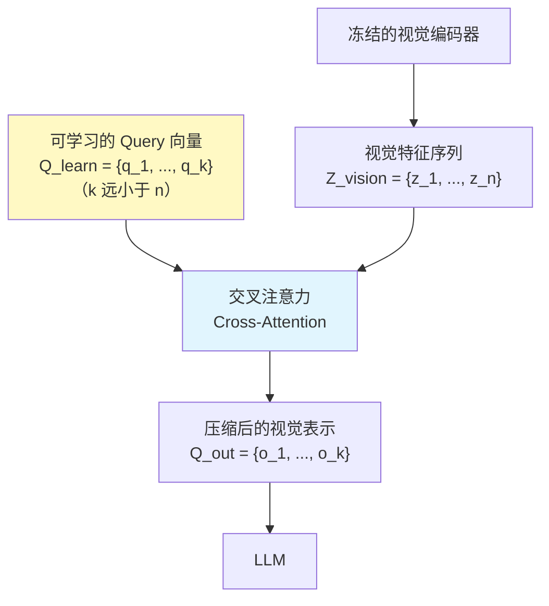

Q-Former 的核心公式：

$$Q_{out} = \text{CrossAttention}(Q_{learn},\ K=Z_{vision},\ V=Z_{vision})$$

**符号解释**：
- $Q_{learn} \in \mathbb{R}^{k \times d}$：一组可学习的 query 向量，$k$ 为 query 数量（通常远小于视觉 token 数量 $n$）
- $Z_{vision} \in \mathbb{R}^{n \times d_v}$：冻结视觉编码器输出的完整视觉特征
- $K, V$：交叉注意力中的 Key 和 Value，均来自视觉特征
- $Q_{out} \in \mathbb{R}^{k \times d}$：经过注意力加权后的输出，包含从视觉特征中提取的最相关信息

**Q-Former 的核心优势**：通过固定数量的 query 向量，可以精确控制输出的视觉 token 数量（$k$ 个），从而大幅减少输入 LLM 的序列长度，降低计算开销。

### 2.5.4 LLaVA 与 MiniGPT-4 对比

| 组件 | LLaVA | MiniGPT-4 |
|------|-------|-----------|
| 视觉编码器 | CLIP ViT-L/14 | EVA-CLIP ViT-G（更大的视觉编码器） |
| 连接模块 | 线性层 / MLP（简单直接） | Q-Former（来自 BLIP-2，更精巧） |
| 大语言模型 | Vicuna | Vicuna |
| 训练策略 | 2 阶段：预对齐 + 指令微调 | 2 阶段：预训练 + 微调 |
| 设计哲学 | 极简主义，证明简单投影即可有效 | 利用 Q-Former 实现更高效的视觉信息压缩 |

> **过渡说明**：LLaVA 和 MiniGPT-4 的架构设计解决了"如何连接视觉和语言"的问题，但仅仅连接还不够——模型还需要学会"听懂指令"。这就引出了视觉指令微调这一关键训练策略。

---

## 2.6 视觉指令微调：让模型听懂指令

### 2.6.1 什么是视觉指令微调

**视觉指令微调（Visual Instruction Tuning）** 是指使用视觉-语言配对的指令数据对 VLM 进行微调，使其学会根据视觉输入执行语言指令。这一步骤是将"能看图"的模型转变为"能按要求看图回答"的模型的关键。

### 2.6.2 为什么视觉指令微调至关重要

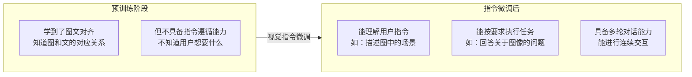

具体来说，视觉指令微调解决了三个关键问题：

1. **从对齐到遵循**：预训练阶段只学到了图文对齐（知道图和文的对应关系），但不具备指令遵循能力（不知道用户想让它做什么）
2. **从描述到执行**：指令微调将模型从"描述图像"转向"按指令执行任务"，如回答问题、进行推理、提供建议等
3. **对话格式训练**：通过对话格式的训练数据，使模型具备多轮交互能力

### 2.6.3 指令数据的构造方法

高质量的指令数据是视觉指令微调成功的关键。LLaVA 提出了一种创新的数据构造方法：利用 GPT-4 根据图像的文本描述（caption）自动生成指令-回答对。

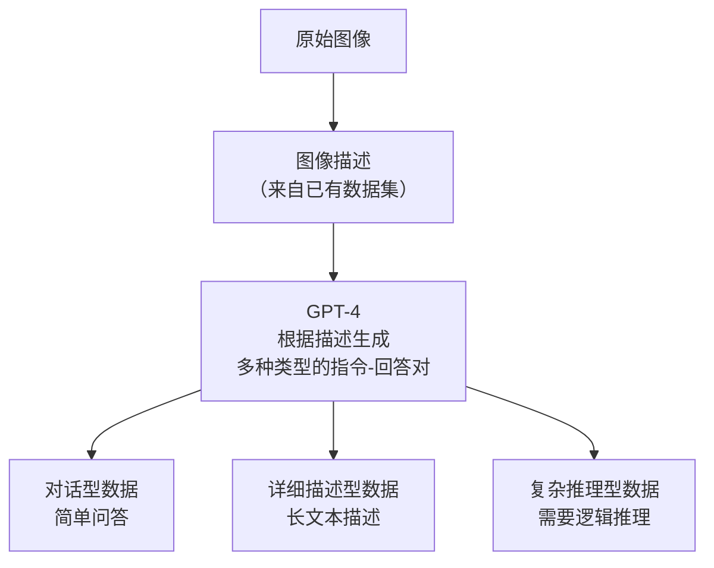

生成的指令数据涵盖三种类型：

| 指令类型 | 示例问题 | 示例回答 | 训练目标 |
|---------|---------|---------|---------|
| **对话** | "这张图里有什么？" | "图中有一只猫在沙发上" | 基础视觉理解 |
| **详细描述** | "详细描述这张图" | 包含场景、物体、颜色、位置等的长描述 | 细粒度视觉感知 |
| **复杂推理** | "为什么这个人要打伞？" | 基于视觉线索的推理过程 | 视觉逻辑推理 |

> **过渡说明**：到目前为止，我们深入了解了 LLaVA 这一种架构范式。但 VLM 的架构设计远不止一种——不同的设计选择带来不同的权衡。接下来，我们将从更高的视角审视 VLM 的三种主要架构范式。

---

## 2.7 VLM 架构范式总览

经过前面几节的学习，我们已经了解了 CLIP（晚期融合）和 LLaVA（投影连接）两种具体架构。现在让我们退后一步，从全局视角审视 VLM 的三种主要架构范式，理解它们各自的设计哲学和适用场景。

### 2.7.1 三种范式的架构对比

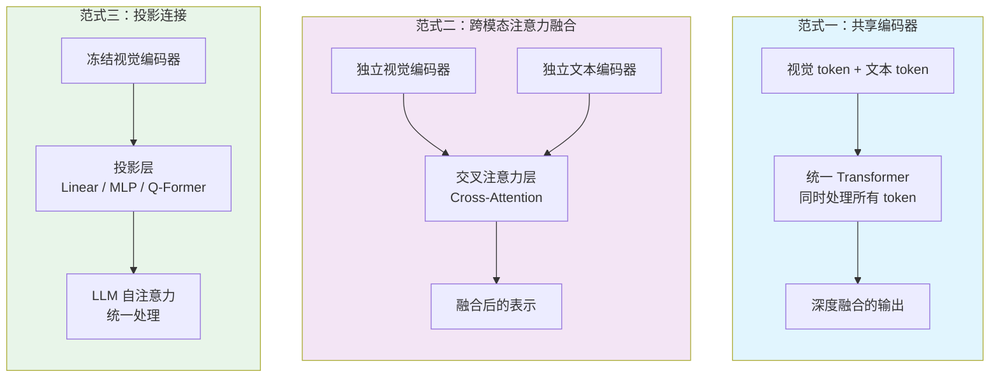

### 2.7.2 范式详解与对比

| 范式 | 代表模型 | 核心思想 | 优点 | 缺点 |
|------|---------|---------|------|------|
| **共享编码器** | Flamingo, Emu | 将视觉和文本 token 送入同一个 Transformer，从最底层开始交互 | 深度融合，模态交互最充分 | 训练成本极高，视觉能力可能受限于统一架构 |
| **跨模态注意力** | Qwen-VL, BLIP-2 | 各模态先独立编码，再通过专门的交叉注意力层注入视觉信息 | 灵活控制视觉信息的注入方式和位置 | 架构复杂，推理速度较慢 |
| **投影连接** | LLaVA | 冻结视觉编码器，通过轻量投影层将视觉特征映射到 LLM 空间 | 简单高效，最大程度复用预训练 LLM | 融合较浅，视觉信息在传递过程中可能损失 |

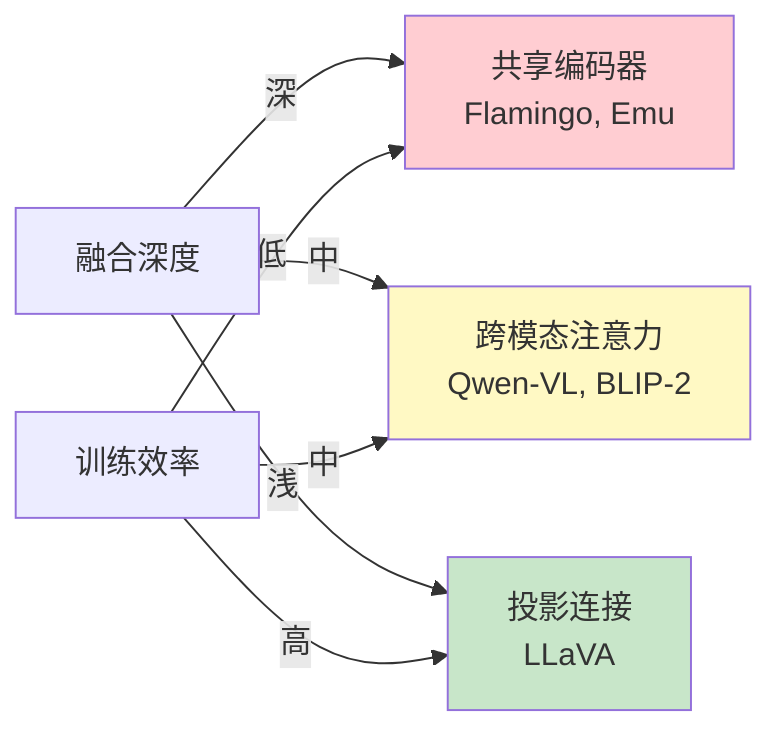

### 2.7.3 如何选择架构范式

选择哪种范式取决于具体的应用需求和资源约束：

- **追求极致性能**：选择共享编码器或跨模态注意力，牺牲效率换取更深的融合
- **追求训练效率**：选择投影连接，最大程度复用已有的预训练模型
- **追求灵活性**：选择跨模态注意力，可以灵活控制视觉信息的注入位置和方式

> **过渡说明**：无论选择哪种架构范式，当输入图像的分辨率很高时，都会面临一个共同的挑战——计算量爆炸和序列长度超限。接下来我们讨论高分辨率图像处理的专门技术。

---

## 2.8 高分辨率图像处理

### 2.8.1 为什么高分辨率是个难题

大多数视觉编码器（如 ViT）在设计时针对固定分辨率（如 $224 \times 224$）。当输入图像分辨率提高时，会带来三重挑战：

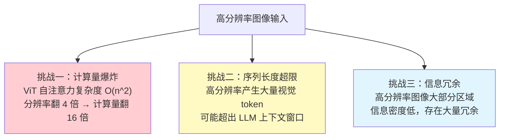

**计算量问题的量化分析**：ViT 的自注意力机制复杂度为 $O(n^2)$，其中 $n$ 为 patch（图像块）数量。对于 patch 大小为 $14 \times 14$ 的 ViT：
- $224 \times 224$ 图像：$n = 16 \times 16 = 256$ 个 patch
- $448 \times 448$ 图像：$n = 32 \times 32 = 1024$ 个 patch
- 计算量增长：$(1024/256)^2 = 16$ 倍

### 2.8.2 四种解决方案

| 方法 | 核心原理 | 代表模型 |
|------|---------|---------|
| **动态分辨率** | 按图像实际长宽比自适应切分，避免强制缩放导致的信息损失 | Qwen-VL, InternVL |
| **切片策略** | 将大图切成多个固定大小的子图，分别编码后拼接 | LLaVA-UHD, UForm |
| **Token 压缩** | 通过特定机制减少视觉 token 数量，保留关键信息 | Q-Former, Pixel-Shuffle |
| **多尺度编码** | 在不同分辨率下提取不同粒度的特征，综合利用 | Vitron |

### 2.8.3 动态分辨率详解（以 Qwen-VL 为例）


动态分辨率的关键优势在于：它尊重图像的原始长宽比，避免了强制缩放到正方形带来的变形和信息损失。

### 2.8.4 Token 压缩的数学表达

Token 压缩通过减少视觉 token 的数量来降低 LLM 的输入序列长度：

$$N_{token}^{out} = \frac{N_{token}^{in}}{r^2}$$

**符号解释**：
- $N_{token}^{in}$：压缩前的视觉 token 数量
- $N_{token}^{out}$：压缩后的视觉 token 数量
- $r$：压缩比（compression ratio）

例如，当 $r = 2$ 时，token 数量减少为原来的 $1/4$。常见的实现方式包括：
- **Pixel-Shuffle**：将空间上相邻的 token 重排合并
- **Q-Former**：通过可学习的 query 向量从大量视觉 token 中提取固定数量的压缩表示（详见 2.5.3 节）

> **过渡说明**：高分辨率处理让模型能够看清图像中的细节。但仅仅"看清"还不够——在很多应用场景中，我们需要模型能够精确指出"某个物体在图像中的哪个位置"。这就是视觉定位（Grounding）要解决的问题。

---

## 2.9 视觉定位（Grounding）

### 2.9.1 什么是视觉定位

**视觉定位（Grounding）** 是指将文本描述（如"左边的红色汽车"）精确定位到图像中的对应区域，通常以边界框（bounding box）坐标的形式输出。它是 VLM 从"理解图像内容"迈向"精确定位图像内容"的关键能力。

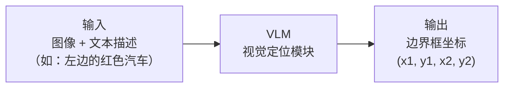

### 2.9.2 三种实现方式

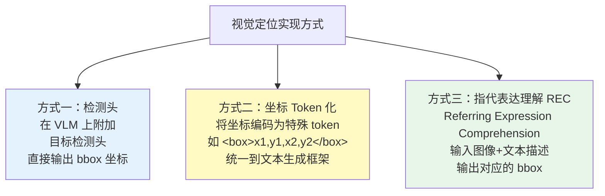

其中，**坐标 Token 化**是当前最受欢迎的方式，因为它将定位任务统一到了文本生成框架中——模型不需要额外的检测头，只需要像生成普通文本一样"说出"坐标即可。

### 2.9.3 评估指标

| 指标 | 公式 | 含义 |
|------|------|------|
| **IoU**（Intersection over Union，交并比） | $\text{IoU} = \frac{\|B_p \cap B_{gt}\|}{\|B_p \cup B_{gt}\|}$ | 预测框 $B_p$ 与真值框 $B_{gt}$ 的重叠程度，值域 $[0, 1]$，越大越好 |
| **Precision@0.5** | IoU > 0.5 的样本比例 | 在 IoU 阈值为 0.5 时的定位准确率 |
| **Pointing Game** | 预测点是否落在目标区域内 | 粗粒度定位评估，只关注预测的中心点 |

**符号解释**：
- $B_p$：模型预测的边界框（predicted bounding box）
- $B_{gt}$：人工标注的真值边界框（ground truth bounding box）
- $\cap$：交集运算
- $\cup$：并集运算

### 2.9.4 代表模型

| 模型 | 定位方式 | 特点 |
|------|---------|------|
| **Kosmos-2** | 将坐标作为文本 token 生成 | 首个将定位能力统一到语言生成框架的模型 |
| **Qwen-VL** | 支持 Grounding 能力 | 多功能 VLM，同时支持理解和定位 |
| **Shikra** | 对话式视觉定位 | 通过自然语言对话实现交互式定位 |

> **过渡说明**：到目前为止，我们讨论的都是静态图像的处理。但现实世界中，大量信息以视频的形式存在——视频不仅包含空间信息，还包含时间维度的动态变化。如何将 VLM 扩展到视频领域？

---

## 2.10 从图像到视频：时序多模态建模

### 2.10.1 视频与静态图像的本质区别

视频可以看作是按时间顺序排列的图像帧序列，但它带来的挑战远不止"处理更多图像"这么简单：

| 维度 | 静态图像 | 视频 |
|------|---------|------|
| **输入规模** | 单帧 | 多帧（数十到数千帧） |
| **时序信息** | 无 | 需要建模时间顺序和动态变化 |
| **计算量** | 较低 | 帧数 $\times$ 单帧计算量 |
| **信息冗余** | 较低 | 相邻帧高度冗余（通常只有微小变化） |

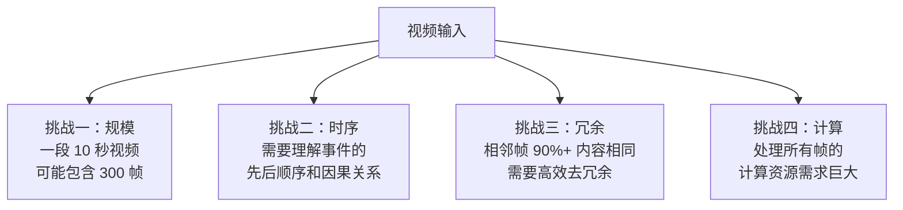

### 2.10.2 时序信息的四种表征方法

#### 方法一：均匀采样

最简单直接的方法——从视频中均匀抽取 $T$ 帧，各帧独立编码后拼接：

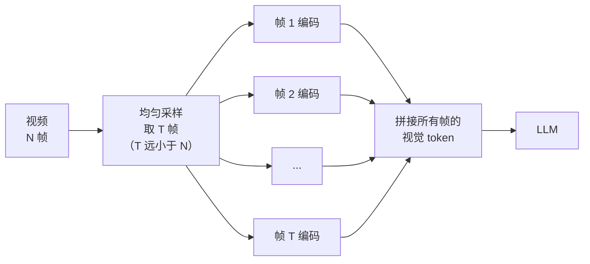

#### 方法二：时序聚合

对帧级特征进行加权平均或注意力池化（attention pooling），将多帧信息压缩为更紧凑的表示。

#### 方法三：时序位置编码

在视觉 token 上加入时间维度的位置编码，让模型能够区分不同时刻的视觉信息：

$$PE_{frame}(t, p) = PE_{temporal}(t) + PE_{spatial}(p)$$

**符号解释**：
- $PE_{frame}(t, p)$：第 $t$ 帧、第 $p$ 个空间位置的完整位置编码
- $PE_{temporal}(t)$：时间维度的位置编码，编码"这是第几帧"的信息
- $PE_{spatial}(p)$：空间维度的位置编码，编码"这是图像中的哪个位置"的信息
- 两者相加，使每个视觉 token 同时携带时间和空间位置信息

#### 方法四：时空注意力

在 Transformer 中同时建模空间注意力（帧内各位置之间的关系）和时间注意力（不同帧之间的关系），实现最完整的时空建模。

### 2.10.3 代表模型

| 模型 | 核心方法 | 特点 |
|------|---------|------|
| **Video-LLaVA** | 统一图像和视频编码 | 用同一架构处理图像和视频，简洁高效 |
| **LLaMA-VID** | 每帧压缩为 1 个 token | 极致的 token 压缩，支持长视频 |
| **Qwen-VL** | 支持视频输入，动态分辨率 | 多功能模型，灵活处理不同长度的视频 |

> **过渡说明**：随着 VLM 能力的不断增强，一个不可回避的问题浮出水面——模型有时会"看到"图像中并不存在的东西。这就是 VLM 的幻觉问题，它直接影响模型的可靠性和可信度。

---

## 2.11 VLM 的幻觉问题与缓解

### 2.11.1 什么是 VLM 幻觉

**幻觉（Hallucination）** 是指模型生成的内容与实际输入不符的现象。在纯文本 LLM 中，幻觉表现为编造不存在的事实；在 VLM 中，幻觉则有其独特的表现形式。

### 2.11.2 VLM 幻觉与纯文本 LLM 幻觉的区别

| 维度 | 纯文本 LLM | VLM |
|------|-----------|-----|
| **来源** | 知识错误或凭空编造 | 视觉理解错误 + 知识编造（双重来源） |
| **典型表现** | 编造不存在的事实、引用 | 描述图中不存在的物体或属性 |
| **检测难度** | 需要外部知识库验证 | 可通过对照原始图像直接验证 |

### 2.11.3 VLM 特有的三种幻觉类型

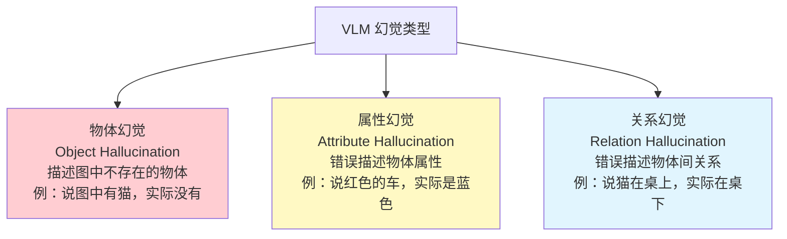

### 2.11.4 幻觉的缓解方法

针对 VLM 幻觉，研究者从四个层面提出了缓解策略：

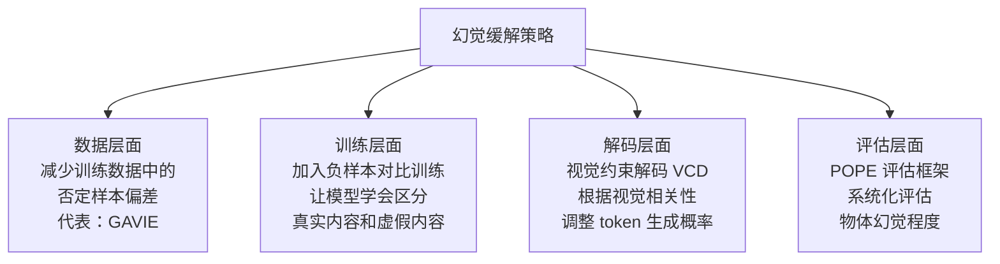

各层面方法详解：

1. **数据层面**：训练数据中往往存在偏差——模型倾向于生成训练集中高频出现的物体。**GAVIE**（GPT-4-Assisted Visual Instruction Evaluation）通过改善数据分布来减少这种偏差。

2. **训练层面**：在训练过程中引入负样本对比，让模型不仅学会"图中有什么"，还学会"图中没有什么"。

3. **解码层面**：**VCD（Visual Contrastive Decoding，视觉对比解码）** 在生成每个 token 时，根据该 token 与视觉输入的相关性调整其生成概率，抑制与图像内容不符的 token。

4. **评估层面**：**POPE（Polling-based Object Probing Evaluation，基于轮询的物体探测评估）** 提供了一个标准化的评估框架，通过向模型提问"图中是否有 X？"来系统化地评估物体幻觉的严重程度。

> **过渡说明**：幻觉问题的缓解需要更好的训练策略。近年来，强化学习方法（特别是 GRPO）在纯文本 LLM 上取得了显著成功。一个自然的问题是：能否将这些方法迁移到多模态场景，进一步提升 VLM 的推理能力和可靠性？

---

## 2.12 多模态强化学习：GRPO 与 VLM 的结合

### 2.12.1 背景与动机

**GRPO（Group Relative Policy Optimization，组相对策略优化）** 是一种强化学习方法，在纯文本推理任务上取得了显著成效（如 DeepSeek-R1）。其核心思想是：对同一个问题生成一组回答，通过组内对比来优化策略。

将 GRPO 迁移到多模态场景的动机很直接：让模型通过组内对比学习"看图推理"的能力——不仅要理解图像内容，还要基于视觉信息进行逻辑推理。

### 2.12.2 多模态 GRPO 的核心挑战

将 GRPO 从纯文本扩展到多模态，面临四个额外挑战：

| 挑战 | 描述 |
|------|------|
| **奖励设计** | 多模态回答的质量评估比纯文本更复杂，需要同时考虑视觉准确性和语言质量 |
| **采样成本** | 每个图文对需生成 $G$ 个回答，视觉编码增加了每次推理的开销 |
| **长度偏差** | 多模态回答天然更长（需要描述图像细节），加剧了 GRPO 的长度偏差问题 |
| **评估标准** | 视觉准确性（是否正确描述图中内容）和语言质量（是否流畅有用）需要分别评估 |

### 2.12.3 三种可行方案

#### 方案一：多模态 RLVR（基于规则验证的强化学习）

对于答案可验证的视觉任务，使用规则验证器直接判断回答的正确性：

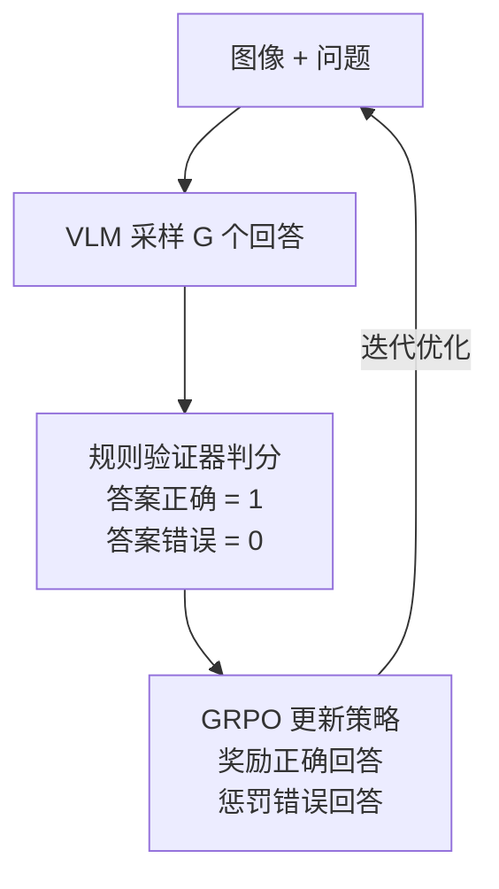

**适用任务**：
- **VQA**（Visual Question Answering，视觉问答）：答案可以与标准答案比对
- **图表推理**：数值结果可以验证
- **OCR**（Optical Character Recognition，光学字符识别）：识别的文本可以验证

#### 方案二：多模态奖励模型 + GRPO

训练一个专门的多模态奖励模型（Reward Model），同时评估视觉准确性和语言质量：

$$r(x_{img}, x_{txt}, y) = \alpha \cdot r_{visual}(x_{img}, y) + (1-\alpha) \cdot r_{language}(x_{txt}, y)$$

**符号解释**：
- $r(\cdot)$：总奖励分数
- $x_{img}$：输入图像
- $x_{txt}$：输入文本（问题或指令）
- $y$：模型生成的回答
- $r_{visual}(x_{img}, y)$：视觉准确性奖励——评估回答是否正确描述/利用了图像信息
- $r_{language}(x_{txt}, y)$：语言质量奖励——评估语言的流畅性、有用性和安全性
- $\alpha \in [0, 1]$：平衡系数，控制两种奖励的权重

#### 方案三：分阶段训练

```mermaid
flowchart LR
    S1["阶段一<br/>SFT<br/>多模态指令微调<br/>建立基础能力"] --> S2["阶段二<br/>GRPO + RLVR<br/>可验证视觉推理<br/>提升推理能力"]
    S2 --> S3["阶段三<br/>GRPO + RM<br/>通用多模态对齐<br/>提升整体质量"]

    style S1 fill:#e8f5e9
    style S2 fill:#e3f2fd
    style S3 fill:#f3e5f5
```

这种渐进式策略的逻辑是：
1. 先通过 SFT（Supervised Fine-Tuning，监督微调）建立基础的多模态理解和生成能力
2. 再通过 RLVR 在可验证任务上提升推理能力（因为有明确的对错标准）
3. 最后通过奖励模型做通用偏好对齐（处理没有标准答案的开放任务）

### 2.12.4 关键设计决策

| 设计决策 | 可选方案 | 建议 |
|---------|---------|------|
| 视觉编码器是否更新 | 冻结 / 微调 | GRPO 阶段建议冻结，避免视觉能力退化 |
| 组大小 $G$ | 4 / 8 / 16 | 视觉推理任务建议 $G=16$，提供更丰富的对比信号 |
| 奖励信号来源 | RLVR / RM / 混合 | 可验证任务用 RLVR，开放任务用 RM |
| KL 散度参考模型 | SFT 模型 | 使用多模态 SFT 模型作为参考，防止策略偏移过大 |
| 长度惩罚 | 有 / 无 | 必须加入，多模态回答的长度偏差比纯文本更严重 |

### 2.12.5 前沿进展

| 工作 | 方法 | 效果 |
|------|------|------|
| **R1-VL** | 视觉推理 + GRPO | 数学图表推理能力显著提升 |
| **Open-R1-Video** | 视频场景下的 GRPO | 视频理解能力提升 |
| **Visual-RFT** | 视觉定位 + GRPO | Grounding 精度提升 |

**总结**：多模态 + GRPO 是当前前沿方向，核心思路与纯文本 GRPO 一致，但需要额外解决**视觉奖励设计**和**多模态长度偏差**两个关键问题。最可行的路径是先在可验证视觉任务上验证效果，再逐步扩展到通用多模态对齐。

> **过渡说明**：GRPO 让 VLM 的推理能力更强，但 VLM 的输出始终是文本。如果我们希望模型不仅能"说"，还能"做"——比如控制机器人执行物理动作——就需要引入一个新的维度：动作输出。这就是 VLA 模型的核心思想。

---

## 2.13 VLA：从理解到行动

### 2.13.1 什么是 VLA

**VLA（Vision-Language-Action Model，视觉-语言-动作模型）** 是在 VLM 基础上增加了**动作输出**能力的模型。它实现了"看图理解 → 语言推理 → 执行动作"的完整闭环，是**具身智能**（Embodied Intelligence，让 AI 在物理世界中感知和行动的能力）的核心技术。

### 2.13.2 架构设计

```mermaid
flowchart LR
    V["视觉输入<br/>摄像头 / 图像"] --> VE["视觉编码器"]
    L["语言指令<br/>如：拿起红色杯子"] --> LE["语言编码器"]
    VE --> F["融合层<br/>（VLM 核心）"]
    LE --> F
    F --> AD["动作解码器<br/>输出动作参数<br/>（位置、力度、角度等）"]
    AD --> R["机器人执行"]

    style VE fill:#e3f2fd
    style LE fill:#fce4ec
    style F fill:#fff9c4
    style AD fill:#e8f5e9
```

### 2.13.3 VLA 与 VLM 的核心区别

| 维度 | VLM | VLA |
|------|-----|-----|
| **输入** | 图像 + 文本 | 图像 + 文本 |
| **输出** | 文本 | 文本 + 动作参数 |
| **应用场景** | 理解、描述、问答 | 具身智能、机器人控制 |
| **训练数据** | 图文对 | 图文对 + 动作轨迹数据 |
| **核心挑战** | 视觉理解 | 视觉理解 + 动作精确性 |

### 2.13.4 动作的三种表示方式

如何将连续的物理动作（如机械臂的运动轨迹）编码为模型可以处理的形式，是 VLA 的关键设计问题。

#### 方式一：Token 化

将连续动作离散化为 token，与文本 token 统一到自回归生成框架中：

$$a = \text{Tokenize}(a_{continuous}) \rightarrow \text{LLM 自回归生成}$$

**符号解释**：
- $a_{continuous}$：连续的动作参数（如关节角度、末端位置等）
- $\text{Tokenize}(\cdot)$：离散化函数，将连续值映射为离散 token
- 生成方式与文本 token 完全一致，利用 LLM 的自回归能力

#### 方式二：回归头

在 VLM 上附加一个 MLP（多层感知机）回归头，直接输出连续动作值：

$$a = \text{MLP}(h_{last})$$

**符号解释**：
- $h_{last}$：LLM 最后一层的隐藏状态
- $\text{MLP}(\cdot)$：多层感知机，将隐藏状态映射为连续动作参数
- 输出是连续值，精度更高，但无法利用 LLM 的自回归生成能力

#### 方式三：Flow Matching（流匹配）

使用流匹配方法生成动作轨迹，适合生成平滑、连续的动作序列：

$$a_t = a_0 + \int_0^t v_\theta(a_s, s)\, ds$$

**符号解释**：
- $a_t$：时刻 $t$ 的动作状态
- $a_0$：初始动作状态
- $v_\theta(\cdot)$：参数为 $\theta$ 的速度场网络，预测每个时刻的动作变化方向和速度
- 通过对速度场积分，生成从初始状态到目标状态的平滑轨迹

### 2.13.5 代表模型

| 模型 | 架构 | 动作空间 | 特点 |
|------|------|---------|------|
| **RT-2**（Google） | VLM + 动作 Token 化 | 机器人控制 | 将动作编码为 token，与文本统一生成 |
| **Octo** | Transformer + 动作头 | 机器人控制 | 开源通用策略模型 |
| **OpenVLA** | LLaVA + 动作解码 | 机器人控制 | 开源 VLA 实现 |
| **Pi0**（Physical Intelligence） | VLM + Flow Matching | 多种机器人 | 通用基础策略，支持多种机器人形态 |

### 2.13.6 训练数据

VLA 的训练需要三种不同层次的数据：

| 数据类型 | 来源 | 典型规模 | 作用 |
|---------|------|---------|------|
| 视觉-语言预训练数据 | 互联网图文对 | 十亿级 | 建立视觉-语言对齐基础 |
| 机器人轨迹数据 | 遥操作采集（人类操控机器人记录轨迹） | 百万级 | 学习动作执行能力 |
| 任务指令数据 | 人工标注 | 万级 | 学习指令理解和任务规划 |

### 2.13.7 关键挑战

```mermaid
flowchart TB
    VLA["VLA 关键挑战"] --> C1["动作精度<br/>机器人控制需要毫米级精度<br/>VLM 的离散化输出存在精度损失"]
    VLA --> C2["泛化性<br/>新环境、新物体、新任务下<br/>的零样本泛化能力"]
    VLA --> C3["实时性<br/>机器人控制需要低延迟<br/>（小于 100ms）<br/>VLM 推理速度受限"]
    VLA --> C4["安全约束<br/>动作输出必须满足<br/>物理安全约束<br/>避免碰撞和损坏"]
```

> **过渡说明**：VLA 代表了 VLM 向物理世界延伸的方向。事实上，VLM 的应用远不止于此——从文档理解到医学影像，从自动驾驶到 GUI 自动化，VLM 正在渗透到各个领域。

---

## 2.14 前沿应用全景

VLM 技术正在快速渗透到各个应用领域。下表汇总了当前最活跃的八大应用方向：

```mermaid
flowchart TB
    VLM["VLM 前沿应用"] --> A1["视觉定位与交互"]
    VLM --> A2["视频理解与生成"]
    VLM --> A3["3D 场景理解"]
    VLM --> A4["文档理解"]
    VLM --> A5["医学影像分析"]
    VLM --> A6["自动驾驶"]
    VLM --> A7["GUI Agent"]
    VLM --> A8["视觉创作"]

    A1 --> A1D["定位目标并执行操作<br/>SeeClick, ShowUI"]
    A2 --> A2D["长视频理解与视频生成<br/>Video-LLaVA, Sora"]
    A3 --> A3D["点云处理、3D 重建、导航<br/>LEO, 3D-LLM"]
    A4 --> A4D["OCR + 版面分析 + 语义理解<br/>Nougat, GOT-OCR"]
    A5 --> A5D["X 光/CT 报告自动生成<br/>LLaVA-Med, RadFM"]
    A6 --> A6D["场景理解与驾驶决策<br/>DriveVLM, AD-MLLM"]
    A7 --> A7D["截图理解与界面自动操作<br/>CogAgent, SeeClick"]
    A8 --> A8D["文生图、图生图、图像编辑<br/>DALL-E 3, SDXL"]
```

| 应用方向 | 核心任务 | 代表工作 | 技术要点 |
|---------|---------|---------|---------|
| **视觉定位与交互** | 定位目标物体并执行操作 | SeeClick, ShowUI | Grounding + 动作执行 |
| **视频理解与生成** | 长视频理解、视频内容生成 | Video-LLaVA, Sora | 时序建模 + 生成模型 |
| **3D 场景理解** | 点云处理、3D 重建、空间导航 | LEO, 3D-LLM | 3D 视觉编码 + 空间推理 |
| **文档理解** | OCR + 版面分析 + 语义理解 | Nougat, GOT-OCR | 高分辨率处理 + 结构化输出 |
| **医学影像分析** | X 光/CT 影像的自动报告生成 | LLaVA-Med, RadFM | 领域知识 + 精确描述 |
| **自动驾驶** | 驾驶场景理解与决策 | DriveVLM, AD-MLLM | 实时性 + 安全约束 |
| **GUI Agent** | 截图理解与界面自动操作 | CogAgent, SeeClick | 高分辨率 + Grounding + 动作 |
| **视觉创作** | 文生图、图生图、图像编辑 | DALL-E 3, SDXL | 生成模型 + 精确控制 |

---

## 2.15 本章小结

本章从多模态对齐与融合的基本概念出发，系统讲解了视觉语言模型的核心技术栈。以下是本章知识脉络的全景回顾：

```mermaid
flowchart TB
    START["核心问题<br/>视觉与语言如何对话"] --> ALIGN["模态对齐与融合<br/>（2.2 节）"]
    ALIGN --> MATH["相似度度量<br/>数学基础<br/>（2.3 节）"]
    MATH --> CLIP["CLIP<br/>对比学习对齐<br/>（2.4 节）"]
    CLIP --> GEN["生成式 VLM<br/>LLaVA / MiniGPT-4<br/>（2.5 节）"]
    GEN --> SFT["视觉指令微调<br/>（2.6 节）"]
    SFT --> ARCH["架构范式总览<br/>（2.7 节）"]
    ARCH --> HR["高分辨率处理<br/>（2.8 节）"]
    HR --> GND["视觉定位<br/>Grounding<br/>（2.9 节）"]
    GND --> VID["视频多模态<br/>（2.10 节）"]
    VID --> HALL["幻觉问题<br/>（2.11 节）"]
    HALL --> GRPO["多模态 GRPO<br/>（2.12 节）"]
    GRPO --> VLA["VLA 模型<br/>（2.13 节）"]
    VLA --> APP["前沿应用<br/>（2.14 节）"]

    style START fill:#ffcdd2
    style CLIP fill:#e3f2fd
    style GEN fill:#e8f5e9
    style VLA fill:#f3e5f5
```

**核心要点回顾**：

1. **对齐是基础**：视觉和语言处于不同语义空间，对比学习（CLIP）、投影层（LLaVA）、Q-Former（BLIP-2）是三种主要的对齐手段
2. **架构有权衡**：共享编码器融合最深但成本最高，投影连接最简单但融合较浅，跨模态注意力居中
3. **训练分阶段**：预训练建立对齐 → 指令微调赋予遵循能力 → 强化学习提升推理质量
4. **挑战在细节**：高分辨率处理、视频时序建模、幻觉缓解、动作精度等都是实际部署中的关键问题
5. **应用在拓展**：从图文理解到视频分析，从文档 OCR 到机器人控制，VLM 的能力边界正在不断扩展
