# 三、RLHF 面试真题

## 1. RLHF vs SFT：解决的核心问题

### SFT 的局限

SFT 通过监督学习让模型学会"模仿"人类回答，但：

1. **分布偏移**：模型自回归生成时，后续 token 的输入分布偏离训练时的分布（exposure bias）
2. **目标错配**：交叉熵损失 ≠ 人类偏好，模型可能学会"看起来像"但实际不好的回答
3. **缺乏对比**：SFT 只见过"好回答"，不知道"好"和"更好"之间的区别

### RLHF 解决的问题

| 问题 | SFT | RLHF |
|------|-----|------|
| 好坏区分 | 只学"好"的 | 学"更好"的（偏好对比） |
| 人类价值观对齐 | 间接 | 直接优化人类偏好 |
| 安全性 | 有限 | 可通过偏好数据引导 |

---

## 2. RLHF 三阶段流程

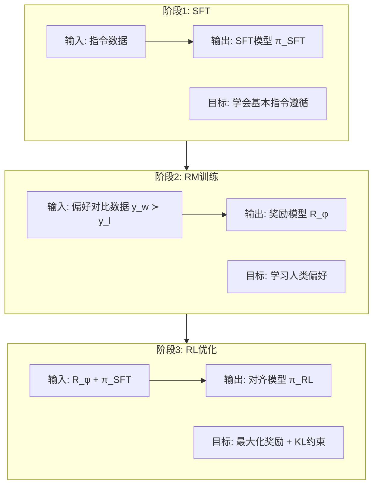

### 阶段1：SFT

- **输入**：指令-回答对 $(x, y)$
- **输出**：$\pi_{SFT}$
- **目标**：$\max_\theta \mathbb{E}_{(x,y)}[\log \pi_\theta(y|x)]$

### 阶段2：奖励模型训练

- **输入**：同一 prompt 下的偏好对 $(x, y_w, y_l)$，$y_w \succ y_l$
- **输出**：$R_\phi(x, y)$
- **目标**：学习人类偏好排序

### 阶段3：PPO 优化

- **输入**：$R_\phi$ + $\pi_{SFT}$（作为参考策略）
- **输出**：$\pi_{RL}$
- **目标**：$\max_\pi \mathbb{E}_{x \sim D, y \sim \pi}[R_\phi(x,y) - \beta \cdot D_{KL}(\pi \| \pi_{SFT})]$

---

## 3. 偏好对比 vs 绝对评分

### 成对比较的优势

1. **认知负担低**：比较两个回答比给绝对分数更容易
2. **一致性高**：不同标注者对"哪个更好"更容易达成一致
3. **避免标定问题**：不同人对5分制的理解不同，但"A比B好"更客观

### 潜在劣势

1. **信息效率低**：$N$ 个回答只能产生 $O(N)$ 个比较对，而非 $N$ 个绝对分数
2. **不可传递性**：可能出现 A > B, B > C, C > A 的循环
3. **缺乏绝对标准**：无法区分"都很好"和"都很差"的情况

---

## 4. 奖励模型设计

### 架构选择

RM 通常基于 SFT 模型，将最后一层线性层替换为标量输出头：

$$R_\phi(x, y) = \text{Linear}(\text{Transformer}_\phi(x, y))$$

即复用 SFT 模型的 Transformer 主体，只训练新的输出层+微调部分层。

### 与 LLM 的关系

- RM 和 LLM 共享 Transformer 架构
- RM 的参数通常初始化自 $\pi_{SFT}$
- RM 输出标量奖励值，LLM 输出 token 分布

### Bradley-Terry 模型与损失函数

Bradley-Terry 模型假设偏好概率与奖励值的差成正比：

$$P(y_w \succ y_l | x) = \sigma(r(x, y_w) - r(x, y_l)) = \frac{1}{1 + e^{-(r(x,y_w) - r(x,y_l))}}$$

负对数似然损失：

$$\mathcal{L}_{RM} = -\mathbb{E}_{(x, y_w, y_l)}\left[\log \sigma(r_\phi(x, y_w) - r_\phi(x, y_l))\right]$$

直觉：让 $y_w$ 的奖励高于 $y_l$ 的奖励，差值越大损失越小。

---

## 5. 为什么选 PPO

### PPO vs REINFORCE vs Q-learning

| 算法 | 类型 | 方差 | 稳定性 | 适用性 |
|------|------|------|--------|--------|
| REINFORCE | 策略梯度 | 高（单样本估计） | 差 | 简单任务 |
| PPO | 策略梯度+裁剪 | 低（GAE估计） | 好 | 连续/离散动作 |
| Q-learning | 值函数 | - | 不稳定（离散动作空间大） | 不适合LLM |

**选PPO的原因**：
1. **裁剪机制**限制策略更新幅度，避免灾难性更新
2. **GAE**降低方差，训练更稳定
3. LLM 的动作空间（词表）巨大，Q-learning 难以收敛

### PPO 核心目标

$$L^{CLIP}(\theta) = \mathbb{E}_t\left[\min\left(r_t(\theta)\hat{A}_t, \text{clip}(r_t(\theta), 1-\epsilon, 1+\epsilon)\hat{A}_t\right)\right]$$

其中 $r_t(\theta) = \frac{\pi_\theta(a_t|s_t)}{\pi_{\theta_{old}}(a_t|s_t)}$ 为重要性采样比。

### KL 散度惩罚的作用

$$\mathcal{L}_{total} = \mathbb{E}[R_\phi(x,y)] - \beta \cdot D_{KL}(\pi_\theta \| \pi_{ref})$$

1. **防止奖励黑客**：约束策略不偏离参考模型太远
2. **保持生成质量**：避免模型为追求高奖励而退化（如重复、乱码）
3. **训练稳定性**：KL 项作为正则化，使训练更平滑

---

## 6. KL 惩罚系数 β 的调节

### β 过大

- 策略几乎不偏离 $\pi_{ref}$，奖励信号被压制
- 模型行为接近 SFT 模型，对齐效果弱
- 表现：奖励分数不提升，输出与 SFT 几乎相同

### β 过小

- 策略可能大幅偏离 $\pi_{ref}$，奖励黑客风险高
- 输出可能退化为重复、乱码或奖励模型漏洞利用
- 表现：奖励分数虚高，但输出质量差

### 调节方法

1. **监控 KL 散度**：目标 KL 在 5-10 nats 左右，动态调整 β
2. **自适应 KL 控制器**：KL > 目标值时增大 β，KL < 目标值时减小 β
3. **观察奖励-KL 曲线**：找到奖励提升与 KL 增长的拐点

---

## 7. 奖励黑客（Reward Hacking）

### 定义

模型找到奖励模型的漏洞，获得高奖励但实际输出质量差。

### 示例场景

**对话系统**：RM 偏好冗长、礼貌的回答 → 模型学会生成大量无意义的客套话，获得高奖励但信息量为零。

### 缓解策略

1. **KL 约束**：限制策略偏离参考模型
2. **迭代 RM 更新**：定期用新策略的输出收集偏好数据，重新训练 RM
3. **集成 RM**：多个 RM 投票，减少单个 RM 的漏洞
4. **对抗训练**：主动搜索 RM 的失败模式
5. **过程奖励模型（PRM）**：对推理过程每步打分，而非只看最终结果

---

## 8. DPO（Direct Preference Optimization）

### 核心思想

绕过显式的奖励模型训练和 RL 优化，直接从偏好数据优化策略。

### 推导

从 RLHF 的 KL 约束最优解出发：

$$\pi^*(y|x) = \frac{1}{Z(x)}\pi_{ref}(y|x) \exp\left(\frac{r(x,y)}{\beta}\right)$$

反解奖励：$r(x,y) = \beta \log \frac{\pi^*(y|x)}{\pi_{ref}(y|x)} + \beta \log Z(x)$

代入 Bradley-Terry 模型，$Z(x)$ 被消去：

$$P(y_w \succ y_l | x) = \sigma\left(\beta \log \frac{\pi_\theta(y_w|x)}{\pi_{ref}(y_w|x)} - \beta \log \frac{\pi_\theta(y_l|x)}{\pi_{ref}(y_l|x)}\right)$$

### DPO 损失函数

$$\mathcal{L}_{DPO} = -\mathbb{E}_{(x,y_w,y_l)}\left[\log \sigma\left(\beta \left(\log \frac{\pi_\theta(y_w|x)}{\pi_{ref}(y_w|x)} - \log \frac{\pi_\theta(y_l|x)}{\pi_{ref}(y_l|x)}\right)\right)\right]$$

### DPO vs PPO

| 维度 | PPO | DPO |
|------|-----|-----|
| 是否需要RM | 需要 | 不需要 |
| 是否需要RL | 需要 | 不需要 |
| 训练稳定性 | 低（4个模型） | 高（2个模型） |
| 计算成本 | 高 | 低 |
| 在线/离线 | 在线（采样新数据） | 离线（固定数据集） |
| 奖励黑客风险 | 有 | 较低 |
| 理论最优性 | 最优（在线） | 近似最优（离线） |

---

## 9. 模式化/奉承问题分析

### 可能原因

1. **RM 偏差**：RM 偏好"讨好"用户的回答（如赞同用户观点），模型学会奉承
2. **偏好数据偏差**：标注者偏好表面礼貌但缺乏实质的回答
3. **分布偏移**：离线评估的 prompt 分布 ≠ 线上分布
4. **奖励黑客**：模型找到 RM 的漏洞，产生高奖励但低质量的模式化输出

### 解决方向

1. **改进偏好数据**：标注时强调信息量和真实性，而非仅看"友好度"
2. **迭代对齐**：上线后持续收集用户反馈，重新训练 RM 和策略
3. **多目标优化**：除偏好奖励外，加入多样性、信息量等辅助指标
4. **红队测试**：主动测试模型的奉承倾向，加入对抗样本
5. **Constitutional AI**：用原则而非人类偏好来指导对齐

---

## 10. GRPO（DeepSeek）

### 核心思想

Group Relative Policy Optimization：去掉 critic 网络，用组内相对奖励作为基线。

### 与 PPO 的区别


### GRPO 目标函数

对每个 prompt $q$，采样 $G$ 个回答 $\{o_1, ..., o_G\}$，计算组内归一化优势：

$$\tilde{A}_i = \frac{r_i - \text{mean}(r_1, ..., r_G)}{\text{std}(r_1, ..., r_G)}$$

$$\mathcal{L}_{GRPO} = \mathbb{E}\left[\frac{1}{G}\sum_{i=1}^{G}\min\left(\frac{\pi_\theta(o_i|q)}{\pi_{old}(o_i|q)}\tilde{A}_i, \text{clip}(\cdot)\tilde{A}_i\right) - \beta D_{KL}(\pi_\theta \| \pi_{ref})\right]$$

### 优劣对比

| | PPO | GRPO |
|---|---|---|
| Critic网络 | 需要 | 不需要 |
| 显存占用 | 高（4模型） | 低（2模型） |
| 训练稳定性 | 需调critic | 更稳定 |
| 奖励粒度 | 可token级 | 通常序列级 |
| 采样效率 | 每步1个样本 | 每prompt需G个样本 |

---

## 11. GSPO 与 DAPO

### GSPO（Group Relative Policy Optimization with Sequence-level Balancing）

在 GRPO 基础上引入序列级别的平衡策略，解决不同长度回答之间的奖励不公平问题。核心改进是对不同长度的序列进行长度归一化或分组比较。

### DAPO（Dynamic Advantage Policy Optimization）

DeepSeek 提出，核心改进：

1. **动态采样**：过滤掉准确率为0或1的prompt（太简单/太难），保持有效训练信号
2. **Token级损失**：在长序列上对 loss 做长度归一化，防止短回答梯度被稀释
3. **解耦裁剪**：正负优势使用不同的裁剪范围

$$\mathcal{L}_{DAPO} = \mathbb{E}\left[\min\left(r_t(\theta)\tilde{A}_t, \text{clip}(r_t(\theta), 1-\epsilon_{low}, 1+\epsilon_{high})\tilde{A}_t\right)\right]$$

当 $\tilde{A}_t > 0$（正优势）用 $\epsilon_{high}$，当 $\tilde{A}_t < 0$（负优势）用 $\epsilon_{low}$。

### 与 GRPO 的关键区别

| | GRPO | DAPO |
|---|---|---|
| 采样策略 | 固定 | 动态过滤无效prompt |
| 损失归一化 | 序列级 | Token级长度归一化 |
| 裁剪范围 | 对称 | 非对称（解耦） |

---

## 12. 信用分配：Token级 vs 序列级奖励

### 序列级奖励

整个回答获得一个标量奖励 $r$，所有 token 共享：

$$R(x, y) = r, \quad \text{分配给 } y_1, y_2, ..., y_T$$

- **问题**：无法区分回答中哪些 token 贡献了正面/负面奖励
- **信用分配难题**：好的开头+坏的结尾 vs 坏的开头+好的结尾，获得相同奖励

### Token级奖励

每个 token 获得独立的奖励信号：

$$R(x, y) = \sum_{t=1}^{T} r_t(y_t | y_{<t}, x)$$

- **优势**：精确信用分配，训练信号更细粒度
- **挑战**：token级奖励标注成本极高

### 实现方式

1. **过程奖励模型（PRM）**：对推理的每一步打分（如 Math-Shepherd, PRM800K）
2. **结果奖励模型（ORM）**：只对最终结果打分，即序列级
3. **自动token级分配**：用 ORM 的梯度或注意力来估计 token 贡献

---

## 13. RLAIF（AI 反馈对齐）

### 定义

用 AI 模型（通常是更强的 LLM）替代人类标注者提供偏好反馈，进行对齐训练。

### 流程

1. 用策略模型对同一 prompt 生成多个回答
2. 用 AI 评判器（如 GPT-4）对回答进行排序/打分
3. 用 AI 偏好数据训练 RM 或直接 DPO
4. 优化策略模型

### 潜力

1. **规模**：AI 反馈可大规模生成，不受人类标注瓶颈
2. **一致性**：AI 评判比人类更一致
3. **成本**：远低于人类标注

### 风险

1. **偏见放大**：AI 评判器的偏见会被注入对齐过程
2. **自我强化**：模型可能放大自身的错误偏好
3. **评估标准漂移**：AI 评判标准可能与人类真实偏好不一致
4. ** Constitutional AI 方法**：Anthropic 的方案是用一组原则（宪法）来指导 AI 评判，减少偏见

---

## 14. PPO 损失函数详细拆解（面试高频）

### 完整 PPO 目标函数

$$\mathcal{L}^{CLIP+VF}(\theta) = \mathbb{E}_t\left[\mathcal{L}^{CLIP}(\theta) - c_1 \mathcal{L}^{VF}(\theta) + c_2 S[\pi_\theta](s_t)\right]$$

三项分别：策略损失 + 价值损失 + 熵正则

### 第一项：$\mathcal{L}^{CLIP}$ —— 策略损失

$$\mathcal{L}^{CLIP}(\theta) = \mathbb{E}_t\left[\min\left(r_t(\theta)\hat{A}_t,\; \text{clip}(r_t(\theta), 1-\epsilon, 1+\epsilon)\hat{A}_t\right)\right]$$

#### Ratio $r_t(\theta)$ —— 重要性采样比

$$r_t(\theta) = \frac{\pi_\theta(a_t|s_t)}{\pi_{\theta_{old}}(a_t|s_t)}$$

含义：新策略在状态 $s_t$ 下采取动作 $a_t$ 的概率，与旧策略的比值。

- $r_t = 1$：新策略和旧策略在该状态下行为一致
- $r_t > 1$：新策略更倾向于该动作
- $r_t < 1$：新策略更不倾向于该动作
- **问题**：$r_t$ 过大意味着策略更新过于激进 → clip 机制限制它

#### Clip 操作

$$\text{clip}(r, 1-\epsilon, 1+\epsilon) = \begin{cases} 1-\epsilon & r < 1-\epsilon \\ r & 1-\epsilon \leq r \leq 1+\epsilon \\ 1+\epsilon & r > 1+\epsilon \end{cases}$$

通常 $\epsilon = 0.2$。将 ratio 裁剪到 $[0.8, 1.2]$ 区间。

#### min 的作用（核心）

取未裁剪值和裁剪值的**较小者**：

```mermaid
flowchart LR
    A[计算ratio r_t] --> B[计算clip(r_t)]
    A --> C[r_t × A_hat]
    B --> D[clip(r_t) × A_hat]
    C --> E[min(C, D)]
    D --> E
```

当 $\hat{A}_t > 0$（好动作）时：
- 若 $r_t > 1+\epsilon$，clip 限制了过度增加该动作概率
- 取 min 防止"好的就无限放大"

当 $\hat{A}_t < 0$（坏动作）时：
- 若 $r_t < 1-\epsilon$，clip 限制了过度减少该动作概率
- 取 min 防止"坏的就无限缩小"

### 第二项：$\mathcal{L}^{VF}$ —— 价值损失

$$\mathcal{L}^{VF}(\theta) = (V_\theta(s_t) - \hat{R}_t)^2$$

Critic 网络预测的状态价值 $V(s)$ 与实际回报 $\hat{R}_t$ 之间的 MSE。

### 第三项：$S[\pi]$ —— 熵奖励

$$S[\pi](s) = -\sum_a \pi(a|s) \log \pi(a|s)$$

鼓励探索，防止策略过早收敛到确定性策略。$c_2$ 通常为 0.01~0.001。

---

## 15. Returns 与 GAE（Generalized Advantage Estimation）

### Returns 是什么

Returns $\hat{R}_t$ 是从时间步 $t$ 开始的累积折扣回报：

$$\hat{R}_t = \sum_{l=0}^{\infty} \gamma^l r_{t+l}$$

即从第 $t$ 步开始，未来所有奖励按折扣因子 $\gamma$ 加权求和。

### Monte Carlo Returns

直接用采样的轨迹计算：

$$\hat{R}_t = r_t + \gamma r_{t+1} + \gamma^2 r_{t+2} + ... + \gamma^{T-t} r_T$$

- **优点**：无偏估计
- **缺点**：高方差（单条轨迹噪声大）

### TD (Temporal Difference) Returns

用 Critic 预测替代实际回报：

$$\hat{R}_t = r_t + \gamma V(s_{t+1})$$

- **优点**：低方差
- **缺点**：有偏估计（依赖 $V$ 的准确性）

### Advantage 函数

$$\hat{A}_t = \hat{R}_t - V(s_t)$$

含义：当前状态的实际回报超出预期多少。正值表示该状态比预期更好，负值表示更差。

### GAE（Generalized Advantage Estimation）

Schulman et al. (2018) 提出，通过参数 $\lambda \in [0, 1]$ 平衡偏差和方差：

$$\hat{A}_t^{GAE(\gamma,\lambda)} = \sum_{l=0}^{\infty} (\gamma\lambda)^l \delta_{t+l}$$

其中 TD 残差 $\delta_t = r_t + \gamma V(s_{t+1}) - V(s_t)$。

展开形式：

$$\hat{A}_t^{GAE} = \delta_t + (\gamma\lambda)\delta_{t+1} + (\gamma\lambda)^2\delta_{t+2} + ...$$

| $\lambda$ 值 | 效果 | 等价于 |
|------------|------|--------|
| $\lambda = 1$ | 纯 MC | 高方差、无偏 |
| $\lambda = 0$ | 纯 TD(0) | 低方差、有偏 |
| $\lambda = 0.95$（常用） | 折中 | 兼顾两者 |

### GAE 在大模型中的实现

LLM 中通常使用 $\gamma=1$（无折扣），$\lambda=0.95$：

$$\hat{A}_t = \sum_{l=0}^{T-t} \lambda^l \delta_{t+l}, \quad \delta_l = r_l + V(s_{l+1}) - V(s_l)$$

注意：LLM 的 reward 通常只在序列末尾给出（序列级奖励），此时中间步的 $r_t = 0$，只有最后一步 $r_T \neq 0$。

---

## 16. On-policy vs Off-policy

### 定义

| 类型 | 数据来源 | 代表算法 |
|------|---------|----------|
| On-policy | 当前策略 $\pi_\theta$ 自身采集的数据 | PPO, REINFORCE |
| Off-policy | 其他策略（旧策略/专家/回放池）采集的数据 | DQN, SAC, DPO |

### 核心区别

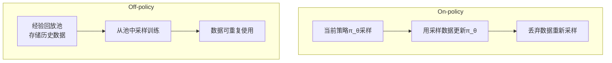

### 为什么 PPO 是 On-policy

PPO 每次更新后丢弃旧数据，用更新后的策略重新采样。原因：

1. **重要性采样比 $r_t$ 的限制**：当新旧策略差异过大时，$r_t$ 方差爆炸
2. **Clip 机制的假设**：clip 假设新旧策略接近（$r_t \approx 1$）
3. **LLM 场景的特殊性**：prompt 分布变化快，旧数据可能已过时

### DPO 为什么是 Off-policy

DPO 使用固定的偏好数据集 $(x, y_w, y_l)$ 训练，这些数据可以是任何策略生成的，不需要当前策略采集。

| 维度 | PPO (On-policy) | DPO (Off-policy) |
|------|------------------|-------------------|
| 数据效率 | 低（每轮重采样） | 高（数据复用） |
| 训练稳定性 | 需调超参多 | 更稳定 |
| 在线学习 | 支持 | 不支持（需固定数据） |
| 奖励黑客风险 | 有（在线探索） | 较低 |

### GRPO 的定位

GRPO 本质是 On-policy（每组回答由当前策略采样），但组内相对比较降低了 on-policy 的严格性要求。

---

## 17. 预训练 / SFT / RL 目的与损失对比

### 三阶段全景对比

| | 预训练 (PT) | 监督微调 (SFT) | 强化学习 (RL/PPO/DPO) |
|---|---|---|---|
| **目的** | 学习通用语言知识 | 学会指令遵循格式 | 对齐人类偏好 |
| **输入** | 海量无标注文本 | 指令-回答对 | 偏好对 / 奖励信号 |
| **输出** | 基座模型 | 对话模型 | 对齐模型 |
| **损失函数** | 交叉熵 CE | 交叉熵 CE | PPO/DPO/GRPO 损失 |
| **优化目标** | $\max \log p(x)$ | $\max \log p(y\|x)$ | $\max R(y\|x) - \beta KL$ |
| **数据规模** | T级 tokens | K~M级样本 | K~100K偏好对 |
| **关键能力** | 语言理解/生成 | 格式/指令遵循 | 安全/有用/诚实 |

### 损失函数详解

**预训练损失**：

$$\mathcal{L}_{PT} = -\frac{1}{T}\sum_{t=1}^{T} \log p_\theta(x_t \| x_{<t})$$

纯 next-token prediction，无监督自回归。

**SFT 损失**：

$$\mathcal{L}_{SFT} = -\frac{1}{T}\sum_{t=1}^{T} \log p_\theta(y_t \| x, y_{<t})$$

结构上与预训练相同，但数据为 (instruction, response) 格式，模型学会"听到指令→生成回答"的模式。

**RL 损失（以 PPO 为例）**：

$$\mathcal{L}_{RL} = \underbrace{\mathbb{E}[r_t(\theta) \cdot \text{clip}(\cdot) \cdot \hat{A}_t]}_{\text{策略目标}} - \underbrace{c_1(V_\theta - \hat{R})^2}_{\text{价值拟合}} + \underbrace{c_2 H(\pi)}_{\text{熵正则}} - \underbrace{\beta D_{KL}}_{\text{KL约束}}$$

### 三者的本质区别

```
预训练: "这是什么？" → 学会语言的统计规律
SFT:     "请回答这个问题" → 学会"提问→回答"的格式映射  
RL:      "哪个回答更好？" → 学会人类的价值观判断
```

---

## 18. SFT vs RL vs RAG 选型指南

### 什么时候用 SFT

| 场景 | 示例 |
|------|------|
| 新任务/新领域适配 | 医疗/法律领域微调 |
| 格式/风格调整 | JSON输出、特定语气 |
| 指令遵循能力基础构建 | 从基座模型到对话模型 |
| 数据充足且质量可控 | 有大量高质量标注数据 |

### 什么时候用 RL（而非 SFT）

| 场景 | 原因 |
|------|------|
| **需要区分好坏程度** | SFT 只见过"好"，RL 能学"更好" |
| **安全性对齐** | "无害"比"有用"更重要，RL 可精确控制权衡 |
| **减少幻觉** | RM 可惩罚事实错误，SFT 无法 |
| **提升推理能力** | RL 可奖励正确推理链，而不仅是答案 |
| **人类偏好复杂** | 偏好是多维度的（安全+有用+简洁+诚实），CE无法表达 |

**为什么不用 SFT 替代 RL？**

SFT 的交叉熵损失只能告诉模型"这个回答是对的"，但不能告诉它"这个回答比那个好10倍"。RL 通过连续的奖励信号提供细粒度反馈。

### 什么时候用 RAG（而非 SFT/RL）

| 场景 | 原因 |
|------|------|
| **知识频繁变化** | 新闻、法规、产品信息等时效性强的知识 |
| **需要事实溯源** | 回答必须引用来源，不可编造 |
| **私有/敏感知识** | 企业内部文档，不应注入模型权重 |
| **长尾知识** | 预训练/SFT 数据中极少出现的专业知识 |

### 组合使用策略

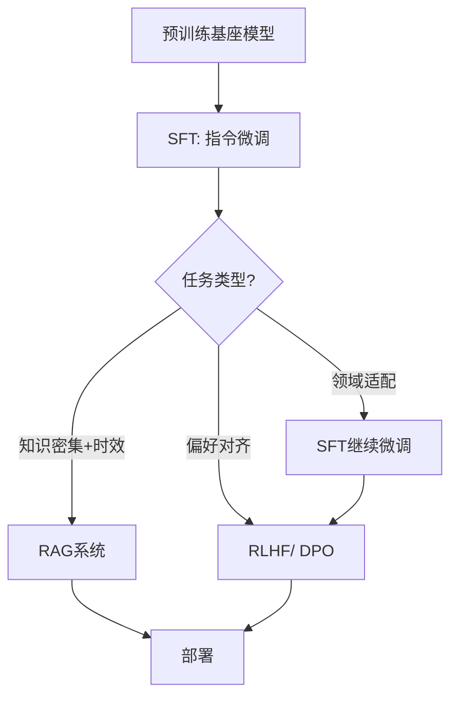

典型组合：**PT → SFT → RL(DPO)** 用于通用对话模型；**PT → SFT + RAG** 用于知识密集型应用。

---

## 19. SFT 效果评估与达标判断

### 评估维度与指标

| 维度 | 指标 | 方法 |
|------|------|------|
| 指令遵循 | 格式正确率、约束满足率 | 自动规则检查 + LLM-as-Judge |
| 回答质量 | 相关性、完整性、准确性 | 人工评估 + GPT-4评分 |
| 安全性 | 有害输出率、拒绝率 | 安全分类器 + 红队测试 |
| 通用能力 | MMLU/C-Eval/HumanEval等 | 基准测试 |
| 对比基座 | SFT vs 基座模型在各项指标上的增益 | A/B测试 |

### 判断SFT已达标的信号

1. **Loss 收敛**：训练 loss 和验证 loss 均已平稳，验证 loss 不再下降
2. **基准饱和**：目标基准测试分数不再随训练步数提升
3. **人工抽检**：随机抽样 200-500 条，人工评分 > 4.0/5.0
4. **对比停止提升**：与上一 checkpoint 对比，人工偏好无明显差异
5. **过拟合信号**：验证 loss 开始上升 → 立即停止

### 常见问题

| 问题 | 表现 | 解决 |
|------|------|------|
| 过拟合 | 训练loss↓ 验证loss↑ | 早停、增大数据量、加正则 |
| 灾难性遗忘 | 通用能力下降 | 降低学习率、混合通用数据 |
| 格式不稳定 | 输出格式不一致 | 增加格式约束数据 |

---

## 20. 基座能力越来越强，为什么还要 SFT

### 基座模型的本质局限

基座模型（PT模型）只学到了 next-token prediction，存在以下问题：

| 局限 | 具体表现 |
|------|---------|
| **无指令遵循能力** | 输入"请翻译这句话"，基座可能续写另一句话而非翻译 |
| **无对话格式** | 不知道如何以对话形式回复，可能输出不完整的文本 |
| **无安全边界** | 不区分哪些该答哪些不该答 |
| **无格式控制** | 无法按要求输出 JSON/Markdown/代码等结构化格式 |

### SFT 的不可替代性

1. **行为模式塑造**：SFT 教会模型"当用户提问时，你应该回答而非续写"
2. **格式对齐**：教会模型按特定格式输出（对话、代码、JSON等）
3. **安全基线**：建立拒绝有害请求的基本能力
4. **角色定义**：让模型知道自己是"助手"而非"文本补全器"

### 即使基座再强，SFT 仍然必要

```
基座模型: "翻译以下句子" → "翻译以下句子为法语"（续写）
SFT模型:  "翻译以下句子" → "以下是翻译结果：..."（回答）
```

基座模型学的是**语言的统计规律**，SFT 学的是**交互的行为模式**，两者本质不同。

---

## 21. GRPO 倾向于生成长篇大论的原因分析

### 根本原因：长度偏差

GRPO 的优势函数基于组内奖励归一化：

$$\tilde{A}_i = \frac{r_i - \text{mean}(r)}{\text{std}(r)}$$

**问题链条**：

1. **长回答更容易获得高奖励**：更长的回答通常更详细、更完整 → RM 倾向给高分
2. **组内比较放大长度优势**：若组内长回答奖励普遍高于短回答，归一化后长回答优势为正
3. **策略梯度强化长度**：正优势 → 增加该序列的概率 → 模型学会"写长一点"
4. **正反馈循环**：模型越写越长 → RM 越给高分 → 继续写长

### 数学解释

设序列级奖励 $r = f(\text{quality}) + g(\text{length})$，其中 $g$ 为长度带来的奖励偏差。

当 $g > 0$ 时，长序列获得更高奖励，优势函数 $\tilde{A}$ 为正，策略梯度推动模型生成更长序列。

### 缓解方法

| 方法 | 原理 |
|------|------|
| **长度惩罚** | $r' = r - \lambda \cdot \text{len}(y)$，在奖励中减去长度项 |
| **DAPO 的 token 级损失归一化** | 对长序列的 loss 除以 token 数，防止长序列梯度主导 |
| **组内长度匹配** | 在同一组内只比较长度相近的回答 |
| **过程奖励模型（PRM）** | 对每步打分而非整体打分，减少长度偏差 |
| **最大长度约束** | 限制生成长度上限 |

---

## 22. GRPO Group 大小对算法效果的影响

### Group 大小 G 的作用

对每个 prompt 采样 G 个回答，组内归一化计算优势。

### G 的影响

| G 的大小 | 优势 | 劣势 |
|---------|------|------|
| **G 小（2-4）** | 计算成本低、采样快 | 归一化估计噪声大、容易受极端值影响 |
| **G 中（8-16）** | 归一化较稳定、计算可接受 | 平衡点 |
| **G 大（32-64+）** | 归一化稳定、优势估计准确 | 计算成本高（每prompt需生成G个完整回答） |

### 关键权衡

1. **估计质量 vs 计算成本**：G 越大，$\tilde{A}_i$ 的估计越准确，但每个 prompt 的推理成本线性增长
2. **多样性 vs 收敛速度**：G 大时组内多样性高，能更好区分好坏；但每步更新信息量大，可能收敛更慢
3. **极端情况**：
   - $G=2$：退化为成对比较，等价于 DPO 的在线版本
   - $G \to \infty$：归一化趋近真实分布的标准化，但计算不可行

### 实践建议

- 数学推理任务：$G=16$（需要精确区分推理质量）
- 对话任务：$G=8$（回答质量差异较明显）
- DeepSeek-R1 使用 $G=16$

---

## 23. GRPO 训练出现熵崩（Entropy Collapse）

### 什么是熵崩

策略熵 $H(\pi) = -\sum_a \pi(a|s) \log \pi(a|s)$ 急剧下降趋近于 0，意味着策略变为**确定性策略**（每个状态只选一个动作），丧失探索能力。

### 表现

1. 生成输出高度重复、模式化
2. 不同 prompt 产生相似的回答
3. 训练 loss 继续下降但验证指标停滞或下降
4. 策略熵曲线骤降

### 原因

1. **奖励信号过于稀疏**：只有少数回答获得正奖励 → 策略快速收敛到这些模式
2. **KL 惩罚不足**：策略偏离参考模型太远
3. **学习率过大**：更新步幅太大，快速坍缩到局部最优
4. **G 过小**：组内比较样本不足，优势估计偏差大

### 缓解方法

| 方法 | 原理 |
|------|------|
| **熵正则项** | 在目标函数中加入 $c \cdot H(\pi)$，直接惩罚低熵 |
| **增大 KL 惩罚 β** | 约束策略不偏离参考模型太远 |
| **降低学习率** | 减小更新步幅，避免快速坍缩 |
| **增大 G** | 更稳定的优势估计 |
| **温度调节** | 采样时提高温度，增加多样性 |
| **早停** | 监控策略熵，低于阈值时停止训练 |

---

## 24. 强化学习中的灾难性遗忘

### 定义

RL 训练过程中，模型在追求高奖励时丢失了预训练/SFT 阶段习得的能力。

### 表现

| 遗忘类型 | 具体表现 |
|---------|---------|
| 通用能力退化 | 常识问答、数学推理等能力下降 |
| 语言质量退化 | 语法错误、不连贯、重复 |
| 指令遵循退化 | 不再按要求格式输出 |
| 多语言退化 | 非英语能力显著下降 |

### 原因

1. **参数覆盖**：RL 更新直接修改预训练权重，覆盖原有知识
2. **分布偏移**：RL 的 prompt 分布 ≠ 预训练数据分布
3. **奖励导向偏颇**：RM 只奖励特定维度，忽略其他能力

### 缓解方法

| 方法 | 原理 |
|------|------|
| **KL 散度约束** | 限制策略偏离 $\pi_{ref}$，保留 SFT 能力 |
| **混合训练** | RL 训练中混入 SFT 数据，定期"复习" |
| **EWC（Elastic Weight Consolidation）** | 对重要参数施加更新惩罚 |
| **LoRA 微调** | 冻结基座参数，只训练低秩适配器，不修改原始权重 |
| **多任务奖励** | RM 同时评估多个维度，避免单维度优化 |
| **渐进式训练** | 先小 β 后大 β，逐步对齐 |

---

## 25. RLVR（Reinforcement Learning from Verifiable Rewards）

### 定义

用**可验证的奖励信号**（而非人类/AI偏好）进行强化学习。奖励由外部验证器自动给出，无需训练 RM。

### 与 RLHF 的区别

| | RLHF | RLVR |
|---|---|---|
| 奖励来源 | 人类偏好训练的 RM | 规则/程序验证器 |
| 奖励性质 | 主观、连续 | 客观、二值（0/1） |
| 是否需要RM | 需要 | 不需要 |
| 适用任务 | 对话、摘要等开放任务 | 数学、代码等可验证任务 |
| 奖励黑客风险 | 高 | 极低（验证器不可欺骗） |

### 典型验证器

| 任务 | 验证器 | 奖励 |
|------|--------|------|
| 数学推理 | 答案正确性检查 | $r = 1$ if correct else $0$ |
| 代码生成 | 单元测试执行 | $r = \text{pass\_rate}$ |
| 逻辑推理 | 形式化验证器 | $r = 1$ if valid else $0$ |

### RLVR 流程

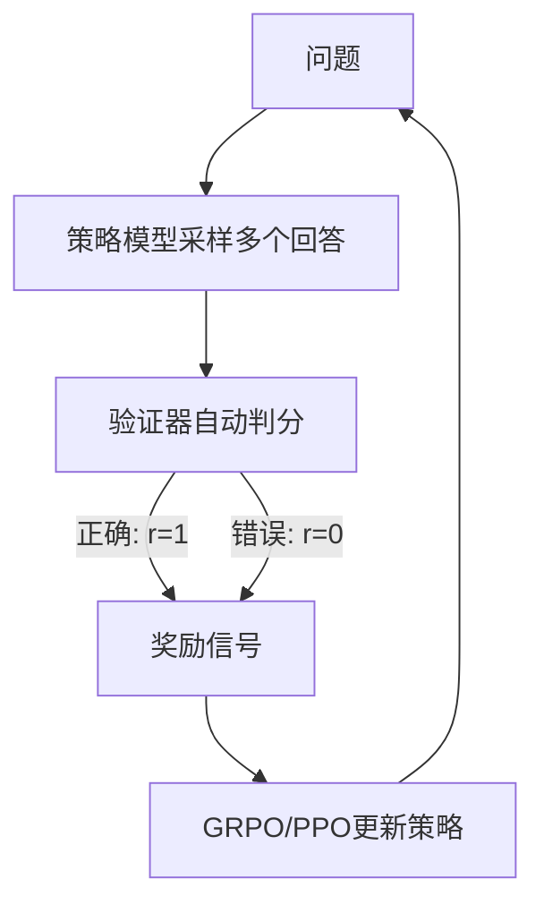

### 优势

1. **零标注成本**：不需要人类标注偏好
2. **无 RM 偏差**：验证器是客观的
3. **无奖励黑客**：无法欺骗代码执行器或数学验证器
4. **DeepSeek-R1 的核心方法**：用 RLVR 训练推理能力，再蒸馏到小模型

### 局限

1. 仅适用于有明确正确答案的任务
2. 二值奖励信号稀疏，可能导致训练困难
3. 无法处理开放式、主观性任务

---

## 26. 贝尔曼方程（Bellman Equation）

### 基本形式

贝尔曼方程描述了状态价值函数的递推关系：

$$V(s) = \mathbb{E}\left[r_t + \gamma V(s_{t+1}) \| s_t = s\right]$$

即当前状态的价值 = 即时奖励 + 折扣后的下一状态价值。

### 动作价值函数（Q 函数）

$$Q(s, a) = \mathbb{E}\left[r_t + \gamma V(s_{t+1}) \| s_t = s, a_t = a\right]$$

### 贝尔曼最优方程

$$V^*(s) = \max_a Q^*(s, a) = \max_a \mathbb{E}\left[r + \gamma V^*(s') \| s, a\right]$$

$$Q^*(s, a) = \mathbb{E}\left[r + \gamma \max_{a'} Q^*(s', a') \| s, a\right]$$

### 与 LLM 训练的关系

| 概念 | LLM 中的对应 |
|------|-------------|
| 状态 $s$ | 已生成的 token 序列 $y_{<t}$ + prompt $x$ |
| 动作 $a$ | 下一个生成的 token $y_t$ |
| 奖励 $r$ | RM 给出的奖励（通常只在序列末尾） |
| $V(s)$ | Critic 网络的输出 |
| $Q(s,a)$ | 采取某 token 后的期望回报 |

### 在 PPO 中的应用

TD 残差 $\delta_t = r_t + \gamma V(s_{t+1}) - V(s_t)$ 就是贝尔曼方程的误差项。GAE 通过多步 TD 残差的指数加权和来估计优势函数。

---

## 27. SFT 数据构建全流程

### 完整流程

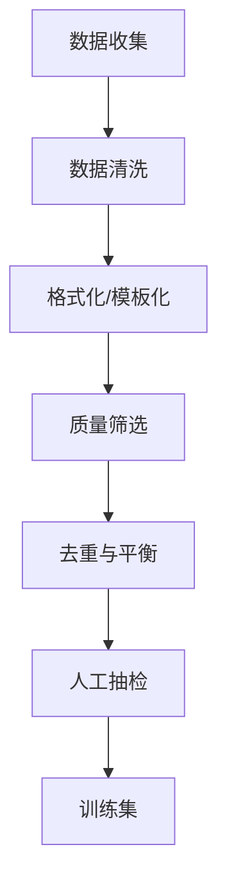

### 各步骤详解

#### 1. 数据收集

| 来源 | 描述 | 质量 |
|------|------|------|
| 开源指令数据 | Alpaca, ShareGPT, Open-Orca | 中（需筛选） |
| 自我指令（Self-Instruct） | 用强模型生成指令-回答对 | 中高 |
| 人类标注 | 人工编写指令和回答 | 高（成本高） |
| 现有数据改写 | 将NLP数据集转为指令格式 | 中 |

#### 2. 数据清洗

- 去除含 PII（个人身份信息）的数据
- 去除过短/过长的样本
- 去除乱码、编码错误
- 语言检测，过滤非目标语言

#### 3. 格式化/模板化

统一为对话格式：

```
<|im_start|>system
你是一个有帮助的助手。<|im_end|>
<|im_start|>user
{instruction}<|im_end|>
<|im_start|>assistant
{response}<|im_end|>
```

#### 4. 质量筛选

| 方法 | 描述 |
|------|------|
| 困惑度过滤 | 用基座模型计算 PPL，过滤过高/过低的 |
| LLM 评分 | 用 GPT-4 对每条数据打分，保留高分 |
| 规则过滤 | 检查回答是否完整、是否与问题相关 |
| 多样性过滤 | 去除语义重复的指令 |

#### 5. 去重与平衡

- **去重**：MinHash/SimHash 去除相似度 > 阈值的样本
- **类别平衡**：确保各任务类型（推理/创作/问答/代码等）比例合理
- **难度平衡**：混合简单和复杂样本

#### 6. 人工抽检

- 随机抽取 5-10% 人工审核
- 检查：回答正确性、格式规范性、安全性
- 不合格率 > 5% 则需重新清洗

### 数据量参考

| 模型规模 | SFT 数据量 |
|---------|-----------|
| 7B | 50K-200K 条 |
| 13B-34B | 100K-500K 条 |
| 70B+ | 200K-1M 条 |

**关键原则**：数据质量 >> 数据数量。10K 高质量数据 > 100K 低质量数据。

---

## 28. 为什么 RL 前需要先做 SFT

### 核心原因：RL 的起点需要是一个合格的策略

RL 优化是在已有策略基础上做**增量调整**，而非从零学习。若起点策略质量太差，RL 训练无法收敛。

### 逐层分析

| 不做 SFT 直接做 RL 的问题 | 后果 |
|--------------------------|------|
| 基座模型不懂指令遵循 | 采样的回答与 prompt 无关，RM 无法给出有意义的偏好信号 |
| 输出格式不可控 | 回答可能是不完整的文本续写，而非对话格式 |
| 采样效率极低 | 大量采样才能得到少数可用回答，训练成本爆炸 |
| 奖励信号稀疏 | 多数回答质量极差，RM 给出的偏好区分度低 |
| KL 约束失效 | 参考模型 $\pi_{ref}$ 本身就不好，约束它没有意义 |

### 数学直觉

PPO/GRPO 的目标函数：

$$\max_\pi \mathbb{E}[R(x,y)] - \beta D_{KL}(\pi \| \pi_{ref})$$

- 若 $\pi_{ref}$ 是基座模型（不懂指令），KL 约束会拉向"不懂指令"的方向
- 若 $\pi_{ref}$ 是 SFT 模型（已懂指令），KL 约束拉向"懂指令"的方向，RL 只需在此基础上微调偏好

### 流程图

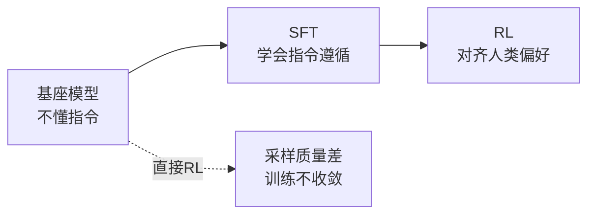

**结论**：SFT 提供"及格线"以上的策略，RL 在此基础上做"从及格到优秀"的优化。

---

## 29. PPO vs GRPO vs DPO 全面对比

### 架构对比

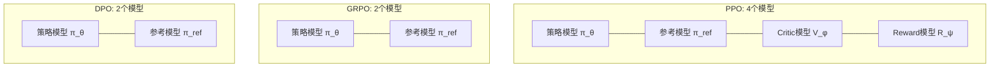

### 目标函数对比

**PPO 目标函数**：

$$\mathcal{L}_{PPO} = \mathbb{E}\left[\min\left(r_t(\theta)\hat{A}_t, \text{clip}(r_t(\theta), 1-\epsilon, 1+\epsilon)\hat{A}_t\right)\right] - \beta D_{KL}(\pi_\theta \| \pi_{ref})$$

其中 $\hat{A}_t$ 由 Critic 网络 + GAE 计算。

**GRPO 目标函数**：

$$\mathcal{L}_{GRPO} = \mathbb{E}\left[\frac{1}{G}\sum_{i=1}^{G}\min\left(\frac{\pi_\theta(o_i|q)}{\pi_{old}(o_i|q)}\tilde{A}_i, \text{clip}(\cdot)\tilde{A}_i\right) - \beta D_{KL}(\pi_\theta \| \pi_{ref})\right]$$

其中 $\tilde{A}_i = \frac{r_i - \text{mean}(r)}{\text{std}(r)}$，组内归一化，无需 Critic。

**DPO 目标函数**：

$$\mathcal{L}_{DPO} = -\mathbb{E}_{(x,y_w,y_l)}\left[\log \sigma\left(\beta\left(\log\frac{\pi_\theta(y_w|x)}{\pi_{ref}(y_w|x)} - \log\frac{\pi_\theta(y_l|x)}{\pi_{ref}(y_l|x)}\right)\right)\right]$$

无需采样，直接从偏好数据优化。

### 关键维度对比

| 维度 | PPO | GRPO | DPO |
|------|-----|------|-----|
| 模型数量 | 4 | 2 | 2 |
| 显存占用 | 最高 | 中 | 最低 |
| 是否需要 RM | 需要 | 不需要（规则/验证器） | 不需要 |
| 是否需要 Critic | 需要 | 不需要 | 不需要 |
| 在线/离线 | 在线 | 在线 | 离线 |
| 采样方式 | 每步1个样本 | 每prompt采样G个 | 无需采样 |
| 优势估计 | GAE（Critic+TD） | 组内归一化 | 隐式（偏好对差） |
| 奖励粒度 | Token级/序列级 | 序列级 | 序列级 |
| 训练稳定性 | 低（需调4个模型） | 中 | 高 |
| 奖励黑客风险 | 高 | 中 | 低 |
| 数据效率 | 低（每轮重采样） | 中（G个样本） | 高（数据复用） |
| 理论最优性 | 最优（在线） | 近似最优 | 近似最优（离线） |
| 长度偏差 | 有 | 有（较严重） | 较少 |
| 代表应用 | InstructGPT, ChatGPT | DeepSeek-R1 | Llama 2, 多数开源模型 |

### 适用场景

| 场景 | 推荐算法 | 原因 |
|------|---------|------|
| 大规模生产级对齐 | PPO | 在线学习，持续优化 |
| 可验证任务（数学/代码） | GRPO + RLVR | 无需RM，验证器客观 |
| 资源有限，快速对齐 | DPO | 简单高效，无需采样 |
| 需要细粒度奖励 | PPO | Critic提供token级信号 |
| 推理能力提升 | GRPO | 组内对比激发推理链 |

---

## 30. GRPO 优势值评估机制详解

### 从 PPO 的优势估计到 GRPO 的组内归一化

PPO 用 Critic 网络 + GAE 估计优势：

$$\hat{A}_t^{GAE} = \sum_{l=0}^{T-t}(\gamma\lambda)^l \delta_{t+l}, \quad \delta_l = r_l + \gamma V(s_{l+1}) - V(s_l)$$

问题：需要训练一个额外的 Critic 网络，显存翻倍，且 Critic 本身训练不稳定。

GRPO 的核心创新：**用组内统计量替代 Critic**。

### GRPO 优势计算流程

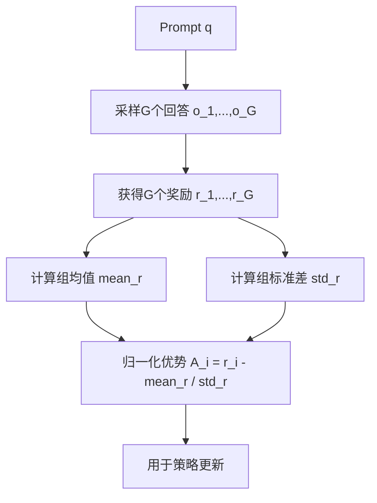

### 具体计算

对 prompt $q$，采样 $G$ 个回答 $\{o_1, ..., o_G\}$，获得奖励 $\{r_1, ..., r_G\}$：

$$\mu_r = \frac{1}{G}\sum_{i=1}^{G} r_i$$

$$\sigma_r = \sqrt{\frac{1}{G}\sum_{i=1}^{G}(r_i - \mu_r)^2}$$

$$\tilde{A}_i = \frac{r_i - \mu_r}{\sigma_r}$$

### 归一化的意义

| 性质 | 说明 |
|------|------|
| 零均值 | $\sum \tilde{A}_i = 0$，正负优势数量平衡 |
| 单位方差 | $\text{Var}(\tilde{A}) = 1$，不同 prompt 间的优势可比 |
| 相对性 | 优势只反映"在当前组内相对好坏"，与绝对奖励值无关 |

### 与 PPO 优势估计的本质区别

| | PPO GAE | GRPO 组内归一化 |
|---|---|---|
| 基线来源 | Critic 网络 $V(s)$ | 组均值 $\mu_r$ |
| 优势含义 | 比预期好多少 | 比组内平均好多少 |
| 额外模型 | 需要 Critic | 不需要 |
| 粒度 | Token 级 | 序列级 |
| 方差 | 低（GAE平滑） | 中（依赖G的大小） |
| 偏差 | 有（Critic不准时） | 无（纯统计量） |

### 局限性

1. **序列级粒度**：整个回答一个优势值，无法区分回答内部的好坏部分
2. **组内依赖**：优势值取决于同组其他回答的质量，同一回答在不同组中优势不同
3. **G 敏感**：G 太小时归一化噪声大，G 太大时计算成本高
4. **长度偏差**：长回答更容易获得正优势（详见第21节）

---

## 31. Reward Model 训练详解

### 训练数据构造

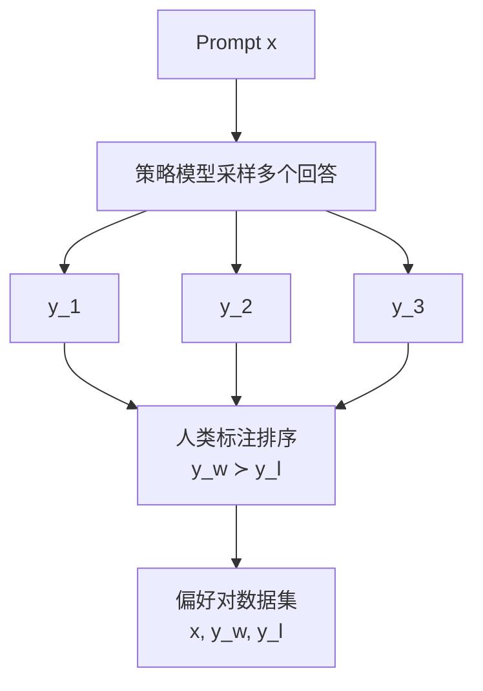

### 模型架构

RM 基于 SFT 模型，将最后的语言模型头替换为标量输出头：

$$R_\phi(x, y) = w^T h_{last} + b$$

其中 $h_{last}$ 为最后一个 token 的隐藏状态，$w \in \mathbb{R}^d, b \in \mathbb{R}$ 为可训练参数。

### 损失函数：Bradley-Terry 模型

$$\mathcal{L}_{RM} = -\mathbb{E}_{(x, y_w, y_l)}\left[\log \sigma(r_\phi(x, y_w) - r_\phi(x, y_l))\right]$$

梯度方向：增大 $r(x, y_w)$，减小 $r(x, y_l)$。

### 训练细节

| 配置 | 典型值 |
|------|--------|
| 初始化 | 从 SFT 模型加载 |
| 学习率 | $1 \times 10^{-5}$ ~ $5 \times 10^{-6}$ |
| 训练轮数 | 1 epoch（防止过拟合） |
| 批大小 | 64-512 对 |
| 奖励裁剪 | $r \in [-5, 5]$，防止奖励值爆炸 |
| 损失函数 | Bradley-Terry + L2 正则 |

### 关键训练技巧

1. **奖励白化**：对 RM 输出做标准化 $r' = (r - \mu) / \sigma$，使奖励分布稳定
2. **长度惩罚项**：$r' = r - \lambda \cdot \text{len}(y)$，防止 RM 偏好冗长回答
3. **边际约束**：$\mathcal{L} = -\log\sigma(r_w - r_l - m)$，$m$ 为边际，强制 $y_w$ 的奖励显著高于 $y_l$
4. **Ensemble**：训练多个 RM 取平均，减少单个 RM 的偏差

### RM 的评估

| 指标 | 定义 | 含义 |
|------|------|------|
| 准确率 | $r_w > r_l$ 的比例 | 偏好排序正确率 |
| 一致性 | 同一prompt多次标注的一致率 | 标注质量 |
| 校准度 | 预测概率与实际频率的匹配度 | 奖励值可靠性 |

### RM 与 RLVR 的关系

| | Reward Model | RLVR |
|---|---|---|
| 奖励来源 | 从人类偏好数据学习 | 规则/程序验证器 |
| 奖励性质 | 主观、连续值 | 客观、二值（0/1） |
| 训练成本 | 高（需标注偏好数据） | 低（只需验证器） |
| 适用范围 | 开放式任务 | 可验证任务（数学/代码） |
| 奖励黑客风险 | 高 | 极低 |
| 关系 | RLHF 的核心组件 | 可替代 RM 用于 RL 训练 |

**互补使用**：RLVR 用于可验证任务（数学推理），RM 用于开放式任务（对话、创意写作）。DeepSeek-R1 先用 RLVR 训练推理能力，再用 RM 做通用对齐。

---

## 32. CoT 思维链的必要性与质量评估

### 为什么需要思维链

#### 直接回答 vs CoT 回答

| 维度 | 直接回答 | CoT 回答 |
|------|---------|---------|
| 推理路径 | 隐式（模型内部） | 显式（文本可见） |
| 可验证性 | 无法检查推理过程 | 可逐步检查 |
| 准确率 | 复杂推理任务显著低 | 高（尤其数学/逻辑） |
| 计算量 | 少 | 多（生成长度增加） |
| 训练信号 | 稀疏（只有最终答案对错） | 密集（每步都有信号） |

#### 数学解释

直接回答：$P(y|x) = P(a|x)$，只预测答案 $a$。

CoT 回答：$P(y|x) = \prod_{t=1}^{T} P(s_t | x, s_{<t}) \cdot P(a | x, s_{1:T})$

其中 $s_1, ..., s_T$ 为推理步骤。链式分解将复杂概率估计分解为多个简单估计，每个条件概率更容易学习。

#### CoT 对 RL 训练的好处

1. **信用分配更精确**：PRM 可对每步打分，而非只看最终结果
2. **RLVR 可用**：验证器可检查中间步骤的正确性
3. **探索空间缩小**：模型在推理链空间搜索，而非直接在答案空间搜索
4. **DeepSeek-R1 的发现**：GRPO + RLVR 训练中，CoT 推理链自发涌现

### 思维链质量评估方法

#### 1. 结果一致性检查

对同一问题采样多条 CoT，检查最终答案是否一致：

$$\text{Consistency} = \frac{\text{多数投票正确次数}}{\text{总采样次数}}$$

#### 2. 过程奖励模型（PRM）

训练一个模型对 CoT 的每一步打分：

$$\text{PRM-Score} = \prod_{t=1}^{T} P(\text{correct}_t | x, s_{<t})$$

| ORM（结果奖励） | PRM（过程奖励） |
|----------------|----------------|
| 只对最终答案打分 | 对每步推理打分 |
| 信用分配模糊 | 信用分配精确 |
| 标注成本低 | 标注成本高（需逐步标注） |
| 代表：ORM800K | 代表：PRM800K, Math-Shepherd |

#### 3. 逻辑一致性检查

- **自洽性**：CoT 的结论是否从前提逻辑推出
- **无矛盾**：CoT 内部不存在相互矛盾的陈述
- **完整性**：推理步骤是否覆盖所有必要中间结论

#### 4. LLM-as-Judge 评估

用强模型（GPT-4）评估 CoT 质量：

| 评估维度 | Prompt 示例 |
|---------|------------|
| 正确性 | "推理步骤是否数学上正确？" |
| 完整性 | "是否有遗漏的推理步骤？" |
| 简洁性 | "是否有冗余或不必要的步骤？" |
| 可读性 | "推理过程是否清晰易懂？" |

#### 5. 自动化指标

| 指标 | 计算方式 | 含义 |
|------|---------|------|
| 步骤准确率 | 正确步骤数 / 总步骤数 | 推理过程正确性 |
| 答案准确率 | 最终答案正确率 | 结果正确性 |
| CoT 长度 | Token 数 | 效率 |
| 重复率 | 重复片段占比 | 是否陷入循环 |

---

## 33. 持续学习与 RL 的未来发展

### 持续学习的核心挑战

在不停机的情况下，让模型持续从新数据中学习，同时不遗忘旧知识。

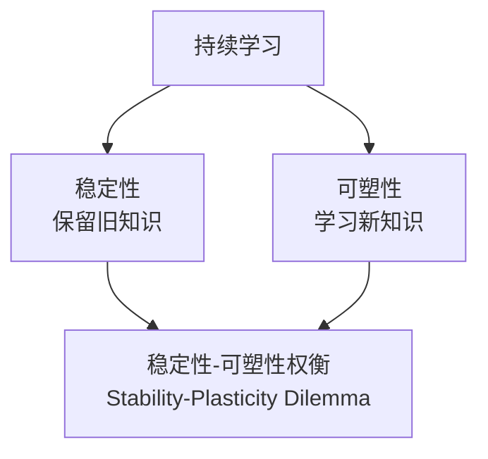

### LLM 中的持续学习方法

| 方法 | 原理 | 优劣 |
|------|------|------|
| 持续 SFT | 新数据上继续 SFT | 简单但遗忘严重 |
| 持续 RL | 新偏好数据上继续 RL | 可适配新偏好但需 RM |
| LoRA 增量 | 每个新任务加新 LoRA | 不遗忘但参数膨胀 |
| EWC | 对重要参数加更新惩罚 | 需计算 Fisher 信息 |
| 经验回放 | 混合新旧数据训练 | 简单有效但需存储旧数据 |

### RL 在 LLM 中的未来方向

1. **RLVR 扩展**：从数学/代码扩展到更多可验证领域（科学推理、法律论证）
2. **多模态 RL**：视觉-语言联合强化学习，对齐多模态偏好
3. **过程监督**：PRM 替代 ORM，提供更细粒度的训练信号
4. **自进化系统**：模型自主生成训练数据 + 自我验证 + 自我改进循环
5. **高效 RL**：降低 RL 训练的计算成本，使小团队也能做 RL 对齐
6. **在线对齐**：部署后持续从用户反馈中学习，而非一次性对齐

---

## 34. Human-in-the-loop 中模型标注的问题

### 场景

用 LLM 替代人类进行数据标注（如偏好排序、指令生成、质量评分），形成"模型标注 → 训练模型"的闭环。

### 可能遇到的问题

#### 1. 数据质量退化

| 问题 | 原因 | 后果 |
|------|------|------|
| 标注噪声 | 模型对边界案例判断不准 | 训练数据含错误标签 |
| 一致性过高 | 模型输出缺乏人类多样性 | 训练数据缺乏覆盖度 |
| 长尾缺失 | 模型对罕见情况处理差 | 训练数据分布偏移 |

#### 2. 标注偏差

| 偏差类型 | 表现 | 影响 |
|---------|------|------|
| 自我偏好 | 模型偏好自己风格的回答 | 训练后模型输出更趋同 |
| 长度偏差 | 偏好冗长回答 | 模型学会"凑字数" |
| 格式偏差 | 偏好特定格式（如 Markdown） | 忽略内容质量 |
| 位置偏差 | 对列表中靠前的选项给更高分 | 排序结果不可靠 |

#### 3. 偏见放大（Echo Chamber）

$$\text{模型}_A \xrightarrow{\text{标注数据}} \text{模型}_B \xrightarrow{\text{标注数据}} \text{模型}_C \xrightarrow{} ...$$

每一代模型放大上一代的偏见，形成正反馈循环。

#### 4. 可验证性缺失

- 人类标注可追问理由，模型标注无法解释
- 模型标注的错误模式系统性更强，更难发现

### 缓解策略

| 策略 | 原理 |
|------|------|
| 人类抽检 | 随机抽取 5-10% 由人类复核 |
| 多模型投票 | 多个不同模型标注取多数 |
| 偏差检测 | 统计分析标注分布，检测异常模式 |
| 混合标注 | 关键数据人类标注，大量数据模型标注 |
| 对抗样本 | 主动构造边界案例测试标注质量 |
| Constitutional AI | 用原则约束模型标注行为 |

---

## 35. 对强化学习算法的认知与落地

### RL 在 LLM 中的定位

RL 不是替代 SFT，而是在 SFT 基础上做**偏好优化**。核心价值：

1. **超越模仿**：SFT 只能模仿人类回答，RL 能发现人类未展示的更好策略
2. **对齐价值观**：将抽象的人类价值观（安全、诚实、有用）转化为可优化的目标
3. **激发推理**：DeepSeek-R1 证明 RLVR 能激发模型自发产生 CoT 推理

### 落地挑战

| 挑战 | 描述 | 当前解法 |
|------|------|---------|
| 计算成本 | PPO 需4个模型，显存需求大 | GRPO/DPO 降低模型数 |
| 奖励黑客 | 模型利用 RM 漏洞 | KL约束 + 迭代RM + RLVR |
| 训练不稳定 | 超参敏感，容易崩 | 熵正则 + 梯度裁剪 + 监控 |
| 数据瓶颈 | 高质量偏好数据稀缺 | RLAIF + 合成数据 |
| 评估困难 | 对齐效果难以量化 | 多维度基准 + 人工评估 |

### 研究趋势

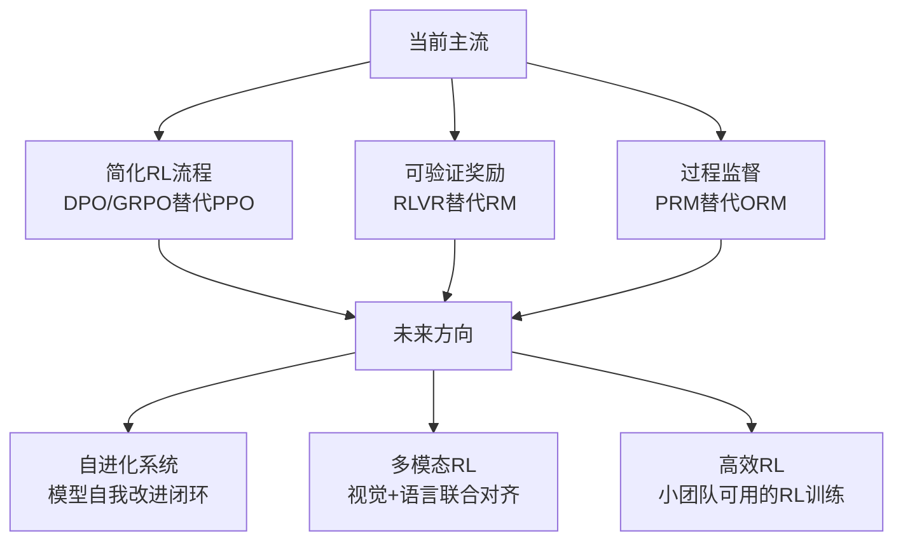

### 核心判断

1. **RL 是必要的**：SFT 无法替代 RL 的偏好优化能力
2. **RL 正在变简单**：从 PPO(4模型) → GRPO(2模型) → DPO(2模型离线)
3. **RLVR 是突破口**：可验证奖励解决了 RM 的根本问题（主观性+黑客风险）
4. **落地关键在数据**：算法差异远小于数据质量的差异
