# 第三章 基于人类反馈的强化学习（RLHF）

> 本章系统讲解大语言模型（LLM, Large Language Model）从预训练到人类偏好对齐的完整技术路径。我们将从监督微调的局限性出发，逐步引入强化学习的核心思想，深入剖析 RLHF 三阶段流程、奖励模型设计、PPO 算法原理，再延伸到 DPO、GRPO 等前沿方法，最终讨论工程落地中的关键挑战与未来方向。

---

## 3.1 从预训练到对齐：大模型训练的三个阶段

构建一个实用的大语言模型，通常需要经历三个递进的训练阶段。每个阶段解决不同层次的问题，使用不同的数据和优化目标。理解这三个阶段的关系，是掌握 RLHF 的前提。

$q_a$

### 3.1.1 三阶段全景

| | 预训练（PT, Pre-Training） | 监督微调（SFT, Supervised Fine-Tuning） | 强化学习对齐（RL, Reinforcement Learning） |
|---|---|---|---|
| **目的** | 学习通用语言知识 | 学会指令遵循格式 | 对齐人类偏好 |
| **输入** | 海量无标注文本 | 指令-回答对 | 偏好对 / 奖励信号 |
| **输出** | 基座模型 | 对话模型 | 对齐模型 |
| **损失函数** | 交叉熵（CE, Cross-Entropy） | 交叉熵（CE） | PPO / DPO / GRPO 损失 |
| **优化目标** | $\max \log p(x)$ | $\max \log p(y \| x)$ | $\max R(y \| x) - \beta \text{KL}$ |
| **数据规模** | 万亿级 tokens | 数千至百万级样本 | 数千至十万级偏好对 |
| **关键能力** | 语言理解与生成 | 格式与指令遵循 | 安全、有用、诚实 |

### 3.1.2 各阶段损失函数

**预训练损失**——纯粹的下一词预测（Next-Token Prediction），属于无监督自回归学习：

$$\mathcal{L}_{PT} = -\frac{1}{T}\sum_{t=1}^{T} \log p_\theta(x_t | x_{<t})$$

其中 $x_t$ 为第 $t$ 个 token，$x_{<t}$ 为其前文序列，$T$ 为序列总长度，$\theta$ 为模型参数。

**SFT 损失**——结构上与预训练相同，但数据为（指令, 回答）格式：

$$\mathcal{L}_{SFT} = -\frac{1}{T}\sum_{t=1}^{T} \log p_\theta(y_t | x, y_{<t})$$

其中 $x$ 为用户指令，$y_t$ 为回答中第 $t$ 个 token。模型学会"听到指令后生成回答"的行为模式。

**RL 损失**（以 PPO 为例）——包含多个优化目标的复合损失：

$$\mathcal{L}_{RL} = \underbrace{\mathbb{E}[r_t(\theta) \cdot \text{clip}(\cdot) \cdot \hat{A}_t]}_{\text{策略目标}} - \underbrace{c_1(V_\theta - \hat{R})^2}_{\text{价值拟合}} + \underbrace{c_2 H(\pi)}_{\text{熵正则}} - \underbrace{\beta D_{KL}}_{\text{KL约束}}$$

其中 $r_t(\theta)$ 为重要性采样比，$\hat{A}_t$ 为优势函数（Advantage Function），$V_\theta$ 为价值网络输出，$\hat{R}$ 为实际回报，$H(\pi)$ 为策略熵，$D_{KL}$ 为 KL 散度（Kullback-Leibler Divergence，衡量两个概率分布差异的指标）。

### 3.1.3 三者的本质区别

```
预训练: "这是什么？" → 学会语言的统计规律
SFT:     "请回答这个问题" → 学会"提问→回答"的格式映射
RL:      "哪个回答更好？" → 学会人类的价值观判断
```

---

## 3.2 SFT 的局限与 RLHF 的必要性

### 3.2.1 SFT 为什么不够

SFT 通过监督学习让模型学会"模仿"人类回答，但存在三个根本性局限：

1. **分布偏移（Distribution Shift）**：模型在自回归生成时，后续 token 的输入分布偏离训练时的分布。这一现象也称为曝光偏差（Exposure Bias）——训练时模型看到的是真实前文，推理时看到的却是自己生成的前文，两者分布不一致。

2. **目标错配（Objective Mismatch）**：交叉熵损失并不等于人类偏好。模型可能学会生成"看起来像"好回答但实际质量不高的输出。

3. **缺乏对比能力**：SFT 只见过"好回答"，不知道"好"和"更好"之间的区别。交叉熵损失只能告诉模型"这个回答是对的"，但不能告诉它"这个回答比那个好 10 倍"。

### 3.2.2 RLHF 如何解决这些问题

| 问题 | SFT 的表现 | RLHF 的改进 |
|------|-----------|-------------|
| 好坏区分 | 只学"好"的 | 学"更好"的（偏好对比） |
| 人类价值观对齐 | 间接（通过数据隐含） | 直接优化人类偏好 |
| 安全性控制 | 有限 | 可通过偏好数据精确引导 |
| 反馈粒度 | 二元（对/错） | 连续奖励信号，细粒度反馈 |

RL 通过连续的奖励信号提供细粒度反馈，使模型能够学习人类偏好中微妙的程度差异。

### 3.2.3 基座能力越来越强，为什么还需要 SFT

基座模型（PT 模型）只学到了 next-token prediction，存在以下本质局限：

| 局限 | 具体表现 |
|------|---------|
| **无指令遵循能力** | 输入"请翻译这句话"，基座可能续写另一句话而非翻译 |
| **无对话格式** | 不知道如何以对话形式回复，可能输出不完整的文本 |
| **无安全边界** | 不区分哪些该答哪些不该答 |
| **无格式控制** | 无法按要求输出 JSON / Markdown / 代码等结构化格式 |

```
基座模型: "翻译以下句子" → "翻译以下句子为法语"（续写）
SFT模型:  "翻译以下句子" → "以下是翻译结果：..."（回答）
```

基座模型学的是**语言的统计规律**，SFT 学的是**交互的行为模式**，两者本质不同。SFT 的不可替代性在于：行为模式塑造、格式对齐、安全基线建立、角色定义。

---

## 3.3 RLHF 三阶段流程

RLHF（Reinforcement Learning from Human Feedback，基于人类反馈的强化学习）是当前大模型对齐的主流范式。其核心思想是：先用人类偏好数据训练一个奖励模型，再用强化学习算法优化语言模型的策略，使其输出更符合人类期望。

### 3.3.1 流程总览

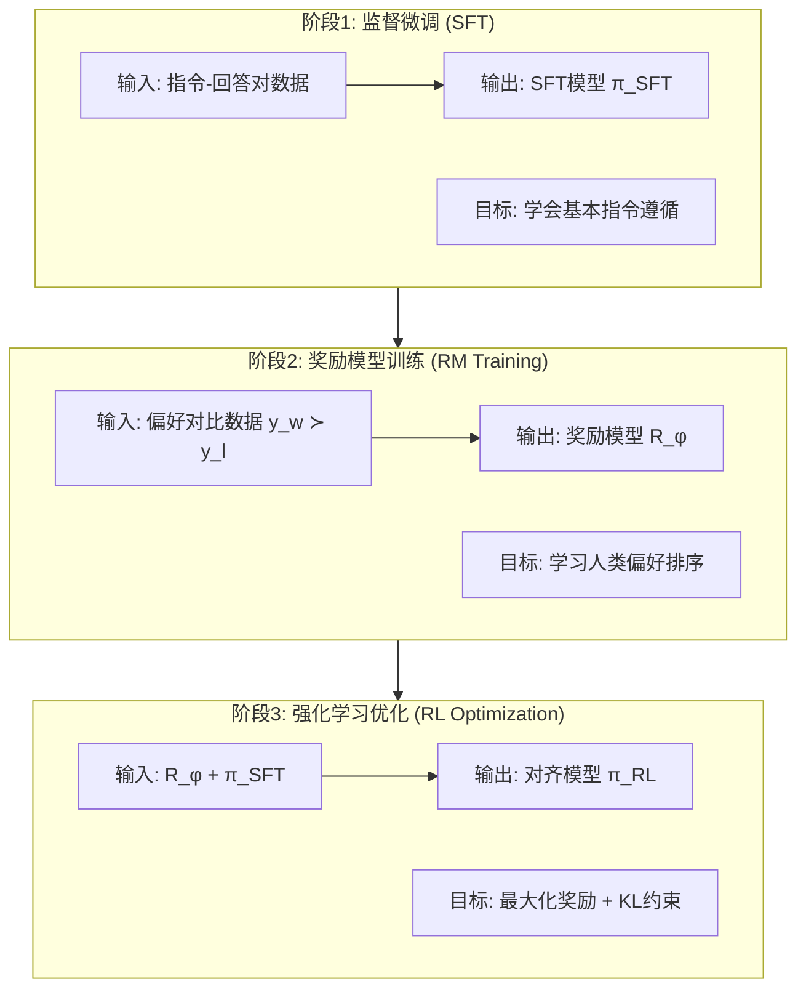

### 3.3.2 阶段一：监督微调（SFT）

- **输入**：指令-回答对 $(x, y)$ 
- **输出**：SFT 策略 $\pi_{SFT}$
- **优化目标**：

$$\max_\theta \mathbb{E}_{(x,y)}[\log \pi_\theta(y|x)]$$

此阶段为后续 RL 训练提供一个"及格线"以上的起点策略。

### 3.3.3 阶段二：奖励模型训练

- **输入**：同一 prompt 下的偏好对 $(x, y_w, y_l)$，其中 $y_w \succ y_l$ 表示 $y_w$ 优于 $y_l$
- **输出**：奖励模型 $R_\phi(x, y)$，输出一个标量奖励值
- **目标**：学习人类偏好排序

### 3.3.4 阶段三：PPO 优化

- **输入**：奖励模型 $R_\phi$ + SFT 模型 $\pi_{SFT}$（作为参考策略）
- **输出**：对齐后的策略 $\pi_{RL}$
- **优化目标**：

$$\max_\pi \mathbb{E}_{x \sim D, y \sim \pi}[R_\phi(x,y) - \beta \cdot D_{KL}(\pi \| \pi_{SFT})]$$

其中 $\beta$ 为 KL 惩罚系数，$D_{KL}$ 约束新策略不偏离 SFT 模型太远。

### 3.3.5 为什么 RL 前必须先做 SFT

RL 优化是在已有策略基础上做**增量调整**，而非从零学习。若起点策略质量太差，RL 训练无法收敛：

| 不做 SFT 直接做 RL 的问题 | 后果 |
|--------------------------|------|
| 基座模型不懂指令遵循 | 采样的回答与 prompt 无关，RM 无法给出有意义的偏好信号 |
| 输出格式不可控 | 回答可能是不完整的文本续写，而非对话格式 |
| 采样效率极低 | 大量采样才能得到少数可用回答，训练成本爆炸 |
| 奖励信号稀疏 | 多数回答质量极差，RM 给出的偏好区分度低 |
| KL 约束失效 | 参考模型 $\pi_{ref}$ 本身就不好，约束它没有意义 |

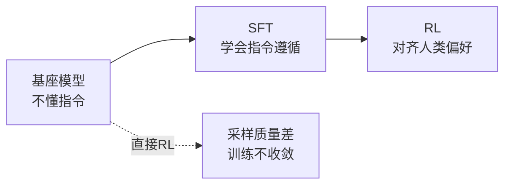

**结论**：SFT 提供"及格线"以上的策略，RL 在此基础上做"从及格到优秀"的优化。

---

## 3.4 偏好数据与奖励模型

奖励模型（Reward Model, RM）是 RLHF 的核心组件。它将人类的主观偏好转化为可优化的数学信号。本节先讨论偏好数据的收集方式，再深入奖励模型的架构与训练。

### 3.4.1 成对比较 vs 绝对评分

RLHF 通常采用成对比较（Pairwise Comparison）而非绝对评分来收集偏好数据。

**成对比较的优势：**

1. **认知负担低**：比较两个回答比给绝对分数更容易
2. **一致性高**：不同标注者对"哪个更好"更容易达成一致
3. **避免标定问题**：不同人对 5 分制的理解不同，但"A 比 B 好"更客观

**成对比较的劣势：**

1. **信息效率低**：$N$ 个回答只能产生 $O(N)$ 个比较对，而非 $N$ 个绝对分数
2. **不可传递性**：可能出现 A > B, B > C, C > A 的循环偏好
3. **缺乏绝对标准**：无法区分"都很好"和"都很差"的情况

### 3.4.2 奖励模型架构

RM 通常基于 SFT 模型构建，将最后一层语言模型头（Language Model Head）替换为标量输出头：

$$R_\phi(x, y) = w^T h_{last} + b$$

其中 $h_{last} \in \mathbb{R}^d$ 为最后一个 token 的隐藏状态（Hidden State），$w \in \mathbb{R}^d$ 和 $b \in \mathbb{R}$ 为可训练参数。

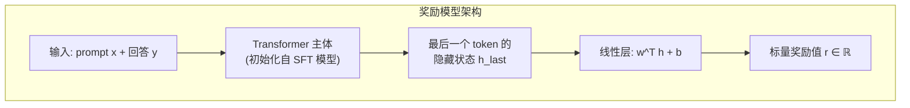

**RM 与 LLM 的关系：**
- RM 和 LLM 共享 Transformer 架构
- RM 的参数通常初始化自 $\pi_{SFT}$，复用其语义理解能力
- RM 输出标量奖励值，LLM 输出 token 概率分布

### 3.4.3 Bradley-Terry 模型与损失函数

Bradley-Terry 模型是一种经典的概率排序模型，假设偏好概率与奖励值之差的 sigmoid 函数成正比：

$$P(y_w \succ y_l | x) = \sigma(r(x, y_w) - r(x, y_l)) = \frac{1}{1 + e^{-(r(x,y_w) - r(x,y_l))}}$$

其中 $\sigma(\cdot)$ 为 sigmoid 函数，$r(x, y_w)$ 和 $r(x, y_l)$ 分别为优选回答和劣选回答的奖励值。

对该概率取负对数似然（Negative Log-Likelihood），得到 RM 的训练损失：

$$\mathcal{L}_{RM} = -\mathbb{E}_{(x, y_w, y_l)}\left[\log \sigma(r_\phi(x, y_w) - r_\phi(x, y_l))\right]$$

**直觉理解**：让 $y_w$ 的奖励高于 $y_l$ 的奖励，差值越大损失越小。梯度方向为增大 $r(x, y_w)$，减小 $r(x, y_l)$。

### 3.4.4 奖励模型训练详解

**训练数据构造流程：**

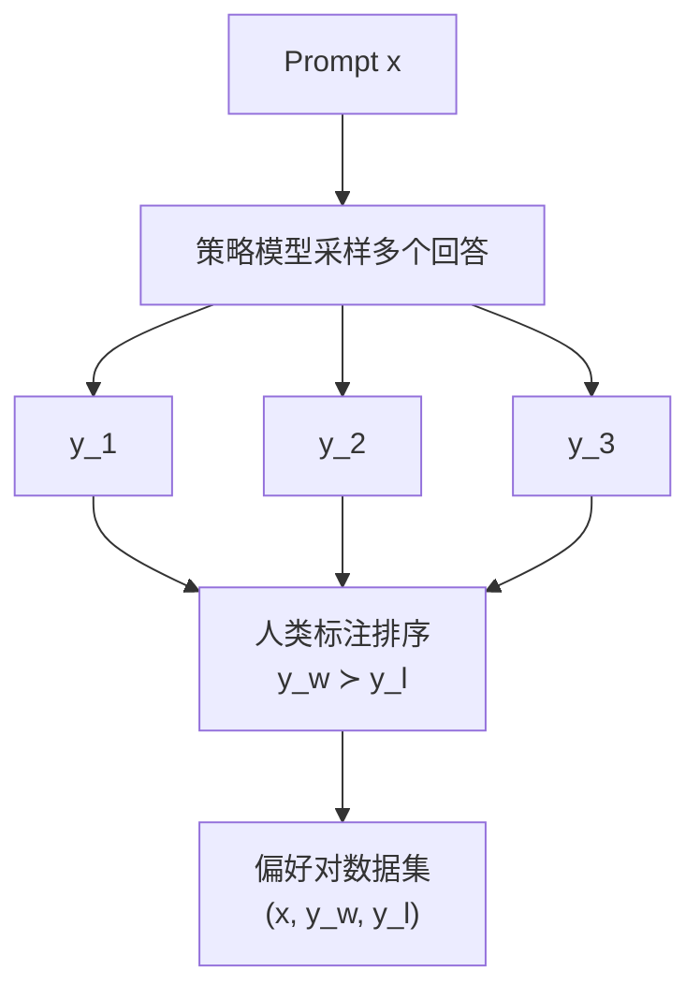

**关键训练配置：**

| 配置 | 典型值 |
|------|--------|
| 初始化 | 从 SFT 模型加载权重 |
| 学习率 | $1 \times 10^{-5}$ ~ $5 \times 10^{-6}$ |
| 训练轮数 | 1 epoch（防止过拟合） |
| 批大小 | 64-512 对 |
| 奖励裁剪 | $r \in [-5, 5]$，防止奖励值爆炸 |
| 损失函数 | Bradley-Terry + L2 正则 |

**关键训练技巧：**

1. **奖励白化（Reward Whitening）**：对 RM 输出做标准化 $r' = (r - \mu) / \sigma$，使奖励分布稳定
2. **长度惩罚项**：$r' = r - \lambda \cdot \text{len}(y)$，防止 RM 偏好冗长回答
3. **边际约束（Margin Constraint）**：$\mathcal{L} = -\log\sigma(r_w - r_l - m)$，其中 $m$ 为边际值，强制 $y_w$ 的奖励显著高于 $y_l$
4. **集成（Ensemble）**：训练多个 RM 取平均，减少单个 RM 的偏差

### 3.4.5 奖励模型的评估

| 指标 | 定义 | 含义 |
|------|------|------|
| 准确率 | $r_w > r_l$ 的比例 | 偏好排序正确率 |
| 一致性 | 同一 prompt 多次标注的一致率 | 标注质量 |
| 校准度 | 预测概率与实际频率的匹配度 | 奖励值可靠性 |

### 3.4.6 信用分配：Token 级 vs 序列级奖励

奖励信号的粒度直接影响训练效果。

**序列级奖励**——整个回答获得一个标量奖励 $r$，所有 token 共享：

$$R(x, y) = r, \quad \text{分配给 } y_1, y_2, ..., y_T$$

问题在于无法区分回答中哪些 token 贡献了正面或负面奖励。好的开头加坏的结尾，与坏的开头加好的结尾，可能获得相同奖励——这就是**信用分配难题（Credit Assignment Problem）**。

**Token 级奖励**——每个 token 获得独立的奖励信号：

$$R(x, y) = \sum_{t=1}^{T} r_t(y_t | y_{<t}, x)$$

优势是精确信用分配、训练信号更细粒度；挑战是 token 级奖励标注成本极高。

**实现方式：**

| 方法 | 说明 |
|------|------|
| 过程奖励模型（PRM, Process Reward Model） | 对推理的每一步打分（如 Math-Shepherd, PRM800K） |
| 结果奖励模型（ORM, Outcome Reward Model） | 只对最终结果打分，即序列级 |
| 自动 token 级分配 | 用 ORM 的梯度或注意力来估计 token 贡献 |

---

## 3.5 PPO 算法深度剖析

PPO（Proximal Policy Optimization，近端策略优化）是 RLHF 中最经典的强化学习算法，由 OpenAI 的 InstructGPT 和 ChatGPT 采用。本节从 RL 基础概念出发，逐步推导 PPO 的完整目标函数。

### 3.5.1 强化学习基础：贝尔曼方程

在深入 PPO 之前，需要理解强化学习的核心数学工具——贝尔曼方程（Bellman Equation）。

**状态价值函数（State Value Function）**描述了在状态 $s$ 下，遵循策略 $\pi$ 所能获得的期望累积回报：

$$V(s) = \mathbb{E}\left[r_t + \gamma V(s_{t+1}) | s_t = s\right]$$

即当前状态的价值 = 即时奖励 + 折扣因子 $\gamma$ 乘以下一状态的价值。

**动作价值函数（Action Value Function，Q 函数）**进一步考虑了具体动作：

$$Q(s, a) = \mathbb{E}\left[r_t + \gamma V(s_{t+1}) | s_t = s, a_t = a\right]$$

**贝尔曼最优方程**描述了最优策略下的价值函数：

$$V^*(s) = \max_a Q^*(s, a) = \max_a \mathbb{E}\left[r + \gamma V^*(s') | s, a\right]$$

$$Q^*(s, a) = \mathbb{E}\left[r + \gamma \max_{a'} Q^*(s', a') | s, a\right]$$

**在 LLM 中的对应关系：**

| RL 概念 | LLM 中的对应 |
|---------|-------------|
| 状态 $s$ | 已生成的 token 序列 $y_{<t}$ + prompt $x$ |
| 动作 $a$ | 下一个生成的 token $y_t$ |
| 奖励 $r$ | RM 给出的奖励（通常只在序列末尾） |
| $V(s)$ | Critic 网络的输出 |
| $Q(s,a)$ | 采取某 token 后的期望回报 |

### 3.5.2 为什么选择 PPO

| 算法 | 类型 | 方差 | 稳定性 | 适用性 |
|------|------|------|--------|--------|
| REINFORCE | 策略梯度 | 高（单样本估计） | 差 | 简单任务 |
| PPO | 策略梯度+裁剪 | 低（GAE 估计） | 好 | 连续/离散动作 |
| Q-learning | 值函数 | - | 不稳定（离散动作空间大） | 不适合 LLM |

**选 PPO 的三个核心原因：**
1. **裁剪机制（Clipping）**限制策略更新幅度，避免灾难性更新
2. **GAE（Generalized Advantage Estimation，广义优势估计）**降低方差，训练更稳定
3. LLM 的动作空间（词表大小通常为数万至十万）巨大，Q-learning 难以收敛

### 3.5.3 PPO 完整目标函数

PPO 的目标函数由三项组成：

$$\mathcal{L}^{CLIP+VF}(\theta) = \mathbb{E}_t\left[\mathcal{L}^{CLIP}(\theta) - c_1 \mathcal{L}^{VF}(\theta) + c_2 S[\pi_\theta](s_t)\right]$$

分别为：策略损失（Policy Loss）+ 价值损失（Value Loss）+ 熵正则（Entropy Bonus）。下面逐项拆解。

#### 第一项：$\mathcal{L}^{CLIP}$ —— 策略损失

$$\mathcal{L}^{CLIP}(\theta) = \mathbb{E}_t\left[\min\left(r_t(\theta)\hat{A}_t,\; \text{clip}(r_t(\theta), 1-\epsilon, 1+\epsilon)\hat{A}_t\right)\right]$$

**重要性采样比（Importance Sampling Ratio）** $r_t(\theta)$：

$$r_t(\theta) = \frac{\pi_\theta(a_t|s_t)}{\pi_{\theta_{old}}(a_t|s_t)}$$

含义：新策略在状态 $s_t$ 下采取动作 $a_t$ 的概率，与旧策略的比值。
- $r_t = 1$：新旧策略在该状态下行为一致
- $r_t > 1$：新策略更倾向于该动作
- $r_t < 1$：新策略更不倾向于该动作
- $r_t$ 过大意味着策略更新过于激进，需要 clip 机制限制

**Clip 操作**将 ratio 裁剪到 $[1-\epsilon, 1+\epsilon]$ 区间（通常 $\epsilon = 0.2$，即 $[0.8, 1.2]$）：

$$\text{clip}(r, 1-\epsilon, 1+\epsilon) = \begin{cases} 1-\epsilon & r < 1-\epsilon \\ r & 1-\epsilon \leq r \leq 1+\epsilon \\ 1+\epsilon & r > 1+\epsilon \end{cases}$$

**min 操作的核心作用**——取未裁剪值和裁剪值的较小者：

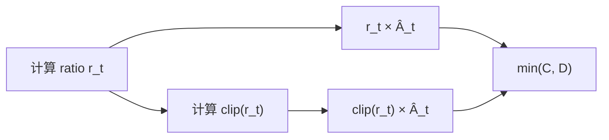

当 $\hat{A}_t > 0$（好动作）时：若 $r_t > 1+\epsilon$，clip 限制了过度增加该动作概率，取 min 防止"好的就无限放大"。

当 $\hat{A}_t < 0$（坏动作）时：若 $r_t < 1-\epsilon$，clip 限制了过度减少该动作概率，取 min 防止"坏的就无限缩小"。

#### 第二项：$\mathcal{L}^{VF}$ —— 价值损失

$$\mathcal{L}^{VF}(\theta) = (V_\theta(s_t) - \hat{R}_t)^2$$

Critic 网络预测的状态价值 $V(s)$ 与实际回报 $\hat{R}_t$ 之间的均方误差（MSE）。

#### 第三项：$S[\pi]$ —— 熵奖励

$$S[\pi](s) = -\sum_a \pi(a|s) \log \pi(a|s)$$

鼓励探索，防止策略过早收敛到确定性策略。系数 $c_2$ 通常为 0.01 ~ 0.001。

### 3.5.4 Returns 与 GAE

**Returns（回报）** $\hat{R}_t$ 是从时间步 $t$ 开始的累积折扣回报：

$$\hat{R}_t = \sum_{l=0}^{\infty} \gamma^l r_{t+l}$$

即从第 $t$ 步开始，未来所有奖励按折扣因子 $\gamma$（通常 $0 < \gamma \leq 1$）加权求和。

**Monte Carlo Returns**——直接用采样的轨迹计算：

$$\hat{R}_t = r_t + \gamma r_{t+1} + \gamma^2 r_{t+2} + ... + \gamma^{T-t} r_T$$

优点是无偏估计，缺点是高方差（单条轨迹噪声大）。

**TD（Temporal Difference）Returns**——用 Critic 预测替代实际回报：

$$\hat{R}_t = r_t + \gamma V(s_{t+1})$$

优点是低方差，缺点是有偏估计（依赖 $V$ 的准确性）。

**优势函数（Advantage Function）**衡量当前状态的实际回报超出预期多少：

$$\hat{A}_t = \hat{R}_t - V(s_t)$$

正值表示该状态比预期更好，负值表示更差。

**GAE（Generalized Advantage Estimation）**由 Schulman 等人提出，通过参数 $\lambda \in [0, 1]$ 在偏差和方差之间取得平衡：

$$\hat{A}_t^{GAE(\gamma,\lambda)} = \sum_{l=0}^{\infty} (\gamma\lambda)^l \delta_{t+l}$$

其中 TD 残差（TD Residual）$\delta_t = r_t + \gamma V(s_{t+1}) - V(s_t)$，正是贝尔曼方程的误差项。

展开形式：

$$\hat{A}_t^{GAE} = \delta_t + (\gamma\lambda)\delta_{t+1} + (\gamma\lambda)^2\delta_{t+2} + ...$$

| $\lambda$ 值 | 效果 | 等价于 |
|------------|------|--------|
| $\lambda = 1$ | 纯 Monte Carlo | 高方差、无偏 |
| $\lambda = 0$ | 纯 TD(0) | 低方差、有偏 |
| $\lambda = 0.95$（常用） | 折中 | 兼顾两者 |

**GAE 在大模型中的实现**：LLM 中通常使用 $\gamma=1$（无折扣），$\lambda=0.95$：

$$\hat{A}_t = \sum_{l=0}^{T-t} \lambda^l \delta_{t+l}, \quad \delta_l = r_l + V(s_{l+1}) - V(s_l)$$

注意：LLM 的 reward 通常只在序列末尾给出（序列级奖励），此时中间步的 $r_t = 0$，只有最后一步 $r_T \neq 0$。

### 3.5.5 KL 散度惩罚

在 RLHF 的 PPO 训练中，总目标函数还包含一个 KL 散度惩罚项：

$$\mathcal{L}_{total} = \mathbb{E}[R_\phi(x,y)] - \beta \cdot D_{KL}(\pi_\theta \| \pi_{ref})$$

KL 惩罚的三重作用：

1. **防止奖励黑客（Reward Hacking）**：约束策略不偏离参考模型太远
2. **保持生成质量**：避免模型为追求高奖励而退化（如重复、乱码）
3. **训练稳定性**：KL 项作为正则化，使训练更平滑

**KL 惩罚系数 $\beta$ 的调节至关重要：**

| $\beta$ 状态 | 表现 | 后果 |
|-------------|------|------|
| $\beta$ 过大 | 策略几乎不偏离 $\pi_{ref}$ | 奖励信号被压制，对齐效果弱，输出与 SFT 几乎相同 |
| $\beta$ 过小 | 策略大幅偏离 $\pi_{ref}$ | 奖励黑客风险高，输出可能退化为重复或乱码 |

**调节方法：**
1. **监控 KL 散度**：目标 KL 在 5-10 nats 左右，动态调整 $\beta$
2. **自适应 KL 控制器**：KL > 目标值时增大 $\beta$，KL < 目标值时减小 $\beta$
3. **观察奖励-KL 曲线**：找到奖励提升与 KL 增长的拐点

### 3.5.6 On-policy 与 Off-policy

理解 PPO 的数据使用方式，需要区分两种基本的 RL 训练范式。

| 类型 | 数据来源 | 代表算法 |
|------|---------|----------|
| On-policy（同策略） | 当前策略 $\pi_\theta$ 自身采集的数据 | PPO, REINFORCE |
| Off-policy（异策略） | 其他策略（旧策略/专家/回放池）采集的数据 | DQN, SAC, DPO |


**PPO 是 On-policy 的原因：**
1. **重要性采样比 $r_t$ 的限制**：当新旧策略差异过大时，$r_t$ 方差爆炸
2. **Clip 机制的假设**：clip 假设新旧策略接近（$r_t \approx 1$）
3. **LLM 场景的特殊性**：prompt 分布变化快，旧数据可能已过时

### 3.5.7 奖励黑客（Reward Hacking）

**定义**：模型找到奖励模型的漏洞，获得高奖励但实际输出质量差。

**典型场景**：对话系统中，RM 偏好冗长、礼貌的回答，模型学会生成大量无意义的客套话，获得高奖励但信息量为零。

**缓解策略：**

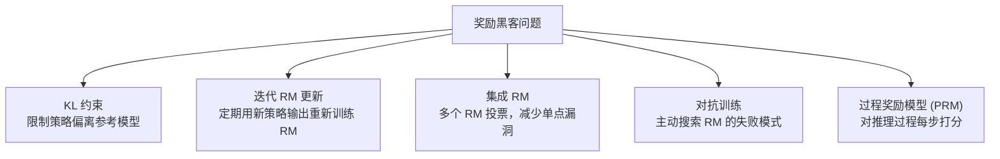

---

## 3.6 DPO：绕过奖励模型的直接偏好优化

PPO 虽然效果好，但需要同时维护四个模型（策略模型、参考模型、Critic 模型、奖励模型），工程复杂度和计算成本都很高。DPO（Direct Preference Optimization，直接偏好优化）提供了一条更简洁的路径。

### 3.6.1 核心思想

DPO 的核心洞察是：可以绕过显式的奖励模型训练和 RL 优化，直接从偏好数据优化策略。

### 3.6.2 数学推导

从 RLHF 的 KL 约束优化问题出发，其最优解具有封闭形式：

$$\pi^*(y|x) = \frac{1}{Z(x)}\pi_{ref}(y|x) \exp\left(\frac{r(x,y)}{\beta}\right)$$

其中 $Z(x) = \sum_y \pi_{ref}(y|x) \exp(r(x,y)/\beta)$ 为配分函数（Partition Function，归一化常数）。

从上式反解奖励函数：

$$r(x,y) = \beta \log \frac{\pi^*(y|x)}{\pi_{ref}(y|x)} + \beta \log Z(x)$$

将此式代入 Bradley-Terry 模型，由于 $Z(x)$ 只依赖于 $x$ 而不依赖于 $y$，在计算偏好概率的差值时被消去：

$$P(y_w \succ y_l | x) = \sigma\left(\beta \log \frac{\pi_\theta(y_w|x)}{\pi_{ref}(y_w|x)} - \beta \log \frac{\pi_\theta(y_l|x)}{\pi_{ref}(y_l|x)}\right)$$

### 3.6.3 DPO 损失函数

$$\mathcal{L}_{DPO} = -\mathbb{E}_{(x,y_w,y_l)}\left[\log \sigma\left(\beta \left(\log \frac{\pi_\theta(y_w|x)}{\pi_{ref}(y_w|x)} - \log \frac{\pi_\theta(y_l|x)}{\pi_{ref}(y_l|x)}\right)\right)\right]$$

**符号解释：**
- $\pi_\theta$：正在训练的策略模型
- $\pi_{ref}$：冻结的参考模型（通常为 SFT 模型）
- $y_w, y_l$：优选回答和劣选回答
- $\beta$：温度参数，控制偏好的锐度
- $\sigma$：sigmoid 函数

**直觉理解**：DPO 隐式地将奖励定义为策略相对于参考模型的对数概率比，无需显式训练奖励模型。

### 3.6.4 DPO vs PPO 对比

| 维度 | PPO | DPO |
|------|-----|-----|
| 是否需要 RM | 需要 | 不需要 |
| 是否需要 RL 采样 | 需要 | 不需要 |
| 训练稳定性 | 低（4 个模型） | 高（2 个模型） |
| 计算成本 | 高 | 低 |
| 在线/离线 | 在线（采样新数据） | 离线（固定数据集） |
| 奖励黑客风险 | 有 | 较低 |
| 理论最优性 | 最优（在线） | 近似最优（离线） |

DPO 是 Off-policy 的：它使用固定的偏好数据集 $(x, y_w, y_l)$ 训练，这些数据可以是任何策略生成的，不需要当前策略采集。

| 维度 | PPO (On-policy) | DPO (Off-policy) |
|------|------------------|-------------------|
| 数据效率 | 低（每轮重采样） | 高（数据复用） |
| 训练稳定性 | 需调超参多 | 更稳定 |
| 在线学习 | 支持 | 不支持（需固定数据） |
| 奖励黑客风险 | 有（在线探索） | 较低 |

---

## 3.7 GRPO：组内相对策略优化

GRPO（Group Relative Policy Optimization，组内相对策略优化）由 DeepSeek 提出，是 PPO 的一种轻量化替代方案。其核心创新是去掉 Critic 网络，用组内相对奖励作为基线来估计优势函数。

### 3.7.1 核心思想与架构对比


### 3.7.2 优势值计算

对每个 prompt $q$，采样 $G$ 个回答 $\{o_1, ..., o_G\}$，获得奖励 $\{r_1, ..., r_G\}$。

计算组均值和组标准差：

$$\mu_r = \frac{1}{G}\sum_{i=1}^{G} r_i, \quad \sigma_r = \sqrt{\frac{1}{G}\sum_{i=1}^{G}(r_i - \mu_r)^2}$$

归一化优势：

$$\tilde{A}_i = \frac{r_i - \mu_r}{\sigma_r}$$

**归一化的意义：**

| 性质 | 说明 |
|------|------|
| 零均值 | $\sum \tilde{A}_i = 0$，正负优势数量平衡 |
| 单位方差 | $\text{Var}(\tilde{A}) = 1$，不同 prompt 间的优势可比 |
| 相对性 | 优势只反映"在当前组内相对好坏"，与绝对奖励值无关 |

### 3.7.3 GRPO 目标函数

$$\mathcal{L}_{GRPO} = \mathbb{E}\left[\frac{1}{G}\sum_{i=1}^{G}\min\left(\frac{\pi_\theta(o_i|q)}{\pi_{old}(o_i|q)}\tilde{A}_i, \text{clip}(\cdot)\tilde{A}_i\right) - \beta D_{KL}(\pi_\theta \| \pi_{ref})\right]$$

结构上与 PPO 类似（保留了 clip 机制和 KL 约束），但优势函数的计算方式完全不同。

### 3.7.4 优势值计算流程

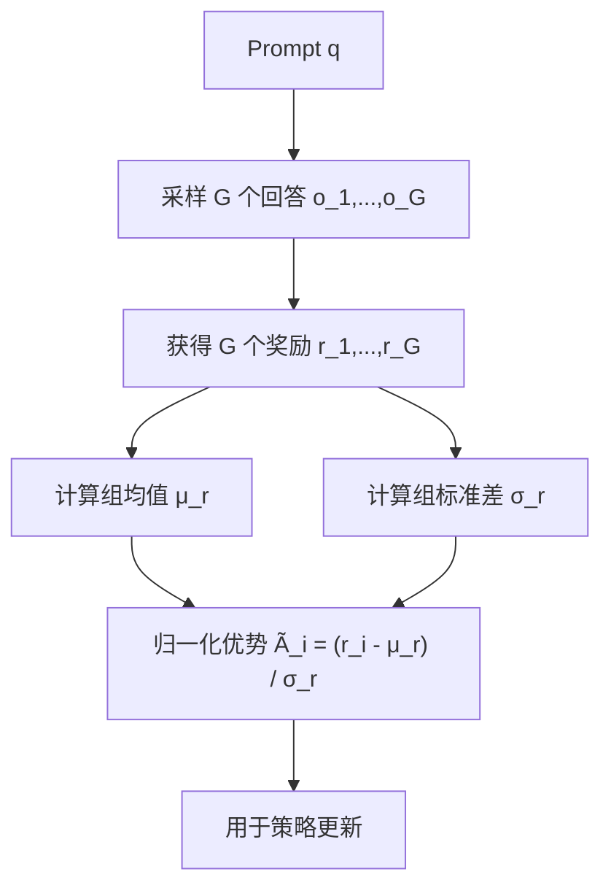

### 3.7.5 与 PPO 优势估计的本质区别

| | PPO GAE | GRPO 组内归一化 |
|---|---|---|
| 基线来源 | Critic 网络 $V(s)$ | 组均值 $\mu_r$ |
| 优势含义 | 比预期好多少 | 比组内平均好多少 |
| 额外模型 | 需要 Critic | 不需要 |
| 粒度 | Token 级 | 序列级 |
| 方差 | 低（GAE 平滑） | 中（依赖 G 的大小） |
| 偏差 | 有（Critic 不准时） | 无（纯统计量） |

**局限性：**
1. 序列级粒度——整个回答一个优势值，无法区分回答内部的好坏部分
2. 组内依赖——同一回答在不同组中优势不同
3. G 敏感——G 太小时归一化噪声大，G 太大时计算成本高
4. 长度偏差——长回答更容易获得正优势

GRPO 本质是 On-policy（每组回答由当前策略采样），但组内相对比较降低了 on-policy 的严格性要求。

### 3.7.6 Group 大小 G 的影响

| G 的大小 | 优势 | 劣势 |
|---------|------|------|
| **G 小（2-4）** | 计算成本低、采样快 | 归一化估计噪声大、容易受极端值影响 |
| **G 中（8-16）** | 归一化较稳定、计算可接受 | 平衡点 |
| **G 大（32-64+）** | 归一化稳定、优势估计准确 | 计算成本高（每 prompt 需生成 G 个完整回答） |

**关键权衡：**
1. **估计质量 vs 计算成本**：G 越大，$\tilde{A}_i$ 的估计越准确，但每个 prompt 的推理成本线性增长
2. **多样性 vs 收敛速度**：G 大时组内多样性高，能更好区分好坏；但每步更新信息量大，可能收敛更慢
3. **极端情况**：$G=2$ 退化为成对比较，等价于 DPO 的在线版本；$G \to \infty$ 归一化趋近真实分布的标准化，但计算不可行

**实践建议：**
- 数学推理任务：$G=16$（需要精确区分推理质量）
- 对话任务：$G=8$（回答质量差异较明显）
- DeepSeek-R1 使用 $G=16$

### 3.7.7 GRPO 的长度偏差问题

GRPO 倾向于生成长篇大论，根本原因是长度偏差形成的正反馈循环：

$$\tilde{A}_i = \frac{r_i - \text{mean}(r)}{\text{std}(r)}$$

**问题链条：**
1. 长回答更容易获得高奖励（更详细、更完整，RM 倾向给高分）
2. 组内比较放大长度优势（长回答奖励普遍高于短回答，归一化后长回答优势为正）
3. 策略梯度强化长度（正优势增加该序列的概率，模型学会"写长一点"）
4. 正反馈循环（模型越写越长，RM 越给高分，继续写长）

**数学解释**：设序列级奖励 $r = f(\text{quality}) + g(\text{length})$，其中 $g$ 为长度带来的奖励偏差。当 $g > 0$ 时，长序列获得更高奖励，优势函数 $\tilde{A}$ 为正，策略梯度推动模型生成更长序列。

**缓解方法：**

| 方法 | 原理 |
|------|------|
| **长度惩罚** | $r' = r - \lambda \cdot \text{len}(y)$，在奖励中减去长度项 |
| **DAPO 的 token 级损失归一化** | 对长序列的 loss 除以 token 数，防止长序列梯度主导 |
| **组内长度匹配** | 在同一组内只比较长度相近的回答 |
| **过程奖励模型（PRM）** | 对每步打分而非整体打分，减少长度偏差 |
| **最大长度约束** | 限制生成长度上限 |

### 3.7.8 熵崩（Entropy Collapse）

**定义**：策略熵 $H(\pi) = -\sum_a \pi(a|s) \log \pi(a|s)$ 急剧下降趋近于 0，意味着策略变为确定性策略（每个状态只选一个动作），丧失探索能力。

**表现：**
1. 生成输出高度重复、模式化
2. 不同 prompt 产生相似的回答
3. 训练 loss 继续下降但验证指标停滞或下降
4. 策略熵曲线骤降

**原因：**
1. 奖励信号过于稀疏——只有少数回答获得正奖励，策略快速收敛到这些模式
2. KL 惩罚不足——策略偏离参考模型太远
3. 学习率过大——更新步幅太大，快速坍缩到局部最优
4. G 过小——组内比较样本不足，优势估计偏差大

**缓解方法：**

| 方法 | 原理 |
|------|------|
| 熵正则项 | 在目标函数中加入 $c \cdot H(\pi)$，直接惩罚低熵 |
| 增大 KL 惩罚 $\beta$ | 约束策略不偏离参考模型太远 |
| 降低学习率 | 减小更新步幅，避免快速坍缩 |
| 增大 G | 更稳定的优势估计 |
| 温度调节 | 采样时提高温度，增加多样性 |
| 早停 | 监控策略熵，低于阈值时停止训练 |

---

## 3.8 GRPO 的改进变体：GSPO 与 DAPO

GRPO 虽然简化了 PPO 的架构，但仍存在长度偏差、损失归一化等问题。GSPO 和 DAPO 分别从不同角度进行了改进。

### 3.8.1 GSPO（Group Relative Policy Optimization with Sequence-level Balancing）

在 GRPO 基础上引入序列级别的平衡策略，解决不同长度回答之间的奖励不公平问题。核心改进是对不同长度的序列进行长度归一化或分组比较。

### 3.8.2 DAPO（Dynamic Advantage Policy Optimization）

DAPO 由 DeepSeek 提出，针对 GRPO 的三个痛点进行了改进：

1. **动态采样（Dynamic Sampling）**：过滤掉准确率为 0 或 1 的 prompt（太简单或太难），保持有效训练信号
2. **Token 级损失归一化**：在长序列上对 loss 做长度归一化，防止短回答梯度被稀释
3. **解耦裁剪（Decoupled Clipping）**：正负优势使用不同的裁剪范围

$$\mathcal{L}_{DAPO} = \mathbb{E}\left[\min\left(r_t(\theta)\tilde{A}_t, \text{clip}(r_t(\theta), 1-\epsilon_{low}, 1+\epsilon_{high})\tilde{A}_t\right)\right]$$

当 $\tilde{A}_t > 0$（正优势）用 $\epsilon_{high}$，当 $\tilde{A}_t < 0$（负优势）用 $\epsilon_{low}$。这种非对称裁剪允许对好动作给予更大的更新幅度。

### 3.8.3 GRPO vs DAPO 关键区别

| | GRPO | DAPO |
|---|---|---|
| 采样策略 | 固定 | 动态过滤无效 prompt |
| 损失归一化 | 序列级 | Token 级长度归一化 |
| 裁剪范围 | 对称 | 非对称（解耦） |

---

## 3.9 PPO vs GRPO vs DPO：全面对比

经过前面几节的分别讲解，本节将三种主流对齐算法放在一起进行系统对比。

### 3.9.1 架构对比

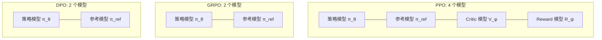

### 3.9.2 目标函数对比

**PPO**：$\mathcal{L}_{PPO} = \mathbb{E}\left[\min\left(r_t(\theta)\hat{A}_t, \text{clip}(r_t(\theta), 1-\epsilon, 1+\epsilon)\hat{A}_t\right)\right] - \beta D_{KL}(\pi_\theta \| \pi_{ref})$

其中 $\hat{A}_t$ 由 Critic 网络 + GAE 计算。

**GRPO**：$\mathcal{L}_{GRPO} = \mathbb{E}\left[\frac{1}{G}\sum_{i=1}^{G}\min\left(\frac{\pi_\theta(o_i|q)}{\pi_{old}(o_i|q)}\tilde{A}_i, \text{clip}(\cdot)\tilde{A}_i\right) - \beta D_{KL}(\pi_\theta \| \pi_{ref})\right]$

其中 $\tilde{A}_i = (r_i - \text{mean}(r))/\text{std}(r)$，组内归一化，无需 Critic。

**DPO**：$\mathcal{L}_{DPO} = -\mathbb{E}_{(x,y_w,y_l)}\left[\log \sigma\left(\beta\left(\log\frac{\pi_\theta(y_w|x)}{\pi_{ref}(y_w|x)} - \log\frac{\pi_\theta(y_l|x)}{\pi_{ref}(y_l|x)}\right)\right)\right]$

无需采样，直接从偏好数据优化。

### 3.9.3 关键维度对比

| 维度 | PPO | GRPO | DPO |
|------|-----|------|-----|
| 模型数量 | 4 | 2 | 2 |
| 显存占用 | 最高 | 中 | 最低 |
| 是否需要 RM | 需要 | 不需要（规则/验证器） | 不需要 |
| 是否需要 Critic | 需要 | 不需要 | 不需要 |
| 在线/离线 | 在线 | 在线 | 离线 |
| 采样方式 | 每步 1 个样本 | 每 prompt 采样 G 个 | 无需采样 |
| 优势估计 | GAE（Critic+TD） | 组内归一化 | 隐式（偏好对差） |
| 奖励粒度 | Token 级/序列级 | 序列级 | 序列级 |
| 训练稳定性 | 低（需调 4 个模型） | 中 | 高 |
| 奖励黑客风险 | 高 | 中 | 低 |
| 数据效率 | 低（每轮重采样） | 中（G 个样本） | 高（数据复用） |
| 理论最优性 | 最优（在线） | 近似最优 | 近似最优（离线） |
| 长度偏差 | 有 | 有（较严重） | 较少 |
| 代表应用 | InstructGPT, ChatGPT | DeepSeek-R1 | Llama 2, 多数开源模型 |

### 3.9.4 适用场景推荐

| 场景 | 推荐算法 | 原因 |
|------|---------|------|
| 大规模生产级对齐 | PPO | 在线学习，持续优化 |
| 可验证任务（数学/代码） | GRPO + RLVR | 无需 RM，验证器客观 |
| 资源有限，快速对齐 | DPO | 简单高效，无需采样 |
| 需要细粒度奖励 | PPO | Critic 提供 token 级信号 |
| 推理能力提升 | GRPO | 组内对比激发推理链 |

---

## 3.10 RLVR：基于可验证奖励的强化学习

RLVR（Reinforcement Learning from Verifiable Rewards，基于可验证奖励的强化学习）是近年来的重要突破，它用客观的程序验证器替代主观的人类偏好，为 RL 训练提供了更可靠的奖励信号。

### 3.10.1 与 RLHF 的区别

| | RLHF | RLVR |
|---|---|---|
| 奖励来源 | 人类偏好训练的 RM | 规则/程序验证器 |
| 奖励性质 | 主观、连续 | 客观、二值（0/1） |
| 是否需要 RM | 需要 | 不需要 |
| 适用任务 | 对话、摘要等开放任务 | 数学、代码等可验证任务 |
| 奖励黑客风险 | 高 | 极低（验证器不可欺骗） |

### 3.10.2 典型验证器

| 任务 | 验证器 | 奖励 |
|------|--------|------|
| 数学推理 | 答案正确性检查 | $r = 1$ if correct else $0$ |
| 代码生成 | 单元测试执行 | $r = \text{pass\_rate}$ |
| 逻辑推理 | 形式化验证器 | $r = 1$ if valid else $0$ |

### 3.10.3 RLVR 流程

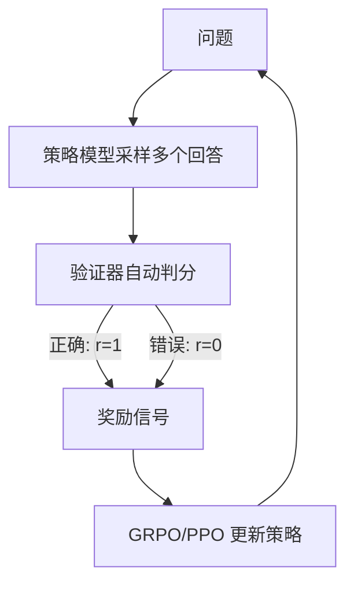

### 3.10.4 优势与局限

**优势：**
1. **零标注成本**：不需要人类标注偏好
2. **无 RM 偏差**：验证器是客观的
3. **无奖励黑客**：无法欺骗代码执行器或数学验证器
4. **DeepSeek-R1 的核心方法**：用 RLVR 训练推理能力，再蒸馏到小模型

**局限：**
1. 仅适用于有明确正确答案的任务
2. 二值奖励信号稀疏，可能导致训练困难
3. 无法处理开放式、主观性任务

### 3.10.5 RM 与 RLVR 的互补关系

| | Reward Model | RLVR |
|---|---|---|
| 奖励来源 | 从人类偏好数据学习 | 规则/程序验证器 |
| 奖励性质 | 主观、连续值 | 客观、二值（0/1） |
| 训练成本 | 高（需标注偏好数据） | 低（只需验证器） |
| 适用范围 | 开放式任务 | 可验证任务（数学/代码） |
| 奖励黑客风险 | 高 | 极低 |

**互补使用**：RLVR 用于可验证任务（数学推理），RM 用于开放式任务（对话、创意写作）。DeepSeek-R1 先用 RLVR 训练推理能力，再用 RM 做通用对齐。

---

## 3.11 RLAIF：用 AI 反馈替代人类反馈

RLAIF（Reinforcement Learning from AI Feedback，基于 AI 反馈的强化学习）用 AI 模型（通常是更强的 LLM）替代人类标注者提供偏好反馈。

### 3.11.1 流程

1. 用策略模型对同一 prompt 生成多个回答
2. 用 AI 评判器（如 GPT-4）对回答进行排序或打分
3. 用 AI 偏好数据训练 RM 或直接 DPO
4. 优化策略模型

### 3.11.2 潜力

1. **规模**：AI 反馈可大规模生成，不受人类标注瓶颈
2. **一致性**：AI 评判比人类更一致
3. **成本**：远低于人类标注

### 3.11.3 风险

1. **偏见放大**：AI 评判器的偏见会被注入对齐过程
2. **自我强化**：模型可能放大自身的错误偏好
3. **评估标准漂移**：AI 评判标准可能与人类真实偏好不一致
4. **Constitutional AI 方法**：Anthropic 提出用一组原则（"宪法"）来指导 AI 评判，减少偏见

---

## 3.12 思维链（CoT）与推理能力

思维链（Chain-of-Thought, CoT）是 RL 训练中提升推理能力的关键技术。本节讨论 CoT 的必要性及其质量评估方法。

### 3.12.1 直接回答 vs CoT 回答

| 维度 | 直接回答 | CoT 回答 |
|------|---------|---------|
| 推理路径 | 隐式（模型内部） | 显式（文本可见） |
| 可验证性 | 无法检查推理过程 | 可逐步检查 |
| 准确率 | 复杂推理任务显著低 | 高（尤其数学/逻辑） |
| 计算量 | 少 | 多（生成长度增加） |
| 训练信号 | 稀疏（只有最终答案对错） | 密集（每步都有信号） |

### 3.12.2 数学解释

直接回答只预测答案：$P(y|x) = P(a|x)$

CoT 回答将推理分解为多步：

$$P(y|x) = \prod_{t=1}^{T} P(s_t | x, s_{<t}) \cdot P(a | x, s_{1:T})$$

其中 $s_1, ..., s_T$ 为推理步骤，$a$ 为最终答案。链式分解将复杂概率估计分解为多个简单的条件概率估计，每个条件概率更容易学习。

### 3.12.3 CoT 对 RL 训练的好处

1. **信用分配更精确**：PRM 可对每步打分，而非只看最终结果
2. **RLVR 可用**：验证器可检查中间步骤的正确性
3. **探索空间缩小**：模型在推理链空间搜索，而非直接在答案空间搜索
4. **DeepSeek-R1 的发现**：GRPO + RLVR 训练中，CoT 推理链自发涌现

### 3.12.4 思维链质量评估方法

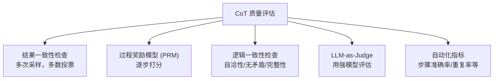

**1. 结果一致性检查**：对同一问题采样多条 CoT，检查最终答案是否一致：

$$\text{Consistency} = \frac{\text{多数投票正确次数}}{\text{总采样次数}}$$

**2. 过程奖励模型（PRM）**：训练一个模型对 CoT 的每一步打分：

$$\text{PRM-Score} = \prod_{t=1}^{T} P(\text{correct}_t | x, s_{<t})$$

| ORM（结果奖励） | PRM（过程奖励） |
|----------------|----------------|
| 只对最终答案打分 | 对每步推理打分 |
| 信用分配模糊 | 信用分配精确 |
| 标注成本低 | 标注成本高（需逐步标注） |
| 代表：ORM800K | 代表：PRM800K, Math-Shepherd |

**3. 逻辑一致性检查**：自洽性（结论是否从前提逻辑推出）、无矛盾（内部不存在相互矛盾的陈述）、完整性（是否覆盖所有必要中间结论）。

**4. LLM-as-Judge 评估**：用强模型（如 GPT-4）从正确性、完整性、简洁性、可读性等维度评估 CoT 质量。

**5. 自动化指标**：

| 指标 | 计算方式 | 含义 |
|------|---------|------|
| 步骤准确率 | 正确步骤数 / 总步骤数 | 推理过程正确性 |
| 答案准确率 | 最终答案正确率 | 结果正确性 |
| CoT 长度 | Token 数 | 效率 |
| 重复率 | 重复片段占比 | 是否陷入循环 |

---

## 3.13 RL 训练中的常见问题与对策

RL 对齐训练虽然效果显著，但在实践中面临多种挑战。本节系统梳理最常见的问题及其解决方案。

### 3.13.1 灾难性遗忘（Catastrophic Forgetting）

**定义**：RL 训练过程中，模型在追求高奖励时丢失了预训练或 SFT 阶段习得的能力。

**表现：**

| 遗忘类型 | 具体表现 |
|---------|---------|
| 通用能力退化 | 常识问答、数学推理等能力下降 |
| 语言质量退化 | 语法错误、不连贯、重复 |
| 指令遵循退化 | 不再按要求格式输出 |
| 多语言退化 | 非英语能力显著下降 |

**原因：**
1. **参数覆盖**：RL 更新直接修改预训练权重，覆盖原有知识
2. **分布偏移**：RL 的 prompt 分布不等于预训练数据分布
3. **奖励导向偏颇**：RM 只奖励特定维度，忽略其他能力

**缓解方法：**

| 方法 | 原理 |
|------|------|
| KL 散度约束 | 限制策略偏离 $\pi_{ref}$，保留 SFT 能力 |
| 混合训练 | RL 训练中混入 SFT 数据，定期"复习" |
| EWC（Elastic Weight Consolidation，弹性权重巩固） | 对重要参数施加更新惩罚 |
| LoRA 微调 | 冻结基座参数，只训练低秩适配器（Low-Rank Adapter），不修改原始权重 |
| 多任务奖励 | RM 同时评估多个维度，避免单维度优化 |
| 渐进式训练 | 先小 $\beta$ 后大 $\beta$，逐步对齐 |

### 3.13.2 模式化与奉承问题（Sycophancy）

**可能原因：**
1. **RM 偏差**：RM 偏好"讨好"用户的回答（如赞同用户观点），模型学会奉承
2. **偏好数据偏差**：标注者偏好表面礼貌但缺乏实质的回答
3. **分布偏移**：离线评估的 prompt 分布不等于线上分布
4. **奖励黑客**：模型找到 RM 的漏洞，产生高奖励但低质量的模式化输出

**解决方向：**

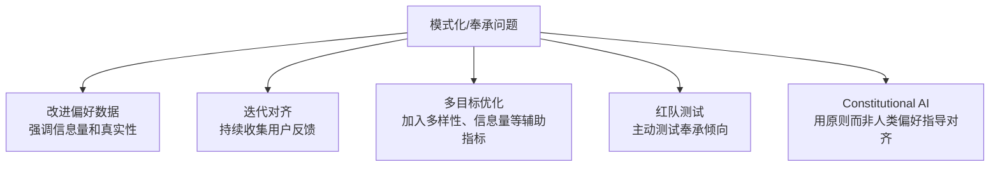

---

## 3.14 SFT 数据构建与效果评估

SFT 是 RLHF 流程的基石。本节详细介绍 SFT 数据的构建全流程和效果评估方法。

### 3.14.1 数据构建全流程

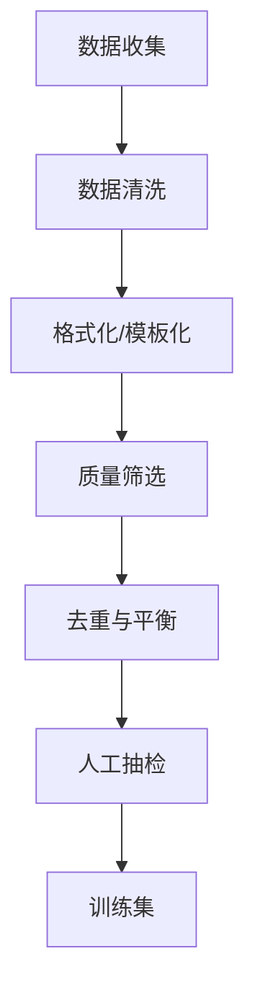

**1. 数据收集**

| 来源 | 描述 | 质量 |
|------|------|------|
| 开源指令数据 | Alpaca, ShareGPT, Open-Orca | 中（需筛选） |
| 自我指令（Self-Instruct） | 用强模型生成指令-回答对 | 中高 |
| 人类标注 | 人工编写指令和回答 | 高（成本高） |
| 现有数据改写 | 将 NLP 数据集转为指令格式 | 中 |

**2. 数据清洗**：去除含 PII（Personally Identifiable Information，个人身份信息）的数据、过短/过长的样本、乱码和编码错误，以及非目标语言的内容。

**3. 格式化/模板化**——统一为对话格式：

```
<|im_start|>system
你是一个有帮助的助手。<|im_end|>
<|im_start|>user
{instruction}<|im_end|>
<|im_start|>assistant
{response}<|im_end|>
```

**4. 质量筛选**

| 方法 | 描述 |
|------|------|
| 困惑度过滤 | 用基座模型计算 PPL（Perplexity），过滤过高/过低的 |
| LLM 评分 | 用 GPT-4 对每条数据打分，保留高分 |
| 规则过滤 | 检查回答是否完整、是否与问题相关 |
| 多样性过滤 | 去除语义重复的指令 |

**5. 去重与平衡**：使用 MinHash/SimHash 去除相似度超过阈值的样本；确保各任务类型（推理/创作/问答/代码等）比例合理；混合简单和复杂样本。

**6. 人工抽检**：随机抽取 5-10% 人工审核，检查回答正确性、格式规范性、安全性。不合格率超过 5% 则需重新清洗。

**数据量参考：**

| 模型规模 | SFT 数据量 |
|---------|-----------|
| 7B | 50K-200K 条 |
| 13B-34B | 100K-500K 条 |
| 70B+ | 200K-1M 条 |

**关键原则**：数据质量远重要于数据数量。10K 高质量数据优于 100K 低质量数据。

### 3.14.2 SFT 效果评估

**评估维度与指标：**

| 维度 | 指标 | 方法 |
|------|------|------|
| 指令遵循 | 格式正确率、约束满足率 | 自动规则检查 + LLM-as-Judge |
| 回答质量 | 相关性、完整性、准确性 | 人工评估 + GPT-4 评分 |
| 安全性 | 有害输出率、拒绝率 | 安全分类器 + 红队测试 |
| 通用能力 | MMLU / C-Eval / HumanEval 等 | 基准测试 |
| 对比基座 | 各项指标增益 | A/B 测试 |

**判断 SFT 已达标的信号：**
1. **Loss 收敛**：训练 loss 和验证 loss 均已平稳，验证 loss 不再下降
2. **基准饱和**：目标基准测试分数不再随训练步数提升
3. **人工抽检**：随机抽样 200-500 条，人工评分 > 4.0/5.0
4. **对比停止提升**：与上一 checkpoint 对比，人工偏好无明显差异
5. **过拟合信号**：验证 loss 开始上升则立即停止

**常见问题：**

| 问题 | 表现 | 解决 |
|------|------|------|
| 过拟合 | 训练 loss 下降，验证 loss 上升 | 早停、增大数据量、加正则 |
| 灾难性遗忘 | 通用能力下降 | 降低学习率、混合通用数据 |
| 格式不稳定 | 输出格式不一致 | 增加格式约束数据 |

---

## 3.15 技术选型：SFT vs RL vs RAG

在实际项目中，选择合适的技术路径至关重要。本节提供系统的选型指南。

### 3.15.1 什么时候用 SFT

| 场景 | 示例 |
|------|------|
| 新任务/新领域适配 | 医疗/法律领域微调 |
| 格式/风格调整 | JSON 输出、特定语气 |
| 指令遵循能力基础构建 | 从基座模型到对话模型 |
| 数据充足且质量可控 | 有大量高质量标注数据 |

### 3.15.2 什么时候用 RL（而非 SFT）

| 场景 | 原因 |
|------|------|
| 需要区分好坏程度 | SFT 只见过"好"，RL 能学"更好" |
| 安全性对齐 | "无害"比"有用"更重要，RL 可精确控制权衡 |
| 减少幻觉 | RM 可惩罚事实错误，SFT 无法 |
| 提升推理能力 | RL 可奖励正确推理链，而不仅是答案 |
| 人类偏好复杂 | 偏好是多维度的（安全+有用+简洁+诚实），交叉熵无法表达 |

### 3.15.3 什么时候用 RAG（而非 SFT/RL）

RAG（Retrieval-Augmented Generation，检索增强生成）适用于知识密集型场景：

| 场景 | 原因 |
|------|------|
| 知识频繁变化 | 新闻、法规、产品信息等时效性强的知识 |
| 需要事实溯源 | 回答必须引用来源，不可编造 |
| 私有/敏感知识 | 企业内部文档，不应注入模型权重 |
| 长尾知识 | 预训练/SFT 数据中极少出现的专业知识 |

### 3.15.4 组合使用策略

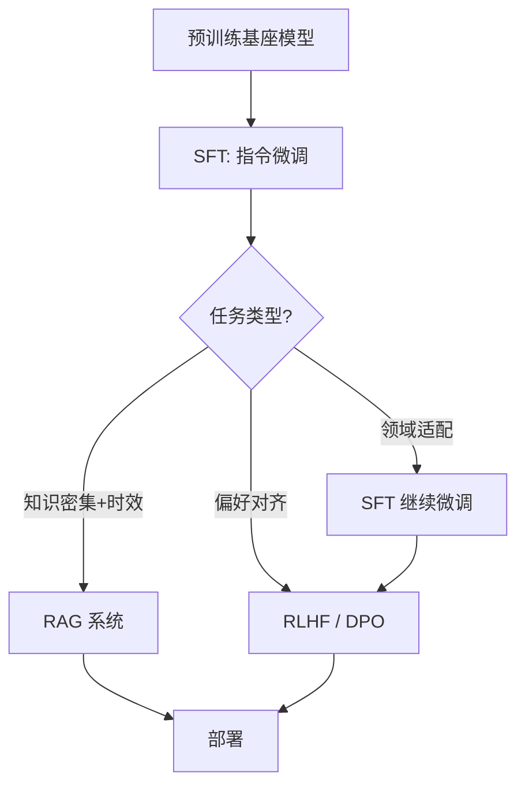

典型组合：
- **PT -> SFT -> RL(DPO)** 用于通用对话模型
- **PT -> SFT + RAG** 用于知识密集型应用

---

## 3.16 Human-in-the-loop 与模型标注的挑战

在大规模对齐训练中，常用 LLM 替代人类进行数据标注（如偏好排序、指令生成、质量评分），形成"模型标注 -> 训练模型"的闭环。这种方式虽然高效，但存在多种风险。

### 3.16.1 数据质量退化

| 问题 | 原因 | 后果 |
|------|------|------|
| 标注噪声 | 模型对边界案例判断不准 | 训练数据含错误标签 |
| 一致性过高 | 模型输出缺乏人类多样性 | 训练数据缺乏覆盖度 |
| 长尾缺失 | 模型对罕见情况处理差 | 训练数据分布偏移 |

### 3.16.2 标注偏差

| 偏差类型 | 表现 | 影响 |
|---------|------|------|
| 自我偏好 | 模型偏好自己风格的回答 | 训练后模型输出更趋同 |
| 长度偏差 | 偏好冗长回答 | 模型学会"凑字数" |
| 格式偏差 | 偏好特定格式（如 Markdown） | 忽略内容质量 |
| 位置偏差 | 对列表中靠前的选项给更高分 | 排序结果不可靠 |

### 3.16.3 偏见放大（Echo Chamber）

$$\text{模型}_A \xrightarrow{\text{标注数据}} \text{模型}_B \xrightarrow{\text{标注数据}} \text{模型}_C \xrightarrow{} ...$$

每一代模型放大上一代的偏见，形成正反馈循环。人类标注可追问理由，模型标注无法解释；模型标注的错误模式系统性更强，更难发现。

### 3.16.4 缓解策略

| 策略 | 原理 |
|------|------|
| 人类抽检 | 随机抽取 5-10% 由人类复核 |
| 多模型投票 | 多个不同模型标注取多数 |
| 偏差检测 | 统计分析标注分布，检测异常模式 |
| 混合标注 | 关键数据人类标注，大量数据模型标注 |
| 对抗样本 | 主动构造边界案例测试标注质量 |
| Constitutional AI | 用原则约束模型标注行为 |

---

## 3.17 持续学习与 RL 的未来方向

### 3.17.1 持续学习的核心挑战

在不停机的情况下，让模型持续从新数据中学习，同时不遗忘旧知识。这涉及一个经典的两难问题：

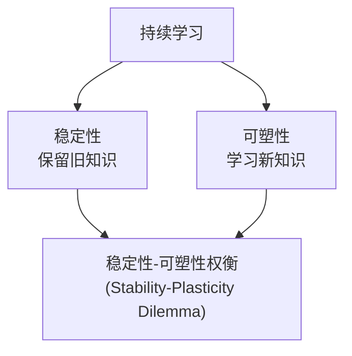

### 3.17.2 LLM 中的持续学习方法

| 方法 | 原理 | 优劣 |
|------|------|------|
| 持续 SFT | 新数据上继续 SFT | 简单但遗忘严重 |
| 持续 RL | 新偏好数据上继续 RL | 可适配新偏好但需 RM |
| LoRA 增量 | 每个新任务加新 LoRA | 不遗忘但参数膨胀 |
| EWC | 对重要参数加更新惩罚 | 需计算 Fisher 信息矩阵 |
| 经验回放 | 混合新旧数据训练 | 简单有效但需存储旧数据 |

### 3.17.3 RL 在 LLM 中的未来方向

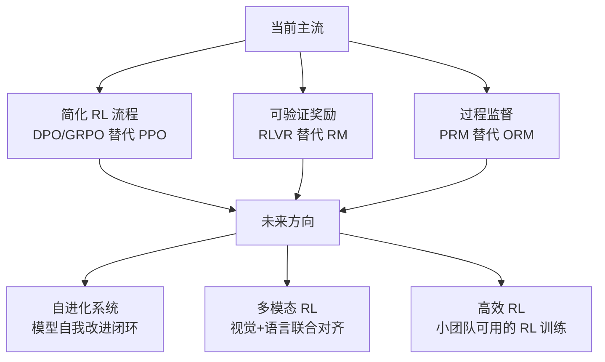

1. **RLVR 扩展**：从数学/代码扩展到更多可验证领域（科学推理、法律论证）
2. **多模态 RL**：视觉-语言联合强化学习，对齐多模态偏好
3. **过程监督**：PRM 替代 ORM，提供更细粒度的训练信号
4. **自进化系统**：模型自主生成训练数据 + 自我验证 + 自我改进循环
5. **高效 RL**：降低 RL 训练的计算成本，使小团队也能做 RL 对齐
6. **在线对齐**：部署后持续从用户反馈中学习，而非一次性对齐

### 3.17.4 核心判断

1. **RL 是必要的**：SFT 无法替代 RL 的偏好优化能力
2. **RL 正在变简单**：从 PPO（4 模型）到 GRPO（2 模型）到 DPO（2 模型离线）
3. **RLVR 是突破口**：可验证奖励解决了 RM 的根本问题（主观性 + 黑客风险）
4. **落地关键在数据**：算法差异远小于数据质量的差异

### 3.17.5 落地挑战总览

| 挑战 | 描述 | 当前解法 |
|------|------|---------|
| 计算成本 | PPO 需 4 个模型，显存需求大 | GRPO/DPO 降低模型数 |
| 奖励黑客 | 模型利用 RM 漏洞 | KL 约束 + 迭代 RM + RLVR |
| 训练不稳定 | 超参敏感，容易崩 | 熵正则 + 梯度裁剪 + 监控 |
| 数据瓶颈 | 高质量偏好数据稀缺 | RLAIF + 合成数据 |
| 评估困难 | 对齐效果难以量化 | 多维度基准 + 人工评估 |

---

## 本章小结

本章从大模型训练的三阶段全景出发，系统讲解了 RLHF 的完整技术栈：

1. **基础框架**：预训练提供语言能力，SFT 提供行为模式，RL 提供偏好对齐
2. **奖励模型**：基于 Bradley-Terry 模型，将人类偏好转化为可优化的数学信号
3. **PPO 算法**：通过裁剪机制、GAE 优势估计、KL 约束实现稳定的策略优化
4. **DPO**：绕过显式 RM 和 RL，直接从偏好数据优化策略，大幅降低工程复杂度
5. **GRPO 及变体**：去掉 Critic 网络，用组内相对奖励估计优势，适合可验证任务
6. **RLVR**：用客观验证器替代主观 RM，消除奖励黑客风险
7. **工程实践**：数据构建、效果评估、技术选型、常见问题与对策

RL 对齐技术正在快速演进，从复杂的 PPO 四模型架构走向更简洁高效的方案。但无论算法如何变化，核心目标始终不变：让大模型的输出更安全、更有用、更诚实。
