# 四、Agent 面试真题

## 1. LLM Agent 定义与核心组件

### 定义

基于 LLM 的自主系统，能感知环境、规划行动、调用工具、从反馈中学习，以完成复杂任务。

### 核心组件

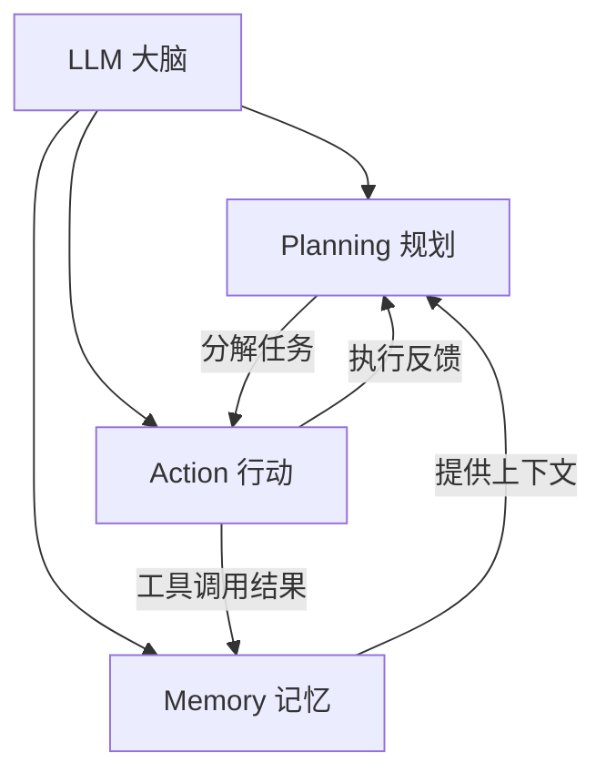

| 组件 | 功能 | 实现方式 |
|------|------|---------|
| LLM | 推理、决策、生成 | GPT-4, Claude, Qwen |
| Planning | 任务分解、步骤规划 | CoT, ReAct, ToT |
| Memory | 存储历史和知识 | 向量数据库、对话历史 |
| Action | 执行具体操作 | API调用、代码执行、搜索 |

---

## 2. ReAct 框架

### 核心思想

将**推理（Reasoning）**和**行动（Acting）**交织进行，而非先完整推理再行动。

### 工作流程

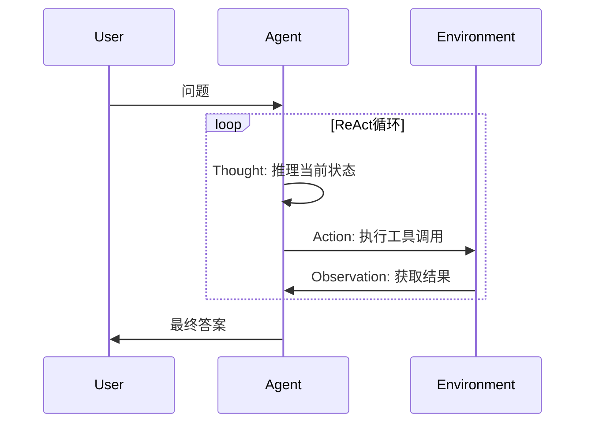

### 示例

```
Question: 科罗拉多造山运动东部区域的海拔最高点是？

Thought: 我需要搜索科罗拉多造山运动的信息
Action: Search[科罗拉多造山运动]
Observation: 科罗拉多造山运动是...

Thought: 需要找到东部区域的信息
Action: Lookup[东部区域]
Observation: 东部区域延伸至高原...

Thought: 需要查找该区域最高海拔
Action: Search[高原最高海拔]
Observation: 最高点约...

Thought: 我已经找到答案
Answer: xxx
```

### 与纯 CoT 的区别

| | CoT | ReAct |
|---|---|---|
| 推理方式 | 纯内部推理 | 推理+外部行动交织 |
| 信息来源 | 仅模型知识 | 可动态获取外部信息 |
| 可验证性 | 低 | 高（行动结果可观测） |
| 错误纠正 | 难 | 可根据观察调整 |

---

## 3. 规划能力：CoT / ToT / GoT

### Chain-of-Thought (CoT)

线性推理链：$x \rightarrow r_1 \rightarrow r_2 \rightarrow ... \rightarrow r_n \rightarrow y$

- 简单有效，零样本 CoT 只需加 "Let's think step by step"
- 缺点：单路径，无法回溯

### Tree-of-Thought (ToT)

树状搜索：每步生成多个候选推理方向，评估后选择最优路径。

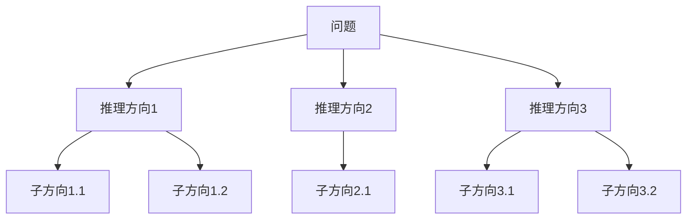

- 搜索策略：BFS 或 DFS
- 评估：LLM 自评或启发式函数
- 优点：可回溯、探索多路径
- 缺点：计算成本高

### Graph-of-Thought (GoT)

图状推理：允许推理节点之间任意连接，支持合并、回溯、循环。

- 比 ToT 更灵活，可表达推理步骤间的复杂依赖
- 适合需要综合多个推理路径的任务

### 对比

| | CoT | ToT | GoT |
|---|---|---|---|
| 结构 | 链 | 树 | 图 |
| 搜索空间 | 1条路径 | 多路径树 | 任意图 |
| 回溯 | 不支持 | 支持 | 支持 |
| 合并推理 | 不支持 | 不支持 | 支持 |
| 计算成本 | 低 | 中 | 高 |

---

## 4. Memory 设计

### 短期记忆

存储当前对话/任务的上下文信息。

| 实现 | 描述 |
|------|------|
| 对话历史 | 直接拼接在 prompt 中 |
| 滑动窗口 | 保留最近 K 轮对话 |
| 摘要压缩 | 对过长历史生成摘要替代 |

### 长期记忆

跨会话、跨任务的持久化知识存储。

| 实现 | 描述 |
|------|------|
| 向量数据库 | 将经验/知识嵌入后存储，检索相关记忆 |
| 知识图谱 | 结构化存储实体和关系 |
| 文件系统 | 直接读写外部文件 |

### 记忆检索

$$\text{memory} = \text{TopK}(\text{Embed}(q) \cdot \text{Embed}(m_i))$$

即用当前查询的嵌入与记忆库中的嵌入做相似度检索。

### 典型架构

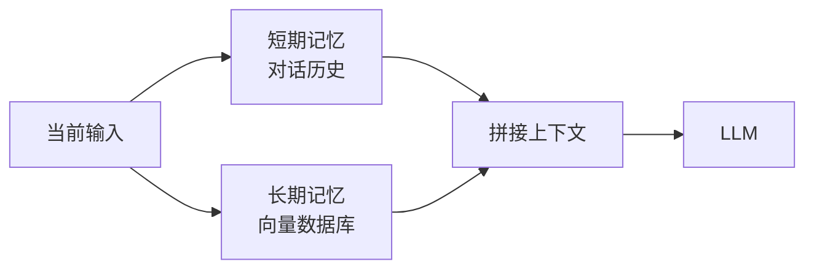

---

## 5. Tool Use / Function Calling

### 原理

LLM 通过结构化输出来调用外部工具/API。

### 工作流程

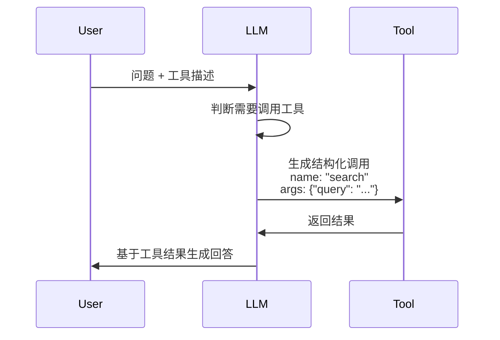

### 工具描述格式

```
tools:
  - name: search
    description: 搜索互联网获取信息
    parameters:
      - name: query
        type: string
        description: 搜索关键词
```

### 训练方式

1. **Prompt工程**：在 system prompt 中描述工具，依赖 LLM 的指令遵循能力
2. **指令微调**：用工具调用格式的数据微调 LLM，使其学会生成结构化调用
3. **RL优化**：用工具调用成功率作为奖励信号

---

## 6. LangChain vs LlamaIndex

| 维度 | LangChain | LlamaIndex |
|------|-----------|------------|
| 核心定位 | 通用 Agent 开发框架 | 数据索引与检索框架 |
| 核心场景 | 工具调用、多步推理、对话Agent | RAG、知识库构建、文档问答 |
| 数据处理 | 基础文档加载 | 深度索引（树/图/关键词） |
| 检索能力 | 基础向量检索 | 多级检索、混合检索、重排 |
| Agent能力 | 强（丰富的工具链和链式调用） | 中（聚焦于检索增强） |
| 生态 | 更大、更杂 | 更聚焦、更精简 |
| 适用场景 | 复杂工作流、多工具Agent | 知识密集型应用、RAG |

**选型建议**：需要复杂 Agent 工作流选 LangChain；需要高质量 RAG 选 LlamaIndex；两者可组合使用。

---

## 7. 构建 Agent 的主要挑战

1. **可靠性**：LLM 输出不确定，工具调用可能失败，需大量错误处理
2. **长程规划**：多步任务中错误会累积，难以从中间状态恢复
3. **上下文窗口**：复杂任务的对话历史+工具结果可能超出上下文长度
4. **延迟与成本**：多轮 LLM 调用 + 工具调用，延迟和成本叠加
5. **评估困难**：Agent 行为空间巨大，难以系统评估
6. **安全性**：Agent 可执行真实操作（删文件、发邮件），需严格权限控制

---

## 8. 多智能体系统

### 架构

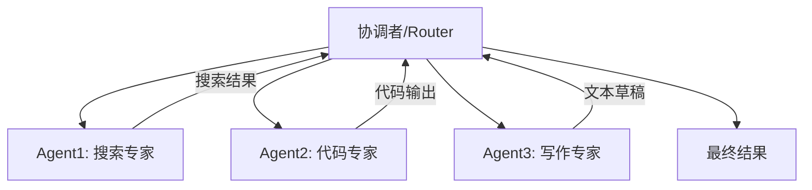

### 优势

1. **专业化**：每个 Agent 专注一个领域，表现更好
2. **并行性**：独立子任务可并行执行
3. **鲁棒性**：单个 Agent 失败不影响整体
4. **可扩展**：新增能力只需添加新 Agent

### 新增复杂性

1. **通信开销**：Agent 间信息传递的延迟和成本
2. **协调难度**：任务分配、冲突解决、结果整合
3. **一致性**：多个 Agent 可能产生矛盾的输出
4. **调试困难**：错误来源难以定位

### 典型框架

- **AutoGen**：微软，多 Agent 对话式协作
- **CrewAI**：角色化多 Agent 协作
- **MetaGPT**：模拟软件公司组织结构

---

## 9. 具身 Agent vs 软件Agent

| 维度 | 软件Agent | 具身Agent |
|------|-----------|-----------|
| 环境 | 数字环境（API、网页） | 物理环境（机器人、游戏） |
| 感知 | 文本/结构化数据 | 多模态传感器（视觉、触觉） |
| 行动 | API调用、代码执行 | 物理动作（移动、抓取） |
| 可逆性 | 大多可撤销 | 物理动作不可逆 |
| 安全性 | 数据安全 | 人身安全 |
| 反馈 | 确定性（API返回） | 噪声大（传感器误差） |
| 核心挑战 | 工具调用可靠性 | 感知-动作映射、安全控制 |

---

## 10. Agent 安全与对齐

### 安全风险

1. **越权操作**：Agent 执行超出授权范围的行动
2. **提示注入**：恶意输入操控 Agent 行为
3. **工具滥用**：利用工具漏洞造成损害
4. **信息泄露**：Agent 在交互中泄露敏感信息

### 保障方法

| 方法 | 描述 |
|------|------|
| 权限控制 | 最小权限原则，限制 Agent 可调用的工具和操作 |
| 人工确认 | 高风险操作前需人工审批 |
| 沙箱执行 | 在隔离环境中执行不确定操作 |
| 行为监控 | 实时检测异常行为模式 |
| 宪法AI | 用明确规则约束 Agent 行为边界 |
| 红队测试 | 主动测试 Agent 的安全漏洞 |

---

## 11. A2A 框架

### 定义

Google 提出的 Agent-to-Agent 协议，解决不同 Agent 之间的互操作性问题。

### 与普通 Agent 框架的关键区别

**最关键不同点**：A2A 是**Agent间通信协议**，而非 Agent 开发框架。

| | 普通Agent框架 | A2A |
|---|---|---|
| 关注点 | 单Agent内部如何构建 | 多Agent之间如何通信 |
| 核心抽象 | 工具、链、记忆 | Agent Card、Task、Message |
| 互操作性 | 框架内互通 | 跨框架、跨平台互通 |
| 协议层 | 无标准协议 | 标准化HTTP+JSON-RPC |

A2A 定义了 Agent 如何暴露自身能力（Agent Card）、如何接收任务（Task）、如何交换消息（Message），使不同框架构建的 Agent 可以互相发现和协作。

---

## 12. Agent 微调

### 数据收集方式

1. **轨迹蒸馏**：用强模型（GPT-4）执行任务，收集 (state, action, observation) 轨迹
2. **人工标注**：人工演示任务执行过程，记录操作序列
3. **自举采样**：模型自主尝试，筛选成功轨迹作为正样本
4. **拒绝采样**：生成多条轨迹，用奖励模型筛选最优轨迹

### 微调方法

| 方法 | 描述 |
|------|------|
| SFT | 用成功轨迹做监督微调 |
| DPO | 对比成功/失败轨迹做偏好优化 |
| RL | 用任务完成率作为奖励信号 |

### 关键挑战

- **轨迹多样性**：同一任务可能有多种正确执行路径
- **错误传播**：中间步骤的错误导致后续步骤全部无效
- **工具格式**：需要精确生成结构化的工具调用格式

---

## 13. 思维链（CoT）：为什么需要 & 相比直接回答的好处

### 核心原理

CoT 让模型在给出最终答案前，先生成中间推理步骤，将复杂问题分解为多个简单子问题。

$$P(\text{answer} | \text{question}) \quad \text{vs} \quad P(\text{answer} | \text{reasoning}, \text{question})$$

直接回答：一步跳到答案；CoT：通过推理链逐步推导。

### 为什么 CoT 有效

| 原因 | 解释 |
|------|------|
| **增加计算量** | 更多 token = 更多前向传播计算 = 更多"思考时间" |
| **分解复杂度** | 将 $n$ 步推理拆为 $n$ 个1步推理，每步更简单 |
| **暴露中间状态** | 推理过程可被检查和纠正 |
| **利用训练数据中的推理模式** | 预训练数据中大量含推理过程的文本 |

### 数学直觉

设 $n$ 步推理，每步正确率 $p$：

- 直接回答：$P(\text{correct}) \approx p^n$（指数衰减）
- CoT：$P(\text{correct}) \approx p^n$ 但每步更简单（$p_{step} > p_{direct}$），且中间步骤可验证

### CoT vs 直接回答对比

| 维度 | 直接回答 | CoT |
|------|---------|-----|
| 准确率（复杂推理） | 低 | 高 |
| Token消耗 | 少 | 多 |
| 可解释性 | 无 | 有（推理过程可见） |
| 可调试性 | 难 | 易（可定位哪步出错） |
| 适用任务 | 简单事实问答 | 数学/逻辑/多步推理 |

### CoT 的触发方式

1. **零样本 CoT**：在 prompt 末尾加 "Let's think step by step"
2. **少样本 CoT**：在 prompt 中提供含推理过程的示例
3. **自动 CoT**：用模型自动生成推理链作为示例

---

## 14. 思维链质量检验

### 自动评估方法

| 方法 | 原理 | 适用场景 |
|------|------|---------|
| **自洽性（Self-Consistency）** | 多次采样，检查多数答案是否一致 | 数学推理 |
| **过程奖励模型（PRM）** | 对推理链每步打分 | 数学/代码 |
| **结果验证** | 用外部工具验证最终答案 | 代码/数学 |
| **回溯验证** | 让模型检查自己的推理过程 | 通用 |

### 自洽性评估流程

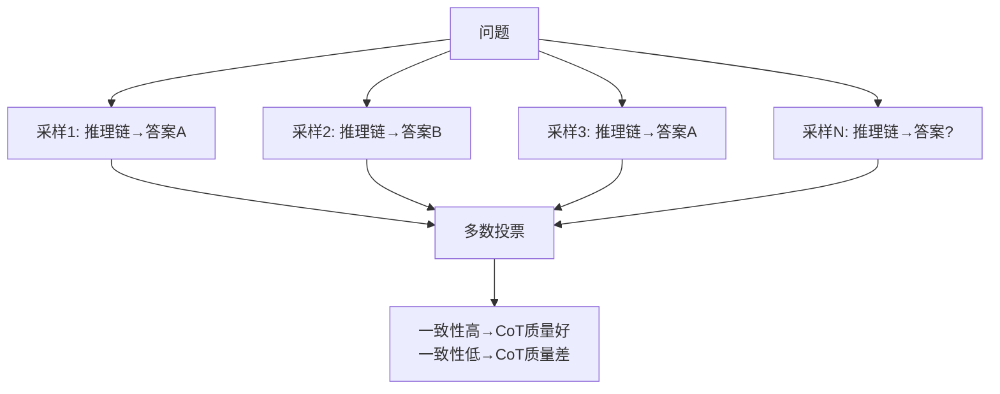

### PRM 评估

训练一个过程奖励模型，对推理链的每一步 $s_1, s_2, ..., s_k$ 打分：

$$\text{PRM-Score} = \prod_{i=1}^{k} P(\text{correct} | s_i, s_{<i})$$

每步分数越高，推理链质量越好。

### 人工评估维度

| 维度 | 评估标准 |
|------|---------|
| 逻辑正确性 | 每步推理是否逻辑自洽 |
| 事实准确性 | 推理中引用的事实是否正确 |
| 完整性 | 是否遗漏关键推理步骤 |
| 简洁性 | 是否有冗余或无关步骤 |
| 可验证性 | 每步是否可独立验证 |

### 常见 CoT 错误模式

| 错误类型 | 描述 | 示例 |
|---------|------|------|
| 跳步 | 遗漏中间推理 | 2+3=5, 5×4=20（跳过了乘法解释） |
| 事实错误 | 推理中引用错误事实 | "中国的首都是上海" |
| 逻辑谬误 | 因果关系错误 | "因为A在B之后，所以A导致B" |
| 计算错误 | 算术运算出错 | "13×7=81" |
| 答案不一致 | 推理过程与最终答案矛盾 | 推理得出3，答案写4 |

---

## 15. Workflow vs Agent 本质区别

### 定义

| | Workflow（工作流） | Agent（智能体） |
|---|---|---|
| 定义 | 预定义的固定执行流程 | 自主决策的动态执行流程 |
| 控制流 | 确定性（if-else/状态机） | 非确定性（LLM决策） |
| 灵活性 | 低（只能处理预设情况） | 高（可处理意外情况） |
| 可靠性 | 高（行为可预测） | 低（行为不确定） |
| 复杂度 | 简单任务 | 复杂/开放任务 |

### 架构对比

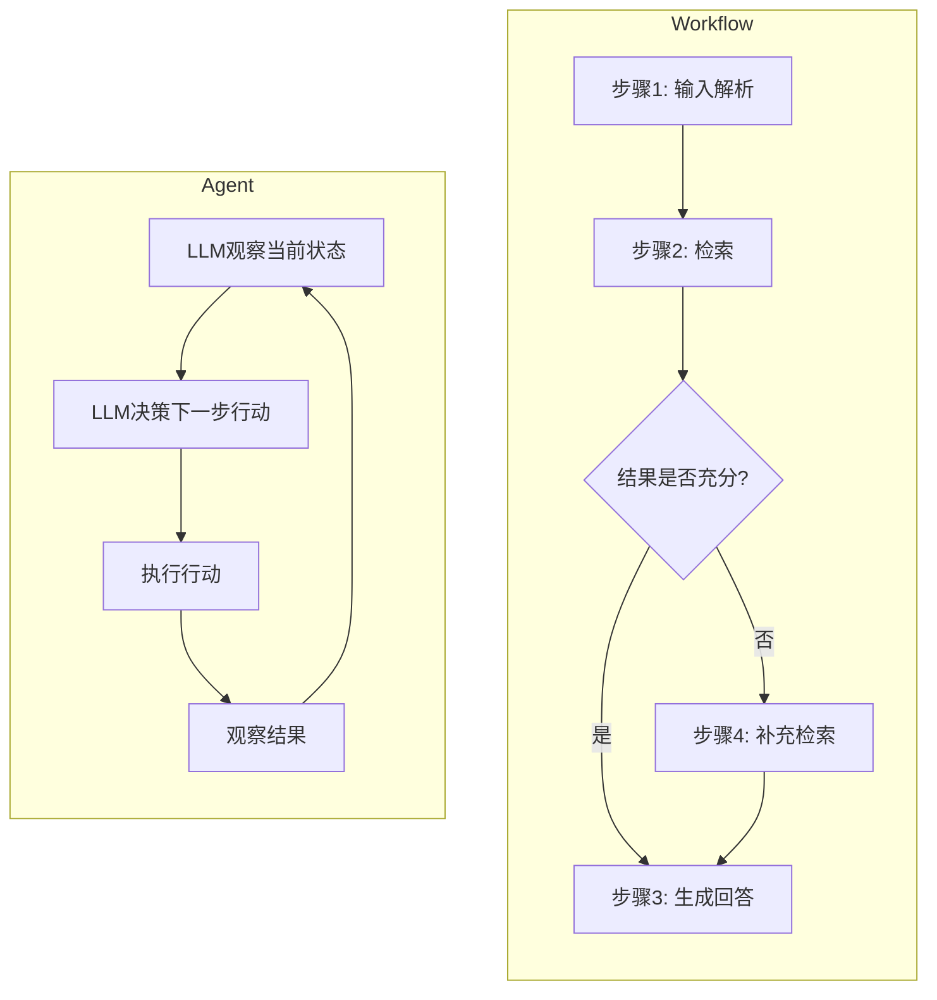

### 核心区别：决策权归属

| 维度 | Workflow | Agent |
|------|----------|-------|
| 下一步做什么 | 代码/规则决定 | LLM 决定 |
| 异常处理 | 预设 fallback | LLM 自主处理 |
| 循环/重试 | 固定次数 | LLM 判断是否继续 |
| 适用场景 | 流程明确、步骤固定 | 流程不确定、需要灵活决策 |

### 选型指南

| 场景 | 选 Workflow | 选 Agent |
|------|-----------|---------|
| 客服FAQ | ✅ 流程固定 | ❌ 过度设计 |
| 数据ETL | ✅ 步骤确定 | ❌ 不需要决策 |
| 复杂研究 | ❌ 无法预设所有路径 | ✅ 需要灵活探索 |
| 代码调试 | ❌ 错误类型不可预知 | ✅ 需要自主判断 |
| 混合场景 | ✅ 主流程用 Workflow | ✅ 异常分支用 Agent |

### 实践：Workflow + Agent 混合架构

主流做法是**Workflow 为主、Agent 为辅**：

1. 主流程用 Workflow 保证可靠性
2. 关键决策点嵌入 Agent 处理不确定性
3. Agent 的行动范围受 Workflow 约束

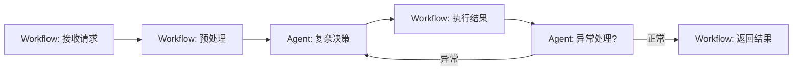

---

## 16. MCP 协议（Model Context Protocol）

### 定义

Anthropic 提出的开放标准协议，规范 LLM 与外部工具/数据源之间的通信方式，类似 AI 领域的 USB 接口标准。

### 核心架构

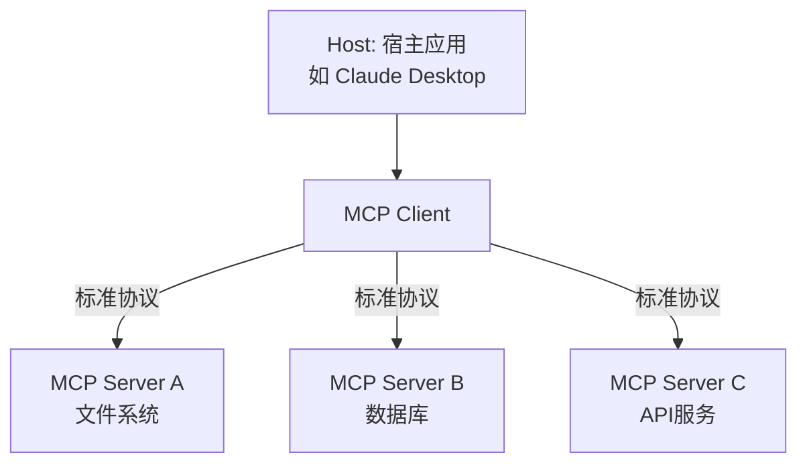

### 三大核心概念

| 概念 | 角色 | 类比 |
|------|------|------|
| Host | 运行 LLM 的宿主应用 | 浏览器 |
| Client | 与 Server 建立连接的中间层 | 浏览器插件管理器 |
| Server | 提供具体能力的服务端 | 插件 |

### Server 暴露的三类能力

| 能力 | 描述 | 示例 |
|------|------|------|
| **Tools** | 可调用的函数/操作 | 查询数据库、调用API、执行代码 |
| **Resources** | 可读取的数据/文件 | 文档内容、数据库记录、配置文件 |
| **Prompts** | 预定义的提示模板 | 特定任务的 prompt 模板 |

### 与 Function Calling 的区别

| | Function Calling | MCP |
|---|---|---|
| 定义层 | 各厂商自定义格式 | 开放标准协议 |
| 工具发现 | 硬编码在 prompt 中 | 动态发现（Server 自描述） |
| 工具生态 | 封闭（绑定特定模型） | 开放（任何 LLM 可用） |
| 连接管理 | 无 | Client-Server 持久连接 |
| 安全性 | 依赖模型判断 | 权限控制 + 沙箱 |

### MCP 通信流程

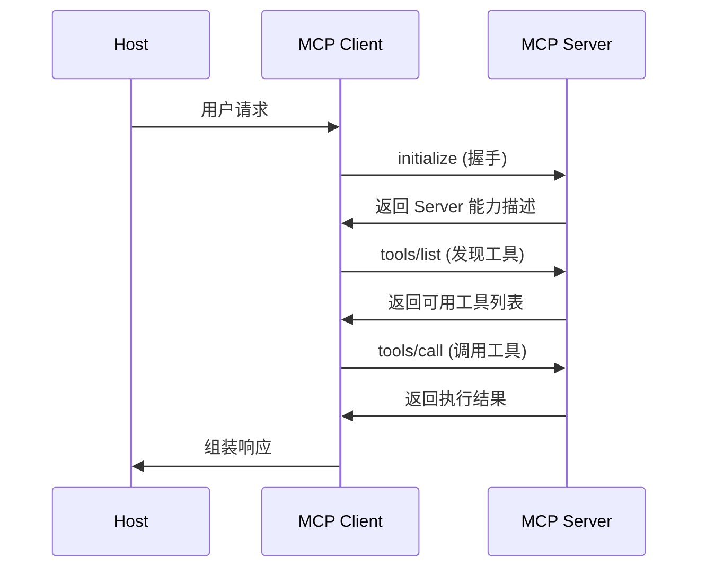

---

## 17. Agent 任务拆分策略

### 核心问题

复杂任务无法一步完成，需拆解为可执行的子任务序列。拆分粒度决定 Agent 执行效率和成功率。

### 拆分方法

| 方法 | 原理 | 适用场景 |
|------|------|---------|
| **CoT 分解** | LLM 逐步推理自动拆分 | 简单线性任务 |
| **HuggingGPT 式** | LLM 作为控制器，拆分后分配给专家模型 | 多模态/多领域任务 |
| **Plan-and-Solve** | 先生成完整计划，再逐步执行 | 多步推理任务 |
| **递归分解** | 对子任务继续拆分直到原子操作 | 层次化复杂任务 |
| **ADaPT** | 根据执行反馈自适应调整拆分 | 不确定性高的任务 |

### 拆分粒度权衡

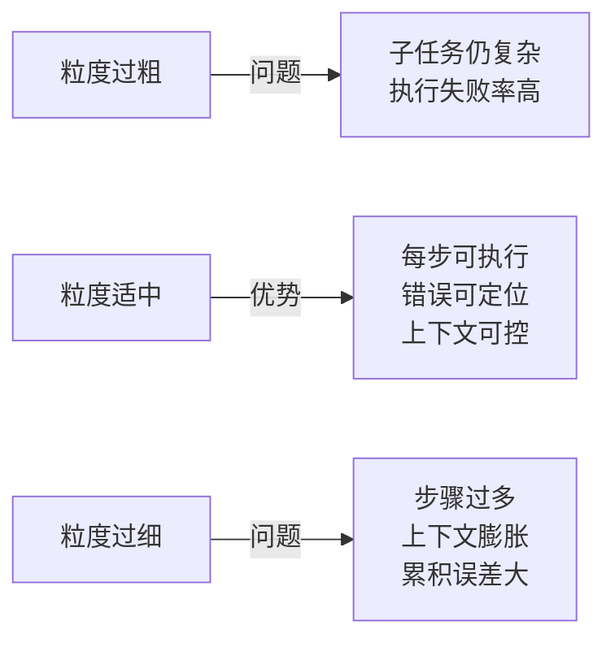

### Plan-then-Execute vs 逐步规划

| | Plan-then-Execute | 逐步规划 (ReAct) |
|---|---|---|
| 流程 | 一次性生成完整计划 → 顺序执行 | 每步观察后决定下一步 |
| 全局性 | 强（有全局视野） | 弱（局部决策） |
| 灵活性 | 低（计划不可变） | 高（根据反馈调整） |
| 适用场景 | 结构化任务 | 开放式探索 |

**实践建议**：混合策略——先粗粒度规划，执行中细粒度调整。

---

## 18. Agent 长上下文处理

### 核心挑战

| 问题 | 原因 |
|------|------|
| 上下文溢出 | 对话历史 + 工具结果 + 记忆超出窗口 |
| Lost in the Middle | 中间信息被忽略 |
| 信息冗余 | 大量无关历史占据窗口 |
| 成本上升 | Token 数与推理成本线性相关 |

### 解决方案

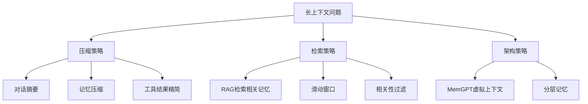

### MemGPT 架构

将 OS 的虚拟内存管理引入 Agent 上下文管理：

| OS 概念 | MemGPT 对应 | 作用 |
|---------|------------|------|
| 物理内存 | LLM 上下文窗口 | 当前可用空间 |
| 磁盘 | 外部存储（向量数据库） | 持久化记忆 |
| 页面调度 | 上下文换入/换出 | 动态管理上下文内容 |
| 页表 | 记忆索引 | 定位记忆存储位置 |

MemGPT 让 Agent 自主决定何时将信息移入/移出上下文窗口，突破固定窗口限制。

### 工具结果精简

| 策略 | 方法 |
|------|------|
| 截断 | 保留工具返回的前 N 个字符 |
| 摘要 | 用 LLM 对工具结果做摘要 |
| 过滤 | 只保留与当前任务相关的字段 |
| 结构化 | 要求工具返回结构化数据而非原始文本 |

---

## 19. 模型能力 vs 框架设计

### 核心矛盾

Agent 的表现 = 模型能力 × 框架设计。两者互补但不可替代。

### 能力边界

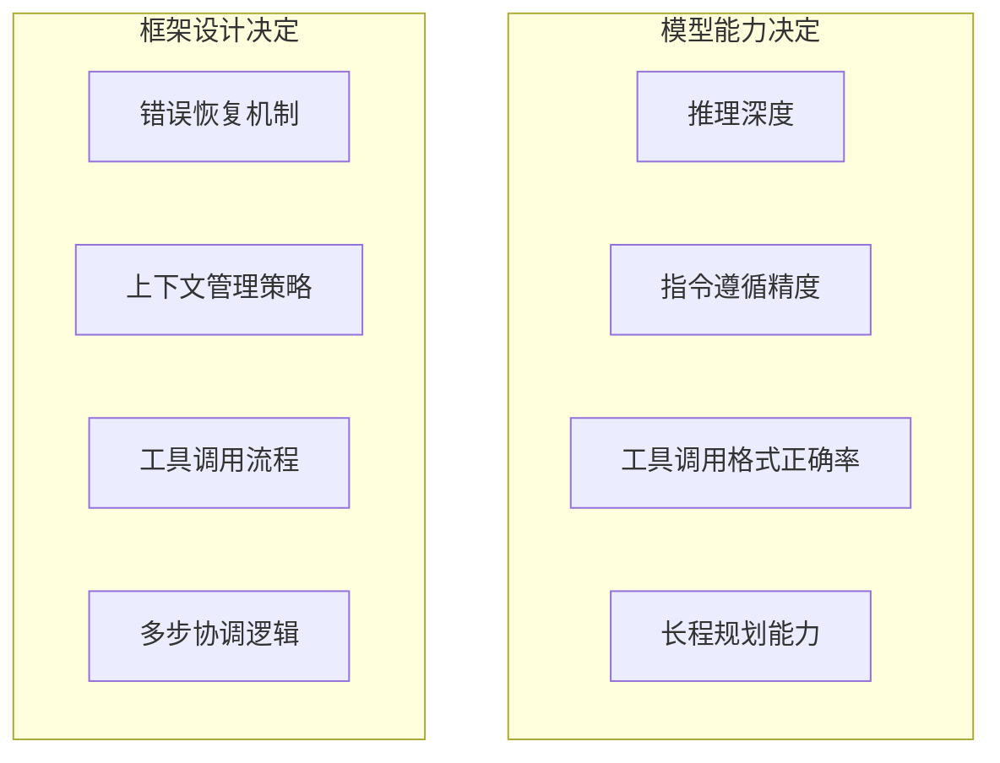

### 关键原则

| 原则 | 说明 |
|------|------|
| **模型不够框架补** | 模型推理弱 → 框架做更多约束和验证 |
| **框架不够模型补** | 框架难以枚举所有情况 → 依赖模型灵活决策 |
| **短板决定上限** | 模型能力不足时，再精巧的框架也无法弥补 |
| **过度框架化** | 把所有逻辑硬编码 → 失去 Agent 灵活性 |
| **过度依赖模型** | 不做任何约束 → 可靠性极低 |

### 不同模型等级的框架策略

| 模型等级 | 框架策略 | 示例 |
|---------|---------|------|
| 强模型（GPT-4/Claude） | 轻框架，给模型更多自主权 | ReAct + 最少约束 |
| 中等模型（7B-13B） | 中等框架，关键节点加验证 | Workflow + Agent 混合 |
| 弱模型（<7B） | 重框架，流程高度结构化 | 纯 Workflow，模型只做单步判断 |

---

## 20. Agent 记忆方案扩展

### 典型记忆架构

| 方案 | 核心思想 | 记忆类型 | 特点 |
|------|---------|---------|------|
| **MemGPT** | OS 虚拟内存管理 | 分层（主存+外存） | 自主换页，突破窗口限制 |
| **MemoryBank** | 艾宾浩斯遗忘曲线 | 长期记忆 | 模拟人类遗忘机制 |
| **Reflexion** | 语言化反思记忆 | 经验记忆 | 从失败中学习策略 |
| **Generative Agents** | 检索+反思+推理 | 综合记忆 | 模拟社会行为 |

### MemoryBank 遗忘曲线

基于艾宾浩斯模型，记忆强度随时间衰减：

$$R(t) = e^{-\frac{t}{S}}$$

其中 $R(t)$ 为记忆保留率，$t$ 为时间间隔，$S$ 为记忆稳定性。每次检索（回忆）会增大 $S$：

$$S_{new} = S_{old} \cdot (1 + \alpha)$$

被频繁访问的记忆 $S$ 越大，衰减越慢——模拟"越用越记得"。

### Reflexion 反思记忆

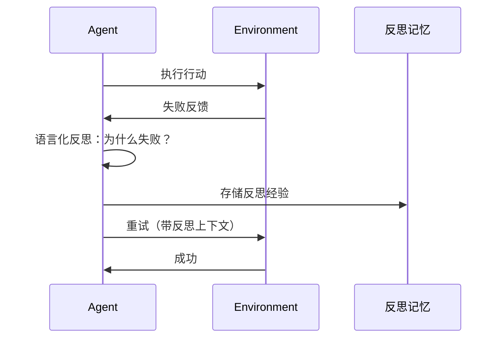

关键：将失败经验用自然语言记录，下次遇到类似情况时检索相关反思，避免重复犯错。

### 记忆压缩策略

| 策略 | 方法 | 压缩比 | 信息损失 |
|------|------|--------|---------|
| 滑动窗口 | 只保留最近 K 轮 | 高 | 高（丢弃早期） |
| 摘要压缩 | LLM 生成历史摘要 | 中 | 中 |
| 关键信息提取 | 只保留实体/关系/决策 | 中 | 中低 |
| 向量检索 | 全量存储，按需检索 | 无压缩 | 低 |
| 分层压缩 | 近期完整+远期摘要 | 可调 | 可控 |

---

## 21. Multi-Agent 协作扩展

### 协作模式

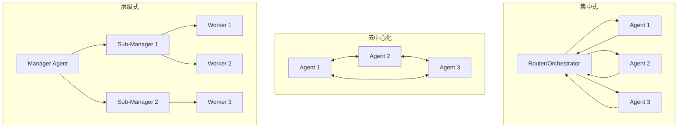

| 模式 | 优点 | 缺点 | 代表 |
|------|------|------|------|
| 集中式 | 控制简单，一致性高 | 单点瓶颈 | AutoGen, CrewAI |
| 去中心化 | 鲁棒，无单点故障 | 一致性难保证 | Swarm |
| 层级式 | 可扩展，分工明确 | 延迟叠加 | MetaGPT |

### OpenAI Swarm 模式

Swarm 是轻量级多 Agent 编排框架，核心概念：

| 概念 | 说明 |
|------|------|
| Agent | 封装指令 + 可用工具的实体 |
| Handoff | Agent 间转移控制权的机制 |
| Routine | Agent 的指令 + 工具集合 |

**核心流程**：

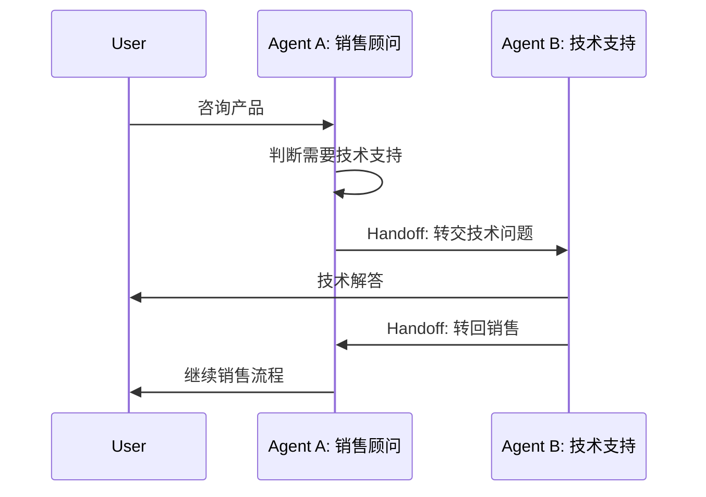

**与 AutoGen 的区别**：

| | Swarm | AutoGen |
|---|---|---|
| 编排方式 | Agent 自主 Handoff | 预定义对话流程 |
| 状态管理 | 无状态 | 有状态 |
| 复杂度 | 极轻量 | 较重 |
| 适用场景 | 简单路由/转交 | 复杂多轮协作 |

### 多 Agent 通信协议

| 协议/方式 | 描述 |
|----------|------|
| 自然语言 | Agent 间用自然语言对话（最灵活但最不可靠） |
| 结构化 JSON | 约定消息格式（如 A2A 的 Message 格式） |
| 共享黑板 | 所有 Agent 读写共享状态空间 |
| 事件驱动 | Agent 发布/订阅事件 |

---

## 22. Agent 微调 vs 模型微调

### 本质区别

| | 模型微调 | Agent 微调 |
|---|---|---|
| 目标 | 提升模型的基础能力（推理、知识、语言） | 提升模型的 Agent 行为（工具调用、规划、反思） |
| 数据 | 通用指令/对话数据 | Agent 轨迹数据 (state, action, observation) |
| 评估 | 通用 benchmark（MMLU, HumanEval） | Agent benchmark（SWE-bench, WebArena） |
| 核心挑战 | 知识获取、推理增强 | 格式正确性、多步一致性、错误恢复 |

### 适用场景

| 场景 | 选模型微调 | 选 Agent 微调 |
|------|-----------|-------------|
| 模型基础知识不足 | ✅ 补充领域知识 | ❌ 无法弥补知识缺陷 |
| 工具调用格式错误 | ❌ 通用微调不针对 | ✅ 专门训练工具调用格式 |
| 多步推理失败 | ✅ 提升推理能力 | ✅ 训练规划策略 |
| Agent 行为不一致 | ❌ 不解决行为问题 | ✅ 对齐 Agent 行为模式 |
| 新工具适配 | ❌ | ✅ 少量轨迹即可适配 |

### Agent 微调的 RL 方法

| 方法 | 奖励信号 | 优点 | 缺点 |
|------|---------|------|------|
| 任务完成率 | 0/1 二值 | 简单直接 | 稀疏奖励，学习慢 |
| 过程奖励（PRM） | 每步打分 | 密集信号 | 标注成本高 |
|轨迹对比（DPO） | 成功/失败轨迹对 | 无需奖励模型 | 需要配对数据 |
| AI 反馈（RLAIF） | 强模型评判 | 可扩展 | 评判质量依赖强模型 |

### 关键公式

Agent RL 的目标函数：

$$\max_\theta \mathbb{E}_{\tau \sim \pi_\theta} \left[ \sum_{t=1}^{T} \gamma^t r(s_t, a_t) \right]$$

其中 $\tau = (s_1, a_1, o_1, ..., s_T, a_T, o_T)$ 为 Agent 轨迹，$r(s_t, a_t)$ 为步骤奖励，$\gamma$ 为折扣因子。
