# 第四章 LLM Agent：从概念到工程实践

> 本章系统讲解基于大语言模型（LLM, Large Language Model）的智能体（Agent）技术。我们将从 Agent 的基本定义出发，逐步深入其核心组件、推理框架、记忆机制、工具调用、多智能体协作，直至工程实践中的关键挑战与解决方案。

---

## 目录

- [4.1 什么是 LLM Agent](#41-什么是-llm-agent)
- [4.2 思维链：Agent 的推理基石](#42-思维链agent-的推理基石)
- [4.3 从链到图：规划能力的演进](#43-从链到图规划能力的演进)
- [4.4 ReAct 框架：推理与行动的统一](#44-react-框架推理与行动的统一)
- [4.5 记忆系统设计](#45-记忆系统设计)
- [4.6 工具调用与 Function Calling](#46-工具调用与-function-calling)
- [4.7 MCP 协议：标准化的工具通信](#47-mcp-协议标准化的工具通信)
- [4.8 Workflow 与 Agent 的边界](#48-workflow-与-agent-的边界)
- [4.9 任务拆分与长上下文处理](#49-任务拆分与长上下文处理)
- [4.10 多智能体系统](#410-多智能体系统)
- [4.11 A2A 协议：跨平台的 Agent 互操作](#411-a2a-协议跨平台的-agent-互操作)
- [4.12 Agent 微调与训练](#412-agent-微调与训练)
- [4.13 模型能力与框架设计的平衡](#413-模型能力与框架设计的平衡)
- [4.14 安全、对齐与具身智能](#414-安全对齐与具身智能)
- [4.15 开发框架选型](#415-开发框架选型)

---

## 4.1 什么是 LLM Agent

### 4.1.1 定义

**LLM Agent**（大语言模型智能体）是一种基于大语言模型的自主系统，它能够感知环境、规划行动、调用工具，并从反馈中学习，以完成复杂任务。与传统的"一问一答"式 LLM 应用不同，Agent 具备自主决策和多步执行的能力。

简单来说，如果把 LLM 比作一个"大脑"，那么 Agent 就是拥有大脑、四肢和记忆的完整"个体"——它不仅能思考，还能行动。

### 4.1.2 核心组件

一个完整的 LLM Agent 由四大核心组件构成：

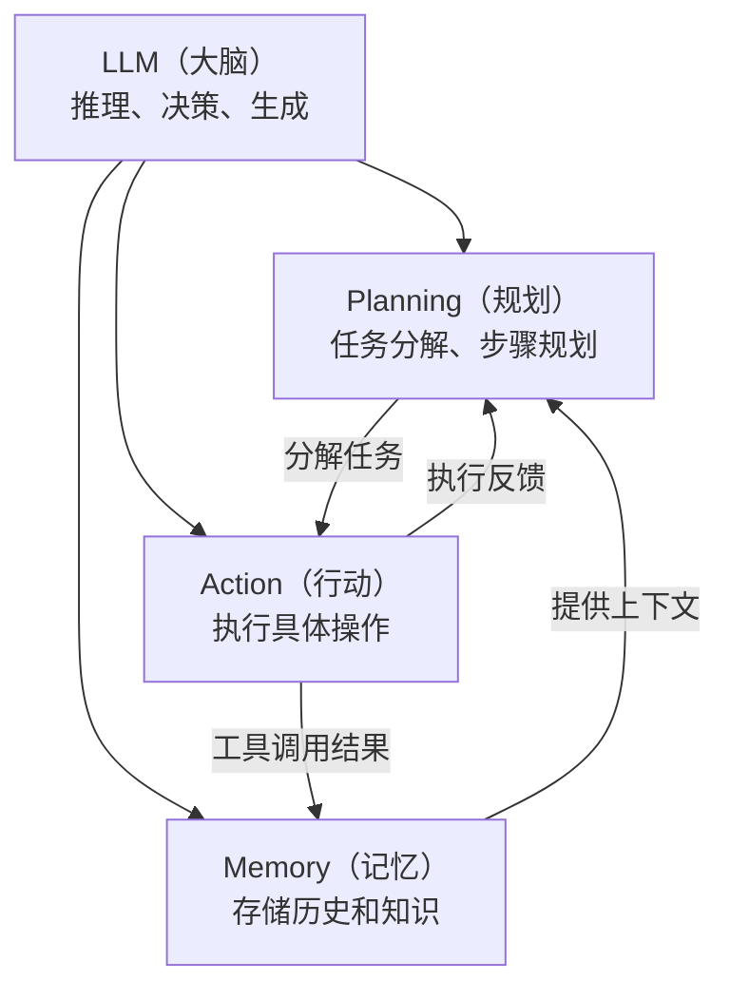

下表详细说明各组件的功能与典型实现方式：

| 组件 | 功能 | 典型实现方式 |
|------|------|-------------|
| **LLM（大语言模型）** | 充当 Agent 的"大脑"，负责推理、决策和自然语言生成 | GPT-4、Claude、Qwen 等 |
| **Planning（规划）** | 将复杂任务分解为可执行的子步骤，制定行动计划 | CoT（思维链）、ReAct、ToT（思维树） |
| **Memory（记忆）** | 存储对话历史、任务经验和外部知识，为决策提供上下文 | 向量数据库、对话历史缓存、知识图谱 |
| **Action（行动）** | 执行具体操作，与外部环境交互 | API 调用、代码执行、搜索引擎查询 |

这四个组件形成一个闭环：LLM 基于记忆中的上下文进行规划，规划产生的步骤指导行动，行动的结果反馈回记忆，同时也为下一轮规划提供依据。

---

## 4.2 思维链：Agent 的推理基石

在深入 Agent 的完整架构之前，我们需要先理解其最基础的推理机制——**思维链（Chain-of-Thought, CoT）**。CoT 是几乎所有 Agent 规划能力的底层支撑。

### 4.2.1 核心原理

CoT 的核心思想是：让模型在给出最终答案之前，先生成中间推理步骤，将复杂问题分解为多个简单的子问题逐步求解。

用概率语言表达，直接回答与 CoT 的区别在于：

$$P(\text{answer} | \text{question}) \quad \text{vs} \quad P(\text{answer} | \text{reasoning}, \text{question})$$

- **直接回答**：模型一步跳到答案，中间没有显式推理过程
- **CoT 回答**：模型先生成推理链（reasoning），再基于推理链得出答案

### 4.2.2 为什么 CoT 有效

| 原因 | 解释 |
|------|------|
| **增加计算量** | 生成更多 token 意味着更多前向传播计算，相当于给模型更多"思考时间" |
| **分解复杂度** | 将 $n$ 步推理拆为 $n$ 个单步推理，每一步都更简单、更容易做对 |
| **暴露中间状态** | 推理过程可被检查和纠正，错误更容易被发现 |
| **利用训练数据中的推理模式** | 预训练语料中包含大量含推理过程的文本（教科书、论文、论坛解答等） |

### 4.2.3 数学直觉

设一个问题需要 $n$ 步推理，每步正确率为 $p$：

- **直接回答**：$P(\text{correct}) \approx p^n$（正确率随步数指数衰减）
- **CoT 回答**：虽然总体仍为 $P(\text{correct}) \approx p_{step}^n$，但由于每步被显式拆解，单步正确率 $p_{step}$ 远高于直接跳跃时的 $p_{direct}$，且中间步骤可被验证和纠正

### 4.2.4 CoT 与直接回答的对比

| 维度 | 直接回答 | CoT |
|------|---------|-----|
| 准确率（复杂推理） | 低 | 高 |
| Token 消耗 | 少 | 多 |
| 可解释性 | 无 | 有（推理过程可见） |
| 可调试性 | 难 | 易（可定位哪步出错） |
| 适用任务 | 简单事实问答 | 数学、逻辑、多步推理 |

### 4.2.5 CoT 的三种触发方式

1. **零样本 CoT（Zero-shot CoT）**：在 prompt 末尾添加 "Let's think step by step"，无需提供示例
2. **少样本 CoT（Few-shot CoT）**：在 prompt 中提供若干包含完整推理过程的示例
3. **自动 CoT（Auto-CoT）**：用模型自动生成推理链作为示例，减少人工标注成本

### 4.2.6 思维链的质量检验

CoT 生成的推理链并非总是正确的，因此需要系统化的质量评估方法。

**自动评估方法**

| 方法 | 原理 | 适用场景 |
|------|------|---------|
| **自洽性（Self-Consistency）** | 对同一问题多次采样，检查多数答案是否一致 | 数学推理 |
| **过程奖励模型（PRM, Process Reward Model）** | 训练专门模型对推理链的每一步打分 | 数学、代码 |
| **结果验证** | 用外部工具（计算器、编译器）验证最终答案 | 代码、数学 |
| **回溯验证** | 让模型检查自己的推理过程是否存在逻辑错误 | 通用场景 |

**自洽性评估流程**

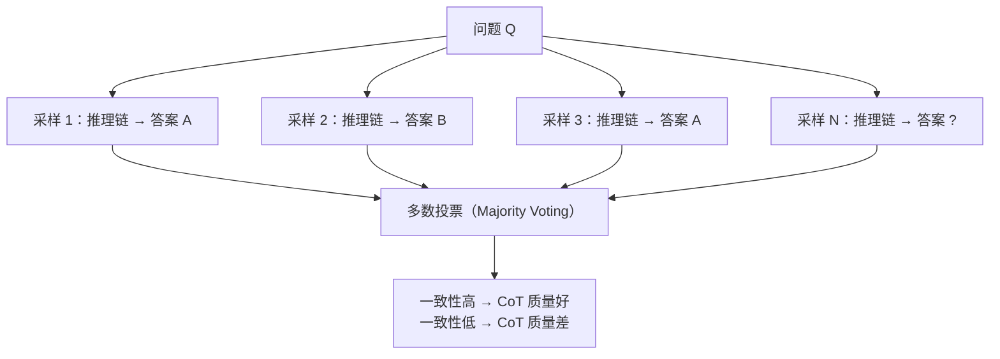

**PRM 评估公式**

训练一个过程奖励模型，对推理链的每一步 $s_1, s_2, \ldots, s_k$ 逐步打分：

$$\text{PRM-Score} = \prod_{i=1}^{k} P(\text{correct} \mid s_i, s_{<i})$$

其中：
- $s_i$ 表示推理链的第 $i$ 步
- $s_{<i}$ 表示第 $i$ 步之前的所有步骤
- $P(\text{correct} \mid s_i, s_{<i})$ 表示在前序步骤的条件下，第 $i$ 步正确的概率

每步分数越高，推理链整体质量越好。

**人工评估维度**

| 维度 | 评估标准 |
|------|---------|
| 逻辑正确性 | 每步推理是否逻辑自洽 |
| 事实准确性 | 推理中引用的事实是否正确 |
| 完整性 | 是否遗漏关键推理步骤 |
| 简洁性 | 是否有冗余或无关步骤 |
| 可验证性 | 每步是否可独立验证 |

**常见 CoT 错误模式**

| 错误类型 | 描述 | 示例 |
|---------|------|------|
| 跳步 | 遗漏中间推理步骤 | "2+3=5, 5x4=20"（跳过了为何要乘 4 的解释） |
| 事实错误 | 推理中引用了错误的事实 | "中国的首都是上海" |
| 逻辑谬误 | 因果关系推断错误 | "因为 A 在 B 之后发生，所以 A 导致了 B" |
| 计算错误 | 算术运算出错 | "13 x 7 = 81"（正确答案为 91） |
| 答案不一致 | 推理过程与最终答案矛盾 | 推理得出 3，答案却写 4 |

---

## 4.3 从链到图：规划能力的演进

CoT 提供了线性推理能力，但面对更复杂的问题，单一路径往往不够。本节介绍推理结构从链（Chain）到树（Tree）再到图（Graph）的演进。

### 4.3.1 Chain-of-Thought（CoT）——链式推理

CoT 的推理结构是一条线性链：

$$x \rightarrow r_1 \rightarrow r_2 \rightarrow \cdots \rightarrow r_n \rightarrow y$$

其中 $x$ 为输入问题，$r_1, r_2, \ldots, r_n$ 为中间推理步骤，$y$ 为最终答案。

- **优点**：简单有效，零样本 CoT 只需添加一句提示语
- **缺点**：单路径推理，一旦某步出错无法回溯修正

### 4.3.2 Tree-of-Thought（ToT）——树状搜索

**ToT（思维树）** 将推理过程从单一链条扩展为树状结构：在每一步生成多个候选推理方向，评估后选择最优路径，并支持回溯。

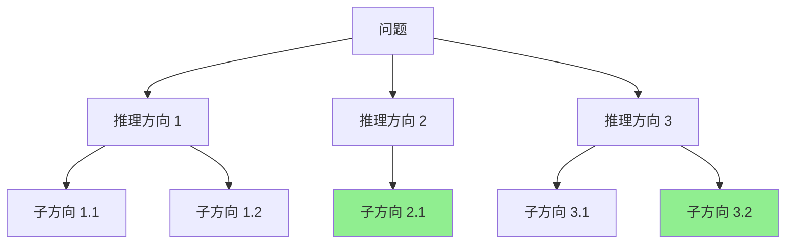

ToT 的关键机制：

- **搜索策略**：可采用广度优先搜索（BFS）或深度优先搜索（DFS）遍历推理树
- **节点评估**：通过 LLM 自评或启发式函数（Heuristic Function）判断每个推理方向的质量
- **优点**：支持回溯，可探索多条推理路径
- **缺点**：计算成本显著高于 CoT

### 4.3.3 Graph-of-Thought（GoT）——图状推理

**GoT（思维图）** 进一步将推理结构泛化为有向图：允许推理节点之间建立任意连接，支持合并、回溯和循环。

与 ToT 相比，GoT 可以表达推理步骤之间的复杂依赖关系——例如，两条独立的推理路径可以在某个节点汇合，综合两方面的信息得出更好的结论。GoT 特别适合需要综合多个推理路径结果的复杂任务。

### 4.3.4 三种推理结构对比

| 维度 | CoT（链） | ToT（树） | GoT（图） |
|------|----------|----------|----------|
| 结构 | 线性链 | 树 | 任意有向图 |
| 搜索空间 | 1 条路径 | 多路径树 | 任意图 |
| 回溯能力 | 不支持 | 支持 | 支持 |
| 合并推理 | 不支持 | 不支持 | 支持 |
| 计算成本 | 低 | 中 | 高 |

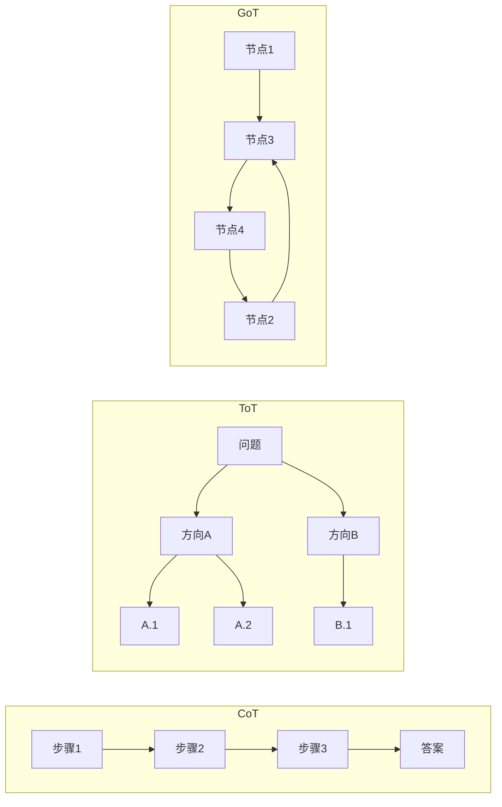

从 CoT 到 GoT，推理结构的表达能力逐步增强，但计算成本也随之上升。实际应用中，应根据任务复杂度选择合适的推理结构。

---

## 4.4 ReAct 框架：推理与行动的统一

有了推理能力（Reasoning），Agent 还需要与外部世界交互的能力（Acting）。**ReAct（Reasoning + Acting）** 框架将两者交织在一起，是当前最主流的 Agent 执行范式。

### 4.4.1 核心思想

ReAct 的核心创新在于：不是先完整推理再行动，而是将推理和行动交替进行。每一轮循环包含三个阶段：

1. **Thought（思考）**：分析当前状态，决定下一步该做什么
2. **Action（行动）**：执行一个具体操作（如搜索、查询数据库）
3. **Observation（观察）**：获取行动的结果，作为下一轮思考的输入

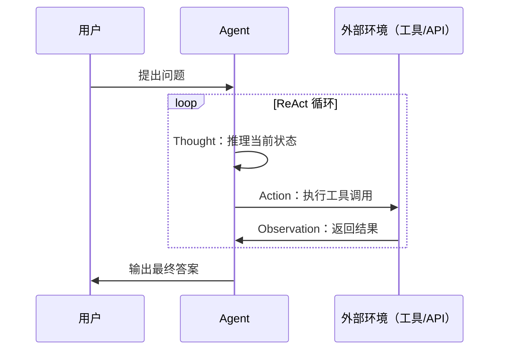

### 4.4.2 执行示例

以下是一个 ReAct 执行过程的具体示例：

```
Question: 科罗拉多造山运动东部区域的海拔最高点是？

Thought: 我需要搜索科罗拉多造山运动的信息
Action: Search[科罗拉多造山运动]
Observation: 科罗拉多造山运动是...

Thought: 需要找到东部区域的信息
Action: Lookup[东部区域]
Observation: 东部区域延伸至高原...

Thought: 需要查找该区域最高海拔
Action: Search[高原最高海拔]
Observation: 最高点约...

Thought: 我已经找到答案
Answer: xxx
```

可以看到，Agent 并非一开始就知道答案，而是通过多轮"思考-行动-观察"逐步逼近目标。

### 4.4.3 ReAct 与纯 CoT 的区别

| 维度 | CoT（纯推理） | ReAct（推理 + 行动） |
|------|-------------|-------------------|
| 推理方式 | 纯内部推理，不与外界交互 | 推理与外部行动交织进行 |
| 信息来源 | 仅依赖模型内部知识 | 可动态获取外部信息 |
| 可验证性 | 低（推理过程难以验证） | 高（行动结果可观测） |
| 错误纠正 | 难（无法获取新信息修正） | 可根据观察结果调整推理方向 |

ReAct 的关键优势在于：它让 Agent 不再局限于模型的内部知识，而是能够主动获取外部信息来辅助推理，这大大扩展了 Agent 的能力边界。

---

## 4.5 记忆系统设计

Agent 在执行多步任务时，需要记住之前做了什么、观察到了什么。记忆系统（Memory）是 Agent 维持上下文连贯性的关键组件。

### 4.5.1 短期记忆

**短期记忆（Short-term Memory）** 存储当前对话或任务的上下文信息，生命周期通常与单次会话一致。

| 实现方式 | 描述 |
|---------|------|
| 对话历史 | 将完整对话记录直接拼接在 prompt 中 |
| 滑动窗口 | 只保留最近 $K$ 轮对话，丢弃更早的内容 |
| 摘要压缩 | 对过长的历史记录生成摘要，用摘要替代原始内容 |

### 4.5.2 长期记忆

**长期记忆（Long-term Memory）** 是跨会话、跨任务的持久化知识存储，使 Agent 能够积累经验。

| 实现方式 | 描述 |
|---------|------|
| 向量数据库 | 将经验和知识通过嵌入模型（Embedding Model）转为向量后存储，检索时通过向量相似度匹配 |
| 知识图谱 | 以结构化方式存储实体及其关系，支持精确的关系查询 |
| 文件系统 | 直接读写外部文件，适合存储结构化数据或长文本 |

### 4.5.3 记忆检索

当 Agent 需要回忆相关信息时，通过嵌入相似度检索最相关的记忆：

$$\text{memory} = \text{TopK}\bigl(\text{Embed}(q) \cdot \text{Embed}(m_i)\bigr)$$

其中：
- $q$ 为当前查询（Agent 当前需要解决的问题）
- $m_i$ 为记忆库中的第 $i$ 条记忆
- $\text{Embed}(\cdot)$ 为嵌入函数，将文本映射为高维向量
- $\text{TopK}$ 返回相似度最高的 $K$ 条记忆

### 4.5.4 记忆系统典型架构

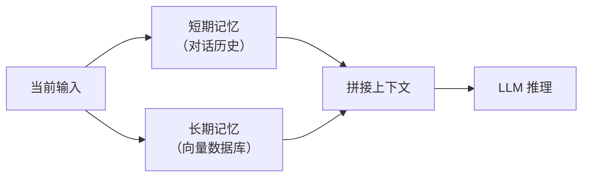

短期记忆提供近期上下文，长期记忆提供历史经验和知识，两者拼接后送入 LLM 进行推理决策。

### 4.5.5 进阶记忆方案

随着 Agent 应用的深入，研究者提出了多种更精细的记忆方案：

| 方案 | 核心思想 | 记忆类型 | 特点 |
|------|---------|---------|------|
| **MemGPT** | 借鉴操作系统的虚拟内存管理 | 分层（主存 + 外存） | Agent 自主换页，突破上下文窗口限制 |
| **MemoryBank** | 基于艾宾浩斯遗忘曲线 | 长期记忆 | 模拟人类的遗忘与强化机制 |
| **Reflexion** | 语言化的反思记忆 | 经验记忆 | 从失败中学习策略 |
| **Generative Agents** | 检索 + 反思 + 推理 | 综合记忆 | 模拟社会行为 |

**MemoryBank 的遗忘曲线模型**

MemoryBank 基于艾宾浩斯（Ebbinghaus）遗忘曲线，用数学模型模拟记忆的自然衰减：

$$R(t) = e^{-\frac{t}{S}}$$

其中：
- $R(t)$ 为记忆保留率（Retention Rate），取值范围 $[0, 1]$
- $t$ 为距上次访问的时间间隔
- $S$ 为记忆稳定性（Stability），$S$ 越大，记忆衰减越慢

每次记忆被检索（回忆）时，稳定性会增大：

$$S_{\text{new}} = S_{\text{old}} \cdot (1 + \alpha)$$

其中 $\alpha$ 为强化系数。这意味着被频繁访问的记忆 $S$ 值越来越大，衰减越来越慢——模拟了"越用越记得"的人类记忆特征。

**Reflexion 反思记忆**

Reflexion 的核心机制是将失败经验用自然语言记录下来，下次遇到类似情况时检索相关反思，避免重复犯错。

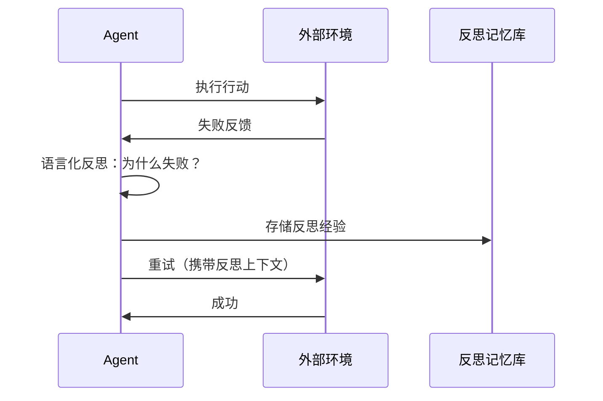

### 4.5.6 记忆压缩策略

当记忆量增长到一定程度，需要压缩策略来控制上下文长度：

| 策略 | 方法 | 压缩比 | 信息损失 |
|------|------|--------|---------|
| 滑动窗口 | 只保留最近 $K$ 轮 | 高 | 高（丢弃早期信息） |
| 摘要压缩 | 用 LLM 生成历史摘要 | 中 | 中 |
| 关键信息提取 | 只保留实体、关系、决策 | 中 | 中低 |
| 向量检索 | 全量存储，按需检索 | 无压缩 | 低 |
| 分层压缩 | 近期保留完整记录，远期仅保留摘要 | 可调 | 可控 |

---

## 4.6 工具调用与 Function Calling

Agent 的"行动"能力主要通过工具调用实现。**Function Calling**（函数调用）是 LLM 与外部工具交互的核心机制。

### 4.6.1 原理

LLM 本身无法直接执行代码或访问互联网，但它可以通过生成结构化输出来"指挥"外部工具完成操作。Function Calling 的本质是：LLM 根据用户需求和工具描述，生成符合特定格式的调用指令，由外部系统解析并执行。

### 4.6.2 工作流程

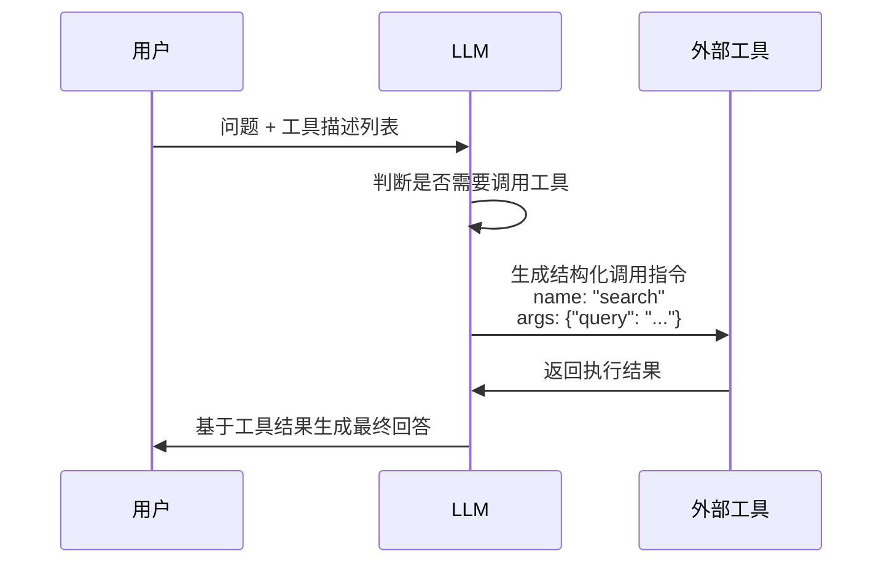

### 4.6.3 工具描述格式

工具以结构化方式描述其名称、功能和参数，供 LLM 理解和选择：

```yaml
tools:
  - name: search
    description: 搜索互联网获取信息
    parameters:
      - name: query
        type: string
        description: 搜索关键词
```

### 4.6.4 训练 LLM 进行工具调用的三种方式

| 方式 | 描述 |
|------|------|
| **Prompt 工程** | 在 system prompt 中描述工具的格式和用法，依赖 LLM 的指令遵循能力 |
| **指令微调（SFT）** | 用包含工具调用格式的数据对 LLM 进行监督微调，使其学会生成结构化调用 |
| **强化学习（RL）优化** | 以工具调用的成功率作为奖励信号，通过 RL 进一步优化调用准确性 |

从 Prompt 工程到 RL 优化，工具调用的可靠性逐步提升，但训练成本也随之增加。

---

## 4.7 MCP 协议：标准化的工具通信

Function Calling 解决了"LLM 如何调用工具"的问题，但不同厂商的实现格式各异，缺乏统一标准。**MCP（Model Context Protocol，模型上下文协议）** 正是为解决这一问题而生。

### 4.7.1 定义

MCP 是由 Anthropic 提出的开放标准协议，规范了 LLM 与外部工具/数据源之间的通信方式。可以将其类比为 AI 领域的"USB 接口标准"——就像 USB 让各种外设可以即插即用一样，MCP 让各种工具可以被任何支持该协议的 LLM 即插即用。

### 4.7.2 核心架构

MCP 采用三层架构：

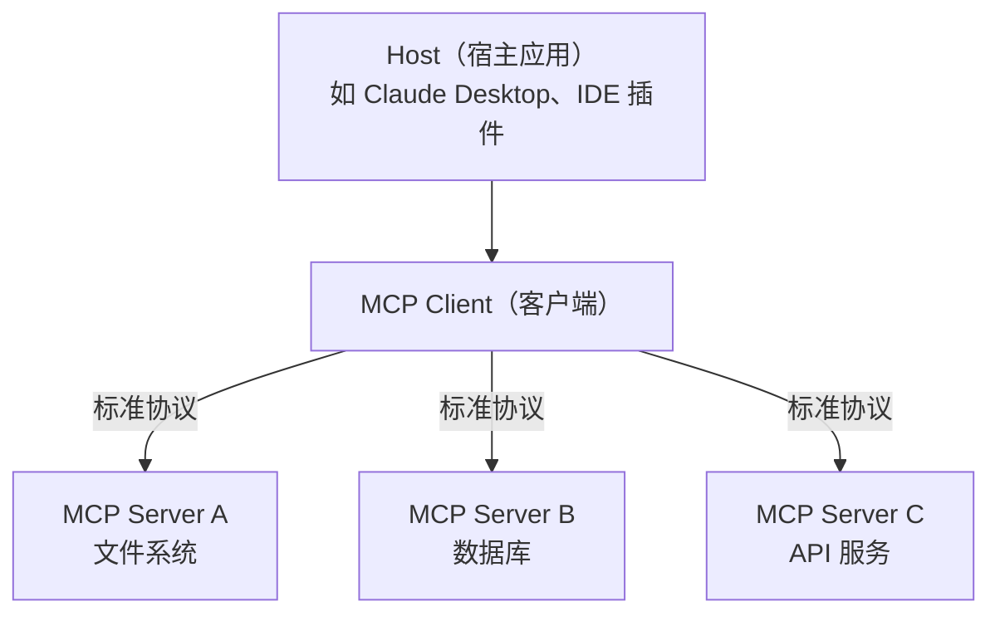

**三大核心概念**

| 概念 | 角色 | 类比 |
|------|------|------|
| **Host（宿主）** | 运行 LLM 的宿主应用 | 浏览器 |
| **Client（客户端）** | 与 Server 建立连接的中间层，管理多个 Server 连接 | 浏览器的插件管理器 |
| **Server（服务端）** | 提供具体能力的服务端程序 | 浏览器插件 |

### 4.7.3 Server 暴露的三类能力

| 能力类型 | 描述 | 示例 |
|---------|------|------|
| **Tools（工具）** | 可调用的函数或操作 | 查询数据库、调用 API、执行代码 |
| **Resources（资源）** | 可读取的数据或文件 | 文档内容、数据库记录、配置文件 |
| **Prompts（提示模板）** | 预定义的提示模板 | 特定任务的 prompt 模板 |

### 4.7.4 MCP 与 Function Calling 的区别

| 维度 | Function Calling | MCP |
|------|-----------------|-----|
| 定义层 | 各厂商自定义格式 | 开放标准协议 |
| 工具发现 | 硬编码在 prompt 中 | 动态发现（Server 自描述能力） |
| 工具生态 | 封闭（绑定特定模型厂商） | 开放（任何 LLM 均可使用） |
| 连接管理 | 无持久连接 | Client-Server 持久连接 |
| 安全性 | 依赖模型自身判断 | 内置权限控制 + 沙箱机制 |

### 4.7.5 MCP 通信流程

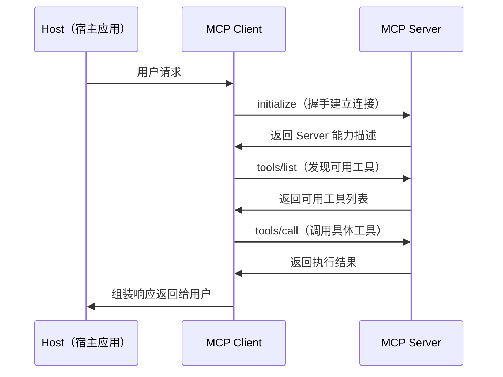

MCP 使用标准化的 HTTP + JSON-RPC 协议进行通信，这意味着用任何编程语言都可以实现 MCP Server，极大地降低了工具集成的门槛。

---

## 4.8 Workflow 与 Agent 的边界

在实际工程中，一个常见的设计决策是：某个功能应该用 **Workflow（工作流）** 还是 **Agent（智能体）** 来实现？理解两者的本质区别是做出正确选型的前提。

### 4.8.1 核心定义

| 维度 | Workflow（工作流） | Agent（智能体） |
|------|-------------------|----------------|
| 定义 | 预定义的固定执行流程 | 自主决策的动态执行流程 |
| 控制流 | 确定性（if-else / 状态机） | 非确定性（LLM 决策） |
| 灵活性 | 低（只能处理预设情况） | 高（可处理意外情况） |
| 可靠性 | 高（行为可预测） | 较低（行为不确定） |
| 适用复杂度 | 简单、结构化任务 | 复杂、开放式任务 |

### 4.8.2 架构对比

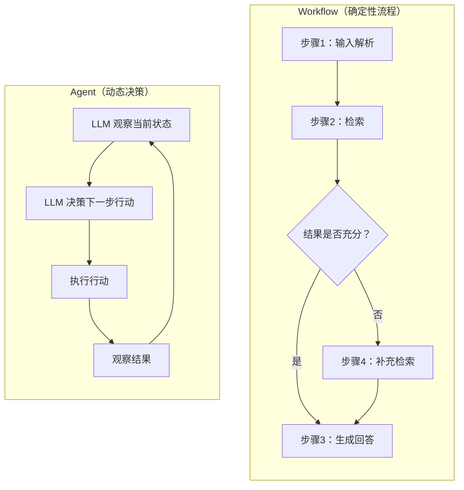

**核心区别在于决策权的归属**：

| 维度 | Workflow | Agent |
|------|----------|-------|
| 下一步做什么 | 由代码/规则决定 | 由 LLM 决定 |
| 异常处理 | 预设的 fallback 逻辑 | LLM 自主判断处理方式 |
| 循环/重试 | 固定次数 | LLM 判断是否继续 |
| 适用场景 | 流程明确、步骤固定 | 流程不确定、需要灵活决策 |

### 4.8.3 选型指南

| 场景 | 选 Workflow | 选 Agent |
|------|-----------|---------|
| 客服 FAQ | 流程固定，适合 | 过度设计 |
| 数据 ETL | 步骤确定，适合 | 不需要决策 |
| 复杂研究 | 无法预设所有路径 | 需要灵活探索，适合 |
| 代码调试 | 错误类型不可预知 | 需要自主判断，适合 |
| 混合场景 | 主流程用 Workflow | 异常分支用 Agent |

### 4.8.4 实践：Workflow + Agent 混合架构

当前主流做法是 **Workflow 为主、Agent 为辅**：

1. 主流程用 Workflow 保证可靠性和可预测性
2. 在关键决策点嵌入 Agent 处理不确定性
3. Agent 的行动范围受 Workflow 约束，防止失控

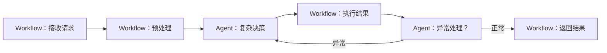

---

## 4.9 任务拆分与长上下文处理

Agent 在执行复杂任务时，面临两个核心工程问题：如何将大任务拆解为可执行的子任务，以及如何在有限的上下文窗口中管理不断增长的信息。

### 4.9.1 任务拆分策略

复杂任务无法一步完成，需要拆解为可执行的子任务序列。拆分粒度直接决定 Agent 的执行效率和成功率。

**主要拆分方法**

| 方法 | 原理 | 适用场景 |
|------|------|---------|
| **CoT 分解** | LLM 逐步推理，自动拆分任务 | 简单线性任务 |
| **HuggingGPT 式** | LLM 作为控制器，将子任务分配给专家模型 | 多模态/多领域任务 |
| **Plan-and-Solve** | 先生成完整计划，再逐步执行 | 多步推理任务 |
| **递归分解** | 对子任务继续拆分，直到原子操作 | 层次化复杂任务 |
| **ADaPT** | 根据执行反馈自适应调整拆分策略 | 不确定性高的任务 |

**拆分粒度的权衡**

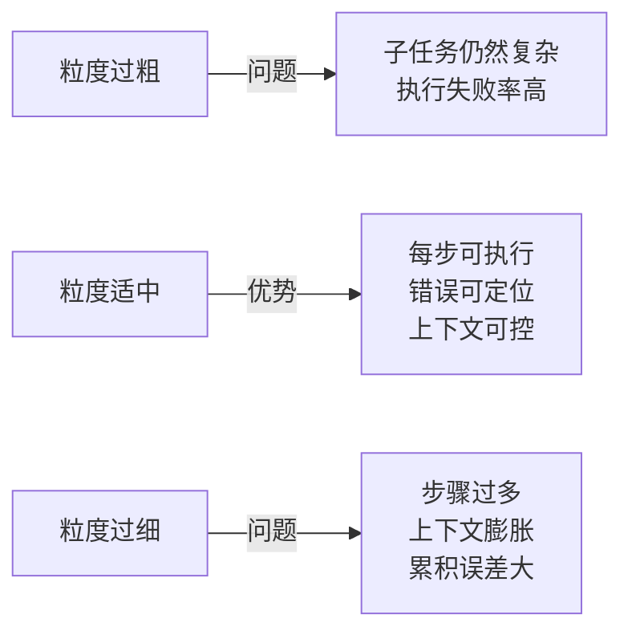

**Plan-then-Execute vs 逐步规划**

| 维度 | Plan-then-Execute | 逐步规划（ReAct） |
|------|-------------------|------------------|
| 流程 | 一次性生成完整计划，然后顺序执行 | 每步观察后决定下一步 |
| 全局性 | 强（有全局视野） | 弱（局部决策） |
| 灵活性 | 低（计划生成后不可变） | 高（根据反馈实时调整） |
| 适用场景 | 结构化任务 | 开放式探索任务 |

实践建议：采用混合策略——先进行粗粒度规划建立全局视野，执行过程中再进行细粒度调整。

### 4.9.2 长上下文处理

随着 Agent 执行步骤的增加，对话历史、工具返回结果和记忆内容会不断累积，带来严峻的上下文管理挑战。

**核心挑战**

| 问题 | 原因 |
|------|------|
| 上下文溢出 | 对话历史 + 工具结果 + 记忆内容超出 LLM 的上下文窗口 |
| Lost in the Middle | LLM 倾向于关注上下文的开头和结尾，中间信息容易被忽略 |
| 信息冗余 | 大量无关的历史信息占据宝贵的上下文空间 |
| 成本上升 | Token 数量与推理成本线性相关 |

**解决方案体系**

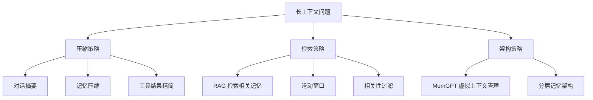

**MemGPT 架构**

MemGPT 将操作系统（OS）的虚拟内存管理思想引入 Agent 的上下文管理：

| OS 概念 | MemGPT 对应 | 作用 |
|---------|------------|------|
| 物理内存 | LLM 上下文窗口 | 当前可用的有限空间 |
| 磁盘 | 外部存储（向量数据库） | 持久化的大容量记忆 |
| 页面调度 | 上下文换入/换出 | 动态管理上下文中的内容 |
| 页表 | 记忆索引 | 定位记忆的存储位置 |

MemGPT 让 Agent 自主决定何时将信息移入或移出上下文窗口，从而突破固定窗口大小的限制。

**工具结果精简策略**

| 策略 | 方法 |
|------|------|
| 截断 | 保留工具返回结果的前 $N$ 个字符 |
| 摘要 | 用 LLM 对工具结果生成摘要 |
| 过滤 | 只保留与当前任务相关的字段 |
| 结构化 | 要求工具返回结构化数据而非原始文本 |

---

## 4.10 多智能体系统

当单个 Agent 的能力不足以应对复杂任务时，可以让多个 Agent 协作完成。**多智能体系统（Multi-Agent System, MAS）** 通过分工协作来解决单一 Agent 难以胜任的问题。

### 4.10.1 基本架构

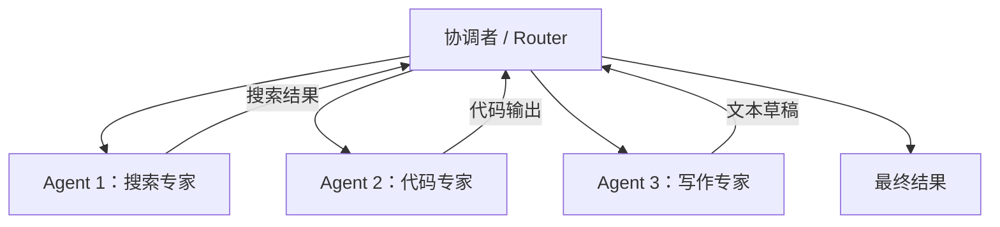

### 4.10.2 优势

1. **专业化**：每个 Agent 专注一个领域，在其擅长的任务上表现更好
2. **并行性**：独立的子任务可以并行执行，提升整体效率
3. **鲁棒性**：单个 Agent 失败不影响整体系统运行
4. **可扩展性**：新增能力只需添加新的 Agent，无需修改现有系统

### 4.10.3 新增的复杂性

1. **通信开销**：Agent 之间信息传递带来额外的延迟和成本
2. **协调难度**：任务分配、冲突解决、结果整合都需要精心设计
3. **一致性问题**：多个 Agent 可能产生相互矛盾的输出
4. **调试困难**：错误来源难以在多个 Agent 之间定位

### 4.10.4 三种协作模式

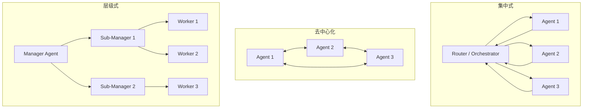

| 模式 | 优点 | 缺点 | 代表框架 |
|------|------|------|---------|
| **集中式** | 控制简单，一致性高 | 存在单点瓶颈 | AutoGen、CrewAI |
| **去中心化** | 鲁棒性强，无单点故障 | 一致性难以保证 | Swarm |
| **层级式** | 可扩展性好，分工明确 | 延迟逐层叠加 | MetaGPT |

### 4.10.5 OpenAI Swarm 模式

**Swarm** 是 OpenAI 推出的轻量级多 Agent 编排框架，其核心概念包括：

| 概念 | 说明 |
|------|------|
| **Agent** | 封装了指令（Instructions）和可用工具（Tools）的实体 |
| **Handoff** | Agent 之间转移控制权的机制 |
| **Routine** | Agent 的指令与工具的集合 |

**Swarm 核心流程**

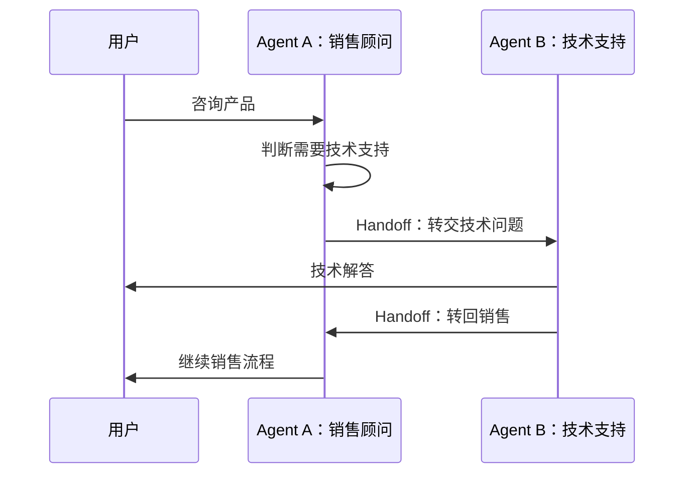

**Swarm 与 AutoGen 的区别**

| 维度 | Swarm | AutoGen |
|------|-------|---------|
| 编排方式 | Agent 自主 Handoff | 预定义对话流程 |
| 状态管理 | 无状态 | 有状态 |
| 复杂度 | 极轻量 | 较重 |
| 适用场景 | 简单路由/转交 | 复杂多轮协作 |

### 4.10.6 多 Agent 通信协议

| 协议/方式 | 描述 |
|----------|------|
| 自然语言 | Agent 之间用自然语言对话（最灵活但最不可靠） |
| 结构化 JSON | 约定统一的消息格式（如 A2A 的 Message 格式） |
| 共享黑板 | 所有 Agent 读写同一个共享状态空间 |
| 事件驱动 | Agent 通过发布/订阅事件进行异步通信 |

### 4.10.7 典型多 Agent 框架

- **AutoGen**（微软）：多 Agent 对话式协作框架，支持复杂的多轮对话
- **CrewAI**：角色化多 Agent 协作，每个 Agent 扮演特定角色
- **MetaGPT**：模拟软件公司的组织结构，Agent 分别扮演产品经理、架构师、工程师等角色

---

## 4.11 A2A 协议：跨平台的 Agent 互操作

多 Agent 系统面临一个关键问题：不同框架构建的 Agent 如何互相发现和协作？**A2A（Agent-to-Agent）** 协议正是为解决这一互操作性问题而设计的。

### 4.11.1 定义

A2A 是由 Google 提出的 Agent 间通信协议。它与普通 Agent 框架的最关键区别在于：**A2A 是 Agent 间的通信协议，而非 Agent 开发框架**。

| 维度 | 普通 Agent 框架 | A2A |
|------|---------------|-----|
| 关注点 | 单个 Agent 内部如何构建 | 多个 Agent 之间如何通信 |
| 核心抽象 | 工具、链、记忆 | Agent Card、Task、Message |
| 互操作性 | 仅框架内互通 | 跨框架、跨平台互通 |
| 协议层 | 无标准协议 | 标准化 HTTP + JSON-RPC |

### 4.11.2 核心概念

A2A 定义了三个核心抽象：

- **Agent Card**：Agent 的"名片"，描述该 Agent 的能力、接口和元信息，供其他 Agent 发现和了解
- **Task**：Agent 接收的任务单元，包含任务描述和执行上下文
- **Message**：Agent 之间交换的消息，承载任务执行过程中的信息流

通过这三个抽象，不同框架构建的 Agent 可以互相发现能力、分配任务、交换信息，实现真正的跨平台协作。

---

## 4.12 Agent 微调与训练

当通用 LLM 的 Agent 行为不够理想时，可以通过微调来提升其作为 Agent 的表现。Agent 微调与通用模型微调有本质区别。

### 4.12.1 Agent 微调 vs 模型微调

| 维度 | 模型微调 | Agent 微调 |
|------|---------|-----------|
| 目标 | 提升模型的基础能力（推理、知识、语言） | 提升模型的 Agent 行为（工具调用、规划、反思） |
| 训练数据 | 通用指令/对话数据 | Agent 轨迹数据 $(s, a, o)$（状态、行动、观察） |
| 评估基准 | 通用 benchmark（MMLU、HumanEval） | Agent benchmark（SWE-bench、WebArena） |
| 核心挑战 | 知识获取、推理增强 | 格式正确性、多步一致性、错误恢复 |

**适用场景对比**

| 场景 | 选模型微调 | 选 Agent 微调 |
|------|-----------|-------------|
| 模型基础知识不足 | 补充领域知识 | 无法弥补知识缺陷 |
| 工具调用格式错误 | 通用微调不针对此问题 | 专门训练工具调用格式 |
| 多步推理失败 | 提升推理能力 | 训练规划策略 |
| Agent 行为不一致 | 不解决行为问题 | 对齐 Agent 行为模式 |
| 新工具适配 | 不适用 | 少量轨迹即可适配 |

### 4.12.2 数据收集方式

Agent 微调需要高质量的轨迹数据，主要收集方式包括：

1. **轨迹蒸馏（Trajectory Distillation）**：用强模型（如 GPT-4）执行任务，收集 $(state, action, observation)$ 轨迹作为训练数据
2. **人工标注**：人工演示任务执行过程，记录完整的操作序列
3. **自举采样（Bootstrap Sampling）**：让模型自主尝试执行任务，筛选成功轨迹作为正样本
4. **拒绝采样（Rejection Sampling）**：生成多条轨迹，用奖励模型筛选最优轨迹

### 4.12.3 微调方法

| 方法 | 描述 |
|------|------|
| **SFT（监督微调）** | 用成功轨迹做监督微调，让模型学习正确的行为模式 |
| **DPO（直接偏好优化）** | 对比成功/失败轨迹做偏好优化，无需训练奖励模型 |
| **RL（强化学习）** | 用任务完成率作为奖励信号，通过强化学习优化策略 |

### 4.12.4 Agent RL 的目标函数

Agent 强化学习的优化目标为最大化期望累积奖励：

$$\max_\theta \mathbb{E}_{\tau \sim \pi_\theta} \left[ \sum_{t=1}^{T} \gamma^t r(s_t, a_t) \right]$$

其中：
- $\theta$ 为模型参数
- $\pi_\theta$ 为由参数 $\theta$ 定义的策略（即 Agent 的行为策略）
- $\tau = (s_1, a_1, o_1, \ldots, s_T, a_T, o_T)$ 为 Agent 的完整执行轨迹
- $s_t$ 为第 $t$ 步的状态，$a_t$ 为第 $t$ 步的行动，$o_t$ 为第 $t$ 步的观察
- $r(s_t, a_t)$ 为第 $t$ 步的即时奖励
- $\gamma \in [0, 1]$ 为折扣因子，控制对未来奖励的重视程度

**RL 方法对比**

| 方法 | 奖励信号 | 优点 | 缺点 |
|------|---------|------|------|
| 任务完成率 | 0/1 二值奖励 | 简单直接 | 稀疏奖励，学习速度慢 |
| 过程奖励（PRM） | 每步打分 | 密集信号，学习更高效 | 标注成本高 |
| 轨迹对比（DPO） | 成功/失败轨迹对 | 无需训练奖励模型 | 需要配对数据 |
| AI 反馈（RLAIF） | 强模型评判 | 可扩展性好 | 评判质量依赖强模型 |

### 4.12.5 关键挑战

- **轨迹多样性**：同一任务可能有多种正确的执行路径，训练数据需要覆盖这种多样性
- **错误传播**：中间步骤的错误会导致后续步骤全部无效，需要设计容错机制
- **工具格式精确性**：Agent 必须精确生成结构化的工具调用格式，任何格式错误都会导致调用失败

---

## 4.13 模型能力与框架设计的平衡

构建 Agent 系统时，一个核心设计问题是：多少逻辑应该交给模型自主决策，多少应该由框架硬编码？

### 4.13.1 核心关系

Agent 的表现可以概括为：

$$\text{Agent 表现} = \text{模型能力} \times \text{框架设计}$$

两者互补但不可替代。

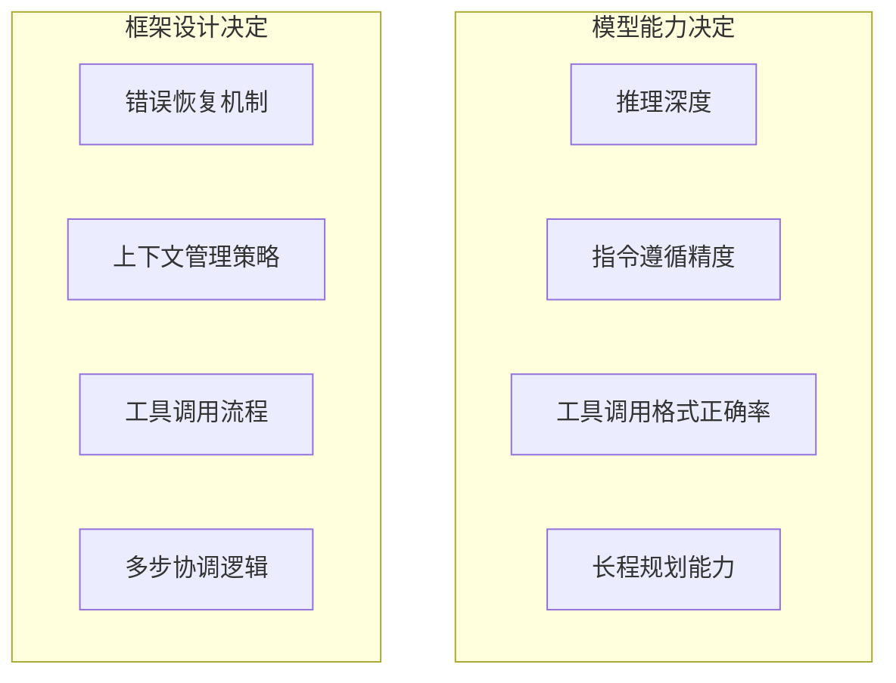

### 4.13.2 关键原则

| 原则 | 说明 |
|------|------|
| **模型不够框架补** | 模型推理能力弱时，框架应做更多约束和验证 |
| **框架不够模型补** | 框架难以枚举所有情况时，依赖模型的灵活决策能力 |
| **短板决定上限** | 模型能力严重不足时，再精巧的框架也无法弥补 |
| **避免过度框架化** | 把所有逻辑硬编码会丧失 Agent 的灵活性 |
| **避免过度依赖模型** | 不做任何约束会导致可靠性极低 |

### 4.13.3 不同模型等级的框架策略

| 模型等级 | 框架策略 | 示例 |
|---------|---------|------|
| 强模型（GPT-4 / Claude） | 轻框架，给模型更多自主权 | ReAct + 最少约束 |
| 中等模型（7B-13B 参数） | 中等框架，关键节点加验证 | Workflow + Agent 混合 |
| 弱模型（< 7B 参数） | 重框架，流程高度结构化 | 纯 Workflow，模型只做单步判断 |

核心思路是：模型越强，框架越轻；模型越弱，框架越重。这是一个动态平衡——随着模型能力的提升，框架可以逐步"放权"。

---

## 4.14 安全、对齐与具身智能

Agent 能够执行真实操作（删除文件、发送邮件、调用 API），因此安全性是不可忽视的工程问题。

### 4.14.1 构建 Agent 的主要挑战

1. **可靠性**：LLM 输出具有不确定性，工具调用可能失败，需要大量错误处理逻辑
2. **长程规划**：多步任务中错误会逐步累积，难以从中间状态恢复
3. **上下文窗口**：复杂任务的对话历史和工具结果可能超出上下文长度限制
4. **延迟与成本**：多轮 LLM 调用叠加工具调用，延迟和成本显著增加
5. **评估困难**：Agent 的行为空间巨大，难以系统化地评估其表现
6. **安全性**：Agent 可执行真实操作，需要严格的权限控制

### 4.14.2 安全风险

| 风险类型 | 描述 |
|---------|------|
| **越权操作** | Agent 执行超出授权范围的行动 |
| **提示注入（Prompt Injection）** | 恶意输入操控 Agent 的行为 |
| **工具滥用** | 利用工具漏洞造成损害 |
| **信息泄露** | Agent 在交互过程中泄露敏感信息 |

### 4.14.3 安全保障方法

| 方法 | 描述 |
|------|------|
| **权限控制** | 最小权限原则，限制 Agent 可调用的工具和操作范围 |
| **人工确认（Human-in-the-Loop）** | 高风险操作前需人工审批 |
| **沙箱执行（Sandbox）** | 在隔离环境中执行不确定的操作 |
| **行为监控** | 实时检测异常行为模式 |
| **宪法 AI（Constitutional AI）** | 用明确的规则约束 Agent 的行为边界 |
| **红队测试（Red Teaming）** | 主动测试 Agent 的安全漏洞 |

### 4.14.4 软件 Agent 与具身 Agent

Agent 不仅存在于数字世界，也可以驱动物理实体。两类 Agent 面临截然不同的挑战：

| 维度 | 软件 Agent | 具身 Agent（Embodied Agent） |
|------|-----------|---------------------------|
| 环境 | 数字环境（API、网页） | 物理环境（机器人、游戏世界） |
| 感知 | 文本 / 结构化数据 | 多模态传感器（视觉、触觉、听觉） |
| 行动 | API 调用、代码执行 | 物理动作（移动、抓取、操作） |
| 可逆性 | 大多数操作可撤销 | 物理动作通常不可逆 |
| 安全性 | 数据安全 | 人身安全 |
| 反馈 | 确定性（API 返回明确结果） | 噪声大（传感器存在误差） |
| 核心挑战 | 工具调用的可靠性 | 感知-动作映射、安全控制 |

具身 Agent 的安全要求远高于软件 Agent，因为物理动作的后果不可逆，且直接关系到人身安全。

---

## 4.15 开发框架选型

最后，我们对比两个最主流的 Agent 开发框架，帮助读者在实际项目中做出选型决策。

### 4.15.1 LangChain vs LlamaIndex

| 维度 | LangChain | LlamaIndex |
|------|-----------|------------|
| **核心定位** | 通用 Agent 开发框架 | 数据索引与检索框架 |
| **核心场景** | 工具调用、多步推理、对话 Agent | RAG、知识库构建、文档问答 |
| **数据处理** | 基础文档加载 | 深度索引（树索引/图索引/关键词索引） |
| **检索能力** | 基础向量检索 | 多级检索、混合检索、重排序 |
| **Agent 能力** | 强（丰富的工具链和链式调用） | 中（聚焦于检索增强） |
| **生态** | 更大、更杂 | 更聚焦、更精简 |
| **适用场景** | 复杂工作流、多工具 Agent | 知识密集型应用、RAG |

**选型建议**：
- 需要构建复杂 Agent 工作流 → 选 LangChain
- 需要高质量的 RAG（检索增强生成）→ 选 LlamaIndex
- 两者并非互斥，可以组合使用：用 LlamaIndex 构建检索层，用 LangChain 编排 Agent 工作流

---

## 本章小结

本章从基础概念到工程实践，系统梳理了 LLM Agent 的完整知识体系。下图总结了各核心概念之间的关系：

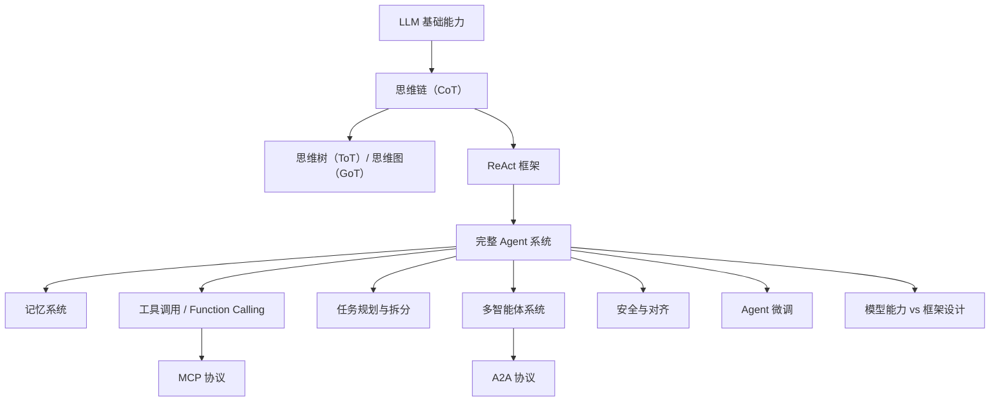

**核心要点回顾**：

1. Agent = LLM + Planning + Memory + Action，四大组件形成闭环
2. CoT 是推理基石，ToT/GoT 是其在搜索空间上的扩展
3. ReAct 将推理与行动交织，是当前最主流的 Agent 执行范式
4. 记忆系统分短期和长期，MemGPT、Reflexion 等方案各有侧重
5. MCP 协议标准化了工具通信，A2A 协议标准化了 Agent 间通信
6. Workflow 与 Agent 各有适用场景，混合架构是主流实践
7. Agent 微调关注轨迹数据和行为对齐，与通用模型微调有本质区别
8. 模型能力与框架设计需要动态平衡，短板决定上限
9. 安全性是 Agent 工程化的必要条件，需要多层防护机制