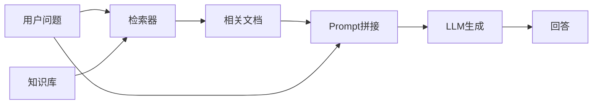
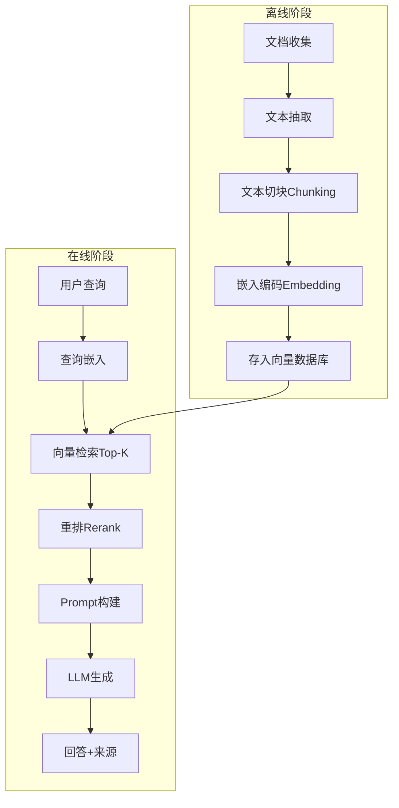
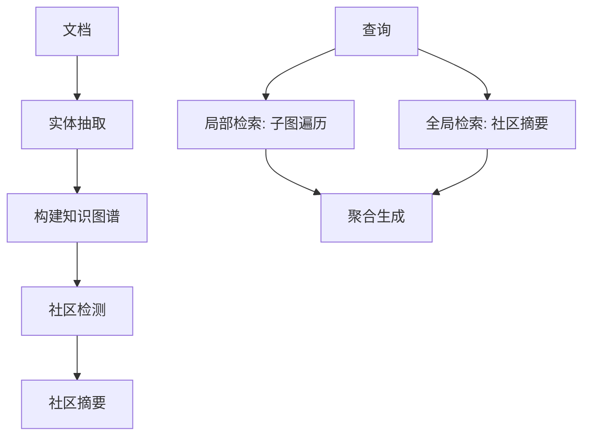

# 五、RAG 面试真题

## 1. RAG 工作原理与优势

### 核心原理

将检索与生成结合：先从外部知识库检索相关文档，再将检索结果作为上下文输入 LLM 生成回答。

### RAG vs 微调

| 维度 | RAG | 微调 |
|------|-----|------|
| 知识更新 | 实时更新知识库即可 | 需重新训练 |
| 幻觉控制 | 有外部证据支撑 | 依赖模型记忆 |
| 成本 | 低（无需训练） | 高（需训练数据+算力） |
| 适用场景 | 事实性问答、知识密集任务 | 风格适配、能力注入 |
| 知识范围 | 受检索质量限制 | 受训练数据限制 |
| 可解释性 | 高（可追溯来源） | 低 |

**核心优势**：无需重新训练即可注入新知识，减少幻觉，回答可溯源。

---

## 2. 完整 RAG 流水线

### 各步骤详解

| 步骤 | 关键技术 |
|------|---------|
| 文本抽取 | PDF解析、OCR、表格提取 |
| 切块 | 固定大小/语义切分/递归切分 |
| 嵌入 | BGE, GTE, OpenAI ada |
| 向量存储 | FAISS, Milvus, Chroma |
| 检索 | 余弦相似度/ANN |
| 重排 | Cross-Encoder, Cohere Rerank |
| 生成 | 上下文窗口内的增强生成 |

---

## 3. 文本切块策略

### 切块大小与重叠的权衡

| | 小块 | 大块 |
|---|---|---|
| 检索精度 | 高（语义集中） | 低（语义混杂） |
| 上下文完整性 | 低（可能截断） | 高（保留完整语义） |
| 噪声 | 少 | 多 |
| LLM输入效率 | 高（信息密度高） | 低（冗余信息多） |

### 常见策略

| 策略 | 描述 | 适用场景 |
|------|------|---------|
| 固定大小+重叠 | 每 N 个 token 一块，重叠 M 个 | 通用 |
| 递归字符切分 | 按分隔符层级切分（\n\n → \n → .） | 结构化文档 |
| 语义切分 | 嵌入后按语义相似度断开 | 长文、叙述性文本 |
| 文档结构切分 | 按标题/章节/段落切分 | Markdown, HTML |
| 句子级切分 | 按句子边界切分 | 精确检索 |

### 经验值

- 块大小：256-512 tokens（通用），512-1024（需要更多上下文）
- 重叠：块大小的 10%-20%
- 关键原则：**块应尽量保持语义完整性**

---

## 4. 嵌入模型选择与评估

### 评估指标

| 指标 | 公式 | 含义 |
|------|------|------|
| NDCG@K | $\text{DCG@K} / \text{IDCG@K}$ | 排序质量（考虑位置权重） |
| Recall@K | $\|R \cap G\| / \|G\|$ | 前K个中相关文档的比例 |
| MRR | $1 / \text{rank of first relevant}$ | 第一个相关文档的排名倒数 |
| Hit Rate | 有相关文档的查询比例 | 粗粒度检索成功率 |

### 主流嵌入模型

| 模型 | 维度 | 特点 |
|------|------|------|
| BGE-large-zh | 1024 | 中文最优开源之一 |
| GTE-large | 1024 | 多语言，阿里达摩院 |
| OpenAI text-embedding-3 | 1536/3072 | 闭源，效果好 |
| E5-mistral-7b | 4096 | LLM-based嵌入，效果最好但慢 |
| BGE-M3 | 1024 | 多功能（dense+sparse+colbert） |

### 选择原则

1. **语言匹配**：中文选 BGE/GTE，英文选 E5/GTE
2. **效率 vs 效果**：小模型快但效果有限，LLM-based 效果好但慢
3. **领域适配**：领域数据微调嵌入模型可显著提升

---

## 5. 提升检索质量的技术

### 基础向量检索之外

| 技术 | 原理 | 效果 |
|------|------|------|
| Hybrid Search | 向量检索 + 关键词检索(BM25)融合 | 互补，提升召回 |
| Reranking | 用Cross-Encoder对初检结果精排 | 提升精度 |
| Query Rewriting | 改写/扩展用户查询 | 提升召回 |
| HyDE | 先让LLM生成假设回答，用假设回答检索 | 提升语义匹配 |
| Multi-Query | 生成多个查询变体分别检索 | 提升召回覆盖 |
| Contextual Chunking | 元数据增强（标题、摘要附加到块中） | 提升检索精度 |
| ColBERT | Token级交互的后期匹配 | 细粒度匹配 |

### Hybrid Search 融合

$$\text{Score} = \alpha \cdot \text{Score}_{dense} + (1-\alpha) \cdot \text{Score}_{sparse}$$

其中 $\alpha$ 为融合权重，通常通过验证集调优。

### HyDE 流程

---

## 6. Lost in the Middle

### 现象

LLM 对上下文中间位置的信息利用效率显著低于首尾位置。Liu et al. (2023) 发现：当相关信息放在上下文中间时，模型表现明显下降。

### 缓解方法

1. **重排序**：将最相关的文档放在上下文的首尾位置
2. **减少冗余**：压缩检索结果，减少中间噪声
3. **分段处理**：将长上下文拆分为多个短上下文分别处理
4. **长上下文模型**：使用原生支持长上下文的模型（如 GPT-4-128K）

---

## 7. RAG 系统评估

### 检索阶段评估

| 指标 | 评估内容 |
|------|---------|
| Recall@K | 前K个结果中相关文档的召回率 |
| Precision@K | 前K个结果中相关文档的精确率 |
| MRR | 首个相关文档的排名 |
| NDCG | 排序质量 |

### 生成阶段评估

| 指标 | 评估内容 |
|------|---------|
| Faithfulness | 生成内容是否忠实于检索文档（无幻觉） |
| Answer Relevancy | 回答与问题的相关性 |
| Context Precision | 检索到的上下文中有用信息的比例 |
| Context Recall | 回答所需信息是否都被检索到 |

### 综合框架

**RAGAS** (Es et al., 2023)：自动化评估框架，用 LLM 评估上述指标。

$$\text{Faithfulness} = \frac{\text{可从上下文推导的声明数}}{\text{总声明数}}$$

---

## 8. 图数据库/知识图谱增强 RAG

### 适用场景

| 场景 | 向量RAG | 知识图谱RAG |
|------|---------|-------------|
| 事实性问答 | 适合 | 适合 |
| 多跳推理 | 弱 | 强 |
| 关系查询 | 弱 | 强 |
| 实体消歧 | 弱 | 强 |
| 结构化知识 | 弱 | 强 |

### GraphRAG 工作流程

### 优势

1. **多跳推理**：沿图谱路径推理，如 A→B→C
2. **精确关系**：显式建模实体间关系
3. **全局视角**：社区摘要提供全局理解

### 劣势

1. **构建成本高**：实体抽取和关系构建需要额外处理
2. **更新维护**：图谱更新比向量库复杂
3. **查询复杂**：需要图查询语言（Cypher等）

---

## 9. 高级 RAG 范式

### Adaptive Retrieval（自适应检索）

模型自主决定是否需要检索，而非每次都检索。

$$P(\text{retrieve} | q) = \begin{cases} 1 & \text{if } \text{confidence}(q) < \theta \\ 0 & \text{otherwise} \end{cases}$$

### Iterative Retrieval（迭代检索）

生成过程中多次检索，每次基于已生成内容重新检索补充信息。

### Self-RAG

模型通过特殊 token 自主控制：`[Retrieve]` 是否检索、`[IsRel]` 检索是否相关、`[IsSup]` 生成是否有支撑、`[IsUse]` 生成是否有用。

### FLARE（Forward-Looking Active REtrieval）

生成时遇到低置信度 token 主动触发检索，用检索结果重新生成该段。

---

## 10. RAG 部署挑战

| 挑战 | 描述 | 解决方案 |
|------|------|---------|
| 检索延迟 | 向量检索+重排耗时 | ANN索引、缓存、异步 |
| 知识更新 | 知识库需持续更新 | 增量索引、流式更新 |
| 多源异构 | 不同格式/来源的知识 | 统一抽取管线 |
| 安全性 | 检索到敏感信息 | 权限过滤、脱敏 |
| 可扩展性 | 知识库规模增长 | 分布式向量数据库 |
| 质量退化 | 知识库中过时/错误信息 | 定期清洗、版本管理 |

---

## 11. 搜索系统 vs RAG

| 维度 | 搜索系统 | RAG |
|------|---------|-----|
| 目标 | 返回相关文档 | 生成综合回答 |
| 输出 | 文档列表 | 自然语言回答 |
| 推理能力 | 无 | 有（LLM推理） |
| 信息整合 | 无（单文档） | 有（多文档综合） |
| 准确性要求 | 高（精确匹配） | 高（忠实于来源） |
| 典型技术 | BM25, 倒排索引, PageRank | 向量检索 + LLM生成 |

**关系**：RAG = 搜索系统 + LLM生成层。搜索是 RAG 的子模块。

---

## 12. 开源 RAG 框架

| 框架 | 特点 | 适用场景 |
|------|------|---------|
| RAGFlow | 深度文档理解、可视化编排、模板化 | 企业级文档问答 |
| LangChain | 通用Agent框架，RAG是子功能 | 复杂RAG+Agent工作流 |
| LlamaIndex | 数据索引专家，检索质量高 | 知识密集型RAG |
| Dify | 低代码RAG平台，可视化 | 快速搭建RAG应用 |
| QAnything | 网易有道，支持离线部署 | 本地化部署 |
| FastGPT | 工作流编排，知识库管理 | 中小规模知识库 |

### 选型原则

1. **简单文档问答**：RAGFlow / Dify（开箱即用）
2. **复杂工作流**：LangChain + LlamaIndex
3. **检索质量优先**：LlamaIndex
4. **私有化部署**：RAGFlow / QAnything
5. **快速原型**：Dify / FastGPT
