# 第五章 检索增强生成（RAG）

> **本章导读**
>
> 大语言模型（Large Language Model, LLM）虽然具备强大的文本生成能力，但其知识来源于训练数据，存在知识过时、无法获取私有数据、容易产生"幻觉"（Hallucination，即生成看似合理但实际错误的内容）等固有缺陷。**检索增强生成**（Retrieval-Augmented Generation, RAG）正是为解决这些问题而诞生的技术范式——它将信息检索与文本生成相结合，让模型在回答问题前先"查阅资料"，从而生成更准确、可溯源的回答。
>
> 本章将从 RAG 的基本原理出发，逐步深入到完整的工程流水线、核心组件的技术细节、系统评估方法，以及前沿的高级范式，帮助读者建立对 RAG 技术体系的全面理解。

---

## 5.1 RAG 的基本原理

### 5.1.1 什么是 RAG

RAG 的核心思想可以用一句话概括：**先检索，再生成**。当用户提出一个问题时，系统首先从外部知识库中检索出与问题相关的文档片段，然后将这些片段作为上下文（Context）与用户问题一起输入 LLM，由模型基于这些"证据"生成最终回答。

这一过程类似于人类在回答专业问题时的行为——先查阅参考资料，再组织语言作答，而非完全凭记忆回答。

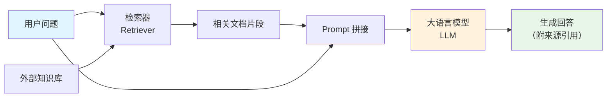

### 5.1.2 RAG 与微调的对比

在为 LLM 注入领域知识时，RAG 和微调（Fine-tuning）是两种主要路径。理解它们的差异有助于在实际项目中做出正确的技术选型。

| 对比维度 | RAG | 微调（Fine-tuning） |
|---------|-----|-------------------|
| **知识更新** | 实时更新知识库即可生效 | 需要重新训练模型 |
| **幻觉控制** | 有外部证据支撑，幻觉较少 | 依赖模型内部记忆，幻觉风险较高 |
| **成本** | 低（无需 GPU 训练） | 高（需要训练数据和算力） |
| **适用场景** | 事实性问答、知识密集型任务 | 风格适配、特定能力注入 |
| **知识范围** | 受检索质量和知识库覆盖度限制 | 受训练数据分布限制 |
| **可解释性** | 高（可追溯到具体来源文档） | 低（知识隐含在模型参数中） |

**RAG 的核心优势总结**：无需重新训练即可注入新知识，有效减少幻觉，且回答可溯源——这使得 RAG 成为企业级知识问答系统的首选方案。

---

## 5.2 RAG 完整流水线

一个生产级 RAG 系统的工作流程分为两个阶段：**离线索引阶段**（Offline Indexing）和**在线查询阶段**（Online Querying）。离线阶段负责将原始文档处理为可检索的向量索引；在线阶段负责接收用户查询并生成回答。

### 5.2.1 流水线全景图

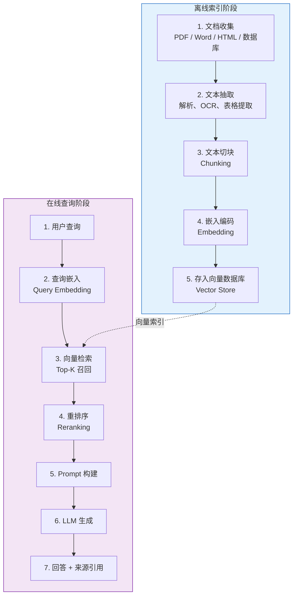

### 5.2.2 各步骤关键技术

| 步骤 | 关键技术 | 说明 |
|------|---------|------|
| 文本抽取 | PDF 解析、OCR（光学字符识别）、表格提取 | 将非结构化文档转为纯文本 |
| 文本切块 | 固定大小切分 / 语义切分 / 递归切分 | 将长文本拆分为适合检索的片段 |
| 嵌入编码 | BGE、GTE、OpenAI Ada 等嵌入模型 | 将文本映射为高维向量表示 |
| 向量存储 | FAISS、Milvus、Chroma 等向量数据库 | 高效存储和索引向量 |
| 向量检索 | 余弦相似度 / ANN（近似最近邻）算法 | 快速找到与查询最相似的文档 |
| 重排序 | Cross-Encoder、Cohere Rerank | 对初步召回结果进行精细排序 |
| 生成 | 上下文窗口内的增强生成 | LLM 基于检索结果生成回答 |

接下来的几节将深入讲解流水线中的每个核心组件。

---

## 5.3 文本切块（Chunking）策略

文本切块是 RAG 流水线中至关重要的一步。切块质量直接影响下游检索的精度和生成的质量。切块的核心目标是：**将长文档拆分为语义完整、大小适中的片段，使每个片段既能被准确检索，又能为 LLM 提供足够的上下文信息。**

### 5.3.1 切块大小与重叠的权衡

切块大小（Chunk Size）的选择是一个经典的精度-完整性权衡问题：

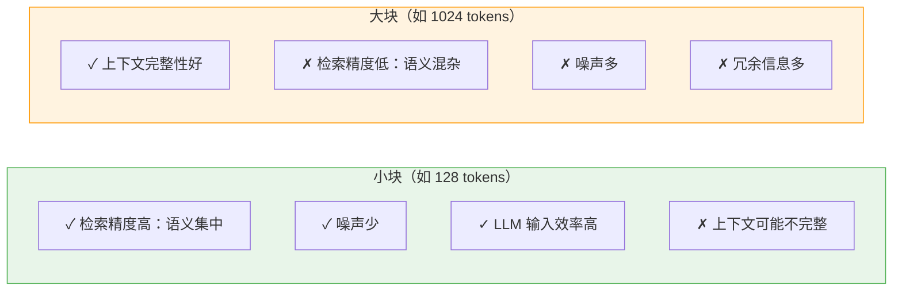

| 评价维度 | 小块 | 大块 |
|---------|------|------|
| 检索精度 | 高（语义集中） | 低（语义混杂） |
| 上下文完整性 | 低（可能截断语义） | 高（保留完整语义） |
| 噪声水平 | 少 | 多 |
| LLM 输入效率 | 高（信息密度高） | 低（冗余信息多） |

**重叠**（Overlap）是缓解切块边界信息丢失的关键技术：相邻块之间共享一部分文本，确保跨块边界的语义不会被完全截断。

### 5.3.2 常见切块策略

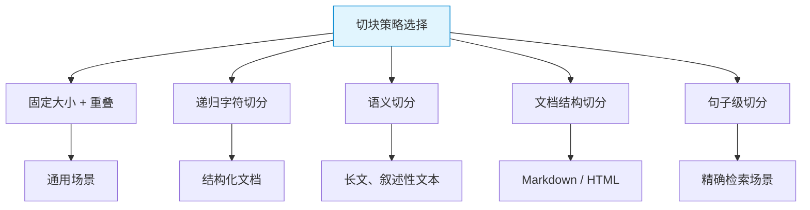

| 策略 | 工作原理 | 适用场景 |
|------|---------|---------|
| **固定大小 + 重叠** | 每 N 个 token 切一块，相邻块重叠 M 个 token | 通用场景，实现简单 |
| **递归字符切分** | 按分隔符层级逐步切分（`\n\n` → `\n` → `.` → 空格） | 结构化文档（如技术文档） |
| **语义切分** | 先对句子做嵌入，按语义相似度变化点断开 | 长文、叙述性文本 |
| **文档结构切分** | 按文档自身结构（标题、章节、段落）切分 | Markdown、HTML 等有明确结构的文档 |
| **句子级切分** | 以句子为最小单位进行切分 | 需要精确检索的场景 |

### 5.3.3 实践经验值

- **块大小**：256-512 tokens（通用场景），512-1024 tokens（需要更多上下文的场景）
- **重叠大小**：块大小的 10%-20%（例如块大小 512 时，重叠 50-100 tokens）
- **核心原则**：块应尽量保持语义完整性——一个块最好对应一个完整的概念或段落

---

## 5.4 嵌入模型（Embedding Model）选择与评估

嵌入模型是 RAG 系统的"翻译官"，负责将人类可读的文本转换为计算机可计算的高维向量（也称为嵌入向量，Embedding Vector）。两段语义相近的文本，其嵌入向量在向量空间中的距离也应该较近。嵌入模型的质量直接决定了检索的准确性。

### 5.4.1 嵌入模型评估指标

评估嵌入模型的检索效果，需要使用信息检索（Information Retrieval, IR）领域的标准指标：

| 指标 | 公式 | 含义 |
|------|------|------|
| **NDCG@K**（归一化折损累积增益） | $\text{NDCG@K} = \dfrac{\text{DCG@K}}{\text{IDCG@K}}$ | 衡量排序质量，考虑文档位置权重。DCG（Discounted Cumulative Gain）对排名靠后的相关文档施加折扣；IDCG 是理想排序下的 DCG，用于归一化。值域 $[0, 1]$，越大越好 |
| **Recall@K**（召回率） | $\text{Recall@K} = \dfrac{|R \cap G|}{|G|}$ | 前 K 个检索结果中，相关文档占所有相关文档的比例。$R$ 为检索结果集，$G$ 为真实相关文档集（Ground Truth） |
| **MRR**（平均倒数排名） | $\text{MRR} = \dfrac{1}{\text{rank of first relevant doc}}$ | 第一个相关文档排名的倒数。排名越靠前，MRR 越高 |
| **Hit Rate**（命中率） | 有相关文档被检索到的查询占总查询的比例 | 粗粒度的检索成功率指标 |

### 5.4.2 主流嵌入模型

| 模型 | 向量维度 | 特点 |
|------|---------|------|
| **BGE-large-zh** | 1024 | 中文领域最优秀的开源嵌入模型之一，由智源研究院（BAAI）开发 |
| **GTE-large** | 1024 | 多语言支持，由阿里达摩院开发 |
| **OpenAI text-embedding-3** | 1536 / 3072 | 闭源商业模型，效果优秀，支持可变维度 |
| **E5-mistral-7b** | 4096 | 基于 LLM 的嵌入模型，效果最好但推理速度较慢 |
| **BGE-M3** | 1024 | 多功能模型，同时支持稠密检索（Dense）、稀疏检索（Sparse）和 ColBERT 三种模式 |

### 5.4.3 选择原则

1. **语言匹配**：中文场景优先选择 BGE / GTE 系列；英文场景可选 E5 / GTE 系列
2. **效率与效果的平衡**：小模型推理快但效果有限；基于 LLM 的嵌入模型效果最好但推理成本高
3. **领域适配**：在特定领域数据上微调嵌入模型，可以显著提升检索效果

---

## 5.5 提升检索质量的进阶技术

基础的向量检索（即通过嵌入向量的相似度匹配文档）虽然有效，但在实际应用中往往不够。本节介绍多种提升检索质量的进阶技术，它们可以单独使用，也可以组合使用。

### 5.5.1 技术全景

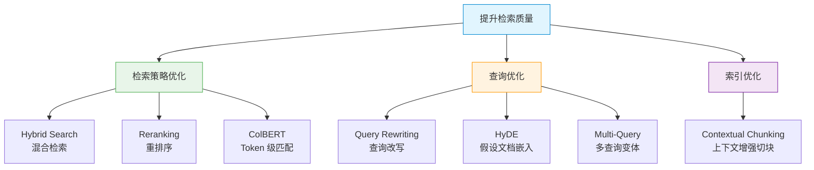

### 5.5.2 各技术详解

| 技术 | 原理 | 效果 |
|------|------|------|
| **Hybrid Search**（混合检索） | 将向量检索（语义匹配）与关键词检索（如 BM25，基于词频的经典检索算法）融合 | 语义与词汇互补，提升召回率 |
| **Reranking**（重排序） | 用 Cross-Encoder（交叉编码器，同时编码查询和文档进行精细匹配）对初步检索结果重新排序 | 显著提升排序精度 |
| **Query Rewriting**（查询改写） | 改写或扩展用户的原始查询，使其更适合检索 | 提升召回率 |
| **HyDE**（假设文档嵌入） | 先让 LLM 生成一个"假设回答"，再用该假设回答的嵌入向量去检索 | 提升语义匹配质量 |
| **Multi-Query**（多查询） | 将原始查询生成多个语义等价的变体，分别检索后合并结果 | 提升召回覆盖面 |
| **Contextual Chunking**（上下文增强切块） | 在每个文本块中附加元数据（如所属标题、文档摘要等） | 提升检索精度 |
| **ColBERT** | Token 级别的后期交互匹配，对查询和文档的每个 token 分别编码后计算细粒度相似度 | 实现更精细的语义匹配 |

### 5.5.3 Hybrid Search 融合公式

混合检索的核心是将稠密向量检索（Dense Retrieval）和稀疏关键词检索（Sparse Retrieval）的分数进行加权融合：

$$\text{Score}_{\text{hybrid}} = \alpha \cdot \text{Score}_{\text{dense}} + (1 - \alpha) \cdot \text{Score}_{\text{sparse}}$$

其中：
- $\text{Score}_{\text{dense}}$：稠密向量检索的相似度分数（如余弦相似度）
- $\text{Score}_{\text{sparse}}$：稀疏检索的分数（如 BM25 分数）
- $\alpha \in [0, 1]$：融合权重，控制两种检索方式的相对重要性，通常通过验证集调优确定

当 $\alpha = 1$ 时退化为纯向量检索，$\alpha = 0$ 时退化为纯关键词检索。实践中 $\alpha$ 通常取 0.5-0.7。

### 5.5.4 HyDE 工作流程

HyDE（Hypothetical Document Embeddings，假设文档嵌入）是一种巧妙的查询增强技术。其核心洞察是：用户的短查询与知识库中的长文档在语义空间中可能存在"鸿沟"，而 LLM 生成的假设回答在形式上更接近知识库文档，因此用假设回答去检索效果更好。

注意：假设回答本身可能包含错误信息，但这不影响检索效果——我们只利用它的语义表示来检索，最终生成回答时使用的是检索到的真实文档。

---

## 5.6 "Lost in the Middle" 现象

在将检索结果拼接为 LLM 的上下文时，文档的排列顺序会显著影响生成质量。这一现象被称为 **"Lost in the Middle"**（中间信息丢失）。

### 5.6.1 现象描述

Liu et al. (2023) 的研究发现：LLM 对上下文中**开头和结尾**位置的信息利用效率显著高于**中间**位置。当关键信息被放置在长上下文的中间部分时，模型的回答质量会明显下降。

这一现象的本质与 Transformer 架构中注意力机制（Attention Mechanism）的分布特性有关——模型倾向于对序列首尾的 token 分配更多注意力权重。

### 5.6.2 缓解方法

| 方法 | 策略 | 说明 |
|------|------|------|
| **重排序** | 将最相关的文档放在上下文的首尾位置 | 利用位置偏好，最大化关键信息的利用率 |
| **减少冗余** | 压缩检索结果，去除冗余信息 | 缩短上下文长度，减少中间区域 |
| **分段处理** | 将长上下文拆分为多个短上下文分别处理 | 每段都足够短，避免中间丢失问题 |
| **长上下文模型** | 使用原生支持长上下文的模型（如 GPT-4-128K） | 这些模型在长上下文处理上有专门优化 |

---

## 5.7 RAG 系统评估

一个完整的 RAG 系统需要从**检索阶段**和**生成阶段**两个维度分别评估。仅评估最终回答质量是不够的——当回答质量不佳时，需要定位问题出在检索环节还是生成环节。

### 5.7.1 评估体系全景

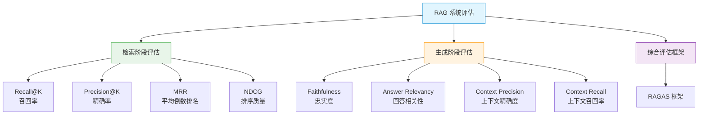

### 5.7.2 检索阶段评估指标

| 指标 | 评估内容 |
|------|---------|
| **Recall@K** | 前 K 个检索结果中，相关文档的召回率——衡量"该找到的是否找到了" |
| **Precision@K** | 前 K 个检索结果中，相关文档的精确率——衡量"找到的是否都是相关的" |
| **MRR** | 第一个相关文档的排名——衡量"最相关的文档排得够不够靠前" |
| **NDCG** | 整体排序质量——衡量"排序是否合理" |

### 5.7.3 生成阶段评估指标

| 指标 | 评估内容 | 说明 |
|------|---------|------|
| **Faithfulness**（忠实度） | 生成内容是否忠实于检索到的文档 | 衡量幻觉程度——回答中的每个声明是否都能从上下文中找到依据 |
| **Answer Relevancy**（回答相关性） | 回答与用户问题的相关程度 | 衡量回答是否"答非所问" |
| **Context Precision**（上下文精确度） | 检索到的上下文中有用信息的比例 | 衡量检索结果的"纯度" |
| **Context Recall**（上下文召回率） | 回答所需的信息是否都被检索到 | 衡量检索结果的"完整度" |

### 5.7.4 RAGAS 综合评估框架

**RAGAS**（Retrieval Augmented Generation Assessment，Es et al., 2023）是一个自动化评估框架，利用 LLM 自身来评估 RAG 系统的各项指标。其中，忠实度（Faithfulness）的计算公式为：

$$\text{Faithfulness} = \frac{\text{可从上下文推导出的声明数}}{\text{回答中的总声明数}}$$

其中：
- **声明**（Claim）：回答中的每一个事实性陈述
- **可从上下文推导**：该声明能够在检索到的文档中找到支持证据

Faithfulness = 1.0 表示回答完全忠实于检索结果，没有幻觉；Faithfulness 越低，说明幻觉越严重。

---

## 5.8 知识图谱增强的 RAG（GraphRAG）

前面介绍的 RAG 系统主要基于向量检索，适合处理语义相似度匹配的场景。但当问题涉及**多跳推理**（Multi-hop Reasoning，即需要连接多个知识点才能回答的问题）、**实体关系查询**或**结构化知识**时，纯向量检索的能力就显得不足。

**知识图谱**（Knowledge Graph, KG）以图结构存储实体及其关系（如"张三 → 就职于 → 公司A"），天然适合处理这类结构化推理任务。将知识图谱与 RAG 结合，就形成了 **GraphRAG**。

### 5.8.1 向量 RAG 与知识图谱 RAG 的对比

| 场景 | 向量 RAG | 知识图谱 RAG |
|------|---------|-------------|
| 事实性问答 | 适合 | 适合 |
| 多跳推理（如"A 的老板的母校是哪里"） | 弱 | 强 |
| 关系查询（如"与 X 相关的所有实体"） | 弱 | 强 |
| 实体消歧（区分同名不同实体） | 弱 | 强 |
| 结构化知识查询 | 弱 | 强 |

### 5.8.2 GraphRAG 工作流程

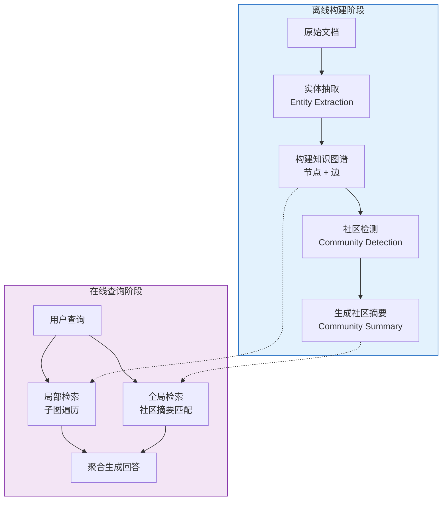

**流程说明**：
- **实体抽取**：从文档中识别出实体（人名、地名、概念等）及其关系
- **社区检测**：在图谱中发现紧密关联的实体群组（社区），类似于社交网络中的"圈子"
- **社区摘要**：为每个社区生成文本摘要，提供全局视角
- **局部检索**：从查询相关的实体出发，沿图谱路径遍历获取相关子图
- **全局检索**：通过社区摘要获取宏观层面的相关信息

### 5.8.3 GraphRAG 的优势与劣势

**优势**：
1. **多跳推理**：可沿图谱路径进行链式推理，如 A → B → C
2. **精确关系建模**：显式存储实体间的关系，查询精确
3. **全局视角**：社区摘要提供对知识库的全局理解能力

**劣势**：
1. **构建成本高**：实体抽取和关系构建需要额外的处理流程和计算资源
2. **更新维护复杂**：图谱的增量更新比向量库更复杂
3. **查询复杂度高**：需要图查询语言（如 Cypher）来表达复杂查询

---

## 5.9 高级 RAG 范式

随着 RAG 技术的发展，研究者们提出了多种超越"单次检索 + 单次生成"基础模式的高级范式。这些范式让 RAG 系统更加智能和灵活。

### 5.9.1 范式演进全景

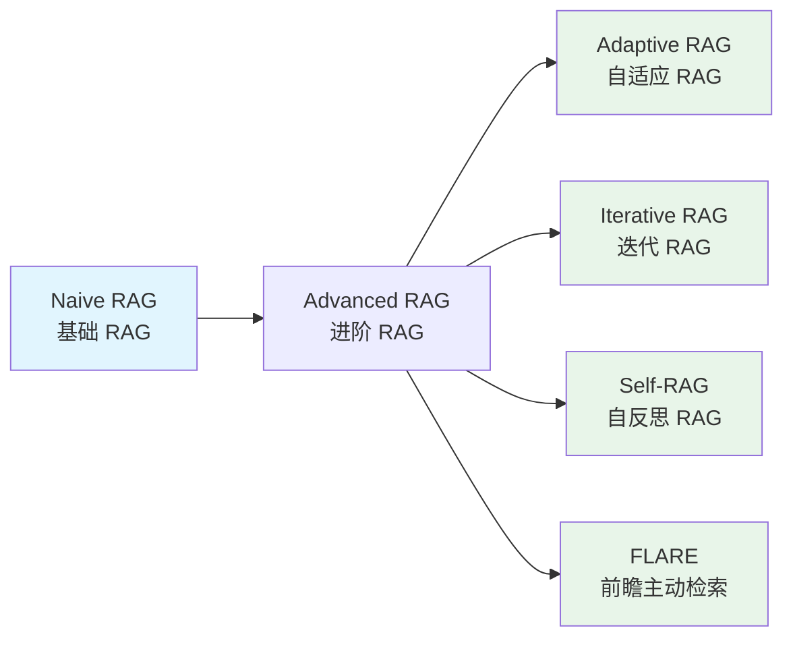

### 5.9.2 Adaptive Retrieval（自适应检索）

基础 RAG 对每个查询都执行检索，但并非所有问题都需要外部知识——有些问题模型本身就能回答。自适应检索让模型自主判断是否需要检索：

$$P(\text{retrieve} \mid q) = \begin{cases} 1 & \text{if } \text{confidence}(q) < \theta \\ 0 & \text{otherwise} \end{cases}$$

其中：
- $q$：用户查询
- $\text{confidence}(q)$：模型对该查询的自信度（即不借助外部知识能否正确回答）
- $\theta$：置信度阈值，低于此值时触发检索

这种方式减少了不必要的检索开销，同时保证了需要外部知识时的回答质量。

### 5.9.3 Iterative Retrieval（迭代检索）

对于复杂问题，单次检索可能无法获取所有需要的信息。迭代检索在生成过程中**多次检索**，每次基于已生成的内容重新检索补充信息：

这种"边生成边检索"的模式特别适合需要多步推理或信息综合的复杂问题。

### 5.9.4 Self-RAG（自反思 RAG）

Self-RAG 是一种让模型具备"自我反思"能力的 RAG 范式。模型通过生成特殊的反思 token（Reflection Token）来自主控制整个检索-生成流程：

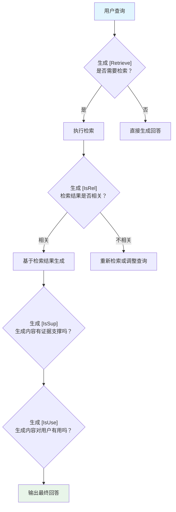

四种反思 token 的含义：
- **`[Retrieve]`**：判断当前是否需要检索外部知识
- **`[IsRel]`**：判断检索到的文档是否与查询相关
- **`[IsSup]`**：判断生成的内容是否有检索证据支撑
- **`[IsUse]`**：判断生成的内容是否对用户有用

### 5.9.5 FLARE（Forward-Looking Active REtrieval）

FLARE（前瞻性主动检索）采用一种更细粒度的检索触发策略：在生成过程中，当模型遇到**低置信度的 token**（即模型不确定的部分）时，主动触发检索，用检索到的信息重新生成该段内容。

这种方式的优势在于：只在模型"不确定"的地方检索，既保证了回答质量，又避免了过度检索。

---

## 5.10 搜索系统与 RAG 的关系

理解 RAG 与传统搜索系统的关系，有助于把握 RAG 在技术栈中的定位。

### 5.10.1 核心差异

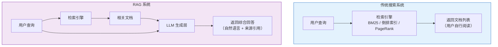

| 对比维度 | 传统搜索系统 | RAG 系统 |
|---------|------------|---------|
| **目标** | 返回相关文档列表 | 生成综合性自然语言回答 |
| **输出形式** | 文档链接列表 | 自然语言回答 |
| **推理能力** | 无（仅匹配） | 有（LLM 推理） |
| **信息整合** | 无（用户需自行阅读多个文档） | 有（自动综合多文档信息） |
| **准确性要求** | 高（精确匹配） | 高（忠实于来源文档） |
| **典型技术** | BM25、倒排索引（Inverted Index）、PageRank | 向量检索 + LLM 生成 |

**本质关系**：RAG = 搜索系统 + LLM 生成层。搜索是 RAG 的子模块，RAG 在搜索的基础上增加了理解、推理和综合生成的能力。

---

## 5.11 RAG 部署挑战与解决方案

将 RAG 系统从原型推向生产环境，需要面对一系列工程挑战。本节梳理常见挑战及其解决方案。

### 5.11.1 挑战全景

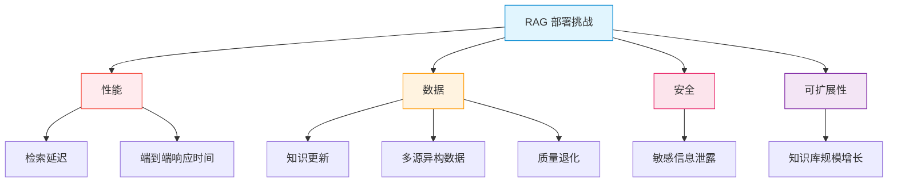

### 5.11.2 挑战与解决方案详表

| 挑战 | 问题描述 | 解决方案 |
|------|---------|---------|
| **检索延迟** | 向量检索 + 重排序环节耗时较长 | ANN（近似最近邻）索引加速、热点查询缓存、异步检索 |
| **知识更新** | 知识库需要持续更新以保持时效性 | 增量索引（仅更新变化部分）、流式更新管线 |
| **多源异构** | 不同格式（PDF / Word / HTML）和来源的知识需要统一处理 | 构建统一的文档抽取管线（Unified Extraction Pipeline） |
| **安全性** | 检索过程中可能返回敏感信息 | 基于权限的检索过滤、敏感信息脱敏处理 |
| **可扩展性** | 知识库规模持续增长带来的性能压力 | 分布式向量数据库（如 Milvus 集群） |
| **质量退化** | 知识库中积累的过时或错误信息影响回答质量 | 定期数据清洗、知识版本管理 |

---

## 5.12 开源 RAG 框架选型

在实际项目中，通常不需要从零构建 RAG 系统。开源社区提供了多种成熟的 RAG 框架，各有侧重。

### 5.12.1 主流框架对比

| 框架 | 核心特点 | 适用场景 |
|------|---------|---------|
| **RAGFlow** | 深度文档理解、可视化编排、模板化工作流 | 企业级文档问答 |
| **LangChain** | 通用 Agent 框架，RAG 是其子功能之一 | 复杂 RAG + Agent 工作流 |
| **LlamaIndex** | 专注数据索引和检索质量优化 | 知识密集型 RAG 应用 |
| **Dify** | 低代码 RAG 平台，提供可视化界面 | 快速搭建 RAG 应用 |
| **QAnything** | 网易有道出品，支持离线部署 | 本地化 / 私有化部署 |
| **FastGPT** | 工作流编排 + 知识库管理 | 中小规模知识库应用 |

### 5.12.2 选型决策树

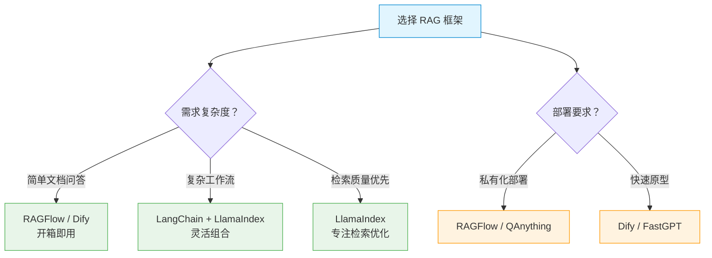

**选型原则总结**：
1. **简单文档问答** → RAGFlow / Dify（开箱即用，配置简单）
2. **复杂工作流** → LangChain + LlamaIndex（灵活性最高）
3. **检索质量优先** → LlamaIndex（在检索优化方面最为专业）
4. **私有化部署** → RAGFlow / QAnything（支持完全离线运行）
5. **快速原型验证** → Dify / FastGPT（低代码，上手快）

---

## 本章小结

本章系统介绍了检索增强生成（RAG）技术的完整知识体系。下图总结了本章的知识脉络：

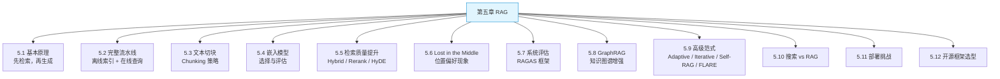

**核心要点回顾**：

1. **RAG 的本质**是将信息检索与语言模型生成相结合，通过"先查后答"的方式解决 LLM 知识过时和幻觉问题
2. **完整流水线**分为离线索引和在线查询两个阶段，涉及文本抽取、切块、嵌入、检索、重排、生成等多个环节
3. **切块策略**需要在检索精度和上下文完整性之间取得平衡，推荐 256-512 tokens 并保持 10%-20% 重叠
4. **嵌入模型**的选择需考虑语言匹配、效率与效果的平衡，以及领域适配
5. **检索质量**可通过混合检索、重排序、查询改写、HyDE 等多种技术提升
6. **系统评估**需要同时关注检索阶段和生成阶段，RAGAS 提供了自动化评估框架
7. **GraphRAG** 通过知识图谱增强了多跳推理和关系查询能力
8. **高级范式**（Adaptive、Iterative、Self-RAG、FLARE）让 RAG 系统更加智能和灵活
9. **生产部署**需要关注延迟、更新、安全、可扩展性等工程挑战
