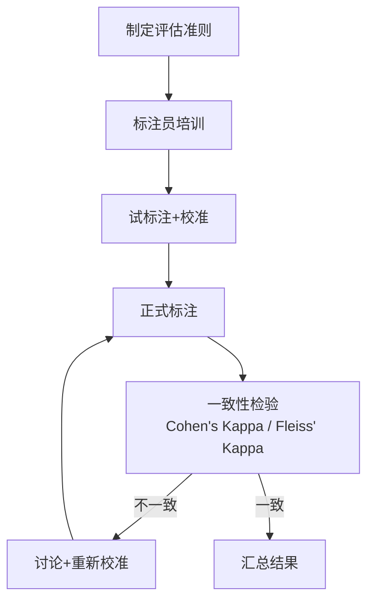

# 六、模型评估与 Agent 评估面试真题

## 1. 传统 NLP 指标的局限性

### BLEU / ROUGE 的问题

| 局限 | 说明 |
|------|------|
| 词汇匹配 | 只看 n-gram 重叠，无法衡量语义等价 |
| 无语义理解 | "我很开心" vs "我非常高兴" = 0分 |
| 偏短惩罚 | BLEU 惩罚过短输出，但无法惩罚冗长无意义输出 |
| 单一参考 | 通常只对比1个参考答案，忽略合理多样性 |
| 不适用开放生成 | 开放式问答/对话无固定参考答案 |

$$\text{BLEU} = \text{BP} \cdot \exp\left(\sum_{n=1}^{N} w_n \log p_n\right)$$

其中 BP 为短句惩罚，$p_n$ 为 n-gram 精确率。该指标无法捕捉语义、逻辑、事实性。

---

## 2. LLM 综合性基准测试

| 基准 | 侧重点 | 规模 | 说明 |
|------|--------|------|------|
| MMLU | 多领域知识 | 57个科目, 15K题 | 涵盖STEM、人文、社科等 |
| Big-Bench / Big-Bench-Hard | 多样化能力 | 204个任务 | 推理、常识、语言学等 |
| HumanEval | 代码生成 | 164题 | Python函数补全 |
| GSM8K | 数学推理 | 8.5K题 | 小学数学应用题 |
| MATH | 高等数学 | 12K题 | 竞赛级数学 |
| ARC | 科学推理 | 7.8K题 | 科学考试选择题 |
| HellaSwag | 常识推理 | 句子补全 | 日常场景推理 |
| WinoGrande | 共指消解 | 44K题 | 代词消歧 |
| C-Eval | 中文多领域 | 52科目 | 中文版MMLU |
| CMMLU | 中文多领域 | 67科目 | 中文综合评估 |
| IFEval | 指令遵循 | 可验证约束 | 格式/内容约束遵循 |

---

## 3. LLM-as-a-Judge

### 原理

用强 LLM（如 GPT-4）作为评判者，对被评估 LLM 的输出打分或排序。

### 评估模式

| 模式 | 描述 |
|------|------|
| Pointwise | 单独给每个输出打分 |
| Pairwise | 比较两个输出哪个更好 |
| Listwise | 对多个输出排序 |

### 优点

1. **可扩展**：自动化评估，无需人工
2. **一致性**：比人类标注者更一致
3. **灵活性**：可自定义评估维度和标准

### 潜在偏见

| 偏见 | 描述 |
|------|------|
| 位置偏见 | Pairwise中倾向选第一个/第二个 |
| 冗长偏见 | 倾向给更长的回答更高分 |
| 自我偏见 | 倾向给自己风格的回答更高分 |
| 顺从偏见 | 倾向给符合提示暗示的回答更高分 |

### 缓解

- 交换位置做两次 Pairwise 取平均
- 控制输出长度
- 使用多个 Judge 模型集成

---

## 4. 特定能力评估方案

### 事实性/幻觉评估

| 方法 | 描述 |
|------|------|
| FActScore | 将生成分解为原子事实，逐条验证 |
| TruthfulQA | 测试模型是否会生成常见错误观念 |
| 自洽性检查 | 多次采样检查答案一致性 |
| 溯源验证 | 检查生成内容是否有可靠来源支撑 |

### 推理能力评估

| 方法 | 描述 |
|------|------|
| GSM8K/MATH | 数学推理准确率 |
| LogiQA/ReClor | 逻辑推理 |
| 过程评估 | 不仅看最终答案，还评估推理步骤正确性 |

### 安全性评估

| 方法 | 描述 |
|------|------|
| ToxiGen | 有毒内容生成率 |
| BBQ | 偏见基准测试 |
| 对抗提示测试 | 越狱攻击成功率 |
| 安全分类器 | 自动检测不安全输出 |

---

## 5. Agent 评估 vs LLM 评估

### 为什么更难

| 维度 | LLM评估 | Agent评估 |
|------|---------|-----------|
| 输出空间 | 文本 | 文本+动作+环境状态 |
| 评估标准 | 单轮输出质量 | 多步任务完成度 |
| 确定性 | 输入确定→输出可评估 | 环境动态→结果不确定 |
| 过程 | 不重要 | 关键（怎么做的很重要） |
| 环境 | 无 | 需要模拟/真实环境 |

### 额外评估维度

1. **任务完成率**：最终目标是否达成
2. **效率**：完成任务的步数/时间/成本
3. **鲁棒性**：面对异常情况的恢复能力
4. **工具使用**：工具调用的正确性和效率
5. **规划质量**：任务分解是否合理

---

## 6. Agent 评估基准

| 基准 | 评估内容 | 环境构建 |
|------|---------|---------|
| WebArena | 网页操作 | 真实网页环境 |
| SWE-bench | 代码修复 | GitHub issue + 代码库 |
| ToolBench | API调用 | 16000+ 真实API |
| ALFWorld | 文本游戏 | 文本交互环境 |
| OSWorld | 操作系统操作 | 真实OS环境 |
| AgentBench | 多场景综合 | 8个不同环境 |
| GAIA | 通用AI助手 | 需要推理+工具+网页浏览 |

### 构建方式

1. **真实环境**：直接对接真实系统（Web, OS, API）
2. **模拟环境**：构建可控的模拟器
3. **沙箱环境**：隔离的安全执行环境
4. **人工构建**：设计特定任务场景

---

## 7. Agent 过程指标

| 指标 | 描述 | 重要性 |
|------|------|--------|
| 步数效率 | 实际步数 / 最优步数 | 高 |
| Token消耗 | 总消耗的token数 | 高（成本） |
| 工具调用成功率 | 成功调用 / 总调用 | 高 |
| 规划一致性 | 计划与执行的一致程度 | 中 |
| 自我纠错次数 | 回溯/重试次数 | 中 |
| 延迟 | 首次响应/总完成时间 | 高（体验） |
| 鲁棒性 | 异常输入下的表现 | 中 |

---

## 8. 红队测试（Red Teaming）

### 定义

系统性地对 LLM/Agent 进行对抗性测试，主动发现安全漏洞、偏见和有害行为。

### 测试方法

| 方法 | 描述 |
|------|------|
| 手动红队 | 人类专家设计攻击提示 |
| 自动红队 | 用另一个LLM自动生成攻击 |
| 模糊测试 | 随机变异输入寻找崩溃点 |
| 越狱模板 | 已知越狱模式的系统测试 |
| 多轮攻击 | 通过多轮对话逐步绕过安全限制 |

### 在安全评估中的角色

1. **主动防御**：在部署前发现漏洞
2. **持续监控**：上线后定期红队测试
3. **基准对比**：量化模型的安全水平
4. **驱动改进**：红队发现→数据增强→模型改进

---

## 9. 人工评估设计

### 评估准则

1. **明确维度**：定义具体评估维度（相关性、准确性、完整性、安全性等）
2. **量化标准**：每个维度有明确的评分等级描述
3. **示例锚定**：提供每个分数等级的典型示例

### 流程设计

### 一致性指标

$$\kappa = \frac{p_o - p_e}{1 - p_e}$$

- $p_o$：观察一致率
- $p_e$：随机一致率
- $\kappa > 0.8$ 表示高度一致

---

## 10. 部署后持续监控

### 监控维度

| 维度 | 指标 | 检测方法 |
|------|------|---------|
| 性能衰退 | 准确率/满意度下降 | A/B测试、趋势分析 |
| 行为漂移 | 输出风格/偏好的变化 | 分布检测、统计检验 |
| 安全性 | 有害输出率 | 自动分类器 + 人工抽检 |
| 数据分布 | 输入分布偏移 | 统计监控、异常检测 |

### 应对策略

1. **定期评估**：在固定基准上定期跑分
2. **在线A/B测试**：新版本灰度发布对比
3. **用户反馈闭环**：收集用户评分/举报
4. **数据漂移检测**：监控输入分布变化
5. **模型回滚机制**：性能下降时快速回退
6. **持续训练**：用新数据定期更新模型
