# 第六章 模型评估与 Agent 评估

> **本章导读**
>
> 评估是人工智能系统开发闭环中不可或缺的一环。没有科学的评估体系，我们就无法判断模型是否在进步、系统是否安全可靠。本章将从最基础的传统 NLP 评估指标出发，逐步深入到大语言模型（LLM, Large Language Model）的综合基准测试、以 LLM 作为评判者的自动化评估范式，再延伸到更复杂的 Agent（智能体）评估体系，最终讨论人工评估设计与部署后的持续监控。
>
> 全章知识脉络如下：

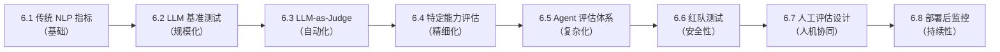

---

## 6.1 传统 NLP 评估指标及其局限性

### 6.1.1 背景：为什么需要自动评估指标

在自然语言处理（NLP, Natural Language Processing）领域的早期发展中，研究者需要一种快速、可重复的方式来衡量机器翻译、文本摘要等任务的输出质量。由此诞生了一系列基于 **n-gram**（连续 n 个词的组合）匹配的自动评估指标，其中最具代表性的是 BLEU 和 ROUGE。

### 6.1.2 BLEU 指标

**BLEU**（Bilingual Evaluation Understudy，双语评估替补）最初由 IBM 研究团队于 2002 年提出，用于机器翻译质量评估。其核心思想是：机器翻译的输出与人工参考译文之间的 n-gram 重叠程度越高，翻译质量越好。

BLEU 的数学定义如下：

$$\text{BLEU} = \text{BP} \cdot \exp\left(\sum_{n=1}^{N} w_n \log p_n\right)$$

**符号解释：**

| 符号 | 含义 | 说明 |
|------|------|------|
| $\text{BP}$ | 短句惩罚因子（Brevity Penalty） | 当机器输出长度短于参考译文时施加惩罚，防止模型通过输出极短文本获得高精确率 |
| $N$ | 最大 n-gram 阶数 | 通常取 $N=4$，即考虑 1-gram 到 4-gram |
| $w_n$ | 第 $n$ 阶 n-gram 的权重 | 通常取均匀权重 $w_n = 1/N$ |
| $p_n$ | 第 $n$ 阶 n-gram 精确率 | 机器输出中与参考译文匹配的 n-gram 数量占机器输出 n-gram 总数的比例 |

其中，短句惩罚因子 $\text{BP}$ 的计算方式为：

$$\text{BP} = \begin{cases} 1 & \text{if } c > r \\ e^{(1 - r/c)} & \text{if } c \leq r \end{cases}$$

其中 $c$ 为机器输出长度，$r$ 为参考译文长度。

### 6.1.3 ROUGE 指标

**ROUGE**（Recall-Oriented Understudy for Gisting Evaluation，面向召回率的摘要评估替补）主要用于文本摘要任务。与 BLEU 侧重精确率不同，ROUGE 侧重 **召回率**（Recall），即参考摘要中有多少内容被机器摘要覆盖。常见变体包括 ROUGE-N（基于 n-gram 召回率）和 ROUGE-L（基于最长公共子序列）。

### 6.1.4 传统指标的五大局限

尽管 BLEU 和 ROUGE 在各自领域曾发挥重要作用，但随着 LLM 时代的到来，它们的局限性日益凸显：

| 局限 | 说明 | 示例 |
|------|------|------|
| **词汇匹配** | 只看 n-gram 重叠，无法衡量语义等价 | "猫坐在垫子上" vs "小猫蹲在软垫上" 得分很低 |
| **无语义理解** | 无法识别同义表达 | "我很开心" vs "我非常高兴" 得分为 0 |
| **偏短惩罚** | BLEU 惩罚过短输出，但无法惩罚冗长无意义输出 | 冗余重复的长文本可能获得较高分数 |
| **单一参考** | 通常只对比 1 个参考答案，忽略合理多样性 | 一个问题可能有多种正确表述 |
| **不适用开放生成** | 开放式问答/对话无固定参考答案 | 创意写作、开放对话无法用固定答案衡量 |

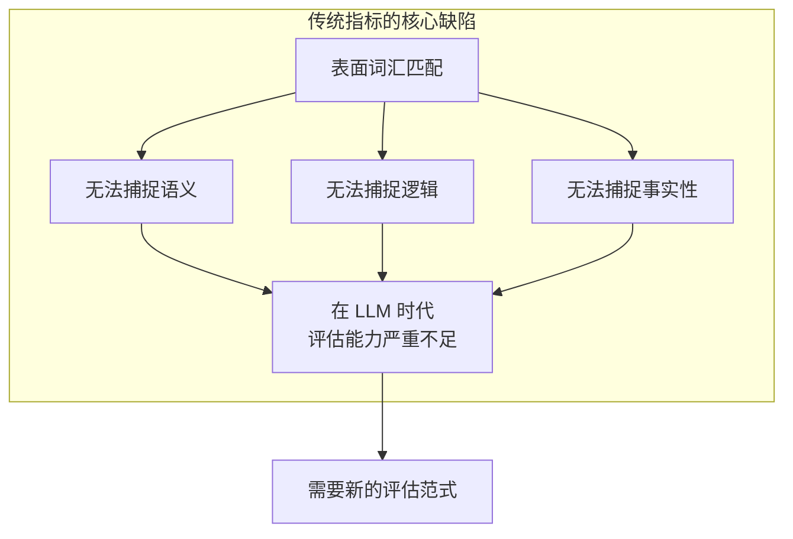

> **小结：** 传统指标本质上是一种"表面匹配"方法，它们无法理解语言的深层含义。这一局限直接推动了两个方向的发展：一是设计更全面的基准测试集，二是探索基于 LLM 的自动评估方法。接下来我们先看第一个方向。

---
## 6.2 LLM 综合性基准测试

### 6.2.1 基准测试的意义

当我们需要在多个 LLM 之间进行横向比较时，仅靠单一指标远远不够。**基准测试**（Benchmark）通过构建标准化的题目集合，覆盖多种能力维度，为模型能力提供全面的"体检报告"。一个好的基准测试应当具备以下特征：覆盖面广、难度分层合理、评分标准客观、不易被"刷分"。

### 6.2.2 主流基准测试全景

下表汇总了当前最具影响力的 LLM 基准测试，按评估侧重点分类：

#### 知识与综合能力

| 基准 | 侧重点 | 规模 | 说明 |
|------|--------|------|------|
| **MMLU** | 多领域知识 | 57 个科目，15K 题 | 涵盖 STEM、人文、社科等，是最广泛使用的综合知识基准 |
| **C-Eval** | 中文多领域 | 52 个科目 | 中文版 MMLU，覆盖中国教育体系各学科 |
| **CMMLU** | 中文多领域 | 67 个科目 | 更大规模的中文综合评估基准 |

#### 推理能力

| 基准 | 侧重点 | 规模 | 说明 |
|------|--------|------|------|
| **GSM8K** | 数学推理 | 8.5K 题 | 小学数学应用题，测试基础数学推理 |
| **MATH** | 高等数学 | 12K 题 | 竞赛级数学题，难度显著高于 GSM8K |
| **ARC** | 科学推理 | 7.8K 题 | 科学考试选择题，分为 Easy 和 Challenge 两个子集 |
| **HellaSwag** | 常识推理 | 句子补全 | 日常场景推理，测试对常识性因果关系的理解 |
| **WinoGrande** | 共指消解 | 44K 题 | 代词消歧任务，测试语言理解的精细程度 |
#### 代码与指令遵循

| 基准 | 侧重点 | 规模 | 说明 |
|------|--------|------|------|
| **HumanEval** | 代码生成 | 164 题 | Python 函数补全，通过单元测试验证正确性 |
| **IFEval** | 指令遵循 | 可验证约束 | 测试模型对格式约束、内容约束等具体指令的遵循能力 |

#### 多样化综合能力

| 基准 | 侧重点 | 规模 | 说明 |
|------|--------|------|------|
| **Big-Bench / Big-Bench-Hard** | 多样化能力 | 204 个任务 | 涵盖推理、常识、语言学等，Big-Bench-Hard 筛选出最具挑战性的子集 |

### 6.2.3 基准测试的能力覆盖图谱

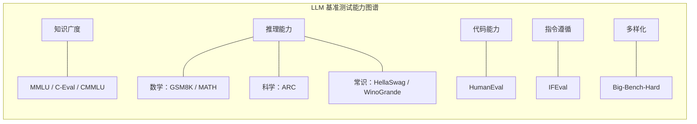

> **小结：** 基准测试为 LLM 能力评估提供了标准化的"考试"框架。然而，基准测试依赖预设的标准答案，对于开放式生成任务（如创意写作、复杂对话）仍然力不从心。这就引出了下一节的核心话题——能否让 LLM 自己来当"考官"？

---
## 6.3 LLM-as-a-Judge：以模型评估模型

### 6.3.1 核心思想

**LLM-as-a-Judge**（以大语言模型作为评判者）是一种新兴的自动化评估范式。其核心思想是：利用能力较强的 LLM（如 GPT-4）作为"评委"，对被评估模型的输出进行打分或排序。这种方法特别适用于开放式生成任务，因为它不依赖固定的参考答案，而是依靠评判模型的语义理解能力来做出判断。

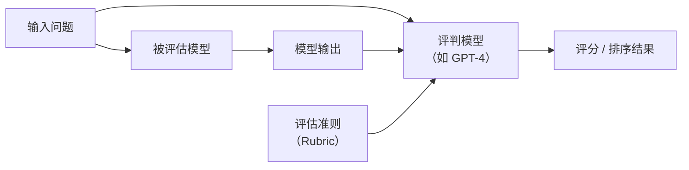

### 6.3.2 三种评估模式

LLM-as-a-Judge 有三种主要的评估模式，适用于不同场景：

| 模式 | 描述 | 适用场景 | 优缺点 |
|------|------|---------|--------|
| **Pointwise**（逐点评分） | 单独给每个输出打分（如 1-5 分） | 需要绝对质量评估时 | 简单直接，但不同输出间的分数可比性较弱 |
| **Pairwise**（成对比较） | 比较两个输出哪个更好 | 需要相对质量比较时 | 判断更准确，但组合数随候选数量平方增长 |
| **Listwise**（列表排序） | 对多个输出进行整体排序 | 需要全局排名时 | 效率高，但对评判模型的能力要求最高 |

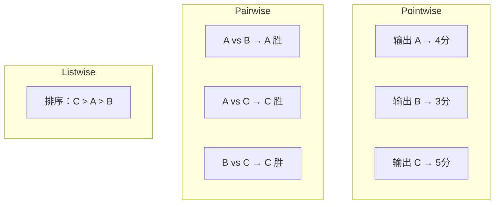
### 6.3.3 优势分析

LLM-as-a-Judge 相比传统指标和纯人工评估，具有三大核心优势：

1. **可扩展性（Scalability）**：自动化评估流程，无需大量人工标注，可以快速评估海量输出
2. **一致性（Consistency）**：相比人类标注者，LLM 评判者在相同标准下的评分一致性更高，不受疲劳、情绪等因素影响
3. **灵活性（Flexibility）**：可以通过修改评估提示词（Prompt）自定义评估维度和标准，适应不同任务需求

### 6.3.4 潜在偏见与缓解策略

然而，LLM-as-a-Judge 并非完美，它存在若干系统性偏见，使用时必须加以警惕：

| 偏见类型 | 描述 | 影响 |
|---------|------|------|
| **位置偏见**（Position Bias） | 在 Pairwise 模式中，倾向于选择第一个或第二个位置的输出 | 导致评估结果受输出呈现顺序影响 |
| **冗长偏见**（Verbosity Bias） | 倾向于给更长的回答更高分 | 鼓励冗余输出，不利于简洁高效的回答 |
| **自我偏见**（Self-Enhancement Bias） | 倾向于给与自身风格相似的回答更高分 | 使用 GPT-4 评判时可能偏向 GPT 系列的输出 |
| **顺从偏见**（Sycophancy Bias） | 倾向于给符合提示暗示方向的回答更高分 | 评估提示的措辞可能无意中引导评判结果 |

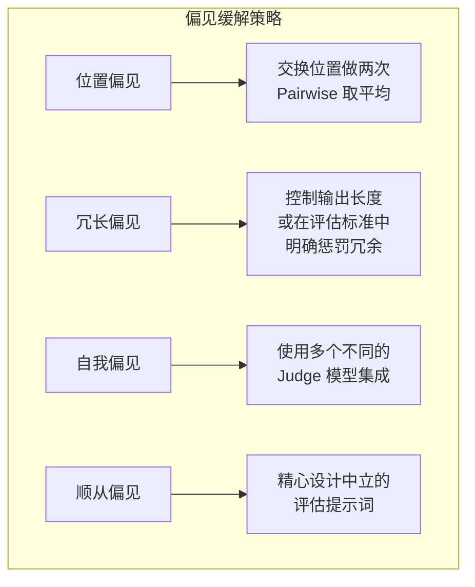

> **小结：** LLM-as-a-Judge 为开放式任务评估提供了一条可行路径，但其偏见问题提醒我们，任何单一评估方法都有盲区。在实践中，通常需要将 LLM-as-a-Judge 与基准测试、人工评估相结合，形成多维度的评估体系。接下来，我们将聚焦于几种特定能力的精细化评估方案。

---
## 6.4 特定能力评估方案

### 6.4.1 为什么需要精细化评估

综合基准测试提供了模型能力的"全景照片"，但在实际应用中，我们往往需要深入了解模型在某一特定维度上的表现。例如：模型是否会"编造"不存在的事实？推理过程是否正确？输出是否安全无害？这些问题需要专门设计的评估方案来回答。

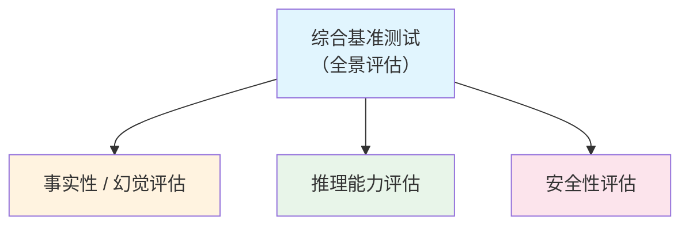

### 6.4.2 事实性与幻觉评估

**幻觉**（Hallucination）是指 LLM 生成看似合理但实际上不正确或无依据的内容。这是 LLM 最受关注的问题之一，因此事实性评估至关重要。

| 方法 | 描述 | 评估思路 |
|------|------|---------|
| **FActScore** | 将生成内容分解为原子事实（Atomic Fact），逐条验证每个事实的正确性 | 细粒度事实核查，计算正确事实的比例 |
| **TruthfulQA** | 测试模型是否会生成常见的错误观念和都市传说 | 专门针对人类常见误解设计的问题集 |
| **自洽性检查** | 对同一问题多次采样，检查答案之间的一致性 | 如果模型对同一问题给出矛盾答案，说明其知识不可靠 |
| **溯源验证** | 检查生成内容是否有可靠来源支撑 | 要求模型提供引用，并验证引用的真实性和相关性 |

### 6.4.3 推理能力评估

推理能力是衡量 LLM "智力水平"的关键维度。评估不仅要看最终答案是否正确，还要关注推理过程本身。

| 方法 | 描述 | 关注点 |
|------|------|--------|
| **GSM8K / MATH** | 数学推理准确率 | 从基础算术到竞赛级数学的梯度评估 |
| **LogiQA / ReClor** | 逻辑推理 | 形式逻辑、条件推理、因果推理等 |
| **过程评估** | 不仅看最终答案，还评估推理步骤的正确性 | 即使最终答案正确，中间步骤错误也应扣分 |
### 6.4.4 安全性评估

随着 LLM 被广泛部署到面向用户的产品中，安全性评估变得尤为重要。安全性评估旨在检测模型是否会生成有毒、有偏见或有害的内容。

| 方法 | 描述 | 评估目标 |
|------|------|---------|
| **ToxiGen** | 有毒内容生成率 | 测试模型在各种提示下生成有毒内容的概率 |
| **BBQ**（Bias Benchmark for QA） | 偏见基准测试 | 检测模型在性别、种族、年龄等维度上的偏见 |
| **对抗提示测试** | 越狱攻击（Jailbreak）成功率 | 测试模型在面对精心设计的攻击提示时能否坚守安全边界 |
| **安全分类器** | 自动检测不安全输出 | 使用专门训练的分类模型对输出进行安全性打分 |

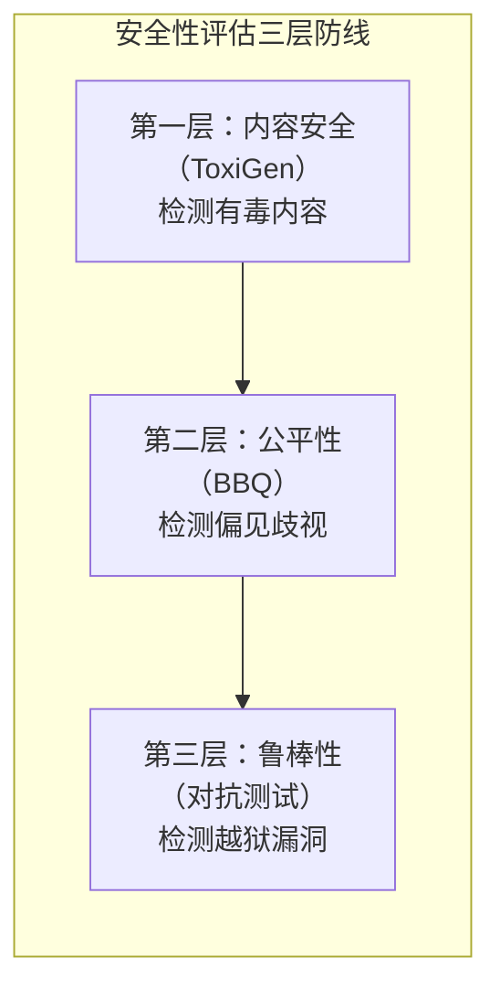

> **小结：** 特定能力评估为我们提供了"显微镜"级别的观察视角，帮助我们精确定位模型的薄弱环节。到目前为止，我们讨论的评估对象都是"纯文本输出"的 LLM。然而，当 LLM 被赋予工具调用、环境交互等能力后，它就演变为 Agent——一个能够自主行动的智能体。Agent 的评估面临着全新的挑战，这正是下一节的主题。

---

## 6.5 Agent 评估体系

### 6.5.1 从 LLM 评估到 Agent 评估：为什么更难

**Agent**（智能体）是指能够感知环境、做出决策并执行动作以完成目标的 AI 系统。与纯文本生成的 LLM 不同，Agent 需要与外部环境交互，使用工具，并在多步骤中完成复杂任务。这使得 Agent 评估在多个维度上都比 LLM 评估更加困难。

| 维度 | LLM 评估 | Agent 评估 | 难度提升原因 |
|------|---------|-----------|-------------|
| **输出空间** | 文本 | 文本 + 动作 + 环境状态 | 需要评估多种类型的输出 |
| **评估标准** | 单轮输出质量 | 多步任务完成度 | 需要端到端的任务级评估 |
| **确定性** | 输入确定 → 输出可评估 | 环境动态 → 结果不确定 | 相同输入可能因环境变化产生不同结果 |
| **过程重要性** | 不重要（只看结果） | 关键（怎么做的很重要） | 需要评估中间步骤的合理性 |
| **环境依赖** | 无 | 需要模拟或真实环境 | 评估基础设施的构建成本高 |
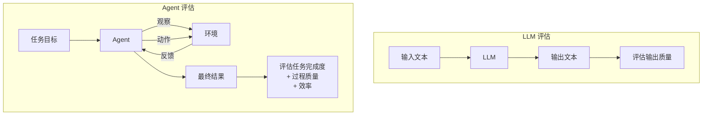

### 6.5.2 Agent 评估的额外维度

除了传统的"结果正确性"之外，Agent 评估还需要关注以下五个关键维度：

1. **任务完成率（Task Completion Rate）**：最终目标是否达成。这是最基本也是最重要的指标
2. **效率（Efficiency）**：完成任务所需的步数、时间和 Token 消耗。高效的 Agent 应当用最少的资源完成任务
3. **鲁棒性（Robustness）**：面对异常情况（如工具调用失败、环境变化）时的恢复能力
4. **工具使用（Tool Usage）**：工具调用的正确性和效率，包括是否选择了正确的工具、参数是否正确
5. **规划质量（Planning Quality）**：任务分解是否合理，子任务之间的依赖关系是否正确处理

### 6.5.3 Agent 评估基准

为了系统性地评估 Agent 能力，研究社区构建了多个专门的基准测试：

| 基准 | 评估内容 | 环境构建 | 核心挑战 |
|------|---------|---------|---------|
| **WebArena** | 网页操作 | 真实网页环境 | 理解网页结构，执行复杂的多步网页交互 |
| **SWE-bench** | 代码修复 | GitHub issue + 代码库 | 理解代码上下文，定位并修复真实 Bug |
| **ToolBench** | API 调用 | 16000+ 真实 API | 从海量 API 中选择正确的工具并正确调用 |
| **ALFWorld** | 文本游戏 | 文本交互环境 | 在虚拟家庭环境中完成日常任务 |
| **OSWorld** | 操作系统操作 | 真实 OS 环境 | 操作文件系统、应用程序等 |
| **AgentBench** | 多场景综合 | 8 个不同环境 | 跨场景的综合能力评估 |
| **GAIA** | 通用 AI 助手 | 需要推理 + 工具 + 网页浏览 | 综合运用多种能力完成复杂任务 |
### 6.5.4 Agent 评估环境的构建方式

构建 Agent 评估环境是一项重要的工程挑战。根据真实程度和可控性的不同，可以分为四种方式：

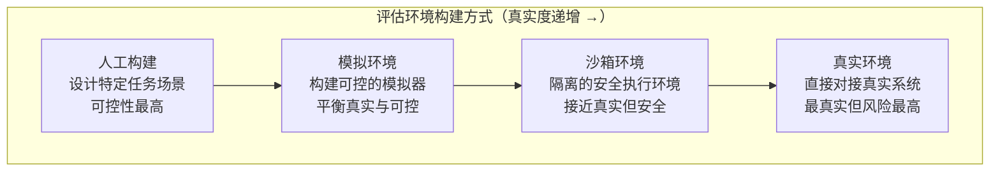

1. **人工构建**：由研究者手动设计特定任务场景和预期结果，可控性最高但覆盖面有限
2. **模拟环境**：构建可控的模拟器来模拟真实系统行为，在真实性和可控性之间取得平衡
3. **沙箱环境**：在隔离的安全执行环境中运行，接近真实系统但不会造成实际影响
4. **真实环境**：直接对接真实系统（Web、OS、API），评估结果最具说服力但存在安全风险

### 6.5.5 Agent 过程指标详解

Agent 评估不仅关注"做没做到"，更关注"怎么做到的"。以下是关键的过程指标：

| 指标 | 描述 | 重要性 | 计算方式 |
|------|------|--------|---------|
| **步数效率** | 实际步数与最优步数的比值 | 高 | $\eta = \frac{\text{最优步数}}{\text{实际步数}}$，越接近 1 越好 |
| **Token 消耗** | 完成任务消耗的总 Token 数 | 高（直接关系成本） | 累计所有 LLM 调用的输入输出 Token |
| **工具调用成功率** | 成功调用次数占总调用次数的比例 | 高 | $\frac{\text{成功调用数}}{\text{总调用数}} \times 100\%$ |
| **规划一致性** | 计划与实际执行的一致程度 | 中 | 评估初始计划与实际执行路径的偏差 |
| **自我纠错次数** | 回溯和重试的次数 | 中 | 适度纠错是好的，过多则说明规划能力不足 |
| **延迟** | 首次响应时间和总完成时间 | 高（影响用户体验） | 端到端的时间测量 |
| **鲁棒性** | 异常输入下的表现 | 中 | 在注入错误或异常条件下的任务完成率 |

> **小结：** Agent 评估是一个多维度、多层次的复杂问题。它不仅需要评估最终结果，还需要评估整个执行过程的质量和效率。随着 Agent 系统在实际产品中的广泛部署，安全性成为一个不可回避的话题。下一节我们将讨论一种专门针对安全性的评估方法——红队测试。

---
## 6.6 红队测试（Red Teaming）

### 6.6.1 什么是红队测试

**红队测试**（Red Teaming）源自军事和网络安全领域，指由一组专门的"攻击者"（红队）系统性地对目标系统进行对抗性测试。在 AI 安全领域，红队测试是指主动对 LLM 或 Agent 进行攻击性测试，以发现安全漏洞、偏见和有害行为。

与前面讨论的安全性评估（6.4.4 节）不同，红队测试更强调 **主动性** 和 **对抗性**——不是被动地检测已知问题，而是主动地寻找未知漏洞。

### 6.6.2 红队测试方法

| 方法 | 描述 | 特点 |
|------|------|------|
| **手动红队** | 人类安全专家设计攻击提示 | 创造性强，能发现深层漏洞，但成本高、规模有限 |
| **自动红队** | 用另一个 LLM 自动生成攻击提示 | 可大规模生成，但攻击多样性可能不足 |
| **模糊测试**（Fuzzing） | 随机变异输入寻找系统崩溃点 | 覆盖面广，适合发现边界情况 |
| **越狱模板** | 使用已知的越狱模式（Jailbreak Patterns）进行系统测试 | 针对性强，可快速验证已知攻击向量的防御效果 |
| **多轮攻击** | 通过多轮对话逐步绕过安全限制 | 模拟真实攻击场景，测试模型在长对话中的安全一致性 |

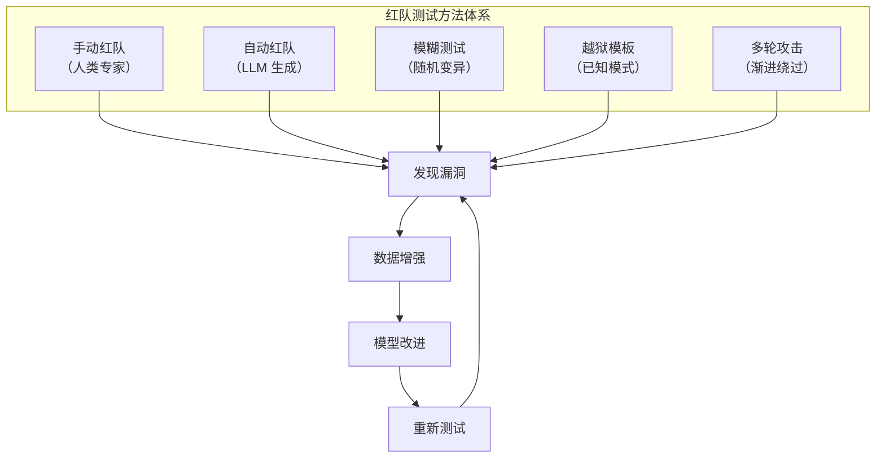

### 6.6.3 红队测试在安全评估中的角色

红队测试在 AI 安全体系中扮演着四重角色：

1. **主动防御**：在模型部署前主动发现漏洞，将安全风险消灭在萌芽阶段
2. **持续监控**：模型上线后定期进行红队测试，确保安全防线不会随时间退化
3. **基准对比**：通过量化攻击成功率，横向比较不同模型的安全水平
4. **驱动改进**：形成"红队发现 → 数据增强 → 模型改进 → 重新测试"的正向循环
> **小结：** 红队测试是 AI 安全评估中不可或缺的一环，它通过"以攻促防"的方式持续提升系统的安全水平。然而，无论自动化评估方法多么先进，在许多场景下，人类的判断仍然是不可替代的。下一节我们将讨论如何科学地设计人工评估流程。

---

## 6.7 人工评估设计

### 6.7.1 人工评估的不可替代性

尽管自动化评估方法（基准测试、LLM-as-a-Judge）在效率上具有明显优势，但在以下场景中，人工评估仍然不可替代：

- 评估输出的 **创造性** 和 **自然度**
- 判断内容是否 **真正有帮助**（而非仅仅"看起来正确"）
- 发现自动化方法难以捕捉的 **微妙错误**
- 为新的评估维度建立 **初始标准**

### 6.7.2 评估准则设计

科学的人工评估需要精心设计的评估准则（Rubric），包含三个核心要素：

1. **明确维度**：定义具体的评估维度，如相关性、准确性、完整性、安全性、流畅度等。每个维度应当独立且可操作
2. **量化标准**：每个维度有明确的评分等级描述（如 1-5 分），每个分数等级都有清晰的定义
3. **示例锚定**：提供每个分数等级的典型示例（Anchor Examples），帮助标注者建立一致的评分标准

### 6.7.3 人工评估流程

一个完整的人工评估流程包含多个阶段，其中 **校准**（Calibration）环节是确保评估质量的关键：

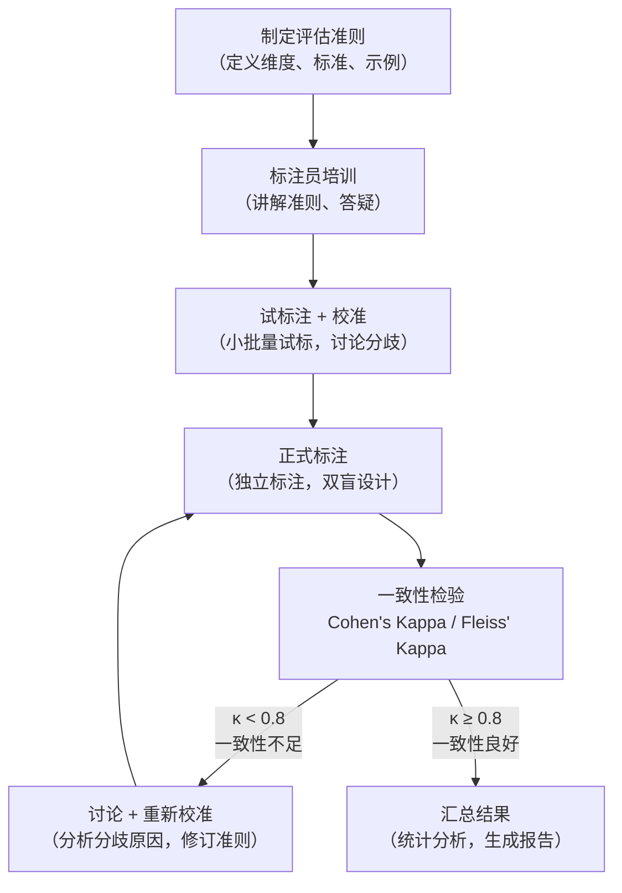
### 6.7.4 一致性指标：Cohen's Kappa

人工评估中最关键的质量指标是 **标注者间一致性**（Inter-Annotator Agreement）。最常用的度量方法是 **Cohen's Kappa** 系数（两位标注者）和 **Fleiss' Kappa** 系数（多位标注者）。

$$\kappa = \frac{p_o - p_e}{1 - p_e}$$

**符号解释：**

| 符号 | 含义 | 说明 |
|------|------|------|
| $p_o$ | 观察一致率（Observed Agreement） | 标注者实际达成一致的比例 |
| $p_e$ | 随机一致率（Expected Agreement） | 如果标注者随机打分，预期达成一致的比例 |
| $\kappa$ | Kappa 系数 | 排除随机一致性后的真实一致程度 |

**Kappa 值的解读：**

| $\kappa$ 范围 | 一致性水平 | 实践意义 |
|--------------|-----------|---------|
| $< 0$ | 低于随机水平 | 评估准则存在严重问题，需要重新设计 |
| $0 - 0.2$ | 轻微一致 | 准则不够清晰，需要大幅修订 |
| $0.2 - 0.4$ | 一般一致 | 需要进一步校准和培训 |
| $0.4 - 0.6$ | 中等一致 | 基本可用，但仍有改进空间 |
| $0.6 - 0.8$ | 较高一致 | 评估结果较为可靠 |
| $> 0.8$ | 高度一致 | 评估结果高度可靠，可以信赖 |

**直觉理解：** Kappa 系数的核心思想是"排除运气成分"。如果两位标注者都只有"好"和"坏"两个选项，即使随机打分也有 50% 的概率达成一致。Kappa 系数通过减去这个"运气成分"（$p_e$），衡量的是标注者之间 **真正的** 一致程度。

> **小结：** 人工评估虽然成本较高，但它为评估体系提供了不可替代的"真实标准"（Ground Truth）。在实践中，人工评估通常用于校准和验证自动化评估方法的准确性。当模型通过了所有评估并部署上线后，评估工作并没有结束——我们还需要持续监控模型在真实环境中的表现。

---
## 6.8 部署后持续监控

### 6.8.1 为什么部署后仍需评估

模型部署上线并不意味着评估工作的结束。在真实环境中，模型面临的输入分布会随时间变化（即 **数据漂移**，Data Drift），用户的期望也会不断演进。如果不进行持续监控，模型的表现可能在不知不觉中退化。

### 6.8.2 监控维度与方法

| 维度 | 关键指标 | 检测方法 | 告警阈值示例 |
|------|---------|---------|-------------|
| **性能衰退** | 准确率、用户满意度下降 | A/B 测试、趋势分析 | 周环比下降超过 5% |
| **行为漂移** | 输出风格、偏好的变化 | 分布检测、统计检验（如 KL 散度） | 输出分布偏移超过设定阈值 |
| **安全性** | 有害输出率 | 自动分类器 + 人工抽检 | 有害输出率超过 0.1% |
| **数据分布** | 输入分布偏移 | 统计监控、异常检测 | 新类型输入占比超过 20% |

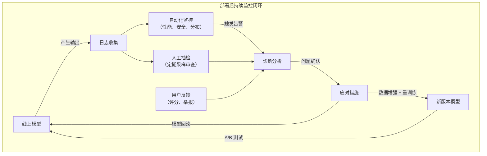

### 6.8.3 六大应对策略

当监控系统发现异常时，团队可以采取以下策略：

1. **定期评估**：在固定基准上定期跑分，建立性能基线，及时发现衰退趋势
2. **在线 A/B 测试**：新版本通过灰度发布（Canary Release）与旧版本对比，确保新版本确实优于旧版本
3. **用户反馈闭环**：收集用户评分和举报，将用户反馈转化为评估信号和训练数据
4. **数据漂移检测**：持续监控输入分布的变化，当分布偏移超过阈值时触发告警
5. **模型回滚机制**：当性能下降严重时，能够快速回退到上一个稳定版本，保障服务质量
6. **持续训练**：用新收集的数据定期更新模型，使模型适应不断变化的数据分布
---

## 6.9 本章总结

### 评估体系全景图

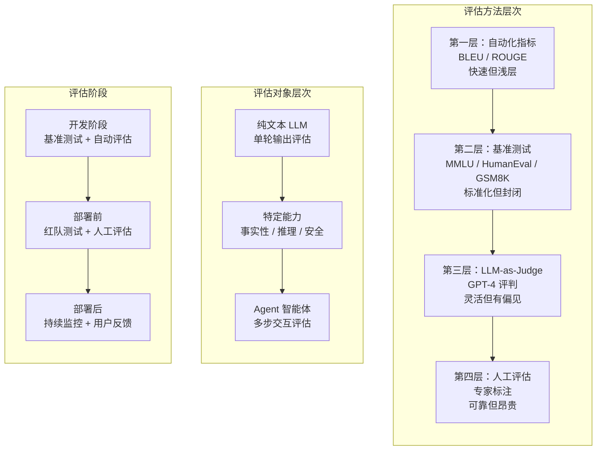

### 核心要点回顾

| 章节 | 核心知识点 | 关键词 |
|------|-----------|--------|
| 6.1 | 传统 NLP 指标基于 n-gram 匹配，无法捕捉语义、逻辑和事实性 | BLEU、ROUGE、n-gram |
| 6.2 | 基准测试提供标准化的多维度能力评估框架 | MMLU、HumanEval、GSM8K |
| 6.3 | LLM-as-Judge 用强模型评估弱模型，需警惕位置/冗长/自我偏见 | Pointwise、Pairwise、Listwise |
| 6.4 | 事实性、推理、安全性需要专门的精细化评估方案 | FActScore、TruthfulQA、ToxiGen |
| 6.5 | Agent 评估比 LLM 评估更复杂，需要评估过程和结果 | 任务完成率、步数效率、工具调用 |
| 6.6 | 红队测试通过对抗性攻击主动发现安全漏洞 | 越狱、模糊测试、多轮攻击 |
| 6.7 | 人工评估需要科学的准则设计和一致性检验 | Cohen's Kappa、校准、锚定 |
| 6.8 | 部署后需持续监控性能衰退、行为漂移和安全性 | 数据漂移、A/B 测试、回滚 |

> **结语：** 评估不是一次性的工作，而是贯穿 AI 系统全生命周期的持续过程。从开发阶段的基准测试，到部署前的红队测试和人工评估，再到部署后的持续监控，每个阶段都需要选择合适的评估方法。没有任何单一方法能够完美评估一个 AI 系统——只有将多种方法有机结合，才能构建起可靠的评估体系。
