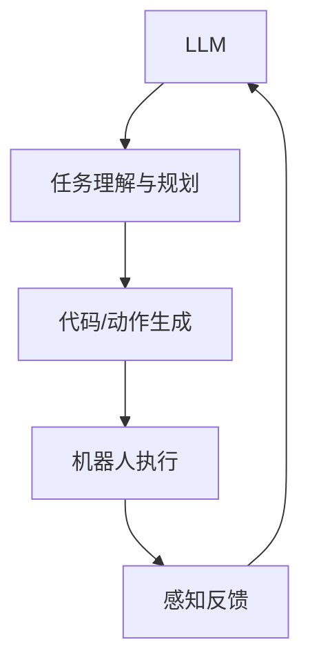

# 七、LLM 前景与发展面试真题

## 1. 距离 AGI 的差距

### 最关键的缺失能力

| 能力 | 当前状态 | 缺失原因 |
|------|---------|---------|
| 因果推理 | 相关性≠因果性 | 自回归训练目标不建模因果 |
| 长程规划 | 多步推理易失败 | 上下文窗口限制+错误累积 |
| 持续学习 | 灾难性遗忘 | 参数固定，无法在线学习 |
| 世界模型 | 缺乏物理直觉 | 纯文本训练无物理交互 |
| 自我反思 | 有限 | 缺乏元认知机制 |

### 技术瓶颈

1. **数据墙**：高质量人类数据即将耗尽
2. **计算墙**：Scaling Laws 的边际收益递减
3. **架构限制**：Transformer 的 $O(n^2)$ 复杂度限制上下文长度
4. **评估缺失**：缺乏衡量 AGI 进展的统一标准

---

## 2. 多模态融合走向

### 当前状态

文本+图像已较好融合（GPT-4V, Gemini），视频理解正在追赶。

### 未来方向

### 关键挑战

| 模态 | 挑战 |
|------|------|
| 视频 | 时序建模、帧间冗余、长视频 |
| 音频 | 采样率高、变长序列、语音+音乐+噪声 |
| 3D | 点云无序性、数据稀缺 |
| 触觉 | 传感器数据异构、数据极稀缺 |
| 跨模态对齐 | 不同模态的时间/空间对齐 |

### 趋势判断

短期内（1-2年）文本+图像+视频+音频的统一模型将成为标配；触觉等模态需等具身智能发展。

---

## 3. 世界模型

### 定义

LLM 内部形成的对物理世界运行规律的隐式模拟，使模型能预测行动后果。

### 与推理/规划的关系

- **无世界模型**：规划只能依赖模式匹配，无法预测新情况
- **有世界模型**：可在内部模拟行动后果，选择最优路径

### 代表工作

| 工作 | 方法 |
|------|------|
| JEPA (LeCun) | 联合嵌入预测架构，在抽象空间预测 |
| Sora | 视频生成隐式学习物理规律 |
| Genie | 交互式环境生成，学习世界动态 |
| DIAMOND | 用扩散模型作为世界模型 |

### 关键问题

1. 如何评估世界模型的准确性？
2. 如何保证模拟的因果性而非仅相关性？
3. 如何处理分布外（OOD）场景？

---

## 4. 合成数据的角色

### 为什么需要

1. **人类数据耗尽**：Epoch AI 估计高质量人类文本数据将在 2024-2026 年耗尽
2. **特定领域稀缺**：数学推理、代码等高质量数据不足
3. **对齐数据**：偏好对比数据人工标注成本极高

### 合成数据生成方式

| 方式 | 描述 | 风险 |
|------|------|------|
| 强模型生成 | GPT-4生成训练数据 | 模型坍缩 |
| 自我改进 | 模型生成→验证→筛选 | 偏见放大 |
| 拒绝采样 | 生成多候选→选最优 | 多样性下降 |
| 数据增强 | 变换/改写已有数据 | 信息量有限 |

### 模型坍缩（Model Collapse）

用模型生成的数据训练下一代模型，导致分布退化：

$$P_{n+1}(x) \neq P_n(x) \neq P_0(x)$$

尾部（低频）数据逐渐丢失，输出分布越来越窄。

### 缓解

1. 混合真实数据与合成数据
2. 保证合成数据的多样性
3. 用验证器（如代码执行、数学验证）筛选
4. 人工审核关键数据

---

## 5. 具身智能

### LLM 如何赋能机器人

| 层级 | LLM角色 | 示例 |
|------|---------|------|
| 高层规划 | 将自然语言指令分解为子任务 | "做早餐"→"拿鸡蛋→打蛋→煎蛋" |
| 中层控制 | 生成可执行代码/动作序列 | 生成机器人控制代码 |
| 低层控制 | 直接输出关节角度（当前较弱） | 精细操作仍需传统控制 |

### 挑战

1. **感知-动作鸿沟**：LLM 输出离散 token，机器人需要连续控制信号
2. **实时性**：LLM 推理延迟高，机器人需要毫秒级响应
3. **安全约束**：物理世界不可逆，错误操作有危险
4. **数据稀缺**：机器人交互数据远少于文本数据
5. **泛化性**：仿真到真实（Sim2Real）的差距

### 代表工作

- RT-2：Vision-Language-Action 模型
- SayCan：LLM规划 + 机器人技能库
- VoxPoser：LLM生成3D价值地图指导操作
- OpenVLA：开源视觉-语言-动作模型

---

## 6. 个性化与隐私平衡

### 个性化方法

| 方法 | 隐私风险 | 效果 |
|------|---------|------|
| Prompt内注入用户画像 | 高（画像明文） | 中 |
| 检索增强个性化 | 中（数据在本地） | 中 |
| LoRA个性化适配器 | 低（适配器不含原始数据） | 高 |
| 联邦学习 | 低（数据不出本地） | 中 |
| 差分隐私训练 | 低（加噪声保护） | 中低 |

### 平衡原则

1. **数据最小化**：只收集必要的个性化信息
2. **本地化处理**：敏感数据在端侧处理
3. **用户控制**：用户可查看/删除/修改个人数据
4. **透明度**：明确告知数据用途
5. **可撤销**：个性化效果可随时关闭

---

## 7. Transformer vs 新架构

### Transformer 的局限

| 问题 | 描述 |
|------|------|
| 二次复杂度 | 自注意力 $O(n^2)$ 限制长序列 |
| 位置编码外推 | 长上下文外推困难 |
| 顺序生成 | 自回归解码无法并行 |

### 状态空间模型（SSM / Mamba）

核心：用状态空间方程建模序列：

$$h'(t) = Ah(t) + Bx(t)$$
$$y(t) = Ch(t) + Dx(t)$$

离散化后可高效并行训练，推理时为 $O(1)$ 状态更新。

### Mamba 的创新

1. **选择性机制**：参数 B, C, Δ 依赖输入，实现内容感知的遗忘/保留
2. **硬件感知**：扫描算法优化GPU内存访问
3. **线性复杂度**：推理 $O(n)$，训练可并行

### 对比

| | Transformer | Mamba |
|---|---|---|
| 训练并行性 | 高 | 高（扫描并行） |
| 推理复杂度 | $O(n^2)$ / $O(n)$ w/ KV Cache | $O(n)$ |
| 长序列 | 受限 | 天然支持 |
| 表达能力 | 强 | 待验证 |
| 生态成熟度 | 极高 | 早期 |

### 判断

短期内 Transformer 仍将主导；Mamba 等新架构在长序列场景有潜力，但需在更大规模上验证。混合架构（如 Jamba = Mamba + Attention）可能是过渡方案。

---

## 8. 3-5年颠覆性应用预测

| 领域 | 颠覆性应用 | 原因 |
|------|-----------|------|
| 软件开发 | AI编程助手全面替代初级编码 | 代码生成已实用，需求巨大 |
| 客服/销售 | AI Agent替代80%人工客服 | 成本优势明显，技术已成熟 |
| 教育 | 个性化AI导师 | 因材施教需求强，LLM能力匹配 |
| 医疗 | AI辅助诊断+病历处理 | 数据丰富，监管逐步开放 |
| 法律 | 合同审查+法律咨询 | 规则明确，文本密集型 |
| 金融 | 智能投研+风控 | 数据驱动，LLM擅长信息提取 |

### 最可能率先颠覆：软件开发

1. 代码生成质量已达到实用水平（SWE-bench持续提升）
2. 需求明确、反馈即时（编译/测试）
3. 市场规模巨大且付费意愿强
4. 从辅助编码→独立完成→全流程自动化的路径清晰
