# 第七章 大语言模型的前景与发展

> 本章从宏观视角审视大语言模型（Large Language Model, LLM）的技术边界与演进方向。我们将从当前 LLM 与通用人工智能（Artificial General Intelligence, AGI）之间的差距出发，逐步探讨多模态融合、世界模型、合成数据、具身智能、个性化与隐私、新型架构等前沿议题，最终展望未来 3-5 年可能出现的颠覆性应用。

---

## 7.1 从 LLM 到 AGI：尚存的鸿沟

### 7.1.1 什么是 AGI

通用人工智能（AGI）是指具备与人类同等甚至超越人类的通用认知能力的人工智能系统。与当前的"窄 AI"（Narrow AI，即在特定任务上表现优异的 AI）不同，AGI 应当能够在任意智力任务上自主学习、推理和决策。

当前的 LLM（如 GPT-4、Claude、Gemini 等）虽然在语言理解与生成方面取得了惊人进展，但距离 AGI 仍有显著差距。理解这些差距，是把握 LLM 未来发展方向的关键。

### 7.1.2 五大缺失能力

下表总结了当前 LLM 距离 AGI 最关键的五项缺失能力：

| 能力维度 | 当前状态 | 缺失根因 |
|---------|---------|---------|
| **因果推理**（Causal Reasoning） | 只能捕捉统计相关性，无法区分因果关系 | 自回归训练目标仅建模条件概率 $P(x_t \mid x_{<t})$，不建模因果结构 |
| **长程规划**（Long-horizon Planning） | 多步推理容易出错，步骤越多失败率越高 | 上下文窗口有限，且错误会逐步累积（error accumulation） |
| **持续学习**（Continual Learning） | 存在灾难性遗忘（catastrophic forgetting） | 模型参数在部署后固定，无法在线更新知识 |
| **世界模型**（World Model） | 缺乏对物理世界的直觉理解 | 训练数据以纯文本为主，缺少与物理环境的交互经验 |
| **自我反思**（Self-reflection） | 元认知能力有限 | 缺乏对自身推理过程的监控与纠错机制 |

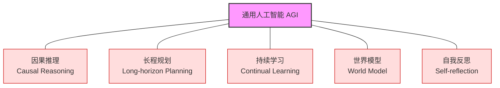

### 7.1.3 四大技术瓶颈

除了能力层面的缺失，LLM 通往 AGI 的道路上还面临四大结构性瓶颈：

**1. 数据墙（Data Wall）**

高质量人类文本数据正在逐渐耗尽。据 Epoch AI 研究估计，互联网上可用于训练的高质量文本数据将在 2024-2026 年间被消耗殆尽。这意味着单纯依靠"更多数据"来提升模型能力的路径正在收窄。

**2. 计算墙（Compute Wall）**

Scaling Laws（缩放定律，详见 7.3 节）表明，模型性能随计算量增长呈幂律提升，但边际收益递减。继续扩大模型规模所需的算力和能源成本正在逼近经济和物理极限。

**3. 架构限制**

当前主流的 Transformer 架构（详见 7.7 节）中，自注意力机制（Self-Attention）的计算复杂度为 $O(n^2)$，其中 $n$ 为序列长度。这一二次复杂度严重限制了模型处理超长上下文的能力。

**4. 评估缺失**

目前缺乏衡量 AGI 进展的统一标准和基准测试。现有的评测体系（如 MMLU、HumanEval 等）只能衡量特定维度的能力，无法全面评估通用智能水平。

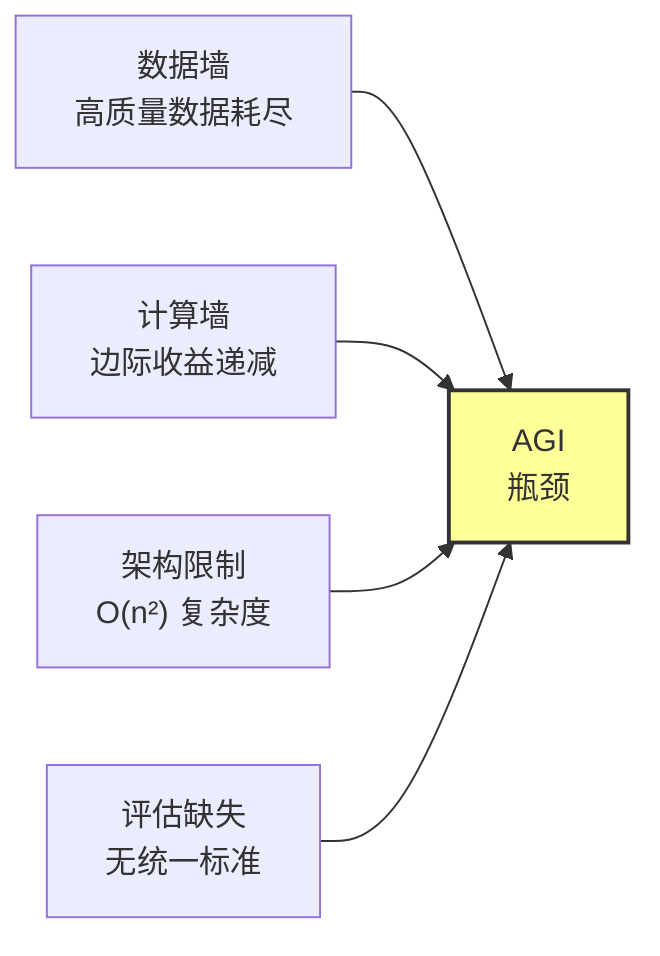

从 AGI 的差距分析中，我们可以看到"纯文本训练"是多项缺失能力的共同根因。这自然引出了下一个核心议题——如何通过多模态融合来弥补这一不足。

---

## 7.2 多模态融合：从文本走向全感官

### 7.2.1 多模态的含义

多模态（Multimodal）是指模型能够同时理解和处理多种信息形式（模态），包括文本、图像、音频、视频、3D 数据等。人类的认知本身就是多模态的——我们同时通过视觉、听觉、触觉等感官来理解世界。让 AI 具备类似的多模态能力，是迈向更通用智能的重要一步。

### 7.2.2 当前发展阶段

截至目前，文本与图像的融合已经较为成熟，代表性模型包括 GPT-4V（GPT-4 with Vision，OpenAI 推出的多模态版本）和 Gemini（Google DeepMind 的原生多模态模型）。视频理解能力正在快速追赶，但仍面临诸多挑战。

### 7.2.3 多模态融合的演进路线

多模态融合遵循从易到难、从数据丰富到数据稀缺的渐进路径：

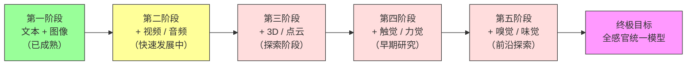

### 7.2.4 各模态的关键挑战

不同模态在融合过程中面临各自独特的技术难题：

| 模态 | 核心挑战 | 详细说明 |
|------|---------|---------|
| **视频** | 时序建模、帧间冗余、长视频理解 | 视频本质上是图像序列，但帧与帧之间存在大量冗余信息；长视频（数分钟到数小时）的理解需要极大的上下文容量 |
| **音频** | 高采样率、变长序列、多类型混合 | 音频信号采样率通常为 16kHz-48kHz，数据量远超文本；且需同时处理语音、音乐、环境噪声等不同类型 |
| **3D / 点云** | 数据无序性、训练数据稀缺 | 点云（Point Cloud）是 3D 空间中的离散点集合，不具有图像那样的规则网格结构，处理难度更大 |
| **触觉** | 传感器数据异构、数据极度稀缺 | 不同触觉传感器输出格式差异大，且缺乏大规模标注数据集 |
| **跨模态对齐** | 时间与空间的精确对齐 | 不同模态的数据在时间轴和空间维度上需要精确对应，例如视频中的嘴型与音频中的语音必须同步 |

### 7.2.5 趋势判断

短期内（1-2 年），文本 + 图像 + 视频 + 音频的统一模型将成为行业标配。触觉、力觉等更高级模态的融合，则需要等待具身智能（Embodied Intelligence，详见 7.5 节）领域的进一步发展，因为这些模态的数据采集高度依赖物理机器人与真实环境的交互。

多模态融合不仅扩展了模型的感知范围，更为构建"世界模型"奠定了基础——模型需要通过多种感官来理解物理世界的运行规律。

---

## 7.3 Scaling Laws：规模扩展的科学

### 7.3.1 什么是 Scaling Laws

Scaling Laws（缩放定律）是描述模型性能如何随关键资源（模型参数量、训练数据量、计算量）增长而变化的经验规律。2020 年 OpenAI 的 Kaplan 等人首次系统性地揭示了这一规律，发现 LLM 的测试损失（test loss）与这三个因素之间存在幂律关系（power law）。

### 7.3.2 核心公式

Scaling Laws 的基本形式可以表示为：

$$L(N) = \left(\frac{N_c}{N}\right)^{\alpha_N}$$

其中：
- $L(N)$：模型的测试损失（loss），值越低表示性能越好
- $N$：模型的参数量（number of parameters）
- $N_c$：与损失相关的常数，取决于具体任务和数据
- $\alpha_N$：缩放指数（scaling exponent），通常约为 0.076

类似地，对于数据量 $D$ 和计算量 $C$，也有对应的幂律关系：

$$L(D) = \left(\frac{D_c}{D}\right)^{\alpha_D}, \quad L(C) = \left(\frac{C_c}{C}\right)^{\alpha_C}$$

其中 $\alpha_D \approx 0.095$，$\alpha_C \approx 0.050$。

### 7.3.3 Scaling Laws 的意义与局限

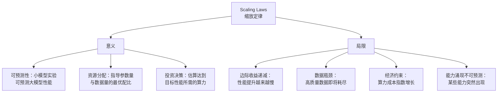

Scaling Laws 揭示了一个重要事实：单纯依靠"堆规模"来提升模型能力的路径正在遇到天花板。这促使研究者从两个方向寻找突破口——一是构建更高效的训练数据（合成数据），二是探索更高效的模型架构。在此之前，我们先讨论一个与 AGI 密切相关的概念：世界模型。

---

## 7.4 世界模型：让 AI 理解物理世界

### 7.4.1 什么是世界模型

世界模型（World Model）是指 AI 系统内部形成的对物理世界运行规律的隐式模拟。具备世界模型的 AI 能够在"脑中"预演行动的后果，而不必在真实环境中反复试错。

例如，人类可以在脑中想象"把杯子推到桌边会掉下去"，这就是世界模型在起作用。当前的 LLM 缺乏这种能力，它们对物理世界的"理解"仅来自文本描述，而非真正的物理直觉。

### 7.4.2 世界模型与推理、规划的关系

世界模型是实现高质量推理和规划的基础设施。三者之间的协作关系如下：

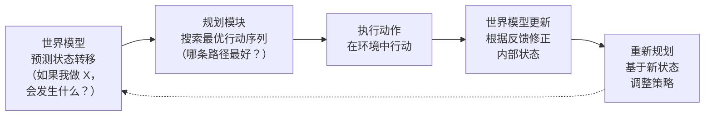

两种模式的对比：

- **无世界模型**：规划只能依赖模式匹配（pattern matching），即从训练数据中找到类似的情境并模仿。面对全新情况时容易失败。
- **有世界模型**：可以在内部模拟不同行动的后果，通过"心理预演"选择最优路径。即使面对从未见过的情境，也能基于物理规律进行合理推断。

### 7.4.3 代表性研究工作

| 研究工作 | 提出者/机构 | 核心方法 | 关键思想 |
|---------|-----------|---------|---------|
| **JEPA** | Yann LeCun (Meta) | 联合嵌入预测架构（Joint Embedding Predictive Architecture） | 不在像素空间预测，而在抽象的嵌入空间（embedding space）中预测未来状态，避免了像素级预测的高维困难 |
| **Sora** | OpenAI | 视频生成模型 | 通过大规模视频生成训练，隐式学习物理世界的运动规律（如重力、碰撞、流体动力学等） |
| **Genie** | Google DeepMind | 交互式环境生成 | 从视频中学习世界动态，能够生成可交互的虚拟环境 |
| **DIAMOND** | 学术界 | 扩散模型（Diffusion Model）作为世界模型 | 利用扩散模型强大的分布建模能力来模拟环境状态转移 |

### 7.4.4 世界模型面临的关键问题

1. **评估难题**：如何量化评估世界模型的准确性？目前缺乏统一的评测基准。
2. **因果性保证**：如何确保模型学到的是真正的因果关系，而非仅仅是统计相关性？例如，模型可能学到"太阳升起后公鸡打鸣"的相关性，但不理解两者并无因果关系。
3. **分布外泛化**：如何处理分布外（Out-of-Distribution, OOD）场景？即模型在训练中从未见过的情境。

世界模型的构建离不开大量高质量的训练数据。然而，正如 7.1 节所述，人类数据正在逐渐耗尽。这引出了一个关键议题：合成数据能否成为破局之道？

---

## 7.5 合成数据：突破数据墙的钥匙

### 7.5.1 为什么需要合成数据

合成数据（Synthetic Data）是指由 AI 模型或算法生成的训练数据，而非由人类直接创作。对合成数据的需求源于三个现实压力：

1. **人类数据耗尽**：Epoch AI 的研究估计，高质量人类文本数据将在 2024-2026 年间被消耗殆尽。互联网上的文本虽然总量庞大，但去除低质量、重复和有害内容后，可用于训练的高质量数据是有限的。
2. **特定领域数据稀缺**：数学推理、代码、科学论证等高质量专业数据本身就不充裕，成为模型在这些领域能力提升的瓶颈。
3. **对齐数据成本高昂**：用于人类反馈强化学习（RLHF）的偏好对比数据需要人工标注，成本极高且难以规模化。

### 7.5.2 合成数据的生成方式

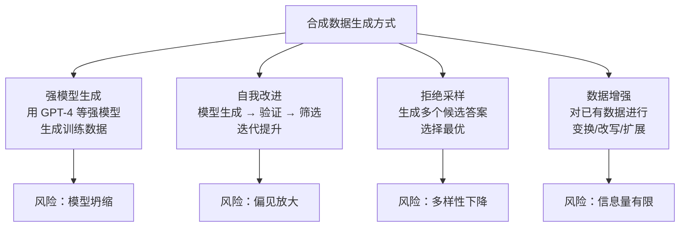

各方式的详细对比：

| 生成方式 | 描述 | 主要风险 |
|---------|------|---------|
| **强模型生成** | 使用能力更强的模型（如 GPT-4）为较弱模型生成训练数据 | 可能导致模型坍缩（见下文） |
| **自我改进** | 模型自己生成数据，经过验证器筛选后用于训练自身 | 已有偏见可能被放大 |
| **拒绝采样**（Rejection Sampling） | 对同一问题生成多个候选答案，通过评分选择最优 | 输出多样性逐渐下降 |
| **数据增强**（Data Augmentation） | 对已有真实数据进行改写、变换、扩展 | 无法引入真正的新信息 |

### 7.5.3 模型坍缩：合成数据的核心风险

模型坍缩（Model Collapse）是合成数据面临的最严重风险。当用模型生成的数据训练下一代模型时，数据分布会逐渐退化。

数学表达如下：

$$P_{n+1}(x) \neq P_n(x) \neq P_0(x)$$

其中：
- $P_0(x)$：原始真实数据的分布
- $P_n(x)$：第 $n$ 代模型学到的数据分布
- $P_{n+1}(x)$：用第 $n$ 代模型生成的数据训练出的第 $n+1$ 代模型的分布

随着迭代代数增加，分布会越来越偏离真实分布 $P_0(x)$。具体表现为：尾部数据（低频、罕见的样本）逐渐丢失，输出分布越来越窄，模型的多样性和创造力持续下降。

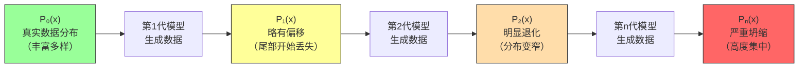

### 7.5.4 缓解模型坍缩的策略

1. **混合训练**：将真实数据与合成数据按一定比例混合，确保真实分布的"锚定"作用
2. **多样性保障**：在生成合成数据时引入随机性和多样性约束
3. **验证器筛选**：利用可验证的信号（如代码执行结果、数学证明验证器）来筛选高质量合成数据
4. **人工审核**：对关键领域的合成数据进行人工质量审核

合成数据为突破数据墙提供了可能，但它本身并不能替代模型与真实物理世界的交互。要让 AI 真正理解和操作物理世界，需要将 LLM 与机器人结合——这就是具身智能的研究方向。

---

## 7.6 具身智能：LLM 走进物理世界

### 7.6.1 什么是具身智能

具身智能（Embodied Intelligence）是指将智能体（agent）嵌入到物理实体（如机器人）中，使其能够通过感知和行动与真实物理环境进行交互。与纯粹的"数字智能"不同，具身智能强调智能必须"有身体"，通过身体与环境的互动来学习和理解世界。

### 7.6.2 LLM 如何赋能机器人

LLM 为机器人带来了前所未有的自然语言理解和高层推理能力。两者的结合形成了一个闭环系统：

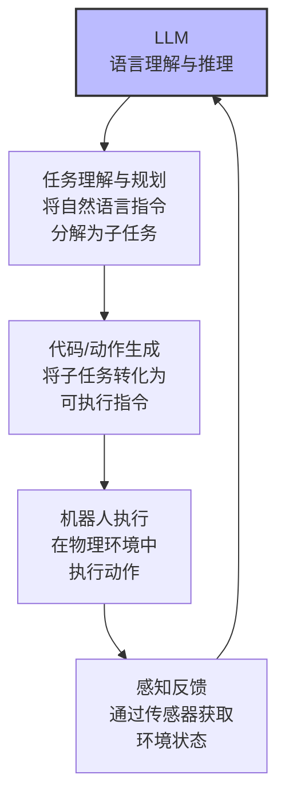

LLM 在机器人系统中扮演不同层级的角色：

| 控制层级 | LLM 的角色 | 示例 | 成熟度 |
|---------|-----------|------|-------|
| **高层规划** | 将自然语言指令分解为子任务序列 | "做早餐" → "拿鸡蛋 → 打蛋 → 煎蛋" | 较成熟 |
| **中层控制** | 生成可执行的代码或动作序列 | 生成机器人控制代码（如 Python 脚本） | 发展中 |
| **低层控制** | 直接输出关节角度等连续控制信号 | 精细操作（如穿针引线） | 较弱，仍需传统控制方法 |

### 7.6.3 具身智能的五大挑战

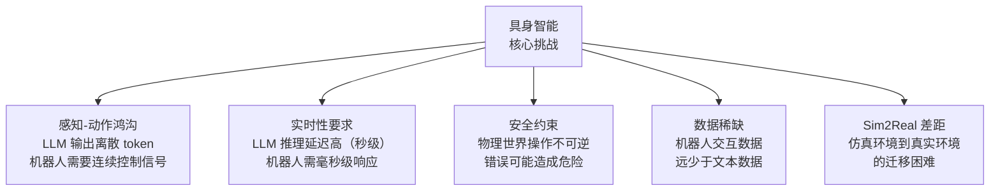

1. **感知-动作鸿沟**：LLM 的输出是离散的 token 序列，而机器人需要连续的控制信号（如关节角度、力矩等）。如何桥接这一鸿沟是核心难题。
2. **实时性**：LLM 的推理延迟通常在秒级，而机器人的控制回路需要毫秒级响应。这要求在系统架构上做出权衡。
3. **安全约束**：与数字世界不同，物理世界中的操作是不可逆的。机器人的错误动作可能损坏物品甚至伤害人类。
4. **数据稀缺**：机器人交互数据的采集成本远高于文本数据，且难以大规模获取。
5. **Sim2Real 差距**：Sim2Real（Simulation to Reality）指从仿真环境到真实环境的迁移。仿真中训练的策略在真实世界中往往表现不佳，因为仿真无法完美复现真实物理。

### 7.6.4 代表性研究工作

- **RT-2**（Robotics Transformer 2）：Google DeepMind 提出的视觉-语言-动作（Vision-Language-Action, VLA）模型，将视觉理解、语言指令和机器人动作统一在一个 Transformer 中
- **SayCan**：Google 提出的框架，结合 LLM 的语言规划能力与机器人预训练技能库，LLM 负责"说什么该做"，技能库负责"能做什么"
- **VoxPoser**：利用 LLM 生成 3D 价值地图（value map）来指导机器人操作，将语言指令转化为空间中的奖励信号
- **OpenVLA**：开源的视觉-语言-动作模型，降低了具身智能研究的门槛

从具身智能的讨论中可以看到，AI 系统正在从纯数字世界走向物理世界。但在这一过程中，一个不可回避的问题是：如何在提供个性化服务的同时保护用户隐私？

---

## 7.7 个性化与隐私：鱼与熊掌的平衡

### 7.7.1 个性化的必要性

通用的 LLM 对所有用户提供相同的响应，但不同用户有不同的知识背景、偏好和需求。个性化（Personalization）旨在让模型根据用户的特征和历史行为提供定制化的服务，从而提升用户体验和实用价值。

### 7.7.2 个性化方法的技术谱系

从隐私风险由高到低，当前主要的个性化方法包括：

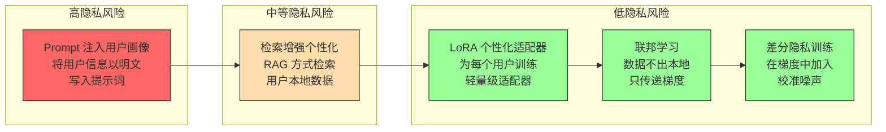

各方法的详细对比：

| 方法 | 隐私风险 | 个性化效果 | 技术说明 |
|------|---------|-----------|---------|
| **Prompt 注入用户画像** | 高（画像明文传输） | 中 | 将用户偏好、历史等信息直接写入系统提示词 |
| **检索增强个性化** | 中（数据留在本地） | 中 | 基于 RAG（Retrieval-Augmented Generation，检索增强生成）从用户本地数据库检索相关信息 |
| **LoRA 个性化适配器** | 低（适配器不含原始数据） | 高 | LoRA（Low-Rank Adaptation，低秩适配）为每个用户训练一个小型适配器模块 |
| **联邦学习** | 低（数据不出本地） | 中 | Federated Learning，多个用户在本地训练，只将模型更新（而非原始数据）上传到服务器聚合 |
| **差分隐私训练** | 低（数学保证隐私） | 中低 | Differential Privacy，在训练过程中向梯度添加校准噪声，提供可量化的隐私保证 |

### 7.7.3 隐私与个性化的平衡原则

在实践中，需要遵循以下五项原则来平衡个性化效果与隐私保护：

1. **数据最小化**（Data Minimization）：只收集实现个性化所必需的最少信息，避免过度采集
2. **本地化处理**（Local Processing）：敏感数据尽量在用户端侧（edge side）处理，减少数据传输
3. **用户控制**（User Control）：用户可以查看、修改和删除自己的个人数据
4. **透明度**（Transparency）：明确告知用户数据的收集范围和使用目的
5. **可撤销性**（Revocability）：个性化效果可以随时关闭，用户数据可以被完全清除

这五项原则不仅是技术设计的指导方针，也与全球主要隐私法规（如欧盟 GDPR、中国《个人信息保护法》）的核心要求高度一致。

在解决了"如何让 AI 更好地服务用户"的问题后，我们回到技术架构层面，探讨支撑 LLM 的底层架构——Transformer——是否会被新架构取代。

---

## 7.8 Transformer 与新型架构：范式之争

### 7.8.1 Transformer 的统治地位与局限

Transformer 架构自 2017 年由 Vaswani 等人在论文"Attention Is All You Need"中提出以来，已成为几乎所有主流 LLM 的基础架构。然而，它并非没有局限：

| 局限性 | 技术描述 | 实际影响 |
|-------|---------|---------|
| **二次复杂度** | 自注意力机制的计算复杂度为 $O(n^2)$，其中 $n$ 为序列长度 | 处理超长文本（如整本书）时计算成本极高 |
| **位置编码外推困难** | 训练时使用的位置编码难以泛化到更长的序列 | 模型在超出训练长度的上下文上表现下降 |
| **顺序生成瓶颈** | 自回归解码（autoregressive decoding）必须逐 token 生成，无法并行 | 推理速度受限，尤其在生成长文本时 |

### 7.8.2 状态空间模型（SSM）：一种新范式

状态空间模型（State Space Model, SSM）是近年来最受关注的 Transformer 替代架构之一。其核心思想是用状态空间方程（源自控制理论）来建模序列数据。

**连续形式的状态空间方程：**

$$h'(t) = Ah(t) + Bx(t)$$
$$y(t) = Ch(t) + Dx(t)$$

其中各符号含义如下：
- $h(t) \in \mathbb{R}^N$：隐状态向量（hidden state），维度为 $N$，编码了到时刻 $t$ 为止的历史信息
- $h'(t)$：隐状态对时间的导数，描述状态如何随时间演化
- $x(t) \in \mathbb{R}$：时刻 $t$ 的输入信号
- $y(t) \in \mathbb{R}$：时刻 $t$ 的输出信号
- $A \in \mathbb{R}^{N \times N}$：状态转移矩阵（state matrix），决定隐状态如何自我演化
- $B \in \mathbb{R}^{N \times 1}$：输入矩阵（input matrix），决定输入如何影响隐状态
- $C \in \mathbb{R}^{1 \times N}$：输出矩阵（output matrix），决定隐状态如何映射到输出
- $D \in \mathbb{R}$：直通矩阵（feedthrough matrix），输入到输出的直接连接

将上述连续方程离散化后，可以高效地进行并行训练；在推理时，每一步只需 $O(1)$ 的状态更新操作，而非 Transformer 需要回顾所有历史 token 的 $O(n)$ 操作。

### 7.8.3 Mamba：SSM 的突破性改进

Mamba 是由 Albert Gu 和 Tri Dao 于 2023 年提出的选择性状态空间模型，是 SSM 家族中最具影响力的工作。其三大核心创新：

**1. 选择性机制（Selective Mechanism）**

传统 SSM 的参数 $A$、$B$、$C$ 是固定的，对所有输入一视同仁。Mamba 的关键创新在于让参数 $B$、$C$ 和离散化步长 $\Delta$ 依赖于输入内容：

$$B = f_B(x_t), \quad C = f_C(x_t), \quad \Delta = f_\Delta(x_t)$$

其中 $f_B$、$f_C$、$f_\Delta$ 是可学习的投影函数。这使得模型能够根据输入内容动态决定"记住什么、遗忘什么"，实现了内容感知的信息筛选。

**2. 硬件感知的并行扫描算法**

Mamba 设计了专门针对 GPU 内存层次结构优化的扫描算法（scan algorithm），最大限度地减少了 GPU 高带宽内存（HBM）与 SRAM 之间的数据搬运，从而在实际硬件上实现了高效的并行训练。

**3. 线性复杂度**

推理时复杂度为 $O(n)$（$n$ 为序列长度），训练时通过并行扫描也可实现高效计算。

### 7.8.4 Transformer 与 Mamba 的全面对比

| 维度 | Transformer | Mamba (SSM) |
|------|------------|-------------|
| **训练并行性** | 高（注意力矩阵可并行计算） | 高（通过并行扫描算法） |
| **推理复杂度** | $O(n^2)$；使用 KV Cache 优化后为 $O(n)$ | $O(n)$（天然线性） |
| **长序列处理** | 受 $O(n^2)$ 限制，需要特殊优化 | 天然支持，状态大小固定 |
| **表达能力** | 强，经过大量实践验证 | 理论上有潜力，但大规模验证不足 |
| **生态成熟度** | 极高（工具链、优化技术、预训练模型丰富） | 早期阶段 |

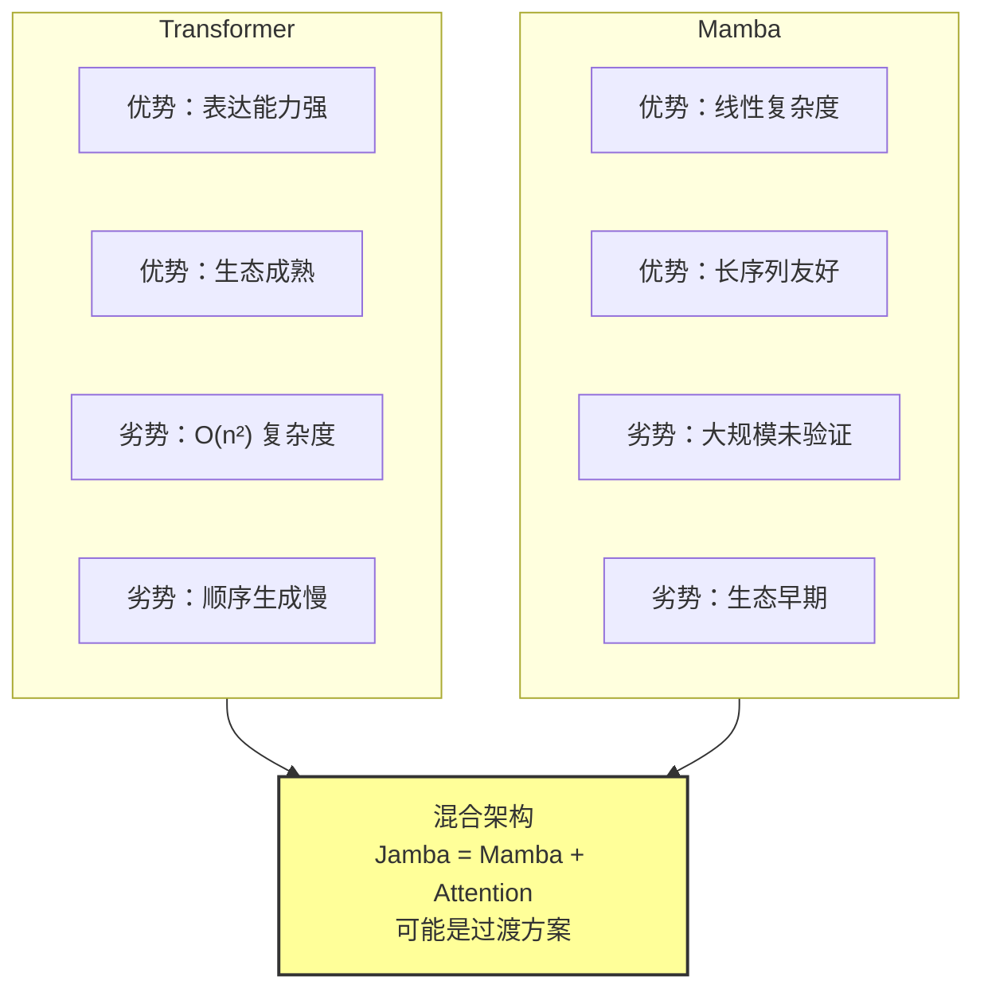

### 7.8.5 架构演进的趋势判断

短期内（1-3 年），Transformer 仍将主导 LLM 领域，原因在于其成熟的生态系统和经过大规模验证的表达能力。Mamba 等新架构在长序列处理场景（如长文档理解、基因组分析等）展现出明显优势，但仍需在更大规模（数百亿到数千亿参数）上验证其性能上限。

混合架构（如 AI21 Labs 提出的 Jamba，将 Mamba 层与 Attention 层交替堆叠）可能是一种务实的过渡方案，兼顾 Transformer 的表达能力和 SSM 的效率优势。

---

## 7.9 未来 3-5 年：颠覆性应用展望

### 7.9.1 六大领域的颠覆性应用

在技术持续进步的推动下，以下六个领域最有可能在未来 3-5 年内经历 LLM 带来的深刻变革：

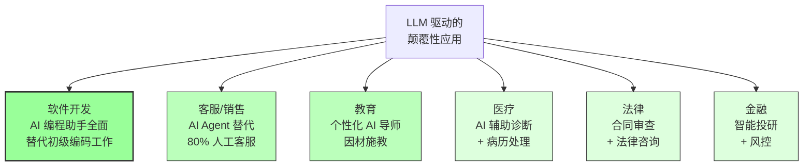

各领域的详细分析：

| 领域 | 颠覆性应用 | 驱动因素 |
|------|-----------|---------|
| **软件开发** | AI 编程助手全面替代初级编码工作 | 代码生成质量已达实用水平，需求巨大且付费意愿强 |
| **客服/销售** | AI Agent 替代 80% 人工客服 | 成本优势明显，对话技术已成熟 |
| **教育** | 个性化 AI 导师实现因材施教 | 个性化教学需求强烈，LLM 的知识广度和交互能力高度匹配 |
| **医疗** | AI 辅助诊断 + 智能病历处理 | 医疗数据丰富，监管环境逐步开放 |
| **法律** | 智能合同审查 + 法律咨询 | 法律工作规则明确，属于文本密集型任务 |
| **金融** | 智能投研 + 风险控制 | 金融决策高度依赖数据驱动，LLM 擅长信息提取与综合分析 |

### 7.9.2 最可能率先颠覆的领域：软件开发

在上述六个领域中，软件开发最有可能率先经历深刻变革，原因如下：

1. **技术成熟度高**：代码生成的质量已经达到实用水平，在 SWE-bench（软件工程基准测试）等评测上持续提升
2. **反馈信号明确**：代码可以通过编译和测试获得即时、客观的反馈，这为模型的自我改进提供了天然的验证机制
3. **市场规模巨大**：全球软件开发市场规模庞大，企业和开发者的付费意愿强
4. **演进路径清晰**：从辅助编码（Copilot 模式）→ 独立完成任务 → 全流程自动化，路径逐步递进

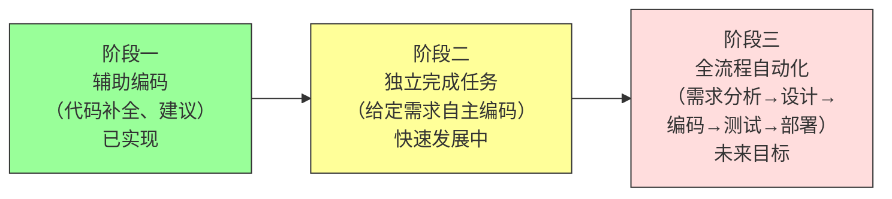

---

## 7.10 本章总结：LLM 发展的全景图

本章从多个维度审视了 LLM 的前景与发展方向。下图展示了各议题之间的内在联系：

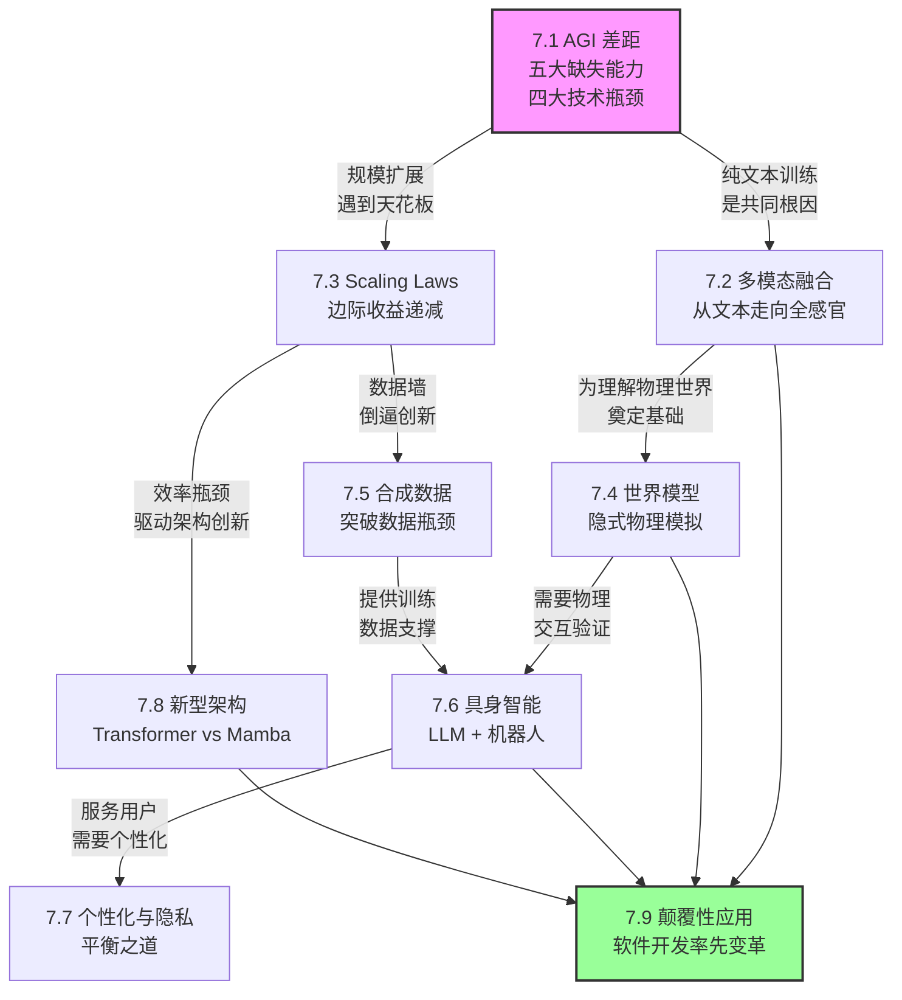

**核心要点回顾：**

- 当前 LLM 距离 AGI 仍有显著差距，因果推理、长程规划、持续学习、世界模型和自我反思是五大缺失能力
- 多模态融合正从文本+图像向全感官统一模型演进，是弥补"纯文本训练"局限的关键路径
- Scaling Laws 揭示了规模扩展的幂律规律，但边际收益递减促使研究者寻找新的突破方向
- 世界模型是实现高质量推理和规划的基础，JEPA、Sora 等工作正在探索不同的构建路径
- 合成数据是突破数据墙的重要手段，但需警惕模型坍缩风险
- 具身智能将 LLM 的能力延伸到物理世界，但面临感知-动作鸿沟、实时性、安全性等挑战
- 个性化与隐私的平衡需要从技术和制度两个层面同时着手
- Mamba 等新架构在长序列场景展现潜力，混合架构可能是务实的过渡方案
- 软件开发是最可能率先被 LLM 深刻变革的领域

> **展望**：LLM 的发展正处于从"语言智能"向"通用智能"跨越的关键阶段。这一跨越不仅需要模型架构和训练方法的创新，更需要多模态感知、物理世界交互、持续学习等多个维度的协同突破。未来的 AI 系统将不再是单纯的"语言模型"，而是能够感知、理解、推理和行动的通用智能体。