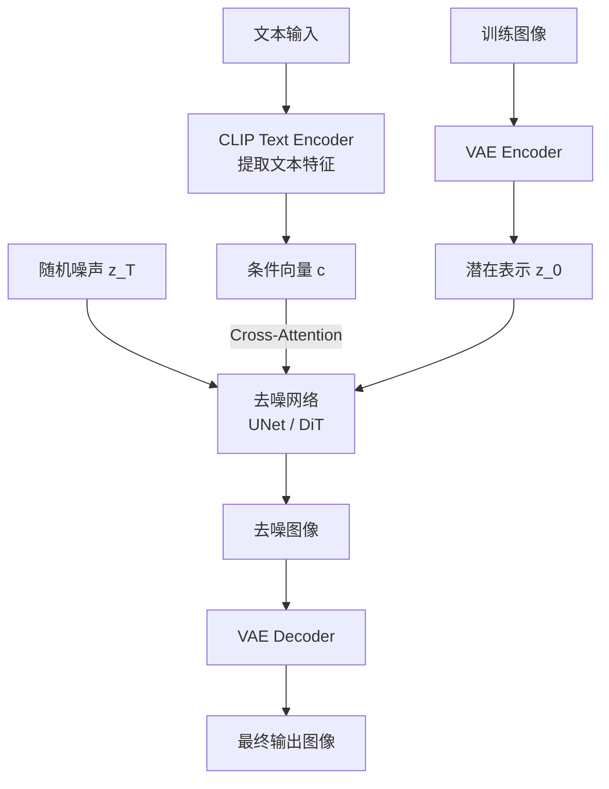
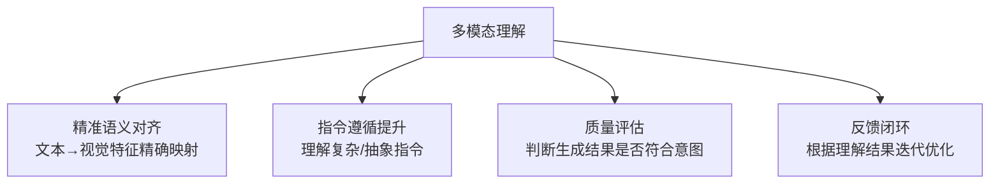
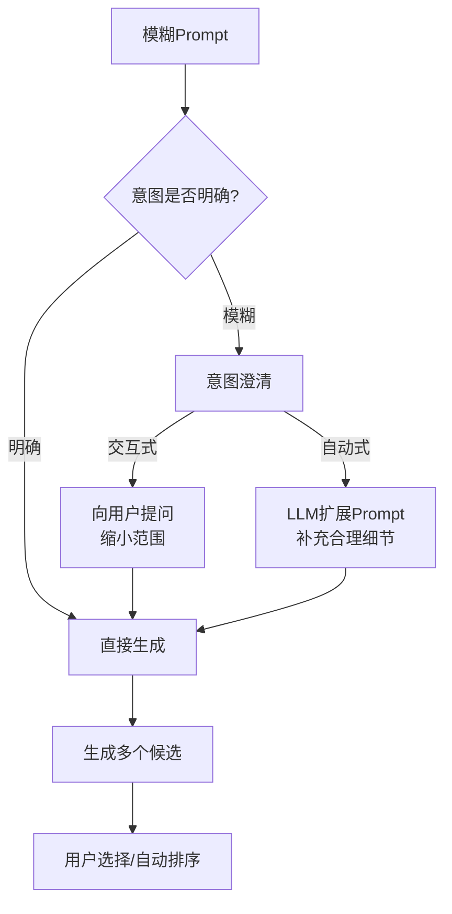
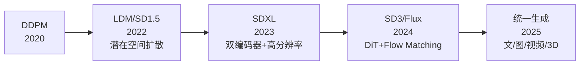
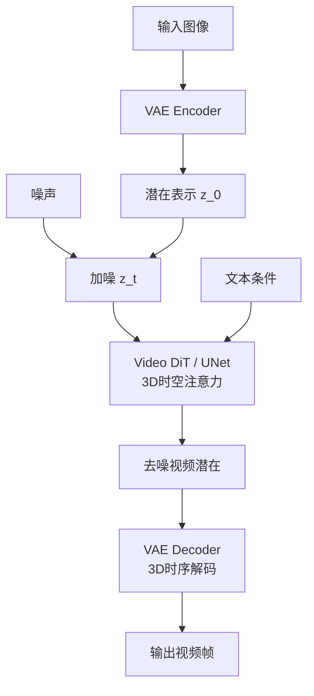

# 八、AIGC 面试真题

## 1. 扩散模型原理

### 前向扩散过程

逐步向数据添加高斯噪声，经 $T$ 步将数据分布退化为纯噪声：

$$q(x_t | x_{t-1}) = \mathcal{N}(x_t; \sqrt{1-\beta_t} x_{t-1}, \beta_t I)$$

其中 $\beta_t$ 为噪声调度（noise schedule），$t=1,...,T$。

**任意步直接采样**（重参数化技巧）：

$$x_t = \sqrt{\bar{\alpha}_t} x_0 + \sqrt{1-\bar{\alpha}_t} \epsilon, \quad \epsilon \sim \mathcal{N}(0, I)$$

其中 $\alpha_t = 1 - \beta_t$，$\bar{\alpha}_t = \prod_{s=1}^{t} \alpha_s$。

### 反向去噪过程

训练神经网络 $\epsilon_\theta$ 预测每步添加的噪声：

$$\mathcal{L}_{simple} = \mathbb{E}_{x_0, \epsilon, t} \left[ \| \epsilon - \epsilon_\theta(x_t, t) \|^2 \right]$$

反向采样（DDPM）：

$$x_{t-1} = \frac{1}{\sqrt{\alpha_t}} \left( x_t - \frac{1-\alpha_t}{\sqrt{1-\bar{\alpha}_t}} \epsilon_\theta(x_t, t) \right) + \sigma_t z$$

其中 $z \sim \mathcal{N}(0, I)$，$\sigma_t$ 为随机性控制。

### 整体流程

```mermaid
flowchart LR
    X0[真实图像 x_0] --> |加噪T步| XT[纯噪声 x_T]
    XT --> |去噪T步| X0_HAT[生成图像 x̂_0]
    
    subgraph 前向
        direction LR
        F1[x_0] --> |β₁| F2[x_1] --> |β₂| F3[x_2] --> |...| F4[x_T]
    end
    
    subgraph 反向
        direction RL
        B4[x_T] --> |ε_θ| B3[x_{T-1}] --> |ε_θ| B2[x_{T-2}] --> |...| B1[x̂_0]
    end
```

### DDPM vs DDIM

| | DDPM | DDIM |
|---|---|---|
| 采样方式 | 随机（含 $z$ 项） | 确定性（$\sigma=0$） |
| 采样步数 | 必须 T 步（~1000） | 可大幅减少（20-50步） |
| 生成质量 | 高 | 相当 |
| 速度 | 慢 | 快 20-50x |

### Score-based 模型视角

扩散模型等价于学习数据分布的梯度（score）：

$$\nabla_{x_t} \log p(x_t) \approx -\frac{\epsilon_\theta(x_t, t)}{\sqrt{1-\bar{\alpha}_t}}$$

噪声预测 $\epsilon_\theta$ 和 score 预测 $\nabla \log p$ 是等价参数化。

---

## 2. 文生图模型架构

### 整体架构



### 三大核心组件

| 组件 | 功能 | 代表 |
|------|------|------|
| **VAE** | 像素空间 ↔ 潜在空间，降维加速 | SD 的 KL-f8 VAE |
| **Text Encoder** | 文本语义提取，作为生成条件 | CLIP ViT-L, T5-XXL |
| **去噪网络** | 在潜在空间迭代去噪 | UNet (SD1.5/SDXL), DiT (SD3/Sora) |

### VAE 编解码

编码：$z_0 = \mathcal{E}(x)$，将 $H \times W \times 3$ 图像压缩为 $\frac{H}{8} \times \frac{W}{8} \times 4$ 的潜在表示。

解码：$\hat{x} = \mathcal{D}(z_0)$，从潜在表示恢复像素图像。

**为什么用 VAE**：直接在像素空间去噪计算量 $O(H^2W^2)$，在潜在空间降为 $O((H/8)^2(W/8)^2)$，计算量减少 64 倍。

### UNet 结构（SD1.5/SDXL）

```mermaid
flowchart TB
    IN[输入: z_t + t_emb] --> D1[下采样Block 1<br/>ResNet + Self-Attn]
    D1 --> D2[下采样Block 2<br/>ResNet + Cross-Attn(c)]
    D2 --> D3[下采样Block 3<br/>ResNet + Cross-Attn(c)]
    D3 --> MID[中间Block<br/>ResNet + Attn]
    MID --> U1[上采样Block 3<br/>+ Skip Connection from D3]
    U1 --> U2[上采样Block 2<br/>+ Skip Connection from D2]
    U2 --> U3[上采样Block 1<br/>+ Skip Connection from D1]
    U3 --> OUT[输出: 预测噪声 ε]
```

文本条件通过 **Cross-Attention** 注入：

$$\text{CrossAttn}(Q_z, K_c, V_c) = \text{softmax}\left(\frac{Q_z K_c^T}{\sqrt{d}}\right) V_c$$

$Q$ 来自图像特征，$K, V$ 来自文本特征 $c$。

### DiT 结构（SD3 / Sora）

用 Transformer 替代 UNet：

| | UNet | DiT |
|---|---|---|
| 结构 | 卷积 + 注意力混合 | 纯 Transformer |
| 归一化 | GroupNorm | LayerNorm + AdaLN |
| 条件注入 | Cross-Attention | AdaLN 调制 |
| 扩展性 | 受限 | 随参数量线性扩展 |
| 代表 | SD1.5, SDXL | SD3, Sora, Flux |

**AdaLN 条件注入**：

$$\text{AdaLN}(h, c) = \gamma(c) \cdot \text{LayerNorm}(h) + \beta(c)$$

其中 $\gamma(c), \beta(c)$ 由条件 $c$（文本+时间步）通过 MLP 生成。

---

## 3. 生图不符合物理规律

### 常见问题

| 问题 | 示例 |
|------|------|
| 空间关系错误 | 手指数量错误、肢体位置异常 |
| 物理约束缺失 | 水往高处流、物体悬浮无支撑 |
| 光影不一致 | 多光源矛盾、阴影方向错误 |
| 透视错误 | 远近比例失调 |
| 交互不合理 | 接触面穿透、握持姿态错误 |

### 根本原因

1. **缺乏3D理解**：扩散模型从2D像素分布学习，无3D几何先验
2. **数据偏差**：训练数据中物理规律的标注缺失
3. **局部生成**：去噪过程局部关注，缺乏全局物理一致性

### 解决方案

| 方案 | 原理 | 效果 |
|------|------|------|
| **ControlNet** | 注入结构化条件（深度图、边缘、姿态） | 强约束空间结构 |
| **3D先验融合** | 用3D渲染数据训练或3D感知注意力 | 改善几何一致性 |
| **物理引导采样** | 在采样时加入物理约束梯度 | 约束生成结果 |
| **多视角一致性** | 多视角联合生成+一致性损失 | 改善3D一致性 |
| **T2I奖励模型** | 用视觉问答模型检测物理错误 | 后处理过滤 |

### ControlNet 原理

冻结原始 UNet，添加可训练的副本分支，通过零卷积连接：

$$y = \mathcal{F}_\theta(x; c) + \mathcal{Z}(\mathcal{G}_\phi(x; c_{struct}))$$

其中 $\mathcal{F}_\theta$ 为冻结 UNet，$\mathcal{G}_\phi$ 为 ControlNet 分支，$\mathcal{Z}$ 为零初始化卷积，$c_{struct}$ 为结构化条件。

**零卷积**：初始化权重为零，训练开始时 ControlNet 不影响原始模型，逐步学习条件注入。

---

## 4. 多模态理解对 AIGC 的作用

### 核心价值

多模态理解（VLM）为 AIGC 提供**语义层面的约束和引导**，弥合文本指令与视觉内容之间的语义鸿沟。



### 具体作用

| 作用 | 实现方式 | 示例 |
|------|---------|------|
| **文本编码增强** | 用 VLM 替代 CLIP 做文本编码 | SD3 用 T5+CLIP 双编码器 |
| **布局规划** | VLM 先理解指令生成布局，再引导生成 | LLM 生成场景图→条件生成 |
| **生成后验证** | VLM 检查生成结果是否符合指令 | 文本"3只猫"→检查是否真有3只 |
| **迭代优化** | VLM 评估→反馈→重新生成 | ImageReward, HPS v2 |

### T2I 对齐的挑战

| 挑战 | 描述 |
|------|------|
| 属性绑定 | "红色的猫和蓝色的狗" → 颜色可能混淆 |
| 数量理解 | "3个苹果" → 数量经常错误 |
| 空间关系 | "猫在桌子上方" → 位置可能颠倒 |
| 复杂组合 | 多个对象+属性+关系的组合 |

### 改进方向

1. **更强大的文本编码器**：T5-XXL, CLIP-big 替代 CLIP-ViT-L
2. **细粒度对齐训练**：用 (text, image) 配对数据做对比学习
3. **布局条件注入**：先由 LLM 生成布局，再作为空间条件
4. **奖励模型引导**：用对齐奖励模型做 RLHF 或采样引导

---

## 5. 绘图质量评估

### 自动评估指标

| 指标 | 衡量维度 | 公式/原理 | 局限 |
|------|---------|----------|------|
| **FID** | 生成分布与真实分布的距离 | Inception 特征空间的 Fréchet 距离 | 不评估单图质量，需统计量 |
| **CLIP Score** | 图文匹配度 | $\cos(\text{CLIP}_I(x), \text{CLIP}_T(c))$ | 偏向语义忽略视觉质量 |
| **IS (Inception Score)** | 生成多样性和类别清晰度 | $e^{H(p(y|x)) - H(p(y))}$ | 不评估条件匹配 |
| **Aesthetic Score** | 美学质量 | LAION Aesthetics 预测器 | 主观性强 |

### FID 详解

$$\text{FID} = \|\mu_r - \mu_g\|^2 + \text{Tr}(\Sigma_r + \Sigma_g - 2(\Sigma_r \Sigma_g)^{1/2})$$

$\mu_r, \Sigma_r$ 为真实图像 Inception 特征的均值和协方差，$\mu_g, \Sigma_g$ 为生成图像的。

FID 越低越好，0 表示两个分布完全一致。

### CLIP Score 详解

$$\text{CLIP-Score} = \frac{f_I(x) \cdot f_T(c)}{\|f_I(x)\| \cdot \|f_T(c)\|}$$

$f_I, f_T$ 分别为 CLIP 的图像和文本编码器。分数越高图文越匹配。

### 人工评估维度

| 维度 | 评估标准 |
|------|---------|
| 文本对齐 | 生成图像是否准确反映文本描述 |
| 视觉质量 | 清晰度、细节、伪影 |
| 美学 | 构图、色彩、风格 |
| 多样性 | 同一 prompt 多次生成的差异度 |

### 实践评估方案

1. **自动初筛**：FID + CLIP Score 快速过滤
2. **奖励模型**：ImageReward / HPS v2 做细粒度打分
3. **人工精评**：A/B 测试 + 评分量表
4. **LLM-as-Judge**：用 GPT-4V 等多模态 LLM 做自动评估

---

## 6. 指令理解优化

### 常见理解错误

| 错误类型 | 示例 |
|---------|------|
| 属性混淆 | "红猫蓝狗" → 红狗蓝猫 |
| 数量错误 | "3只猫" → 2只或4只 |
| 否定失败 | "没有树" → 仍然生成树 |
| 忽略细节 | "赛博朋克风格的猫" → 普通猫 |
| 顺序错误 | "猫追狗" → 狗追猫 |

### 优化策略

| 策略 | 方法 | 原理 |
|------|------|------|
| **Prompt 优化** | 重写/扩展 prompt，强调关键属性 | 增强关键 token 的权重 |
| **Attention 加权** | 对关键 token 的 cross-attention 权重增强 | 结构性修改注意力计算 |
| **布局引导** | 先生成布局/场景图，再条件生成 | 空间约束避免混淆 |
| **Few-shot 示例** | 提供相似 prompt 的参考图 | 提供直观参照 |
| **反馈迭代** | 生成→评估→修改 prompt→重新生成 | 闭环优化 |

### 结构化 Prompt

将自然语言 prompt 转化为结构化表示：

```
原始: "一只红色的猫坐在蓝色的沙发上"
结构化:
  objects: [猫, 沙发]
  attributes: {猫: 红色, 沙发: 蓝色}
  relations: [猫-坐在→沙发]
```

结构化表示可精确控制每个属性的绑定，避免混淆。

---

## 7. "美感"建模

### 美学评分模型

基于 LAION Aesthetics 数据集训练，人工标注 1-10 分的美学评分：

$$\text{AestheticScore}(x) = \text{MLP}(\text{CLIP}_I(x))$$

用 CLIP 图像特征 + MLP 回归头预测美学分数。

### 美感影响因素

| 因素 | 说明 |
|------|------|
| 构图 | 三分法、对称、引导线 |
| 色彩 | 色彩和谐、对比度、饱和度 |
| 光影 | 明暗对比、氛围感 |
| 细节 | 纹理、清晰度 |
| 风格 | 艺术风格一致性 |

### 美学引导生成

在采样时加入美学梯度引导：

$$\hat{x}_{t-1} = x_{t-1} + \lambda \nabla_{x_{t-1}} S_{aesthetic}(\hat{x}_0)$$

其中 $S_{aesthetic}$ 为美学评分模型，$\lambda$ 为引导强度。

### 风格迁移

| 方法 | 原理 |
|------|------|
| IP-Adapter | 将参考图像的风格特征注入注意力层 |
| StyleGAN 反转 | 在 StyleGAN 潜空间中找到风格方向 |
| LoRA 风格微调 | 用特定风格数据微调 LoRA |
| 参考图 ControlNet | 用参考图的风格特征作为条件 |

---

## 8. 模糊意图处理

### 问题定义

用户 prompt 模糊、歧义或信息不足，导致生成结果不可控。

### 处理策略



| 策略 | 方法 | 优点 | 缺点 |
|------|------|------|------|
| **交互式澄清** | Agent 主动追问 | 精准 | 增加交互轮次 |
| **Prompt 扩展** | LLM 自动补充细节 | 无需用户参与 | 可能偏离用户意图 |
| **多候选生成** | 一次生成多个版本 | 覆盖多种理解 | 计算成本高 |
| **渐进式细化** | 先粗生成，再逐步修改 | 可控 | 需多轮交互 |

### Prompt 扩展示例

```
用户: "画一只猫"
扩展: "一只毛茸茸的橘猫，坐在阳光洒落的窗台上，
      背景是模糊的花园，温暖的光线，写实风格，
      高细节，8K"
```

---

## 9. 当前主流方案对比

### 文生图模型

| 模型 | 架构 | 文本编码器 | 特点 |
|------|------|-----------|------|
| **SD 1.5** | UNet + VAE | CLIP-ViT-L | 开源生态最丰富，社区模型最多 |
| **SDXL** | UNet + VAE | CLIP-ViT-L + CLIP-ViT-G | 更高分辨率(1024²)，双文本编码器 |
| **SD3** | DiT + VAE | CLIP-ViT-L + CLIP-ViT-G + T5-XXL | 三编码器，Flow Matching |
| **Flux** | DiT (MMDiT) | T5-XXL + CLIP | 极高质量，开源最强 |
| **DALL-E 3** | 未知 | 未知 | 与 ChatGPT 深度集成，指令遵循强 |
| **Midjourney** | 未知 | 未知 | 美学质量最高，闭源 |

### 关键技术演进



### Flow Matching（SD3/Flux 使用）

替代 DDPM 的新训练范式，学习向量场将噪声分布映射到数据分布：

$$\frac{dx_t}{dt} = v_\theta(x_t, t)$$

训练目标：

$$\mathcal{L}_{FM} = \mathbb{E}_{t, x_0, \epsilon} \left[ \| v_\theta(x_t, t) - (x_0 - \epsilon) \|^2 \right]$$

| | DDPM | Flow Matching |
|---|---|---|
| 前向过程 | 离散马尔可夫链 | 连续流 |
| 采样 | 需要噪声调度 | 更灵活的采样路径 |
| 训练 | 预测噪声 ε | 预测向量场 v |
| 收敛 | 需要大量步数 | 更少步数即可收敛 |

---

## 10. 文生图 → 图生图 → 图生视频

### 图生图（img2img）

以输入图像为起点，在潜在空间中从中间步骤开始去噪：

$$z_t = \sqrt{\bar{\alpha}_t} z_0 + \sqrt{1-\bar{\alpha}_t} \epsilon$$

- $t$ 较小（如 0.3-0.5）：保留更多原图结构
- $t$ 较大（如 0.7-0.9）：更自由的变化


### Inpainting

在 img2img 基础上加入 mask，只对 mask 区域做去噪，其余区域保留原图。

$$z_{out} = m \odot z_{gen} + (1-m) \odot z_{orig}$$

### 图生视频



### 核心技术

| 技术 | 作用 | 代表模型 |
|------|------|---------|
| **3D 时空注意力** | 在时间维度上保持帧间一致性 | SVD, Sora |
| **时序自回归** | 逐帧/逐段生成，前帧条件化后帧 | Sora, Kling |
| **运动模块** | 在 UNet 中插入时序注意力层 | AnimateDiff |
| **光流引导** | 用光流约束帧间运动 | FlowVid |

### 视频生成的核心挑战

| 挑战 | 描述 |
|------|------|
| 时序一致性 | 帧/片段间的视觉一致性（闪烁、形变） |
| 运动合理性 | 物理合理的运动轨迹 |
| 长视频生成 | 超长视频的累积误差 |
| 计算成本 | 视频数据量远大于图像 |

### Sora 架构推测

| 组件 | 推测 |
|------|------|
| 视频编码 | 时空 Patch 化（Spacetime Patch） |
| 去噪网络 | DiT（与 SD3 同架构） |
| 条件注入 | 文本 + 首帧条件 |
| 训练数据 | 大规模视频-文本配对 |
| 关键创新 | 统一的视频/图像表示（Patch化） |

Spacetime Patch：将视频切分为 $(T/P_t) \times (H/P_h) \times (W/P_w)$ 个时空 Patch，类似 ViT 的图像 Patch，但扩展到时间维度。