# 第八章 AIGC：从扩散模型到视频生成

> **导读**：AIGC（AI Generated Content，人工智能生成内容）是指利用人工智能技术自动生成文本、图像、音频、视频等多种形式内容的技术体系。本章聚焦于视觉内容生成领域，从最基础的扩散模型数学原理出发，逐步深入到工业级文生图系统的完整架构，再拓展到图像编辑、视频生成等前沿方向。学完本章，你将建立起对现代视觉生成技术的系统性认知。

## 本章知识脉络

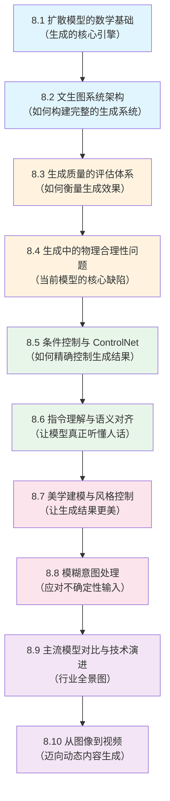

> **阅读建议**：蓝色部分（8.1-8.2）是核心基础，必须扎实掌握；橙色部分（8.3-8.4）建立质量意识；绿色部分（8.5-8.6）聚焦可控生成；粉色部分（8.7-8.8）关注用户体验；紫色部分（8.9-8.10）拓展视野。

---

## 8.1 扩散模型的数学基础

### 8.1.1 从直觉到数学：扩散模型在做什么？

想象你手中有一张清晰的照片。如果你不断地往上面撒沙子，照片会逐渐变得模糊，最终完全被沙子覆盖，看不出原来的内容。这个"撒沙子"的过程就是**前向扩散**（Forward Diffusion）。

现在反过来想：如果你能学会一种"去沙子"的技巧，从一堆随机的沙子中逐步还原出一张清晰的照片，那你就掌握了**图像生成**的能力。这个"去沙子"的过程就是**反向去噪**（Reverse Denoising）。

扩散模型（Diffusion Model）正是基于这个思想：先定义一个将数据逐步变为噪声的过程，再训练神经网络学习逆过程，从而实现从随机噪声生成数据。

### 8.1.2 前向扩散过程：数据如何变成噪声

前向扩散过程定义了一条从真实数据 $x_0$ 到纯高斯噪声（Gaussian Noise，一种服从正态分布的随机信号）$x_T$ 的马尔可夫链（Markov Chain，即每一步只依赖前一步的随机过程）。在每一步 $t$，我们向数据添加少量高斯噪声：

$$q(x_t | x_{t-1}) = \mathcal{N}(x_t; \sqrt{1-\beta_t} \, x_{t-1}, \, \beta_t I)$$

**符号解释**：
- $q(x_t | x_{t-1})$：给定上一步 $x_{t-1}$，当前步 $x_t$ 的条件概率分布
- $\mathcal{N}(\cdot; \mu, \sigma^2)$：均值为 $\mu$、方差为 $\sigma^2$ 的高斯分布
- $\beta_t$：第 $t$ 步的**噪声调度**（Noise Schedule），控制每步添加多少噪声，通常 $\beta_t \in [0.0001, 0.02]$
- $I$：单位矩阵，表示各维度独立加噪
- $t = 1, 2, ..., T$：扩散步数，典型值 $T = 1000$

直觉上，$\sqrt{1-\beta_t}$ 对原始信号做了轻微缩放（保留大部分信息），$\beta_t$ 控制新噪声的强度。经过 $T$ 步后，原始数据的信息被完全淹没在噪声中。

**任意步直接采样（重参数化技巧）**

在实际训练中，我们不需要逐步执行 $T$ 次加噪。通过数学推导，可以直接从 $x_0$ 一步跳到任意步 $x_t$：

$$x_t = \sqrt{\bar{\alpha}_t} \, x_0 + \sqrt{1-\bar{\alpha}_t} \, \epsilon, \quad \epsilon \sim \mathcal{N}(0, I)$$

其中定义了两个辅助变量：
- $\alpha_t = 1 - \beta_t$：每步的信号保留率
- $\bar{\alpha}_t = \prod_{s=1}^{t} \alpha_s$：从第 1 步到第 $t$ 步的累积信号保留率

当 $t$ 很大时，$\bar{\alpha}_t \to 0$，此时 $x_t \approx \epsilon$，即纯噪声。这个公式被称为**重参数化技巧**（Reparameterization Trick），它使得训练时可以随机采样任意时间步 $t$，大幅提高训练效率。

### 8.1.3 反向去噪过程：从噪声中恢复数据

前向过程将数据变为噪声，反向过程则要从噪声中恢复数据。我们训练一个神经网络 $\epsilon_\theta$（参数为 $\theta$）来预测每一步中添加的噪声。训练目标非常简洁：

$$\mathcal{L}_{simple} = \mathbb{E}_{x_0, \epsilon, t} \left[ \| \epsilon - \epsilon_\theta(x_t, t) \|^2 \right]$$

**符号解释**：
- $\mathbb{E}_{x_0, \epsilon, t}$：对训练数据 $x_0$、随机噪声 $\epsilon$ 和时间步 $t$ 取期望
- $\epsilon$：前向过程中实际添加的噪声（已知的真值）
- $\epsilon_\theta(x_t, t)$：神经网络根据带噪数据 $x_t$ 和时间步 $t$ 预测的噪声
- $\| \cdot \|^2$：均方误差，衡量预测噪声与真实噪声的差距

训练完成后，在生成阶段，我们从纯噪声 $x_T \sim \mathcal{N}(0, I)$ 出发，逐步去噪。DDPM（Denoising Diffusion Probabilistic Model，去噪扩散概率模型）的反向采样公式为：

$$x_{t-1} = \frac{1}{\sqrt{\alpha_t}} \left( x_t - \frac{1-\alpha_t}{\sqrt{1-\bar{\alpha}_t}} \epsilon_\theta(x_t, t) \right) + \sigma_t z$$

**符号解释**：
- $\frac{1}{\sqrt{\alpha_t}}$：信号缩放的逆操作，恢复信号幅度
- $\frac{1-\alpha_t}{\sqrt{1-\bar{\alpha}_t}} \epsilon_\theta(x_t, t)$：根据预测噪声计算需要去除的噪声分量
- $\sigma_t z$：随机性项，$z \sim \mathcal{N}(0, I)$，$\sigma_t$ 控制采样的随机程度
- 整个公式的含义：从当前带噪图像中减去预测的噪声，再加入少量随机扰动

### 8.1.4 扩散模型的完整流程图

下图展示了扩散模型的前向和反向过程的对称结构：

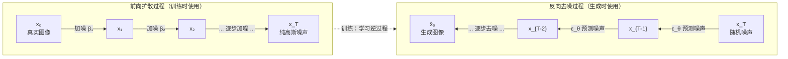

**训练与生成的关系**：
- **训练阶段**：随机选取时间步 $t$，用重参数化技巧直接得到 $x_t$，让网络预测噪声 $\epsilon$
- **生成阶段**：从 $x_T$ 出发，逐步执行反向采样公式，最终得到生成图像 $\hat{x}_0$

### 8.1.5 加速采样：从 DDPM 到 DDIM

DDPM 的一个显著缺点是采样速度慢——生成一张图像需要执行全部 $T$（通常为 1000）步去噪，每步都需要一次神经网络前向传播。DDIM（Denoising Diffusion Implicit Model，去噪扩散隐式模型）通过将随机采样改为确定性采样，实现了大幅加速。

| 对比维度 | DDPM | DDIM |
|---------|------|------|
| 采样方式 | 随机（含随机项 $z$） | 确定性（令 $\sigma = 0$） |
| 采样步数 | 必须执行全部 $T$ 步（约 1000 步） | 可跳步采样，仅需 20-50 步 |
| 生成质量 | 高 | 与 DDPM 相当 |
| 生成速度 | 慢 | 快 20-50 倍 |
| 可复现性 | 每次结果不同 | 相同噪声输入产生相同结果 |

DDIM 的核心思想是：去噪过程不必沿着马尔可夫链的每一步走，可以选择一个步数更少的子序列（如从 1000 步中均匀选取 50 步），直接在这些步之间跳跃。由于去除了随机项，给定相同的初始噪声，DDIM 总是生成相同的图像，这对于图像编辑和插值等应用非常有用。

### 8.1.6 Score-based 视角：另一种理解扩散模型的方式

扩散模型还有一种等价的数学解释——**Score-based 模型**（基于分数的模型）。这里的"分数"（Score）指的是数据分布对数概率的梯度：

$$\nabla_{x_t} \log p(x_t) \approx -\frac{\epsilon_\theta(x_t, t)}{\sqrt{1-\bar{\alpha}_t}}$$

**符号解释**：
- $\nabla_{x_t} \log p(x_t)$：数据分布 $p(x_t)$ 在 $x_t$ 处的**分数函数**（Score Function），指向数据密度增大最快的方向
- $\epsilon_\theta(x_t, t)$：噪声预测网络的输出
- 这个公式表明：预测噪声 $\epsilon_\theta$ 和预测分数 $\nabla \log p$ 是**等价的参数化方式**，只差一个缩放因子

这种视角的意义在于：去噪过程可以理解为沿着数据分布的梯度方向"爬坡"，从低概率区域（噪声）逐步移动到高概率区域（真实数据）。这为扩散模型提供了坚实的理论基础，也启发了后续的 Flow Matching 等新方法。

> **小结**：本节建立了扩散模型的数学框架——前向加噪、反向去噪、加速采样和 Score-based 视角。这些是理解后续所有内容的基石。接下来，我们将看到如何在这个框架上构建完整的文生图系统。

---

## 8.2 文生图系统架构：从文字到像素

掌握了扩散模型的数学原理后，一个自然的问题是：如何让模型根据文本描述生成图像？这需要解决三个核心问题——如何高效处理高分辨率图像、如何理解文本语义、如何将文本信息注入去噪过程。现代文生图系统（以 Stable Diffusion 为代表）通过三大组件协同工作来解决这些问题。

### 8.2.1 系统总览：三大核心组件

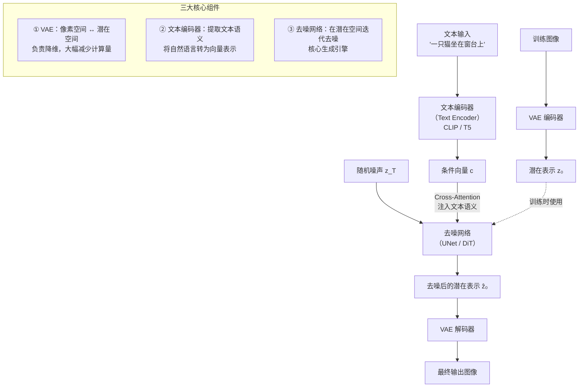

| 组件 | 功能 | 代表模型 |
|------|------|---------|
| **VAE**（Variational Autoencoder，变分自编码器） | 像素空间与潜在空间之间的转换，实现降维加速 | Stable Diffusion 的 KL-f8 VAE |
| **文本编码器**（Text Encoder） | 提取文本的语义特征，作为生成的条件信号 | CLIP ViT-L、T5-XXL |
| **去噪网络**（Denoising Network） | 在潜在空间中执行迭代去噪，是生成的核心引擎 | UNet（SD1.5/SDXL）、DiT（SD3/Sora） |

### 8.2.2 VAE：为什么不直接在像素空间去噪？

直接在像素空间（如 $512 \times 512 \times 3$ 的 RGB 图像）执行扩散过程，计算量极其庞大。VAE 的作用是将高维像素空间压缩到低维潜在空间（Latent Space），在潜在空间中完成去噪后再解码回像素空间。

**编码过程**：

$$z_0 = \mathcal{E}(x)$$

将 $H \times W \times 3$ 的图像压缩为 $\frac{H}{8} \times \frac{W}{8} \times 4$ 的潜在表示。例如，$512 \times 512 \times 3$ 的图像被压缩为 $64 \times 64 \times 4$。

**解码过程**：

$$\hat{x} = \mathcal{D}(z_0)$$

从潜在表示恢复为像素图像。

**计算量对比**：

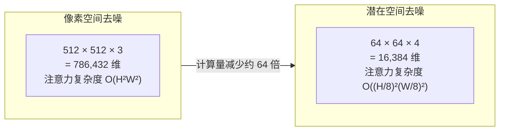

这就是 Stable Diffusion 被称为 LDM（Latent Diffusion Model，潜在扩散模型）的原因——扩散过程发生在潜在空间而非像素空间。

### 8.2.3 UNet 去噪网络：SD1.5/SDXL 的核心

UNet 是 Stable Diffusion 1.5 和 SDXL 中使用的去噪网络架构。它采用经典的编码器-解码器结构，配合跳跃连接（Skip Connection）保留多尺度信息。

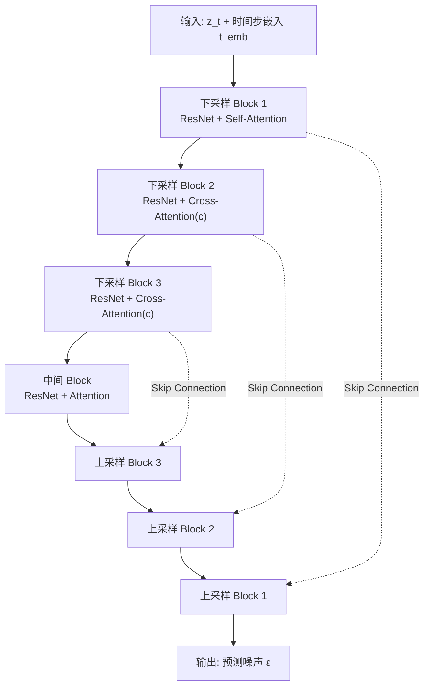

**文本条件如何注入？—— Cross-Attention 机制**

文本语义通过 Cross-Attention（交叉注意力）机制注入到去噪网络中。这是文生图系统中最关键的连接点：

$$\text{CrossAttn}(Q_z, K_c, V_c) = \text{softmax}\left(\frac{Q_z K_c^T}{\sqrt{d}}\right) V_c$$

**符号解释**：
- $Q_z$：Query（查询），来自图像潜在特征 $z$，代表"图像在问：我的每个位置应该生成什么？"
- $K_c, V_c$：Key 和 Value，来自文本特征 $c$，代表"文本在回答：你应该生成这些语义内容"
- $d$：特征维度，$\sqrt{d}$ 用于缩放防止点积过大
- 整个公式的含义：图像的每个空间位置根据与文本各 token 的相关性，加权聚合文本语义信息

### 8.2.4 DiT 去噪网络：SD3/Sora 的新架构

随着 Transformer 在各领域的成功，研究者开始用纯 Transformer 架构替代 UNet，这就是 DiT（Diffusion Transformer，扩散 Transformer）。SD3、Sora、Flux 等新一代模型都采用了 DiT 架构。

| 对比维度 | UNet | DiT |
|---------|------|-----|
| 基础结构 | 卷积 + 注意力混合 | 纯 Transformer |
| 归一化方式 | GroupNorm | LayerNorm + AdaLN |
| 条件注入方式 | Cross-Attention | AdaLN 调制 |
| 扩展性 | 受限于卷积结构 | 随参数量线性扩展，遵循 Scaling Law |
| 代表模型 | SD1.5、SDXL | SD3、Sora、Flux |

**AdaLN 条件注入**

DiT 使用 AdaLN（Adaptive Layer Normalization，自适应层归一化）替代 Cross-Attention 来注入条件信息：

$$\text{AdaLN}(h, c) = \gamma(c) \cdot \text{LayerNorm}(h) + \beta(c)$$

**符号解释**：
- $h$：Transformer 中间层的隐藏状态
- $c$：条件信息（文本特征 + 时间步嵌入）
- $\gamma(c), \beta(c)$：由条件 $c$ 通过 MLP（多层感知机）生成的缩放和偏移参数
- 含义：条件信息不再通过注意力机制注入，而是直接调制归一化层的参数，更加高效

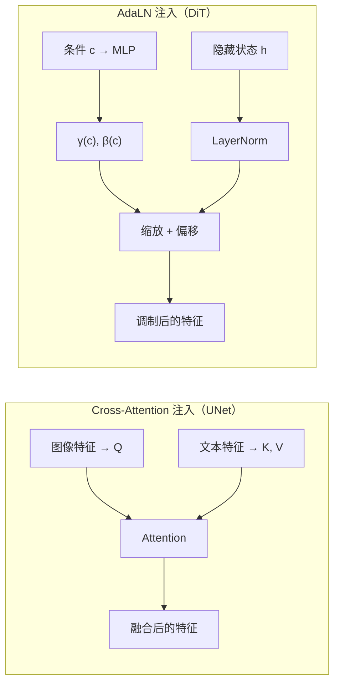

> **小结**：文生图系统通过 VAE 降维、文本编码器提取语义、去噪网络（UNet 或 DiT）在潜在空间迭代去噪来实现从文字到图像的生成。理解了系统如何工作，下一个问题自然是：如何评价生成结果的好坏？

---

## 8.3 生成质量的评估体系

有了生成系统，我们需要一套科学的评估方法来衡量生成质量。评估体系分为自动评估指标和人工评估两大类，二者互为补充。

### 8.3.1 自动评估指标总览

| 指标 | 衡量维度 | 核心原理 | 主要局限 |
|------|---------|---------|---------|
| **FID**（Frechet Inception Distance） | 生成分布与真实分布的整体距离 | 在 Inception 网络特征空间中计算两个分布的 Frechet 距离 | 不评估单张图像质量，需要大量样本做统计 |
| **CLIP Score** | 图文匹配度 | 计算图像和文本在 CLIP 特征空间中的余弦相似度 | 偏向语义匹配，忽略视觉质量 |
| **IS**（Inception Score） | 生成多样性和类别清晰度 | 衡量生成图像的类别分布是否清晰且多样 | 不评估条件匹配，不适用于文生图 |
| **Aesthetic Score** | 美学质量 | 基于 LAION Aesthetics 数据集训练的美学预测器 | 主观性强，不同文化审美差异大 |

### 8.3.2 FID 详解：衡量分布距离的黄金标准

FID 是目前最广泛使用的生成质量指标。它的核心思想是：将真实图像和生成图像分别通过预训练的 Inception 网络提取特征，然后比较两组特征的统计分布差异。

$$\text{FID} = \|\mu_r - \mu_g\|^2 + \text{Tr}\left(\Sigma_r + \Sigma_g - 2(\Sigma_r \Sigma_g)^{1/2}\right)$$

**符号解释**：
- $\mu_r, \Sigma_r$：真实图像特征的均值向量和协方差矩阵
- $\mu_g, \Sigma_g$：生成图像特征的均值向量和协方差矩阵
- $\|\mu_r - \mu_g\|^2$：两个分布中心的距离（均值差异）
- $\text{Tr}(\cdot)$：矩阵的迹（对角线元素之和），衡量协方差的差异
- FID 越低越好，$\text{FID} = 0$ 表示两个分布完全一致

### 8.3.3 CLIP Score 详解：衡量图文匹配度

CLIP Score 衡量生成图像与输入文本之间的语义匹配程度。CLIP（Contrastive Language-Image Pre-training，对比语言-图像预训练）是 OpenAI 提出的多模态模型，能将图像和文本映射到同一特征空间。

$$\text{CLIP-Score} = \frac{f_I(x) \cdot f_T(c)}{\|f_I(x)\| \cdot \|f_T(c)\|}$$

**符号解释**：
- $f_I(x)$：CLIP 图像编码器对生成图像 $x$ 的特征向量
- $f_T(c)$：CLIP 文本编码器对输入文本 $c$ 的特征向量
- 分子是两个向量的点积，分母是两个向量模长的乘积，整体即余弦相似度
- 分数越高，表示图像与文本的语义越匹配

### 8.3.4 人工评估与实践方案

自动指标无法完全替代人工判断。人工评估通常从以下维度展开：

| 评估维度 | 评估标准 |
|---------|---------|
| 文本对齐 | 生成图像是否准确反映文本描述的所有要素 |
| 视觉质量 | 清晰度、细节丰富度、是否存在伪影（Artifact） |
| 美学表现 | 构图、色彩搭配、整体风格 |
| 多样性 | 同一 prompt 多次生成的结果是否有足够差异 |

**实践中的分层评估方案**：

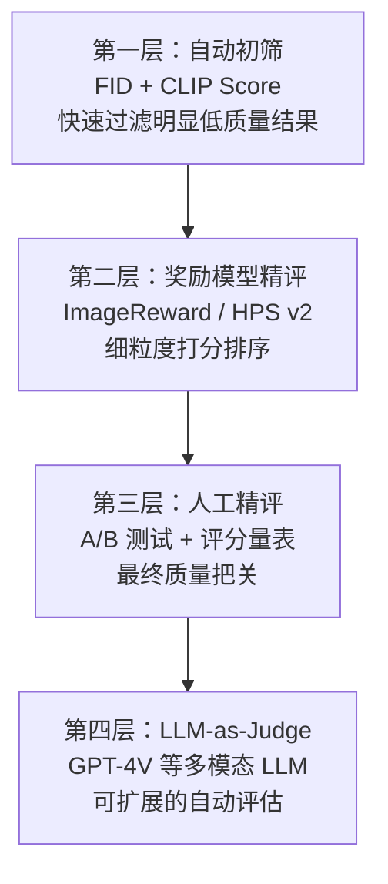

其中 ImageReward 和 HPS v2（Human Preference Score，人类偏好分数）是专门训练的奖励模型，能更好地对齐人类偏好。

> **小结**：评估体系让我们能够量化生成质量。在实际评估中，我们会发现当前模型存在一个突出问题——生成结果经常违反物理规律。这正是下一节要讨论的内容。

---

## 8.4 生成中的物理合理性问题

### 8.4.1 常见的物理不合理现象

尽管扩散模型能生成视觉上逼真的图像，但仔细观察会发现许多违反物理规律的问题：

| 问题类型 | 典型示例 |
|---------|---------|
| 空间关系错误 | 手指数量错误（六指）、肢体位置异常（手臂穿过身体） |
| 物理约束缺失 | 水往高处流、物体悬浮无支撑 |
| 光影不一致 | 同一场景中出现多个矛盾的光源、阴影方向与光源不匹配 |
| 透视错误 | 远近物体比例失调、平行线不收敛 |
| 交互不合理 | 物体接触面穿透、握持姿态不符合人体工学 |

### 8.4.2 根本原因分析

这些问题并非偶然，而是源于扩散模型的本质局限：

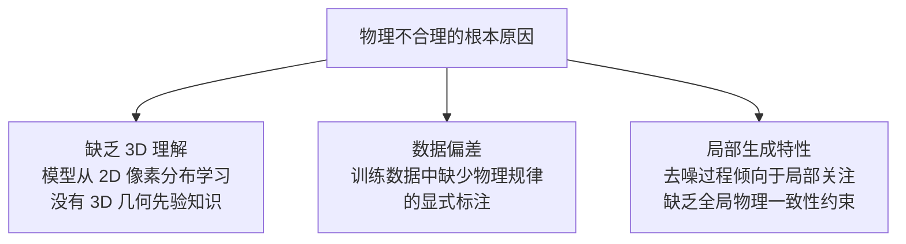

1. **缺乏 3D 理解**：扩散模型本质上是从 2D 图像的像素分布中学习统计规律，它没有内建的 3D 几何模型，无法理解深度、遮挡、透视等空间关系
2. **数据偏差**：训练数据（图文对）中没有显式的物理规律标注，模型只能从像素统计中隐式学习，容易遗漏低频但重要的物理约束
3. **局部生成**：去噪过程中，注意力机制的感受野有限，难以在全局范围内维持物理一致性

### 8.4.3 解决方案概览

| 方案 | 核心原理 | 效果 |
|------|---------|------|
| **ControlNet** | 注入结构化条件（深度图、边缘图、人体姿态） | 强约束空间结构，效果显著 |
| **3D 先验融合** | 用 3D 渲染数据训练或引入 3D 感知注意力 | 改善几何一致性 |
| **物理引导采样** | 在采样过程中加入物理约束的梯度引导 | 约束生成结果符合物理规律 |
| **多视角一致性** | 多视角联合生成 + 一致性损失函数 | 改善 3D 一致性 |
| **T2I 奖励模型** | 用视觉问答模型检测物理错误并过滤 | 后处理过滤不合理结果 |

其中 ControlNet 是目前最实用、最广泛使用的方案，我们将在下一节详细介绍。

> **过渡**：物理合理性问题的核心在于缺乏结构化约束。ControlNet 正是为解决这个问题而设计的——它允许我们向生成过程注入精确的结构化条件。

---

## 8.5 条件控制与 ControlNet

### 8.5.1 ControlNet 的设计思想

ControlNet 的核心思想非常优雅：**不修改原始预训练模型，而是添加一个可训练的"旁路"来注入结构化条件**。这样既保留了原始模型的生成能力，又获得了精确的结构控制。

其数学表达为：

$$y = \mathcal{F}_\theta(x; c) + \mathcal{Z}\left(\mathcal{G}_\phi(x; c_{struct})\right)$$

**符号解释**：
- $\mathcal{F}_\theta$：原始预训练 UNet（参数 $\theta$ 被冻结，不参与训练）
- $\mathcal{G}_\phi$：ControlNet 分支（原始 UNet 的可训练副本，参数 $\phi$ 从 $\theta$ 初始化）
- $c$：文本条件
- $c_{struct}$：结构化条件（如深度图、边缘图、人体姿态骨架等）
- $\mathcal{Z}$：**零卷积**（Zero Convolution），权重和偏置初始化为零的 $1 \times 1$ 卷积层
- $y$：最终输出，是原始模型输出与 ControlNet 分支输出的叠加

### 8.5.2 零卷积：安全训练的关键

零卷积是 ControlNet 设计中最精妙的部分。由于 $\mathcal{Z}$ 的权重初始化为零，训练开始时：

$$\mathcal{Z}(\mathcal{G}_\phi(x; c_{struct})) = 0$$

这意味着 ControlNet 分支在训练初期对原始模型的输出**没有任何影响**。随着训练进行，零卷积的权重逐渐从零增长，ControlNet 分支的贡献平滑地增加。这种设计避免了在训练初期因随机梯度破坏预训练模型已学到的知识。

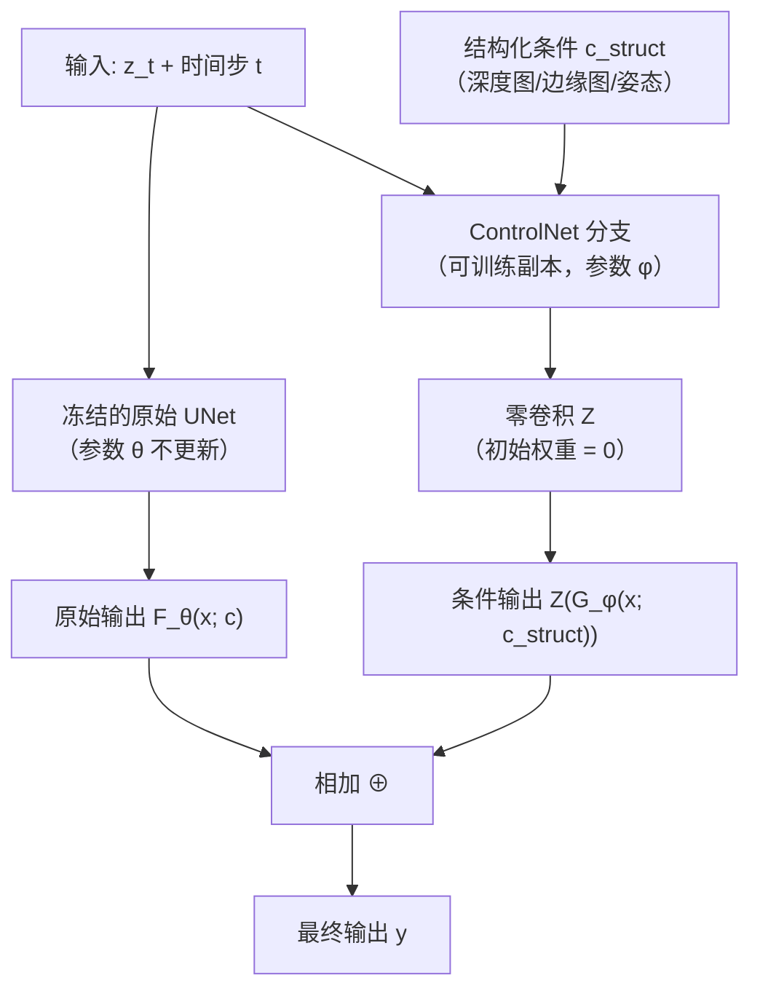

### 8.5.3 ControlNet 支持的条件类型

ControlNet 的通用性在于它可以接受多种结构化条件：

| 条件类型 | 输入形式 | 控制效果 |
|---------|---------|---------|
| Canny 边缘图 | 图像的边缘检测结果 | 控制物体轮廓和形状 |
| 深度图（Depth Map） | 场景的深度信息 | 控制空间布局和透视关系 |
| 人体姿态（OpenPose） | 人体关键点骨架 | 控制人物姿态和动作 |
| 语义分割图 | 像素级别的语义标签 | 控制场景中各区域的内容 |
| 法线图（Normal Map） | 表面法线方向 | 控制光照和表面细节 |

> **过渡**：ControlNet 解决了结构层面的控制问题，但还有一个更基础的挑战——模型能否真正理解用户的文本指令？接下来我们讨论指令理解与语义对齐问题。

---

## 8.6 指令理解与语义对齐

### 8.6.1 文本-图像对齐的核心挑战

即使有了强大的生成能力，如果模型不能准确理解用户的文本指令，生成结果也会令人失望。当前文生图模型在指令理解方面面临以下挑战：

| 挑战类型 | 示例 | 问题本质 |
|---------|------|---------|
| 属性绑定（Attribute Binding） | "红色的猫和蓝色的狗" → 颜色可能混淆 | 无法将属性正确绑定到对应对象 |
| 数量理解 | "3 个苹果" → 生成 2 个或 4 个 | 缺乏精确的计数能力 |
| 空间关系 | "猫在桌子上方" → 位置可能颠倒 | 空间介词的语义理解不足 |
| 复杂组合 | 多个对象 + 多个属性 + 多种关系 | 组合爆炸导致理解困难 |

### 8.6.2 常见的指令理解错误

| 错误类型 | 输入示例 | 实际生成结果 |
|---------|---------|------------|
| 属性混淆 | "红猫蓝狗" | 红狗蓝猫（属性交换） |
| 数量错误 | "3 只猫" | 2 只或 4 只 |
| 否定失败 | "没有树的草地" | 仍然生成了树 |
| 忽略细节 | "赛博朋克风格的猫" | 生成普通风格的猫 |
| 顺序错误 | "猫追狗" | 狗追猫（主客体颠倒） |

### 8.6.3 优化策略

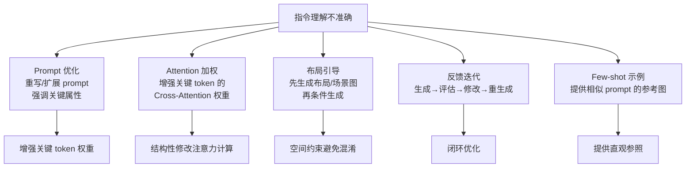

**结构化 Prompt 技术**

将自然语言 prompt 转化为结构化表示，可以精确控制每个属性的绑定：

```
原始 prompt: "一只红色的猫坐在蓝色的沙发上"

结构化表示:
  objects:    [猫, 沙发]
  attributes: {猫: 红色, 沙发: 蓝色}
  relations:  [猫 -坐在→ 沙发]
```

结构化表示使得每个属性与其所属对象之间的绑定关系变得明确，避免了自然语言中的歧义。

### 8.6.4 多模态理解对 AIGC 的赋能

多模态理解模型（VLM，Vision-Language Model，视觉-语言模型）为 AIGC 提供了**语义层面的约束和引导**，弥合文本指令与视觉内容之间的语义鸿沟。

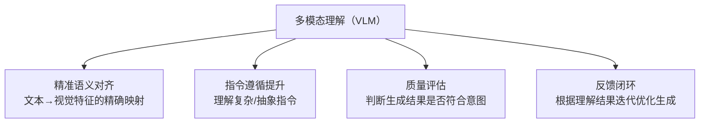

**VLM 在文生图中的具体应用**：

| 应用方向 | 实现方式 | 具体示例 |
|---------|---------|---------|
| 文本编码增强 | 用 VLM 替代或增强 CLIP 做文本编码 | SD3 使用 T5 + CLIP 双编码器 |
| 布局规划 | VLM 先理解指令生成布局，再引导生成 | LLM 生成场景图 → 条件生成 |
| 生成后验证 | VLM 检查生成结果是否符合指令 | 文本"3 只猫" → 检查是否真有 3 只 |
| 迭代优化 | VLM 评估 → 反馈 → 重新生成 | ImageReward、HPS v2 |

### 8.6.5 改进方向

1. **更强大的文本编码器**：用 T5-XXL、CLIP-big 等大模型替代 CLIP-ViT-L，提升文本理解深度
2. **细粒度对齐训练**：用高质量的（文本, 图像）配对数据做对比学习，强化属性绑定
3. **布局条件注入**：先由 LLM 生成空间布局，再作为空间条件引导生成
4. **奖励模型引导**：用对齐奖励模型做 RLHF（Reinforcement Learning from Human Feedback，基于人类反馈的强化学习）或采样引导

> **过渡**：解决了"听懂人话"的问题后，我们还希望生成的图像不仅准确，而且美观。这就引出了美学建模的话题。

---

## 8.7 美学建模与风格控制

### 8.7.1 什么是"美感"？如何量化？

"美感"看似主观，但可以通过大规模人工标注数据来建模。基于 LAION Aesthetics 数据集（包含大量人工标注 1-10 分美学评分的图像），可以训练一个美学评分模型：

$$\text{AestheticScore}(x) = \text{MLP}\left(\text{CLIP}_I(x)\right)$$

**符号解释**：
- $x$：输入图像
- $\text{CLIP}_I(x)$：CLIP 图像编码器提取的特征向量
- $\text{MLP}$：多层感知机回归头，将 CLIP 特征映射为一个标量分数
- 输出：1-10 的美学评分

这个模型的设计思路是：CLIP 已经学到了丰富的视觉语义特征，在此基础上训练一个轻量级的 MLP 来预测美学分数，既高效又有效。

### 8.7.2 影响美感的关键因素

| 因素 | 具体说明 |
|------|---------|
| 构图 | 三分法则、对称构图、引导线等经典构图法则 |
| 色彩 | 色彩和谐度、对比度、饱和度的平衡 |
| 光影 | 明暗对比的层次感、氛围感的营造 |
| 细节 | 纹理的丰富度、画面的清晰度 |
| 风格 | 艺术风格的一致性和表现力 |

### 8.7.3 美学引导生成

在采样过程中，可以加入美学评分模型的梯度来引导生成方向，使结果更美观：

$$\hat{x}_{t-1} = x_{t-1} + \lambda \nabla_{x_{t-1}} S_{aesthetic}(\hat{x}_0)$$

**符号解释**：
- $x_{t-1}$：原始去噪采样得到的结果
- $S_{aesthetic}(\hat{x}_0)$：对当前预测的最终图像 $\hat{x}_0$ 的美学评分
- $\nabla_{x_{t-1}} S_{aesthetic}$：美学评分对 $x_{t-1}$ 的梯度，指向美学分数增大的方向
- $\lambda$：引导强度，控制美学引导的力度（过大会牺牲内容准确性）
- $\hat{x}_{t-1}$：经过美学引导后的采样结果

### 8.7.4 风格迁移技术

除了整体美感，用户往往还希望控制生成图像的具体风格。以下是主流的风格控制方法：

| 方法 | 核心原理 | 适用场景 |
|------|---------|---------|
| **IP-Adapter** | 将参考图像的风格特征通过独立的注意力层注入生成过程 | 需要参考图风格的场景 |
| **StyleGAN 反转** | 在 StyleGAN 的潜空间中找到风格方向并操控 | 人脸风格编辑 |
| **LoRA 风格微调** | 用特定风格的数据集微调 LoRA（Low-Rank Adaptation，低秩适配）模块 | 固定风格的批量生成 |
| **参考图 ControlNet** | 用参考图的风格特征作为 ControlNet 的条件输入 | 需要精确风格控制的场景 |

> **过渡**：美学建模解决了"生成得更美"的问题。但在实际应用中，用户的输入往往是模糊的、不完整的。如何处理这种不确定性？

---

## 8.8 模糊意图处理

### 8.8.1 问题定义

在实际应用中，用户的 prompt 经常是模糊的、有歧义的或信息不足的。例如"画一只猫"——什么品种？什么姿态？什么风格？什么背景？这些信息的缺失会导致生成结果不可控。

### 8.8.2 处理策略

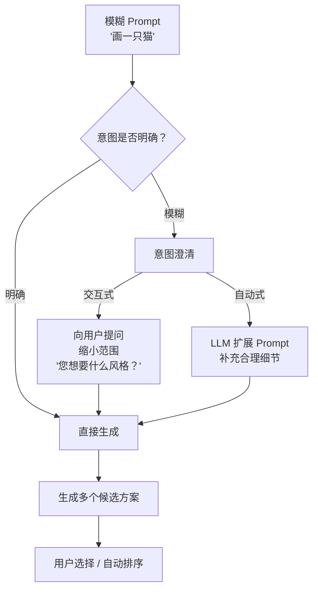

| 策略 | 方法 | 优点 | 缺点 |
|------|------|------|------|
| **交互式澄清** | Agent 主动追问用户 | 精准理解用户意图 | 增加交互轮次，影响体验 |
| **Prompt 扩展** | LLM 自动补充细节 | 无需用户额外参与 | 可能偏离用户真实意图 |
| **多候选生成** | 一次生成多个版本供选择 | 覆盖多种可能的理解 | 计算成本高 |
| **渐进式细化** | 先粗略生成，再逐步修改 | 过程可控 | 需要多轮交互 |

### 8.8.3 Prompt 扩展示例

```
用户输入: "画一只猫"

LLM 自动扩展: "一只毛茸茸的橘猫，坐在阳光洒落的窗台上，
              背景是模糊的花园，温暖的光线，写实风格，
              高细节，8K"
```

扩展的原则是：补充合理的默认值（品种、姿态、场景、光线、风格、画质），同时不与用户的原始意图冲突。

> **过渡**：到目前为止，我们已经深入了解了文生图系统的各个方面。接下来，让我们站在更高的视角，纵览当前主流模型的技术演进和对比。

---

## 8.9 主流模型对比与技术演进

### 8.9.1 文生图模型全景

| 模型 | 去噪架构 | 文本编码器 | 核心特点 |
|------|---------|-----------|---------|
| **SD 1.5** | UNet + VAE | CLIP-ViT-L | 开源生态最丰富，社区模型最多 |
| **SDXL** | UNet + VAE | CLIP-ViT-L + CLIP-ViT-G | 更高分辨率（1024²），双文本编码器 |
| **SD3** | DiT + VAE | CLIP-ViT-L + CLIP-ViT-G + T5-XXL | 三编码器，采用 Flow Matching |
| **Flux** | DiT (MMDiT) + VAE | T5-XXL + CLIP | 极高质量，开源最强 |
| **DALL-E 3** | 未公开 | 未公开 | 与 ChatGPT 深度集成，指令遵循能力强 |
| **Midjourney** | 未公开 | 未公开 | 美学质量最高，闭源商业产品 |

### 8.9.2 技术演进路线

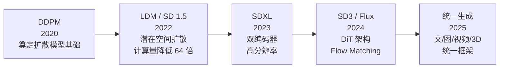

这条演进路线体现了几个清晰的趋势：
- **架构**：从 UNet 到 DiT（纯 Transformer），拥抱 Scaling Law
- **文本理解**：从单编码器到多编码器，文本理解能力持续增强
- **训练范式**：从 DDPM 到 Flow Matching，训练效率和生成质量同步提升
- **生成范围**：从单一图像到图像/视频/3D 的统一生成

### 8.9.3 Flow Matching：新一代训练范式

SD3 和 Flux 采用了 Flow Matching（流匹配）替代传统的 DDPM 训练范式。Flow Matching 的核心思想是学习一个**向量场**（Vector Field），将噪声分布连续地映射到数据分布：

$$\frac{dx_t}{dt} = v_\theta(x_t, t)$$

**符号解释**：
- $x_t$：时间 $t$ 处的数据状态（$t=0$ 为噪声，$t=1$ 为数据）
- $v_\theta(x_t, t)$：神经网络参数化的向量场，指示 $x_t$ 应该如何"流动"
- 整个方程描述了一条从噪声到数据的连续路径

**训练目标**：

$$\mathcal{L}_{FM} = \mathbb{E}_{t, x_0, \epsilon} \left[ \| v_\theta(x_t, t) - (x_0 - \epsilon) \|^2 \right]$$

**符号解释**：
- $v_\theta(x_t, t)$：网络预测的向量场
- $(x_0 - \epsilon)$：从噪声 $\epsilon$ 到数据 $x_0$ 的真实方向
- 训练目标是让网络预测的流动方向尽可能接近真实方向

**Flow Matching vs DDPM 对比**：

| 对比维度 | DDPM | Flow Matching |
|---------|------|--------------|
| 前向过程 | 离散马尔可夫链（逐步加噪） | 连续流（平滑插值） |
| 采样方式 | 需要预定义噪声调度 $\beta_t$ | 更灵活的采样路径 |
| 训练目标 | 预测噪声 $\epsilon$ | 预测向量场 $v$ |
| 收敛速度 | 需要大量步数 | 更少步数即可收敛 |

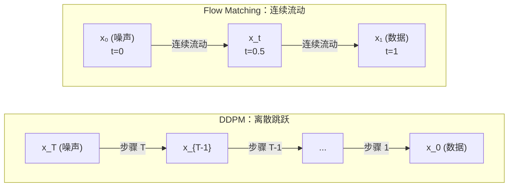

> **过渡**：了解了图像生成的全貌后，最后一个重要话题是：如何从静态图像迈向动态视频？

---

## 8.10 从图像到视频：迈向动态内容生成

从文生图到视频生成，是 AIGC 领域最激动人心的前沿方向。本节按照复杂度递进的顺序，依次介绍图生图、Inpainting、图生视频三种技术。

### 8.10.1 图生图（Image-to-Image）

图生图是文生图的自然延伸：以一张输入图像为起点，在潜在空间中从**中间步骤**（而非纯噪声）开始去噪，从而在保留原图结构的同时进行风格或内容的变换。

$$z_t = \sqrt{\bar{\alpha}_t} \, z_0 + \sqrt{1-\bar{\alpha}_t} \, \epsilon$$

其中 $z_0$ 是输入图像的潜在表示，$t$ 控制变化程度：
- $t$ 较小（如 0.3-0.5）：保留更多原图结构，变化较小
- $t$ 较大（如 0.7-0.9）：更自由的变化，原图信息保留较少


### 8.10.2 Inpainting：局部编辑

Inpainting（图像修复/局部重绘）在图生图的基础上引入了 mask（掩码），只对 mask 覆盖的区域进行去噪生成，其余区域保留原图不变：

$$z_{out} = m \odot z_{gen} + (1-m) \odot z_{orig}$$

**符号解释**：
- $m$：二值掩码，1 表示需要重新生成的区域，0 表示保留原图的区域
- $\odot$：逐元素乘法
- $z_{gen}$：去噪网络生成的潜在表示
- $z_{orig}$：原始图像的潜在表示
- 最终结果是两部分的拼合：mask 区域用生成结果，非 mask 区域用原图

### 8.10.3 图生视频：从静态到动态

图生视频（Image-to-Video）是将一张静态图像"动起来"的技术。其核心挑战在于：不仅要生成视觉上逼真的每一帧，还要保证帧与帧之间的时序一致性。

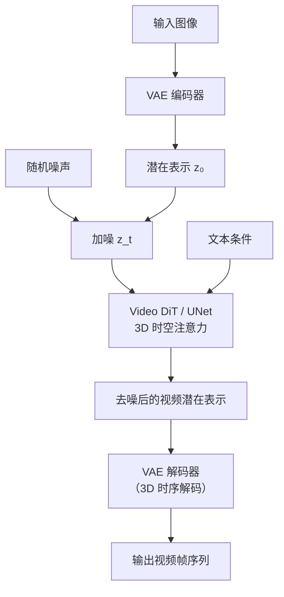

与图像生成的关键区别在于去噪网络需要处理**时间维度**：不仅要在空间维度（H, W）上去噪，还要在时间维度（T）上保持一致性。

### 8.10.4 视频生成的核心技术

| 技术 | 作用 | 代表模型 |
|------|------|---------|
| **3D 时空注意力** | 在时间维度上建模帧间关系，保持视觉一致性 | SVD（Stable Video Diffusion）、Sora |
| **时序自回归** | 逐帧或逐段生成，前帧作为后帧的条件 | Sora、Kling |
| **运动模块** | 在 UNet 中插入专门的时序注意力层 | AnimateDiff |
| **光流引导** | 用光流（Optical Flow，描述像素运动的向量场）约束帧间运动 | FlowVid |

### 8.10.5 视频生成的核心挑战

| 挑战 | 具体描述 |
|------|---------|
| 时序一致性 | 帧与帧之间的视觉连贯性（避免闪烁、形变） |
| 运动合理性 | 物体运动轨迹需要符合物理规律 |
| 长视频生成 | 超长视频中累积误差会导致质量退化 |
| 计算成本 | 视频数据量远大于图像，计算和存储需求急剧增长 |

### 8.10.6 Sora 架构解析

Sora 是 OpenAI 推出的视频生成模型，代表了当前视频生成的最高水平。虽然其完整架构未公开，但基于技术报告可以推测其核心设计：

| 组件 | 推测方案 | 设计意图 |
|------|---------|---------|
| 视频编码 | 时空 Patch 化（Spacetime Patch） | 统一处理不同分辨率和时长的视频 |
| 去噪网络 | DiT（与 SD3 同架构族） | 利用 Transformer 的扩展性 |
| 条件注入 | 文本条件 + 首帧条件 | 支持文生视频和图生视频 |
| 训练数据 | 大规模视频-文本配对数据 | 学习丰富的运动和场景知识 |
| 关键创新 | 统一的视频/图像表示 | 图像视为单帧视频，统一训练 |

**Spacetime Patch（时空分块）**

Sora 的核心创新之一是将视频统一表示为时空 Patch。将视频切分为：

$$(T/P_t) \times (H/P_h) \times (W/P_w) \text{ 个时空 Patch}$$

其中 $P_t, P_h, P_w$ 分别是时间、高度、宽度方向的 Patch 大小。这类似于 ViT（Vision Transformer）将图像切分为 2D Patch 的做法，但扩展到了时间维度。

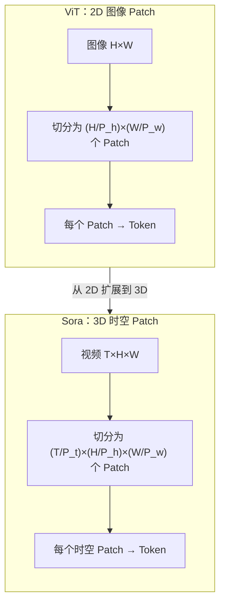

这种统一表示的优势在于：
- 图像可以视为 $T=1$ 的特殊视频，实现图像和视频的统一训练
- 不同分辨率和时长的视频都可以表示为不同数量的 Patch 序列
- 充分利用 Transformer 处理变长序列的能力

---

## 本章总结

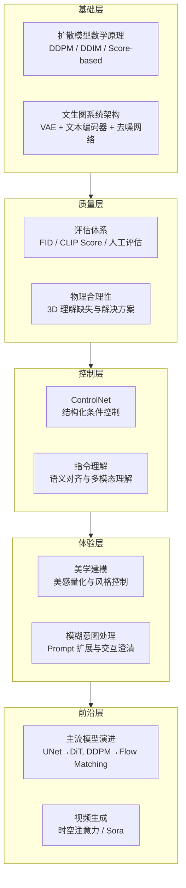

本章从扩散模型的数学基础出发，系统地介绍了现代视觉内容生成技术的完整体系。核心要点回顾：

1. **扩散模型**是当前视觉生成的基础引擎，通过前向加噪和反向去噪实现从噪声到数据的生成
2. **文生图系统**由 VAE（降维）、文本编码器（语义提取）、去噪网络（生成引擎）三大组件构成
3. **评估体系**结合自动指标（FID、CLIP Score）和人工评估，多维度衡量生成质量
4. **ControlNet** 通过零卷积和冻结-旁路设计，实现了对生成过程的精确结构控制
5. **指令理解**是当前模型的薄弱环节，需要更强的文本编码器和多模态理解能力
6. **美学建模**将主观的"美感"量化为可优化的目标，引导生成更美观的结果
7. **技术演进**从 UNet 到 DiT、从 DDPM 到 Flow Matching，持续追求更好的扩展性和效率
8. **视频生成**通过时空注意力和统一的 Patch 表示，将图像生成能力扩展到动态内容
