# 九、Infra 面试真题

## 1. 大模型训练加速总览

### 加速维度

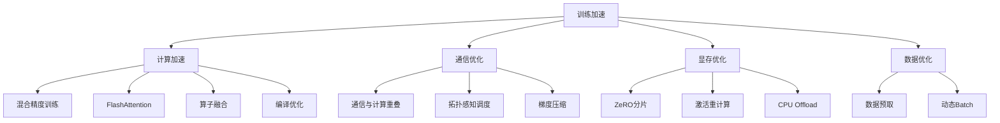

### 各维度加速效果

| 优化手段 | 加速比 | 显存节省 | 实现难度 |
|---------|--------|---------|---------|
| BF16 混合精度 | 2-3x | ~50% | 低 |
| FlashAttention | 2-3x | O(n²)→O(1) | 低（调用库） |
| ZeRO-3 | 1x（可能略慢） | ~1/G | 中 |
| 激活重计算 | 1x（略慢） | 30-60% | 低 |
| 3D 并行 | 近线性扩展 | 分摊 | 高 |
| 编译优化（torch.compile） | 1.2-2x | 无 | 低 |

---

## 2. DeepSpeed 详解

### ZeRO 三个阶段

| 阶段 | 分片对象 | 每卡显存 | 通信量 vs DP |
|------|---------|---------|-------------|
| ZeRO-1 | 优化器状态 | $2N + 2N + \frac{12N}{G}$ | 1x |
| ZeRO-2 | +梯度 | $2N + 2N + \frac{6N}{G}$ | 1x |
| ZeRO-3 | +参数 | $\frac{16N}{G}$ | 1.5x |

$N$ = 参数量，$G$ = GPU 数。以 70B 模型 FP16 为例：

| 阶段 | 单卡显存（64卡） | 说明 |
|------|----------------|------|
| 无优化 | ~1120 GB | 不可行 |
| ZeRO-1 | ~153 GB | 仍需多卡 |
| ZeRO-2 | ~85 GB | 仍需多卡 |
| ZeRO-3 | ~17.5 GB | 单卡理论可行 |

### ZeRO-3 通信流程

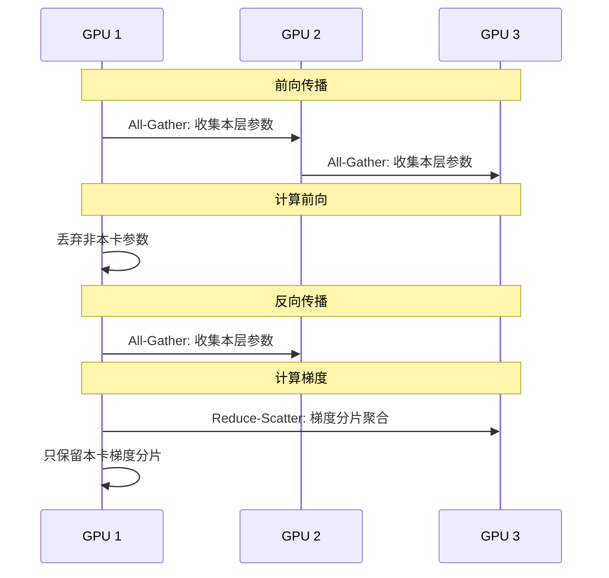

### Offload 机制

将优化器状态/参数/梯度卸载到 CPU 内存或 NVMe 磁盘：

| Offload 模式 | 卸载对象 | 显存节省 | 代价 |
|-------------|---------|---------|------|
| Optimizer Offload | 优化器状态→CPU | 大 | CPU↔GPU 传输延迟 |
| Param Offload | 参数→CPU | 极大 | 每步需搬运参数 |
| NVMe Offload | 优化器状态→磁盘 | 极大 | IO 瓶颈严重 |

**实践建议**：优先用 ZeRO-3 + Optimizer Offload，NVMe Offload 仅在极端显存不足时使用。

### DeepSpeed 训练配置关键参数

| 参数 | 推荐值 | 说明 |
|------|--------|------|
| zero_stage | 2 或 3 | 2 通信少，3 显存省 |
| offload_optimizer | true（显存不足时） | CPU Offload 优化器 |
| gradient_accumulation_steps | 按需 | 模拟大 batch |
| gradient_clipping | 1.0 | 防梯度爆炸 |
| bf16.enabled | true | BF16 混合精度 |

---

## 3. 多机多卡分布式训练

### 并行策略选择

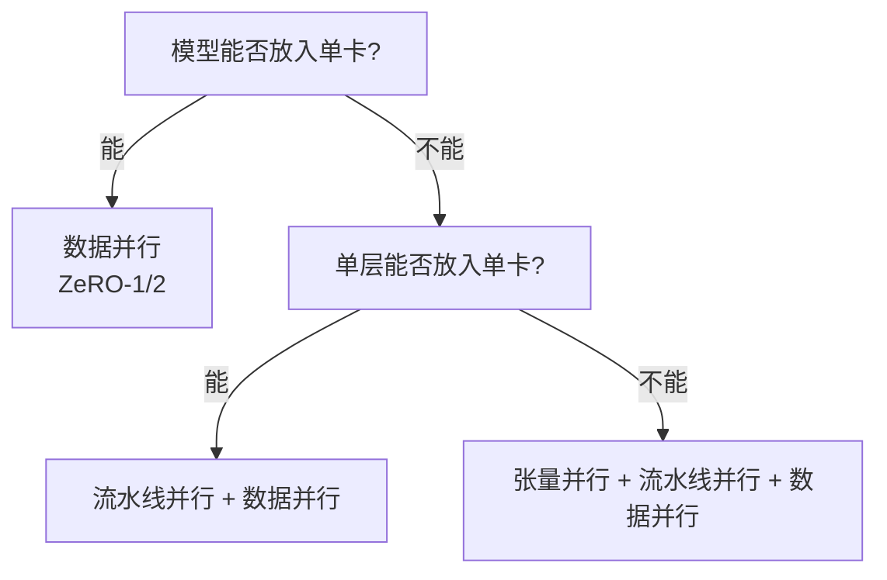

### DDP（DistributedDataParallel）

PyTorch 原生数据并行，每卡完整模型副本，梯度 AllReduce 同步。

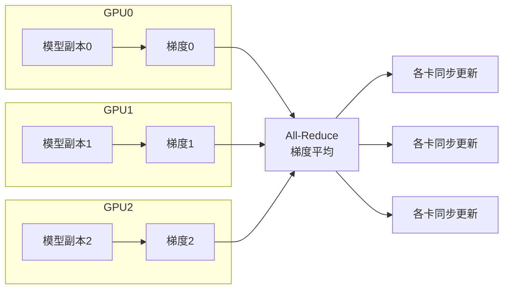

**DDP vs FSDP**：

| | DDP | FSDP |
|---|---|---|
| 模型状态 | 每卡完整副本 | 分片存储 |
| 显存 | 与卡数无关 | 近似 1/G |
| 通信 | AllReduce 梯度 | All-Gather + Reduce-Scatter |
| 适用 | 模型能放入单卡 | 大模型必须 |

### Ring AllReduce

梯度同步的核心算法，分两阶段：

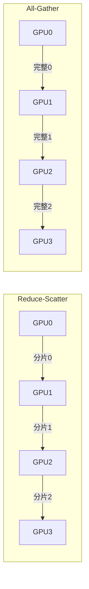

通信量：$2 \times \frac{N}{G} \times (G-1)$，每卡通信量与 GPU 数无关，带宽利用率高。

### NCCL 通信后端

| 集合通信 | 用途 | 通信量 |
|---------|------|--------|
| All-Reduce | DDP 梯度同步 | $2N \cdot \frac{G-1}{G}$ |
| All-Gather | FSDP 参数收集 | $N \cdot \frac{G-1}{G}$ |
| Reduce-Scatter | FSDP 梯度分片 | $N \cdot \frac{G-1}{G}$ |
| All-to-All | MoE 专家路由 | $N \cdot \frac{G-1}{G}$ |

---

## 4. 提高训练效率

### 算力利用率（MFU/HFU）

| 指标 | 定义 | 说明 |
|------|------|------|
| **MFU** (Model FLOPs Utilization) | 实际 FLOPs / 理论峰值 FLOPs | 不含重计算，反映真实计算效率 |
| **HFU** (Hardware FLOPs Utilization) | 含重计算的 FLOPs / 峰值 | 含重计算开销 |

GPT-3 175B 训练 MFU 约 40-50%，理想目标 >50%。

### 提高吞吐的关键手段

| 手段 | 原理 | 效果 |
|------|------|------|
| 增大 Global Batch Size | 更好的 GPU 利用率 | 吞吐提升，但有收敛上限 |
| 梯度累加 | 小 micro-batch 累积模拟大 batch | 显存友好，不增加通信 |
| 数据预取 | GPU 计算时 CPU 准备下一批数据 | 减少 IO 等待 |
| 编译优化 | torch.compile 融合算子 | 1.2-2x 加速 |
| 通信重叠 | 计算与通信并行执行 | 隐藏通信延迟 |

### Checkpoint 策略

| 策略 | 方法 | 权衡 |
|------|------|------|
| 固定步数 | 每 N 步保存 | 简单但可能浪费或不够 |
| 自适应 | 根据验证 loss 保存 | 更智能但需额外计算 |
| 异步保存 | 后台线程保存，不阻塞训练 | 需要额外内存 |

---

## 5. 收敛速度优化

### 学习率调度

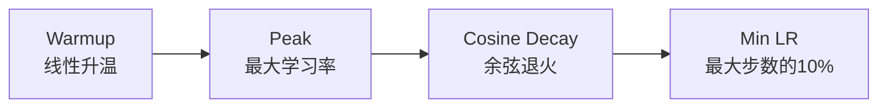

$$\eta_t = \begin{cases} \eta_{max} \cdot \frac{t}{T_{warmup}} & t \leq T_{warmup} \\ \eta_{min} + \frac{1}{2}(\eta_{max} - \eta_{min})(1 + \cos(\frac{t - T_{warmup}}{T_{total} - T_{warmup}} \pi)) & t > T_{warmup} \end{cases}$$

### 关键超参数对收敛的影响

| 参数 | 过小 | 过大 |
|------|------|------|
| 学习率 | 收敛慢，可能陷入局部最优 | Loss 震荡，不收敛 |
| Batch Size | 梯度噪声大，收敛慢 | 泛化差（generalization gap） |
| Warmup 步数 | 初始梯度爆炸 | 浪费训练步数 |
| Weight Decay | 过拟合 | 欠拟合 |

### 收敛加速技巧

| 技巧 | 原理 | 适用场景 |
|------|------|---------|
| **Warmup** | 初始阶段用小学习率，防止随机初始化导致的梯度爆炸 | 所有 LLM 训练 |
| **梯度裁剪** | $\|\nabla\| > \theta$ 时缩放梯度 | 防止梯度爆炸 |
| **Cosine Decay** | 平滑降低学习率 | 预训练 |
| **增大 Batch Size** | 减少梯度噪声，更稳定更新 | 算力充足时 |
| **数据质量** | 去重、过滤低质量数据 | 所有训练 |
| **课程学习** | 先简单后困难的数据顺序 | SFT 阶段 |

### 梯度裁剪

$$\nabla' = \begin{cases} \nabla & \|\nabla\| \leq \theta \\ \frac{\theta}{\|\nabla\|} \nabla & \|\nabla\| > \theta \end{cases}$$

LLM 训练中 $\theta$ 通常设为 1.0。

---

## 6. 多机多卡通信问题

### 通信瓶颈

| 瓶颈 | 原因 | 影响 |
|------|------|------|
| 带宽不足 | 节点间网络带宽有限 | AllReduce/All-Gather 慢 |
| 延迟高 | 跨节点通信跳数多 | 小消息通信效率低 |
| 通信占比大 | 模型大→梯度大→通信量大 | GPU 空闲等待 |
| 通信不均衡 | 不同节点负载不同 | 短板效应 |

### 互联拓扑

| 互联方式 | 带宽 | 延迟 | 适用 |
|---------|------|------|------|
| NVLink | 600 GB/s (双向) | 极低 | 同节点内 GPU |
| NVSwitch | 同 NVLink | 极低 | 同节点多 GPU |
| InfiniBand | 200-400 Gb/s | 低 | 跨节点 |
| RoCE | 100-200 Gb/s | 中 | 跨节点（性价比） |
| TCP/IP | 10-25 Gb/s | 高 | 不推荐 |

### 通信优化策略

| 策略 | 原理 | 效果 |
|------|------|------|
| **通信与计算重叠** | 计算一层梯度时同步上一层梯度 | 隐藏通信延迟 |
| **拓扑感知调度** | 通信密集的并行放在同节点内 | 减少跨节点通信 |
| **梯度压缩** | 量化/稀疏化梯度再通信 | 减少通信量 |
| **环形通信** | Ring AllReduce 替代树形 | 带宽利用率高 |
| **张量并行限节点内** | TP 通信量大，限制在 NVLink 内 | 避免跨节点 TP |

### 通信与计算重叠

```mermaid
gantt
    title 通信与计算重叠
    dateFormat X
    axisFormat %s
    
    section 无重叠
    计算层1 :a1, 0, 3
    通信梯度1 :a2, 3, 5
    计算层2 :a3, 5, 8
    通信梯度2 :a4, 8, 10
    
    section 有重叠
    计算层1 :b1, 0, 3
    通信梯度1 :b2, 2, 4
    计算层2 :b3, 3, 6
    通信梯度2 :b4, 5, 7
```

---

## 7. 梯度累加原理

### 核心思想

将大 batch 拆分为多个 micro-batch，前向/反向逐个计算，梯度累加后再更新参数，等效于大 batch 训练。

### 流程

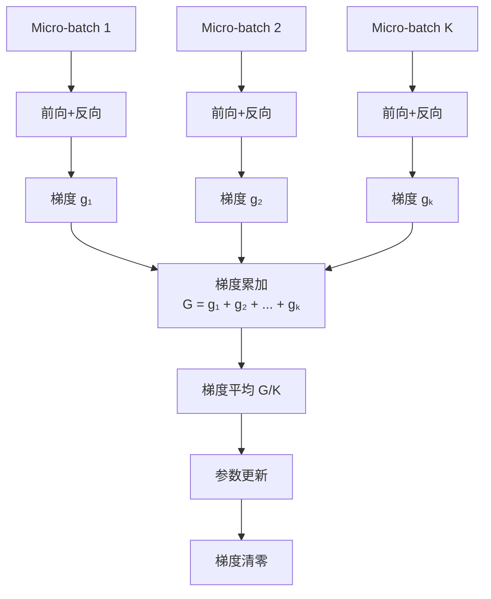

### 数学等价性

设 global batch size = $B$，micro batch size = $b$，累加步数 $K = B/b$：

$$\nabla_{accum} = \frac{1}{K} \sum_{k=1}^{K} \nabla_k \approx \frac{1}{B} \sum_{i=1}^{B} \nabla_i = \nabla_{full\_batch}$$

**关键**：累加后必须除以 $K$ 做平均，否则梯度被放大 $K$ 倍。

### 显存分析

| | 直接大 Batch | 梯度累加 |
|---|---|---|
| 激活值显存 | $O(B)$ | $O(b)$，$b \ll B$ |
| 梯度显存 | $O(1)$ | $O(1)$（累加到同一缓冲区） |
| 优化器步数 | 每 B 样本1步 | 每 B 样本1步 |
| 训练速度 | 快（并行度高） | 略慢（串行 micro-batch） |

### 注意事项

1. **BN 行为差异**：梯度累加时每个 micro-batch 独立计算 BN 统计量，与大 batch 的统计量不同。LLM 用 LN/RMSNorm 无此问题。
2. **学习率缩放**：通常不需要随累加步数缩放学习率（已做梯度平均）。
3. **Dropout 一致性**：每个 micro-batch 独立 dropout，与大 batch 等价。

---

## 8. GPU 训练/推理性能优化

### 训练优化

| 优化 | 原理 | 效果 |
|------|------|------|
| **混合精度（BF16）** | 前向 BF16，梯度/优化器 FP32 | 2x 速度，50% 显存 |
| **FlashAttention** | SRAM 内计算注意力，减少 HBM 读写 | 2-3x 加速 |
| **算子融合** | 将多个小算子合并为一个大 kernel | 减少 kernel launch 开销 |
| **torch.compile** | JIT 编译优化计算图 | 1.2-2x 加速 |
| **激活重计算** | 不存中间激活，反向时重算 | 30-60% 显存节省 |

### 推理优化

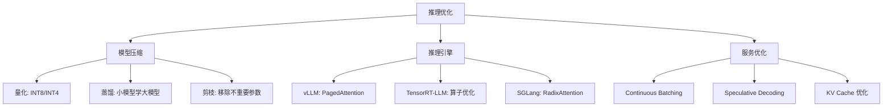

### 推理引擎对比

| 引擎 | 核心优化 | 适用场景 |
|------|---------|---------|
| **vLLM** | PagedAttention + Continuous Batching | 高并发在线服务 |
| **TensorRT-LLM** | 算子融合 + Kernel 优化 + 量化 | NVIDIA GPU 极致性能 |
| **SGLang** | RadixAttention（前缀缓存） | 多请求共享前缀 |
| **llama.cpp** | GGUF 量化 + CPU 推理 | 消费级硬件/边缘部署 |

### Speculative Decoding（投机解码）

用小模型快速生成候选 token，大模型并行验证：

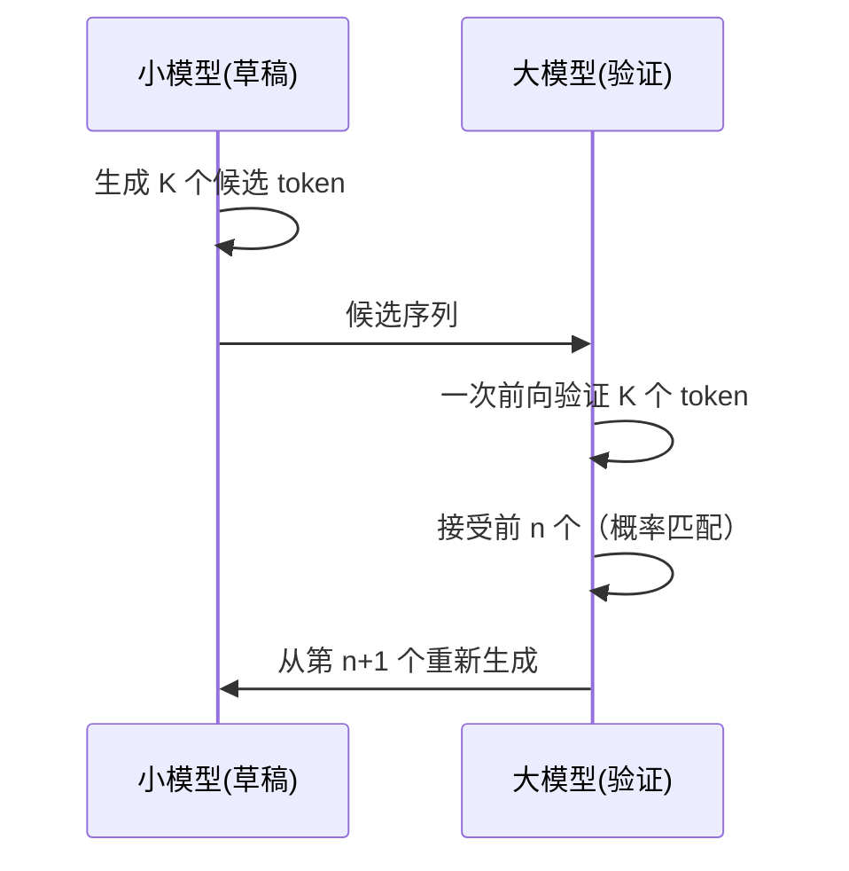

**加速原理**：大模型一次前向可验证 K 个 token，接受率 $p$ 时等效加速 $\frac{1}{1-p \cdot K}$。

---

## 9. 量化方法与加速方法

### 量化分类

| 类型 | 方法 | 精度损失 | 速度提升 | 适用 |
|------|------|---------|---------|------|
| **PTQ（训练后量化）** | GPTQ, AWQ, SmoothQuant | 小 | 1.5-3x | 推理部署 |
| **QAT（量化感知训练）** | LSQ, PACT | 极小 | 同 PTQ | 精度敏感场景 |
| **在线量化** | FP8 训练 | 小 | 训练加速 | 训练阶段 |

### GPTQ

基于近似二阶信息的逐层量化：

$$\hat{w}_j = \arg\min_{w_j \in \{q_1,...,q_k\}} \frac{(w_j - q)^2}{[H^{-1}]_{jj}}$$

$H$ 为 Hessian 矩阵，量化每列权重时考虑对后续列的影响并补偿。

- 支持 4-bit/8-bit 量化
- 量化后需用 dequantize 恢复再计算（W4A16 或 W8A16）
- 适合 GPTQ 的模型：LLaMA, Qwen, Mistral 等

### AWQ（Activation-aware Weight Quantization）

观察到大模型中约 1% 的权重通道对激活特别重要，保护这些通道的精度：

$$\hat{W} = \Delta \cdot \text{Round}\left(\frac{W}{\Delta}\right), \quad \Delta = \frac{\max(|W|)}{2^{b-1}-1}$$

对重要通道乘以缩放因子 $s$，使量化误差在重要通道上更小：

$$\arg\min_{s} \|\text{Quant}(s \cdot W) / s \cdot X - W \cdot X\|^2$$

| | GPTQ | AWQ |
|---|---|---|
| 量化策略 | 基于 Hessian 逐列量化 | 基于激活重要性逐通道量化 |
| 校准数据 | 需要 | 需要 |
| 速度 | 量化慢，推理快 | 量化快，推理快 |
| 精度 | 高 | 略优 |
| 硬件友好 | 一般 | 更好（适合 GPU kernel） |

### KV Cache 量化

将 KV Cache 从 FP16 量化为 INT8 或 INT4：

$$\text{KV Cache 节省} = \frac{16}{b} \times$$

$b=8$ 时节省 2x，$b=4$ 时节省 4x。

对长上下文推理效果显著，128K 上下文的 KV Cache 可从数十 GB 降至数 GB。

### FP8 训练

DeepSeek-V3 使用 FP8 混合精度训练：

| 组件 | 精度 |
|------|------|
| 前向传播 | FP8 (E4M3) |
| 反向传播梯度 | FP8 (E5M2) |
| 优化器状态 | FP32 |
| 主权重 | FP32 |

训练速度提升约 2x，精度损失可控（需细粒度量化策略）。

---

## 10. Loss 震荡原因分析

### 常见原因

| 原因 | 机制 | 诊断方法 |
|------|------|---------|
| **学习率过大** | 参数更新步长过大，在最优点附近震荡 | 降低 lr 观察是否缓解 |
| **数据质量问题** | 噪声标签、格式错误、重复数据 | 检查数据分布和样本 |
| **Batch Size 过小** | 梯度估计方差大 | 增大 batch 或梯度累加 |
| **梯度爆炸** | 梯度范数突然增大 | 监控梯度范数 |
| **Loss Spike** | 个别 batch 数据异常导致损失尖峰 | 检查 spike 时的数据 |
| **学习率调度不当** | Warmup 不足或衰减过快 | 调整调度策略 |
| **数值不稳定** | FP16 下溢/溢出 | 切换 BF16 |

### Loss Spike 详解

训练过程中 loss 突然飙升再恢复的现象：

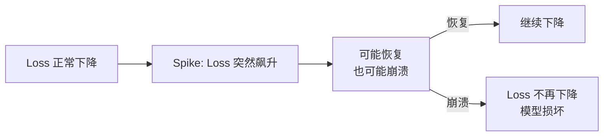

**常见原因**：
1. 数据中混入格式异常样本
2. 学习率在 spike 点附近过大
3. 梯度裁剪阈值过高
4. 注意力分数数值溢出

**应对策略**：
- 从 spike 前的 checkpoint 恢复
- 跳过导致 spike 的数据
- 降低学习率
- 加强梯度裁剪

### 诊断流程

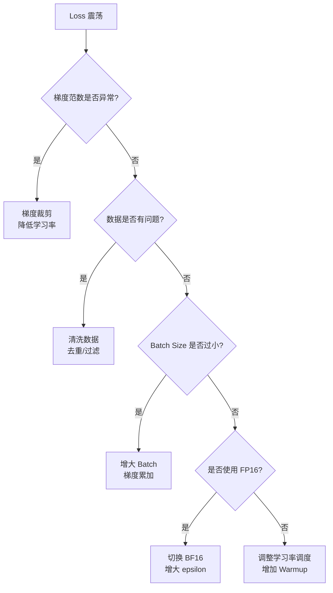

### 稳定训练的 Checklist

| 检查项 | 推荐配置 |
|--------|---------|
| 混合精度 | BF16（优先）> FP16 |
| 梯度裁剪 | 1.0 |
| 学习率 Warmup | 1000-2000 步 |
| 学习率调度 | Cosine Decay |
| Weight Decay | 0.1（预训练），0.01-0.05（微调） |
| AdamW epsilon | $10^{-6}$（BF16）或 $10^{-8}$（FP32） |
| 初始化 | Pre-LN/RMSNorm + 合理的初始化方差 |
| 数据质量 | 去重 > 过滤低质量 > 格式统一 |