# 第九章 大模型基础设施：从训练到部署的系统工程

> 本章系统讲解大语言模型（LLM, Large Language Model）训练与推理所涉及的基础设施技术。内容涵盖分布式训练的并行策略、显存优化、通信机制、收敛调优、推理加速与模型量化等核心主题。我们将从单卡训练的基本瓶颈出发，逐步引入多卡、多机的分布式方案，最终讨论模型部署阶段的优化技术。

---

## 9.1 训练加速：全景概览

训练一个大语言模型（如 GPT-3 的 1750 亿参数规模）需要消耗巨大的计算资源。单块 GPU 的算力和显存远远不够，因此需要从多个维度进行系统性加速。本节先建立全局视角，后续各节再逐一深入。

### 9.1.1 加速的四个维度

大模型训练加速可以从四个正交的维度入手：**计算加速**、**通信优化**、**显存优化**和**数据优化**。每个维度下有多种具体技术，它们可以组合使用以获得最佳效果。

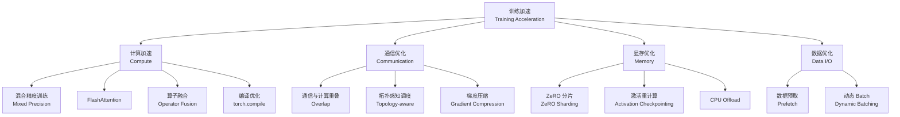

### 9.1.2 各技术的加速效果对比

下表汇总了主要优化手段的加速比、显存节省幅度和实现难度，帮助读者在实际工程中做出选型决策。

| 优化手段 | 加速比 | 显存节省 | 实现难度 | 说明 |
|---------|--------|---------|---------|------|
| BF16 混合精度 | 2-3x | 约 50% | 低 | 利用硬件 Tensor Core 加速半精度运算 |
| FlashAttention | 2-3x | $O(n^2) \to O(1)$（注意力部分） | 低（调用库） | 减少 HBM 读写，在 SRAM 内完成注意力计算 |
| ZeRO-3 | 1x（可能略慢） | 约 $1/G$（$G$ 为 GPU 数） | 中 | 将模型状态分片到多卡，以通信换显存 |
| 激活重计算 | 1x（略慢） | 30-60% | 低 | 不保存中间激活值，反向传播时重新计算 |
| 3D 并行 | 近线性扩展 | 分摊到多卡 | 高 | 数据并行 + 张量并行 + 流水线并行的组合 |
| 编译优化（torch.compile） | 1.2-2x | 无 | 低 | JIT 编译器自动融合算子、优化计算图 |

> **阅读提示**：BF16（Brain Floating Point 16）是一种 16 位浮点格式，与 FP16 相比具有更大的指数范围（与 FP32 相同），因此在深度学习训练中数值更稳定。HBM（High Bandwidth Memory，高带宽显存）是 GPU 的主存储器，SRAM（Static Random-Access Memory，静态随机存取存储器）是 GPU 芯片内部的高速缓存。

---

## 9.2 显存优化：DeepSpeed 与 ZeRO

在理解了加速的全局视角后，我们首先深入显存优化这一维度。对于百亿乃至千亿参数的模型，显存是最先遇到的瓶颈——即使拥有 80GB 显存的 A100 GPU，也无法容纳一个 70B 模型的全部训练状态。DeepSpeed 是微软开发的分布式训练框架，其核心技术 ZeRO（Zero Redundancy Optimizer，零冗余优化器）通过消除数据并行中的冗余存储来大幅降低每卡显存占用。

### 9.2.1 训练状态的显存构成

要理解 ZeRO 的原理，首先需要知道训练过程中 GPU 显存里存放了什么。以一个参数量为 $N$ 的模型、使用 FP16 混合精度 + Adam 优化器为例：

- **模型参数（FP16）**：$2N$ 字节
- **梯度（FP16）**：$2N$ 字节
- **优化器状态（FP32）**：$12N$ 字节（包括 FP32 主权重副本 $4N$、一阶动量 $4N$、二阶动量 $4N$）

总计每卡需要 $16N$ 字节。对于 70B 模型，这意味着约 1120 GB——远超任何单卡显存。

### 9.2.2 ZeRO 的三个阶段

ZeRO 的核心思想是：在数据并行（DP, Data Parallelism）中，每张卡都持有完整的模型状态副本，这是巨大的浪费。ZeRO 将这些状态分片（shard）到 $G$ 张 GPU 上，每卡只存储 $1/G$ 的份额。

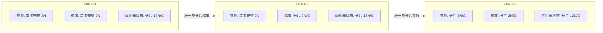

三个阶段的显存公式和通信量对比如下：

| 阶段 | 分片对象 | 每卡显存 | 通信量（相对于标准 DP） |
|------|---------|---------|----------------------|
| ZeRO-1 | 优化器状态 | $2N + 2N + \frac{12N}{G}$ | 1x |
| ZeRO-2 | 优化器状态 + 梯度 | $2N + \frac{2N}{G} + \frac{12N}{G}$ | 1x |
| ZeRO-3 | 优化器状态 + 梯度 + 参数 | $\frac{16N}{G}$ | 1.5x |

其中：$N$ 为模型参数量（单位：参数个数），$G$ 为 GPU 总数。

**符号解释**：
- $2N$：FP16 格式下参数或梯度占用的字节数（每个参数 2 字节）
- $12N$：Adam 优化器状态占用的字节数（FP32 主权重 $4N$ + 一阶动量 $4N$ + 二阶动量 $4N$）
- $\frac{16N}{G}$：ZeRO-3 将全部 $16N$ 字节均匀分片到 $G$ 张卡

以 70B 模型、64 张 GPU 为例的实际显存需求：

| 阶段 | 单卡显存（64 卡） | 可行性 |
|------|-----------------|--------|
| 无优化（标准 DP） | 约 1120 GB | 不可行，远超单卡容量 |
| ZeRO-1 | 约 153 GB | 仍需多卡模型并行 |
| ZeRO-2 | 约 85 GB | 仍需多卡模型并行 |
| ZeRO-3 | 约 17.5 GB | 单卡理论可行（80GB A100 绰绰有余） |

### 9.2.3 ZeRO-3 的通信流程

ZeRO-3 以通信换显存，在前向和反向传播时需要临时收集（All-Gather）完整参数，计算完成后立即丢弃非本卡的部分。

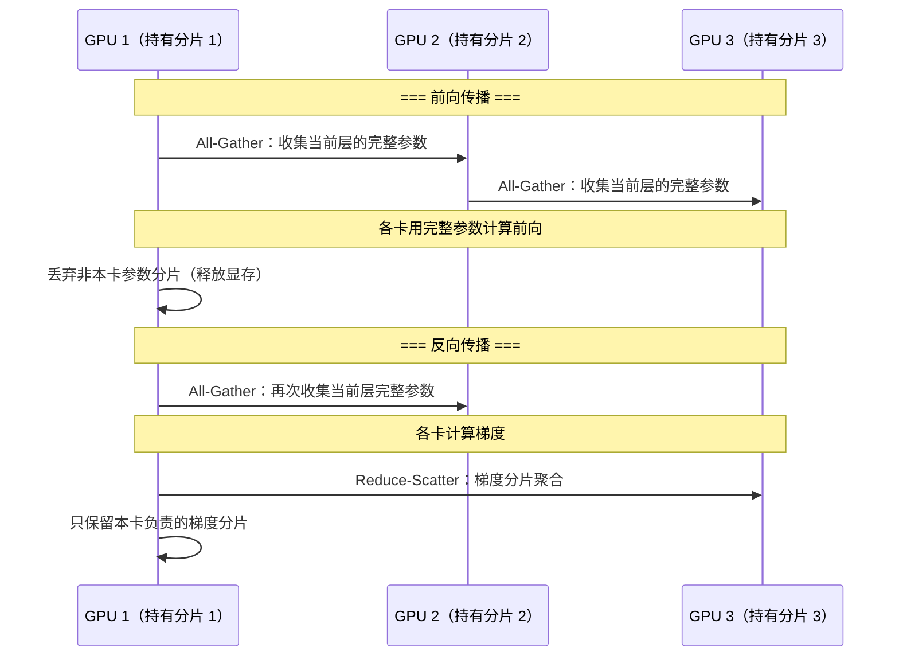

### 9.2.4 Offload 机制：将显存压力转移到 CPU 或磁盘

当 GPU 显存仍然不足时，DeepSpeed 提供 Offload 机制，将部分训练状态卸载到 CPU 内存甚至 NVMe 磁盘（Non-Volatile Memory Express，一种高速固态存储接口）。

| Offload 模式 | 卸载对象 | 显存节省 | 代价 |
|-------------|---------|---------|------|
| Optimizer Offload | 优化器状态 → CPU 内存 | 大 | CPU 与 GPU 之间的 PCIe 传输延迟 |
| Param Offload | 模型参数 → CPU 内存 | 极大 | 每步训练都需要搬运参数，开销显著 |
| NVMe Offload | 优化器状态 → NVMe 磁盘 | 极大 | 磁盘 I/O 成为严重瓶颈 |

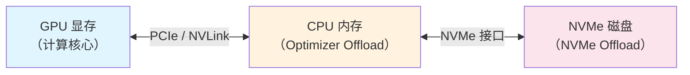

**实践建议**：优先使用 ZeRO-3 + Optimizer Offload 的组合。NVMe Offload 仅在极端显存不足（如用消费级 GPU 训练大模型）时作为最后手段。

### 9.2.5 DeepSpeed 关键配置参数

在实际工程中，DeepSpeed 通过 JSON 配置文件控制训练行为。以下是最重要的参数及其推荐值：

| 参数 | 推荐值 | 说明 |
|------|--------|------|
| `zero_stage` | 2 或 3 | Stage 2 通信开销小；Stage 3 显存节省最大 |
| `offload_optimizer` | `true`（显存不足时） | 将优化器状态卸载到 CPU |
| `gradient_accumulation_steps` | 按需设置 | 模拟大 Batch Size，详见 9.5 节 |
| `gradient_clipping` | 1.0 | 防止梯度爆炸，详见 9.6 节 |
| `bf16.enabled` | `true` | 启用 BF16 混合精度训练 |

---

## 9.3 分布式训练：并行策略

解决了单卡显存问题后，下一个挑战是如何高效地利用多张 GPU 协同训练。分布式训练的核心在于选择合适的并行策略。本节介绍三种基本并行方式及其组合。

### 9.3.1 并行策略选择决策树

选择并行策略的关键判据是模型能否放入单卡、单层能否放入单卡：

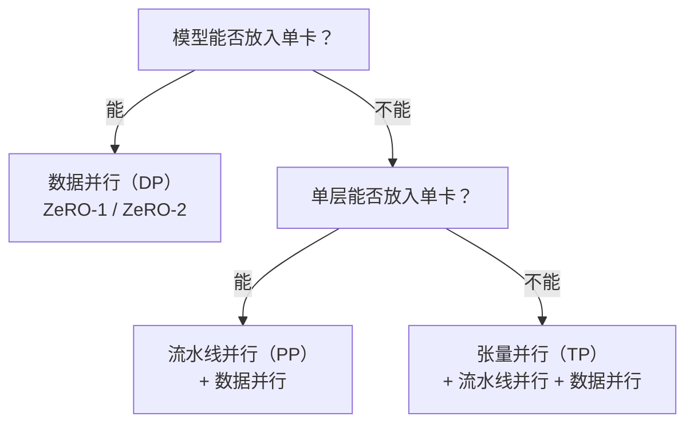

三种并行策略的定义：

- **数据并行（DP, Data Parallelism）**：每张卡持有完整的模型副本，各卡处理不同的数据子集，梯度同步后统一更新参数。
- **流水线并行（PP, Pipeline Parallelism）**：将模型按层切分为多个阶段（stage），不同阶段放在不同 GPU 上，数据像流水线一样依次流过各阶段。
- **张量并行（TP, Tensor Parallelism）**：将单个层的权重矩阵切分到多张 GPU 上，每张卡计算矩阵的一部分，通过通信合并结果。

当三者组合使用时，称为 **3D 并行**，这是训练超大模型（如 GPT-3、LLaMA-70B）的标准方案。

### 9.3.2 数据并行：DDP 与 FSDP

**DDP（DistributedDataParallel）** 是 PyTorch 原生的数据并行实现。每张卡持有完整的模型副本，各自处理不同的 mini-batch，然后通过 AllReduce 操作同步梯度。

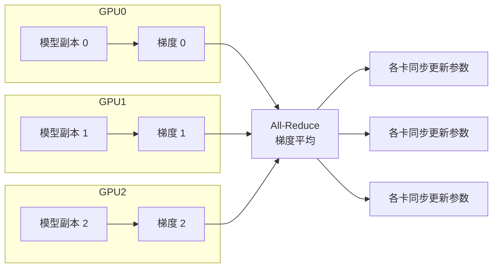

**FSDP（Fully Sharded Data Parallel，全分片数据并行）** 是 PyTorch 对 ZeRO-3 思想的原生实现。与 DDP 不同，FSDP 将模型参数、梯度和优化器状态全部分片存储。

| 对比维度 | DDP | FSDP |
|---------|-----|------|
| 模型状态 | 每卡持有完整副本 | 分片存储，每卡仅 $1/G$ |
| 显存占用 | 与卡数无关（不随卡数减少） | 近似 $1/G$，卡越多越省 |
| 通信操作 | AllReduce 同步梯度 | All-Gather 收集参数 + Reduce-Scatter 分片梯度 |
| 适用场景 | 模型能放入单卡 | 大模型训练的必选方案 |

### 9.3.3 Ring AllReduce：梯度同步的核心算法

AllReduce 是数据并行中最关键的集合通信操作，用于将所有 GPU 上的梯度求和并广播回每张卡。Ring AllReduce 是其最常用的实现方式，分为两个阶段：

1. **Reduce-Scatter 阶段**：将梯度分为 $G$ 个分片，沿环形拓扑传递并累加，最终每张卡持有一个分片的完整聚合结果。
2. **All-Gather 阶段**：将各卡持有的聚合分片沿环形广播，使每张卡获得完整的聚合梯度。

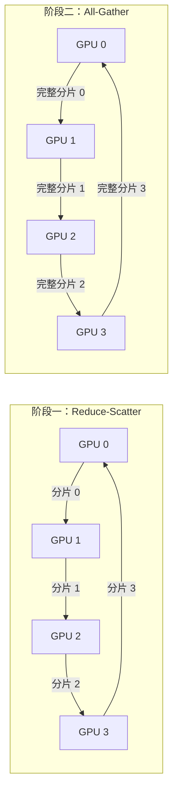

**通信量分析**：Ring AllReduce 的总通信量为：

$$\text{每卡通信量} = 2 \times \frac{N}{G} \times (G - 1) \approx 2N \quad (G \gg 1)$$

其中 $N$ 为梯度总大小，$G$ 为 GPU 数量。关键优势在于**每卡通信量与 GPU 数量无关**（当 $G$ 较大时），带宽利用率接近理论最优。

### 9.3.4 NCCL 通信后端与集合通信原语

NCCL（NVIDIA Collective Communications Library）是 NVIDIA 提供的 GPU 集合通信库，是分布式训练的通信基础设施。它实现了多种集合通信原语（primitive），不同的并行策略依赖不同的原语：

| 集合通信原语 | 用途 | 每卡通信量 |
|------------|------|-----------|
| All-Reduce | DDP 梯度同步 | $2N \cdot \frac{G-1}{G}$ |
| All-Gather | FSDP/ZeRO-3 参数收集 | $N \cdot \frac{G-1}{G}$ |
| Reduce-Scatter | FSDP/ZeRO-3 梯度分片聚合 | $N \cdot \frac{G-1}{G}$ |
| All-to-All | MoE（Mixture of Experts，混合专家模型）专家路由 | $N \cdot \frac{G-1}{G}$ |

> **注意**：All-Reduce 可以分解为一次 Reduce-Scatter + 一次 All-Gather，因此其通信量是后两者之和。

---

## 9.4 多机多卡通信：瓶颈与优化

当训练规模从单机多卡扩展到多机多卡时，通信成为制约扩展效率的关键瓶颈。本节分析通信瓶颈的来源，介绍硬件互联拓扑，并给出系统性的优化策略。

### 9.4.1 通信瓶颈分析

| 瓶颈类型 | 原因 | 对训练的影响 |
|---------|------|------------|
| 带宽不足 | 节点间网络带宽远低于节点内 GPU 互联 | AllReduce / All-Gather 操作耗时长 |
| 延迟高 | 跨节点通信需经过网络协议栈，跳数多 | 小消息通信效率极低 |
| 通信占比大 | 模型越大，梯度越大，通信数据量越大 | GPU 空闲等待通信完成 |
| 负载不均衡 | 不同节点的计算速度或网络条件不同 | 木桶效应——最慢的节点决定整体速度 |

### 9.4.2 GPU 互联拓扑

不同层级的互联技术在带宽和延迟上差异巨大，这直接影响并行策略的选择：

| 互联方式 | 带宽 | 延迟 | 适用范围 |
|---------|------|------|---------|
| NVLink | 600 GB/s（双向） | 极低 | 同节点内 GPU 之间 |
| NVSwitch | 与 NVLink 相同 | 极低 | 同节点内多 GPU 全互联 |
| InfiniBand（IB） | 200-400 Gb/s | 低 | 跨节点高性能互联 |
| RoCE（RDMA over Converged Ethernet） | 100-200 Gb/s | 中 | 跨节点（性价比方案） |
| TCP/IP | 10-25 Gb/s | 高 | 不推荐用于大模型训练 |

> **术语说明**：NVLink 是 NVIDIA 专有的高速 GPU 互联总线；NVSwitch 是实现节点内所有 GPU 全互联的交换芯片；InfiniBand 是高性能计算领域广泛使用的低延迟网络协议；RoCE 是在以太网上实现 RDMA（Remote Direct Memory Access，远程直接内存访问）的技术。

### 9.4.3 通信优化策略

针对上述瓶颈，工程实践中有五种主要的优化策略：

| 策略 | 原理 | 效果 |
|------|------|------|
| **通信与计算重叠** | 计算当前层梯度的同时，异步发送上一层的梯度 | 隐藏通信延迟 |
| **拓扑感知调度** | 将通信密集的并行（如 TP）放在同节点内 | 利用 NVLink 高带宽，减少跨节点通信 |
| **梯度压缩** | 对梯度进行量化或稀疏化后再通信 | 减少通信数据量 |
| **环形通信** | 使用 Ring AllReduce 替代树形 AllReduce | 带宽利用率更高 |
| **张量并行限制在节点内** | TP 通信量大且频繁，必须限制在 NVLink 互联范围内 | 避免跨节点 TP 的巨大开销 |

### 9.4.4 通信与计算重叠详解

通信与计算重叠是最重要的优化手段之一。其核心思想是：在反向传播中，当 GPU 正在计算第 $l$ 层的梯度时，第 $l+1$ 层的梯度已经就绪，可以同时发起通信操作。

```mermaid
gantt
    title 通信与计算重叠的时间线对比
    dateFormat X
    axisFormat %s

    section 无重叠（串行）
    计算层 1 梯度     :a1, 0, 3
    通信层 1 梯度     :a2, 3, 5
    计算层 2 梯度     :a3, 5, 8
    通信层 2 梯度     :a4, 8, 10

    section 有重叠（并行）
    计算层 1 梯度     :b1, 0, 3
    通信层 1 梯度     :b2, 2, 4
    计算层 2 梯度     :b3, 3, 6
    通信层 2 梯度     :b4, 5, 7
```

从甘特图可以看出，重叠后总耗时从 10 个时间单位缩短到 7 个，通信延迟被部分隐藏在计算过程中。

---

## 9.5 梯度累加：用时间换显存

在分布式训练中，增大 Global Batch Size（全局批次大小）通常能提高 GPU 利用率和训练稳定性。但直接使用大 Batch 会导致激活值显存暴增。梯度累加（Gradient Accumulation）提供了一种优雅的解决方案：用多次小 Batch 的前向/反向传播来模拟一次大 Batch 的效果。

### 9.5.1 核心思想与流程

将一个大的 Global Batch 拆分为 $K$ 个 Micro-batch（微批次），依次执行前向和反向传播，将梯度累加到同一个缓冲区中，最后做一次参数更新。

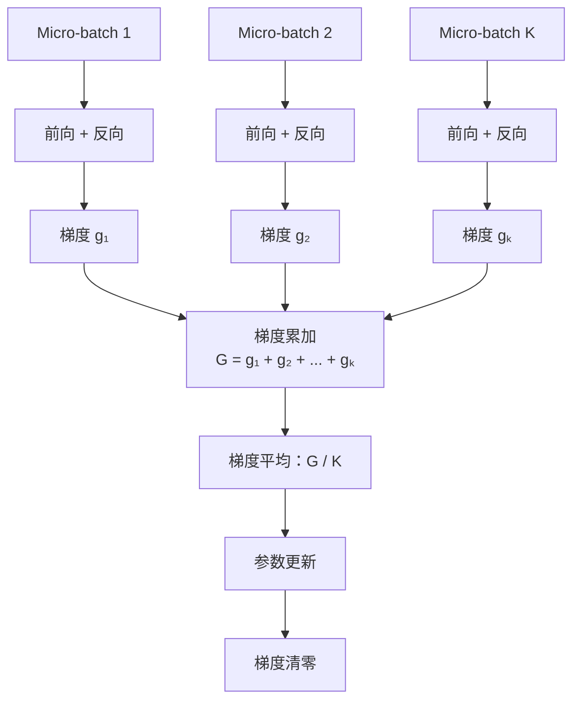

### 9.5.2 数学等价性证明

设 Global Batch Size 为 $B$，Micro-batch Size 为 $b$，累加步数 $K = B / b$。梯度累加的结果与直接使用大 Batch 在数学上是等价的：

$$\nabla_{\text{accum}} = \frac{1}{K} \sum_{k=1}^{K} \nabla_k \approx \frac{1}{B} \sum_{i=1}^{B} \nabla_i = \nabla_{\text{full\_batch}}$$

**符号解释**：
- $\nabla_k$：第 $k$ 个 Micro-batch 上计算的梯度
- $\nabla_{\text{accum}}$：累加并平均后的梯度
- $\nabla_{\text{full\_batch}}$：直接在完整 Batch 上计算的梯度

**关键注意**：累加后必须除以 $K$ 做平均，否则梯度会被放大 $K$ 倍，导致训练不稳定。

### 9.5.3 显存分析

| 对比维度 | 直接大 Batch | 梯度累加 |
|---------|------------|---------|
| 激活值显存 | $O(B)$——与 Batch Size 成正比 | $O(b)$，其中 $b \ll B$，显著节省 |
| 梯度显存 | $O(1)$——与 Batch Size 无关 | $O(1)$——累加到同一缓冲区 |
| 优化器更新频率 | 每 $B$ 个样本更新 1 次 | 每 $B$ 个样本更新 1 次（等价） |
| 训练速度 | 快（GPU 并行度高） | 略慢（Micro-batch 串行执行） |

### 9.5.4 实践注意事项

1. **BatchNorm 行为差异**：梯度累加时，每个 Micro-batch 独立计算 BatchNorm（BN）的统计量（均值和方差），这与在完整大 Batch 上计算的统计量不同。不过，LLM 通常使用 LayerNorm（LN）或 RMSNorm，不受此影响。
2. **学习率无需缩放**：由于已经对累加梯度做了平均（除以 $K$），学习率不需要随累加步数调整。
3. **Dropout 一致性**：每个 Micro-batch 独立执行 Dropout，这与大 Batch 训练中的行为是等价的。

---

## 9.6 收敛速度优化

训练能跑起来只是第一步，如何让模型更快、更稳定地收敛到好的性能，是另一个重要课题。本节讨论学习率调度、梯度裁剪等关键技术。

### 9.6.1 学习率调度：Warmup + Cosine Decay

大模型预训练普遍采用 "先升后降" 的学习率调度策略：

其数学表达式为：

$$\eta_t = \begin{cases} \eta_{\max} \cdot \dfrac{t}{T_{\text{warmup}}} & t \leq T_{\text{warmup}} \\[10pt] \eta_{\min} + \dfrac{1}{2}(\eta_{\max} - \eta_{\min})\left(1 + \cos\left(\dfrac{t - T_{\text{warmup}}}{T_{\text{total}} - T_{\text{warmup}}} \cdot \pi\right)\right) & t > T_{\text{warmup}} \end{cases}$$

**符号解释**：
- $\eta_t$：第 $t$ 步的学习率
- $\eta_{\max}$：峰值学习率（最大学习率）
- $\eta_{\min}$：最终学习率（最小学习率）
- $T_{\text{warmup}}$：Warmup 阶段的步数
- $T_{\text{total}}$：总训练步数
- 第一段（$t \leq T_{\text{warmup}}$）：学习率从 0 线性增长到 $\eta_{\max}$
- 第二段（$t > T_{\text{warmup}}$）：学习率按余弦曲线从 $\eta_{\max}$ 平滑衰减到 $\eta_{\min}$

### 9.6.2 关键超参数对收敛的影响

| 超参数 | 设置过小的后果 | 设置过大的后果 |
|--------|-------------|-------------|
| 学习率 | 收敛极慢，可能陷入局部最优 | Loss 剧烈震荡，无法收敛 |
| Batch Size | 梯度估计噪声大，收敛不稳定 | 泛化能力下降（generalization gap） |
| Warmup 步数 | 初始阶段梯度爆炸 | 浪费宝贵的训练步数 |
| Weight Decay | 模型过拟合 | 模型欠拟合 |

### 9.6.3 梯度裁剪

梯度裁剪（Gradient Clipping）是防止梯度爆炸的标准手段。当梯度的范数超过阈值 $\theta$ 时，按比例缩小梯度：

$$\nabla' = \begin{cases} \nabla & \|\nabla\| \leq \theta \\ \dfrac{\theta}{\|\nabla\|} \cdot \nabla & \|\nabla\| > \theta \end{cases}$$

**符号解释**：
- $\nabla$：原始梯度向量
- $\nabla'$：裁剪后的梯度向量
- $\|\nabla\|$：梯度的 L2 范数（即 $\sqrt{\sum_i \nabla_i^2}$）
- $\theta$：裁剪阈值，LLM 训练中通常设为 1.0

裁剪操作保持了梯度的方向不变，仅缩小其幅度，因此不会改变参数更新的方向。

### 9.6.4 收敛加速技巧汇总

| 技巧 | 原理 | 适用场景 |
|------|------|---------|
| **Warmup** | 初始阶段用小学习率，避免随机初始化导致的梯度爆炸 | 所有 LLM 训练 |
| **梯度裁剪** | 限制梯度范数上界，防止单步更新过大 | 防止梯度爆炸 |
| **Cosine Decay** | 平滑降低学习率，避免阶梯式衰减的突变 | 预训练阶段 |
| **增大 Batch Size** | 减少梯度估计的随机噪声，使更新更稳定 | 算力充足时 |
| **数据质量** | 去重、过滤低质量数据，减少噪声样本的干扰 | 所有训练阶段 |
| **课程学习** | 先用简单样本训练，再逐步引入困难样本 | SFT（Supervised Fine-Tuning）阶段 |

---

## 9.7 训练效率度量与提升

在大规模训练中，仅关注模型是否收敛是不够的——还需要关注硬件资源的利用效率。本节介绍算力利用率的度量指标，以及提高训练吞吐量的工程手段。

### 9.7.1 算力利用率：MFU 与 HFU

| 指标 | 全称 | 定义 | 说明 |
|------|------|------|------|
| **MFU** | Model FLOPs Utilization | $\dfrac{\text{模型实际 FLOPs}}{\text{硬件理论峰值 FLOPs}}$ | 不包含激活重计算等额外开销，反映真实的计算效率 |
| **HFU** | Hardware FLOPs Utilization | $\dfrac{\text{含重计算的总 FLOPs}}{\text{硬件理论峰值 FLOPs}}$ | 包含激活重计算的开销，反映硬件的实际忙碌程度 |

**符号解释**：FLOPs（Floating Point Operations）指浮点运算次数。MFU 衡量的是 "有效计算" 占硬件能力的比例，是评估训练系统效率的黄金指标。

GPT-3 175B 的训练 MFU 约为 40-50%，理想目标是超过 50%。MFU 低于预期通常意味着存在通信瓶颈、显存搬运开销或 GPU 空闲等待。

### 9.7.2 提高吞吐量的关键手段

| 手段 | 原理 | 效果 |
|------|------|------|
| 增大 Global Batch Size | 提高每步的数据并行度，更充分利用 GPU | 吞吐提升，但存在收敛上限 |
| 梯度累加 | 用小 Micro-batch 累积模拟大 Batch | 显存友好，不增加通信开销 |
| 数据预取 | GPU 计算当前 Batch 时，CPU 异步准备下一批数据 | 减少数据 I/O 等待时间 |
| 编译优化 | `torch.compile` 自动融合算子、消除冗余计算 | 1.2-2x 加速 |
| 通信重叠 | 计算与通信并行执行（详见 9.4.4 节） | 隐藏通信延迟 |

### 9.7.3 Checkpoint 策略

训练过程中定期保存模型检查点（Checkpoint）是容灾的基本手段。不同的保存策略在可靠性和训练效率之间有不同的权衡：

| 策略 | 方法 | 权衡 |
|------|------|------|
| 固定步数保存 | 每 $N$ 步保存一次 | 简单可靠，但间隔过大可能丢失进度，过小则浪费 I/O |
| 自适应保存 | 根据验证集 Loss 的变化决定是否保存 | 更智能，但需要额外的验证计算 |
| 异步保存 | 在后台线程中执行保存，不阻塞训练主循环 | 不影响训练速度，但需要额外内存存放快照 |

---

## 9.8 训练稳定性：Loss 震荡的诊断与应对

即使配置了合理的超参数，大模型训练过程中仍可能出现 Loss 震荡甚至 Loss Spike（损失尖峰）。本节系统分析其原因并给出诊断流程。

### 9.8.1 Loss 震荡的常见原因

| 原因 | 机制 | 诊断方法 |
|------|------|---------|
| **学习率过大** | 参数更新步长过大，在最优点附近来回震荡 | 降低学习率，观察是否缓解 |
| **数据质量问题** | 噪声标签、格式错误、重复数据引入噪声 | 检查数据分布和异常样本 |
| **Batch Size 过小** | 梯度估计的方差大，更新方向不稳定 | 增大 Batch Size 或使用梯度累加 |
| **梯度爆炸** | 梯度范数突然增大，导致参数剧烈变化 | 监控梯度范数的变化趋势 |
| **Loss Spike** | 个别 Batch 的数据异常导致损失突然飙升 | 检查 Spike 发生时对应的训练数据 |
| **学习率调度不当** | Warmup 不足或衰减过快 | 调整调度策略 |
| **数值不稳定** | FP16 精度下发生下溢或溢出 | 切换为 BF16 |

### 9.8.2 Loss Spike 详解

Loss Spike 是训练过程中 Loss 突然飙升的现象，可能自行恢复，也可能导致训练崩溃：

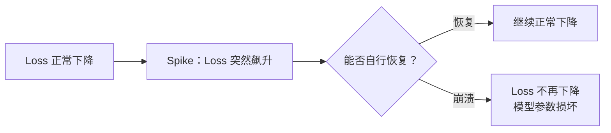

**常见触发原因**：
1. 训练数据中混入格式异常的样本
2. 学习率在 Spike 发生点附近偏大
3. 梯度裁剪阈值设置过高，未能有效限制异常梯度
4. 注意力分数（Attention Score）发生数值溢出

**应对策略**：
- 从 Spike 之前的 Checkpoint 恢复训练
- 跳过导致 Spike 的异常数据批次
- 适当降低学习率
- 加强梯度裁剪（降低阈值 $\theta$）

### 9.8.3 Loss 震荡诊断流程

面对 Loss 震荡，可以按照以下决策树逐步排查：

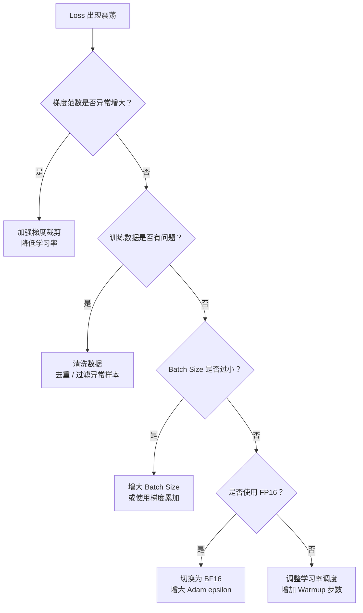

### 9.8.4 稳定训练的配置清单

以下是经过大量实践验证的稳定训练配置，可作为基线参考：

| 检查项 | 推荐配置 | 说明 |
|--------|---------|------|
| 混合精度格式 | BF16（优先）> FP16 | BF16 指数范围大，数值更稳定 |
| 梯度裁剪阈值 | 1.0 | 标准选择，过大则失去保护作用 |
| 学习率 Warmup | 1000-2000 步 | 给模型足够的 "热身" 时间 |
| 学习率调度 | Cosine Decay | 平滑衰减，避免突变 |
| Weight Decay | 0.1（预训练）/ 0.01-0.05（微调） | 正则化强度需匹配训练阶段 |
| AdamW epsilon | $10^{-6}$（BF16）/ $10^{-8}$（FP32） | 防止除零，BF16 下需更大的 epsilon |
| 模型初始化 | Pre-LN / RMSNorm + 合理的初始化方差 | Pre-LN 将归一化放在注意力/FFN 之前，训练更稳定 |
| 数据质量 | 去重 > 过滤低质量 > 格式统一 | 数据质量是收敛速度的基础保障 |

---

## 9.9 GPU 性能优化：训练与推理

前面几节侧重于分布式策略和训练稳定性，本节聚焦于单卡层面的计算优化技术，涵盖训练和推理两个阶段。

### 9.9.1 训练阶段的计算优化

| 优化技术 | 原理 | 效果 |
|---------|------|------|
| **混合精度训练（BF16）** | 前向传播使用 BF16，梯度和优化器状态保持 FP32 | 速度提升 2x，显存节省约 50% |
| **FlashAttention** | 将注意力计算分块（tiling），在 GPU 的 SRAM 内完成，避免将 $O(n^2)$ 的注意力矩阵写入 HBM | 速度提升 2-3x，注意力部分显存从 $O(n^2)$ 降至 $O(1)$ |
| **算子融合（Operator Fusion）** | 将多个小算子（如 Add + LayerNorm + GELU）合并为一个大的 GPU Kernel | 减少 Kernel Launch 开销和中间结果的显存读写 |
| **torch.compile** | PyTorch 的 JIT（Just-In-Time）编译器，自动分析计算图并进行算子融合、内存规划等优化 | 1.2-2x 加速，无需修改模型代码 |
| **激活重计算（Activation Checkpointing）** | 前向传播时不保存中间激活值，反向传播时重新计算 | 显存节省 30-60%，代价是约 33% 的额外计算 |

### 9.9.2 推理优化全景

模型训练完成后，部署到生产环境进行推理服务时，面临的核心挑战从 "如何训练" 转变为 "如何快速、低成本地响应用户请求"。推理优化可以从三个层面入手：

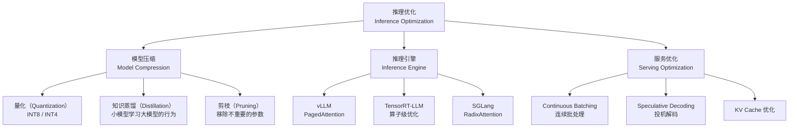

### 9.9.3 主流推理引擎对比

| 引擎 | 核心优化技术 | 适用场景 |
|------|------------|---------|
| **vLLM** | PagedAttention（将 KV Cache 按页管理，避免显存碎片）+ Continuous Batching | 高并发在线服务 |
| **TensorRT-LLM** | 算子融合 + GPU Kernel 深度优化 + 量化支持 | NVIDIA GPU 上追求极致性能 |
| **SGLang** | RadixAttention（基于前缀树的 KV Cache 复用） | 多请求共享相同前缀的场景 |
| **llama.cpp** | GGUF 格式量化 + CPU 推理优化 | 消费级硬件 / 边缘设备部署 |

> **术语说明**：
> - **PagedAttention**：借鉴操作系统虚拟内存的分页思想，将 KV Cache 分成固定大小的页（page），按需分配，解决了传统实现中因预分配最大长度导致的显存浪费。
> - **Continuous Batching**：与传统的静态批处理不同，允许请求在生成完成后立即退出批次，新请求随时加入，提高 GPU 利用率。
> - **RadixAttention**：利用基数树（Radix Tree）索引已缓存的 KV Cache 前缀，当多个请求共享相同的系统提示（System Prompt）时，可以复用已计算的 KV Cache。

### 9.9.4 Speculative Decoding（投机解码）

LLM 推理的自回归（Autoregressive）特性决定了每次只能生成一个 Token，这严重限制了 GPU 的利用率。投机解码通过引入一个小型 "草稿模型" 来加速生成过程。

**工作流程**：

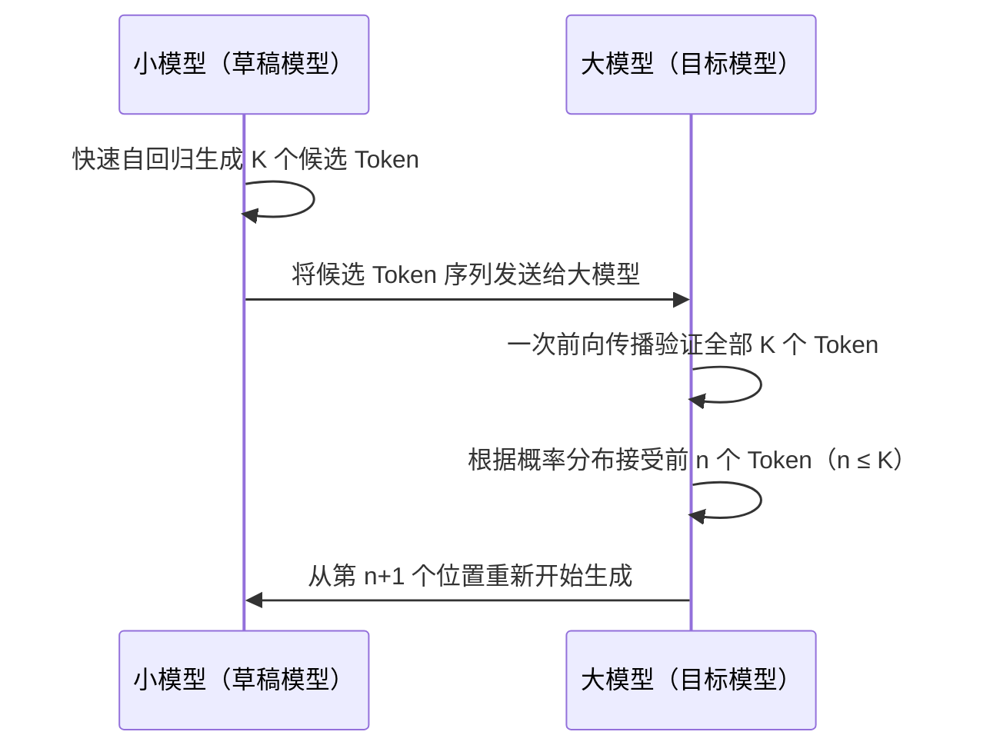

**加速原理**：大模型验证 $K$ 个 Token 只需一次前向传播（与生成 1 个 Token 的计算量相当），而小模型生成 $K$ 个 Token 的速度远快于大模型。设接受率为 $p$，则等效加速比约为：

$$\text{加速比} \approx \frac{K}{1 + (1-p) \cdot K}$$

当 $p$ 较高（小模型与大模型分布接近）时，加速效果显著。

---

## 9.10 模型量化：精度与效率的权衡

量化（Quantization）是将模型权重和/或激活值从高精度（如 FP16/FP32）转换为低精度（如 INT8/INT4）的技术。它是推理部署中最重要的优化手段之一，能够显著减少模型大小、降低显存占用并加速计算。

### 9.10.1 量化方法分类

| 类型 | 全称 | 代表方法 | 精度损失 | 速度提升 | 适用阶段 |
|------|------|---------|---------|---------|---------|
| **PTQ** | Post-Training Quantization（训练后量化） | GPTQ, AWQ, SmoothQuant | 小 | 1.5-3x | 推理部署 |
| **QAT** | Quantization-Aware Training（量化感知训练） | LSQ, PACT | 极小 | 同 PTQ | 精度敏感场景 |
| **在线量化** | Online Quantization | FP8 训练 | 小 | 训练加速 | 训练阶段 |

- **PTQ**：在模型训练完成后，使用少量校准数据（calibration data）确定量化参数，无需重新训练。优点是简单快速，缺点是对极低比特（如 4-bit）可能有明显精度损失。
- **QAT**：在训练过程中模拟量化操作，让模型学会适应低精度表示。精度损失最小，但需要额外的训练成本。
- **在线量化**：直接使用低精度格式（如 FP8）进行训练计算，兼顾训练速度和精度。

### 9.10.2 GPTQ：基于 Hessian 信息的逐层量化

GPTQ 是目前最流行的 PTQ 方法之一，其核心思想是利用二阶信息（Hessian 矩阵）来最小化量化误差。

量化目标——对每一列权重 $w_j$，选择最优的量化值：

$$\hat{w}_j = \arg\min_{w_j \in \{q_1, \ldots, q_k\}} \frac{(w_j - q)^2}{[H^{-1}]_{jj}}$$

**符号解释**：
- $\hat{w}_j$：量化后的权重值
- $w_j$：原始权重值
- $\{q_1, \ldots, q_k\}$：量化网格上的候选值
- $H$：Hessian 矩阵，即损失函数对权重的二阶导数矩阵
- $[H^{-1}]_{jj}$：Hessian 逆矩阵的第 $j$ 个对角元素，衡量第 $j$ 列权重对损失的敏感度

直觉理解：$[H^{-1}]_{jj}$ 越大，说明该权重对损失的影响越小，可以容忍更大的量化误差；反之则需要更精确的量化。

GPTQ 的关键特性：
- 支持 4-bit 和 8-bit 量化
- 量化后推理时需要反量化（dequantize）恢复再计算，常见配置为 W4A16（权重 4-bit，激活 FP16）或 W8A16
- 广泛适用于 LLaMA、Qwen、Mistral 等主流开源模型

### 9.10.3 AWQ：激活感知的权重量化

AWQ（Activation-aware Weight Quantization，激活感知权重量化）基于一个重要观察：大模型中约 **1% 的权重通道**对激活值的影响特别大，保护这些关键通道的精度可以显著降低量化损失。

**基本量化公式**：

$$\hat{W} = \Delta \cdot \text{Round}\left(\frac{W}{\Delta}\right), \quad \Delta = \frac{\max(|W|)}{2^{b-1} - 1}$$

**符号解释**：
- $\hat{W}$：量化后的权重矩阵
- $W$：原始权重矩阵
- $\Delta$：量化步长（scale），决定了量化的粒度
- $b$：量化位宽（如 4 或 8）
- $\text{Round}(\cdot)$：四舍五入到最近的整数

AWQ 的核心创新是对重要通道乘以缩放因子 $s$，使量化误差在这些通道上更小：

$$\arg\min_{s} \left\| \text{Quant}(s \cdot W) / s \cdot X - W \cdot X \right\|^2$$

**符号解释**：
- $s$：逐通道的缩放因子
- $X$：输入激活值
- $\text{Quant}(\cdot)$：量化操作
- 优化目标是找到最优的 $s$，使得量化后的输出尽可能接近原始输出

### 9.10.4 GPTQ 与 AWQ 对比

| 对比维度 | GPTQ | AWQ |
|---------|------|-----|
| 量化策略 | 基于 Hessian 矩阵逐列量化 | 基于激活重要性逐通道量化 |
| 校准数据 | 需要 | 需要 |
| 量化速度 | 较慢（需计算 Hessian） | 较快 |
| 推理速度 | 快 | 快 |
| 精度保持 | 高 | 略优于 GPTQ |
| 硬件友好性 | 一般 | 更好（更适合 GPU Kernel 优化） |

### 9.10.5 KV Cache 量化

在 LLM 推理中，KV Cache（Key-Value Cache）存储了已生成 Token 的注意力键值对，避免重复计算。随着上下文长度增加，KV Cache 的显存占用急剧增长。将 KV Cache 从 FP16 量化为 INT8 或 INT4 是一种有效的优化手段。

**显存节省公式**：

$$\text{KV Cache 显存节省倍数} = \frac{16}{b}$$

其中 $b$ 为量化后的位宽。$b = 8$ 时节省 2 倍，$b = 4$ 时节省 4 倍。

**实际效果**：对于 128K 上下文长度的推理场景，KV Cache 可能占用数十 GB 显存。经过 INT4 量化后，可降至数 GB，使得在单卡上服务长上下文请求成为可能。

### 9.10.6 FP8 训练

FP8（8 位浮点数）是一种新兴的训练精度格式，DeepSeek-V3 等模型已成功采用 FP8 混合精度训练。FP8 有两种变体，分别用于不同的计算阶段：

| 计算组件 | 使用精度 | 说明 |
|---------|---------|------|
| 前向传播 | FP8（E4M3 格式） | 4 位指数 + 3 位尾数，精度较高 |
| 反向传播梯度 | FP8（E5M2 格式） | 5 位指数 + 2 位尾数，动态范围更大 |
| 优化器状态 | FP32 | 保持高精度以确保收敛 |
| 主权重（Master Weights） | FP32 | 参数更新在 FP32 上进行 |

> **术语说明**：E4M3 表示 4 位指数（Exponent）+ 3 位尾数（Mantissa）；E5M2 表示 5 位指数 + 2 位尾数。前向传播需要更高的精度（更多尾数位），反向传播的梯度值范围更大，需要更多指数位。

FP8 训练的速度提升约 2 倍，精度损失在可控范围内（需配合细粒度量化策略，如逐张量或逐通道的动态缩放）。

---

## 9.11 全章总结：从训练到部署的技术栈全景

本章从四个维度（计算、通信、显存、数据）出发，系统讲解了大模型基础设施的核心技术。下图展示了从训练到部署的完整技术栈及各技术之间的关系：

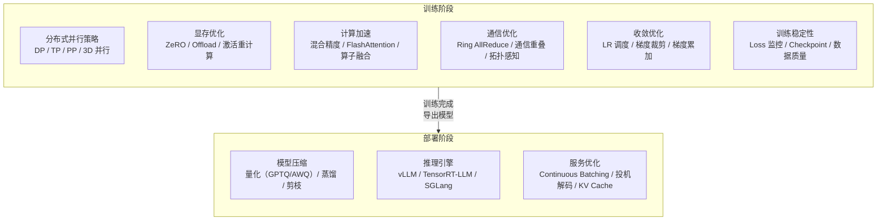

### 核心知识点速查表

| 主题 | 关键技术 | 核心指标 |
|------|---------|---------|
| 显存优化 | ZeRO-3 + Offload | 每卡显存降至 $16N/G$ |
| 数据并行 | DDP / FSDP | Ring AllReduce 通信量 $\approx 2N$ |
| 计算加速 | BF16 + FlashAttention | 2-3x 加速 |
| 收敛优化 | Warmup + Cosine Decay + 梯度裁剪 | MFU 目标 > 50% |
| 梯度累加 | $K$ 步累加模拟大 Batch | 激活显存 $O(b)$ vs $O(B)$ |
| 模型量化 | GPTQ / AWQ（4-bit） | 推理加速 1.5-3x |
| KV Cache | 量化 + PagedAttention | 长上下文显存降低 2-4x |
| 推理服务 | Continuous Batching + 投机解码 | 吞吐量显著提升 |

> **学习建议**：本章内容涉及系统工程的多个层面，建议读者在理解原理后，结合 DeepSpeed、PyTorch FSDP、vLLM 等开源框架的实际配置进行动手实践。理论与实践相结合，才能真正掌握大模型基础设施的精髓。
