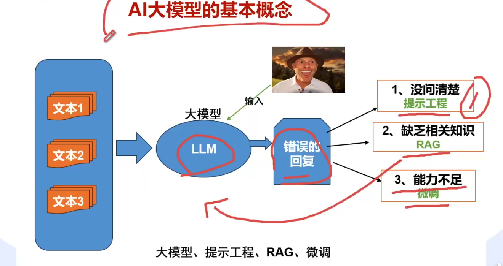
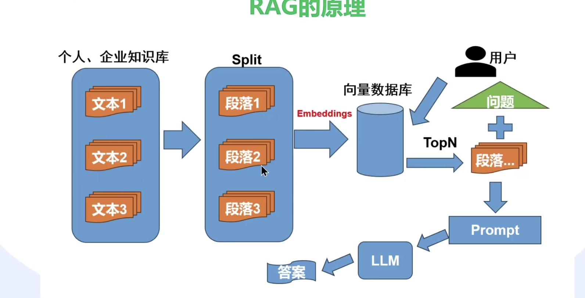
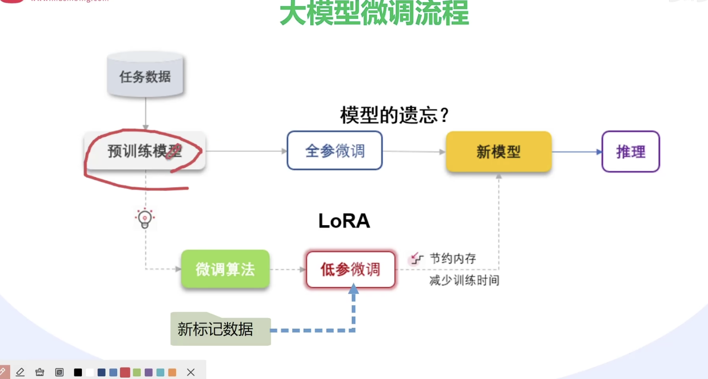

大模型开发介绍

提示工程、RAG、微调、部署

RAG（Retrieval-Augmented Generation） 是一种结合外部知识检索与模型生成能力的技术，旨在提升模型输出的准确性、相关性和时效性。
RAG 的核心思想
知识增强：通过检索外部知识库（如文档、数据库或互联网），为模型提供实时或领域特定的信息，弥补预训练模型内部知识的局限性。
减少幻觉：利用外部数据验证生成内容的真实性，避免模型编造事实（即 “hallucination” 问题）。
灵活性：无需重新训练模型即可处理新知识或更新信息。
其实就是把内部数据库的向量检索出来，结合用户的问题，变成llm的一个prompt输入，让大模型去回答。也可以用在后面

微调：使用LoRA（Low-Rank Adaptation）等技术，对预训练模型进行微调，使其适应特定任务或领域。

huggingface就是一个通用的资源库，以及一个LLM的推理框架。

大模型是通用的智能，我应该如何训练新的知识点进去？这很重要
放进知识库，让大模型暗中记住，也可以显性检索

大模型目前的长期记忆问题没有很好的解决方法。
微调的方法呢？是否RAG之后是一个很好的方案？

训练微调：预训练微调、监督学习微调、强化学习微调