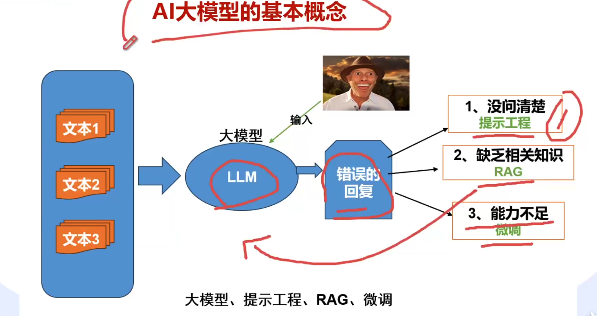
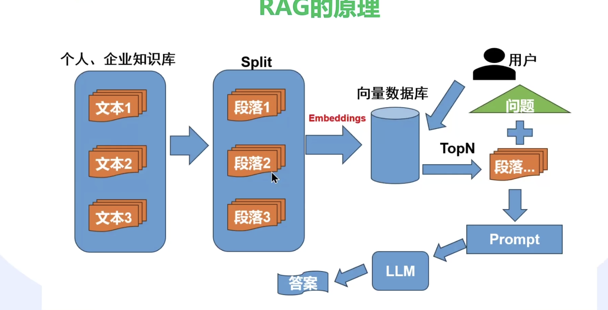
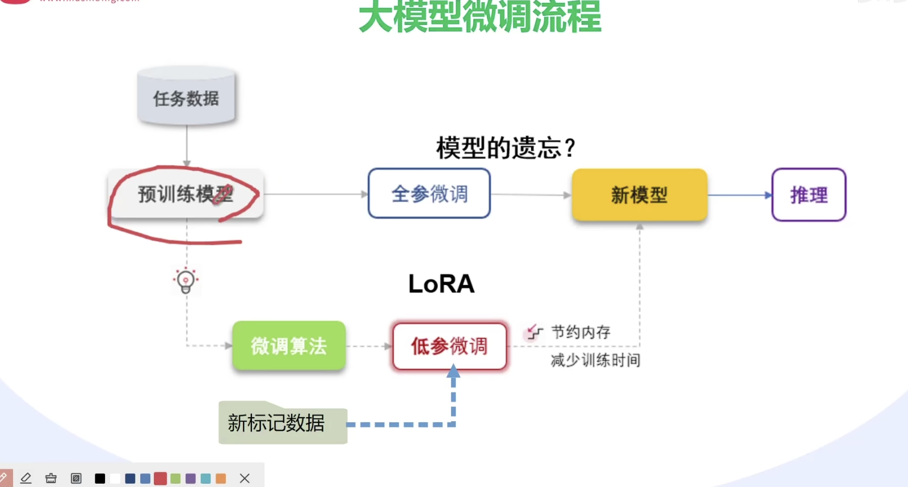

# 大模型基础

> 本文概述大语言模型（LLM）应用开发的核心技术路线：提示工程、RAG、微调。

## 1. 提示工程 (Prompt Engineering)

提示工程是使用大模型最直接的方式——通过精心设计输入提示词来引导模型输出期望的结果，无需修改模型参数。

核心技巧包括：
- **角色设定**：为模型指定角色（如"你是一个资深数据分析师"）
- **Few-shot 示例**：在提示中给出几个输入-输出示例，帮助模型理解任务格式
- **Chain-of-Thought**：要求模型逐步推理，提升复杂任务的准确率
- **输出格式约束**：明确指定输出格式（如 JSON、Markdown 表格）

## 2. RAG (Retrieval-Augmented Generation)

RAG 结合外部知识检索与模型生成能力，核心流程：

1. **文档索引**：将知识库文档切分为 chunk，通过嵌入模型转化为向量，存入向量数据库
2. **检索**：用户提问时，将问题转化为向量，在向量数据库中检索最相关的 chunk
3. **生成**：将检索到的 chunk 与用户问题拼接为 prompt，输入 LLM 生成回答

RAG 的优势：
- 无需重新训练模型即可引入新知识
- 减少幻觉——模型基于检索到的事实生成回答
- 知识可实时更新

## 3. 微调 (Fine-tuning)

当提示工程和 RAG 无法满足需求时，需要对模型进行微调：

- **全参数微调**：更新模型所有参数，效果最好但成本最高
- **LoRA (Low-Rank Adaptation)**：只训练低秩分解的增量矩阵 $\Delta W = BA$，其中 $B \in \mathbb{R}^{d \times r}, A \in \mathbb{R}^{r \times d}$，$r \ll d$。大幅减少可训练参数量
- **监督微调 (SFT)**：使用标注的指令-回答对进行微调
- **RLHF**：通过人类反馈的强化学习进一步对齐模型行为

## 4. 技术选择建议

| 方法 | 适用场景 | 成本 | 效果 |
|------|----------|------|------|
| 提示工程 | 通用任务、快速原型 | 低 | 中 |
| RAG | 需要外部知识、知识频繁更新 | 中 | 中-高 |
| 微调 | 特定领域、特定风格、高精度要求 | 高 | 高 |

实际应用中，这三种方法通常组合使用：先用 RAG 引入领域知识，再用微调适配特定任务，最后用提示工程优化输出格式。
