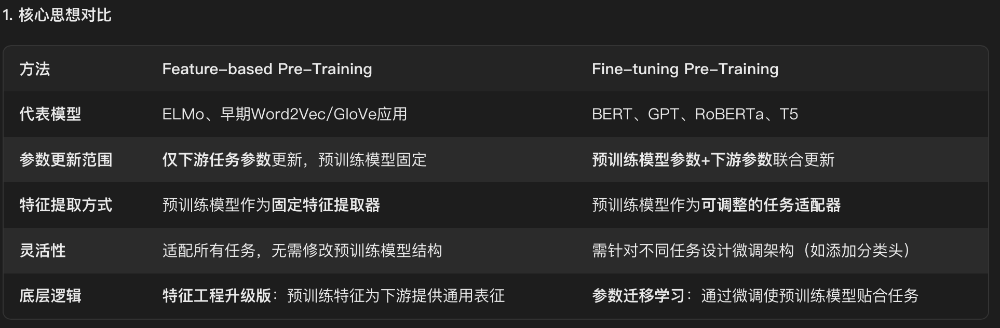

# NLP的基础知识
## 词嵌入

### Word Embedding
- 定义：将单词映射为向量表示，不考虑上下文信息。
- 方法：基于统计方法（如Word2Vec）或深度学习模型（如Word2Vec、FastText）生成单词向量。
- 优点：简单高效，适用于简单文本处理任务。

### Contextualized Embedding
- 定义：将单词或短语映射为向量表示，考虑上下文信息。一般会先TE变为token，然后再进行加权。
- 方法：基于预训练模型（如BERT、GPT），通过学习上下文关系来生成单词向量。
- 优点：捕捉单词间的语义关系，适用于文本分类、情感分析等任务。

#### EMLO Embedding from language models
使用RNN的LM去对token进行嵌入。双向RNN，然后拼接起来。
RNN是可以有深层RNN的，EMLO将每一层的embedding都加权求和，成为一个新的embedding。

##### ELMo 的本质思想是：
- 我事先用语言模型学好一个单词的 Word Embedding（全连接或者CNN都可以），然后再经过上下文的一个网络调整，这样经过调整后的 Word Embedding 更能表达在这个上下文中的具体含义。周围单词的上下文不同应该会强化某种语义，弱化其它语义，进而就解决了多义词的问题。

##### ELMo 采用了典型的两阶段过程：
- 第一个阶段是利用语言模型进行预训练；用上下文预测当前单词，优化方向就是最大化当前词的联合似然函数。这样就可以提取单词、句法、语义特征。通过输出计算词概率的时候，是用相似度计算的，隐藏状态与输出词的点积 占 与所有词的点积的softmax。
$p(t_k | t_{1:k-1}) = \frac{\exp(w_{t_k}^T \overrightarrow{h}_k^{(L)})}{\sum_{v \in V} \exp(w_v^T \overrightarrow{h}_k^{(L)})}$

Feature-based Pre-Training：
因为 ELMo 给下游提供的是每个单词的特征形式，所以这一类预训练的方法被称为 “Feature-based Pre-Training”。

- 第二个阶段是在做下游任务时，从预训练网络中提取对应单词的网络各层的 Word Embedding 作为新特征补充到下游任务中。
### Token Embedding
- 定义：将文本分割为单词或子词（如BPE），然后映射为向量表示。
- 方法：基于预训练模型（如BERT、GPT），通过学习上下文关系来生成单词向量。
- 优点：适用于处理长文本，考虑上下文信息。
### Embedding Layer
- 定义：将输入文本或图像转换为向量表示的层。
- 方法：基于预训练模型（如BERT、GPT），通过学习上下文关系来生成单词向量。
- 优点：适用于处理长文本，考虑上下文信息。

