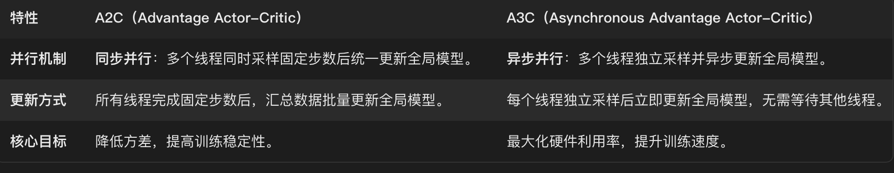
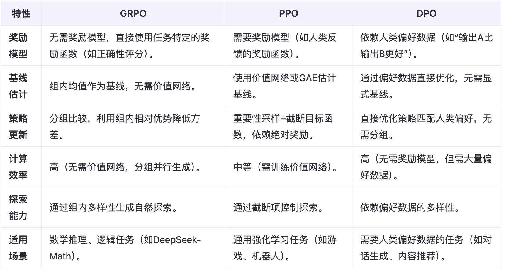

# 强化学习基础
## 策略梯度方法
### 1. REINFORCE 算法（1992）

#### 详解
REINFORCE 算法是最早的基于策略梯度的强化学习算法之一，它直接对策略函数的参数进行优化。其核心思想是通过采样得到的轨迹来估计策略梯度，然后使用梯度上升的方法来最大化期望回报。

策略梯度的计算公式为：
$ \nabla_{\theta} J(\theta) = \mathbb{E}_{\tau \sim \pi_{\theta}} \left[ \sum_{t=0}^{T} \nabla_{\theta} \log \pi_{\theta}(a_t|s_t) G_t \right] $
其中，\(\theta\) 是策略网络的参数，\(\pi_{\theta}\) 是策略函数，\(\tau\) 是一条轨迹，\(T\) 是轨迹的长度，\(s_t\) 和 \(a_t\) 分别是时刻 \(t\) 的状态和动作，\(G_t\) 是从时刻 \(t\) 开始的累积折扣回报：
$ G_t = \sum_{k=t}^{T} \gamma^{k - t} r_k $
\(\gamma\) 是折扣因子，\(r_k\) 是时刻 \(k\) 的奖励。

#### 演化过程
REINFORCE 算法是策略梯度方法的基础，后续很多算法都是在其基础上进行改进和扩展的。它为基于策略的强化学习提供了一个基本的框架。

#### 优点
- **直接优化策略**：可以直接对策略进行优化，适用于连续动作空间，而基于值函数的方法在处理连续动作空间时会面临困难。
- **理论基础清晰**：策略梯度的推导基于严格的数学理论，具有较好的可解释性。

#### 缺点
- **高方差**：由于使用蒙特卡罗方法来估计累积回报 \(G_t\)，导致估计的方差较大，训练过程不稳定，收敛速度慢。
- **样本效率低**：需要大量的样本才能得到较好的策略更新，因为每次更新都依赖于完整的轨迹。

### 2. Actor - Critic 架构（1999）

#### 详解
Actor - Critic 架构结合了基于策略的方法（Actor）和基于值函数的方法（Critic）。Actor 负责生成动作，Critic 负责评估动作的价值。Critic 通过估计状态价值函数 \(V(s)\) 或动作价值函数 \(Q(s, a)\) 来为 Actor 提供反馈，替代蒙特卡洛回报。

策略梯度的计算公式为：
$ \nabla_{\theta} J(\theta) = \mathbb{E}_{\pi_{\theta}} \left[ \nabla_{\theta} \log \pi_{\theta}(a|s) A^{\pi}(s, a) \right] $
其中，\(A^{\pi}(s, a) = Q^{\pi}(s, a) - V^{\pi}(s)\) 是优势函数，用于衡量在状态 \(s\) 下采取动作 \(a\) 相对于平均动作的优势。
$$
\mathcal{A}(s_t, a_t) \approx \delta_t = r_t + \gamma V_w(s_{t+1}) - V_w(s_t)
$$Critic 网络的更新使用类似 DQN 的方法，通过最小化 TD 误差来更新。
$$
\mathcal{L}(w) = \mathbb{E} \left[ (r_t + \gamma V_w(s_{t+1}) - V_w(s_t))^2 \right]
$$
#### 演化过程
Actor - Critic 架构是在 REINFORCE 算法的基础上发展而来的。为了降低 REINFORCE 算法的高方差问题，引入了 Critic 网络来估计价值函数，作为基线来减少梯度估计的方差。

#### 优点
- **降低方差**：通过引入 Critic 网络估计价值函数作为基线，减少了策略梯度估计的方差，使得训练更加稳定，收敛速度更快。
- **结合策略和值函数**：综合了基于策略和基于值函数方法的优点，既可以直接优化策略，又可以利用值函数的信息来指导策略更新。

#### 缺点
- **训练难度大**：需要同时训练 Actor 和 Critic 两个网络，增加了训练的复杂度和难度，容易出现训练不稳定的问题。同时也有时序差分的缺点：估计偏差。

### 3. 自然策略梯度（1998，理论基础）

#### 详解
自然策略梯度是对传统策略梯度的改进，它考虑了参数空间的几何结构。传统的策略梯度是在欧几里得空间中进行更新，而自然策略梯度使用 Fisher 信息矩阵来定义参数空间的度量，使得更新方向更加符合策略分布的几何结构。

自然策略梯度的计算公式为：
$ \nabla_{\text{nat}} J(\theta) = F^{-1} \nabla_{\theta} J(\theta) $
其中，\(F\) 是 Fisher 信息矩阵，定义为：
$ F_{ij} = \mathbb{E}_{\pi_{\theta}} \left[ \frac{\partial \log \pi_{\theta}(a|s)}{\partial \theta_i} \frac{\partial \log \pi_{\theta}(a|s)}{\partial \theta_j} \right] $

#### 演化过程
自然策略梯度是为了解决传统策略梯度在参数空间中更新可能导致的低效问题而提出的。它为后续的信任域策略优化算法提供了理论基础。

#### 优点
- **更高效的更新方向**：考虑了参数空间的几何结构，使得更新方向更加合理，能够更快地收敛到最优策略。
- **理论上的优越性**：在理论上具有更好的收敛性和稳定性。

#### 缺点
- **计算复杂度高**：计算 Fisher 信息矩阵及其逆矩阵的计算复杂度很高，尤其是在参数数量较多的情况下，实际应用中难以直接计算。
- **实现困难**：需要对算法进行复杂的实现和优化，增加了开发的难度。

### 4. DDPG（2015）

#### 详解
DDPG（Deep Deterministic Policy Gradient）是一种用于连续动作空间的深度强化学习算法，它结合了深度 Q 网络（DQN）和确定性策略梯度（DPG）的思想。DDPG 使用一个 Actor 网络来生成确定性动作，一个 Critic 网络来评估动作的价值。

Actor 网络的更新公式为：
$ \nabla_{\theta^{\mu}} J \approx \mathbb{E}_{s \sim \mathcal{D}} \left[ \nabla_a Q(s, a | \phi) \nabla_{\theta^{\mu}} \mu(s | \theta^{\mu}) \right] $
Critic 网络的更新使用类似 DQN 的方法，通过最小化 TD 误差来更新。

#### 演化过程
DDPG 是在 DQN 的基础上发展而来的，DQN 主要用于离散动作空间，而 DDPG 扩展到了连续动作空间。它借鉴了 DQN 中的经验回放和目标网络的技术，以提高训练的稳定性。

#### 优点
- **适用于连续动作空间**：能够直接处理连续动作空间的问题，避免了离散化动作带来的信息损失。
- **训练稳定**：通过经验回放和目标网络的技术，减少了数据之间的相关性，提高了训练的稳定性。

#### 缺点
- **对超参数敏感**：算法的性能对超参数（如学习率、目标网络更新频率等）比较敏感，需要仔细调整。
- **探索问题**：由于使用确定性策略，在探索环境时可能会遇到困难，需要额外的探索策略（如添加噪声）。

### 5. TRPO（2015）

#### 详解
TRPO（Trust Region Policy Optimization）是一种基于信任域的策略优化算法，它通过在更新策略时限制策略的变化范围，保证策略更新的安全性和稳定性。TRPO 使用 KL 散度来衡量新旧策略之间的差异，并在一个信任域内最大化策略的改进。

TRPO 的优化目标为：
$$ \max_{\theta} \mathbb{E}_{s \sim \rho^{\pi_{\theta_{\text{old}}}}, a \sim \pi_{\theta_{\text{old}}}} \left[ \frac{\pi_{\theta}(a|s)}{\pi_{\theta_{\text{old}}}(a|s)} A^{\pi_{\theta_{\text{old}}}}(s, a) \right]$$
subject to \(\mathbb{E}_{s \sim \rho^{\pi_{\theta_{\text{old}}}}} \left[ \text{KL} \left( \pi_{\theta_{\text{old}}}(\cdot|s) || \pi_{\theta}(\cdot|s) \right) \right] \leq \delta\)

其中，\(\theta_{\text{old}}\) 是更新前的策略参数，\(\delta\) 是信任域的大小。

> 在每个训练步骤中：
>1. **从环境中收集一批数据**，计算优势函数 $ A(s, a) $。
>2. **计算目标函数** $ L(\theta) $ 和 KL 散度 $ D_{KL}(\pi_{\theta_{\text{old}}} || \pi_>{\theta}) $。
>3. **使用共轭梯度法求解自然梯度方向** $ \Delta \theta $。
>4. **通过线性搜索找到满足 KL 散度约束的最优更新步长**，更新策略参数 $ \theta $。
>5. **更新 Critic 网络的参数** $ \phi $，以最小化价值函数的估计误差。

#### 演化过程
TRPO 是在自然策略梯度的基础上发展而来的，它通过引入信任域的概念，解决了自然策略梯度计算复杂度高的问题，同时保证了策略更新的稳定性。

#### 优点
- **稳定的策略更新**：通过限制策略的变化范围，保证了策略更新的安全性和稳定性，避免了策略的剧烈变化导致性能下降。
- **理论保证**：在理论上具有较好的收敛性和性能保证。

#### 缺点
- **计算复杂度高**：虽然比自然策略梯度有所改进，但仍然需要计算 KL 散度和进行复杂的优化求解，计算复杂度较高。
- **实现困难**：算法的实现比较复杂，需要对优化问题进行仔细的处理。

### 6. A2C、A3C（2016）

#### 详解
A2C（Advantage Actor-Critic）核心思想：同步多线程版AC，使用n步优势估计，聚合多环境样本进行稳定更新
n步优势函数，多线程同步更新：
$$
A^{(n)}(s_t, a_t) = \sum_{k=0}^{n-1} \gamma^k r_{t+k} + \gamma^n V_w(s_{t+n}) - V_w(s_t)
$$
Actor更新
$$
\nabla_\theta J(\theta) = \mathbb{E} \left[ \nabla_\theta \log \pi_\theta(a_t | s_t) \cdot A^{(n)}(s_t, a_t) \right]
$$
Critic更新
$$
\mathcal{L}(w) = \mathbb{E} \left[ \left( \sum_{k=0}^{n-1} \gamma^k r_{t+k} + \gamma^n V_w(s_{t+n}) - V_w(s_t) \right)^2 \right]
$$

#### 优点
- **多线程采样多样性：**多个独立环境同时探索，覆盖更多状态空间，避免单线程采样偏差。
- **n步优势估计：**相比单步TD误差（高偏差低方差）或蒙特卡洛回报（低偏差高方差），n步平衡了偏差与方差。

A3C（Asynchronous Advantage Actor - Critic）是一种异步的 Actor - Critic 算法，它通过多个并行的工作线程同时与环境进行交互，收集经验并更新网络参数。每个工作线程都有自己的 Actor 和 Critic 网络，并且独立地进行训练。

#### 优点
- **高效的训练**：通过异步更新的方式，减少了数据之间的相关性，提高了训练的效率，能够更快地收敛到最优策略。
- **多样性**：由于每个工作线程独立训练，随时更新，提高了探索的多样性

#### 缺点
- **可能带来冲突**：异步更新可能带来梯度冲突，稳定性不足

### 7. ACKTR（2017）

#### 详解
ACKTR（Actor - Critic using Kronecker - Factored Trust Region）是一种结合了 TRPO 和 Kronecker - Factored Approximate Curvature（K - FAC）优化器的算法。它使用 K - FAC 优化器来近似计算 Fisher 信息矩阵，从而降低了计算复杂度。

ACKTR 在更新策略时，通过近似计算自然策略梯度，在保证策略更新稳定性的同时，提高了计算效率。

#### 演化过程
ACKTR 是在 TRPO 的基础上发展而来的，为了解决 TRPO 计算复杂度高的问题，引入了 K - FAC 优化器。K - FAC 优化器通过对 Fisher 信息矩阵进行 Kronecker 分解，降低了计算复杂度。

#### 优点
- **高效的计算**：通过使用 K - FAC 优化器近似计算 Fisher 信息矩阵，降低了计算复杂度，提高了训练效率。
- **稳定的策略更新**：继承了 TRPO 的优点，通过限制策略的变化范围，保证了策略更新的稳定性。

#### 缺点
- **实现复杂**：K - FAC 优化器的实现比较复杂，需要对矩阵运算和优化算法有深入的理解。
- **对超参数敏感**：算法的性能对 K - FAC 优化器的超参数比较敏感，需要仔细调整。

### 8. PPO（2017）

#### 详解
PPO（Proximal Policy Optimization）是一种简单而有效的策略优化算法，它通过截断目标函数和 KL 散度惩罚两种方式来限制策略的更新范围，避免了策略的剧烈变化。

PPO 的截断目标函数为：
$ L^{CLIP}(\theta) = \mathbb{E}_{s, a \sim \pi_{\theta_{\text{old}}}} \left[ \min \left( r_t(\theta) \hat{A}_t, \text{clip}(r_t(\theta), 1 - \epsilon, 1 + \epsilon) \hat{A}_t \right) \right] $
其中，\(r_t(\theta) = \frac{\pi_{\theta}(a|s)}{\pi_{\theta_{\text{old}}}(a|s)}\) 是重要性采样比率，\(\hat{A}_t\) 是优势函数的估计，\(\epsilon\) 是截断参数。

#### 演化过程
PPO 是在 TRPO 的基础上发展而来的，它简化了 TRPO 的优化过程，避免了复杂的约束优化问题，提高了算法的实用性和效率。

#### 优点
- **简单高效**：算法实现简单，不需要复杂的优化求解过程，计算效率高。
- **稳定的策略更新**：通过截断目标函数和 KL 散度惩罚，限制了策略的更新范围，保证了策略更新的稳定性。

#### 缺点
- **对超参数敏感**：算法的性能对截断参数 \(\epsilon\) 等超参数比较敏感，需要仔细调整。
- **缺乏理论保证**：虽然在实践中表现良好，但缺乏像 TRPO 那样严格的理论保证。

### 9. SAC（2018）

#### 详解
SAC（Soft Actor - Critic）是一种基于最大熵强化学习的算法，它在优化策略的同时，最大化策略的熵。通过引入熵正则化项，SAC 鼓励策略在探索和利用之间取得更好的平衡。

SAC 同时优化一个 Actor 网络和两个 Critic 网络，通过最小化 TD 误差来更新 Critic 网络，通过最大化策略的期望回报和熵来更新 Actor 网络。

#### 演化过程
SAC 是在 Actor - Critic 架构的基础上发展而来的，为了提高算法的探索能力，引入了最大熵强化学习的思想。

#### 优点
- **良好的探索能力**：通过最大化策略的熵，SAC 能够在探索和利用之间取得更好的平衡，提高了算法的探索能力。
- **稳定的训练**：使用两个 Critic 网络和软更新的方式，提高了训练的稳定性。

#### 缺点
- **对超参数敏感**：算法的性能对熵正则化系数等超参数比较敏感，需要仔细调整。
- **计算复杂度高**：需要同时训练多个网络，计算复杂度相对较高。

### 10. DPO（2024）

#### 详解
DPO（Direct Preference Optimization）是一种直接从偏好数据中学习策略的算法，它绕过了奖励模型的训练，直接优化策略以匹配人类的偏好。

DPO 通过最小化策略分布和偏好数据分布之间的差异来更新策略，使用交叉熵损失作为优化目标。

#### 演化过程
DPO 是为了解决基于奖励模型的强化学习方法中奖励模型难以训练和泛化的问题而提出的。它直接从人类的偏好数据中学习，避免了奖励模型的引入。

#### 优点
- **无需奖励模型**：避免了训练奖励模型的复杂性和不确定性，提高了学习效率。
- **更好的泛化能力**：直接从偏好数据中学习，能够更好地泛化到不同的环境和任务中。

#### 缺点
- **偏好数据获取困难**：需要大量的人类偏好数据来训练，数据获取成本较高。
- **缺乏理论基础**：作为一种较新的算法，目前还缺乏完善的理论基础和分析。

### 11. GRPO（2025）

#### 详解
GRPO（Grouped Relative Policy Optimization）是一种针对大规模策略优化的算法，它通过分组和相对比较的方式来优化策略。

GRPO 将策略更新问题转化为一个分组比较的问题，通过在组内进行相对比较来更新策略，减少了计算复杂度和数据存储需求。

#### 演化过程
GRPO 是为了应对大规模策略优化问题而提出的，随着强化学习应用场景的不断扩大，传统的算法在处理大规模数据和复杂环境时面临挑战，GRPO 提出了一种新的优化思路。

#### 优点
- **高效的大规模优化**：通过分组和相对比较的方式，减少了计算复杂度和数据存储需求，适用于大规模策略优化问题。
- **可扩展性强**：算法具有较好的可扩展性，能够处理大规模的数据集和复杂的环境。

#### 缺点
- **理论研究不足**：作为一种较新的算法，目前还缺乏深入的理论研究和分析。
- **对分组策略敏感**：算法的性能对分组策略比较敏感，需要仔细设计分组策略。

