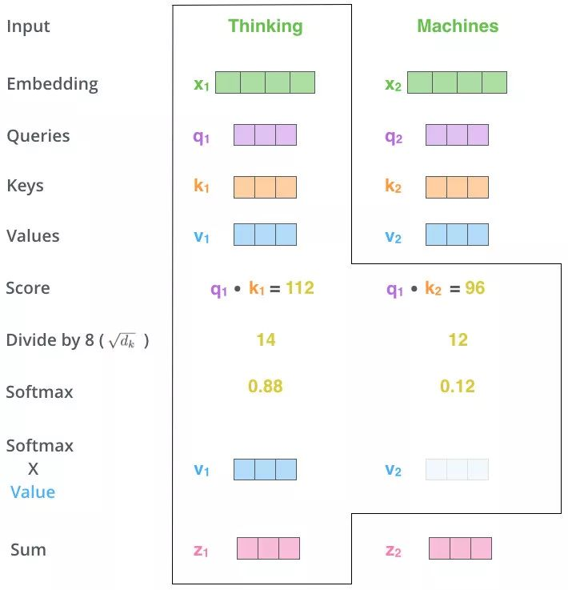

[Transformer详解 知冷](https://blog.csdn.net/weixin_42475060/article/details/121101749?ops_request_misc=%257B%2522request%255Fid%2522%253A%2522e6f97dbae3f600faee72ab22eb55b572%2522%252C%2522scm%2522%253A%252220140713.130102334..%2522%257D&request_id=e6f97dbae3f600faee72ab22eb55b572&biz_id=0&utm_medium=distribute.pc_search_result.none-task-blog-2~all~top_positive~default-1-121101749-null-null.142^v102^pc_search_result_base3&utm_term=transformer&spm=1018.2226.3001.4187)

[Transformer详解 空杯](https://blog.csdn.net/benzhujie1245com/article/details/117173090?ops_request_misc=%257B%2522request%255Fid%2522%253A%2522e6f97dbae3f600faee72ab22eb55b572%2522%252C%2522scm%2522%253A%252220140713.130102334..%2522%257D&request_id=e6f97dbae3f600faee72ab22eb55b572&biz_id=0&utm_medium=distribute.pc_search_result.none-task-blog-2~all~top_positive~default-2-117173090-null-null.142^v102^pc_search_result_base3&utm_term=transformer&spm=1018.2226.3001.4187)

整体架构

多头注意力流程

计算注意力分数流程

$\text{Attention}(Q, K, V) = \text{softmax}\left(\frac{QK^T}{\sqrt{d_k}}\right)V$
#### 注意力计算

QKV都是N*d的，tokens长度很长，被矩阵压缩到了d维度。然后计算注意力的时候，d维度是要被求和的。

QK的维度是N\*N的，然后softmax，每一行就是这一个token与所有token的注意力分数比重，依靠这个比重，合成所有的N个value。V的维度是N\*d的，然后再乘以V，得到N\*d的输出。

softmax之前要处以根号$d_k$因为键向量的维度是$d_k$，QK进行矩阵乘法之后，对$d_k$维度求和了，防止最大那个大的注意力值把小的掩盖（softmax计算占比的时候是指数计算，大的很大，小的很小。所以要求输入不能过大过小，不然梯度消失。）

#### 位置编码
$$PE_{(pos,2i)} = \sin\left(\frac{pos}{10000^{2i/d}}\right) \\ 
$$
$$
PE_{(pos,2i+1)} = \cos\left(\frac{pos}{10000^{2i/d}}\right)$$
这样的位置编码，假设embedding全是0，那么在只有position embeddiing的情况下，QK点积乘出来之后，是能看到相对位置信息的。因为全部都是$cos(\alpha - \beta)$形式

这样表示，相对位置为$\theta$的时候，通过一个旋转矩阵在角度空间可以表示出来。

#### 掩码注意力
- 防止学信息泄漏：
核心目的是限制模型对特定位置信息的访问，主要应用于生成式任务（如文本生成、机器翻译），确保模型在训练和推理时遵循自回归（autoregressive）特性，即每个位置的输出仅依赖于过去的信息，避免“偷看”未来。

- 应用因果掩码（Causal Mask）​，强制每个位置仅关注当前位置及之前的位置，屏蔽未来位置的信息。

- 并行处理：
尽管掩码限制了信息流，但模型仍可一次性处理整个序列（无需像RNN逐步计算），显著提升训练速度。

- ​教师强制（Teacher Forcing）​：
训练时使用真实目标序列作为输入（而非模型生成的历史），结合掩码确保每个位置的预测仅依赖过去真实词，避免误差累积。