# Claude Code 多智能体架构完全解析

## 第一部分：架构基础与核心概念

### 1.1 多智能体系统的三层架构

```
┌─────────────────────────────────────────────────────────┐
│                    用户交互层                             │
│              (User Interaction Layer)                    │
└────────────────────┬────────────────────────────────────┘
                     │
┌────────────────────▼────────────────────────────────────┐
│                  协调管理层                              │
│    (Coordination & Management Layer)                    │
│  • Leader Agent 决策                                    │
│  • 任务分配与调度                                        │
│  • 权限管理与同步                                        │
└────────────────────┬────────────────────────────────────┘
                     │
┌────────────────────▼────────────────────────────────────┐
│                  执行工作层                              │
│      (Execution & Worker Layer)                         │
│  • Teammate Agents 执行                                 │
│  • 本地状态维护                                          │
│  • 结果生成与回传                                        │
└─────────────────────────────────────────────────────────┘
```

---

## 第二部分：三种协作模式详解

### 2.1 Fork Subagent 模式

#### 2.1.1 架构特征

| 特征 | 描述 |
|------|------|
| **拓扑结构** | 树状层级（父子关系） |
| **通信方向** | 单向（子 → 父） |
| **上下文共享** | 完整继承 + Prompt Cache |
| **隔离级别** | 轻量级（同进程或子进程） |
| **适用场景** | 快速分身、并行任务、递归分解 |
| **性能** | 最快（<100ms 延迟） |
| **复杂度** | 低 |

#### 2.1.2 上下文处理机制

**上下文流向：**

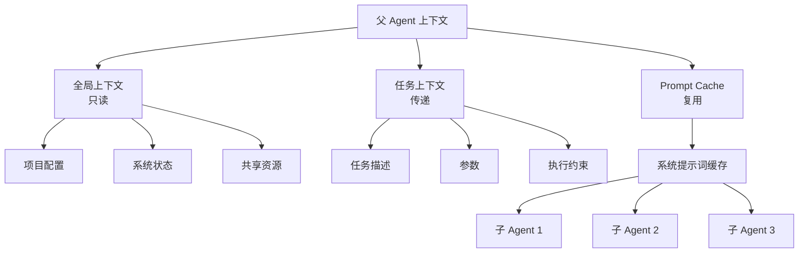
```mermaid
graph TD
    A["父 Agent 上下文"] --> B["全局上下文<br/>只读"]
    A --> C["任务上下文<br/>传递"]
    A --> D["Prompt Cache<br/>复用"]
    
    B --> B1["项目配置"]
    B --> B2["系统状态"]
    B --> B3["共享资源"]
    
    C --> C1["任务描述"]
    C --> C2["参数"]
    C --> C3["执行约束"]
    
    D --> D1["系统提示词缓存"]
    
    D1 --> E1["子 Agent 1"]
    D1 --> E2["子 Agent 2"]
    D1 --> E3["子 Agent 3"]
```

**上下文内容表：**

| 上下文类型 | 内容 | 访问权限 | 生命周期 |
|-----------|------|---------|---------|
| 全局上下文 | 项目路径、配置、系统状态 | 只读 | 整个 Team 生命周期 |
| 任务上下文 | 任务ID、描述、参数、超时 | 只读 | 单个任务执行期间 |
| 执行上下文 | 执行深度、重试次数、时间戳 | 读写 | 单个子Agent生命周期 |
| Prompt Cache | 系统提示词、指令集 | 只读 | 多个子Agent共享 |

#### 2.1.3 触发机制

**何时触发 Fork：**

| 触发条件 | 判断标准 | 示例 |
|---------|---------|------|
| 任务可分解 | 任务大小 > 阈值（如1000行代码） | 分析大型项目的多个模块 |
| 需要并行 | 子任务间无依赖关系 | 并行分析4个模块 |
| 递归分解 | 问题复杂度高 + 深度 < 限制 | 递归分解系统设计问题 |
| 隔离执行 | 需要避免状态污染 | 执行不信任的代码 |
| 性能优化 | 需要充分利用多核 | CPU密集型任务 |

**触发流程：**

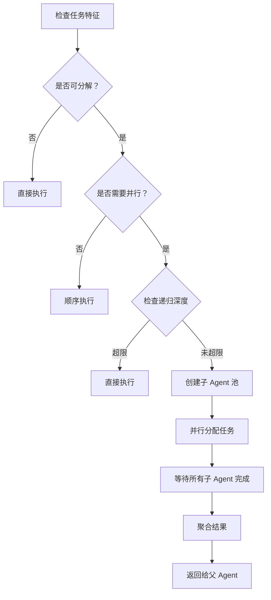
```mermaid
graph TD
    A["检查任务特征"] --> B{"是否可分解？"}
    B -->|否| C["直接执行"]
    B -->|是| D{"是否需要并行？"}
    D -->|否| E["顺序执行"]
    D -->|是| F{"检查递归深度"}
    F -->|超限| G["直接执行"]
    F -->|未超限| H["创建子 Agent 池"]
    H --> I["并行分配任务"]
    I --> J["等待所有子 Agent 完成"]
    J --> K["聚合结果"]
    K --> L["返回给父 Agent"]
```

#### 2.1.4 协作模式

**模式类型：**

| 模式 | 执行方式 | 通信方式 | 适用场景 |
|------|---------|---------|---------|
| 简单 Fork | 创建单个子Agent | 结果回传 | 单个子任务 |
| 并行 Fork | 创建多个子Agent | 批量结果回传 | 多个独立子任务 |
| 递归 Fork | 嵌套创建子Agent | 树状结果聚合 | 复杂问题分解 |
| 流水线 Fork | 按阶段创建子Agent | 阶段间结果传递 | 多阶段处理 |

**并行 Fork 的协作流程：**

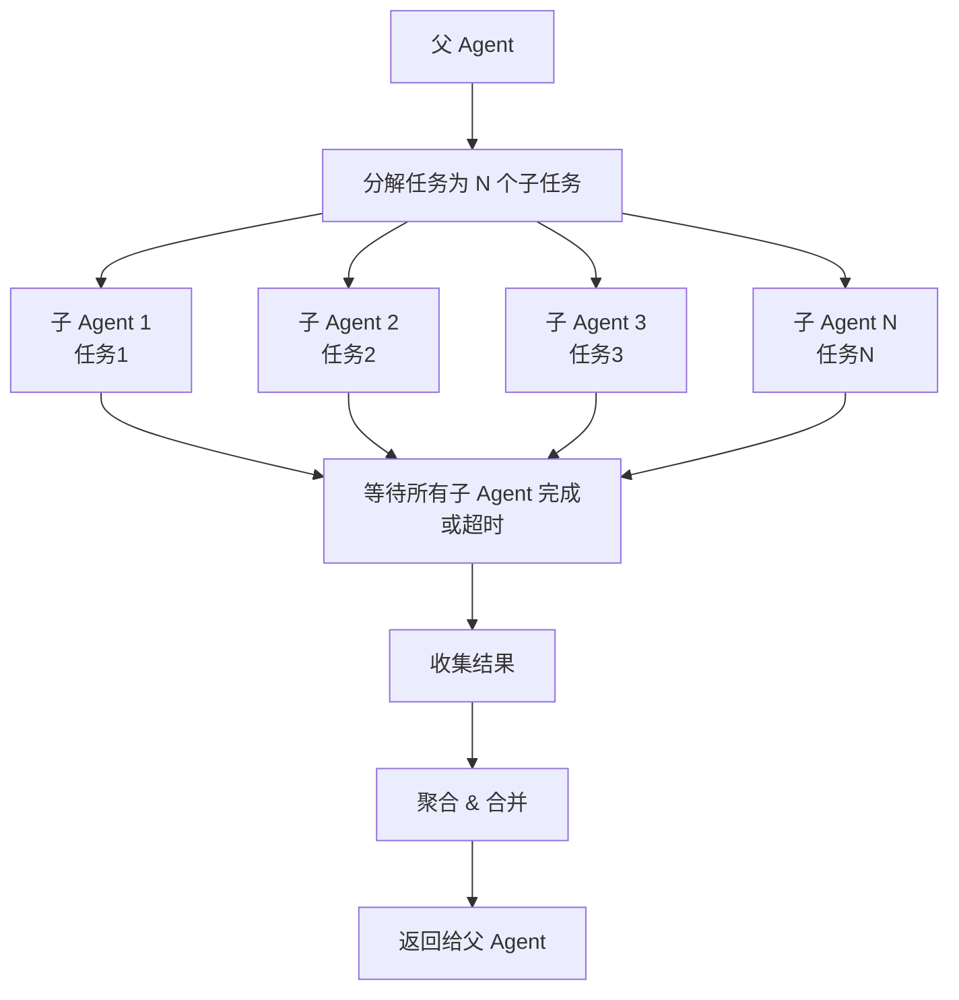
```mermaid
graph TD
    A["父 Agent"] --> B["分解任务为 N 个子任务"]
    B --> C1["子 Agent 1<br/>任务1"]
    B --> C2["子 Agent 2<br/>任务2"]
    B --> C3["子 Agent 3<br/>任务3"]
    B --> CN["子 Agent N<br/>任务N"]
    
    C1 --> D["等待所有子 Agent 完成<br/>或超时"]
    C2 --> D
    C3 --> D
    CN --> D
    
    D --> E["收集结果"]
    E --> F["聚合 & 合并"]
    F --> G["返回给父 Agent"]
```

#### 2.1.5 权限处理

**权限模型：**

| 权限类型 | 范围 | 继承规则 | 限制 |
|---------|------|---------|------|
| 文件访问 | 父Agent可访问的路径 | 完全继承 | 子Agent不能扩展 |
| 资源使用 | 内存、CPU、超时 | 继承 + 限制 | 子Agent受更严格限制 |
| 工具调用 | 父Agent可用的工具 | 完全继承 | 子Agent可用工具集相同 |
| 外部API | 父Agent的API密钥 | 继承（只读） | 子Agent不能修改 |

**权限检查流程：**

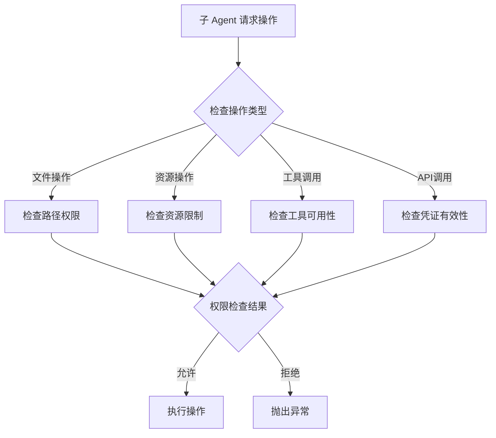
```mermaid
graph TD
    A["子 Agent 请求操作"] --> B{"检查操作类型"}
    B -->|文件操作| C["检查路径权限"]
    B -->|资源操作| D["检查资源限制"]
    B -->|工具调用| E["检查工具可用性"]
    B -->|API调用| F["检查凭证有效性"]
    
    C --> G{"权限检查结果"}
    D --> G
    E --> G
    F --> G
    
    G -->|允许| H["执行操作"]
    G -->|拒绝| I["抛出异常"]
```

#### 2.1.6 消息同步与歧义消除

**消息格式标准化：**

| 字段 | 类型 | 用途 | 示例 |
|------|------|------|------|
| taskId | UUID | 唯一标识任务 | task_001_abc123 |
| parentId | UUID | 追踪父子关系 | parent_task_xyz |
| depth | Integer | 递归深度 | 2 |
| timestamp | Long | 时间戳 | 1713607200000 |
| status | Enum | 执行状态 | started/completed/failed |
| result | Object | 执行结果 | {...} |
| metadata | Object | 元数据 | {executionTime: 5000, ...} |

**消息同步机制：**

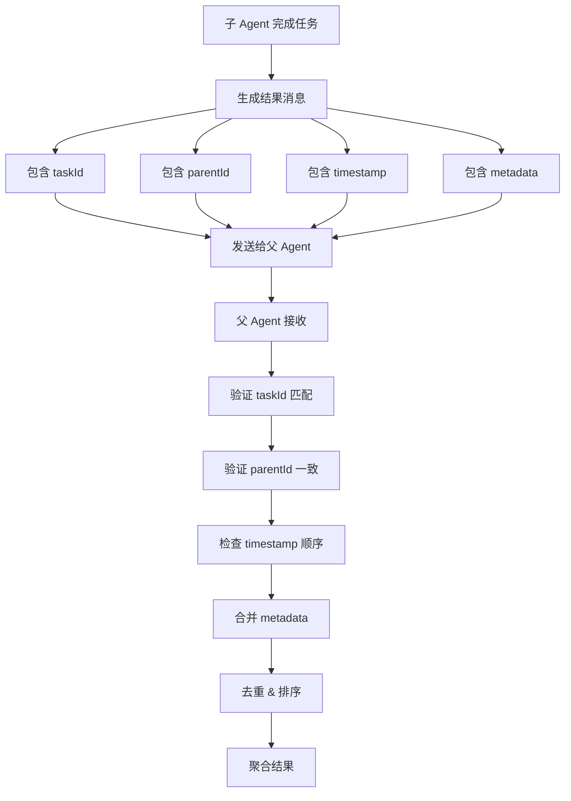
```mermaid
graph TD
    A["子 Agent 完成任务"] --> B["生成结果消息"]
    B --> B1["包含 taskId"]
    B --> B2["包含 parentId"]
    B --> B3["包含 timestamp"]
    B --> B4["包含 metadata"]
    
    B1 --> C["发送给父 Agent"]
    B2 --> C
    B3 --> C
    B4 --> C
    
    C --> D["父 Agent 接收"]
    D --> E["验证 taskId 匹配"]
    E --> F["验证 parentId 一致"]
    F --> G["检查 timestamp 顺序"]
    G --> H["合并 metadata"]
    
    H --> I["去重 & 排序"]
    I --> J["聚合结果"]
```

**歧义消除策略：**

| 歧义类型 | 原因 | 消除方法 |
|---------|------|---------|
| 结果顺序混乱 | 并行执行导致 | 使用 taskId 重新排序 |
| 重复结果 | 网络重传或重试 | 使用 timestamp + taskId 去重 |
| 结果不完整 | 子Agent超时 | 使用 depth + parentId 追踪 |
| 版本冲突 | 多次重试 | 使用 retryCount + timestamp 选择最新 |

#### 2.1.7 隐性决策同步

**隐性决策的类型：**

| 决策类型 | 决策者 | 影响范围 | 同步方式 |
|---------|-------|---------|---------|
| 任务分解策略 | 父Agent | 所有子Agent | 通过任务参数传递 |
| 并发度 | 父Agent | 子Agent数量 | 通过 maxConcurrent 参数 |
| 超时策略 | 父Agent | 单个子Agent超时 | 通过 timeout 参数 |
| 重试策略 | 父Agent | 失败重试次数 | 通过 maxRetries 参数 |
| 结果聚合方式 | 父Agent | 结果合并逻辑 | 通过 aggregationStrategy 参数 |

**隐性决策同步流程：**

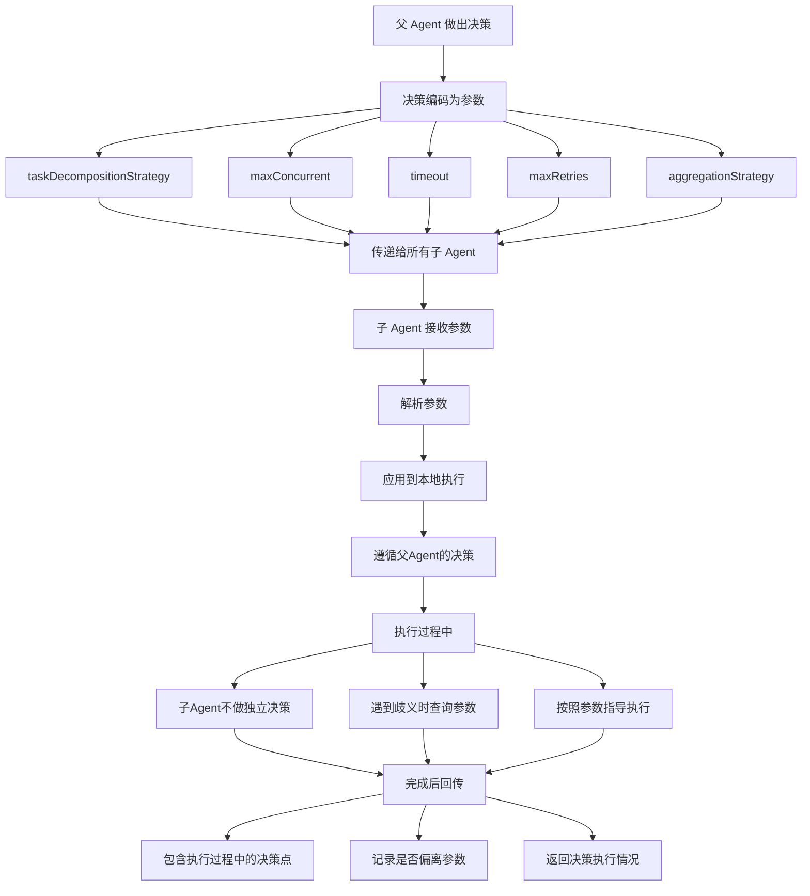
```mermaid
graph TD
    A["父 Agent 做出决策"] --> B["决策编码为参数"]
    B --> B1["taskDecompositionStrategy"]
    B --> B2["maxConcurrent"]
    B --> B3["timeout"]
    B --> B4["maxRetries"]
    B --> B5["aggregationStrategy"]
    
    B1 --> C["传递给所有子 Agent"]
    B2 --> C
    B3 --> C
    B4 --> C
    B5 --> C
    
    C --> D["子 Agent 接收参数"]
    D --> E["解析参数"]
    E --> F["应用到本地执行"]
    F --> G["遵循父Agent的决策"]
    
    G --> H["执行过程中"]
    H --> H1["子Agent不做独立决策"]
    H --> H2["遇到歧义时查询参数"]
    H --> H3["按照参数指导执行"]
    
    H1 --> I["完成后回传"]
    H2 --> I
    H3 --> I
    
    I --> I1["包含执行过程中的决策点"]
    I --> I2["记录是否偏离参数"]
    I --> I3["返回决策执行情况"]
```

#### 2.1.8 分工编排与决策权

**分工编排模型：**

```
父 Agent（决策者）
    ├─ 决策权：任务分解、并发度、超时、重试
    ├─ 执行权：无（仅协调）
    └─ 监督权：监控所有子Agent
    
子 Agent（执行者）
    ├─ 决策权：无（遵循父Agent参数）
    ├─ 执行权：完全（按参数执行任务）
    └─ 监督权：无
```

**决策权分配表：**

| 决策项 | 父Agent | 子Agent | 说明 |
|-------|--------|--------|------|
| 任务分解 | ✓ | ✗ | 父Agent决定如何分解 |
| 并发度 | ✓ | ✗ | 父Agent决定并发数 |
| 超时时间 | ✓ | ✗ | 父Agent设置超时 |
| 重试策略 | ✓ | ✗ | 父Agent决定重试 |
| 执行方式 | ✗ | ✓ | 子Agent决定如何执行 |
| 资源分配 | ✗ | ✓ | 子Agent分配本地资源 |
| 错误处理 | ✓ | ✓ | 共同决策（参数+执行） |

#### 2.1.9 通信决策机制

**何时通信：**

| 通信时机 | 触发条件 | 通信内容 | 频率 |
|---------|---------|---------|------|
| 任务分配 | 父Agent fork子Agent | 任务描述、参数、上下文 | 1次 |
| 进度更新 | 子Agent定期报告 | 进度百分比、当前步骤 | 可选 |
| 结果回传 | 子Agent完成任务 | 结果、元数据、执行信息 | 1次 |
| 异常报告 | 子Agent遇到错误 | 错误类型、堆栈、建议 | 按需 |

**通信内容规范：**

```
任务分配消息
├─ taskId: 唯一标识
├─ parentId: 父Agent标识
├─ taskDescription: 任务描述
├─ parameters: 执行参数
├─ context: 上下文信息
├─ constraints: 执行约束
└─ deadline: 截止时间

结果回传消息
├─ taskId: 对应的任务ID
├─ status: 执行状态
├─ result: 执行结果
├─ metadata: 执行元数据
│   ├─ executionTime: 执行时间
│   ├─ memoryUsed: 内存使用
│   ├─ tokensUsed: Token使用
│   └─ retryCount: 重试次数
└─ timestamp: 完成时间戳
```

**共享内容：**

| 内容类型 | 共享方向 | 共享时机 | 访问权限 |
|---------|---------|---------|---------|
| 全局配置 | 父→子 | 任务分配时 | 只读 |
| 任务参数 | 父→子 | 任务分配时 | 只读 |
| 执行结果 | 子→父 | 任务完成时 | 只读 |
| 错误信息 | 子→父 | 异常发生时 | 只读 |
| 中间状态 | 子→父 | 定期报告 | 只读 |

#### 2.1.10 任务完成判断

**完成条件：**

| 条件 | 判断标准 | 验证方法 |
|------|---------|---------|
| 所有子Agent完成 | 所有taskId都收到结果 | 检查结果集大小 == 子Agent数 |
| 结果有效性 | 结果格式正确、数据完整 | 验证result字段非空 |
| 时间约束 | 总执行时间 < deadline | 比较timestamp与deadline |
| 错误处理 | 失败任务已重试或标记 | 检查retryCount或status |
| 结果聚合 | 所有结果已合并 | 验证aggregatedResult非空 |

**完成判断流程：**

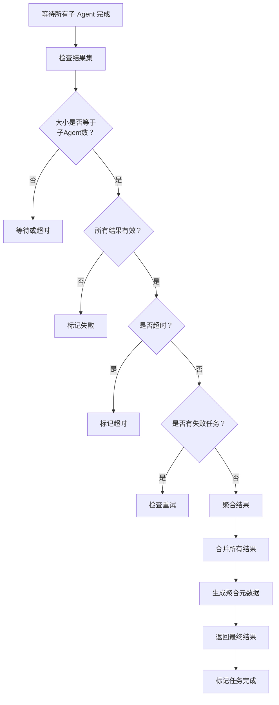
```mermaid
graph TD
    A["等待所有子 Agent 完成"] --> B["检查结果集"]
    B --> C{"大小是否等于<br/>子Agent数？"}
    C -->|否| D["等待或超时"]
    C -->|是| E{"所有结果有效？"}
    E -->|否| F["标记失败"]
    E -->|是| G{"是否超时？"}
    G -->|是| H["标记超时"]
    G -->|否| I{"是否有失败任务？"}
    I -->|是| J["检查重试"]
    I -->|否| K["聚合结果"]
    
    K --> L["合并所有结果"]
    L --> M["生成聚合元数据"]
    M --> N["返回最终结果"]
    N --> O["标记任务完成"]
```

---

## 第三部分：Coordinator Mode 模式

### 3.1 架构特征

| 特征 | 描述 |
|------|------|
| **拓扑结构** | 星型（中心化） |
| **通信方向** | 双向（Coordinator ↔ Worker） |
| **上下文共享** | 三层分离（全局、任务、本地） |
| **隔离级别** | 完全隔离（独立会话） |
| **适用场景** | 项目管理、任务分配、团队协作 |
| **性能** | 中等（200-500ms 延迟） |
| **复杂度** | 中 |

### 3.2 上下文处理机制

**三层上下文架构：**

```
全局上下文（Coordinator 维护）
├─ 项目配置
├─ 系统状态
├─ 共享资源
├─ Worker 注册表
└─ 任务队列
    ↓
任务上下文（随任务传递）
├─ 任务ID
├─ 任务描述
├─ 执行参数
├─ 优先级
├─ 依赖关系
└─ 截止时间
    ↓
Worker 本地上下文（Worker 独立维护）
├─ Worker ID
├─ 能力集合
├─ 当前任务
├─ 本地状态
└─ 执行历史
```

**上下文访问权限：**

| 上下文层 | Coordinator | Worker | 说明 |
|---------|-----------|--------|------|
| 全局上下文 | 读写 | 只读 | Worker不能修改全局配置 |
| 任务上下文 | 读写 | 只读 | Worker接收任务但不能修改 |
| 本地上下文 | 无 | 读写 | 完全隔离，Coordinator无法访问 |

**上下文传递流程：**

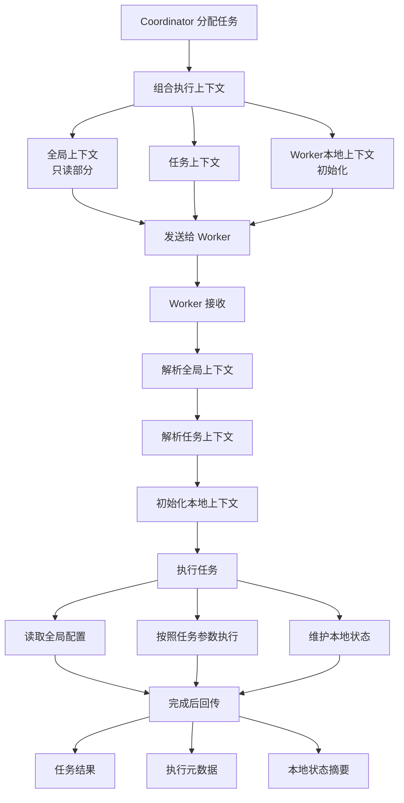
```mermaid
graph TD
    A["Coordinator 分配任务"] --> B["组合执行上下文"]
    B --> B1["全局上下文<br/>只读部分"]
    B --> B2["任务上下文"]
    B --> B3["Worker本地上下文<br/>初始化"]
    
    B1 --> C["发送给 Worker"]
    B2 --> C
    B3 --> C
    
    C --> D["Worker 接收"]
    D --> E["解析全局上下文"]
    E --> F["解析任务上下文"]
    F --> G["初始化本地上下文"]
    
    G --> H["执行任务"]
    H --> H1["读取全局配置"]
    H --> H2["按照任务参数执行"]
    H --> H3["维护本地状态"]
    
    H1 --> I["完成后回传"]
    H2 --> I
    H3 --> I
    
    I --> I1["任务结果"]
    I --> I2["执行元数据"]
    I --> I3["本地状态摘要"]
```

### 3.3 触发机制

**何时使用 Coordinator Mode：**

| 触发条件 | 判断标准 | 示例 |
|---------|---------|------|
| 多Worker协作 | Worker数量 > 1 | 前后端并行开发 |
| 任务依赖 | 任务间有依赖关系 | 后端完成后前端开始 |
| 中心化管理 | 需要统一调度 | 项目经理分配任务 |
| 异步执行 | Worker执行时间长 | 长时间运行的测试 |
| 动态分配 | 任务数量不确定 | 根据进度动态分配 |

**触发流程：**

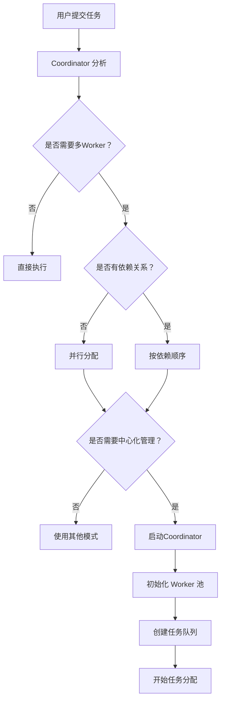
```mermaid
graph TD
    A["用户提交任务"] --> B["Coordinator 分析"]
    B --> C{"是否需要多Worker？"}
    C -->|否| D["直接执行"]
    C -->|是| E{"是否有依赖关系？"}
    E -->|否| F["并行分配"]
    E -->|是| G["按依赖顺序"]
    
    F --> H{"是否需要中心化管理？"}
    G --> H
    H -->|否| I["使用其他模式"]
    H -->|是| J["启动Coordinator"]
    
    J --> K["初始化 Worker 池"]
    K --> L["创建任务队列"]
    L --> M["开始任务分配"]
```

### 3.4 协作模式

**Coordinator 与 Worker 的协作模式：**

| 模式 | 执行方式 | 通信方式 | 适用场景 |
|------|---------|---------|---------|
| 顺序执行 | 任务按顺序分配 | 同步等待 | 有依赖的任务 |
| 并行执行 | 任务同时分配 | 异步回传 | 独立的任务 |
| 流水线 | 分阶段执行 | 阶段间同步 | 多阶段处理 |
| 动态调度 | 根据进度分配 | 实时通信 | 任务数量不确定 |

**并行执行的协作流程：**

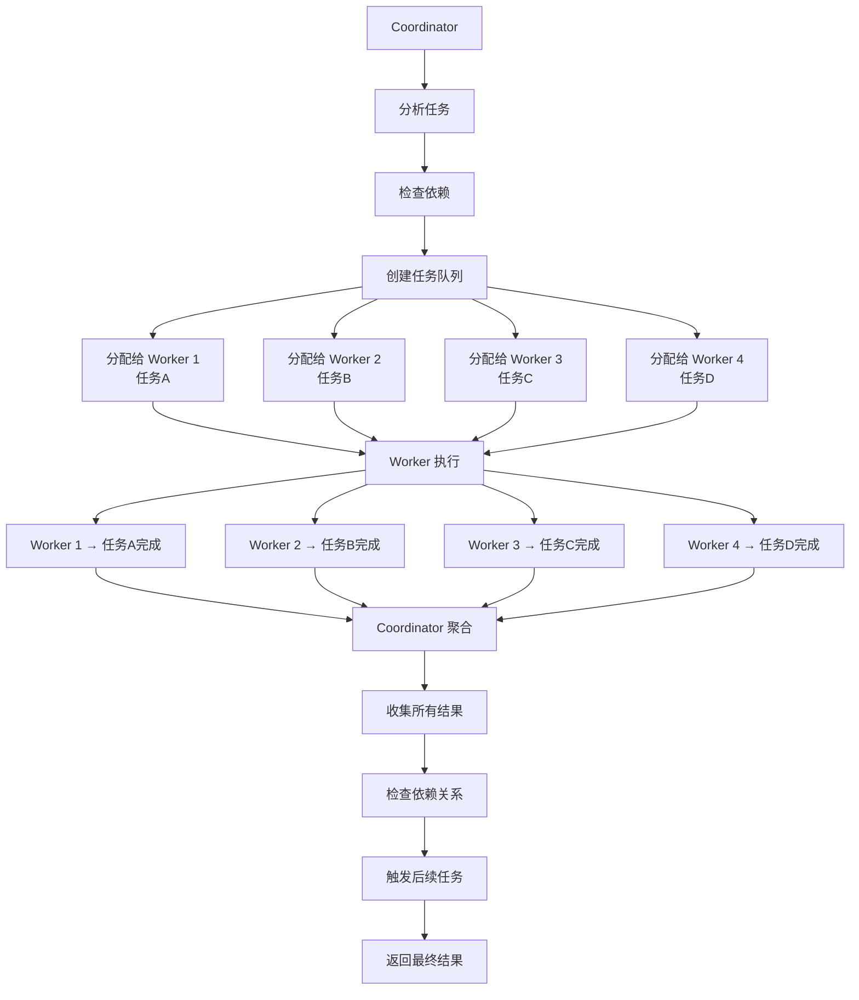
```mermaid
graph TD
    A["Coordinator"] --> B["分析任务"]
    B --> C["检查依赖"]
    C --> D["创建任务队列"]
    
    D --> E1["分配给 Worker 1<br/>任务A"]
    D --> E2["分配给 Worker 2<br/>任务B"]
    D --> E3["分配给 Worker 3<br/>任务C"]
    D --> E4["分配给 Worker 4<br/>任务D"]
    
    E1 --> F["Worker 执行"]
    E2 --> F
    E3 --> F
    E4 --> F
    
    F --> G1["Worker 1 → 任务A完成"]
    F --> G2["Worker 2 → 任务B完成"]
    F --> G3["Worker 3 → 任务C完成"]
    F --> G4["Worker 4 → 任务D完成"]
    
    G1 --> H["Coordinator 聚合"]
    G2 --> H
    G3 --> H
    G4 --> H
    
    H --> I["收集所有结果"]
    I --> J["检查依赖关系"]
    J --> K["触发后续任务"]
    K --> L["返回最终结果"]
```

### 3.5 权限处理

**权限模型：**

| 权限类型 | 授予者 | 持有者 | 有效期 | 验证方式 |
|---------|-------|-------|-------|---------|
| 文件读写 | Coordinator | Worker | 任务期间 | 路径检查 |
| 资源使用 | Coordinator | Worker | 任务期间 | 配额检查 |
| 工具调用 | Coordinator | Worker | 任务期间 | 能力检查 |
| API访问 | Coordinator | Worker | 任务期间 | 凭证检查 |

**权限请求流程：**

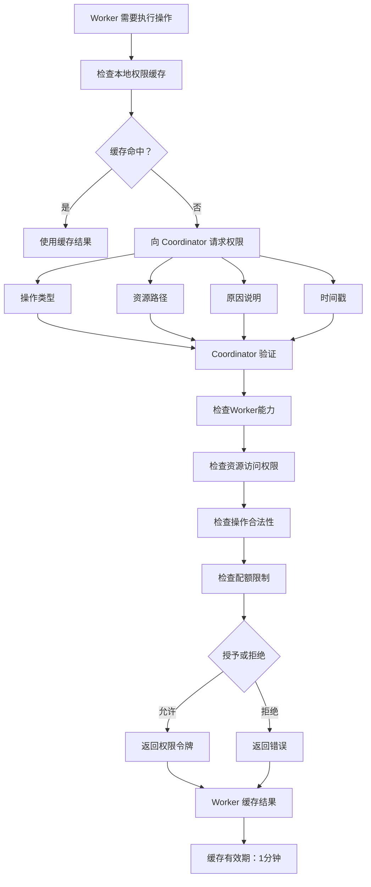
```mermaid
graph TD
    A["Worker 需要执行操作"] --> B["检查本地权限缓存"]
    B --> C{"缓存命中？"}
    C -->|是| D["使用缓存结果"]
    C -->|否| E["向 Coordinator 请求权限"]
    
    E --> E1["操作类型"]
    E --> E2["资源路径"]
    E --> E3["原因说明"]
    E --> E4["时间戳"]
    
    E1 --> F["Coordinator 验证"]
    E2 --> F
    E3 --> F
    E4 --> F
    
    F --> G["检查Worker能力"]
    G --> H["检查资源访问权限"]
    H --> I["检查操作合法性"]
    I --> J["检查配额限制"]
    
    J --> K{"授予或拒绝"}
    K -->|允许| L["返回权限令牌"]
    K -->|拒绝| M["返回错误"]
    
    L --> N["Worker 缓存结果"]
    M --> N
    
    N --> O["缓存有效期：1分钟"]
```

**权限检查表：**

| 操作类型 | 检查项 | 失败处理 |
|---------|-------|---------|
| 文件读 | 路径权限、文件存在 | 返回权限错误 |
| 文件写 | 路径权限、磁盘空间 | 返回权限错误 |
| 工具调用 | 工具在能力集中 | 返回不支持错误 |
| API调用 | 凭证有效、配额充足 | 返回认证错误 |
| 资源使用 | 内存、CPU、超时 | 返回资源错误 |

### 3.6 消息同步与歧义消除

**XML 任务通知格式：**

```
任务开始通知
├─ taskId: 任务唯一标识
├─ workerId: Worker标识
├─ status: "started"
├─ timestamp: 开始时间戳
└─ metadata: 初始元数据

任务进度通知
├─ taskId: 任务ID
├─ workerId: Worker标识
├─ status: "in_progress"
├─ progress: 进度百分比
├─ currentStep: 当前步骤
├─ estimatedTimeRemaining: 预计剩余时间
└─ timestamp: 更新时间戳

任务完成通知
├─ taskId: 任务ID
├─ workerId: Worker标识
├─ status: "completed"
├─ result: 执行结果
├─ metadata: 执行元数据
│   ├─ executionTime: 执行时间
│   ├─ memoryUsage: 内存使用
│   ├─ tokensUsed: Token使用
│   └─ retryCount: 重试次数
└─ timestamp: 完成时间戳

任务失败通知
├─ taskId: 任务ID
├─ workerId: Worker标识
├─ status: "failed"
├─ error: 错误信息
│   ├─ code: 错误代码
│   ├─ message: 错误描述
│   └─ stackTrace: 堆栈信息
├─ metadata: 失败元数据
│   ├─ executionTime: 执行时间
│   └─ retryCount: 重试次数
└─ timestamp: 失败时间戳
```

**消息同步机制：**

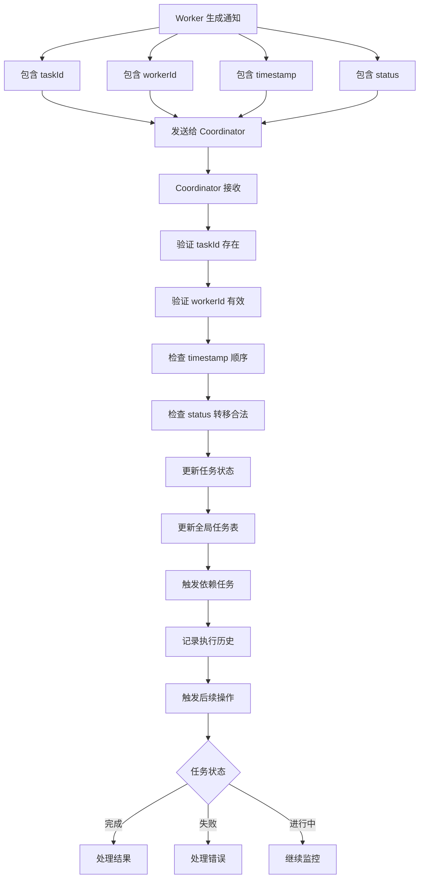
```mermaid
graph TD
    A["Worker 生成通知"] --> B["包含 taskId"]
    A --> C["包含 workerId"]
    A --> D["包含 timestamp"]
    A --> E["包含 status"]
    
    B --> F["发送给 Coordinator"]
    C --> F
    D --> F
    E --> F
    
    F --> G["Coordinator 接收"]
    G --> H["验证 taskId 存在"]
    H --> I["验证 workerId 有效"]
    I --> J["检查 timestamp 顺序"]
    J --> K["检查 status 转移合法"]
    
    K --> L["更新任务状态"]
    L --> M["更新全局任务表"]
    M --> N["触发依赖任务"]
    N --> O["记录执行历史"]
    
    O --> P["触发后续操作"]
    P --> P1{"任务状态"}
    P1 -->|完成| Q["处理结果"]
    P1 -->|失败| R["处理错误"]
    P1 -->|进行中| S["继续监控"]
```

**歧义消除策略：**

| 歧义类型 | 原因 | 消除方法 |
|---------|------|---------|
| 重复通知 | 网络重传 | 使用 taskId + timestamp 去重 |
| 通知乱序 | 网络延迟 | 使用 timestamp 重新排序 |
| 状态冲突 | 并发更新 | 使用 status 转移验证 |
| 结果不一致 | 重试导致 | 使用 retryCount + timestamp 选择最新 |
| 超时判断 | 通知延迟 | 使用 deadline 与 timestamp 比较 |

### 3.7 隐性决策同步

**隐性决策的类型：**

| 决策类型 | 决策者 | 影响范围 | 同步方式 |
|---------|-------|---------|---------|
| 任务分配策略 | Coordinator | 所有Worker | 通过任务分配消息 |
| 优先级处理 | Coordinator | 任务队列 | 通过优先级字段 |
| 超时策略 | Coordinator | 单个任务 | 通过deadline字段 |
| 重试策略 | Coordinator | 失败任务 | 通过maxRetries字段 |
| 依赖处理 | Coordinator | 任务链 | 通过dependencies字段 |
| 资源分配 | Coordinator | Worker池 | 通过能力匹配 |

**隐性决策同步流程：**

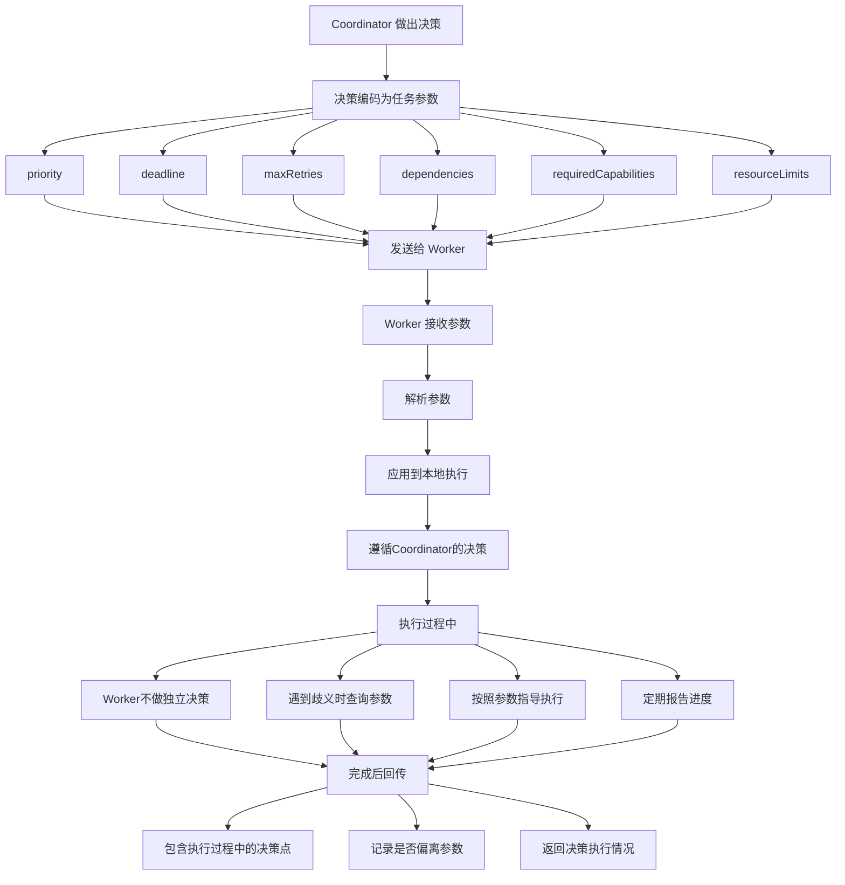
```mermaid
graph TD
    A["Coordinator 做出决策"] --> B["决策编码为任务参数"]
    B --> B1["priority"]
    B --> B2["deadline"]
    B --> B3["maxRetries"]
    B --> B4["dependencies"]
    B --> B5["requiredCapabilities"]
    B --> B6["resourceLimits"]
    
    B1 --> C["发送给 Worker"]
    B2 --> C
    B3 --> C
    B4 --> C
    B5 --> C
    B6 --> C
    
    C --> D["Worker 接收参数"]
    D --> E["解析参数"]
    E --> F["应用到本地执行"]
    F --> G["遵循Coordinator的决策"]
    
    G --> H["执行过程中"]
    H --> H1["Worker不做独立决策"]
    H --> H2["遇到歧义时查询参数"]
    H --> H3["按照参数指导执行"]
    H --> H4["定期报告进度"]
    
    H1 --> I["完成后回传"]
    H2 --> I
    H3 --> I
    H4 --> I
    
    I --> I1["包含执行过程中的决策点"]
    I --> I2["记录是否偏离参数"]
    I --> I3["返回决策执行情况"]
```

### 3.8 分工编排与决策权

**分工编排模型：**

```
Coordinator（决策者 & 协调者）
├─ 决策权：任务分配、优先级、超时、重试、依赖处理
├─ 执行权：无（仅协调）
├─ 监督权：监控所有Worker
└─ 权限管理：授予/撤销Worker权限

Worker（执行者）
├─ 决策权：无（遵循Coordinator参数）
├─ 执行权：完全（按参数执行任务）
├─ 监督权：无
└─ 权限请求：向Coordinator请求权限
```

**决策权分配表：**

| 决策项 | Coordinator | Worker | 说明 |
|-------|-----------|--------|------|
| 任务分配 | ✓ | ✗ | Coordinator决定谁做什么 |
| 优先级 | ✓ | ✗ | Coordinator设置优先级 |
| 超时时间 | ✓ | ✗ | Coordinator设置deadline |
| 重试策略 | ✓ | ✗ | Coordinator决定重试 |
| 依赖处理 | ✓ | ✗ | Coordinator管理依赖 |
| 执行方式 | ✗ | ✓ | Worker决定如何执行 |
| 资源分配 | ✗ | ✓ | Worker分配本地资源 |
| 权限请求 | ✓ | ✓ | 共同决策（授予+请求） |

### 3.9 通信决策机制

**何时通信：**

| 通信时机 | 触发条件 | 通信内容 | 频率 |
|---------|---------|---------|------|
| 任务分配 | Coordinator分配任务 | 任务描述、参数、上下文 | 1次 |
| 进度更新 | Worker定期报告 | 进度百分比、当前步骤 | 可配置 |
| 权限请求 | Worker需要权限 | 操作类型、资源、原因 | 按需 |
| 结果回传 | Worker完成任务 | 结果、元数据、执行信息 | 1次 |
| 异常报告 | Worker遇到错误 | 错误类型、堆栈、建议 | 按需 |
| 心跳检测 | 定期检查 | Worker状态、资源使用 | 周期性 |

**通信内容规范：**

```
任务分配消息
├─ taskId: 唯一标识
├─ taskDescription: 任务描述
├─ parameters: 执行参数
├─ context: 上下文信息
├─ constraints: 执行约束
├─ deadline: 截止时间
├─ priority: 优先级
├─ dependencies: 依赖任务
└─ requiredCapabilities: 所需能力

权限请求消息
├─ workerId: Worker标识
├─ action: 操作类型
├─ resource: 资源路径
├─ reason: 原因说明
└─ timestamp: 请求时间

结果回传消息
├─ taskId: 对应的任务ID
├─ workerId: Worker标识
├─ status: 执行状态
├─ result: 执行结果
├─ metadata: 执行元数据
│   ├─ executionTime: 执行时间
│   ├─ memoryUsed: 内存使用
│   ├─ tokensUsed: Token使用
│   └─ retryCount: 重试次数
└─ timestamp: 完成时间戳
```

**共享内容：**

| 内容类型 | 共享方向 | 共享时机 | 访问权限 |
|---------|---------|---------|---------|
| 全局配置 | Coordinator→Worker | 任务分配时 | 只读 |
| 任务参数 | Coordinator→Worker | 任务分配时 | 只读 |
| 执行结果 | Worker→Coordinator | 任务完成时 | 只读 |
| 错误信息 | Worker→Coordinator | 异常发生时 | 只读 |
| 进度信息 | Worker→Coordinator | 定期报告 | 只读 |
| 权限令牌 | Coordinator→Worker | 权限授予时 | 有效期限制 |

### 3.10 任务完成判断

**完成条件：**

| 条件 | 判断标准 | 验证方法 |
|------|---------|---------|
| 所有任务完成 | 所有taskId都收到完成通知 | 检查任务状态表 |
| 结果有效性 | 结果格式正确、数据完整 | 验证result字段 |
| 时间约束 | 总执行时间 < deadline | 比较timestamp与deadline |
| 依赖满足 | 所有依赖任务已完成 | 检查依赖关系图 |
| 错误处理 | 失败任务已重试或标记 | 检查retryCount或status |

**完成判断流程：**

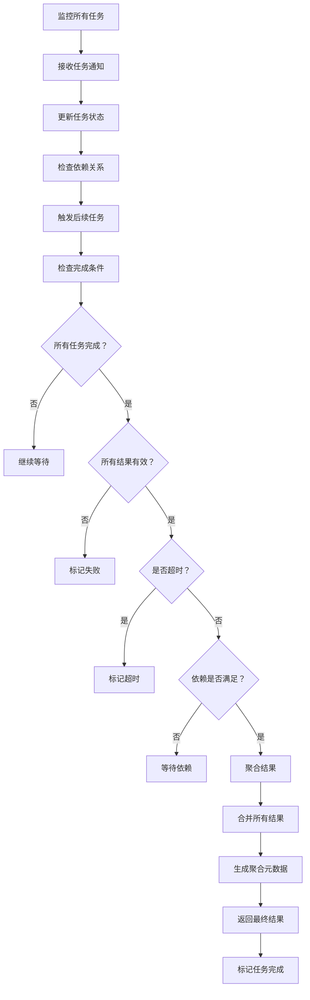
```mermaid
graph TD
    A["监控所有任务"] --> B["接收任务通知"]
    B --> C["更新任务状态"]
    C --> D["检查依赖关系"]
    D --> E["触发后续任务"]
    
    E --> F["检查完成条件"]
    F --> G{"所有任务完成？"}
    G -->|否| H["继续等待"]
    G -->|是| I{"所有结果有效？"}
    I -->|否| J["标记失败"]
    I -->|是| K{"是否超时？"}
    K -->|是| L["标记超时"]
    K -->|否| M{"依赖是否满足？"}
    M -->|否| N["等待依赖"]
    M -->|是| O["聚合结果"]
    
    O --> P["合并所有结果"]
    P --> Q["生成聚合元数据"]
    Q --> R["返回最终结果"]
    R --> S["标记任务完成"]
```

---

## 第四部分：Agent Swarms/Teams 模式

### 4.1 架构特征

| 特征 | 描述 |
|------|------|
| **拓扑结构** | 网格型（弱中心化） |
| **通信方向** | 多向（任意Agent间） |
| **上下文共享** | 独立会话 + 邮箱系统 |
| **隔离级别** | 完全隔离（独立进程） |
| **适用场景** | 复杂协作、多角色、自主决策 |
| **性能** | 灵活（300-800ms 延迟） |
| **复杂度** | 高 |

### 4.2 通信决策机制

**何时通信：**

| 通信时机 | 触发条件 | 通信内容 | 频率 |
|---------|---------|---------|------|
| 初始化 | Leader启动 | 任务、协议、规则 | 1次 |
| 主动通信 | Teammate完成阶段 | 结果、发现、建议 | 按需 |
| 被动通信 | 其他Teammate请求 | 信息、数据、反馈 | 按需 |
| 广播通信 | 重要信息 | 状态更新、警告 | 按需 |
| 进度报告 | 定期检查 | 进度、状态、资源 | 周期性 |

**共享内容规范：**

| 内容类型 | 共享方向 | 共享时机 | 访问权限 |
|---------|---------|---------|---------|
| 任务描述 | Leader→所有 | 初始化时 | 只读 |
| 协作规则 | Leader→所有 | 初始化时 | 只读 |
| 执行结果 | Teammate→所有 | 完成时 | 只读 |
| 进度信息 | Teammate→所有 | 定期报告 | 只读 |
| 错误信息 | Teammate→所有 | 异常时 | 只读 |
| 建议反馈 | Teammate→所有 | 按需 | 只读 |

### 4.3 任务完成判断

**完成条件：**

| 条件 | 判断标准 | 验证方法 |
|------|---------|---------|
| 所有Teammate完成 | 所有Teammate都报告完成 | 检查完成状态表 |
| 结果有效性 | 结果格式正确、数据完整 | 验证result字段 |
| 协作完成 | 所有必要的通信已完成 | 检查对话历史 |
| 时间约束 | 总执行时间 < deadline | 比较timestamp与deadline |
| 质量标准 | 结果满足质量要求 | 验证质量指标 |

---

## 第五部分：三种模式对比与选择

### 5.1 详细对比表

| 维度 | Fork Subagent | Coordinator Mode | Agent Swarms/Teams |
|------|--------------|-----------------|-------------------|
| **架构** | 树状 | 星型 | 网格型 |
| **拓扑** | 父子关系 | 中心化 | 弱中心化 |
| **通信** | 单向（子→父） | 双向（中心↔边缘） | 多向（任意间） |
| **上下文** | 完整继承 | 三层分离 | 独立会话 |
| **隔离** | 轻量级 | 完全隔离 | 完全隔离 |
| **延迟** | <100ms | 200-500ms | 300-800ms |
| **吞吐量** | 1000+ TPS | 100-500 TPS | 50-200 TPS |
| **内存** | 低 | 中 | 高 |
| **可扩展性** | 有限 | 中等 | 高 |
| **复杂度** | 低 | 中 | 高 |
| **学习曲线** | 平缓 | 中等 | 陡峭 |
| **调试难度** | 简单 | 中等 | 困难 |

### 5.2 选择决策树

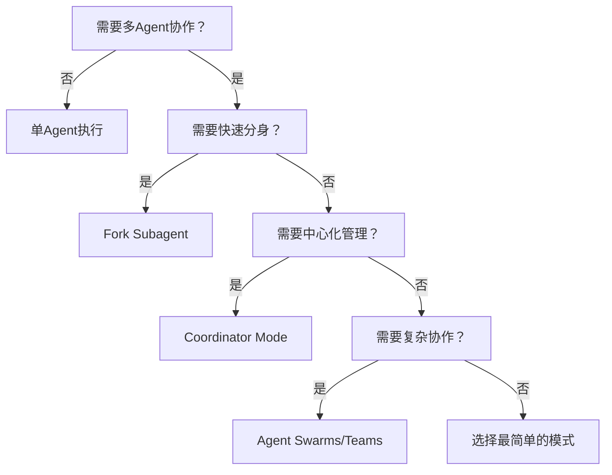
```mermaid
graph TD
    A["需要多Agent协作？"] -->|否| B["单Agent执行"]
    A -->|是| C["需要快速分身？"]
    C -->|是| D["Fork Subagent"]
    C -->|否| E["需要中心化管理？"]
    E -->|是| F["Coordinator Mode"]
    E -->|否| G["需要复杂协作？"]
    G -->|是| H["Agent Swarms/Teams"]
    G -->|否| I["选择最简单的模式"]
```

### 5.3 场景选择指南

**选择 Fork Subagent 的场景：**

- 需要快速分析大型代码库（>10000行）
- 任务可以完全分解为独立子任务
- 需要充分利用多核CPU
- 对延迟敏感（<100ms）
- 子任务间无复杂依赖

**选择 Coordinator Mode 的场景：**

- 需要项目经理式的中心化管理
- 任务间有明确的依赖关系
- 需要统一的权限管理
- Worker数量相对固定（<20）
- 需要清晰的任务分配和监控

**选择 Agent Swarms/Teams 的场景：**

- 需要多角色的复杂协作
- Agent需要自主决策和判断
- Agent间需要频繁的直接通信
- 流程不固定，需要灵活调整
- 需要高度的可扩展性（>20个Agent）

### 5.4 混合使用策略

**混合模式 1：Coordinator + Fork**

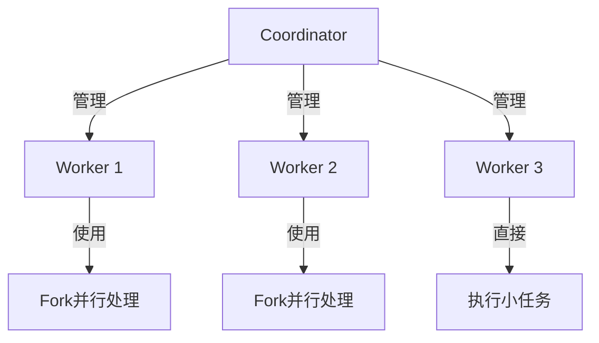
```mermaid
graph TB
    A["Coordinator"] -->|管理| B["Worker 1"]
    A -->|管理| C["Worker 2"]
    A -->|管理| D["Worker 3"]
    B -->|使用| E["Fork并行处理"]
    C -->|使用| F["Fork并行处理"]
    D -->|直接| G["执行小任务"]
```

**混合模式 2：Swarms + Coordinator**

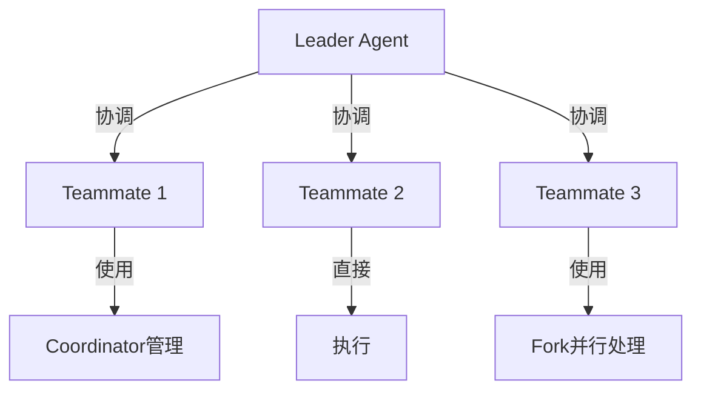
```mermaid
graph TB
    A["Leader Agent"] -->|协调| B["Teammate 1"]
    A -->|协调| C["Teammate 2"]
    A -->|协调| D["Teammate 3"]
    B -->|使用| E["Coordinator管理"]
    C -->|直接| F["执行"]
    D -->|使用| G["Fork并行处理"]
```

---

## 第六部分：最佳实践与总结

### 6.1 通用最佳实践

**上下文管理：**

- 最小化上下文大小，避免内存浪费
- 定期清理过期的本地状态
- 使用只读权限保护全局配置
- 明确区分全局、任务、本地上下文

**通信设计：**

- 使用标准化的消息格式
- 包含足够的元数据用于追踪和调试
- 实现消息去重和排序机制
- 设置合理的消息生存时间（TTL）

**权限管理：**

- 遵循最小权限原则
- 定期审计权限使用
- 实现权限缓存以提高性能
- 设置权限过期时间

**错误处理：**

- 区分可恢复和不可恢复的错误
- 实现合理的重试策略
- 记录详细的错误信息
- 提供清晰的错误恢复建议

### 6.2 性能优化建议

**Fork Subagent 优化：**

- 使用 Prompt Cache 复用系统提示词
- 充分利用 CPU 核心数
- 合理设置并发度
- 避免过深的递归

**Coordinator Mode 优化：**

- 增加任务队列大小
- 增加Worker池大小
- 实现任务批处理
- 使用权限缓存

**Agent Swarms 优化：**

- 使用 Tmux 而非进程内通信
- 批量发送消息
- 实现消息优先级
- 定期清理Mailbox

### 6.3 调试技巧

**日志记录：**

- 记录所有消息的发送和接收
- 记录上下文的变化
- 记录权限请求和授予
- 记录任务状态转移

**监控指标：**

- 消息延迟
- 任务完成时间
- 内存使用情况
- CPU使用情况
- 错误率

**可视化工具：**

- 使用Tmux查看并行执行
- 使用iTerm2分屏监控
- 生成执行流程图
- 生成通信拓扑图

### 6.4 核心要点总结

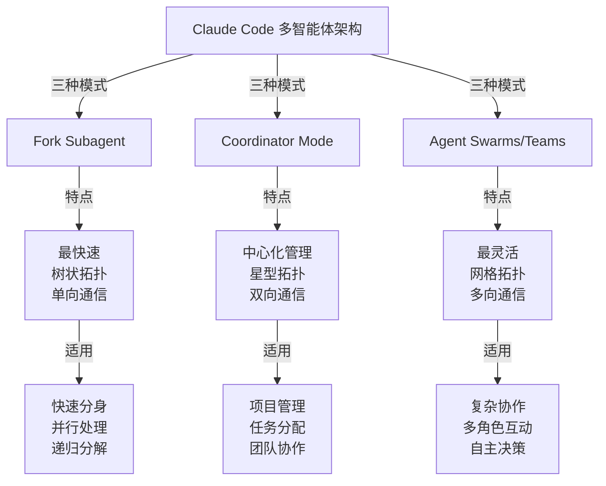
```mermaid
graph TB
    A["Claude Code 多智能体架构"] -->|三种模式| B["Fork Subagent"]
    A -->|三种模式| C["Coordinator Mode"]
    A -->|三种模式| D["Agent Swarms/Teams"]
    
    B -->|特点| B1["最快速<br/>树状拓扑<br/>单向通信"]
    C -->|特点| C1["中心化管理<br/>星型拓扑<br/>双向通信"]
    D -->|特点| D1["最灵活<br/>网格拓扑<br/>多向通信"]
    
    B1 -->|适用| B2["快速分身<br/>并行处理<br/>递归分解"]
    C1 -->|适用| C2["项目管理<br/>任务分配<br/>团队协作"]
    D1 -->|适用| D2["复杂协作<br/>多角色互动<br/>自主决策"]
```

### 6.5 最终建议

**选择标准：**

1. **优先考虑性能** → Fork Subagent
2. **优先考虑管理** → Coordinator Mode
3. **优先考虑灵活性** → Agent Swarms/Teams

**实施步骤：**

1. 分析任务特征和需求
2. 选择最合适的基础模式
3. 根据实际情况进行优化
4. 必要时混合使用多种模式

**持续改进：**

- 监控性能指标
- 收集执行日志
- 定期审视架构
- 根据反馈调整

---

## 附录：关键概念速查表

### A.1 上下文类型速查

| 类型 | 范围 | 访问 | 生命周期 |
|------|------|------|---------|
| 全局上下文 | 所有Agent | 只读 | 整个周期 |
| 任务上下文 | 单个任务 | 只读 | 任务期间 |
| 本地上下文 | 单个Agent | 读写 | Agent生命周期 |
| 通信上下文 | 通信双方 | 共享 | 通信期间 |

### A.2 权限类型速查

| 权限 | 授予者 | 验证方式 | 有效期 |
|------|-------|---------|-------|
| 文件访问 | Leader/Coordinator | 路径检查 | 任务期间 |
| 工具调用 | Leader/Coordinator | 能力检查 | 任务期间 |
| 通信权限 | Leader | 消息验证 | 整个周期 |
| 决策权 | 自有 | 无需验证 | 任务期间 |

### A.3 消息类型速查

| 消息类型 | 方向 | 用途 | 频率 |
|---------|------|------|------|
| 任务分配 | 上→下 | 分配任务 | 1次 |
| 进度报告 | 下→上 | 报告进度 | 周期性 |
| 结果回传 | 下→上 | 返回结果 | 1次 |
| 权限请求 | 下→上 | 请求权限 | 按需 |
| 错误报告 | 下→上 | 报告错误 | 按需 |
| 广播消息 | 中心→所有 | 通知所有 | 按需 |

---

**文档完成时间：** 2026-04-21  
**版本：** 1.0  
**作者：** Claude Code 架构分析

