# LangGraph 完整指南

> 从零到掌握：状态管理、消息流转、多智能体、动态编排

---

## 一、核心概念总览

LangGraph 是 LangChain 团队开发的**有状态多智能体编排框架**，将 AI 工作流建模为**有向图**。

```
你设计好思考路径 → AI 沿路径执行
不是让 AI 自由发挥，而是可控的结构化编排
```

### 五大核心概念

| 概念 | 类比 | 说明 |
|------|------|------|
| **State** | 列车行李箱 | 节点间共享的数据容器 |
| **Node** | 地铁站 | 执行具体任务的函数 |
| **Edge** | 铁轨 | 固定的节点跳转规则 |
| **Conditional Edge** | 道岔 | 根据状态动态选择下一节点 |
| **Checkpoint** | 存档点 | 状态快照，支持暂停/恢复/回溯 |

### 整体架构图

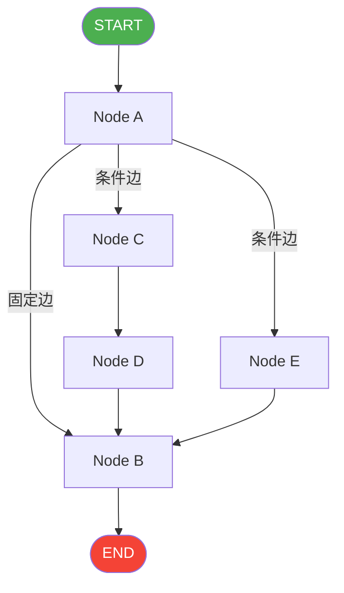

---

## 二、状态管理（State）

### 2.1 基础状态定义

```python
from typing import TypedDict, Annotated
import operator

# 方式一：简单 TypedDict（字段直接覆盖）
class BasicState(TypedDict):
    messages: list[str]
    count: int

# 方式二：带 Reducer（字段合并而非覆盖）
class StateWithReducer(TypedDict):
    messages: Annotated[list[str], operator.add]  # 追加
    name: str                                       # 覆盖
```

### 2.2 Reducer 机制

```
不用 Reducer：新值直接覆盖旧值
用 Reducer：新值按规则合并到旧值

operator.add → 列表追加 / 数字相加
自定义函数 → 任意合并逻辑
```

| 场景 | 推荐方式 |
|------|---------|
| 消息历史（需要累积） | `Annotated[list, operator.add]` |
| 当前状态（需要覆盖） | 普通字段 |
| 并行节点写同一字段 | 必须用 Reducer，否则冲突 |

### 2.3 状态设计原则

- 只存"下游节点需要用到的数据"
- 大型数据用引用（文件路径/ID），不直接存内容
- 流程控制字段（如 `current_step`）单独存放
- 错误信息单独字段，便于统一处理

---

## 三、节点（Node）

### 3.1 节点规范

```python
def my_node(state: MyState) -> dict:
    # 接收完整 state
    # 只返回需要更新的字段（partial update）
    return {"field_a": new_value}
    # LangGraph 自动合并回 state，其余字段不变
```

### 3.2 节点类型

| 类型 | 说明 | 示例 |
|------|------|------|
| 普通节点 | 自定义函数 | 业务逻辑处理 |
| ToolNode | 预构建工具执行节点 | `ToolNode(tools)` |
| 子图节点 | 将另一个图作为节点 | 模块化复用 |
| Lambda 节点 | 简单内联函数 | `lambda s: {"x": 1}` |

---

## 四、边与路由（Edge & Routing）

### 4.1 固定边

```python
builder.add_edge("node_a", "node_b")   # A 执行完必定去 B
builder.add_edge(START, "entry_node")  # 图的入口
builder.add_edge("last_node", END)     # 图的出口
```

### 4.2 条件边（动态路由核心）

```python
def route_fn(state: MyState) -> str:
    if state["category"] == "urgent":
        return "urgent_handler"
    return "normal_handler"

builder.add_conditional_edges(
    "classify_node",   # 从哪个节点出发
    route_fn,          # 路由函数，返回节点名
    {                  # 可选映射表
        "urgent_handler": "urgent_handler",
        "normal_handler": "normal_handler",
        END: END,
    }
)
```

### 4.3 路由流程图

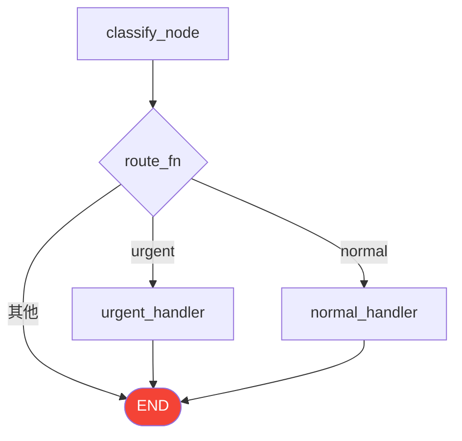

---

## 五、工具调用（Tool Use）

### 5.1 定义工具

```python
from langchain_core.tools import tool

@tool
def search_weather(city: str) -> str:
    """查询城市天气"""
    return f"{city}: 晴 25°C"
```

### 5.2 ReAct Agent（最简方式）

```python
from langgraph.prebuilt import create_react_agent
from langchain_openai import ChatOpenAI

llm = ChatOpenAI(model="gpt-4o-mini")
graph = create_react_agent(llm, tools=[search_weather])
result = graph.invoke({"messages": [("user", "北京天气？")]})
```

### 5.3 手动构建 Agent + ToolNode

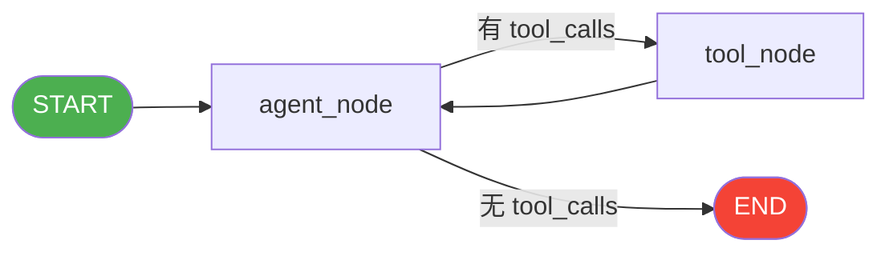

```python
from langgraph.prebuilt import ToolNode, tools_condition

builder.add_node("agent", agent_node)
builder.add_node("tools", ToolNode(tools))
builder.add_edge(START, "agent")
builder.add_conditional_edges("agent", tools_condition)
builder.add_edge("tools", "agent")  # 工具执行完回到 agent
```

### 5.4 tools_condition 逻辑

```
LLM 返回 tool_calls → 去 "tools" 节点
LLM 返回普通文本  → 去 END
```

---

## 六、状态持久化（Checkpointing）

### 6.1 检查点类型

| 类型 | 适用场景 | 代码 |
|------|---------|------|
| `MemorySaver` | 开发/测试 | `MemorySaver()` |
| `SqliteSaver` | 单机生产 | `SqliteSaver(conn)` |
| `PostgreSQLSaver` | 分布式生产 | 需额外安装 |
| `RedisSaver` | 高性能场景 | 需额外安装 |

### 6.2 使用方式

```python
from langgraph.checkpoint.memory import MemorySaver

memory = MemorySaver()
graph = builder.compile(checkpointer=memory)

# thread_id 隔离不同用户/会话
config = {"configurable": {"thread_id": "user-123"}}
result = graph.invoke(initial_state, config)
```

### 6.3 检查点能力

```
暂停与恢复 → 任意节点后暂停，之后从断点继续
历史回溯   → 查看任意历史步骤的状态
时间旅行   → 回到某个历史检查点重新执行
多用户隔离 → thread_id 实现并发安全
```

---

## 七、人机协同（Human-in-the-Loop）

### 7.1 核心机制

```python
from langgraph.types import interrupt, Command

def human_review_node(state):
    # 图在此暂停，等待人类输入
    decision = interrupt({
        "question": "请审核，是否批准？",
        "content": state["document"]
    })
    return {"approved": decision["approved"]}
```

### 7.2 恢复执行

```python
# 第一次调用：执行到 interrupt() 时暂停
graph.invoke(initial_state, config)

# 人类审核后，用 Command(resume=...) 恢复
graph.invoke(Command(resume={"approved": True}), config)
```

### 7.3 流程图

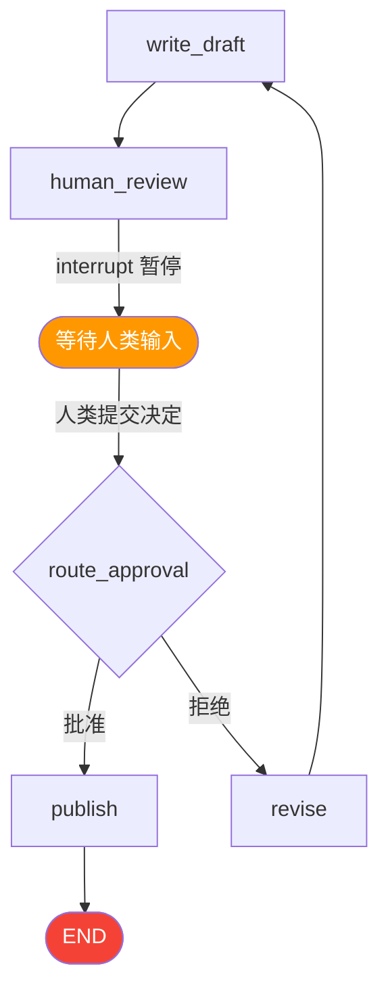

---

## 八、并行执行（Fan-out / Fan-in）

### 8.1 静态并行

```python
# 一个节点连接多个节点 → 自动并行执行
builder.add_edge("fan_out", "process_a")
builder.add_edge("fan_out", "process_b")
builder.add_edge("fan_out", "process_c")
# 三个节点并行，都完成后才能继续
builder.add_edge("process_a", "fan_in")
builder.add_edge("process_b", "fan_in")
builder.add_edge("process_c", "fan_in")
```

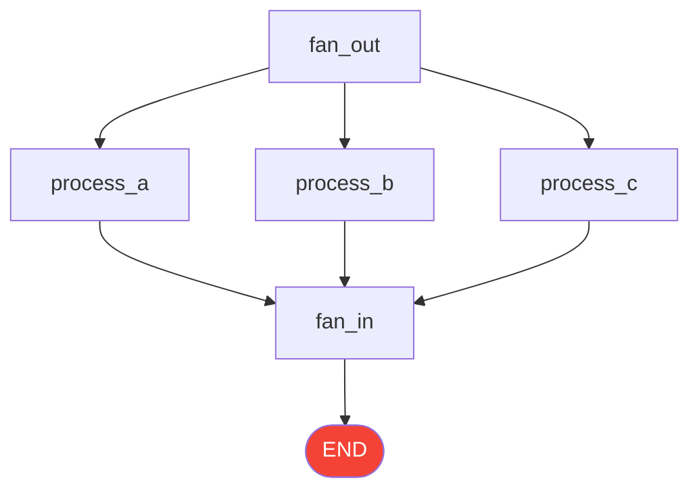

### 8.2 动态并行（Send）

```python
from langgraph.types import Send

def dispatch(state) -> list[Send]:
    # 根据数据动态创建并行任务
    return [Send("worker", {"item": x}) for x in state["items"]]

builder.add_conditional_edges(START, dispatch)
```

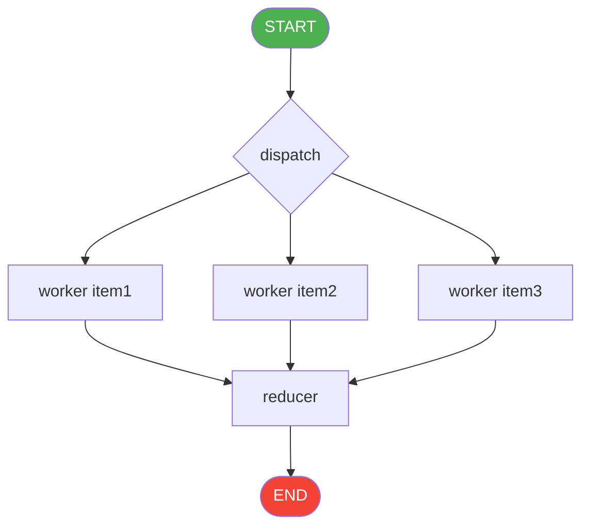

---

## 九、子图（Subgraph）

### 9.1 子图作为节点

```python
# 构建子图
sub_builder = StateGraph(SubState)
# ... 添加节点和边
sub_graph = sub_builder.compile()

# 在父图中调用子图
def call_subgraph(state: ParentState) -> dict:
    result = sub_graph.invoke({"field": state["field"]})
    return {"result": result["output"]}

parent_builder.add_node("sub_phase", call_subgraph)
```

### 9.2 适用场景

| 场景 | 说明 |
|------|------|
| 模块复用 | 多个父图共用同一子图 |
| 复杂度管理 | 将大图拆分为可维护的模块 |
| 团队协作 | 不同团队负责不同子图 |

---

## 十、多智能体编排模式

### 10.1 六大模式速查

| 模式 | 核心特点 | 适用场景 |
|------|---------|---------|
| **路由器** Router | 分类 → 分发到专业 Agent | 客服分流、多领域问答 |
| **监督者** Supervisor | 串行分配、循环决策 | 复杂研究、代码开发 |
| **编排者-工作者** Orchestrator-Worker | 并行分配、动态子任务 | 代码重构、多语言翻译 |
| **评估者-优化者** Evaluator-Optimizer | 循环迭代、质量驱动 | 代码审查、文案优化 |
| **Map-Reduce** | 批量并行、结构相同 | 文档分析、批量处理 |
| **层级多智能体** Hierarchical | 多层管理、组织架构 | 大型团队协作 |

---

### 10.2 路由器模式（Router）

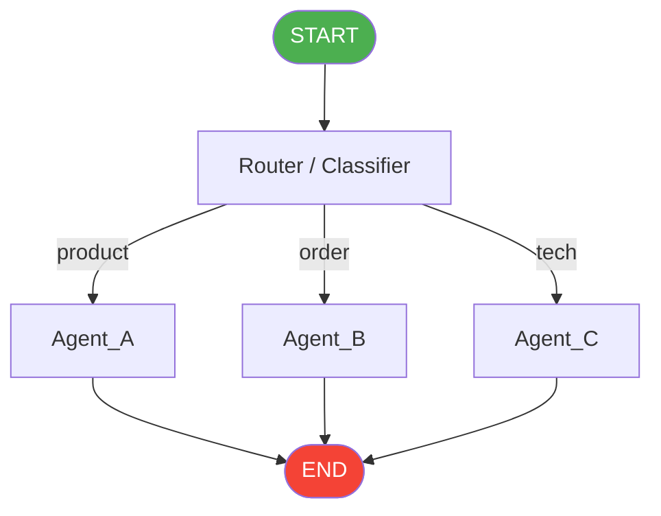

**核心代码：**
```python
def route_fn(state) -> str:
    return state["category"]  # 返回节点名

builder.add_conditional_edges("router", route_fn,
    {"product": "product", "order": "order", "tech": "tech"})
```

---

### 10.3 监督者模式（Supervisor）

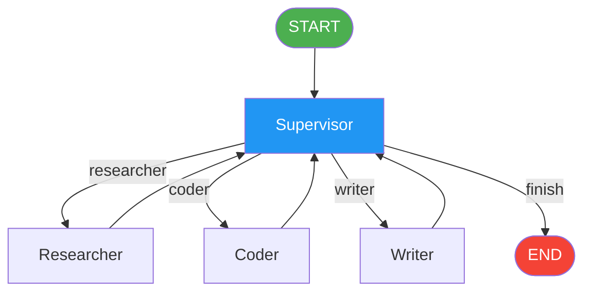

**核心代码：**
```python
def route_supervisor(state) -> str:
    next_agent = state["next_agent"]
    return END if next_agent == "finish" else next_agent

# 每个子 Agent 执行完都回到 Supervisor
for agent in ["researcher", "coder", "writer"]:
    builder.add_edge(agent, "supervisor")
```

---

### 10.4 编排者-工作者模式（Orchestrator-Worker）

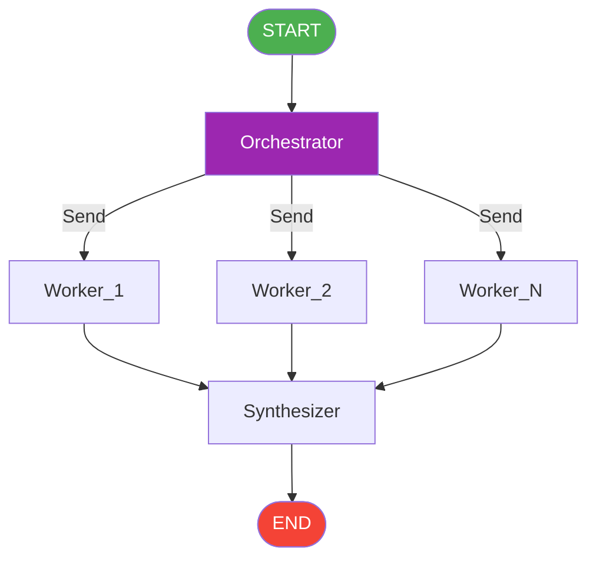

**核心代码：**
```python
def dispatch_to_workers(state) -> list[Send]:
    return [Send("worker", {"task": t}) for t in state["tasks"]]

builder.add_conditional_edges("orchestrator", dispatch_to_workers)
builder.add_edge("worker", "synthesizer")
```

---

### 10.5 评估者-优化者模式（Evaluator-Optimizer）

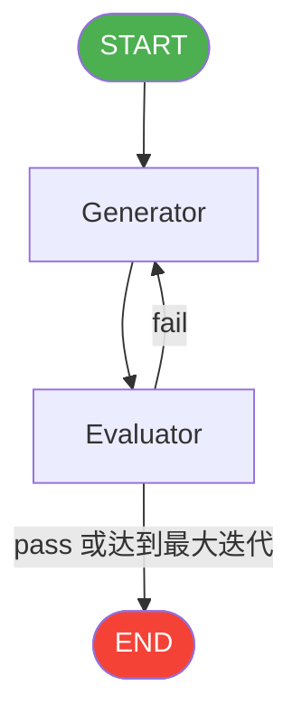

**核心代码：**
```python
def route_evaluation(state) -> str:
    if state["passed"] or state["iteration"] >= 5:
        return END
    return "generator"  # 继续迭代

builder.add_conditional_edges("evaluator", route_evaluation,
    {"generator": "generator", END: END})
```

---

### 10.6 Map-Reduce 模式

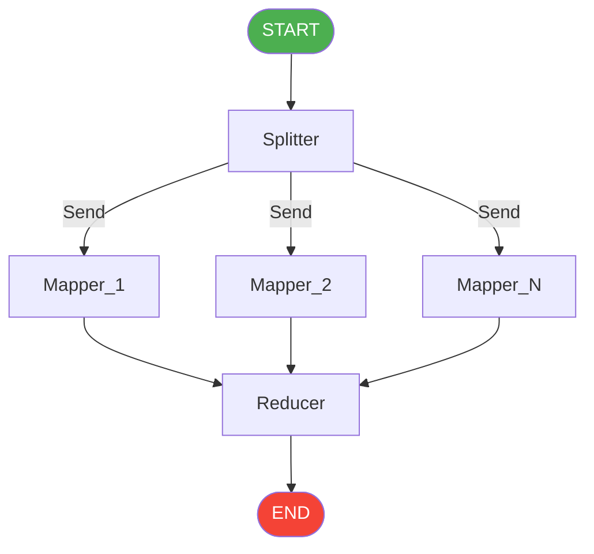

与编排者-工作者的区别：
- Map-Reduce：子任务**结构相同**，批量处理
- 编排者-工作者：子任务**可能不同**，按需分配

---

### 10.7 层级多智能体（Hierarchical）

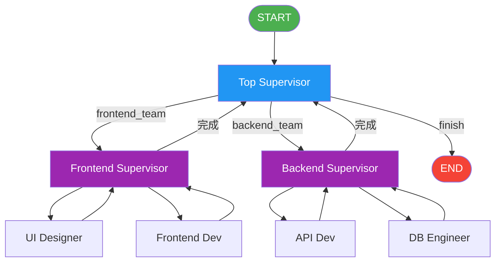

---

## 十一、动态编排（Dynamic Orchestration）

这是 LangGraph 最核心的能力，两个项目都用到了这个模式。

### 11.1 核心思路

```
不把执行路径硬编码在图结构里
而是把"执行计划"存在 state["plan"] 里
由 LLM 在运行时动态生成 plan
条件路由函数按 plan 逐步调度
```

### 11.2 动态编排流程

```mermaid
flowchart TD
    IN([用户输入]) --> O[Orchestrator\n分析意图，生成 plan]
    O --> R{route_by_plan\nplan\[current_step\]}
    R -->|plan\[0\]| A1[agent1]
    R -->|plan\[1\]| A2[agent2]
    R -->|plan\[2\]| A3[agent3]
    R -->|step >= len\(plan\)| END([END])
    A1 -->|current_step++| R
    A2 -->|current_step++| R
    A3 -->|current_step++| R

    style IN fill:#4CAF50,color:#fff
    style END fill:#f44336,color:#fff
    style O fill:#2196F3,color:#fff
    style R fill:#FF9800,color:#fff
```

### 11.3 关键实现

```python
def route_by_plan(state) -> str:
    plan = state.get("plan", [])
    step = state.get("current_step", 0)
    if step >= len(plan):
        return END          # 所有步骤完成
    return plan[step]       # 返回下一个节点名

# 每个子 Agent 执行完必须推进 current_step
def sub_agent(state) -> dict:
    # ... 业务逻辑
    return {
        "result": ...,
        "current_step": state["current_step"] + 1  # 关键！
    }
```

### 11.4 四种动态场景

| 场景 | plan | 说明 |
|------|------|------|
| 只查询不存储 | `["search", "analyze"]` | 跳过存储步骤 |
| RAG 已有数据 | `["analyze"]` | 跳过搜索和存储 |
| 完整流程 | `["search", "store", "analyze"]` | 全部执行 |
| 直接分析 | `["analyze"]` | 直接用已有数据 |

---

## 十二、消息流转（Message Flow）

### 12.1 消息类型

```python
from langchain_core.messages import HumanMessage, AIMessage, SystemMessage

# 消息历史累积（使用 Reducer）
class State(TypedDict):
    messages: Annotated[list[BaseMessage], operator.add]
```

### 12.2 消息流转图

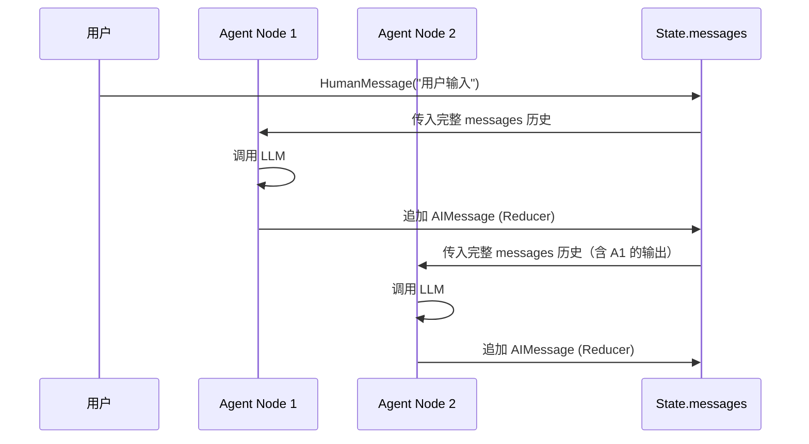

### 12.3 MessagesState 快捷方式

```python
from langgraph.graph import MessagesState

# 等价于定义了 messages: Annotated[list, add] 的 TypedDict
class MyState(MessagesState):
    extra_field: str  # 可以继续添加字段
```

---

## 十三、流式输出（Streaming）

```python
# 逐节点流式输出
for event in graph.stream(initial_state):
    node_name = list(event.keys())[0]
    node_output = event[node_name]
    print(f"[{node_name}]: {node_output}")

# 逐 token 流式输出（需要 LLM 支持）
for chunk in graph.stream(initial_state, stream_mode="messages"):
    print(chunk, end="", flush=True)
```

---

## 十四、生产最佳实践

### 14.1 错误处理

```python
def safe_node(state) -> dict:
    try:
        result = risky_operation()
        return {"result": result}
    except Exception as e:
        return {"error": str(e)}  # 写入 error 字段

def route_with_error(state) -> str:
    if state.get("error"):
        return END  # 有错误直接结束
    return "next_node"
```

### 14.2 防止无限循环

```python
def route_evaluation(state) -> str:
    if state["passed"] or state["iteration"] >= 5:  # 最大迭代次数
        return END
    return "generator"
```

### 14.3 可观测性

```python
import os
os.environ["LANGCHAIN_TRACING_V2"] = "true"
os.environ["LANGCHAIN_API_KEY"] = "your-key"
os.environ["LANGCHAIN_PROJECT"] = "my-project"
# 之后所有图执行自动上报到 LangSmith
```

### 14.4 核心 API 速查

| API | 说明 |
|-----|------|
| `StateGraph(State)` | 创建图 |
| `builder.add_node(name, fn)` | 添加节点 |
| `builder.add_edge(a, b)` | 添加固定边 |
| `builder.add_conditional_edges(a, fn, map)` | 添加条件边 |
| `builder.compile(checkpointer=...)` | 编译图 |
| `graph.invoke(state, config)` | 同步执行 |
| `graph.stream(state, config)` | 流式执行 |
| `graph.get_state(config)` | 获取当前状态 |
| `graph.get_state_history(config)` | 获取历史状态 |
| `interrupt(data)` | 暂停等待人类输入 |
| `Command(resume=data)` | 恢复执行 |
| `Send(node, state)` | 动态并行发送 |
