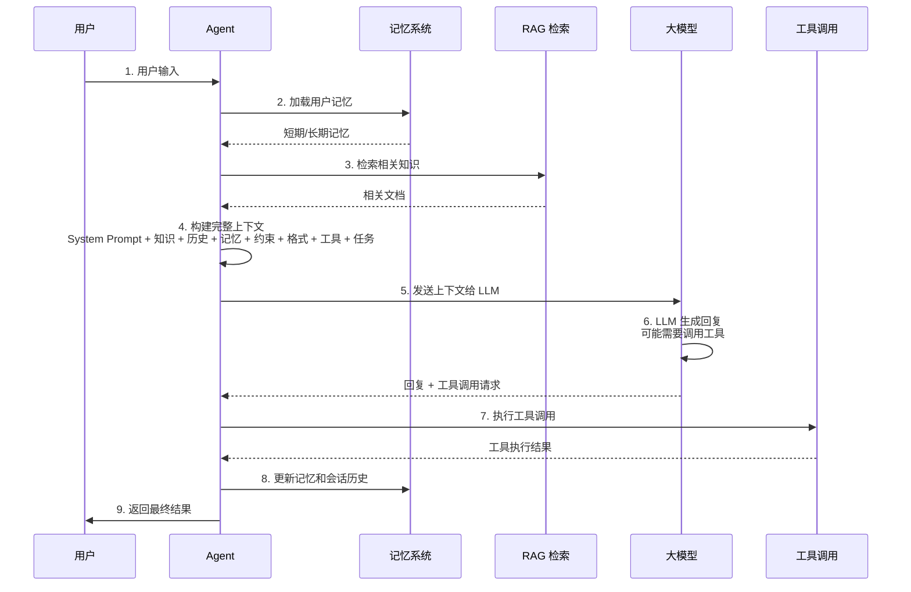
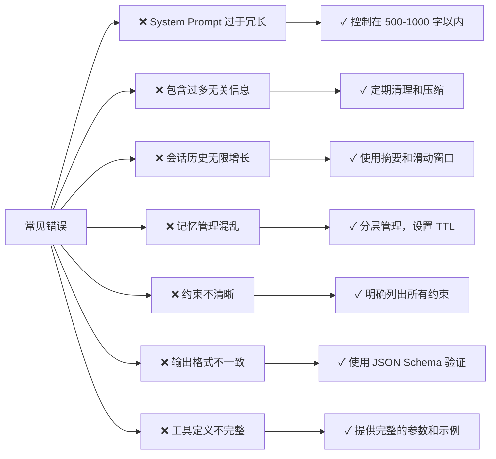

# 上下文工程完全指南   Write! select! compass! Isolate! 

## 什么是上下文工程？

上下文工程是指精心设计和管理发送给 LLM 的所有信息，以获得最优的输出质量。

---

## 每次发给大模型的完整上下文结构

| # | 上下文要素 | 包含内容 |
|---|----------|---------|
| 1 | **System Prompt**<br/>系统提示 | • 角色定义<br/>• 任务目标<br/>• 行为准则<br/>• 输出格式要求 |
| 2 | **外部知识**<br/>External Knowledge | • RAG 检索结果<br/>• 实时数据<br/>• 知识库信息<br/>• 背景信息 |
| 3 | **会话历史**<br/>Conversation History | • 用户消息<br/>• AI 回复<br/>• 多轮对话记录 |
| 4 | **记忆**<br/>Memory | • 短期记忆<br/>• 长期记忆<br/>• 工作记忆<br/>• 摘要记忆 |
| 5 | **约束限制**<br/>Constraints | • 输出长度限制<br/>• 禁止内容<br/>• 安全准则<br/>• 业务规则 |
| 6 | **输出格式**<br/>Output Format | • JSON/Markdown<br/>• 字段定义<br/>• 示例 Few-shot<br/>• 验证规则 |
| 7 | **工具定义**<br/>Tool Definitions | • 可用工具列表<br/>• 工具参数定义<br/>• 工具调用示例 |
| 8 | **当前任务**<br/>Current Task | • 用户输入<br/>• 任务上下文<br/>• 优先级/截止时间 |

---

## 详细解析各部分

### 1. System Prompt（系统提示）

**作用**：定义 LLM 的角色、能力、行为准则

#### 一般包含的内容

```
你是一个金融分析助手。

【角色定义】
- 专业背景：10年金融分析经验
- 专业领域：股票分析、基金评估、风险管理
- 语言风格：专业、准确、简洁

【任务目标】
- 分析用户提供的财务数据
- 给出投资建议
- 解释分析逻辑

【行为准则】
- 基于数据做出判断，避免主观臆断
- 明确标注风险和不确定性
- 不提供具体的买卖建议，只提供分析
- 如果数据不足，明确说明

【输出格式】
- 使用 Markdown 格式
- 包含分析、结论、风险三个部分
- 数字精确到小数点后两位

【禁止内容】
- 不涉及政治敏感话题
- 不提供非法投资建议
- 不泄露用户隐私信息
```

---

### 2. 外部知识（External Knowledge）

**来源**：

| 来源类型 | 说明 |
|---------|------|
| **RAG 检索结果** | 从向量库检索的相关文档 |
| **实时数据** | API 调用获取的最新数据 |
| **知识库** | 企业内部文档、规则库 |
| **上下文信息** | 用户历史、行业背景 |

#### 示例

```
【相关研报】
- 新能源行业 2024 年展望（来源：中信证券）
  核心观点：新能源汽车销量预计增长 30%
  
【实时行情】
- 宁德时代（300750）：当前价格 ¥180.5，涨幅 +2.3%
- 北向资金净流入：¥5.2 亿

【用户历史】
- 用户偏好：关注新能源、消费电子
- 风险承受度：中等
```

---

### 3. 会话历史（Conversation History）

**作用**：保持对话连贯性，让 LLM 理解上下文

#### 示例

```
User: 帮我分析新能源板块
Assistant: 新能源板块最近表现强劲...

User: 具体是哪些公司？
Assistant: 主要包括宁德时代、比亚迪...

User: 这些公司的估值怎么样？
Assistant: [需要理解前两轮对话的上下文]
```

---

### 4. 记忆（Memory）

**分类与用途**

| 记忆类型 | 时间范围 | 内容 | 用途 |
|---------|---------|------|------|
| **短期记忆** | 当前会话 | 用户偏好、当前任务状态 | 实时决策 |
| **长期记忆** | 跨会话 | 用户历史、学习结果 | 个性化服务 |
| **工作记忆** | 当前任务 | 中间计算结果、临时状态 | 任务执行 |
| **摘要记忆** | 历史汇总 | 关键信息摘要 | 节省 token |

#### 具体示例

```
【短期记忆】
- 用户今天查询了 5 次新能源相关信息
- 用户对宁德时代特别感兴趣

【长期记忆】
- 用户是保守型投资者
- 用户曾在 2023 年因过度交易亏损
- 用户偏好长期持有策略

【工作记忆】
- 当前分析的公司：宁德时代、比亚迪
- 当前分析维度：估值、增长、风险

【摘要记忆】
- 用户过去 30 天的查询摘要
- 用户的投资决策历史
```

---

### 5. 约束限制（Constraints）

**包含的内容**：

| 约束类型 | 说明 |
|---------|------|
| **输出长度** | 最多 500 字 |
| **禁止内容** | 不涉及政治、不提供具体买卖建议 |
| **安全准则** | 不泄露用户隐私、不生成有害内容 |
| **业务规则** | 必须标注数据来源、必须说明风险 |

#### 示例

```
【约束条件】
- 输出长度：200-500 字
- 必须包含：分析逻辑、风险提示、数据来源
- 禁止：具体买卖建议、过度承诺收益
- 时间限制：必须在 5 秒内响应
- 数据准确性：所有数据必须来自可信来源
```

---

### 6. 输出格式（Output Format）

**定义清晰的结构**

#### JSON 格式示例

```json
{
  "analysis": "分析内容",
  "conclusion": "结论",
  "risk": "风险提示",
  "confidence": 0.85,
  "sources": ["来源1", "来源2"]
}
```

#### 具体示例

```json
{
  "analysis": "宁德时代 PE 为 25 倍，低于行业平均 30 倍，估值相对合理。公司在新能源汽车电池领域市场占有率第一，技术领先。",
  "conclusion": "估值相对合理，建议关注",
  "risk": "政策变化、竞争加剧可能压低估值；原材料价格波动影响利润",
  "confidence": 0.75,
  "sources": ["中信证券研报", "实时行情数据", "公司财报"]
}
```

---

### 7. 工具定义（Tool Definitions）

**告诉 LLM 可以调用哪些工具**

#### 工具列表

| 工具名称 | 功能 | 参数 | 返回值 |
|---------|------|------|--------|
| `search_news(keyword, date_range)` | 搜索相关新闻 | keyword, date_range | 新闻列表 |
| `get_stock_price(symbol)` | 获取股票实时价格 | symbol | {price, change, change_percent} |
| `analyze_financial_report(company_id)` | 分析财务报表 | company_id | {revenue, profit, pe_ratio, ...} |
| `retrieve_rag(query, top_k)` | 从 RAG 向量库检索 | query, top_k | 相关文档列表 |

#### 工具调用示例

```
当用户问"宁德时代最近的新闻"时，调用：
search_news(keyword="宁德时代", date_range="最近7天")

当用户问"宁德时代的股价"时，调用：
get_stock_price(symbol="300750")

当用户问"新能源行业的发展趋势"时，调用：
retrieve_rag(query="新能源行业发展趋势", top_k=5)
```

---

### 8. 当前任务（Current Task）

**用户的实际输入**

```
User: 帮我分析宁德时代是否值得投资？

【任务上下文】
- 用户风险承受度：中等
- 投资时间范围：3-5 年
- 投资金额：10 万元
- 优先级：高
```

---

## Agent 架构中的完整执行流程



---

## System Prompt 的最佳实践

### 结构化 System Prompt 模板

```
【角色与背景】
你是一个 {角色}，具有 {背景/经验}。

【核心能力】
- 能力1：{具体描述}
- 能力2：{具体描述}
- 能力3：{具体描述}

【工作方式】
1. {步骤1}
2. {步骤2}
3. {步骤3}

【输出要求】
- 格式：{格式要求}
- 长度：{长度限制}
- 风格：{风格要求}

【禁止事项】
- 禁止1
- 禁止2
- 禁止3

【示例】
输入：{示例输入}
输出：{示例输出}
```

### FinAgent 中的 System Prompt 示例

```
你是一个金融情报分析助手，基于 LangGraph 多 Agent 协作系统。

【角色定义】
- 专业背景：10年金融分析经验
- 核心能力：数据采集、文本摘要、RAG 检索、智能分析
- 工作方式：多 Agent 协作，支持意图识别与条件路由

【意图识别】
识别用户意图，支持以下 5 类：
1. crawl：数据采集（东方财富/雪球/上交所/财联社）
2. summary：文本摘要与 RAG 检索
3. analysis：数据分析（9 大 Skill）
4. chat：闲聊
5. multi：多步骤任务（采集→摘要→分析）

【输出格式】
{
  "intent": "意图类型",
  "response": "回复内容",
  "sources": ["数据来源"],
  "confidence": 0.85
}

【禁止事项】
- 不提供具体买卖建议
- 不涉及政治敏感话题
- 不泄露用户隐私

【示例】
输入：帮我分析最近新能源板块的表现
输出：
{
  "intent": "analysis",
  "response": "新能源板块最近表现强劲...",
  "sources": ["东方财富行情", "财联社资讯"],
  "confidence": 0.9
}
```

---

## 上下文工程的 8 大要素对比

| 要素 | 作用 | 优化方向 |
|------|------|---------|
| **System Prompt** | 定义角色和行为 | 清晰、具体、可验证 |
| **外部知识** | 提供事实基础 | 相关性、时效性、准确性 |
| **会话历史** | 保持连贯性 | 压缩、摘要、关键信息提取 |
| **记忆** | 个性化服务 | 分层管理、TTL 机制 |
| **约束限制** | 确保安全性 | 明确、可执行、可验证 |
| **输出格式** | 结构化输出 | JSON Schema、验证规则 |
| **工具定义** | 扩展能力 | 清晰的参数、返回值、示例 |
| **当前任务** | 具体目标 | 明确、可测量、有优先级 |

---

## 上下文工程的关键原则

### 1. **相关性原则**
- 只包含与当前任务相关的信息
- 过多无关信息会增加 token 消耗和降低准确性
- 定期清理过期信息

### 2. **优先级原则**
- 最重要的信息放在最前面
- System Prompt 优先级最高
- 当前任务优先级次之

### 3. **简洁性原则**
- 避免冗余信息
- 使用摘要而非全文
- 压缩会话历史

### 4. **一致性原则**
- 确保各部分信息不矛盾
- 定期同步记忆和知识库
- 版本控制

### 5. **可验证性原则**
- 所有约束都应该可以被验证
- 输出格式应该有明确的验证规则
- 提供示例便于理解

---

## 常见的上下文工程错误



---

## 总结

上下文工程的核心是**精心设计和管理发送给 LLM 的信息**。通过以下 8 个要素的有机结合，可以显著提升 LLM 应用的质量：

1. **System Prompt** - 定义角色和行为
2. **外部知识** - 提供事实基础
3. **会话历史** - 保持连贯性
4. **记忆** - 个性化服务
5. **约束限制** - 确保安全性
6. **输出格式** - 结构化输出
7. **工具定义** - 扩展能力
8. **当前任务** - 具体目标

**记住**：好的上下文工程不是简单地堆砌信息，而是精心选择、组织和优化信息，使 LLM 能够以最高效的方式完成任务。
