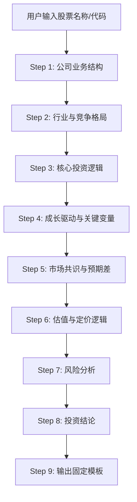
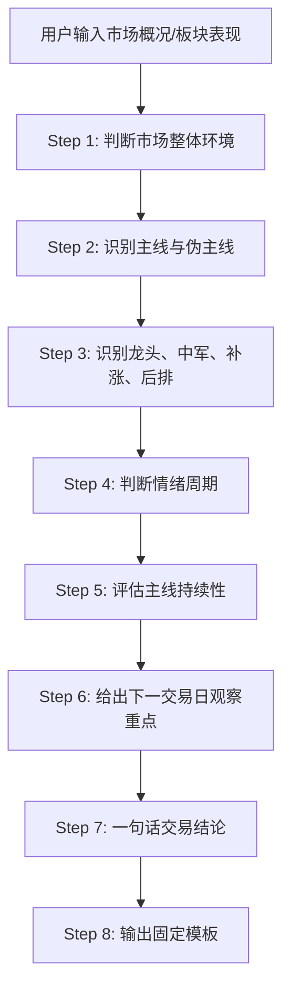
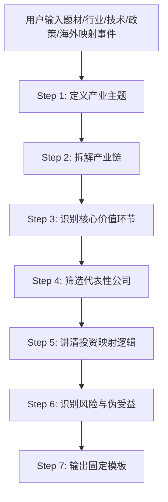

# 金融分析核心技能执行逻辑

> 项目索引：[多智能体系统 (MAS)](../README.md) → [个人项目与学习](README.md) → 金融分析技能

---

## 总体描述
金融分析系统包含三个核心执行逻辑流程，分别针对股票分析、市场分析和事件分析场景，每个流程都有标准化的步骤和输出模板，确保分析的完整性和一致性。

---

## 流程一：单只股票分析


```
用户输入股票名称/代码
       ↓
Step 1: 公司业务结构
        - 收入/利润来源
        - 核心业务清晰度
        - 真正的壁垒在哪
        → 突出"哪块业务最关键、哪块决定估值"

Step 2: 行业与竞争格局
        - 行业生命周期阶段（导入/成长/成熟/周期下行）
        - 市场空间、竞争强度、集中度变化
        - 公司在行业中的位置（龙头/细分龙头/追赶者/边缘）

Step 3: 核心投资逻辑（2-4条）
        每条逻辑必须包含：
        - 逻辑本身
        - 成立原因
        - 对业绩或估值的影响
        - 当前市场是否已经充分定价
        → 不能写"受益于行业发展"这种废话

Step 4: 成长驱动与关键变量
        - 未来1-3年增长来源（产品放量/价格上行/份额提升/海外拓展等）
        - 明确列出最关键的业绩变量和观察指标

Step 5: 市场共识与预期差 ← 最核心步骤
        - 市场普遍接受的观点是什么
        - 真正可能形成超额收益的"预期差"是什么？
          可能来自：低估盈利弹性/高估短期风险/忽视新业务/行业周期判断滞后

Step 6: 估值与定价逻辑
        - 适用的估值框架（PE/PB/PEG/EV/EBITDA/分部估值）
        - 当前估值在历史什么位置

Step 7: 风险分析
        - 真正可能伤害股价的因素（需求/价格/客户/产能/政策/竞争）
        - 区分短期风险 vs 中期风险

Step 8: 投资结论
        - 短期看催化、预期差、情绪、交易位置
        - 中期看产业趋势、业绩兑现、估值空间

Step 9: 输出固定模板
```

---

## 流程二：市场整体分析


```
用户输入市场概况/板块表现
       ↓
Step 1: 判断市场整体环境
        - 强势/震荡/弱势/退潮
        - 看：指数强弱、涨跌家数、成交额变化、情绪股表现、核心抱团股
        - 输出：适合"主动进攻/精选参与/控制仓位/观望"

Step 2: 识别主线与伪主线 ← 最关键
        从以下维度区分"真正主线/次级热点/脉冲题材/跟风分支"：
        - 板块涨幅、题材热度、成交额集中度
        - 涨停股数量、连板高度、龙头辨识度
        - 消息催化强度、资金承接
        → 不能把一日脉冲误判为主线

Step 3: 识别龙头、中军、补涨、后排
        每个重点方向分层：
        - 情绪龙头：最有辨识度、带动情绪
        - 趋势中军：容量大、机构参与深
        - 补涨标的：位置低、弹性大
        - 跟风后排：持续性弱

Step 4: 判断情绪周期
        - 冰点/修复/主升/高位震荡/退潮
        - 看：连板高度、炸板率、高位股反馈、龙头分歧承接、低位首板扩散
        → 必须给判断依据，不能只下结论

Step 5: 评估主线持续性（三维打分）
        1. 产业逻辑是否扎实
        2. 事件催化是否持续
        3. 资金合力是否明确
        评分：弱/一般/较强/强
        同时指出最容易导致主线结束的触发条件

Step 6: 给出下一交易日观察重点
        - 龙头能否弱转强？
        - 分歧后是否有回流？
        - 中军是否放量新高？
        - 后排是否大面积掉队？

Step 7: 一句话交易结论

Step 8: 输出固定模板
```

---

## 流程三：事件主题分析


```
用户输入题材/行业/技术/政策/海外映射事件
       ↓
Step 1: 定义产业主题
        - 核心驱动来自哪里？（需求/技术/政策/成本下降/海外映射）
        - 避免模糊定义导致产业链错配

Step 2: 拆解产业链 ← 核心
        按以下维度拆解：
        - 上游/中游/下游
        - 或：材料/设备/制造/应用/服务
        说明每个环节：作用、壁垒、价值量
        → 不是列公司名单，是讲清楚链条结构

Step 3: 识别核心价值环节 ← 最关键
        必须指出：
        - 哪个环节最受益（利润弹性最大）
        - 哪个环节最容易形成龙头溢价
        - 哪个环节只是概念映射、业绩贡献有限
        → 产业链中并非每个环节都同等重要

Step 4: 筛选代表性公司（分层）
        - 核心龙头
        - 容量中军
        - 高弹性小票
        - 观察性映射标的
        说明各自逻辑，不是简单列名单

Step 5: 讲清投资映射逻辑
        为什么A会受益、B只是蹭概念？
        必须写清楚受益路径：
        - 订单增加 / ASP提升 / 市占率提升
        - 产能利用率改善 / 估值重估

Step 6: 识别风险与伪受益
        - 哪些公司名义相关但实际受益弱
        - 哪些环节热门但兑现周期长
        - 哪些标的业绩与主题关联度不高
        → 防坑和找机会同样重要

Step 7: 输出固定模板
```

---

---

## 流程四：投研分析四维框架

### 4.1 投研分析四维框架

```
┌─────────────────────────────────────────────────────┐
│              投研分析四维框架                          │
│                                                      │
│  ┌──────────────┐  ┌──────────────┐                 │
│  │  基本面分析   │  │  技术面分析   │                 │
│  │  Fundamental  │  │  Technical   │                 │
│  │              │  │              │                 │
│  │ ·财务分析    │  │ ·K线形态     │                 │
│  │ ·估值分析    │  │ ·技术指标    │                 │
│  │ ·行业分析    │  │ ·量价关系    │                 │
│  │ ·竞争格局    │  │ ·支撑压力    │                 │
│  └──────────────┘  └──────────────┘                 │
│                                                      │
│  ┌──────────────┐  ┌──────────────┐                 │
│  │  资金面分析   │  │  情绪面分析   │                 │
│  │  Capital Flow │  │  Sentiment   │                 │
│  │              │  │              │                 │
│  │ ·主力资金    │  │ ·市场情绪    │                 │
│  │ ·北向资金    │  │ ·舆情分析    │                 │
│  │ ·融资融券    │  │ ·恐慌贪婪    │                 │
│  │ ·机构持仓    │  │ ·分析师预期  │                 │
│  └──────────────┘  └──────────────┘                 │
└─────────────────────────────────────────────────────┘
```

### 4.2 基本面分析详解

#### 自上而下分析框架（Top-Down）
```
宏观经济 → 大类资产配置 → 行业选择 → 个股筛选

Step 1: 宏观判断
- 经济周期位置？
- 货币政策方向？
- 信用周期阶段？

Step 2: 大类资产配置
- 股/债/商品/现金的比例？
- 哪类资产占优？

Step 3: 行业选择
- 哪些行业受益于宏观环境？
- 行业景气度排序？
- 政策支持方向？

Step 4: 个股筛选
- 行业内龙头公司？
- 估值与成长匹配度？
- 催化剂？
```

#### 自下而上分析框架（Bottom-Up）
```
个股筛选 → 财务分析 → 估值判断 → 行业验证

Step 1: 财务筛选
- ROE > 15%
- 营收增速 > 20%
- 经营现金流为正
- 资产负债率 < 60%

Step 2: 竞争力分析
- 护城河类型？
- 市场份额趋势？
- 定价权？

Step 3: 估值判断
- 当前估值分位数？
- 相对行业估值？
- DCF合理价值？

Step 4: 行业验证
- 行业趋势是否支持？
- 竞争格局是否恶化？
```

### 4.3 估值分析体系

#### 绝对估值法详解

**DCF（现金流折现法）完整流程**
```
Step 1: 预测自由现金流（5-10年）
  FCF = EBIT × (1-Tax Rate) + D&A - CapEx - ΔNWC

  其中：
  - EBIT: 息税前利润
  - Tax Rate: 企业所得税率
  - D&A: 折旧与摊销
  - CapEx: 资本支出
  - ΔNWC: 营运资金变动

Step 2: 计算WACC
  WACC = E/(E+D) × Re + D/(E+D) × Rd × (1-T)

  其中：
  - Re = Rf + β × (Rm - Rf)  [CAPM]
  - Rd: 债务成本
  - E: 股权市值
  - D: 债务市值
  - T: 税率

Step 3: 计算终值
  TV = FCF_n+1 / (WACC - g)

  其中 g 为永续增长率（通常2%-3%）

Step 4: 折现求和
  企业价值 = Σ FCF_t/(1+WACC)^t + TV/(1+WACC)^n
  股权价值 = 企业价值 - 净债务
  每股价值 = 股权价值 / 总股本
```
 
#### 相对估值法详解

**PE估值深度**
```
PE = 股价 / 每股收益 = 市值 / 净利润

PE的分类：
├── 静态PE（LYR）：用过去12个月净利润
│   └── 优点：数据确定；缺点：滞后
├── 动态PE（TTM）：用最近4个季度净利润
│   └── 优点：更及时；缺点：季节性影响
├── 远期PE（Forward PE）：用未来12个月预期净利润
│   └── 优点：前瞻性；缺点：预期可能不准
└── PE Band：PE的历史分位数区间
    └── 判断当前估值在历史中的位置

PE的适用与不适用：
✅ 适用：盈利稳定、周期性弱、利润质量高
❌ 不适用：亏损企业、利润波动大、非经常性损益多

PE的变形：
- PEG = PE / 利润增长率 → 成长股估值
- PE-G框架：PE与增长率的匹配关系
- 市场PE → 整体估值水平判断
```

**PB估值深度**
```
PB = 股价 / 每股净资产 = 市值 / 净资产

PB的适用场景：
✅ 银行：资产以金融资产为主，账面价值接近真实价值
✅ 保险：内含价值评估
✅ 重资产行业：钢铁、煤炭、交运
✅ 破净股筛选：PB < 1 可能被低估

PB与ROE的关系：
PB = ROE × PE → PB/ROE = PE
合理PB = ROE × 合理PE
高ROE应享有高PB，低ROE对应低PB
```

**EV/EBITDA估值**
```
EV = 市值 + 净债务 + 少数股东权益 + 优先股
EBITDA = 营业利润 + 折旧 + 摊销

优势：
- 不受资本结构影响
- 不受折旧摊销政策影响
- 适合跨国/跨行业比较
- 适合重资产/高折旧企业

常用行业：
- 电信（高折旧）
- 航空（高租赁）
- 并购估值
```

### 4.4 技术面分析

#### K线基础
```
K线四要素：开盘价(O)、最高价(H)、最低价(L)、收盘价(C)

阳线（C>O）：实体为空/红色
阴线（C<O）：实体为满/绿色

常见K线形态：
├── 反转形态
│   ├── 锤子线：长下影线，底部反转信号
│   ├── 倒锤子线：长上影线，底部反转信号
│   ├── 吞没形态：大阳线吞没前阴线
│   ├── 十字星：多空平衡，变盘信号
│   ├── 早晨之星：三根K线底部反转组合
│   └── 黄昏之星：三根K线顶部反转组合
├── 持续形态
│   ├── 上升三法：上涨中继
│   ├── 下降三法：下跌中继
│   └── 跳空缺口：趋势加速
└── 整理形态
    ├── 三角形：对称/上升/下降
    ├── 旗形：短期整理
    └── 矩形：箱体震荡
```

#### 核心技术指标
| 指标 | 类型 | 计算方式 | 用法 |
|------|------|----------|------|
| MA(均线) | 趋势 | N日收盘价均值 | 金叉/死叉、支撑/压力 |
| MACD | 趋势 | DIF=EMA12-EMA26, DEA=EMA9(DIF) | DIF与DEA交叉、柱状图 |
| RSI | 震荡 | 上涨均值/(上涨+下跌均值)×100 | >70超买，<30超卖 |
| KDJ | 震荡 | RSV=(C-L9)/(H9-L9)×100 | K/D金叉死叉、超买超卖 |
| BOLL | 波动 | 中轨=MA20, 上下轨=中轨±2σ | 收口/开口、突破轨道 |
| VOL | 量能 | 成交量 | 量价配合、放量/缩量 |
| OBV | 量能 | 累计量能 | 与价格背离信号 |

#### 量价关系
```
量价配合原则：
├── 价涨量增 → 健康上涨，趋势可持续
├── 价涨量缩 → 上涨乏力，可能见顶
├── 价跌量增 → 恐慌抛售或主力出货
├── 价跌量缩 → 下跌动能减弱，可能见底
├── 天量天价 → 可能是顶部信号
└── 地量地价 → 可能是底部信号
```

### 4.5 资金面分析

#### 主力资金分析
```
资金流向分析维度：
├── 大单净流入/流出：主力资金方向
├── 北向资金：外资动向（重要风向标）
├── 融资融券：杠杆资金变化
├── ETF申赎：被动资金流向
├── 限售股解禁：供给压力
├── 增持/减持：产业资本态度
└── IPO/再融资：市场融资压力
```

#### 北向资金
```
北向资金 = 通过沪股通+深股通流入A股的港资/外资

重要性：
- 被称为"聪明钱"
- 与大盘走势高度相关
- 行业配置变化有前瞻性

关注维度：
- 日度净买入/卖出额
- 持仓市值变化
- 行业配置偏好变化
- 个股增减持明细
```

### 4.6 情绪面分析

```
情绪指标体系：
├── 市场情绪
│   ├── 涨跌家数比
│   ├── 涨停/跌停家数
│   ├── 换手率
│   ├── 两市成交额
│   └── 新开户数
├── 舆情情绪
│   ├── 财经新闻情感分析
│   ├── 社交媒体讨论热度
│   ├── 搜索指数变化
│   └── 论坛情绪指数
├── 衍生指标
│   ├── VIX/中国波指
│   ├── 认购认沽比
│   ├── 融资买入占比
│   └── 换手率分位数
└── 反向指标
    ├── 新基金发行冰点 → 可能见底
    ├── 新基金发行火爆 → 可能见顶
    └── 朋友圈都在谈股票 → 可能见顶
```

---

[Back to Projects](../Projects/README.md) · [Back to MAS](../README.md)