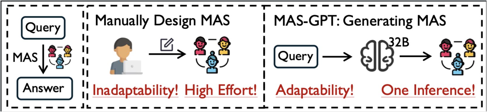
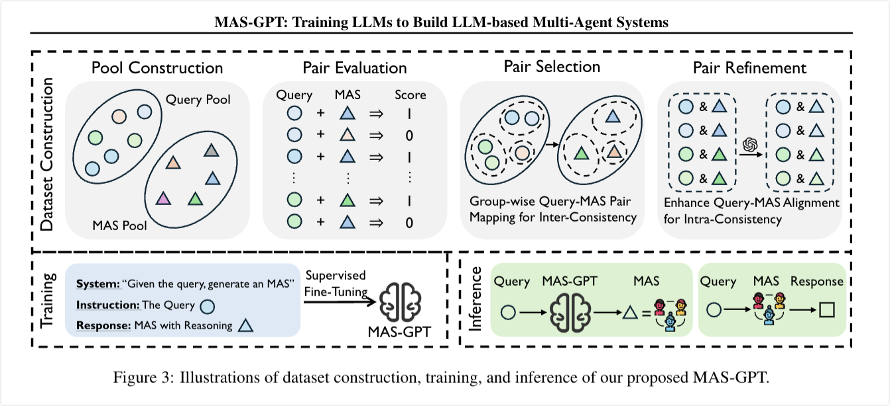

# MAS-GPT: Training LLMs to Build LLM-based Multi-Agent Systems 论文总结
> [!NOTE|label:重点]
> 
> 训练一个输入为用户查询，输出为适配MAS的Python代码的LLM模型。
> 
> 训练数据：构建配对数据集，包括query-关联推理过程-MAS代码。然后微调训练。
>
> 结果就是直接输出一个可以运行的python代码，包括prompt和拓扑结构的代码。可以提升泛化能力，从“特定任务定制”走向“通用自适应生成”。
> 



上海交大 
https://github.com/rui-ye/MAS-GPT
https://arxiv.org/pdf/2503.03686

> 基于大语言模型（LLM）的多智能体系统（MAS）在处理各种任务方面已展现出巨大潜力。然而，为了设计出高效的多智能体系统，现有方法严重依赖手动配置或多次调用先进的大语言模型，这导致了适应性不足和推理成本高昂的问题。在本文中，我们通过将构建多智能体系统的过程重新定义为一项生成式语言任务，来简化该过程 —— 输入是用户的查询，输出则是相应的多智能体系统。为了应对这一新任务，我们将多智能体系统的表示统一为可执行代码，并提出了一个面向一致性的数据构建流程，以创建包含连贯且一致的查询 - 多智能体系统对的高质量数据集。利用该数据集，我们训练出了 MAS-GPT，这是一个开源的中型大语言模型，能够在单次大语言模型推理中生成适应查询的多智能体系统。生成的多智能体系统可以无缝地应用于处理用户查询并提供高质量的响应。在 9 个基准测试和 5 个大语言模型上进行的大量实验表明，所提出的 MAS-GPT 在不同设置下持续优于 10 多种基线多智能体系统方法，这体现了 MAS-GPT 的高效性、经济性和强大的泛化能力。代码将在以下网址公开

## 一、研究背景与问题
现有基于大语言模型（LLM）的多智能体系统（MAS）虽在复杂任务中展现潜力，但存在两大核心痛点，限制其规模化应用：
1. **适应性差且人工成本高**：主流方法（如MetaGPT、ChatDev、AgentVerse）需手动设计MAS的协作结构与智能体提示词，结构固定，无法适配不同领域/难度的任务。
2. **推理成本高**：自适应MAS方法（如GPTSwarm、DyLAN）虽无需人工干预，但需通过多次LLM调用迭代调整结构/提示词，计算开销大、耗时久。


## 二、核心思路与创新点
### 1. 任务重构
将“为用户查询构建适配的MAS”重构为**生成式语言任务**：输入为用户查询，输出为可直接执行的MAS，使MAS构建过程像调用ChatGPT一样简单高效（单次LLM推理即可完成）。

### 2. 三大核心创新
- **MAS统一表示**：将MAS封装为Python可执行代码（`forward`函数），其中智能体提示词定义为变量、LLM调用定义为函数、智能体交互通过字符串拼接实现，确保生成的MAS可无缝执行。

```python
def forward(query):
    # 数学智能体：解决问题
    math_agent = f'You are a math expert. Solve this question: {query}'
    math_output = call_llm(math_agent)
    # 反馈智能体：评估结果
    feedback_agent = f'Given {query} and {math_output}, provide feedback'
    feedback_output = call_llm(feedback_agent)
    # 优化智能体：生成最终答案
    refine_agent = f'Given {query}, {math_output} and {feedback_output}, provide the final answer'
    return call_llm(refine_agent)

```


- **一致性导向数据集构建**：解决LLM缺乏MAS生成知识的问题，设计四步 pipeline 构建高质量“查询-MAS”配对数据集：
  1. **池构建**：收集多领域查询（数学、编码、通用QA等），并基于现有MAS方法（如Multi-Agent Debate）+手动设计构建含40+基础MAS的池；
  2. **配对评估**：将每个查询与所有基础MAS配对，通过评估函数（对比生成结果与真值）筛选有效配对（得分=1表示正确）；
  3. **跨一致性选择**：聚类相似查询，为每组查询分配单一高性能MAS，确保相似查询对应一致MAS，帮助模型学习通用模式；
  4. **内一致性优化**：用先进LLM调整MAS使其更适配查询（如移除无关智能体），并生成“查询-MAS关联推理过程”，增强配对逻辑性。
- **MAS-GPT模型**：基于开源中型LLM（Qwen2.5-Coder-32B-Instruct）进行有监督微调（SFT），输入为用户查询，输出为“推理过程+可执行MAS代码”，实现单次推理生成查询适配的MAS。

## 三、实验设计与核心结果
### 1. 实验设置
- **数据**：训练集含11442个“查询-MAS”配对（统计见下表），覆盖数学（MATH、GSM8K）、编码（MBPP）、通用QA（MMLU）等领域；
  | 样本数（N_data） | 查询平均长度（L_ins） | 响应平均长度（L_res） | 推理过程长度（L_rsn） | MAS代码长度（L_MAS） | 独特MAS数（N_MAS） |
  |------------------|-----------------------|-----------------------|-----------------------|----------------------|--------------------|
  | 11442            | ~75.0                 | ~1062.3               | ~262.5                | ~784.8               | 7580               |
- **基准与对比方法**：10+基线方法，包括单智能体、Chain-of-Thought（CoT）、Self-Consistency、LLM-Debate、AgentVerse、GPTSwarm等；
- **评估指标**：任务准确率（数学/QA对比真值，编码通过测试用例通过率）、推理成本（LLM调用次数）。

### 2. 核心结果
- **泛化性领先**：在8个基准（含2个域外基准）上，MAS-GPT平均性能超越所有基线，比次优方法高3.89%，且在域外任务（如GPQA科学问答）上仍表现优异；
- **兼容性强**：无论使用哪种LLM（Llama-3-70B、Qwen2.5-72B、GPT-4o-mini等）作为MAS的驱动模型，MAS-GPT均能保持最优性能；
- **提升强推理LLM能力**：在高难度数学基准AIME2024上，MAS-GPT可使o1（OpenAI）性能提升13.3%，DeepSeek-R1提升10.0%；
- **成本优势显著**：MAS-GPT仅需1次32B模型推理，而对比方法（如AFlow、DyLAN）需10+次大模型调用，在性能最优的同时成本最低；
- **消融实验验证关键设计**：跨一致性选择、内一致性优化（MAS调整+推理过程）均为性能关键，移除任一设计会导致数学任务准确率下降3%-8%。


## 四、结论与意义
1. **技术价值**：将MAS构建从“手动/多轮推理”简化为“单次LLM调用”，解决了适应性与成本痛点，为MAS规模化应用提供技术基础；
2. **开源贡献**：代码、数据集、模型均开源（https://github.com/rui-ye/MAS-GPT），助力后续研究；
3. **未来潜力**：实验显示数据量增加（从1k到11k）、模型规模扩大（从7B到32B）时，MAS-GPT性能持续提升，具备进一步优化空间。

MAS-GPT的核心意义在于降低了LLM-based MAS的使用门槛，推动其从“特定任务定制”走向“通用自适应生成”，为复杂任务（如科学计算、多领域协作）提供更高效的解决方案。

> @article{ye2025mas,
  title={MAS-GPT: Training LLMs to build LLM-based multi-agent systems},
  author={Ye, Rui and Tang, Shuo and Ge, Rui and Du, Yaxin and Yin, Zhenfei and Chen, Siheng and Shao, Jing},
  journal={arXiv preprint arXiv:2503.03686},
  year={2025}
}