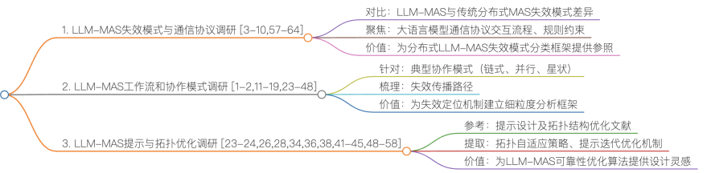

23-24,26,28,34,36,38,41-45,48-58
拓扑优化
AFlow
MaAS
Automated Design of Agentic Systems
提示词优化

[1] Yan et al. Beyond Self-Talk: A Communication-Centric Survey of LLM-Based Multi-Agent Systems, arXiv, 2025.
[2] Chen et al. The Five Ws of Multi-Agent Communication: Who Talks to Whom, When, What, and Why - A Survey from MARL to Emergent Language and LLMs, arXiv, 2025.
[3] Kong et al. Aegis: Automated Error Generation and Identification for Multi-Agent Systems, arXiv, 2025.
[4] Zhang et al. AgenTracer: Who Is Inducing Failure in the LLM Agentic Systems?, arXiv, 2025.
[5] Zhu et al. RAFFLES: Reasoning-based Attribution of Faults for LLM Systems, arXiv, 2025.
[6] Deshpande et al. TRAIL: Trace Reasoning and Agentic Issue Localization, arXiv, 2025.
[7] Zhang et al. Which Agent Causes Task Failures and When? On Automated Failure Attribution of LLM Multi-Agent Systems, arXiv, 2025.
[8] Lin et al. LLM-based Agents Suffer from Hallucinations: A Survey of Taxonomy, Methods, and Directions, arXiv, 2025.
[9] Zhou et al. SHIELDA: Structured Handling of Exceptions in LLM-Driven Agentic Workflows, arXiv, 2025.
[10] Cemri et al. Why Do Multi-Agent LLM Systems Fail?, ICLRW, 2025.
[11] Ehtesham et al. A survey of agent interoperability protocols: Model Context Protocol (MCP), Agent Communication Protocol (ACP), Agent-to-Agent Protocol (A2A), and Agent Network Protocol (ANP), arXiv, 2025.
[12] Yang et al. A Survey of AI Agent Protocols, arXiv, 2025.
[13] Qiu et al. AgentDistill: Training-Free Agent Distillation with Generalizable MCP Boxes, arXiv, 2025.
[14] Yin et al. LiveMCP-101: Stress Testing and Diagnosing MCP-enabled Agents on Challenging Queries, arXiv, 2025.
[15] Wang et al. MCP-Bench: Benchmarking Tool-Using LLM Agents with Complex Real-World Tasks via MCP Servers, arXiv, 2025.
[16] Fei et al. MCP-Zero: Active Tool Discovery for Autonomous LLM Agents, arXiv, 2025.
[17] Fan et al. MCPToolBench++: A Large Scale AI Agent Model Context Protocol MCP Tool Use Benchmark, arXiv, 2025.
[18] Lei et al. MCPVerse: An Expansive, Real-World Benchmark for Agentic Tool Use, arXiv, 2025.
[19] Lumer et al. ScaleMCP: Dynamic and Auto-Synchronizing Model Context Protocol Tools for LLM Agents, arXiv, 2025.
[20] Zhuge et al. Agent-as-a-Judge: Evaluate Agents with Agents, arXiv, 2025.
[21] Lifshitz et al. Multi-Agent Verification: Scaling Test-Time Compute with Multiple Verifiers, arXiv, 2025.
[22] Sühr et al. Stop Evaluating AI with Human Tests, Develop Principled, AI-specific Tests instead, arXiv, 2025.
[23] Liu et al. A Dynamic LLM-Powered Agent Network for Task-Oriented Agent Collaboration, COLM, 2024.
[24] Zhang et al. AFlow: Automating Agentic Workflow Generation, ICLR, 2025.
[25] Chen et al. AgentVerse: Facilitating Multi-Agent Collaboration and Exploring Emergent Behaviors, ICLR, 2024.
[26] Li et al. AutoFlow: Automated Workflow Generation for Large Language Model Agents, arXiv, 2024.
[27] Wu et al. AutoGen: Enabling Next-Gen LLM Applications via Multi-Agent Conversation, COLM, 2024.
[28] Hu et al. Automated Design of Agentic Systems, ICLR, 2025.
[29] Li et al. CAMEL: Communicative Agents for "Mind" Exploration of Large Language Model Society, NeurIPS, 2023.
[30] Li et al. Chain-of-Agents: End-to-End Agent Foundation Models via Multi-Agent Distillation and Agentic RL, arXiv, 2025.
[31] Wang et al. Efficient Agents: Building Effective Agents While Reducing Cost, arXiv, 2025.
[32] Liang et al. Encouraging Divergent Thinking in Large Language Models through Multi-Agent Debate, EMNLP, 2024.
[33] Du et al. Improving Factuality and Reasoning in Language Models through Multiagent Debate, ICML, 2024.
[34] Zhuge et al. Language Agents as Optimizable Graphs, ICML, 2024.
[35] Fourney et al. Magentic-One: A Generalist Multi-Agent System for Solving Complex Tasks, arXiv, 2024.
[36] Ye et al. MAS-GPT: Training LLMs to Build LLM-based Multi-Agent Systems, arXiv, 2025.
[37] Ye et al. MASLab: A Unified and Comprehensive Codebase for LLM-based Multi-Agent Systems, arXiv, 2025.
[38] Yue et al. MasRouter: Learning to Route LLMs for Multi-Agent Systems, ACL, 2025.
[39] Qian and Liu. MetaAgent: Toward Self-Evolving Agent via Tool Meta-Learning, arXiv, 2025.
[40] Hong et al. MetaGPT: Meta Programming for A Multi-Agent Collaborative Framework, ICLR, 2024.
[41] Zhang et al. Multi-agent Architecture Search via Agentic Supernet, ICML, 2025.
[42] Zhou et al. Multi-Agent Design: Optimizing Agents with Better Prompts and Topologies, arXiv, 2025.
[43] Ho et al. Polymath: A Self-Optimizing Agent with Dynamic Hierarchical Workflow, arXiv, 2025.
[44] Qian et al. Scaling Large Language Model-based Multi-Agent Collaboration, ICLR, 2025.
[45] Lin et al. SE-Agent: Self-Evolution Trajectory Optimization in Multi-Step Reasoning with LLM-Based Agents, arXiv, 2025.
[46] Wang et al. Self-Consistency Improves Chain of Thought Reasoning in Language Models, ICLR, 2023.
[47] Madaan et al. Self-Refine: Iterative Refinement with Self-Feedback, NeurIPS, 2023.
[48] Ye et al. X-MAS: Towards Building Multi-Agent Systems with Heterogeneous LLMs, arXiv, 2025.
[49] Luo et al. Agent Lightning: Train ANY AI Agents with Reinforcement Learning, arXiv, 2025.
[50] Chen et al. Heterogeneous Group-Based Reinforcement Learning for LLM-based Multi-Agent Systems, arXiv, 2025.
[51] Zhou et al. ReSo: A Reward-driven Self-organizing LLM-based Multi-Agent System for Reasoning Tasks, arXiv, 2025.
[52] Chang et al. Efficient Prompting Methods for Large Language Models: A Survey, arXiv, 2024.
[53] Zhou et al. Memento: Fine-tuning LLM Agents without Fine-tuning LLMs, arXiv, 2025.
[54] Yu et al. NetSafe: Exploring the Topological Safety of Multi-agent Networks, ACL, 2025.
[55] Opsahl-Ong et al. Optimizing Instructions and Demonstrations for Multi-Stage Language Model Programs, EMNLP, 2024.
[56] Ho et al. Polymath: A Self-Optimizing Agent with Dynamic Hierarchical Workflow, arXiv, 2025.
[57] Zhu et al. Where LLM Agents Fail and How They can Learn From Failures, arXiv, 2025.
[58] Lin et al. AgentAsk: Multi-Agent Systems Need to Ask, arXiv, 2025.
[59] Yang Y, Chai H, Song Y, et al. A survey of ai agent protocols, arXiv, 2025.
[60] Ehtesham A, Singh A, Gupta G K, et al. A survey of agent interoperability protocols: Model context protocol (MCP), agent communication protocol (ACP), agent-to-agent protocol (A2A), and agent network protocol (ANP), arXiv, 2025.
[61] Anthropic. Model Context Protocol. Introduction to model context protocol (MCP). https://modelcontextprotocol.io/introduction, 2024.
[62] Google. Agent2agent (A2A) protocol documentation. https://google.github.io/A2A/, 2024.
[63] ANP Community. Agent Network Protocol Contributors. Agent network protocol official website. https://agent-network-protocol.com/,  2024.
[64] IBM BeeAI. Introduction to agent communication protocol (ACP). https://docs.beeai.dev/acp/alpha/introduction,  2024. 

