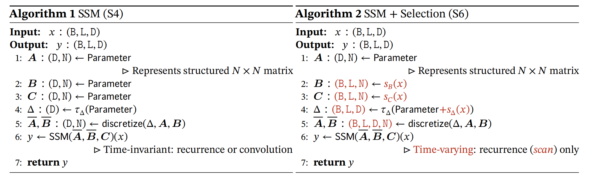
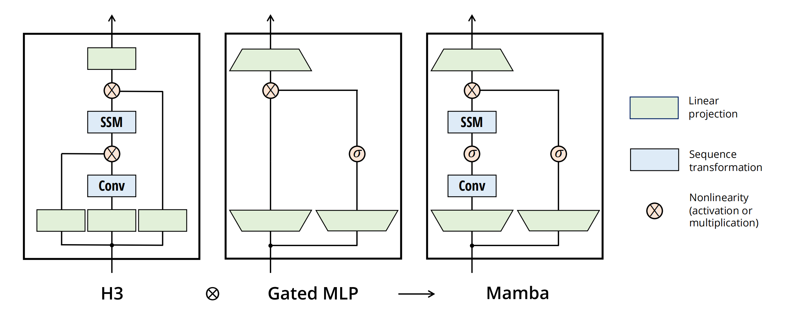
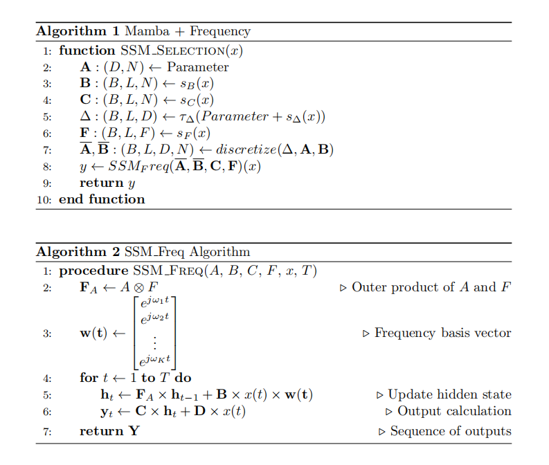

> [!NOTE|label:标注]
> 

# Mamba + 的核心架构

上述是基础的SSM模块的伪代码. 

主要工作是 ：
- 将Mamba应用到金融数据里面来。

- 改动Mamba的SSM模块，把它变为频率分解的模块

超参数有：
- n-layer
- embedding
- expand
- hidden_size
- freq_size
- conv_size

(embedding,hidden_size,conv_size,freq_size)

|(3,4,4,10)|(4,8,8,10)|(3,8,4,10)|(2,16,2,20)|
| :---: | :---: | :---: | :---: |
| 26.68 | 27.56 | 28.71 | 300多不收敛 |

以上训练都很不稳定

(embedding,hidden_size,conv_size)

|(3,8,4)|(4,8,4)|
| :---: | :---: | 
| 27.16 | 30.30 |

|         表头1          | 表头2              |              表头3 |
| :--------------------: | :----------------- | -----------------: |
|      两个冒号居中      | 冒号在左左对齐     |     冒号在右右对齐 |
|           >            | `>` 合并左边单元格 | `^` 合并下方单元格 |
| 空着不写合并右边单元格 |                    |                  ^ |

