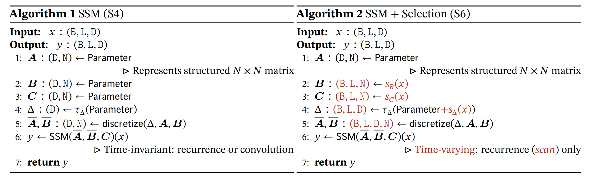

# Mamba + 频率分解实验

> [!NOTE|label:标注]
> 本文记录了将 Mamba 模型与频率分解方法结合的实验过程和结果分析。

## 1. 核心架构

上述是基础的 SSM 模块的伪代码。

## 2. 实验目标

- 将 Mamba 应用到金融数据的时间序列预测中
- 改动 Mamba 的 SSM 模块，引入频率分解机制

## 3. 超参数搜索

模型的关键超参数包括：n-layer、embedding、expand、hidden_size、freq_size、conv_size。

### 含频率分解的配置 (embedding, hidden_size, conv_size, freq_size)

| (3,4,4,10) | (4,8,8,10) | (3,8,4,10) | (2,16,2,20) |
| :---: | :---: | :---: | :---: |
| 26.68 | 27.56 | 28.71 | 不收敛 |

以上训练均不稳定，方差较大。

### 不含频率分解的配置 (embedding, hidden_size, conv_size)

| (3,8,4) | (4,8,4) |
| :---: | :---: |
| 27.16 | 30.30 |

## 4. 初步结论

频率分解版本与基础版本的 error 均在 28-30 之间，未拉开明显差距。可能原因：
- 数据集规模太小，噪音太大
- 不同随机种子对结果影响过重，难以区分模型性能差异
- 需要更换周期性更明显的数据集来验证频率分解的有效性
