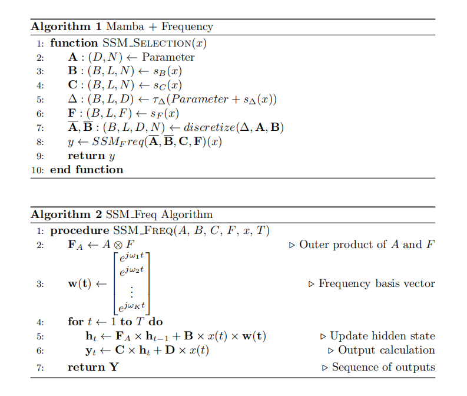
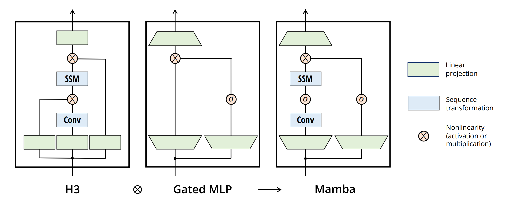
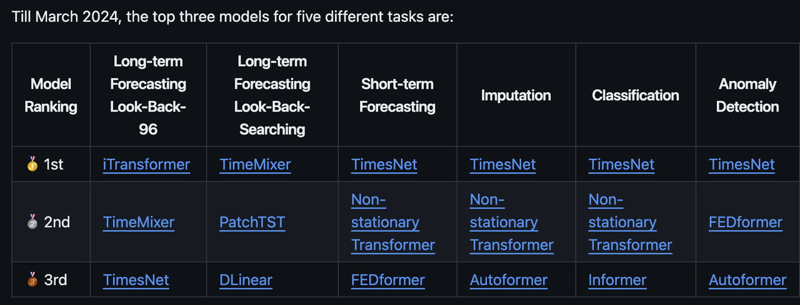

# Mamba 改进实验

## 1. Mamba + SFM 频率分解

### 基础模型

使用 SFM 中的频率分解思想改进 Mamba 模型，核心思想是用频率分解的隐藏状态替代原本的隐藏状态。这也可以看作 multi-scale 的特征提取。

主要改动：
- 改动 Mamba 的 SSM 模块，引入频率分解机制
- 将 Mamba 的输入与更新换为单步处理（而非一整个序列），训练明显更稳定，收敛更快

### 实验结果

1. 在金融数据集上，频率分解版本相比 SFM 没有明显改进也没有退步。SFM、Mamba（单步更新）、Mamba+频率分解的 error 均稳定在 28-30 之间，无法区分是随机种子差异还是模型性能差异。
2. 数据集可能太小且噪音太大，需要更换周期性更明显的数据集来对比模型性能。

### 改进方案验证

- **只利用实部而非振幅**：频率分解后只使用实部信息。结果仍在 28-30 之间，方差大，未拉开差距。
- **扩大频率分解密度（方案一）**：将分解密度扩大 $p$ 倍，然后每 $p$ 个频率分量取平均压缩回 freq_size 个。不改变其他部分的复杂度（只改了输入门）。结果仍在 28-30 之间。
- **以中心频率为基准扩展（方案二）**：以原有频率为中心，在周围取 $P$ 个频率。相当于将输入门、遗忘门、隐状态维度全部扩充 $P$ 倍，只有输出门不变。结果：平均误差比之前差了 1-2。

### 下一步计划

在原有数据中加入已知周期的分量（如周期为 5 的信号），观察模型频率分解后该频率分量位置的变化，验证频率分解机制是否真正捕获了频率信息。

## 2. Mamba + Patch

受 PatchTST 的启发，将模型输入划分为 patch，使每次输入包含更多信息，帮助模型捕捉局部特征。

需要注意的是，Mamba 本身已有 conv 层用于局部特征提取，且 Mamba 是递归模型，patch 化的效果需要实验验证。

## 3. Mamba + Cross Channel

受 CrossFormer 的启发，将通道独立的不同特征通过 inter-channel 机制综合起来。CrossFormer 使用了 inter-channel 的注意力机制，我们也可以为每个独立的 SSM 通道设计类似的聚合方法。

## 4. TimesNet 参考

TimesNet 以时序多周期性为出发点，将一维时间序列转换为基于多个周期的二维张量，应用二维卷积核建模。

核心贡献：
1. 用 FFT 将原数据转为频谱，同时将 1D 序列转为 2D 序列
2. 使用 2D 卷积核捕捉周期内和周期间的信息
3. 动态决定不同频率分量的重要性

