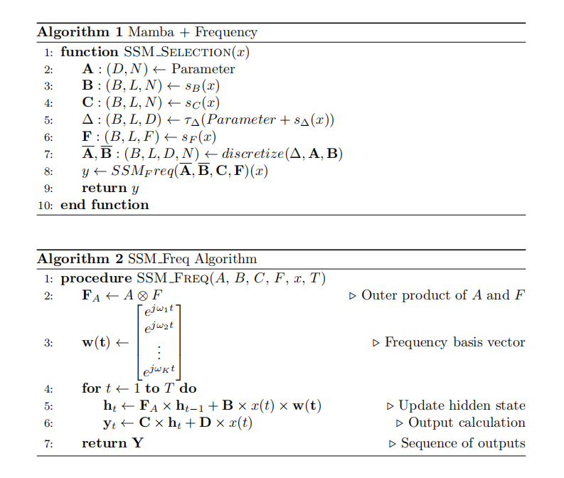

# Mamba主要改进和实验
## mamba+SFM频率
### mamba+freq 基础模型
> 这里其实也是可以看作multi-scale的特征提取
使用SFM里面的频率分解思想，来改进mamba模型. 核心思想就是使用频率分解的隐藏状态替代原本的隐藏状态。

工作：
- 改动Mamba的SSM模块，把它变为频率分解的模块。
- 将mamba的输入与更新换为单步，而不是一整个序列。训练明显稳定了很多，收敛也快很多

结果：
1. 在金融数据集上效果相比于SFM没有明显改进但是也没明显退步，说明这样改至少没有添乱，调一调超参，改一改架构，效果肯定能更好。**在考虑是不是将模型应用到更大一点的数据集上测试。我认为这个数据集太小了，而且噪音太大，不同的随机种子对于最终效果影响过重了，很难对比不同模型性能好坏。我认为要对比模型的好坏的话，更换数据集势在必行，可以先换一个周期性比较明显的数据来测，测完超参数和模型之后，再回到噪音大的数据集**
2.  error：SFM、Mamba（单步更新）、Mamba+频率分解结果均稳定在error=28-30之间，根本没有拉开差距，或者说我们无法分辨到底是随机种子选取产生的差异还是模型性能差异。
### mamba+freq改
> 这里主要是验证几个改进方案。
- 将频率分解之后利用隐状态的时候，只利用实部，而不是振幅。这个更改之后，结果仍然是error在28-30之间，且结果方差大，也没拉开明显差距。
- 更改分解频率的时候的频率划分方法，通过其他方法选择频率。这里我们测试了两种：
    1. 第一种是直接将频率分解的时候，分解密度直接扩大p倍，然后在频率加入到隐状态的时候，每p个频率分量都平均一下，重新压缩回freq_size个频率，没有更改隐状态的维度。结果也是在28-30之间，这样的好处是，不会因此改变其它部分的复杂度。（相当于我只改了输入门，其他门一点没变）
    2. 第二种是，在分解的时候，比如原来要分解为10个频率，现在以这10个频率为中心，在周围取P个频率（也可以看作密度扩大p倍，只是不是均匀扩大，是有中心的）。这里相当于把输入门、遗忘门、隐状态维度全部扩充了P倍，只有输出门没变。结果：师兄给我的反馈是，平均差比之前差了1-2。

在频率这里，我计划将原有的数据里面加一个明显有某个周期的分量进去，然后观察特定频率分量的表现。比如我加个周期为5的分量蒙版到原序列，看看模型频率分解之后，该频率分量位置到底有哪些变化。
## mamba+patch
> 在transformer-based的模型中，近期的改进主要针对intra-channel的时序关系和inter-channel的特征关系来做。

受patchTST的启发，想要使得inter-channel的每个值包含更多的信息，我想将模型的输入也划分为几个几个一起的patch，这样或许能让一次输入的信息量更高，更能让模型捕捉局部的特征（不过mamba里面本来就有一个conv层了,而且，mamba是一个递归模型，或许这样的想法不合理，但是可以试一试）

## mamba+cross channel
受crossformer的启发，它将通道独立的不同特征最后使用了inter-channel的注意力机制给综合起来了。我们这里也可以将每一个独立的SSM通道用一种方法综合起来，效果是肯定会比独立的时候好的，只是需要看我们用什么方法综合起来。  

## TimesNet
本文为时序领域新SOTA。它以时序多周期性为出发点，将复杂的时间变化分解为多个周期内和周期间的变化，将一维时间序列转换为一组基于多个周期的二维张量，应用二维卷积核建模，提取复杂的时间变化，显著提升了TimesNet在五种主流时间序列分析任务（短期和长期预测、填补、分类和异常检测）的表现。这篇文章我还没有仔细看，可以参考一下它是怎么建模的。

这里简要说一下贡献：
1. 作者用FFT将原数据转为频谱，同时将1维序列转为2维序列。
2. 使用2D卷积核捕捉信息
3. 动态决定不同频率分量重要性。

这三个创新点我觉得我们的研究到目前阶段，都能用到。最近仔细去看一下。

短程时间序列预测第一

