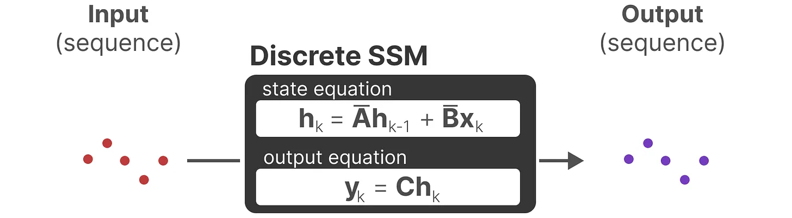

> [!NOTE|label:标注]
> 结合我自己学习mamba的知识，以及上次听师兄讲解Mamba，我整理了一下我自己脑子里面的知识进文档，并且随时添加新知识，以防忘记。还没整理完，后面的公式有点难打

# Mamba 基础
> transformer最大的问题是:它们都采用了注意力机制，而注意力随序列长度的二次增长。Mamba比差不多大小的Transformer性能要更好，而且计算量和序列长度呈线性缩放。

> RNN训练不能并行，但是推理的时候可以顺序执行。transformer训练的时候可以并行，但是推理的时候，每一个新token都要重新计算一次注意力。
> 
## 1. SSM 基础 （State Space Model，状态空间模型）
我这里未来节省时间，直接就写离散化之后的了。

SSM是一种描述动态系统的框架，该模型主要由两组方程组成分为状态方程、观测方程。分别代表：根据新的输入和上一个状态，更新模型的隐状态；根据应、隐状态和输入，推导出观测输出。 

其中x(t)代表t时刻的输入，h(t)是模型在t时刻的隐状态，y(t)是t时刻的观测输出。当然，这里h'(t)其实就代表h(t+1)。ABCD是四个系数，也可以变成某种变换。在SSM中，这四个系数（矩阵）是不变的，但是到后文这四个都是随着输入而不同的。（某些表达下，D矩阵甚至可以不要，直接根据包含了输入信息的隐状态h(t)/h(t+1)得到输出）

这个模型与RNN的区别在于，这个模型几乎是一个纯线性或者近似线性的模型。而RNN有激活函数。这也是为什么后续Mamba可以通过一些方法并行。
模型的具体架构也可以看这里：

## 2. 结构化序列空间模型 S4-Structured State Spaces for Sequences
这个模型对应于论文 [Efficiently Modeling Long Sequences with Structured State Spaces](https://arxiv.org/abs/2111.00396)
讲S4，那就要先讲SSM的更新结构表示 递归 or 卷积
### 2.1 递归的表示

根据简化的递推关系，我们可以递推出一系列$y_t$，这里以$y_2$举例：

由此类推“递归”$y_3$:

### 2.2 卷积的表示
根据上述的递归表达，得到了表达式

由于其中三个离散参数A、B、C都是常数，因此我们可以预先计算左侧向量并将其保存为卷积核，这为我们提供了一种使用卷积超高速计算y的简单方法。主要是由于在训练时卷积可以并行。
| 第一步| 第二步|第三步 |
| :--------------------: | :-----------------: | :-----------------: |
||||

所以根据上述描述，由于SSM模型是类似线性变换的RNN，所以SSMs可以当做是RNN与CNN的结合即推理用RNN结构，训练用CNN结构。RNN不行是因为它不是线性的。

## 2.3 S4模型
### 2.3.1 关于
我们可以看到，SSM中，A矩阵实际上就是推理出下一个状态的过程中最重要的。它决定了要如何记住上一个状态，以及生成下一个状态。

这里我们直接引用HIPPO，它使用矩阵构建一个“可以很好地捕获最近的token并衰减旧的token”状态表示（即通过函数逼近产生状态矩阵 A 的最优解），尝试将当前看到的所有输入信号压缩为系数向量。具体讲解看链接，这里只需要知道有这么一个函数。
> 原文：[HiPPO: Recurrent Memory with Optimal Polynomial Projections](https://proceedings.neurips.cc/paper/2020/hash/102f0bb6efb3a6128a3c750dd16729be-Abstract.html)
> 讲解：[HIPPO 2.2小节](https://blog.csdn.net/v_JULY_v/article/details/134923301?ops_request_misc=%257B%2522request%255Fid%2522%253A%2522171560160716800197016431%2522%252C%2522scm%2522%253A%252220140713.130102334.pc%255Fall.%2522%257D&request_id=171560160716800197016431&biz_id=0&utm_medium=distribute.pc_search_result.none-task-blog-2~all~first_rank_ecpm_v1~rank_v31_ecpm-3-134923301-null-null.142^v100^pc_search_result_base2&utm_term=SSM%E6%A8%A1%E5%9E%8Bmamba&spm=1018.2226.3001.4187)

### s4的伪代码：

批量大小为B、长度为L、D个通道，隐变量的维度是N。

> 接下来，关键点在于深入探讨各个变量的含义及其与“门控”机制的关联（并尖锐地指出这些变量变为可变时的潜在影响）下面引用自：[csdn博客](https://blog.csdn.net/v_JULY_v/article/details/134923301?ops_request_misc=%257B%2522request%255Fid%2522%253A%2522171560160716800197016431%2522%252C%2522scm%2522%253A%252220140713.130102334.pc%255Fall.%2522%257D&request_id=171560160716800197016431&biz_id=0&utm_medium=distribute.pc_search_result.none-task-blog-2~all~first_rank_ecpm_v1~rank_v31_ecpm-3-134923301-null-null.142^v100^pc_search_result_base2&utm_term=SSM%E6%A8%A1%E5%9E%8Bmamba&spm=1018.2226.3001.4187)。
> 数据依赖的$\Delta$扮演着一种广义的RNN门控角色（$\Delta$作为SSMs输入离散化的步骤大小，是启发式门控机制的原理基础）。
> 这意味着，类似于RNN中的遗忘门，数据依赖的$\Delta$根据输入的重要性调节对当前输入的关注或忽视程度。正如MAMBA论文作者回复审稿人时所述：“总的来说，$\Delta$控制了在多大程度上聚焦或忽视当前输入。它在机制上类似于定理1中的门控角色，大的$\Delta$会重置状态并集中于当前输入，而小的$\Delta$则保留状态并忽略当前输入。”
> 简而言之，对于重要的输入，其对应的步长$\Delta$较大，因此获得更多的关注；而对于不重要的输入，步长较短，几乎被模型忽略。这种机制使得模型能够对不同输入有选择性地关注或忽略，实现信息处理的详略得当、主次分明，类似于决定哪些信息进入或离开RNN的记忆单元。
> **输入与输出门的相似性**
> 进一步地，如果允许修改矩阵B和C，模型就能更精细地控制输入$x_t$如何影响状态$h_t$以及状态$h_t$如何转化为输出$y_t$，这恰似RNN中的输入门和输出门功能。MAMBA通过动态调整B和C（使其具有选择性），实现了对输入内容的细粒度控制，解决了内容感知问题。
> **多尺度/细粒度门控的作用**
这一特性意味着，对于SSM的每个隐藏状态维度，矩阵A可以发挥不同的作用，实现多尺度或细粒度的门控效果，这与LSTM中使用逐元素乘法的原理相呼应。MAMBA通过结合输入序列长度和批量大小，使B、C矩阵乃至步长$\Delta$都依赖于输入，意味着针对每个输入token，可以有定制化的B和C矩阵，从而精准地筛选出应保留和忽略的内容信息。
