# agentUniverse 框架介绍

> 来源：蚂蚁集团金融实践 | 版本：0.0.19 | 协议：Apache 2.0 | Python 3.10+

---

## 目录

1. [框架概述](#一框架概述)
2. [整体架构](#二整体架构)
3. [核心模块详解](#三核心模块详解)
4. [多智能体协作模式](#四多智能体协作模式)
5. [金融方向应用](#五金融方向应用)
6. [为什么有效](#六为什么有效)
7. [可观测性与运维](#七可观测性与运维)
8. [扩展与集成](#八扩展与集成)
9. [总结](#九总结)

---

## 一、框架概述

### 1.1 核心定位

agentUniverse 的核心定位是：**帮助开发者构建具备领域专家级别能力的智能体，并通过多智能体协作完成复杂任务。**

- 将复杂问题分解为可执行的子任务
- 让多个专业智能体各司其职、协同作战
- 通过迭代审查机制保证输出质量
- 在金融、法律、研究等专业领域达到专家水准

### 1.2 设计哲学

| 原则 | 说明 |
|------|------|
| **专业化分工** | 每个 Agent 只做一件事，做到极致 |
| **协作优于单打** | 复杂任务由多 Agent 流水线完成，而非单一模型 |
| **可扩展性优先** | 所有组件均可替换、自定义，无强绑定 |
| **生产级可靠性** | 来自蚂蚁集团真实业务验证，非实验室产物 |
| **领域知识注入** | 支持将行业知识、专家经验嵌入 Agent 行为 |

### 1.3 与其他框架的对比定位

```
通用性  ←————————————————————→  专业性
LangChain    AutoGen    CrewAI    agentUniverse
（工具链）  （对话协作）（角色扮演）  （领域专家协作）
```

---

## 二、整体架构

### 2.1 分层架构图

```mermaid
flowchart TB
    U[用户 / 业务系统] --> P

    subgraph P[产品层]
        direction LR
        P1[支小助]
        P2[自定义业务产品]
    end

    subgraph S[服务层 Agent Serve]
        direction LR
        S1[REST]
        S2[gRPC]
        S3[MCP]
    end

    subgraph O[编排层]
        direction LR
        O1[Workflow]
        O2[PEER / DOE]
        O3[多 Agent 协作]
    end

    subgraph A[智能体层]
        direction LR
        A1[Planning]
        A2[Executing]
        A3[Expressing]
        A4[Reviewing]
        A5[RAG / ReAct / NL2API]
    end

    subgraph C[能力层]
        direction LR
        C1[LLM]
        C2[Knowledge]
        C3[Memory]
        C4[Tool]
        C5[Prompt]
        C6[Context]
    end

    subgraph B[基础层]
        direction LR
        B1[YAML 配置]
        B2[组件注册]
        B3[OpenTelemetry]
        B4[数据库 / 向量库]
    end

    P --> S --> O --> A --> C --> B

    classDef layer fill:#eef2ff,stroke:#4338ca,stroke-width:1.4px,color:#1e1b4b;
    classDef node fill:#ffffff,stroke:#cbd5e1,color:#0f172a;
    class P,S,O,A,C,B layer;
    class P1,P2,S1,S2,S3,O1,O2,O3,A1,A2,A3,A4,A5,C1,C2,C3,C4,C5,C6,B1,B2,B3,B4 node;
```

### 2.2 目录结构总览

```
agentUniverse/
├── agentuniverse/          # 核心框架
│   ├── agent/              # Agent 实现与模式
│   ├── agent_serve/        # 服务化基础设施
│   ├── base/               # 基础组件
│   ├── llm/                # 大模型集成
│   ├── workflow/           # 工作流引擎
│   ├── prompt/             # 提示词管理
│   └── database/           # 数据库层
├── agentuniverse_connector/ # 外部连接器
├── agentuniverse_extension/ # 扩展插件
├── agentuniverse_product/   # 产品层
├── examples/               # 示例应用
├── dataset/                # 金融训练数据集
└── docs/                   # 文档
```

---

## 三、核心模块详解

### 3.1 Agent 模块

Agent 模块是整个框架的核心，位于 `agentuniverse/agent/`，包含以下子系统：

#### 3.1.1 预置 Agent 类型（11种）

| Agent 类型 | 职责 | 典型场景 |
|-----------|------|---------|
| **Planning Agent** | 将复杂问题分解为结构化子任务 | 金融报告分析任务拆解 |
| **Executing Agent** | 执行具体子任务，调用工具获取信息 | 数据查询、API 调用 |
| **Expressing Agent** | 将多个执行结果综合为连贯输出 | 研究报告撰写 |
| **Reviewing Agent** | 对输出进行质量评估，触发迭代 | 事实核查、逻辑审查 |
| **RAG Agent** | 基于知识库检索增强生成 | 政策文件问答 |
| **RAG Route Agent** | 带路由的 RAG，智能选择知识源 | 多知识库场景 |
| **ReAct Agent** | 推理-行动交替循环 | 需要多步推理的任务 |
| **NL2API Agent** | 自然语言转 API 调用 | 系统集成、数据接口 |
| **Summary Agent** | 内容摘要与压缩 | 长文档处理 |
| **Workflow Agent** | 基于工作流图的 Agent | 固定流程自动化 |
| **Slave RAG Agent** | 从属 RAG，配合主 Agent 工作 | 多 Agent 协作中的知识支撑 |

#### 3.1.2 Agent 内部结构

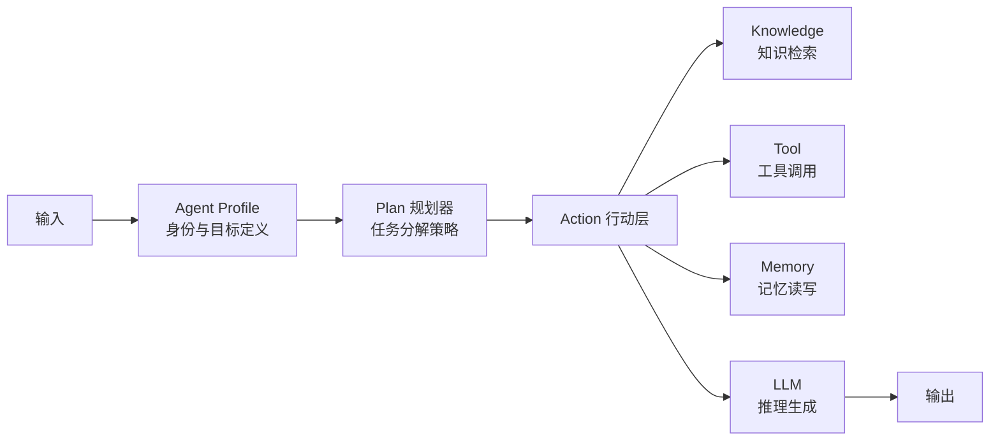

#### 3.1.3 Agent 工作模式

**单 Agent 模式**：适合简单、明确的任务，Agent 独立完成从理解到输出的全流程。

**多 Agent 协作模式**：适合复杂、专业的任务，多个 Agent 按照预定模式（PEER/DOE）分工协作，每个 Agent 只负责自己最擅长的环节。

---

### 3.2 LLM 模块

LLM 模块位于 `agentuniverse/llm/`，负责统一管理所有大模型的接入与调用。

#### 3.2.1 设计思路

- 不同 Agent 可以使用不同模型（如规划用 GPT-4，执行用 Qwen）
- 模型切换无需修改业务逻辑
- 支持模型降级与容错

#### 3.2.2 支持的模型矩阵

| 厂商 | 代表模型 | 适用场景 |
|------|---------|---------|
| **通义千问 (Qwen)** | Qwen3、Qwen2.5-72B、QwQ-32B | 中文金融场景首选 |
| **DeepSeek** | DeepSeek-R1、DeepSeek-V3 | 深度推理任务 |
| **OpenAI** | GPT-4o、o1、o3-mini | 通用高质量任务 |
| **Claude** | Claude 3.7 Sonnet、3.5 Sonnet | 长文档分析 |
| **Gemini** | Gemini 2.5 Pro、2.0 Flash | 多模态任务 |
| **文心一言** | ERNIE 4.5、4.0 | 国内合规场景 |
| **ChatGLM** | ChatGLM3-6B | 私有化部署 |
| **Llama** | Llama3.3-70B | 开源自托管 |
| **豆包 (Doubao)** | Doubao-Pro、Doubao-Lite | 字节系集成 |
| **KIMI** | moonshot-v1 | 超长上下文 |

#### 3.2.3 LLM Channel 抽象

LLM Channel 是模型调用的统一通道，支持：

- **同步调用**：等待模型返回完整结果
- **流式调用**：逐 token 返回，适合实时展示
- **批量调用**：并发处理多个请求
- **LangChain 集成**：通过 LangChain 实例兼容更多模型

---

### 3.3 Knowledge 知识模块

Knowledge 模块负责管理 Agent 可访问的外部知识，是 RAG（检索增强生成）能力的核心支撑。

#### 3.3.1 知识处理流程

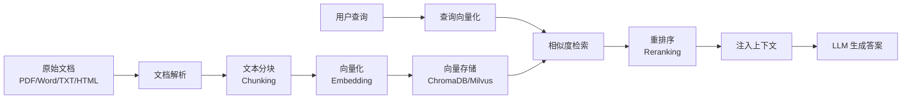

#### 3.3.2 知识库类型

| 类型 | 说明 | 金融应用 |
|------|------|---------|
| **文档知识库** | 结构化/非结构化文档 | 研究报告、招股书、年报 |
| **实时知识库** | 接入实时数据源 | 市场行情、新闻资讯 |
| **专家知识库** | 人工整理的专业知识 | 投资策略、风控规则 |
| **API 知识库** | 通过 API 动态获取 | 财务数据、指标计算 |

#### 3.3.3 向量数据库支持

- **ChromaDB**：轻量级，适合开发和中小规模
- **Milvus**：高性能，适合生产级大规模部署
- 支持自定义向量存储后端

---

### 3.4 Memory 记忆模块

Memory 模块位于 `agentuniverse/agent/memory/`，解决 Agent 在多轮对话和长任务中的"记忆"问题。

#### 3.4.1 记忆的三个维度

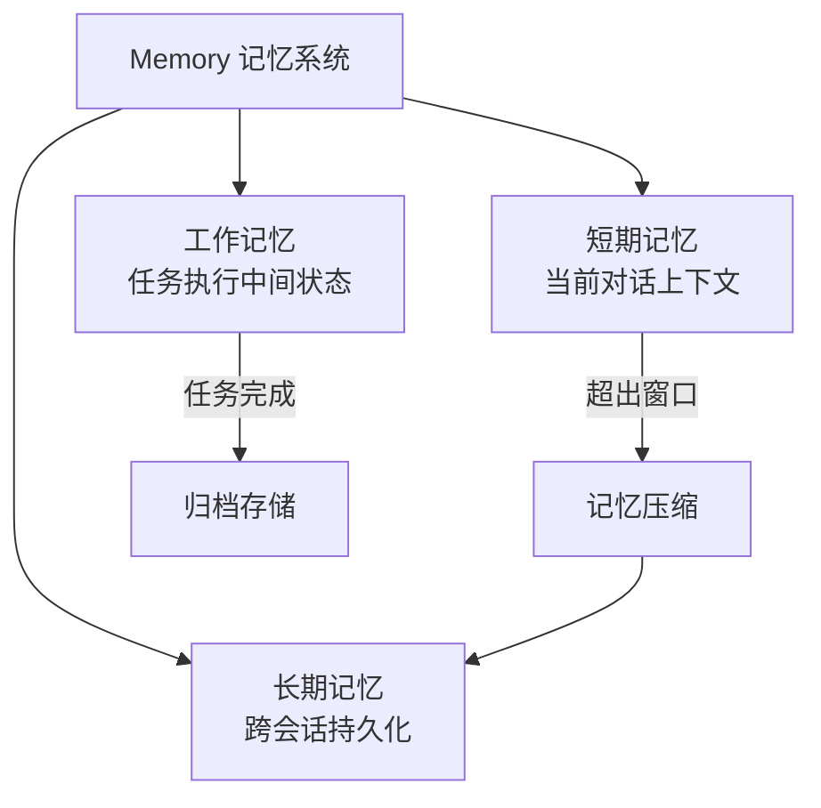

#### 3.4.2 记忆压缩策略

| 策略 | 方式 | 适用场景 |
|------|------|---------|
| **截断 (Truncate)** | 保留最近 N 条，丢弃早期内容 | 简单对话 |
| **选择性保留 (Selective)** | 按重要性评分保留关键信息 | 信息密度高的任务 |
| **摘要压缩 (Summarize)** | 用 LLM 将历史压缩为摘要 | 长对话场景 |
| **混合策略 (Hybrid)** | 结合多种策略 | 复杂多轮任务 |
| **自适应 (Adaptive)** | 根据任务类型动态选择 | 通用场景 |

#### 3.4.3 记忆存储后端

- **内存存储**：高速，会话结束后清除
- **数据库存储**：持久化，支持跨会话检索
- **向量存储**：支持语义相似度检索历史记忆

---

### 3.5 Context 上下文模块

Context 模块是 agentUniverse 的高级特性，位于 `agentuniverse/agent/context/`，提供精细化的上下文工程能力。

#### 3.5.1 上下文工程的核心问题

#### 3.5.2 多层存储架构

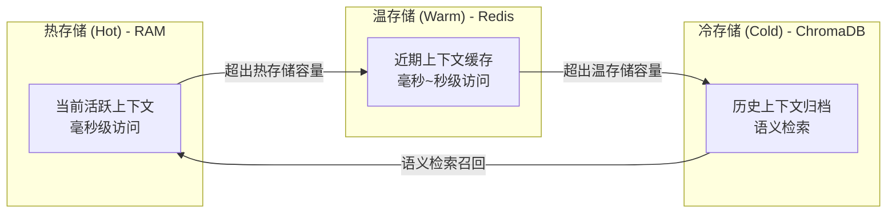

#### 3.5.3 上下文优先级体系

| 优先级 | 级别 | 说明 | 示例 |
|--------|------|------|------|
| **CRITICAL** | 最高 | 永不压缩，始终保留 | 系统指令、核心约束 |
| **HIGH** | 高 | 尽量保留 | 当前任务目标、关键事实 |
| **MEDIUM** | 中 | 空间不足时压缩 | 背景信息、参考资料 |
| **LOW** | 低 | 优先压缩 | 辅助信息 |
| **EPHEMERAL** | 临时 | 单次使用后丢弃 | 中间计算结果 |

#### 3.5.4 知识-上下文同步

Context 模块支持与 Knowledge 模块的**双向同步**：

- 知识库更新时，自动刷新相关上下文
- 上下文中发现的新知识，可反向写入知识库
- 冲突解决机制：时间戳优先、置信度加权

---

### 3.6 Workflow 工作流模块

Workflow 模块位于 `agentuniverse/workflow/`，提供基于有向图的任务编排能力。

#### 3.6.1 工作流 vs 多 Agent 协作

| 维度 | Workflow 工作流 | 多 Agent 协作模式 |
|------|---------------|----------------|
| **适用场景** | 流程固定、步骤明确 | 任务复杂、需要动态决策 |
| **灵活性** | 低（预定义路径） | 高（Agent 自主决策） |
| **可预测性** | 高 | 中 |
| **典型用途** | 审批流、数据处理管道 | 研究分析、复杂问答 |

#### 3.6.2 工作流图结构

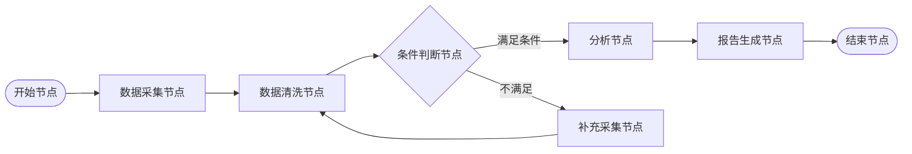

#### 3.6.3 节点类型

- **Agent 节点**：调用指定 Agent 执行任务
- **LLM 节点**：直接调用大模型
- **工具节点**：执行特定工具或 API
- **条件节点**：根据结果分支执行
- **并行节点**：多个子任务并发执行
- **聚合节点**：汇总并行结果

#### 3.6.4 可视化画布

agentUniverse 集成了 **difizen** 可视化平台，支持通过拖拽方式设计工作流，无需编写配置文件，适合业务人员使用。

---

### 3.7 Prompt 提示词模块

Prompt 模块位于 `agentuniverse/prompt/`，提供系统化的提示词管理能力。

#### 3.7.1 提示词管理的必要性

- 提示词版本管理（避免随意修改导致效果退化）
- 提示词模板化（支持变量注入）
- 多语言提示词（中英文切换）
- 提示词与 Agent 的解耦（修改提示词无需改代码）

#### 3.7.2 提示词结构

| 部分 | 说明 | 示例 |
|------|------|------|
| **System Prompt** | 定义 Agent 的角色、能力、约束 | "你是一位专业的金融分析师..." |
| **Few-shot Examples** | 提供示例输入输出，引导行为 | 问题-答案对示例 |
| **Task Template** | 当前任务的动态模板 | "请分析以下公司的财务状况：{company}" |

---

### 3.8 Tool 工具模块

Tool 模块位于 `agentuniverse/agent/action/`，为 Agent 提供与外部世界交互的能力。

#### 3.8.1 工具分类

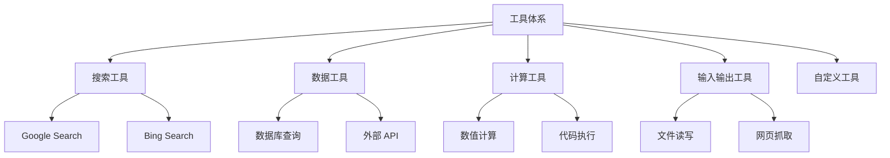

#### 3.8.2 Toolkit 工具包

- **金融数据 Toolkit**：股价查询 + 财务指标 + 新闻搜索
- **研究 Toolkit**：网页搜索 + PDF 解析 + 摘要生成
- **计算 Toolkit**：Python 执行 + 数学计算 + 图表生成

#### 3.8.3 MCP 协议支持

agentUniverse 支持 **Model Context Protocol (MCP)**，可以接入任何符合 MCP 标准的工具服务，大幅扩展工具生态。

---

### 3.9 Agent Serve 服务模块

Agent Serve 模块位于 `agentuniverse/agent_serve/`，负责将 Agent 能力对外暴露为服务。

#### 3.9.1 服务化架构

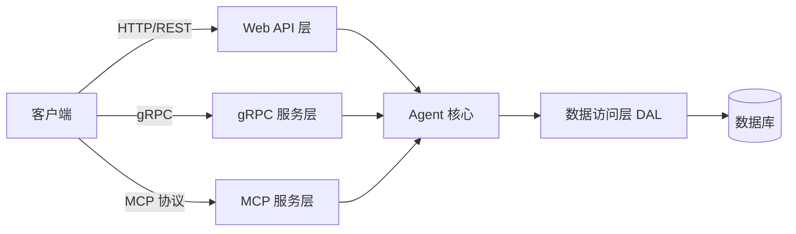

#### 3.9.2 服务层功能

| 功能 | 说明 |
|------|------|
| **会话管理** | 维护多轮对话状态，支持会话隔离 |
| **请求路由** | 将请求分发到对应 Agent |
| **流式响应** | 支持 SSE/WebSocket 实时推送 |
| **认证鉴权** | API Key、OAuth 等认证方式 |
| **限流熔断** | 保护后端 Agent 不被过载 |
| **OpenAI 兼容** | 提供与 OpenAI API 兼容的接口，方便迁移 |

---

### 3.10 Product 产品层

Product 层位于 `agentuniverse_product/`，是框架与具体业务产品之间的桥梁。

#### 3.10.1 产品层职责

- **Agent 服务**：管理 Agent 的生命周期
- **知识服务**：知识库的增删改查
- **会话服务**：用户会话管理
- **消息服务**：消息存储与检索
- **插件服务**：第三方插件集成
- **工作流服务**：工作流的创建与执行

#### 3.10.2 数据访问层 (DAL)

产品层通过 DAL（Data Access Layer）统一管理数据持久化，支持：

- 关系型数据库（通过 SQLAlchemy ORM）
- 向量数据库（ChromaDB、Milvus）
- 缓存层（Redis）

---

## 四、多智能体协作模式

### 4.1 PEER 模式

PEER 是 agentUniverse 的核心创新，也是其在金融领域取得优异效果的关键。PEER 代表四个阶段：**Plan（规划）→ Execute（执行）→ Express（表达）→ Review（审查）**。

#### 4.1.1 PEER 模式总览

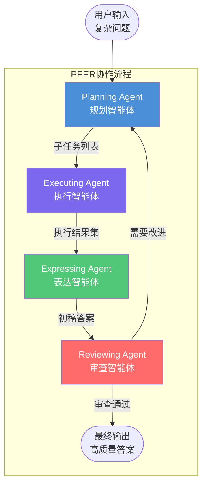

#### 4.1.2 各阶段详解

**Planning Agent — 规划阶段**

- 识别问题的核心维度（如：公司基本面、行业趋势、估值分析）
- 确定子任务的执行顺序和依赖关系
- 为每个子任务指定所需的工具和知识源
- 输出结构化的任务计划

**Executing Agent — 执行阶段**

- 调用搜索工具获取实时信息
- 查询知识库获取专业知识
- 调用数据 API 获取结构化数据
- 对每个子任务产出独立的执行结果

**Expressing Agent — 表达阶段**

- 消除各子任务结果之间的矛盾
- 按照逻辑顺序组织内容
- 调整语言风格以匹配目标受众
- 生成结构化的报告或回答

**Reviewing Agent — 审查阶段**

| 评估维度 | 说明 |
|---------|------|
| **完整性** | 是否覆盖了所有关键问题 |
| **相关性** | 内容是否与问题高度相关 |
| **简洁性** | 是否避免了冗余信息 |
| **事实性** | 数据和事实是否准确 |
| **逻辑性** | 推理链条是否严密 |
| **结构性** | 内容组织是否清晰 |
| **全面性** | 是否考虑了多个角度 |

#### 4.1.3 PEER 模式 SOP

```
PEER 执行标准操作流程 (SOP)

阶段 1：问题接收与规划
  ├── 1.1 解析用户输入，识别核心意图
  ├── 1.2 评估问题复杂度（简单/中等/复杂）
  ├── 1.3 分解为 N 个子任务（N 通常为 3-7）
  ├── 1.4 为每个子任务分配工具和知识源
  └── 1.5 输出结构化任务计划 → 传递给 Executing Agent

阶段 2：并行/串行执行
  ├── 2.1 接收任务计划
  ├── 2.2 按依赖关系确定执行顺序
  ├── 2.3 对每个子任务：
  │     ├── 调用指定工具获取信息
  │     ├── 查询知识库补充背景
  │     └── 生成子任务结果
  └── 2.4 汇总所有子任务结果 → 传递给 Expressing Agent

阶段 3：结果综合与表达
  ├── 3.1 接收所有子任务结果
  ├── 3.2 检测并解决结果间的矛盾
  ├── 3.3 按逻辑结构组织内容
  ├── 3.4 生成初稿答案
  └── 3.5 输出初稿 → 传递给 Reviewing Agent

阶段 4：质量审查
  ├── 4.1 接收初稿答案
  ├── 4.2 按 7 个维度逐一评分
  ├── 4.3 判断是否达到质量阈值
  │     ├── 通过 → 输出最终答案
  │     └── 不通过 → 生成改进意见 → 返回阶段 1
  └── 4.4 记录迭代次数（防止无限循环，通常最多 3 次）
```

#### 4.1.4 PEER 模式的学术验证

| 对比场景 | PEER 准确率 | 对手准确率 |
|---------|-----------|---------|
| vs BabyAGI (GPT-3.5 Turbo) | **83%** | 17% |
| vs BabyAGI (GPT-4) | **81%** | 19% |

---

### 4.2 DOE 模式

DOE 模式是专为**数据密集型**任务设计的协作模式，代表：**Data-fining（数据精炼）→ Opinion-inject（观点注入）→ Express（表达）**。

#### 4.2.1 DOE 模式流程

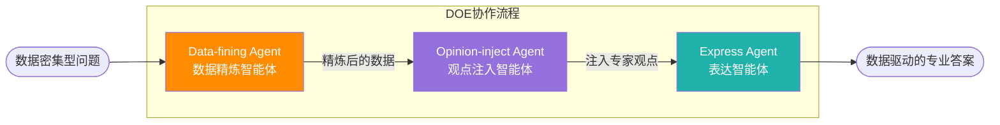

#### 4.2.2 各阶段说明

**Data-fining（数据精炼）**：从多个数据源采集原始数据，进行清洗、去重、标准化，提取关键指标和趋势。

**Opinion-inject（观点注入）**：将领域专家的知识、投资逻辑、行业经验注入到数据分析中，使纯数据分析具备专业解读能力。

**Express（表达）**：将数据与专家观点融合，生成兼具数据支撑和专业洞察的最终输出。

#### 4.2.3 PEER vs DOE 选择指南

| 场景特征 | 推荐模式 |
|---------|---------|
| 问题复杂、需要多角度分析 | PEER |
| 数据量大、需要专业解读 | DOE |
| 需要质量迭代和自我审查 | PEER |
| 数据处理 + 专家知识融合 | DOE |
| 金融研究报告 | PEER |
| 量化数据分析报告 | DOE |

---

## 五、金融方向应用

### 5.1 金融场景的特殊挑战

金融领域对 AI 系统提出了远高于通用场景的要求：

| 挑战 | 说明 |
|------|------|
| **专业深度** | 需要理解财务报表、估值模型、宏观经济等专业知识 |
| **事实准确性** | 数据错误可能导致重大决策失误 |
| **时效性** | 市场信息瞬息万变，需要实时数据支撑 |
| **多维分析** | 一个投资决策需要从基本面、技术面、宏观面等多角度分析 |
| **合规要求** | 输出内容需符合监管要求，不能有误导性表述 |
| **长文档处理** | 年报、招股书动辄数百页，需要高效提取关键信息 |

### 5.2 金融应用场景全景

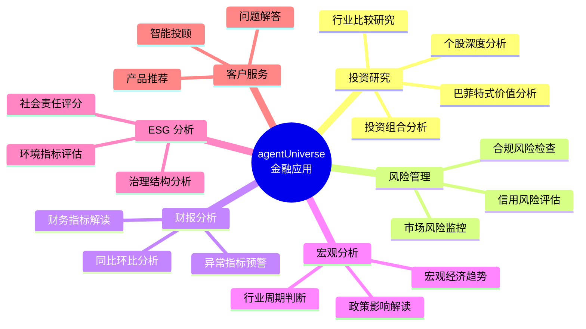

### 5.3 典型案例：巴菲特减持比亚迪分析

这是 agentUniverse 官方示例中的金融分析案例，展示了 PEER 模式在真实金融问题上的应用。

**问题**：分析巴菲特 2023 年减持比亚迪股份的原因及影响

**PEER 执行过程**：

```
Planning Agent 输出的任务分解：
  子任务 1：查询巴菲特减持比亚迪的具体时间线和数量
  子任务 2：分析比亚迪 2023 年的财务表现和估值水平
  子任务 3：研究巴菲特的投资哲学和历史减持案例
  子任务 4：分析新能源汽车行业竞争格局变化
  子任务 5：评估减持对比亚迪股价和市场情绪的影响

Executing Agent 执行：
  → 调用 Google Search 获取减持新闻和公告
  → 查询财务数据库获取比亚迪财报数据
  → 检索知识库中的巴菲特投资理念文档
  → 获取新能源汽车行业分析报告

Expressing Agent 综合：
  → 整合五个维度的分析结果
  → 形成"减持原因 + 市场影响 + 投资启示"的结构化报告

Reviewing Agent 审查：
  → 检查数据引用是否准确
  → 验证逻辑推理是否严密
  → 确认结论是否有充分支撑
```

### 5.4 金融专用数据集

agentUniverse 提供了 **PEER 金融训练数据集**，包含 100 个专业金融问题，覆盖 9 大类别：

| 类别 | 说明 | 示例问题 |
|------|------|---------|
| **信息查询** | 基础金融数据查询 | "XX 公司最新市盈率是多少？" |
| **通用问答** | 金融概念解释 | "什么是可转债？" |
| **报告解读** | 财报、研报分析 | "解读 XX 公司 2023 年年报" |
| **标的分析** | 个股/基金深度分析 | "分析 XX 股票的投资价值" |
| **策略建议** | 投资策略制定 | "当前市场环境下如何配置资产？" |
| **重大事件** | 市场事件影响分析 | "分析美联储加息对 A 股的影响" |
| **宏观分析** | 宏观经济研究 | "分析当前通胀形势" |
| **市场分析** | 市场趋势判断 | "分析当前 A 股市场结构" |
| **政策解读** | 监管政策影响 | "解读最新证监会政策对市场的影响" |

### 5.5 支小助（Zhi Xiao Zhu）产品

支小助是蚂蚁集团基于 agentUniverse 构建的面向金融专业人士的 AI 助手，是框架在生产环境中的最佳实践。

**核心特点**：

- 使用 **Finix 金融专用模型**，在金融领域精度更高
- 覆盖投资研究、ESG 分析、财务分析、财报解读等核心场景
- 已在蚂蚁集团内部大规模验证，服务真实金融业务
- 对外开放访问：https://zhu.alipay.com

**支小助的 Agent 架构**：

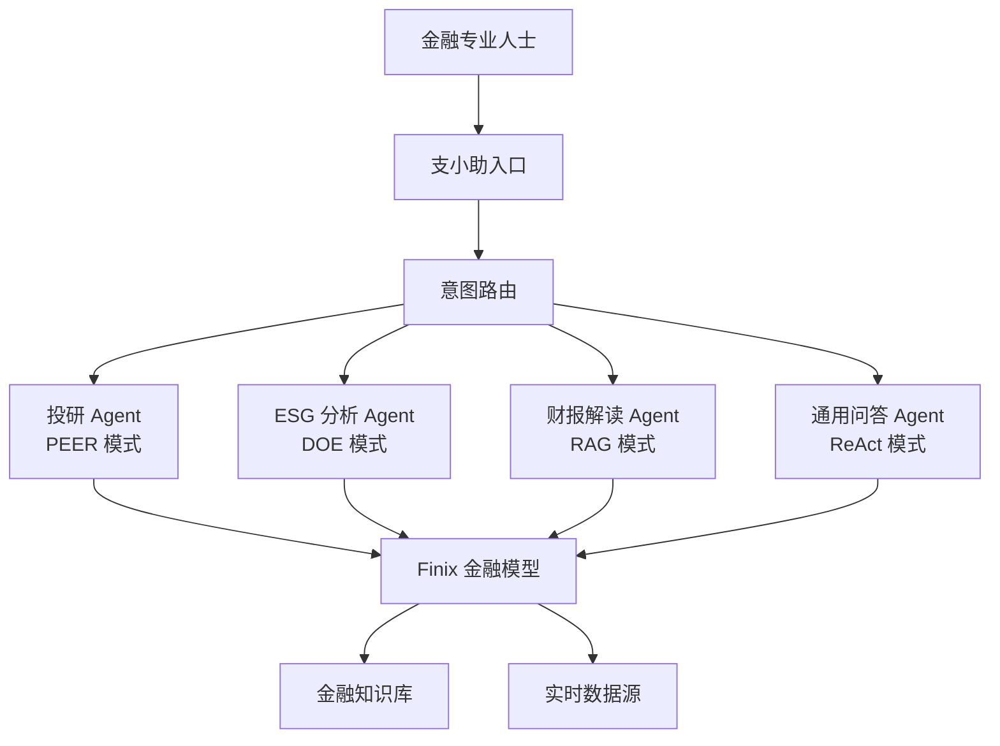

---

## 六、为什么有效

### 6.1 技术层面的有效性

#### 6.1.3 RAG 增强的事实准确性

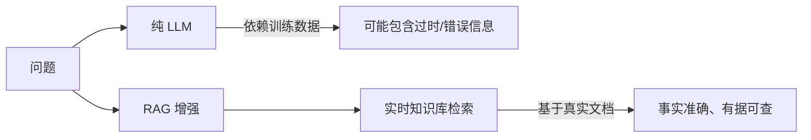

### 6.2 工程层面的有效性

#### 6.2.2 组件化与可扩展性

| 组件 | 可替换内容 |
|------|---------|
| LLM | 任意支持的模型，甚至私有化部署的模型 |
| 向量数据库 | ChromaDB → Milvus → 自定义 |
| 工具 | 内置工具 + 自定义工具 + MCP 工具 |
| Agent 类型 | 11 种预置 + 完全自定义 |
| 协作模式 | PEER/DOE + 自定义模式 |

### 6.3 业务层面的有效性

## 七、可观测性与运维

### 7.2 OpenTelemetry 全链路追踪

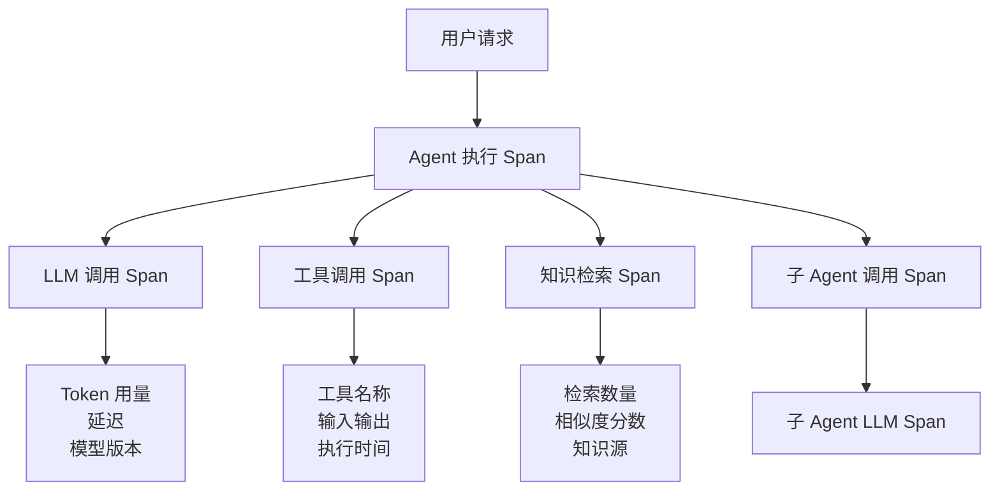

### 7.3 监控指标体系

| 指标类别 | 关键指标 | 用途 |
|---------|---------|------|
| **性能指标** | 端到端延迟、各 Agent 耗时、LLM 响应时间 | 性能优化 |
| **质量指标** | Reviewing Agent 评分、迭代次数、通过率 | 质量监控 |
| **成本指标** | Token 消耗量、API 调用次数、费用统计 | 成本控制 |
| **可靠性指标** | 错误率、超时率、重试次数 | 稳定性保障 |
| **业务指标** | 用户满意度、任务完成率 | 业务效果 |

## 八、扩展与集成

### 8.1 扩展机制

agentUniverse 的扩展性体现在每个层面都支持自定义：

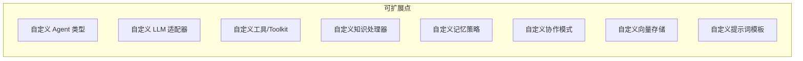

### 8.2 外部系统集成

#### 8.2.1 与主流 AI 框架集成

| 框架 | 集成方式 | 用途 |
|------|---------|------|
| **LangChain** | 原生集成 | 复用 LangChain 的工具和模型 |
| **MCP** | 协议支持 | 接入 MCP 生态的工具服务 |
| **OpenAI API** | 兼容接口 | 无缝迁移 OpenAI 应用 |

#### 8.2.2 与数据系统集成

| 系统类型 | 支持方案 |
|---------|---------|
| **关系型数据库** | SQLAlchemy ORM，支持 MySQL/PostgreSQL/SQLite |
| **向量数据库** | ChromaDB（内置）、Milvus（扩展） |
| **缓存系统** | Redis（上下文温存储） |
| **消息队列** | 通过自定义工具集成 |

### 8.3 部署模式

| 部署模式 | 说明 | 适用场景 |
|---------|------|---------|
| **本地开发** | 单机运行，快速验证 | 开发测试 |
| **容器化部署** | Docker/Kubernetes | 生产环境 |
| **私有化部署** | 完全内网，数据不出境 | 金融合规场景 |
| **混合云** | 核心数据私有，计算弹性扩展 | 大规模生产 |

---

## 九、总结

### 9.1 框架核心价值总结

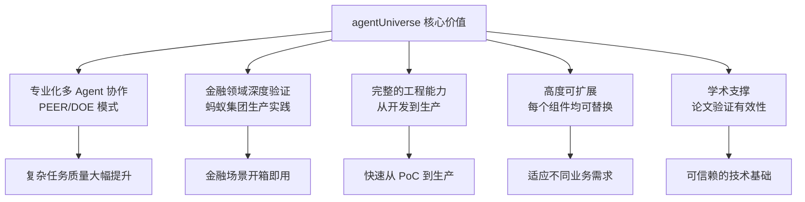

### 9.2 各模块功能速查表

| 模块 | 位置 | 核心功能 | 金融应用 |
|------|------|---------|---------|
| **Agent** | `agentuniverse/agent/` | 11种预置Agent，PEER/DOE协作 | 投研分析、报告生成 |
| **LLM** | `agentuniverse/llm/` | 10+模型统一接入 | 灵活选择最优模型 |
| **Knowledge** | `agentuniverse/agent/action/knowledge/` | RAG知识库管理 | 年报、研报知识库 |
| **Memory** | `agentuniverse/agent/memory/` | 多策略记忆压缩 | 长对话金融咨询 |
| **Context** | `agentuniverse/agent/context/` | 三层存储上下文工程 | 复杂分析任务 |
| **Workflow** | `agentuniverse/workflow/` | 图结构工作流编排 | 固定流程自动化 |
| **Prompt** | `agentuniverse/prompt/` | 提示词版本管理 | 金融专业提示词 |
| **Tool** | `agentuniverse/agent/action/` | 工具/Toolkit/MCP | 数据获取、计算 |
| **Agent Serve** | `agentuniverse/agent_serve/` | REST/gRPC/MCP服务化 | 对外提供AI服务 |
| **Product** | `agentuniverse_product/` | 业务产品层 | 支小助等产品 |

### 9.3 适用场景判断

**agentUniverse 最适合以下场景**：

- 需要专业领域深度的复杂问答（金融、法律、医疗）
- 需要多步骤、多数据源的综合分析任务
- 对输出质量有严格要求、需要自动审查的场景
- 需要将专家知识系统化注入 AI 系统的场景
- 企业级生产部署，对稳定性和可观测性有要求

**相对不适合的场景**：

- 简单的单轮问答（过度设计）
- 实时性要求极高（多 Agent 协作有延迟）
- 完全通用的聊天机器人（无需领域专业化）

### 9.4 快速上手路径

```
新手入门路径：
  第一步：运行 examples/sample_apps/peer_agent_app 体验 PEER 模式
  第二步：修改 YAML 配置，替换为自己的 LLM 和工具
  第三步：基于 RAG Agent 构建自己的知识库问答
  第四步：设计自定义 PEER 流程，适配业务场景
  第五步：接入 Agent Serve，对外提供服务

金融场景专项路径：
  第一步：研究 dataset/peer_financial_training_dataset 了解金融问题类型
  第二步：参考 examples/sample_apps/peer_agent_app 的金融分析案例
  第三步：构建金融知识库（年报、研报、政策文件）
  第四步：配置金融专用工具（行情数据、财务数据 API）
  第五步：使用 PEER 模式构建投研分析 Agent
```

---

*文档生成时间：2026年5月 | 框架版本：agentUniverse 0.0.19 | 来源：蚂蚁集团开源*
