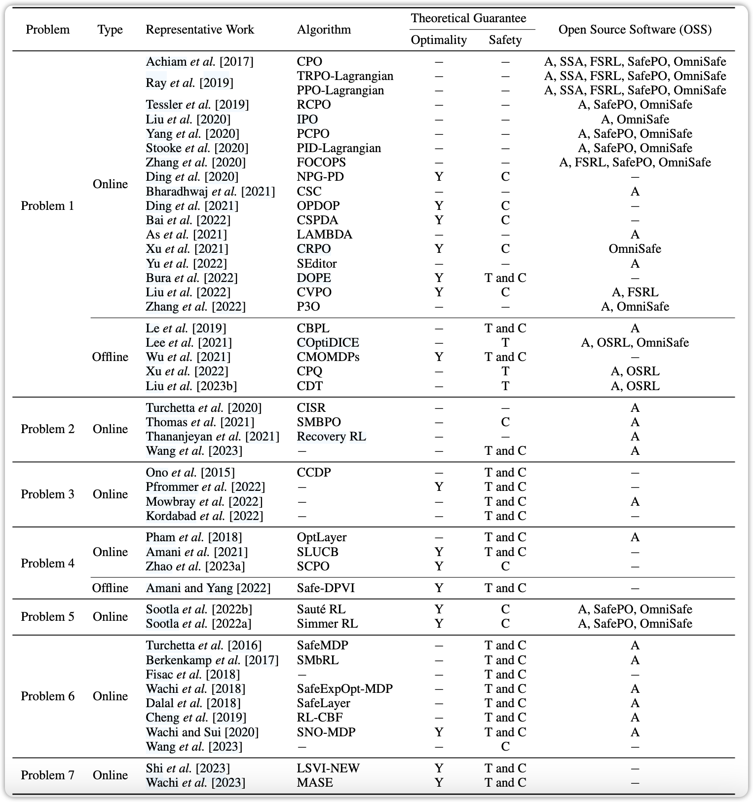
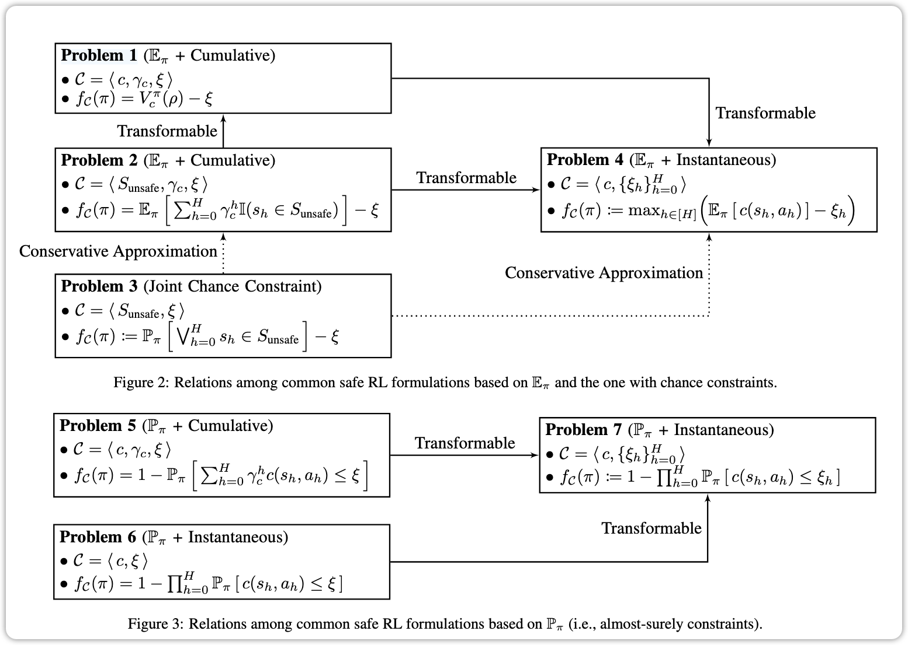

### 2. 预备知识
在深入探讨安全强化学习中的约束公式之前，有必要先了解一些基础概念和符号，这些预备知识为后续理解各种约束公式及其相关算法奠定了重要基础。
1. **约束马尔可夫决策过程（CMDP）**：本文将安全强化学习问题建模为约束马尔可夫决策过程（CMDP），其形式为\(\mathcal{M} \cup \mathcal{C}:=\underbrace{\left<\mathcal{S}, \mathcal{A}, \mathcal{P}, H, r, \gamma_{r}, \rho\right>}_{Standard MDP (\mathcal{M})} \cup \mathcal{C}\)。这里面，标准MDP部分包含了状态空间\(\mathcal{S} := \{s\}\)，它涵盖了智能体可能处于的所有状态；动作空间\(\mathcal{A} := \{a\}\)，表示智能体在每个状态下可采取的所有动作；状态转移函数\(\mathcal{P}: \mathcal{S}×\mathcal{A} \to \Delta(\mathcal{S})\)，其中\(\Delta(X)\)表示集合\(X\)上的概率单纯形，\(\mathcal{P}(s' | s, a)\)则是在状态\(s\)执行动作\(a\)后转移到状态\(s'\)的概率 。此外，\(H \in \mathbb{Z}_{+}\)是每个episode（情节，可理解为一次从初始状态到终止状态的完整交互过程）的固定有限长度；奖励函数\(r: \mathcal{S}×\mathcal{A} \to [0, 1]\)，用于衡量智能体在每个状态 - 动作对下获得的奖励；折扣因子\(\gamma_{r} \in [0, 1)\)，它决定了未来奖励在当前的重要程度，\(\gamma_{r}\)越接近1，未来奖励的权重越高；初始状态分布\(\rho \in \Delta(\mathcal{S})\)，表示智能体在episode开始时处于各个状态的概率。而与标准MDP的关键区别在于，这里引入了额外的元组\(\mathcal{C}\)，在本文后续内容中被称为“约束元组”，用于表示安全约束。虽然本文主要考虑有限horizon（时间跨度）且带折扣的CMDP，但其中的关键思想可以扩展到无限和/或无折扣的情况。
2. **策略与价值函数**：策略\(\pi: \mathcal{S} \to \Delta(\mathcal{A})\)是一个将状态映射到动作分布的函数，它决定了智能体在每个状态下选择不同动作的概率。所有可能的策略构成了策略类\(\Pi\)。给定一个策略\(\pi \in \Pi\)，价值函数用于评估该策略在不同状态下的长期累积奖励期望。具体来说，价值函数定义为\(V_{r, h}^{\pi}(s):=\mathbb{E}_{\pi}\left[\sum_{h' = h}^{H} \gamma_{r}^{h'} r\left(s_{h'}, a_{h'}\right) | s_{h} = s\right]\)，这里的期望\(\mathbb{E}_{\pi}\)是对由策略\(\pi\)和CMDP所诱导的随机状态 - 动作序列\(\{(s_{h'}, a_{h'})\}_{h' = h}^{H}\)取的。由于初始状态\(s_{0}\)是从\(\rho\)中采样得到的，为了简化符号，进一步定义\(V_{r}^{\pi}(\rho):=\mathbb{E}_{s \sim \rho}\left[V_{r, 0}^{\pi}(s)\right]\)，它表示从初始状态分布\(\rho\)出发，按照策略\(\pi\)执行时的期望累积奖励。
3. **约束策略优化问题**：在安全强化学习中，策略需要在满足安全约束的前提下进行优化。可行策略空间\(\widehat{\Pi} \subseteq \Pi\)是由给定的约束元组\(\mathcal{C}\)决定的，只有在这个可行空间内的策略才是满足安全要求的。因此，最优策略\(\pi^{*}: \mathcal{S} \to \Delta(\mathcal{A})\)被定义为\(\pi^{*}:=\underset{\pi \in \hat{\Pi}}{arg max } V_{r}^{\pi}(\rho)\)，即从所有满足安全约束的可行策略中选择能够最大化期望累积奖励\(V_{r}^{\pi}(\rho)\)的策略。解决安全强化学习问题通常包含两个主要步骤：问题公式化和策略优化。其中，安全约束的表示形式多样，不同的表示会导致不同的可行策略空间和问题求解方式，这也是后续章节重点讨论的内容。

### 3. 常见约束公式
这部分主要围绕基于约束准则的安全强化学习中常见的约束公式展开，详细介绍了各种约束公式的定义、特点以及相关算法，这些公式为在不同场景下构建安全强化学习问题提供了多样化的选择。
1. **期望累积安全约束**：一种广泛应用的安全强化学习公式是利用与奖励价值函数相似的结构来表示安全约束。首先，如同定义奖励相关的价值函数一样，定义关于安全的价值函数。在状态\(s\)、时间\(h\)时，安全价值函数为\(V_{c, h}^{\pi}(s):=\mathbb{E}_{\pi}\left[\sum_{h' = h}^{H} \gamma_{c}^{h'} c\left(s_{h'}, a_{h'}\right) | s_{h} = s\right]\)，其中\(c: \mathcal{S}×\mathcal{A} \to [0, 1]\)是安全成本函数，用于衡量在每个状态 - 动作对下的安全成本；\(\gamma_{c} \in [0, 1)\)是安全折扣因子，作用与奖励折扣因子类似，用于调整未来安全成本在当前的重要性。然后，对初始状态分布\(\rho\)取期望，得到\(V_{c}^{\pi}(\rho):=\mathbb{E}_{s \sim \rho}\left[V_{c, 0}^{\pi}(s)\right]\)。基于此，定义安全强化学习问题如下：设约束元组为\(C := < c, \gamma_{c}, \xi>\)，其中\(\xi \in \mathbb{R}_{+}\)是安全阈值，问题为\(\max _{\pi} V_{r}^{\pi}(\rho) s.t. V_{c}^{\pi}(\rho) \leq \xi\) 。在这个问题中，安全约束函数\(f_{C}: \Pi \to \mathbb{R}\)被定义为\(f_{\mathcal{C}}(\pi):=V_{c}^{\pi}(\rho) - \xi\)。该公式受欢迎的原因在于其安全约束与奖励价值函数具有较高的亲和力。例如，当\(\gamma_{r} = \gamma_{c}\)时，对于任意\(\lambda \in \mathbb{R}\)，有\(V_{r + \lambda c}^{\pi}(\rho)=V_{r}^{\pi}(\rho)+\lambda \cdot V_{c}^{\pi}(\rho)\)，这就引出了基于拉格朗日的方法。由于该问题的理论性质得到了深入研究，因此出现了许多具有最优性或安全性理论保证的算法，如Constrained Policy Optimization（CPO）、Reward - Constrained Policy Optimization（RCPO）等，许多实际应用中的算法都是基于这个问题构建的。
2. **状态约束**：另一种常见的公式是利用“状态”约束，这种方式适用于智能体需要避免访问一组不安全状态的场景，比如自主机器人在危险环境（如灾区）中执行任务。该公式可表述为：设约束元组为\(C := < S_{unsafe }, \gamma_{c}, \xi>\)，其中\(S_{unsafe } \subseteq \mathcal{S}\)是不安全状态集合，\(\gamma_{c} \in [0, 1)\)是安全成本函数的折扣因子，\(\xi \in \mathbb{R}_{+}\)是安全阈值。问题为\(\max _{\pi} V_{r}^{\pi}(\rho) s.t. \mathbb{E}_{\pi}\left[\sum_{h = 0}^{H} \gamma_{c}^{h} \mathbb{I}\left(s_{h} \in S_{unsafe }\right)\right] \leq \xi\)，这里\(\mathbb{I}(-)\)是指示函数，当括号内条件成立时，函数值为1，否则为0。在这个问题中，安全约束函数\(f_{C}: \Pi \to \mathbb{R}\)定义为\(f_{\mathcal{C}}(\pi):=\mathbb{E}_{\pi}\left[\sum_{h = 0}^{H} \gamma_{c}^{h} \mathbb{I}\left(s_{h} \in S_{unsafe }\right)\right] - \xi\)。此类公式在之前关于安全关键机器人任务的研究中被广泛采用。
3. **联合机会约束**：在控制理论领域，研究人员对基于联合机会约束的策略优化进行了探讨。这种安全约束的策略优化问题通常表述为：设约束元组为\(C := < S_{unsafe }, \xi>\)，其中\(S_{unsafe } \subseteq \mathcal{S}\)是不安全状态集合，\(\xi \in \mathbb{R}_{+}\)是安全阈值。问题为\(\max _{\pi} V_{r}^{\pi}(\rho) s.t. \mathbb{P}_{\pi}\left[\bigvee_{h = 0}^{H} s_{h} \in S_{unsafe }\right] \leq \xi\)，其中\(\mathbb{P}_{\pi}\)表示基于策略\(\pi\)和CMDP所诱导的随机状态 - 动作序列\(\{(s_{k'}, a_{k'})\}_{h' = h}^{H}\)计算得到的概率。在这个问题中，安全约束函数\(f_{C}: \Pi \to \mathbb{R}\)定义为\(f_{\mathcal{C}}(\pi):=\mathbb{P}_{\pi}\left[\bigvee_{h = 0}^{H} s_{h} \in S_{unsafe }\right] - \xi\)。然而，直接求解这类由联合机会约束表征的问题极具挑战性，因此大多数先前工作并不直接处理这种约束，而是采用一些近似或假设方法。例如，Pfrommer等人在2022年的研究中假设系统具有已知的线性时不变动力学；Ono等人在2015年则通过保守近似，将联合机会约束转化为具有加法结构的约束（类似问题2），利用不等式\(\mathbb{P}_{\pi}\left[\bigvee_{h = 1}^{H} s_{h} \in S_{unsafe }\right] \leq \mathbb{E}_{\pi}\left[\sum_{h = 1}^{H} \mathbb{I}\left(s_{h} \in S_{unsafe }\right)\right]\)进行处理。
4. **期望瞬时安全约束 with Time - variant Threshold**：前面的问题1、2和3主要关注长期安全约束，而有些研究则聚焦于“瞬时”安全约束，要求智能体在每个时间步都满足安全约束。该问题表述为：设约束元组为\(C := < c,{\xi_{h}}_{h = 0}^{H}>\)，其中\(c: \mathcal{S}×\mathcal{A} \to [0, 1]\)是安全成本函数，\(\xi_{h} \in \mathbb{R}_{+}\)是时间步\(h \in [H]\)的安全阈值。问题为\(\max _{\pi} V_{r}^{\pi}(\rho) s.t. \mathbb{E}_{\pi}\left[c\left(s_{h}, a_{h}\right)\right] \leq \xi_{h}, \forall h \in [H]\)。在这个问题中，安全约束函数\(f_{C}: \Pi \to \mathbb{R}\)定义为\(f_{\mathcal{C}}(\pi):=\max _{h \in [H]}\left(\mathbb{E}_{\pi}\left[c\left(s_{h}, a_{h}\right)\right] - \xi_{h}\right)\)。
5. **几乎可以保证的累积安全约束 Almost Surely Cumulative Safety Constraint**：与问题1中对安全约束取期望不同，有时我们希望几乎必然（即概率为1）地保证安全。这个问题基于更严格的安全概念，近期在Sootla等人2022年的研究中有所探讨。其安全强化学习问题表述为：设约束元组为\(C := < c, \gamma_{c}, \xi>\)，其中\(c: \mathcal{S}×\mathcal{A} \to [0, 1]\)是安全成本函数，\(\gamma_{c} \in [0, 1)\)是安全折扣因子，\(\xi \in \mathbb{R}_{+}\)是安全阈值。问题为\(\max _{\pi} V_{r}^{\pi}(\rho) s.t. \mathbb{P}_{\pi}\left[\sum_{h = 0}^{H} \gamma_{c}^{h} c\left(s_{h}, a_{h}\right) \leq \xi\right]=1\)。在这个问题中，安全约束函数\(f_{C}: \Pi \to \mathbb{R}\)定义为\(f_{\mathcal{C}}(\pi):=1 - \mathbb{P}_{\pi}\left[\sum_{h = 0}^{H} \gamma_{c}^{h} c\left(s_{h}, a_{h}\right) \leq \xi\right]\)。
6. **具有时不变阈值的几乎保证瞬时安全约束 Almost Surely Instantaneous Safety Constraint with Time - invariant Threshold**：一些现有研究通过瞬时约束来构建安全强化学习问题，旨在确保在学习阶段的安全探索，尤其适用于如行星探索、医疗治疗等对安全性要求极高的强化学习应用场景。该类研究要求智能体在每个时间步都满足以下瞬时安全约束：设约束元组为\(C := < c, \xi>\)，其中\(c: \mathcal{S}×\mathcal{A} \to [0, 1]\)是安全成本函数，\(\xi \in \mathbb{R}_{+}\)是阈值。问题为\(\max _{\pi} V_{r}^{\pi}(\rho) s.t. \mathbb{P}_{\pi}\left[c\left(s_{h}, a_{h}\right) \leq \xi\right]=1, \forall h \in [H]\)。在这个问题中，安全约束函数\(f_{C}: \Pi \to \mathbb{R}\)定义为\(f_{\mathcal{C}}(\pi):=1 - \prod_{h = 0}^{H} \mathbb{P}_{\pi}\left[c\left(s_{h}, a_{h}\right) \leq \xi\right]\)。这种公式与控制理论中的控制障碍函数或李雅普诺夫函数相关，通过适当定义这些函数（如定义为\(-c\)并设置\(\xi = 0\)），可以使用与该问题相同的公式形式。
7. **具有时变阈值的几乎保证的瞬时安全约束 Almost Surely Instantaneous Safety Constraint with Time - variant Threshold**：作为与问题6类似的公式，Wachi等人在2023年引入了广义安全探索（GSE）问题，表述如下：设约束元组为\(C := < c,{\xi_{h}}_{h = 0}^{H}>\)，其中\(c: \mathcal{S}×\mathcal{A} \to [0, 1]\)是安全成本函数，\(\xi_{h} \in \mathbb{R}_{+}\)是时间步\(h \in [H]\)的安全阈值。问题为\(\max V_{r}^{\pi}(\rho)\) S.t. \(\mathbb{P}_{\pi}[c(s_{h}, a_{h}) \leq \xi_{h}]=1\)，\(\forall h \in [H]\)。在这个问题中，安全约束函数\(f_{C}: \Pi \to \mathbb{R}\)定义为\(f_{\mathcal{C}}(\pi):=1 - \prod_{h = 0}^{H} \mathbb{P}_{\pi}\left[c\left(s_{h}, a_{h}\right) \leq \xi_{h}\right]\)。该公式与问题6的唯一区别在于安全阈值\(\xi_{h}\)是随时间变化的。与问题6相比，问题7的明显优势在于能覆盖更广泛的应用场景，例如在驾驶过程中速度限制的动态变化。此外，在理论关系上，问题7与问题5存在重要联系，这在后续定理3中有详细阐述。
8. **Other Constrained Formulations**：在基于约束的安全强化学习研究中，还有许多其他尝试未被纳入本文的理论框架。例如，有一种问题公式通过回报的方差来定义安全约束，表述为\(\max _{\pi} V_{r}^{\pi}(\rho) s.t. Var\left[V_{r}^{\pi}(\rho)\right]<\xi\)。回报的方差与夏普比率相关，因此该公式在金融应用中特别有用。另外，传统的强化学习算法通常依赖于遍历性假设，即通过合适的策略，任何状态\(s\)最终都能从其他任何状态\(s'\)到达。但在许多实际应用中，这个假设并不成立，例如智能体在执行某些灾难性动作后无法自行恢复。

各类约束形式的文章

>基于约束准则的常见安全 RL 公式和相关的代表性工作。类型表示每个安全 RL 是基于在线还是离线强化学习设置。在理论保证列中，Y 表示算法获得的策略的（接近）最优性。此外，T 表示训练期间保证安全，C 表示收敛后保证安全。请注意，离线算法在训练期间本质上是安全的，因为代理和环境之间没有交互。在 OSS 列中，A 表示存在公共作者的实现，SSA 是安全入门代理存储库的缩写（Ray et al.[2019]，https://github.com/openai/safety-starter-agents）。此外，FSRL（Liu et al.[2023a]，https://github.com/liuzuxin/FSRL）、OSRL（Liu et al.[2023a]，https://github.com/liuzuxin/OSRL）、SafePO（Jiet al.[2023]，https://github.com/PKU-Alignment/Safe-Policy-Optimization）和 OmniSafe（Jiet al.[2023]，https://github.com/PKU-Alignment/omnisafe）是最近积极维护的在线和离线安全 RL 存储库，这将导致采用安全 RL 算法的过程变得容易。

各约束形式的关系

### 4. 常见安全强化学习约束公式的理论关系
在安全强化学习中，理解不同约束公式之间的理论关系对于深入掌握该领域的知识体系至关重要。这部分内容通过定义关键概念、提出初步引理，进而得出关于常见安全强化学习问题之间关系的重要定理，为研究人员提供了一个系统理解不同约束公式的理论框架。

#### 1. **定义**
- **可变换性（Transformability）**：可变换性用于描述两个不同约束条件下的CMDP之间的关系。假设有两个CMDP，分别由不同的约束元组\(C_1\)和\(C_2\)来表征，并且基于\(C_1\)和\(C_2\)分别形成了两类安全约束函数\(F_{C_1}\)和\(F_{C_2}\)。如果对于\(F_{C_1}\)中的任意一个安全约束函数\(f_{C_1}\)，都能在\(F_{C_2}\)中找到一个安全约束函数\(f_{C_2}\)，使得这两个函数所确定的可行策略空间\(\hat{\Pi}(f_{C_1})\)和\(\hat{\Pi}(f_{C_2})\)完全相同，那么就可以说由\(M \cup C_1\)表征的问题能够转化为\(M \cup C_2\)表征的问题。这意味着在不同的约束表示形式下，两个问题在策略选择上是等价的，只是约束的表达方式有所不同。
- **泛化性（Generalizability）**：泛化性着眼于一组CMDP问题之间的关系。假设有\(N\)个CMDP，分别由不同的约束元组\(C_1, C_2, \cdots, C_N\)来表征。如果对于所有的\(i \in [N]\)，由\(M \cup C_i\)表征的问题都能够转化为由\(M \cup \tilde{C}\)表征的问题，那么就称由\(M \cup \tilde{C}\)表征的问题是关于这组问题的“相同或更一般的安全强化学习（IoMG - SafeRL）问题”。这表明\(M \cup \tilde{C}\)所代表的问题具有更广泛的涵盖性，其他相关问题都可以通过转化与之建立联系，为研究多个安全强化学习问题的共性和统一处理提供了理论基础。
- **保守近似（Conservative Approximation）**：保守近似用于衡量两个CMDP问题之间的包含关系。同样假设有两个CMDP，分别由\(C_1\)和\(C_2\)表征，以及对应的安全约束函数类\(F_{C_1}\)和\(F_{C_2}\)。如果对于\(F_{C_1}\)中的任意一个安全约束函数\(f_{C_1}\)，都能在\(F_{C_2}\)中找到一个安全约束函数\(f_{C_2}\)，使得\(\hat{\Pi}(f_{C_1})\)严格包含\(\hat{\Pi}(f_{C_2})\)，那么就说由\(M \cup C_2\)表征的问题是由\(M \cup C_1\)表征问题的保守近似。这意味着\(M \cup C_2\)所对应的约束条件更为严格，其可行策略空间是\(M \cup C_1\)可行策略空间的子集，在实际应用中，保守近似可以用于在保证一定安全性的前提下，对复杂问题进行简化处理。

#### 2. **初步引理**
- **引理1**：引理1建立了累加安全约束和瞬时安全约束之间的理论联系。通过定义一个新变量\(\eta_{h}\)，它表示与折扣因子\(\gamma_{c}\)相关的剩余安全预算，公式为\(\eta_{h}:=\gamma_{c}^{-h} \cdot(\xi - \sum_{h' = 0}^{h - 1}\gamma_{c}^{h'}c(s_{h'}, a_{h'}))\)。基于这个定义，可以证明\(\sum_{h' = 0}^{h - 1}\gamma_{c}^{h'}c(s_{h'}, a_{h'}) \leq \xi\)和\(c(s_{h}, a_{h}) \leq \eta_{h}\)对于所有的\(h \in [H]\)是等价的。证明过程利用了\(\eta_{h}\)满足的递归公式\(\eta_{h + 1}=\gamma_{c}^{-1} \cdot(\eta_{h} - c(s_{h}, a_{h}))\)（其中\(\eta_{0}=\xi\)）以及\(c(s, a) \geq 0\)的条件，通过逐步推导得出\(\eta_{H + 1} \geq 0\)与上述两个不等式之间的等价关系，从而建立了累加和瞬时安全约束之间的桥梁。
- **引理2**：引理2表明问题1可以转化为问题4。根据引理1，问题1中的安全约束\(V_{c}^{\pi}(\rho) \leq \xi\)，经过推导可以等价变换为\(\mathbb{E}_{\pi}[c(s_{h}, a_{h})] \leq \mathbb{E}_{\pi}[\eta_{h}]\)对于所有的\(h \in [H]\)。这意味着问题1实际上是问题4的一个特殊情况，当问题4中的\(\xi_{h}:=\mathbb{E}_{\pi}[\eta_{h}]\)对于所有的\(h \in [H]\)时，两个问题在数学上是等价的，也就证明了问题1能够转化为问题4。
- **引理3**：引理3证明了问题5可以转化为问题7。同样依据引理1，对问题5中的安全约束\(\mathbb{P}_{\pi}[\sum_{h = 0}^{H}\gamma_{c}^{h}c(s_{h}, a_{h}) \leq \xi]=1\)进行推导，可得出它等价于\(\mathbb{P}_{\pi}[c(s_{h}, a_{h}) \leq \eta_{h}]=1\)对于所有的\(h \in [H]\)。这表明问题5是问题7的一个特殊情况，当问题7中的\(\xi_{h}:=\eta_{h}\)对于所有的\(h \in [H]\)时，两个问题是等价的，即问题5能够转化为问题7。

#### 3. **两个IoMG - SafeRL问题**
- **定理1**：定理1指出问题4是问题1和2的IoMG - SafeRL问题。因为引理2已经证明问题1可以转化为问题4，同时，通过定义\(c(s, a):=\mathbb{I}(s \in S_{unsafe})\)，可以将问题2转化为问题1（此时问题1中的安全成本函数\(c\)就表示状态是否为不安全状态的指示函数）。综合这两个转化关系，可以得出问题4能够涵盖问题1和问题2的情况，即问题4是问题1和2的IoMG - SafeRL问题，这说明问题4在理论上具有更一般的性质，能够统一处理与问题1和2相关的安全强化学习问题。
- **定理2**：定理2表明当\(\gamma_{c}=1\)时，问题4是问题3的保守近似。这个结论主要基于Ono等人在2015年的研究成果。对于问题3中的约束\(\mathbb{P}_{\pi}[\bigvee_{h = 1}^{H}s_{h} \in S_{unsafe}] \leq \xi\)，利用Boole不等式（\(Pr[A \cup B] \leq Pr[A]+Pr[B]\)）可以得到\(\mathbb{P}_{\pi}[\bigvee_{h = 1}^{H}s_{h} \in S_{unsafe}] \leq \sum_{h = 1}^{H}\mathbb{P}_{\pi}[s_{h} \in S_{unsafe}]=\sum_{h = 1}^{H}\mathbb{E}_{\pi}[\mathbb{I}(s_{h} \in S_{unsafe})]=\mathbb{E}_{\pi}[\sum_{h = 1}^{H}\mathbb{I}(s_{h} \in S_{unsafe})]\)，而这个最终的表达式就是\(\gamma_{c}=1\)时问题2的约束左边部分。这就意味着问题2（进而\(\gamma_{c}=1\)时的问题4，因为问题2可转化为问题1再转化为问题4）的可行策略空间包含了问题3的可行策略空间，所以\(\gamma_{c}=1\)时的问题4是问题3的保守近似。
- **定理3**：定理3说明问题7是问题5和6的IoMG - SafeRL问题。由引理3可知问题5可以转化为问题7，同时问题6是问题7的特殊情况，当问题7中的\(\xi_{h}\)为常数（即对于所有的\(h \in [H]\)，\(\xi_{h}\)都相等）时，问题7就退化为问题6。所以问题7能够涵盖问题5和问题6的情况，即问题7是问题5和6的IoMG - SafeRL问题，这体现了问题7在处理几乎必然安全约束相关问题时的一般性和综合性。
