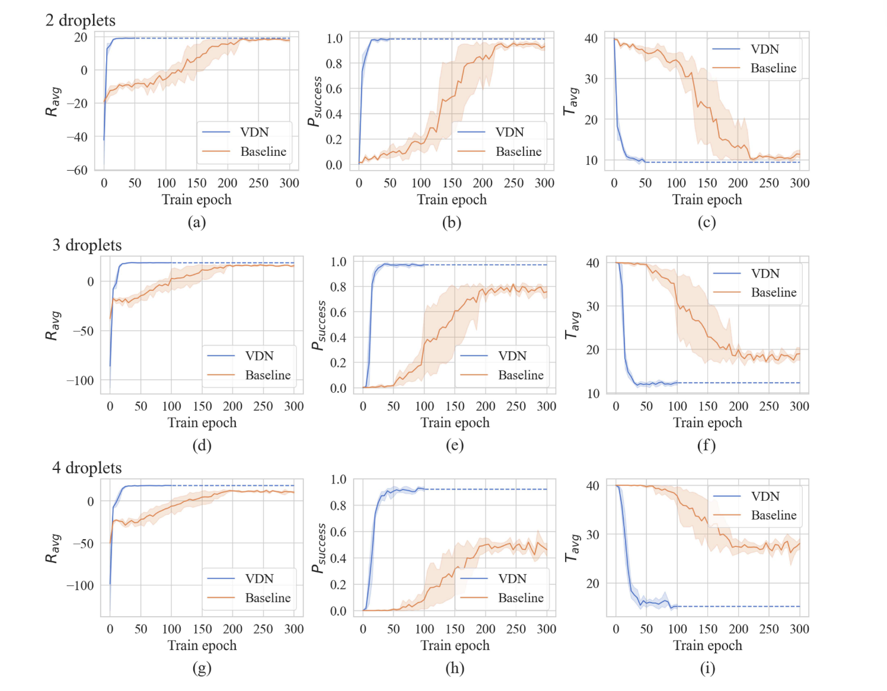

## 计划、进度 3.6 
#### 关于DMFB
- [x] 完成对于DMFB的调研 （进行中）
- [x] 了解DMFB的routing-based和module-based的区别
- [x] 了解DMFB的基本算法，以及算法运行的模拟环境
- [ ] 了解DMFB算法要解决的问题，以及遇到的挑战
- [ ] 思考应用哪些SafeRL算法到DMFB领域

#### 关于SafeRL
- [x] 完成对于安全强化学习综述的调研
- [x] 了解安全强化学习的约束公式的基本介绍
- [x] 了解安全强化学习的基本算法
- [x] 思考SafeRL算法的多智能体形式
- [ ] 思考应用哪些安全强化学习算法到DMFB领域

目前已经调研了安全强化学习领域内的近期综述，了解最关键的一些约束形式、以及解决对应问题的算法。接下来主要任务就是结合DFMB的特点，思考算法对应的多智能体形式，如何运用到我们这个问题上来。以及如何针对我们的问题，对算法进行**针对性优化**。

目前看到的就是：PPO+Safety = SRL， CPO+VDN = MASRL，然后加水CTDE。 看到了一篇讲自动驾驶的，属于分层之后采用安全评论家+CBF做的。 其实就是情况越复杂，越需要考虑约束，就越需要采用安全强化学习的方法。
可以针对MADDPG之类的加入安全约束  
COMA（反事实多智能体策略梯度）？ROMA（面向角色的多智能体强化学习）？  

针对性优化的核心：找寻到我们的问题与他们的问题的最关键区别，提出对应的改进。比如电极失效、清洗液滴、混合液滴模式、

目前关于安全强化学习调研笔记都在safeRL这个文件夹下，运用了AI总结文章，并且对关键部分进行了仔细研读。

## 计划、进度 3.16
#### 关于安全强化学习
看安全强化学习有哪几种，安全评论家是怎么做到的
看自动驾驶领域都是怎么做到保证安全且到达目的地的。
看机器确认控制领域都是怎么保证不摔倒且完成动作的。
改动HIRO算法与安全评论家结合，上层算法控制子目标，子目标执行的时候，遇到安全障碍就自动避障。目标较为短期，子目标更可能完成任务。

#### 关于SafeRL
- [x] 完成对于安全强化学习综述的调研

目前已经调研了安全强化学习领域内的近期综述，了解最关键的一些约束形式、以及解决对应问题的算法。接下来主要任务就是结合DFMB的特点，思考算法对应的多智能体形式，如何运用到我们这个问题上来。以及如何针对我们的问题，对算法进行**针对性优化**。

目前看到的就是：PPO+Safety = SRL， CPO+VDN = MASRL，然后加水CTDE。 看到了一篇讲自动驾驶的，属于分层之后采用安全评论家+CBF做的。 其实就是情况越复杂，越需要考虑约束，就越需要采用安全强化学习的方法。
可以针对MADDPG之类的加入安全约束  
COMA（反事实多智能体策略梯度）？ROMA（面向角色的多智能体强化学习）？  

针对性优化的核心：找寻到我们的问题与他们的问题的最关键区别，提出对应的改进。比如电极失效、清洗液滴、混合液滴模式、

目前关于安全强化学习调研笔记都在safeRL这个文件夹下，运用了AI总结文章，并且对关键部分进行了仔细研读。

## 计划、进度 3.20
#### 关于代码
主要针对师姐那篇代码进行修改，加入安全强化学习层。

针对每一次的策略动作a，加入安全约束。
$a_{\text{safe}} = \text{SampleUntilSafe}(s, \pi_{\theta}, Q_C, w)$
$$
\text{SampleUntilSafe}(s, \pi, Q_C, w) \triangleq \begin{cases} 
a \sim \pi(s) & \text{若 } Q_C(s, a) \leq w \\
\text{递归调用} & \text{否则}
\end{cases}
$$

$Q_C(s, a) = \mathbb{E}_{\pi}\left[\sum_{t=0}^{\infty} \gamma^t C(s_t, a_t, s_{t+1}) \mid s_0 = s, a_0 = a\right]$

\(\delta_i = C(s_i, a_i, s'_i) + \gamma Q_C(s'_i, a'_i) - Q_C(s_i, a_i)\)

定义安全约束函数$C(s, a, s')$，表示从状态$s$采取动作$a$到状态$s'$的危险程度。定义碰到障碍，危险程度+100. 使用一个CNN层+全连接来作为critic进行预测。

使用的是两层架构，第一层是原始的VDN网络，第二层是安全评论家网络，用于直接更改输出。

在跑代码的时候遇到了问题，一直爆显存，还在调试。具体效果还未知。

## 计划、进度 3.26

实现一个简单的演员评论家算法，用于测试安全约束的有效性。

原本测试10\*10的size、4个droplet、50\*10000个steps训练。 成功率是85%
原本测试20\*20的size、4个droplet、50\*10000个steps训练。 成功率是91%

改动之后，
使用10\*10的size、4个droplet、50\*10000个steps训练成功后，评估是97%。
使用20\*20的size、4个droplet、50\*10000个steps训练成功后，评估是99%。

具体实现，采用一个安全评论家作为硬约束，但是这个只采用了判断是否安全这个选项。当违反安全约束，那就运行下一个最可能的动作。这样的话也会影响原本的价值函数。这里也使用episilon greedy来进行探索。

但是其实把r改动了，（十倍）把碰撞之后惩罚加大，成功率也可以变高，具体我还在训，但是至少20\*20的size、4个droplet、50\*10000个steps训练成功后，评估是99%，第二次是100。

## 计划、进度 4.3
针对原有的算法进行改进，大部分现有的强化学习方法都是AC架构，所以我也想改动这个算法到AC架构来。还在改中。
<!-- 
深入学习了安全强化学习领域的两篇重要研究成果，CPO（constrained Policy optimization）、CSC（Conservative Safety Critics）、CQL（Conservative Q-Learning）我发现之前对这两篇的理解还是不太够，涉及到比较多的数学推导，我还没完全看明白，看明白之后做成笔记，下周讲讲。 -->

还有就是，最近在重新学一下强化学习的知识，关于DDPG、TRPO、PPO、DPO、SAC、GRPO等，粗略总结了一下这些算法的优缺点以及改进脉络，但是还有很多细节性问题没有搞清楚。

## 计划、进度 4.10
最近在准备高等数值分析考试，而且高等数值分析作业非常多。。。然后上周要转换方向，就没有推进课题，只是再去仔细看了看DMFB环境代码。平常稍有空闲的时候在学一些大模型、分层强化学习的相关知识。（之前刷视频，又给推荐的）

## 计划进度 4.24
#### 1.物理模块（固定位置，制造时确定）​

​定义：依赖芯片上的硬件设备，位置固定且不可动态调整。

- ​分配器（Dispensers）​：
​功能：从外部储液池将液体分配到芯片上的特定位置。
​位置：位于芯片边缘，每类液体（如血液、试剂）对应一个分配器（文档7、8）。

- ​废液池（Sinks）​：
​功能：收集实验废液或不再需要的液滴。
​位置：芯片边缘，数量有限（文档6）。

- ​加热器（Heaters）​：
​功能：对液滴进行恒温控制（如PCR实验中的温度循环）。
​限制：需预埋在芯片下方，仅特定位置支持加热（文档7）。
​
- 检测器（Detectors）​：
​功能：通过光学、电化学或温度传感器分析液滴属性（如颜色、浓度）。
​示例：文档2提到“光学检测器固定在特定单元格”。
​

#### 2.虚拟模块（动态分配，运行时确定）​

​定义：通过电润湿效应动态实现功能，无需专用硬件，位置可灵活调整。

- ​混合器（Mixers）​：
​功能：通过液滴往复运动混合两种液体。
​动态性：可在任意空闲区域放置，尺寸可调（如1×3或2×2，文档6）。
​
- 分离器（Splitters）​：
​功能：将大液滴分割为两个等体积小液滴。
​实现：通过激活相邻电极的时序控制实现（文档7）。

- ​存储器（Storage）​：
​功能：临时存储液滴，等待后续操作。
​动态分配：占用空闲单元格，随实验进度动态释放（文档5）。

#### 3.分配流程
​物理模块的早期规划

虚拟模块的动态调度

- ​绑定（Binding）​：将生化操作（如混合、加热、检测）与芯片上的物理/虚拟模块对应。同一个混合方法
​
- 调度（Scheduling）​：确定操作的执行顺序和时间窗口，满足时序依赖。先出现走

- ​布局（Placement）​：为模块分配物理位置，避免空间冲突。为什么要学placement？同时学placement和routing 针对某一个任务图，学习到一个最优的布局。任何任务图，

前三个步骤在设计阶段完成，后两个步骤在运行时动态调整。虚拟模块的布局也是可以决定的。

- ​路由（Routing）​：规划液滴在模块间的移动路径，避免交叉污染和死锁。

- 变异/缺陷处理：避开缺陷网格，考虑温度/污染对操作的影响。

如果使用强化学习方法，绑定、调度和布局还需要考虑吗？

#### 初步想法 
采用一个复用特征提取模块的angnt网络，使用不同的选择头来选择不同的策略。根据生化实验的步骤来确定液滴目前应该处于什么样的策略下。（路由、混合、等待、避障碍、分裂） 虚拟布局就不要了？就用运行过程中自己处理？还是说要显式指定？

生化实验调度器怎么办呢？ 确认每一步骤每一个液滴的标号，确定某液滴要采用的策略。设计一个调度器，先确定好一个有向图，根据某些目标来转换策略，中间可以突然插入可转回的策略。

然后液滴不同的输入也不一样，比如分裂、混合、等待、避障碍、路由、检测。有些有目标、有些没有目标。

## 下一次
全流程的环境处理
全流程的输入：一个任务图、还有一个环境设置、液滴位置以及地图、

需要做到的事情：根据任务图，确定每个液滴的策略，然后根据环境设置，确定每个液滴的输入。
主要是要分模块，然后每个模块的输入输出要明确。

主要是就是在哪里混合、在哪里分裂、走哪个口子输出。先确定好模块位置、然后运行满足的时间

全流程用学习的方法实现，然后用真实实验来验证。
主要是就是我不知道基于一个什么样的流程做，然后每一个流程都异构，用不同的方法学，不知道咋实现。

我想问就是，跟刘彪师兄正在投的那个区别大不，就是也是输入，然后根据任务图确定每个液滴现在要用什么策略？

model-based的必要性是什么呢？感觉没有提前确定好模块，实时决策挺好呀。
学习如何放置模块，学习什么时候做什么任务，学习怎么routing？

## 计划进度：5.7
### 1. 询问老师培养计划
老师，我们大概的培养计划时间表是怎么样的？ 从现在开始，请假2个月去做其他的AI项目，2个月之后回来专心再做DMFB，影响会有多大呢？

### 2. 过去一个月
自从那个安全强化学习实验跑完之后，我就很迷，不知道该搞点啥，方向不太明确。
然后考虑实习计划的时候，又观察了一下那个就业的形势，感觉还是得大模型才能找到AI相关的工作。所以过去一个多月，我在学DMFB全流程过程中，也在同步学习大模型相关知识。

然后就是目前已经在尽可能没有影响到其他师兄弟使用服务器的情况下，使用服务器跑了一些大模型相关的代码，跑了大模型的微调、RAG、量化等不太消耗计算资源的项目。 一边学习DMFB项目，一边试着跑大模型相关的项目，感觉有点让我分心，很不专注。

### 3. 接下来两个月计划
之前在本科李皈颖老师那边认识了一个师兄，他是做大模型量化的，而且入职美团做大模型了，我就去找他问了经验，需要准备什么项目什么的。他说他有一个想法可以送我试试看，他毕业自己组里面也没有人一起搞模型压缩了。

接下来两个月，我想向袁老师申请暂缓DMFB相关的项目，想专心下来搞多模态大模型的一个项目，做出一点成果来，然后再回头完成本来DMFB的全流程任务的项目计划。 主要是做个完整的大模型项目可以明年暑假找实习。

我四月中到现在已经深入调研了这个项目，我觉得还是很有意义的，我保证2个月内有个结果，尽可能不打乱袁老师您的计划。如果能搞出一篇论文出来那肯定更好了，如果实验效果好，可能还需要老师帮我看看文章写得对不对，实验充分不。

### 4. 具体项目计划
主要就是基于多模态大模型，做模型压缩，使用旋转量化、KV-cache量化等方法，处理异常值，来保证模型的精度。把旋转量化放进多模态大模型来处理量化的outlier目前还没有看到有多少人做。

还有就是对模型权重、KV表征进行聚类压缩、低秩分解等方法，利用权重的相似性冗余来压缩模型。主要针对的都是多模态大模型，要针对多帧图片的特点进行特化的处理，这个也是创新点。具体怎么根据图片处理，得实验中看一下具体情况，再试方法。