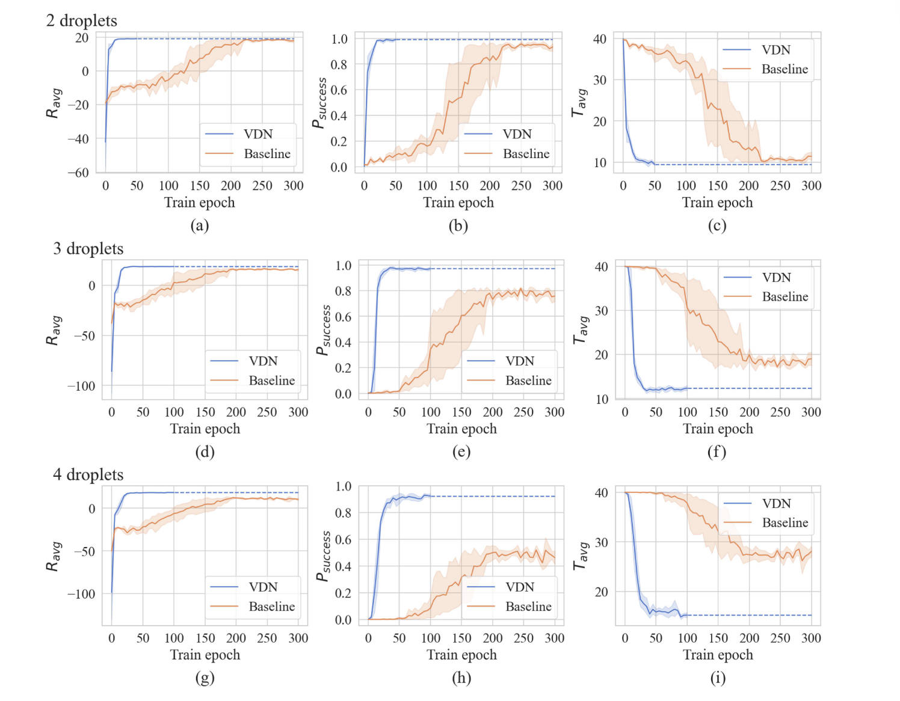

# SafeRL 研究笔记与思考

> 本文记录了安全强化学习方向的研究思考和实验进展。

## 1. SafeRL 算法脉络

SafeRL 的核心思路是在标准 RL 算法上加入安全约束：

| 基础算法 | + 安全约束 | 方法 |
|----------|-----------|------|
| PPO | → Safe PPO | 拉格朗日乘子法 |
| CPO | → CPO + VDN | 多智能体安全约束 |
| DDPG/MADDPG | → Safe MADDPG | 安全评论家 |
| 分层 RL (HIRO) | → 分层 + 安全评论家 | 上层控制子目标，下层避障 |

核心观察：情况越复杂，越需要考虑约束，就越需要采用安全强化学习的方法。

## 2. 安全评论家实验

### 实验设置
在 DMFB（数字微流控芯片）环境中测试安全约束的有效性。

### 安全约束设计

对每次策略动作 $a$，加入安全约束：

$$a_{\text{safe}} = \text{SampleUntilSafe}(s, \pi_{\theta}, Q_C, w)$$

其中安全评论家 $Q_C$ 估计动作的危险程度：

$$Q_C(s, a) = \mathbb{E}_{\pi}\left[\sum_{t=0}^{\infty} \gamma^t C(s_t, a_t, s_{t+1}) \mid s_0 = s, a_0 = a\right]$$

安全约束函数 $C(s, a, s')$ 定义为：碰到障碍时危险程度 +100。使用 CNN + 全连接层作为 Critic 进行预测。

### 实验结果

采用两层架构：第一层是原始 VDN 网络，第二层是安全评论家网络。

| 环境 | 无安全约束 | 有安全约束 |
|------|-----------|-----------|
| 10×10, 4 droplets | 85% | 97% |
| 20×20, 4 droplets | 91% | 99% |

具体实现：安全评论家作为硬约束，当违反安全约束时运行下一个最可能的动作。同时使用 epsilon-greedy 进行探索。

### 对比实验
将碰撞惩罚加大 10 倍后，不使用安全评论家也能达到 99-100% 的成功率。说明安全评论家的效果可以部分通过调整奖励函数来替代，但安全评论家提供了更原则性的安全保障。

## 3. 研究方向思考

- 可以针对 MADDPG 加入安全约束
- COMA（反事实多智能体策略梯度）和 ROMA（面向角色的多智能体强化学习）也是可以探索的方向
- 分层强化学习 + 安全评论家：上层算法控制子目标，子目标执行时遇到安全障碍自动避障
