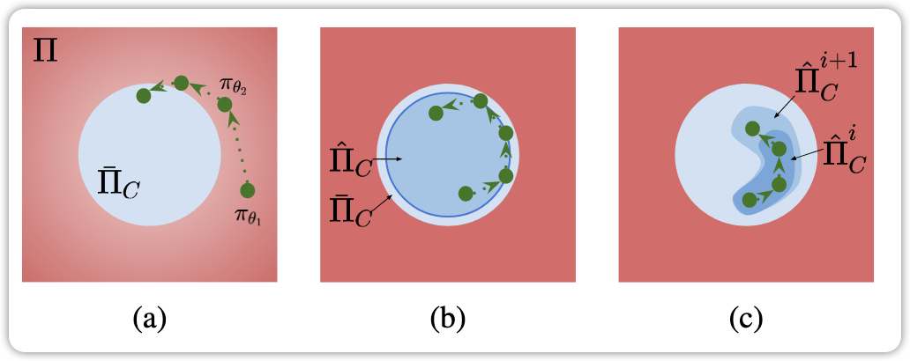

# 基于状态的安全强化学习综述：核心概念、方法、权衡与展望
## 1. 引言
强化学习（RL）在模拟环境中成绩斐然，于游戏和控制任务领域成果显著。像在游戏方面，DeepMind的AlphaGo击败围棋世界冠军，展现了RL强大的学习和决策能力；在控制任务中，它也能有效优化机器人的动作控制。然而，在RL向实际应用拓展时，安全保障的缺失成为重大阻碍。

RL智能体依据奖励信号做出决策，这可能导致忽视安全约束的行为。以自动驾驶为例，负责控制自动驾驶汽车的RL智能体，为获取高奖励，可能选择高速行驶，却增加了与其他车辆或行人碰撞的风险。在机器人操作场景中，若机器人抓取物体的策略仅以完成任务获取奖励为导向，可能会在不恰当的时机释放物体，导致任务失败。这些情况表明，RL智能体有时会优先追求奖励最大化，而非确保安全，进而引发不安全甚至灾难性的后果。

安全RL的研究应运而生，旨在训练过程中或训练后为智能体提供安全保障。早期的研究大多基于约束马尔可夫决策过程（CMDP）框架，主要处理累积约束或机会约束。但在现实世界的诸多应用场景中，许多关键约束是即时且确定的。例如，自动驾驶中的避撞约束，它不依赖历史轨迹或随机变量，仅取决于车辆当前的状态，一旦违反可能导致严重事故；在机器人抓取和放置物体时，只有当物体被放置在稳定表面上，机器人才能释放，这一约束同样是即时和确定性的，违反它将使任务不可逆地失败。

针对这种状态特定的硬约束问题，基于状态的安全RL方法被提出，其问题被形式化为状态约束马尔可夫决策过程（SCMDP）。本文作为首篇针对基于状态的安全RL的综述，依据训练过程中是否确保安全，将现有方法分为两类确保安全，将现有方法分为两类：一是收敛后状态安全，即策略收敛时能保证状态安全，但训练过程中可能不安全；二是训练中状态安全，这类方法所导出的策略在训练全程都能确保满足约束。同时，文章还依据方法的结构或假设进行了更细致的分类，以深入探讨它们之间的联系。

## 2. 问题表述
### 2.1 预备知识
马尔可夫决策过程（MDP）由一个元组\((S, A, \gamma, R, P, \rho)\)定义。其中，\(S\)代表状态空间，涵盖了系统在不同时刻可能处于的所有状态；\(A\)是控制空间，包含了智能体在各个状态下可执行的所有动作；奖励函数\(R: S × A \to \mathbb{R}\)，用于量化智能体在特定状态下执行某个动作后所获得的奖励；折扣因子\(0 \leq \gamma < 1\)，它反映了智能体对未来奖励的重视程度，\(\gamma\)越接近1，智能体越看重未来的奖励；起始状态分布\(\rho: S \to [0,1]\)，决定了智能体初始状态的概率分布；转移概率函数\(P: S × A × S \to [0,1]\)，表示在当前状态\(s\)执行动作\(a\)后，转移到下一状态\(s'\)的概率，即\(P(s' | s, a)\)。

平稳策略\(\pi: S \to P(A)\)是从状态到动作概率分布的映射，\(\pi(a | s)\)表示在状态\(s\)下选择动作\(a\)的概率，所有平稳策略的集合记为\(\Pi\)，\(\pi_{\theta}\)表示由参数\(\theta\)参数化的策略。MDP的标准目标是学习一个策略\(\pi\)，使得性能指标\(J(\pi)\)最大化，\(J(\pi)\)通过奖励的折扣和来计算，公式为\(\mathcal{J}(\pi)=\mathbb{E}_{\tau \sim \pi}\left[\sum_{t=0}^{\infty} \gamma^{t} \mathcal{R}\left(s_{t}, a_{t}, s_{t+1}\right)\right]\)，其中\(\tau=[s_{0}, a_{0}, s_{1}, \cdots]\)表示轨迹，\(\tau \sim \pi\)表示轨迹的分布依赖于策略\(\pi\)，即\(s_{0} \sim \mu\)，\(a_{t} \sim \pi(\cdot | s_{t})\)，\(s_{t+1} \sim P(\cdot | s_{t}, a_{t})\) 。

### 2.2 状态约束马尔可夫决策过程
约束马尔可夫决策过程（CMDP）是在MDP的基础上增加了约束条件，这些约束限制了MDP中允许的策略集合。具体来说，
*CMDP引入了一组成本函数\(C_{1}, C_{2}, \cdots, C_{m}\)，其中\(C_{i}: S × A × S \to \mathbb{R}\)，它将状态 - 动作 - 转移元组映射为一个成本值。*
类似于\(J(\pi)\)的定义，\(J_{C_{i}}(\pi)=\mathbb{E}_{\tau \sim \pi}[\sum_{t=0}^{\infty} \gamma^{t} C_{i}(s_{t}, a_{t}, s_{t+1})]\)表示策略\(\pi\)关于成本函数\(C_{i}\)的成本度量。因此，*CMDP的可行平稳策略集定义为\(\Pi_{C}=\left\{\pi \in \Pi | \forall i, \mathcal{J}_{C_{i}}(\pi) \leq d_{i}\right\}\)，*其中\(d_{i} \in \mathbb{R}\)是预先设定的成本阈值。在CMDP中，目标是选择一个可行的平稳策略\(\pi_{\theta}\)，使得性能指标\(J(\pi_{\theta})\)最大化，即\(\max _{\theta} \mathcal{J}\left(\pi_{\theta}\right), s.t. \pi_{\theta} \in \Pi_{C}\)。

本文重点关注的状态约束马尔可夫决策过程（SCMDP），是CMDP的一种特殊类型。在SCMDP中，安全规范要求在每一步都持续满足硬成本约束。同样使用成本函数\(C_{1}, C_{2}, \cdots, C_{m}\)来评估状态 - 动作 - 转移元组的即时成本，SCMDP要求每个状态 - 动作转移的成本都满足硬约束。所以，SCMDP的可行平稳策略集定义为 *\(\overline{\Pi}_{C}=\left\{\pi \in \Pi | \forall\left(s_{t}, a_{t}, s_{t+1}\right) \sim \tau, \forall i, C_{i}\left(s_{t}, a_{t}, s_{t+1}\right) \leq w_{i}\right\}\),* 其中\(\tau \sim \pi\)且\(w_{i} \in \mathbb{R}\)是相应的成本阈值。SCMDP的目标是从\(\overline{\Pi}_{C}\)中找到一个可行的平稳策略，使性能指标最大化，形式化表示为 *\(\max _{\theta} \mathcal{J}\left(\pi_{\theta}\right), s.t. \pi_{\theta} \in \overline{\Pi}_{C}\)。* 

### 2.3 收敛后状态安全
在学习过程中，策略序列记为\(\pi_{\theta_{1}}, \pi_{\theta_{2}}, \cdots, \pi_{\theta_{n}}\)，其中\(\theta_{i}\)表示优化迭代第\(i\)次时的策略参数，\(n\)是总迭代次数。收敛后状态安全的方法在训练期间，策略可能是不可行的，但最终会收敛到一个可行的平稳策略。 

如图1a所示，这类方法通常使用软惩罚（通常称为**安全评论家**\(Q_{c}(s, a)\)）来引导策略的训练。安全评论家\(Q_{c}(s, a)\)可以由人为设定，也可以从环境中学习得到。它的作用是评估在状态\(s\)下执行动作\(a\)后，未来违反安全约束的可能性。由于这类方法不对探索空间施加硬约束，策略学习的效率相对较高。然而，在训练过程中，策略可能会处于不安全的状态，并且在某些情况下，策略收敛到\(\overline{\Pi}_{C}\)可能会面临挑战。*例如，在复杂的环境中，安全评论家的估计可能不准确，导致策略在训练期间频繁违反安全约束，难以收敛到安全可行的策略。*

### 2.4 训练中状态安全
训练中状态安全对策略的要求比收敛后状态安全更为严格，它要求训练过程中的所有中间策略都是可行的，即\(\forall i \leq n\)，\(\pi_{\theta_{i}} \in \Pi_{C}\)。主要有两类方法来确保训练中的状态安全。

第一类方法如图1b所示，通过定义\(\overline{\Pi}_{C}\)的一个子集\(\hat{\Pi}_{C}\)（**通常借助控制障碍函数来实现**）。在训练过程中，一旦策略超出这个子集，就会被投影回子集中，从而保证策略始终是安全的。但是，定义\(\hat{\Pi}_{C}\)需要大量关于环境的先验知识，在很多实际场景中，这些先验知识可能是难以获取的。并且，总体而言，这类方法比收敛后状态安全的方法更加保守，因为它们只能在更有限的状态空间内进行探索，这可能会影响策略的学习效果和最终性能。

第二类方法如图1c所示，从一个安全的初始策略开始，逐步探索策略空间。在探索过程中，通过不断**收集信息来维护一个\(\overline{\Pi}_{C}\)的最新子集** 
\(\hat{\Pi}_{C}^{i}\)。只有当有足够的信息确认\(\hat{\Pi}_{C}^{i+1} \subseteq \overline{\Pi}_{C}\)时，策略才会在\(\hat{\Pi}_{C}^{i+1}\)中进行更新。这类方法相较于第一类方法，对先验知识的需求较少，但在探索过程中也更为保守，可能会导致学习速度较慢，难以快速找到最优策略。

## 3. 收敛后状态安全的方法
### 3.1 分层智能体
为了执行状态安全约束，一种直观的方法是在每个时间步评估提议的动作，如果动作不安全，则将其投影到安全动作集\(A_{C}(s_{t})=\{a \sim \pi(s_{t}) | \pi \in \overline{\Pi}_{C}\}\)中，这样就形成了一个分层安全策略。其中，*上层是一个强化学习策略\((\pi_{\theta})\)* ，负责生成面向任务的动作，以最大化累积奖励\(J\)；*下层是一个安全监视器* ，用于执行安全动作校正，确保整个分层策略属于\(\overline{\Pi}_{C}\)。

实现安全监视器的关键在于学习一个 *安全评论家\(Q_{C}(s_{t}, a_{t})\)* ，它用于估计从当前状态\(s_{t}\)执行动作\(a_{t}\)后，持续满足\(C(s_{t}, a_{t}, s_{t+1})\)约束的概率，以便筛选动作，保证分层策略满足安全约束。主要的筛选方法分为直接采样和基于优化的投影两类。

-  **保守安全评论家（CSC）**就是基于直接采样的方法。它的核心思想是在训练策略\(\pi_{\theta}\)的同时，训练一个安全评论家\(Q_{C}(s, a)\)，这个安全评论家会对给定状态 - 动作对的不安全可能性进行保守估计，即高估该状态 - 动作对导致的未来成本。在策略评估阶段，在每个时间步，当从当前策略得到提议动作后，使用安全评论家监测该动作未来违反安全约束的情况。如果安全违反程度超过预定义的阈值，就从策略中重新采样动作，直到安全评论家认为提议动作是安全的，数学表示为\(sample \space a \sim \pi_{\theta}(s), until Q_{C}(s, a) \leq w\) 。CSC中\(Q_{C}\)和\(\pi_{\theta}\)的优化基于约束策略优化（CPO），CPO通过信赖域方法限制更新后的策略与前一个策略接近。这样，分层策略生成的动作相对于安全评论家是安全的，并且通过信赖域方法继承了CPO在最坏情况下成本违反的理论保证。然而，CSC也继承了CPO的一些缺点，如通用性有限和计算成本高，因为策略优化需要使用共轭梯度法来近似费舍尔信息矩阵，而且不完美的成本函数\(Q_{C}(s, a)\)会损害安全保障。
    
    直接采样虽然直观，但存在时间消耗大、可能损害奖励性能\(J(\pi_{\theta})\)的问题。因此，基于优化的投影方法被提出，其思路是优化安全控制，使其在满足约束的同时，尽可能接近参考动作。这种优化可以通过直接梯度下降或二次规划来解决。

- **展开安全层（USL）是基于梯度下降的方法。**它的框架由一个前置的策略网络和一个后置的USL组成。前置策略网络输出面向任务的动作，后置的USL用于校正参考动作，以满足状态安全约束。在训练过程中，USL会根据收集到的样本迭代更新成本函数\(Q_{C}(s, a)\)（即安全评论家），然后对参考动作进行梯度下降更新：\(a_{new }=a_{old }-\frac{\eta}{\mathcal{Z}} \cdot \frac{\partial}{\partial a_{old }}\left[Q_{C}\left(s, a_{old }\right)-w\right]\)，直到得到的成本满足状态安全约束，其中\(\eta\)是步长，\(\mathcal{Z}\)是用于缩放梯度的归一化因子。实验结果表明，USL在多种具有挑战性的安全RL基准测试中，能够在策略收敛后实现状态安全零违反。然而，为了从形式上保证状态安全，USL需要完美地近似成本函数\(Q_{C}(s, a)\)，但这在实际中很难证明。

- **基于李雅普诺夫的策略梯度（LPG）则是基于二次规划的方法。**它基于李雅普诺夫方法来解决CMDP问题，首先使用基于LP的算法为一般的CMDP约束构建李雅普诺夫函数，然后添加一个李雅普诺夫安全层来保护任何学习策略。在策略训练过程中，通过值迭代估计状态 - 动作李雅普诺夫函数\(Q_{C}(s, a)\)，接着在每个时间步优化安全动作以满足李雅普诺夫约束。具体做法是，用一阶泰勒级数对李雅普诺夫约束进行线性化，并定义目标函数为最小化安全动作与参考动作之间的差异，即\(\min _{a} \frac{1}{2}\left\| a - a_{old }\right\| ^{2}\)，约束条件为\(Q_{C}\left(a_{old }\right)+\left.\nabla_{a} Q_{C}(s, a)\right|_{a=a_{old }}\left(a - a_{old }\right) \leq w\)，最后通过二次规划（QP）来优化得到安全动作。不过，对于大多数李雅普诺夫约束来说，线性化近似误差不可忽视，而且李雅普诺夫函数的近似通常也不完美，这两个因素都会损害状态安全保障。

- **控制屏障函数（CBF）在已知系统动力学的情况下，能够有效地约束动作** ，使系统持续满足状态安全约束。受此启发，RL - CBF框架被提出，它将基于CBF的控制器与RL算法相结合，通过约束可探索策略集来保证安全并指导学习过程。该框架首先定义一个能量函数\(\tilde{h}(s)\)，通过确保\(\forall t, \tilde{h}(s_{t}) \geq 0\)来保证\(C(s_{t}, a_{t}, s_{t+1}) \leq w\)。然后，RL - CBF假设已知名义控制仿射动力学模型\(s_{t+1}=\tilde{f}(s_{t})+\tilde{g}(s_{t}) a_{t}\)，并采用高斯过程（GP）来建模剩余的未知系统动力学和不确定性\(\tilde{d}(s_{t})\)。最后，CBF通过二次规划将参考控制投影为安全控制，即\(\min _{a} \frac{1}{2}\left\| a - a_{old }\right\| ^{2}\)，约束条件为\(\tilde{h}\left(\tilde{f}\left(s_{t}\right)+\tilde{g}\left(s_{t}\right) a+\tilde{d}\left(s_{t}\right)\right)+(\tilde{\eta}-1) \tilde{h}\left(s_{t}\right) \geq 0\)，其中\(\tilde{\eta}\)用于调整屏障函数确保安全的强度。在策略训练过程中，会使用更多的状态 - 动作转移数据来更新GP动力学模型。但是，基于CBF的控制器的安全保障在很大程度上依赖于两个条件：一是已知仿射系统动力学假设；二是学习到的GP模型能够很好地校准，为不确定动力学提供高概率置信区间。这使得它在应用于一般的非线性和高维动力学系统时受到限制。

### 3.2 端到端智能体
端到端智能体将约束学习问题作为一个整体来解决，不依赖任何额外的安全层模块。但挑战在于如何确保\(J_{c}\)的表征能够使策略收敛到满足安全约束的集合 *\(\overline{\Pi}_{C}=\left\{\pi \in \Pi | \forall\left(s_{t}, a_{t}, s_{t+1}\right) \sim \tau, \forall i, C_{i}\left(s_{t}, a_{t}, s_{t+1}\right) \leq w_{i}\right\}\)* ，  *\(\max _{\theta} \mathcal{J}\left(\pi_{\theta}\right), s.t. \pi_{\theta} \in \overline{\Pi}_{C}\)。*  。近年来，许多研究探索了在收敛后状态安全场景中使用端到端学习方案。

一些安全RL工作通过求解原始 - 对偶优化问题，期望满足CMDP约束，如公式\(\max _{\theta} \min _{\lambda \geq 0} \mathcal{L}\left(\pi_{\theta}, \lambda\right)=\mathcal{J}\left(\pi_{\theta}\right)-\sum_{i} \lambda_{i}\left(\mathcal{J}_{C_{i}}\left(\pi_{\theta}\right)-d\right)\) 。这些方法通过用拉格朗日乘数加权的约束惩罚之和来增强奖励，从而应用于状态安全设置。从数学角度，增强后的奖励被定义为\(\mathcal{R}\left(s_{t}, a_{t}, s_{t+1}\right)-\sum_{i} \lambda_{i}\left(C_{i}\left(s_{t}, a_{t}, s_{t+1}\right)-w_{i}\right)\)。然而在实际应用中，公式中的优化操作难度较大，因为在每一步RL更新时都需要进行优化。

**状态安全自动约束（SSAC）**通过使用面向安全的能量函数来限制基于拉格朗日的策略更新。直观来讲，SSAC将面向安全的能量函数转换作为策略更新的新约束目标，这使得它能够在执行危险动作之前识别出这些动作，进而在收敛后获得一个零约束违反的策略。需要注意的是，SSAC与标准的拉格朗日安全RL方法有所不同，因为SSAC使用一个额外的神经网络\(\lambda_{\zeta}(s)\)来近似状态相关的拉格朗日乘数。从数学角度，SSAC解决的问题为\(\max _{\theta} \min _{\zeta} \mathcal{L}\left(\pi_{\theta}, \lambda_{\zeta}\right)=\mathcal{J}\left(\pi_{\theta}\right)-\sum_{i} \sum_{s \sim \pi_{\theta}} \lambda_{\zeta}(s)\left(V_{C_{i}}^{\pi}(s)-d\right)\)，其中\(V_{C_{i}}^{\pi}(s) = \mathbb{E}_{\pi}\left[\sum_{k = 0}^{\infty} \gamma^{k} C_{i}\left(s_{t + k}\right) | s_{t}=s\right]\) 。

**FACSIS**通过制定一个损失函数来优化安全证书参数，该函数通过最小化能量增加的发生来实现，从而减轻了SSAC对完美的面向安全的能量函数的依赖。当前标准的安全RL算法，如CPO和拉格朗日方法，即使将成本阈值设置为零，也难以实现零违反性能。He等人指出，实现零违反的主要瓶颈之一在于缺乏正确表征公式4中成本函数的方法。为解决这一问题，他们提出了**AutoCost方法**，*通过在由简单神经网络参数化的成本函数空间中进行进化搜索，自动寻找合适的成本函数。*实验结果表明，进化得到的成本函数使智能体在收敛后既能保持高性能，又能完全不违反安全约束。

## 4. 训练中状态安全的方法
### 4.1 分层智能体
为满足状态安全约束，一种自然的方法是在每个步骤通过将动作投影到可行动作上进行校正，以确保每一步的成本约束都能得到满足。这可以通过构建一个分层安全智能体来实现，上层生成参考动作，下层进行投影操作，最终得到的解决方案是一个分层结构的策略。与第3节中的分层策略不同，本节中的下层通常通过系统动力学假设，对\(C(s_{t}, a_{t}, s_{t+1})\)有先验知识，因此在策略训练过程中更有能力提供状态安全保障。

基于对系统动力学的知识假设，现有的分层安全强化学习解决方案可分为三类：白盒动力学、黑盒动力学和学习动力学。

在白盒动力学方面，状态安全保障在安全控制相关方法中得到了广泛研究，例如控制屏障函数（CBF）、安全集算法（SSA）等。这些方法通常要求系统动力学是明确已知的，即具有解析或显式的系统动力学模型（白盒动力学）。利用这些已知的动力学信息，分层结构的安全策略可以借助安全控制方法来保护学习策略，从而保证状态安全。然而，所有这些方法都需要手动表征平稳策略集\(\bar{\Pi}_{C}\)，这在实际应用中很难扩展到复杂场景。

ShieldNN利用屏障函数（BF）设计了一个具有安全保障的安全过滤神经网络。它主要包括三个步骤：首先设计一个候选屏障函数；接着验证安全控制的存在性；最后设计安全过滤器。安全过滤器会用安全神经网络控制器的输出覆盖任何不安全的控制。但ShieldNN是专门为以运动学自行车模型（KBM）为动力学模型的环境设计的，很难推广到其他问题领域。Chen和Liu在杂乱的2D环境中考虑了类似结构，并使用安全过滤器为RL算法提供演示，以提高样本效率。

Fisac等人提出了一个基于哈密顿 - 雅可比可达性方法的通用安全框架，该框架可以与任意学习算法协同工作。然而，这些方法仍然利用了系统动力学显式形式的近似知识，来保证状态安全约束的满足。

Shao等人提出了一种基于可达性的轨迹保护（RTS）安全层，以确保系统在训练和运行过程中持续满足安全约束。具体而言，RTS允许RL智能体选择高级轨迹计划，而不是直接的控制输入，通过确保只选择安全的计划来保证状态安全。为了区分安全和不安全的轨迹计划，RTS在机器人跟踪参数化轨迹时，预先计算其前向可达集。在运行时，机器人会根据预先计算的前向可达集选择安全计划。然而，前向可达集的精确计算依赖于系统动力学的明确知识。

在黑盒动力学场景下，设计一个将参考动作投影到可行空间的安全过滤器，关键在于识别某个动作的可行性，即判断该动作是安全还是不安全。只要能够评估状态 - 动作转换元组的即时成本，即具备黑盒动力学模型，就可以区分安全和不安全的动作。因此，即使不知道系统动力学的显式解析形式，也有可能设计出分层结构的安全策略。具体来说，分层安全策略可以利用黑盒模型识别和过滤来自RL策略的不安全动作。

隐式安全集算法（ISSA）构建了一个分层结构的安全策略。上层是一个无约束的RL算法近端策略优化（PPO），用于生成面向任务的参考动作；下层是安全层，通过将不安全的控制动作投影到一组安全控制中来过滤它们。ISSA首先定义一个能量函数安全指数\(\phi(s)\)，使得\(\overline{\Pi}_{C}\)对应于所有能确保\(\forall t, \phi(s) \leq 0\)的策略。\(\phi(s)\)的构建不需要系统动力学的明确知识，只需要运动学限制，这大大解决了白盒模型的可扩展性问题。借助黑盒动力学模型\(s_{t + 1}=f(s_{t}, a_{t})\)，ISSA通过在每个时间步求解安全控制来确保状态安全，即\(\min _{a} \frac{1}{2}\left\| a - a_{old }\right\| ^{2} \ s.t. \phi\left(f\left(s_{t}, a\right)\right) \leq 0\)，该问题通过多向线搜索求解，并且\(\phi(f(s_{t}, a))\)可以通过黑盒动力学模型（如数字孪生模拟器）进行一步模拟来检查。

在学习动力学方面，为了减轻对显式系统动力学的要求，最后一类方法基于从离线数据集学习的模型来提供安全保障。

Dalal等人提出直接从离线收集的数据中学习系统动力学，然后添加一个安全层，针对每个状态解析地求解控制校正公式，以确保每个状态都是安全的。然而，这种封闭形式的解决方案依赖于两个假设：一是线性化的动力学模型；二是线性化的半空间形状的安全动作集，而这两个假设在大多数现实世界的动力学系统中并不成立。

Thananjeyan等人提出了Recovery RL算法，该算法使用离线收集的数据集训练一个安全评论家模块，用于量化某个动作在不久的将来导致安全违规的可能性。同时，还基于离线数据集预训练一个恢复策略，以最小化约束违反的风险。在在线训练过程中，任务策略优化任务奖励，当安全评论家认为任务策略的动作不安全时，恢复策略的动作将覆盖任务策略的动作。但由于无法保证预训练的安全评论家能够正确识别不安全动作，最终得到的恢复策略存在偏差，安全违规难以避免。

Wei和Liu为了将CBF应用于端到端神经网络动力学模型，使用进化策略设计基于CBF的安全过滤器，并提出一种混合整数规划方法来寻找给定CBF下的最优安全动作，即混合整数神经网络动力学模型（MIND）。MIND可以与任意RL算法结合使用，以保障其安全性。然而，他们的方法在扩展到高维时存在困难，因为设计这样一个CBF过滤器所需的数据量会随着维度的增加呈指数增长。此外，该方法的状态安全保障基于一个假设，即学习到的神经网络动力学能够准确捕捉真实系统动力学。

Zhao等人提出了不确定性感知隐式安全集算法（UAISSA），旨在为一般动力学系统在训练过程中实现零安全违规。该算法使用基于能量函数的安全控制和在离线数据集上学习的高斯过程（GP）动力学模型，对机器人策略学习进行概率性保护，且系统动力学可以是一般的非线性函数。在离线阶段，他们首先展示了如何构建用于系统动力学学习的数据集，以及如何设计相关的能量函数（称为安全指数），以确保在控制限制下，对于所有可能的状态始终存在可行的安全控制。其次，他们设计了一个安全层，通过求解与公式13相同的优化问题，将名义学习策略的参考控制投影到一组安全控制中，其中使用学习到的GP动力学模型进行一步前向模拟。由于保证了所有可能状态下安全控制集非空，该方法能够在策略学习过程中实现零约束违规。但该方法的一个缺点是，用于GP动力学学习的数据集需要对状态空间进行网格采样，这使得它难以扩展到更高维的系统。

### 4.2 端到端智能体
除了分层安全智能体，也可以构建在训练期间满足状态安全的端到端智能体。本节重点关注那些对环境没有先验知识的智能体，即考虑到学习动力学的不确定性，如何将动作投影到不确定的安全动作集。如果有先验知识，问题会类似于约束优化，本质上是在训练时应用第3.1节中讨论的方法。另外，还有一种方法是最初使用安全监视器保护端到端智能体，并在学习过程中逐渐移除监视器，这类方法不在本文的讨论范围内。

Berkenkamp等人提出了一种具有代表性的方法，该方法学习一个单一策略，在训练的每一步都能直接生成具有高概率安全保障的动作。受李雅普诺夫稳定性理论的启发，该方法将安全策略定义为：如果系统从某个子集开始，能使系统保持在状态空间的一个子集（吸引域，ROA）内的策略。ROA被定义为李雅普诺夫能量函数\(v: S \mapsto \mathbb{R}\)的水平集\(V(c)\)，例如\(V(c)=\{s \in S | v(s) \leq c\}\) 。其目标是在确保状态永远不会离开ROA的同时，学习未知的系统动力学并获得高性能的控制策略。为实现这一目标，该方法通过高斯过程（GP）估计动力学\(f\)，并维护一个安全策略\(\pi\)，只执行安全动作，同时迭代更新两者。在每次迭代中，算法首先找到当前策略\(\pi\)允许的最大ROA；然后将系统驱动到当前动力学模型\(f\)最不确定的状态 - 动作对，并在该位置使用测量值更新\(f\)；最后优化策略\(\pi\)以最大化奖励。策略优化与ROA估计可以表示为\(\pi, c=\underset{\pi, c}{argmax} c, s.t. \forall s \in \mathcal{V}(c), \pi(s) \text{ reduces } v\) 。从一个初始安全策略和对ROA的保守估计开始，上述过程逐步收集安全且有用的数据点，以改进动力学模型，进而扩展估计的ROA。该过程被证明能够在状态空间的可达部分实现完全探索。最终，该研究将理论结果转化为实际算法，并在倒立摆模拟中展示了它可以优化神经网络策略，同时确保摆永远不会倒下。但该方法的一个缺点是难以获得用于定义ROA的合适李雅普诺夫函数，并且由于过去的状态转换观测可能对GP回归无效，该方法容易受到非平稳系统动力学的影响。

SafeExpOpt - MDP是另一种在训练过程中满足安全要求的端到端方法。该方法在探索未知安全函数、探索奖励函数和最大化（利用）奖励之间进行三方权衡。通过仅导航到状态空间的一个子集\(Safe\)来保证状态安全，该子集满足：（a）即使考虑最坏情况的预测误差，状态也是安全的；（b）可以从安全状态一步到达；（c）可以返回安全状态。在Berkenkamp等人的研究中，类似的安全保障是通过安全区域内的前向不变性来确保的。对学习到的奖励的探索和利用通过一个目标函数进行编码，该目标函数在乐观值函数\(\hat{J}\)和悲观值函数\(\bar{J}\)之间进行线性插值，即\(\pi=\underset{s \in \mathcal{S}^{safe }}{argmax}(1-\eta) \overline{\mathcal{J}}+\eta \hat{\mathcal{J}}\)，其中\(\eta \in[0,1]\) 。值得注意的是，SafeExpOpt - MDP在累积奖励方面并非接近最优。

作为改进，SNO - MDP在保持安全保障的同时，在正则性假设下实现了奖励的接近最优。SNO - MDP分两步操作：首先，智能体扩展一个悲观的安全区域，同时保证安全；然后，在第一步验证的安全区域内探索和利用奖励。结合可能近似正确马尔可夫决策过程（PAC - MDP）的结果，证明了所获得的策略在安全约束的MDP中与最优策略的距离为\(\epsilon\) 。实现接近最优的关键条件是对奖励函数的乐观估计\(U\)，使用上置信界表示为\(U(s)=\mu^{r}(s)+\alpha^{1 / 2} \sigma^{r}(s)\)，其中\((\mu^{r}, \sigma^{r})\)是估计奖励分布的均值和方差，\(\alpha\)是缩放因子。

## 5. 讨论
### 5.1 保障与可扩展性之间的权衡
从表1中可以看出，每一种理论安全保障的实现都伴随着对动力学系统做出假设或获取某些先验知识的代价。大多数假设围绕动力学展开，包括：（i）动力学的解析形式或利普希茨连续性；（ii）动力学的完美模拟；（iii）动力学转换的离线数据集。在强假设条件下（如白盒/黑盒动力学），对于特定的有限系统，推导可靠的安全保障相对容易 。例如，ShieldNN基于特定的运动学自行车模型（白盒动力学）设计安全过滤器，能够为该特定环境提供明确的安全保障；Fisac等人的方法依赖系统动力学的显式知识，也能在相应场景下保证安全。然而，在实际问题中，许多复杂系统（如蛇形机器人和人形机器人的动力学）难以满足这些强假设，导致这些方法难以扩展到其他问题领域。

相比之下，当采用较弱的假设（如基于动力学数据集）时，相应的安全保障也会变弱，例如一些方法只能提供概率性的安全保障。但与此同时，做出更弱、更少假设的状态安全RL算法对不同动力学系统具有更好的可扩展性。例如，一些基于端到端学习且对动力学假设较少的方法，在不同场景下的适应性更强，不过这通常是以牺牲状态安全理论保障为代价的。

### 5.2 渐近安全与训练中安全之间的权衡
渐近安全（收敛后状态安全）适用于智能体在训练早期动作造成危害的概率较低，但随着训练的进行，风险逐渐增加的情况。例如，在一些机器人探索任务中，训练初期机器人动作较为随机，即使出现不安全动作也可能不会造成严重后果；但随着策略逐渐收敛，智能体的动作更具针对性，此时不安全动作的风险会增大。渐近安全的主要缺点通常是缺乏理论安全保障，在训练过程中智能体可能会执行不安全的动作。然而，它也有一些显著优点：（i）对假设的限制较少，更容易扩展到不同场景；（ii）智能体可以探索更广泛的状态空间，包括不安全状态，这有助于提高奖励性能，因为更广泛的探索可能发现更好的策略。

另一方面，从训练开始就严格保证安全的方法实施起来往往更困难。这是因为它通常需要大量关于环境或任务的先验知识，以便定义安全动作。例如，在使用控制障碍函数定义安全策略子集时，需要精确了解系统动力学和环境信息。这种方法的主要优点是消除了智能体在训练过程中造成危害的风险，在一些对安全性要求极高的场景（如医疗机器人操作、航空航天控制）中至关重要。

这两种安全需求各有优缺点，最佳选择取决于具体的应用场景和所需的安全级别。在一些对安全性要求相对较低、更注重探索和优化奖励的场景中，渐近安全可能更合适；而在对安全风险零容忍的场景下，训练中安全则是更好的选择。

## 6. 总结与未来展望
近年来，受未来展望
近年来，受科学挑战和工业需求的双重推动，基于状态的安全RL成为一个备受关注的研究领域。它是将RL应用于机器人等实际场景的重要里程碑。本文对大量基于状态的安全RL研究进行了简要回顾，感兴趣的读者还可以参考其他专注于更一般安全RL设置（如风险敏感RL、期望约束RL）的综述论文。

尽管基于状态的安全RL算法发展迅速且取得了显著成果，但该领域仍面临诸多挑战。本文总结了三个关键挑战：系统动力学的假设、累积奖励的最优性以及端到端方法的渐近