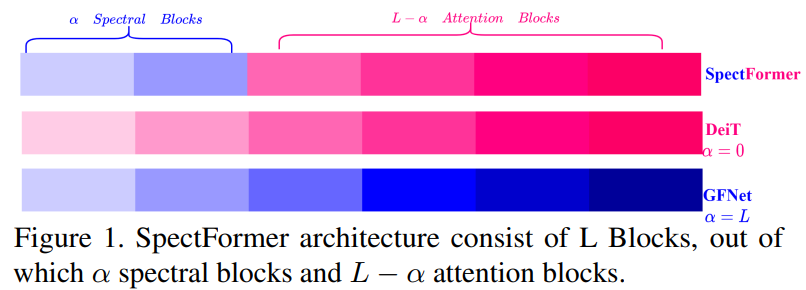
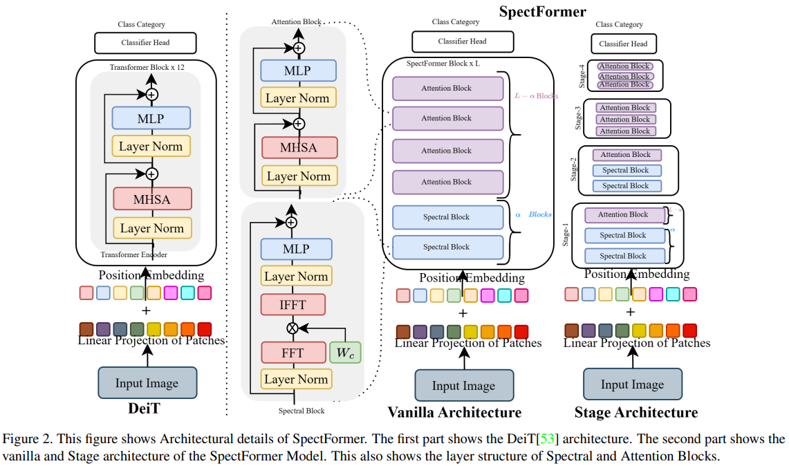
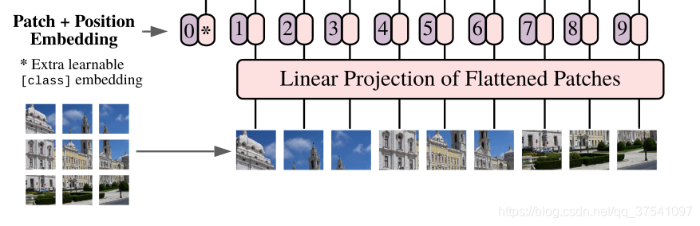

# Spectformer 频率模块和self-attention模块
> 'SpectFormer: Frequency and Attention is what you need in a Vision Transformer'   

这篇文章介绍了SpectFormer，这是一种专为计算机视觉任务设计的新型Transformer架构，它结合了频谱层（spectral layers）和多头注意力层（multi-headed attention layers），以有效捕获图像特征并提升图像识别任务的性能。

## 摘要
ViT已成功应用于图像识别任务。在文本模型中，既有类似于原始工作的基于多头自我注意的（ViT，**DeIT**），也有最近基于光谱层的（Fnet，**GFNet**，AFNO）。受光谱层和层次化Transformer相关工作的启发，论文观察到光谱和多头注意力层的结合能提供更好的Transformer架构，因此提出SpectFormer，使用傅立叶变换实现的光谱层来捕捉架构初始层中的相关特征。此外，在网络的较为深层使用多头自我注意。SpectFormer架构简单，它将图像标记转换到傅立叶域，然后使用可学习的权重参数应用门控技术，最后进行傅立叶逆变换以获取信号。SpectFormer结合了光谱注意力和多头注意力。

## 创新点：
> [!TIP|label:创新点]
> - **融合频谱与注意力机制：**
> 文章提出了一种新颖的Transformer架构——SpectFormer，它结合了频谱层（spectral layers）与多头注意力层（multi-headed attention layers），打破了以往仅依赖单一机制（如纯频谱或纯注意力）构建视觉Transformer的传统。这一创新设计旨在同时利用频谱分析和自注意力机制的优势，以更全面地捕获图像的特征表示。
> - **频谱层的应用与改进：**
> 1. SpectFormer采用傅立叶变换将图像映射到频域，利用频谱信息进行特征提取。相较于仅依赖多头注意力的传统Transformer，这种处理方式在计算复杂度上有所降低（O(N log N) 对比 O(N^2)），并且减少了参数数量。
> 2. 为了增强频谱层的表现力，SpectFormer引入了频谱门控技术（spectral gating technique），通过学习得到的权重参数对不同频率成分进行加权选择，使模型能够动态调整对不同频率成分的关注，从而更精准地捕获图像的结构信息。
> - **层次化与混合策略：**
> 在模型架构上，SpectFormer采用了层次化设计，通过调整参数α来决定网络中频谱块与注意力块的比例，实现了对图像特征提取深度的灵活控制。特别地，文章指出将频谱层置于网络较浅层，而将注意力层置于深层的配置最为有效，这有助于在早期阶段侧重于捕捉图像的局部频率特征，后期则关注全局上下文和长距离依赖关系。α越大，那么频率层越多。

## 模型整体架构

**SpectFormer架构包括线性patch嵌入层，后面是位置嵌入层，然后是spectformer块，然后是分类头MLP。**

### patch嵌入层+位置嵌入层

- 线性投影（Linear Projection）：
对每个patch应用一个线性变换（通常是卷积或全连接层），将其从像素值映射到一个低维向量空间，生成patch嵌入。
- 位置编码（Positional Embedding）：
添加位置信息：为每个patch嵌入添加位置编码，这些编码向量携带了patch在原始图像中的相对或绝对位置信息，帮助模型理解各patch间的空间布局

### spectformer层
- 频谱层（Spectral Layer）：
    - 傅立叶变换：对patch嵌入及其位置编码进行快速傅立叶变换（FFT），将图像信息从物理空间转换至频域，提取图像的局部频率特征，如边缘、纹理等。
    - 加权门控：在频域，对不同频率成分施加学习到的权重，突出重要的局部特征，抑制无关或噪声成分。
    - 逆傅立叶变换：将处理后的频域特征通过逆傅立叶变换还原至物理空间。
    - 层归一化与MLP：对IFFT后的特征进行层归一化，确保特征的稳定性。随后使用MLP进行通道混合，进一步丰富特征表达。
- 多头注意力层（Multi-Head Attention Layer）：
    - 多头自注意力：对patch嵌入应用多头自注意力机制，各头部并行计算注意力权重，捕获不同patch之间的依赖关系，特别是长距离依赖。这有助于模型理解图像的整体结构和全局上下文。
    - 层归一化与MLP
> 参数 $\alpha$ 用来控制两种former层的比例. $\alpha$个频谱层，$L-\alpha$个多头注意力层。在SpectFormer块中引入了一个因子，它控制光谱层和注意力层的数量。如果α=0，SpectFormer包括所有注意力层，类似于**DeIT-s**，而当α值为L时，SpectFormer变得类似于**GFNet**，具有所有光谱层。必须注意的是，所有注意力层都具有无法准确捕捉局部特征的缺点。类似地，所有光谱层都具有全局图像属性或语义特征无法准确处理的缺点。

### 分类头层
分类头（Classifier Head）：
- 全局平均池化（GAP）：对最后一层SpectFormer块输出的所有patch嵌入进行全局平均池化，得到一个全局特征向量，代表整张图像的抽象表示。
- 多层感知机（MLP）：将全局特征向量输入一个全连接层（MLP），将特征维度进一步压缩，并映射到与分类标签数相匹配的维度（如ImageNet的1000类）。
- softmax激活：对全连接层输出应用softmax函数，得到每个类别的概率得分。
## 实验结果
- 实验1：ImageNet-1K图像识别任务
结果：SpectFormer在ImageNet-1K数据集上显示出优秀的图像识别性能，相比GFNet-H和LiT，Top-1精度提高了2%。其中，SpectFormer-S（小型版本）达到84.25%的Top-1精度，为当前小规模模型的SOTA；SpectFormer-L（基线版本）达到85.7%的Top-1精度，成为同类规模Transformer模型的SOTA。

- 实验2：迁移学习任务
数据集：CIFAR-10, CIFAR-100, Oxford-IIIT flower, Stanford Car等标准数据集。
方法：使用在ImageNet-1K上预训练的SpectFormer模型进行迁移学习，以应对不同数据集上的图像识别任务。
结果：SpectFormer在这些迁移学习任务中表现出色，与最新的LITv2、RegionViT、PVT等模型相比，不仅明显优于ResNet模型，而且在各项任务中均达到与SOTA频谱网络GFNet相当甚至更高的性能。

- 实验3：MS COCO上的对象检测与实例分割
数据集与任务：MS COCO 2017数据集，用于评估模型在对象检测（object detection）和分割segmentation两个下游任务的表现。
方法：采用RetinaNet和Mask R-CNN两种检测框架，以预训练的SpectFormer作为主干网络进行微调（fine-tuning）。
结果：SpectFormer在MS COCO上展现出一致且与最佳骨干网络相当的性能。与GFNet-H和LiT等模型相比，使用GFL和Cascade Mask R-CNN检测器时，SpectFormer在不同IoU阈值下的平均精度（AP）均有提升，表明其在复杂场景下的目标检测和分割任务上具有竞争力。

- 实验4：模型变体与参数α的消融分析
目的：探究不同频谱层（如FN, FNO, WGN, FGN）对SpectFormer性能的影响，以及参数α对模型结构影响的敏感性分析。
结果：频谱层比较：消融研究表明，在小型网络中，Fourier Gating Network (FGN) 表现优于其他类型的频谱网络，被选为最佳频谱层。
参数α选择：通过不同α值的比较，确定了在SpectFormer架构中最佳的α值，以实现频谱层与注意力层的最佳比例配置。

- 实验5：高分辨率输入下的模型微调
数据集与分辨率：ImageNet，评估在更高分辨率（如384×384）输入下的模型性能。
方法：采用与先前研究相同的训练细节，对SpectFormer模型进行微调。
结果：与GFNet系列模型对比，SpectFormer在高分辨率输入下的性能显著优于GFNet的同规模基础网络。例如，SpectFormer-S(384)的性能比GFNet-S(384)高出1.2%，表明SpectFormer在处理高分辨率图像时依然保持高效，并能进一步提升识别精度。